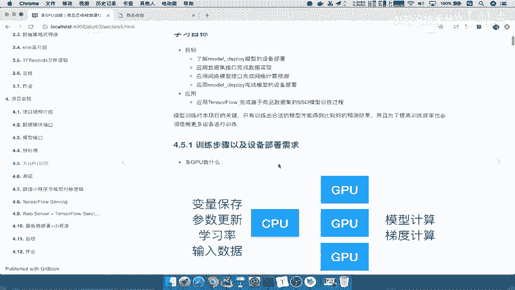
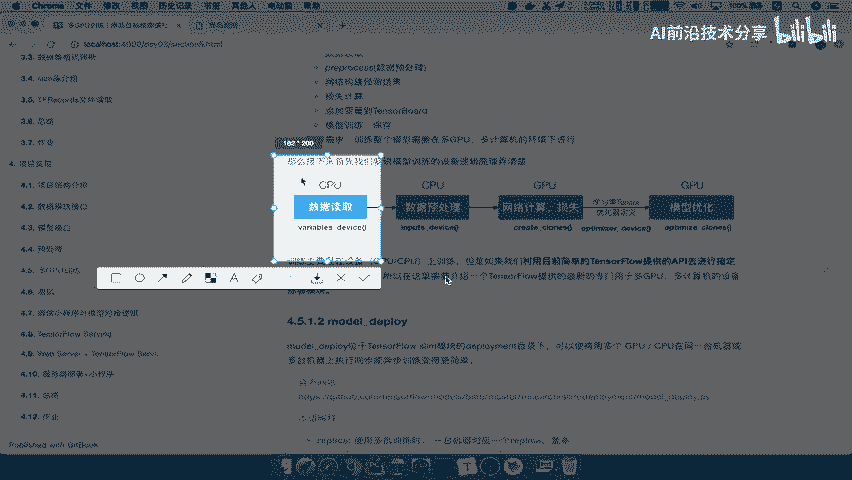
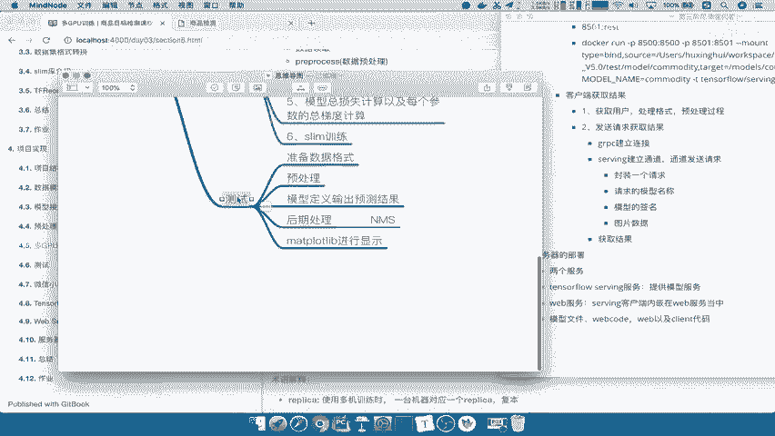
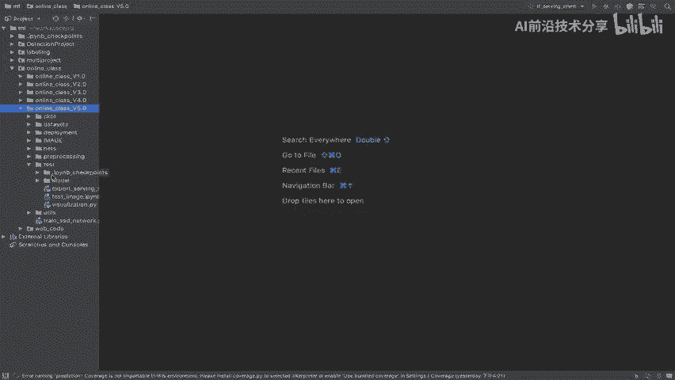
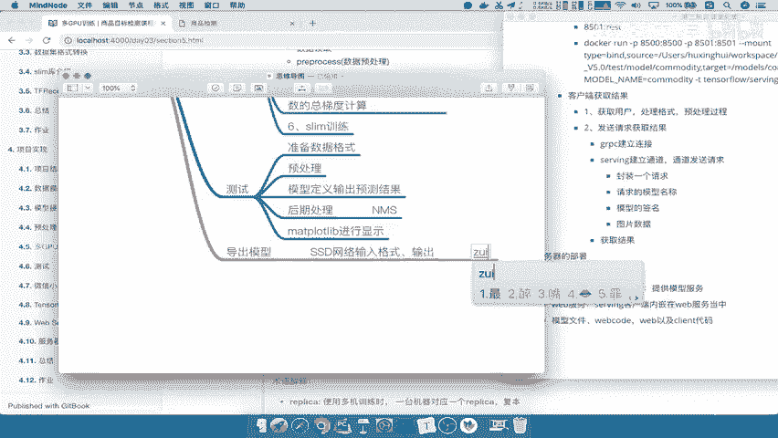
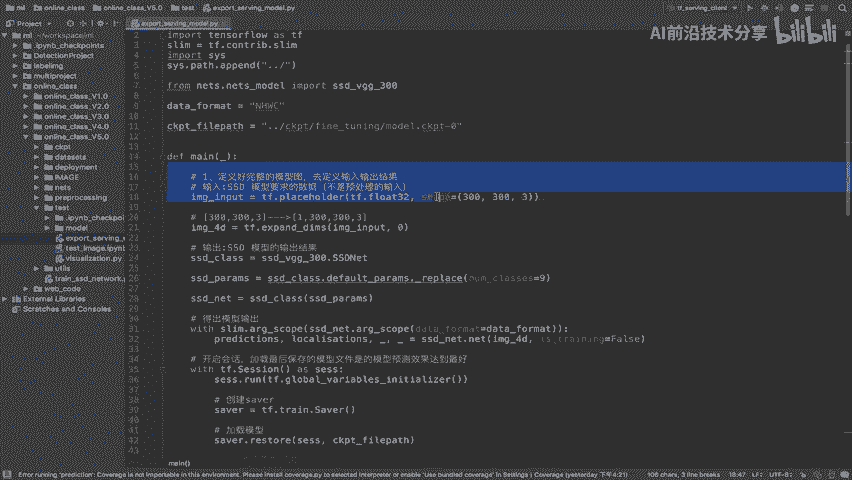
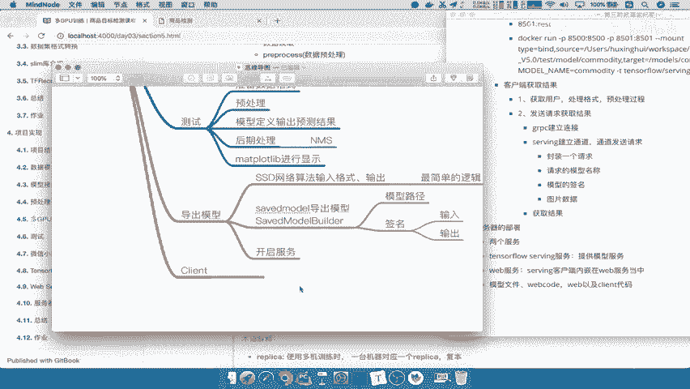
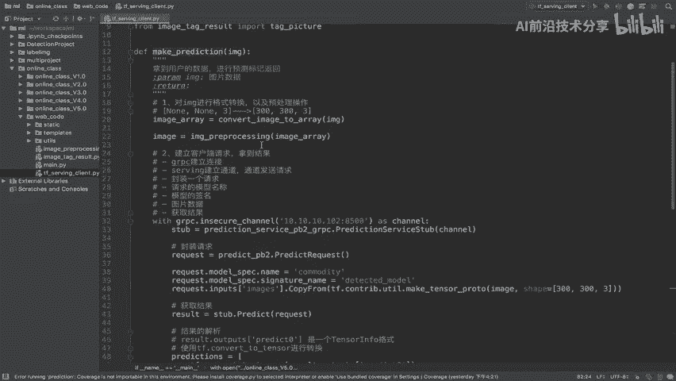
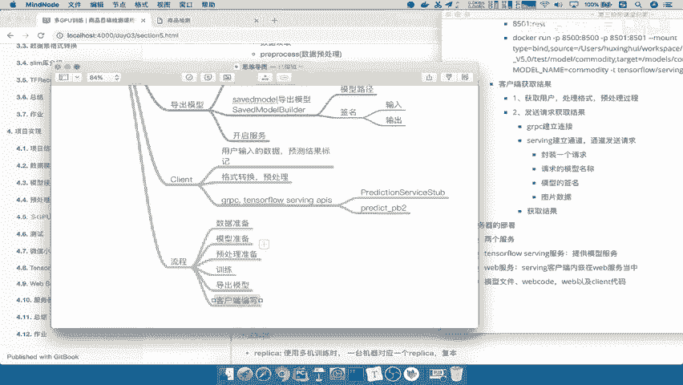

# 课程 P87：项目实现总结 🎯

在本节课中，我们将对整个目标检测项目进行回顾与总结。我们将梳理从数据集准备、模型训练到最终部署的完整流程，并总结其中涉及的核心技术点。

---

## 项目技术点总结

上一节我们完成了整个项目的流程，本节中我们来看看项目实现过程中用到了哪些关键技术。

以下是项目实现所涉及的主要技术点：

*   **训练框架**：使用 **TensorFlow** 及其子库 **Slim** 进行模型训练。
*   **训练流程**：使用 `tf.estimator` 等工具构建训练流程，并指定设备（如多GPU）进行分布式训练。
*   **可视化与测试**：使用 **Matplotlib** 进行结果可视化与绘图。
*   **模型部署**：使用 **TensorFlow Serving** 来部署训练好的模型。
*   **模型文件**：部署时需要提供符合 Serving 要求的模型文件。
*   **客户端编写**：编写客户端程序来请求 TensorFlow Serving 服务以获取预测结果。
*   **服务集成**：将客户端逻辑内嵌到 **Web 服务** 中进行托管。
*   **通信协议**：客户端与 Serving 之间使用 **gRPC** 协议进行高性能通信，其性能优于 REST API。

---

## 训练流程总结

了解了关键技术点后，我们再来详细回顾一下模型训练的完整步骤。

以下是训练流程的主要步骤：

1.  **设备配置与初始化**：指定训练设备（如CPU/GPU），并进行全局变量初始化。通常使用 `tf.device` 来指定，初始操作一般在 CPU 上完成。
2.  **数据获取与预处理**：读取数据集，进行数据预处理（如归一化、增强）以及正负样本标记。此步骤也通常在 CPU 上执行。
3.  **模型定义与复制**：将模型计算图复制到每个 GPU 设备上，定义网络前向传播、损失函数并计算损失。
4.  **优化器指定**：在 CPU 上指定学习率策略和优化器（如 Adam、SGD）。
5.  **梯度计算与汇总**：计算每个模型参数的梯度，并汇总所有设备上的总梯度。
6.  **模型训练**：使用优化器根据总梯度和损失更新模型参数，通常借助 `tf.train` 或 `slim.learning` 中的训练循环完成。

---

## 测试与模型导出流程

训练完成后，我们需要对模型进行测试并将其导出以供部署。本节中我们来看看测试和导出的关键步骤。

以下是测试与模型导出的流程：

*   **测试流程**：
    1.  准备测试数据并格式化。
    2.  对数据进行与训练时一致的预处理。
    3.  将数据输入模型，获取网络输出（预测结果）。
    4.  对输出进行后处理，包括应用非极大值抑制（NMS）等操作。
    5.  使用 Matplotlib 将带有预测标记的结果图像显示出来。

*   **模型导出流程**：
    导出用于部署的模型应保持最简单的逻辑，仅包含网络的核心计算。
    1.  明确定义模型的输入和输出张量。
    2.  使用 `tf.saved_model.builder.SavedModelBuilder` 来构建 SavedModel。
    3.  在构建器中指定模型保存路径，并定义签名（包含输入和输出）。
    4.  执行导出，生成 SavedModel 格式的模型文件。

---

## 服务部署与客户端编写

模型导出后，下一步就是启动服务并编写客户端进行调用。本节中我们来看看如何完成部署的最后环节。

以下是服务部署与客户端编写的要点：

1.  **开启服务**：使用 TensorFlow Serving 加载导出的模型文件，开启 gRPC 服务。
2.  **客户端编写**：
    *   建立与 Serving 服务的连接通道。
    *   实现完整的预测逻辑：接收用户输入（如图片），进行预处理和格式转换，发送请求，接收预测结果，并对结果进行后处理和标记。
    *   主要使用 `tensorflow_serving.apis` 中的 `PredictionServiceStub` 和 `predict_pb2` 等 API 进行通信。
3.  **Web服务集成**：将编写好的客户端逻辑集成到 Web 后端框架（如 Flask、Django）中，通过 Web 服务对外提供 API 接口。

---

## 完整项目流程回顾

最后，让我们串联起整个项目的生命周期，形成一个清晰的脉络。

整个项目的实现遵循以下完整流程：
**数据准备 -> 模型与预处理准备 -> 模型训练 -> 模型导出 -> 客户端编写 -> Web服务集成**。

---

本节课中我们一起学习了目标检测项目的完整实现总结。我们从技术栈、训练流程、测试导出、服务部署等多个维度进行了梳理，旨在帮助你系统地理解一个机器学习项目从开发到上线的全貌。掌握这个流程，对于你未来实现其他AI项目将大有裨益。