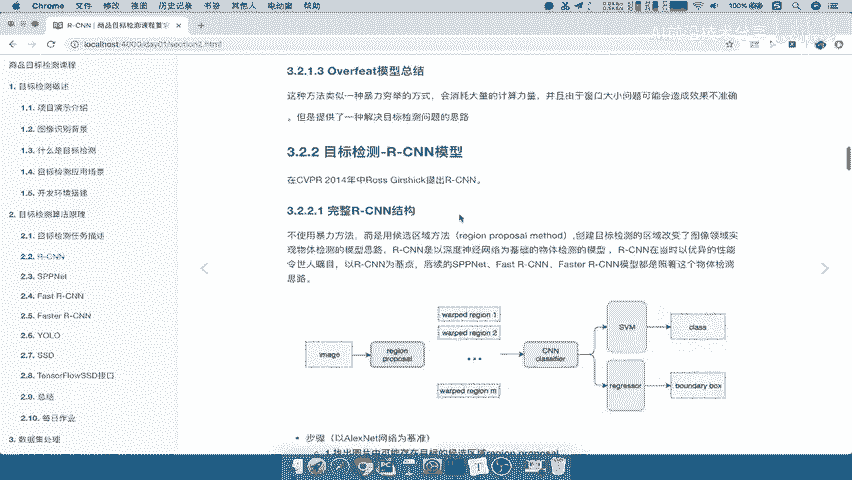
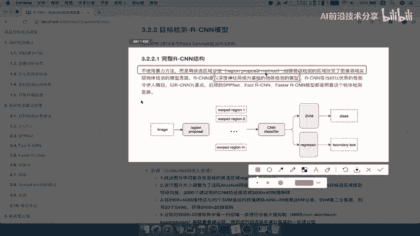
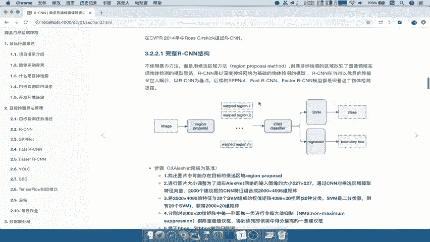
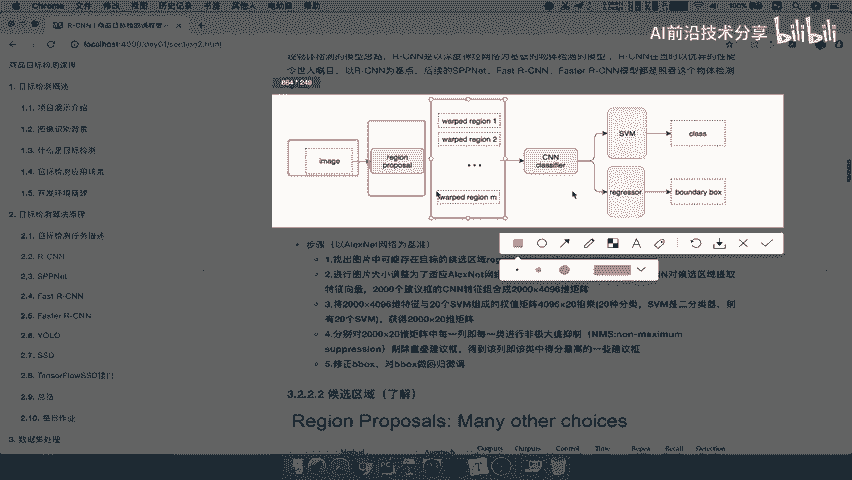
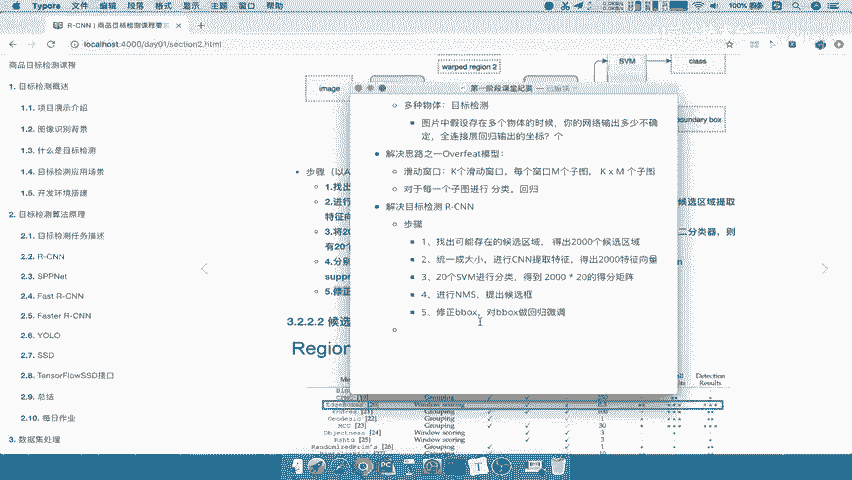

# 课程P9：9.02_RCNN：步骤流程介绍 🎯

在本节课中，我们将要学习目标检测领域一个里程碑式的算法——RCNN。我们将详细介绍其核心思想、完整的工作流程以及每一步的具体操作，帮助你理解它是如何解决多目标检测问题的。

---

上一节我们介绍了OverFeat模型及其滑动窗口的检测思路。本节中，我们来看看一个更高效、影响深远的算法——RCNN。

RCNN于2014年在CVPR会议上被提出。它摒弃了OverFeat中暴力滑窗的方法，转而使用“候选区域”策略，并首次将深度神经网络成功应用于目标检测任务。这奠定了后续众多检测模型的基础。

以下是RCNN的完整结构图，我们先对其有一个整体的认识。

如图所示，RCNN的流程主要分为四个阶段：
1.  输入一张图片，生成约2000个候选区域。
2.  将每个候选区域调整到固定尺寸，并送入CNN网络提取特征向量。
3.  将每个特征向量输入一组SVM分类器，判断其属于哪个类别。
4.  使用非极大值抑制剔除重叠框，并通过回归网络精细调整边界框位置。

接下来，我们将逐一拆解这些步骤。

---

### 第一步：生成候选区域 (Region Proposal)

RCNN的第一步是找出图片中所有可能包含目标的候选区域。这与OverFeat生成候选框的思路类似，但方法更高效。常用的算法如Selective Search会生成约2000个候选框，而非暴力遍历所有位置。

**核心操作**：`region_proposals = selective_search(image)`
此步骤的输出是一个包含约2000个候选框坐标的列表。

---

### 第二步：调整尺寸与特征提取

由于CNN网络（如AlexNet）需要固定尺寸的输入，我们必须将形状各异的候选区域统一缩放（例如到227x227像素）。接着，每个调整后的区域被送入一个预训练好的CNN网络（如AlexNet）中，从最后的全连接层提取出固定长度的特征向量。

以下是该步骤的简要描述：
*   统一尺寸：将所有候选区域缩放至固定大小。
*   特征提取：将每个区域输入CNN，得到一个高维特征向量。

对于2000个候选区域，我们将得到2000个特征向量。

---

### 第三步：SVM分类

上一步我们得到了2000个特征向量，这一步我们将利用它们进行目标分类。

RCNN为每一个待检测的类别（例如VOC数据集的20个类别）都训练了一个独立的SVM二分类器。每个特征向量会依次通过这20个SVM，从而判断其是否属于某个类别以及相应的置信度得分。

**结果**：得到一个 `2000 x 20` 维的得分矩阵，矩阵中的每个值代表对应候选框属于某个类别的得分。

---

### 第四步：非极大值抑制与边界框回归

经过SVM分类后，我们得到了大量带有类别得分的候选框，其中很多框指向同一个物体且相互重叠。

首先，我们需要使用**非极大值抑制**来剔除冗余框。NMS会为每个类别保留得分最高且与其他高得分框重叠度（IoU）较低的框。

**核心概念**：**非极大值抑制 (NMS)**，用于去除冗余检测框。

最后，为了更精确地定位物体，RCNN使用一个**边界框回归器**对保留下来的候选框进行微调，使其更紧密地贴合真实物体的边界。

**核心操作**：
1.  `selected_boxes = NMS(all_boxes, scores)`
2.  `refined_boxes = BBox_Regressor(selected_boxes)`

---

本节课中我们一起学习了RCNN目标检测算法的完整流程。我们从生成候选区域开始，经历了统一尺寸、CNN特征提取、SVM分类，最后通过非极大值抑制和边界框回归得到精确的检测结果。RCNN的核心贡献在于引入了“候选区域+CNN特征提取”的两阶段范式，极大地提升了检测精度，成为深度学习目标检测的开山之作。