# 图机器学习会议：P02：几何生成模型教程


## 概述

在本教程中，我们将学习几何生成模型。我们将从现代生成模型的基础知识开始，然后深入探讨如何将几何概念融入这些模型，最后学习如何实际构建和实现几何生成模型。本教程旨在为初学者提供一个清晰、实用的入门指南。

---

## 第一部分：无模拟生成模型

上一节我们介绍了本教程的整体结构，本节中我们来看看生成模型的基本问题设定和现代方法。

### 生成模型问题设定

我们有一个未知的数据分布 \( Q \)，通常只能通过有限样本集 \( \{x_1, x_2, ..., x_n\} \) 来访问它。我们的目标是学习一个采样器，能够从这个未知分布中高效地生成新样本。

在深度生成建模中，我们学习一个带参数 \( \theta \) 的神经网络。生成模型可以抽象为两个对象的元组：
*   **生成器** \( \psi_\theta \)：一个允许从学习到的数据分布中生成新样本的函数。
*   **底层密度** \( p_\theta \)：由该生成器函数定义的密度。

我们的目标是找到参数 \( \theta \)，使得我们的生成器创建的底层密度 \( p_\theta \) 近似于目标密度 \( Q \)。

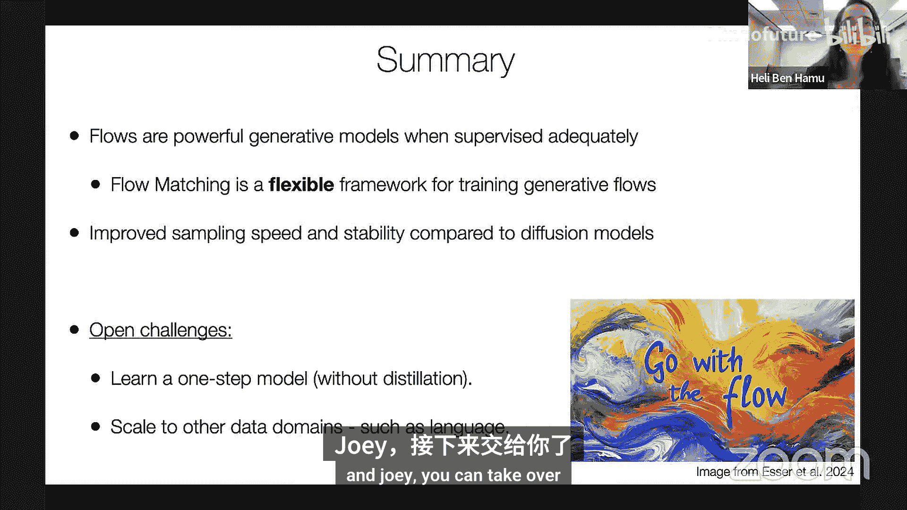


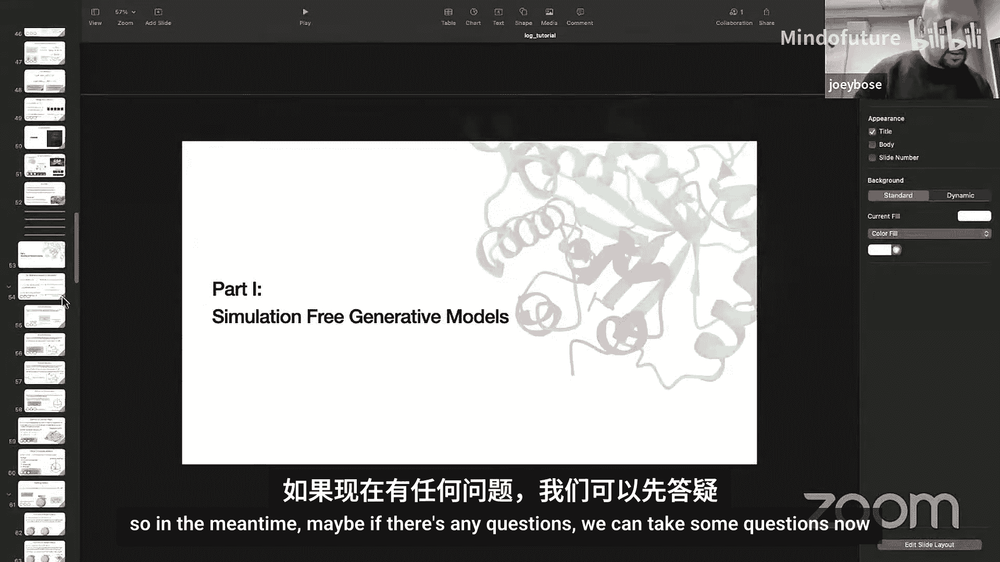

### 生成模型范式

以下是深度生成建模的几种主要范式：

*   **自回归模型**：基于似然的模型，顺序生成信号。生成顺序取决于信号维度，在语言建模中效果很好，但对于图像或几何应用（其中像素或数据元素的顺序不明确）则不太直接。
*   **生成对抗网络**：生成器是一个神经网络，它将来自低维潜在空间的潜在向量转换为数据样本。训练涉及定义一个判别器，解决一个极小极大问题，可能难以训练，但支持快速采样。
*   **变分自编码器**：定义一个自编码器，其潜在向量被限制为从某个分布中采样。支持快速采样，但通常性能不及GANs。

在本教程中，我们将重点讨论**作为生成模型的动态系统**。

### 动态系统作为生成模型

我们将生成模型视为一个时间相关过程。一个动态系统描述了点样本随时间的演化。我们引入一个时间相关的生成器 \( \psi_\theta(t, x_0) \)。采样变成了模拟：给定一个源分布，我们采样一个初始点 \( x_0 \)，然后模拟这个过程，使得在时间 \( t=1 \) 时，我们到达目标分布 \( Q \)。

有两种主要的动态系统用于开发生成模型：

1.  **流模型**：由常微分方程描述。
    \[
    dx_t = u_t(x_t) dt
    \]
    其中 \( u_t \) 是速度场，定义了无穷小步长的方向。这是一个确定性过程。

2.  **扩散模型**：由随机微分方程描述。
    \[
    dx_t = f_t(x_t) dt + g_t dW_t
    \]
    其中 \( f_t \) 是漂移项，\( g_t \) 是扩散系数，\( W_t \) 是布朗运动。这是一个随机过程。

### 流匹配

流匹配是一种训练流模型的免模拟方法。其核心思想是：速度场生成一个概率路径，当且仅当它满足连续性方程。因此，如果我们能构建一个从源分布开始、最终近似目标分布的概率路径，我们就可以通过回归速度场来学习生成模型。

以下是构建流匹配模型的关键步骤：

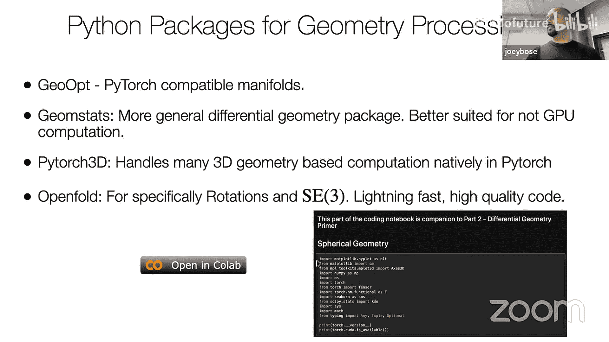

1.  **构建目标概率路径**：我们通过构建条件概率路径来构建边际概率路径 \( p_t(x) \)。边界条件是：在时间 \( t=0 \) 时为源分布 \( p_0 \)，在时间 \( t=1 \) 时近似目标分布 \( q \)。
    \[
    p_t(x) = \int p_t(x|z) q(z) dz
    \]
    其中 \( z \) 是条件（例如数据点 \( x_1 \)）。

2.  **定义条件流和速度场**：对于条件路径 \( p_t(x|z) \)，存在一个生成它的条件速度场 \( u_t(x|z) \)。边际速度场可以通过对条件速度场进行边际化得到。
    \[
    u_t(x) = \frac{\int u_t(x|z) p_t(x|z) q(z) dz}{p_t(x)}
    \]

3.  **寻找可处理的优化目标**：可以证明，最小化流匹配损失等价于最小化条件流匹配损失。这为我们提供了一个可处理的训练目标。
    \[
    \mathcal{L}_{FM}(\theta) = \mathbb{E}_{t, z, x_t} \left[ \| u_\theta(t, x_t) - u_t(x_t|z) \|^2 \right]
    \]
    其中 \( u_\theta \) 是我们学习的神经网络速度场。

4.  **构建条件流**：一个流行的选择是仿射条件流。
    \[
    \phi_t(x|z) = \alpha_t z + \sigma_t x_0
    \]
    其中 \( \alpha_t \) 和 \( \sigma_t \) 是时间相关的系数。对应的条件速度场为：
    \[
    u_t(\phi_t(x|z)|z) = \dot{\alpha}_t z + \dot{\sigma}_t x_0
    \]
    特别地，选择线性路径（条件最优传输）时，\( \alpha_t = t, \sigma_t = 1-t \)，速度场简化为 \( u_t = z - x_0 \)。

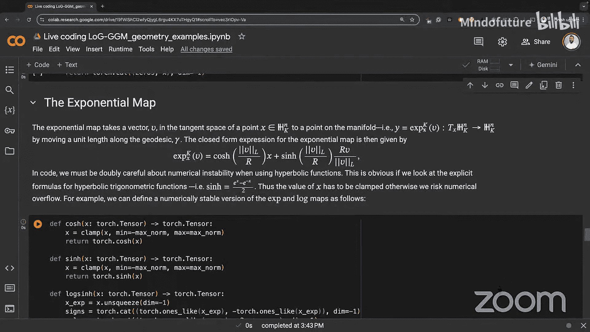

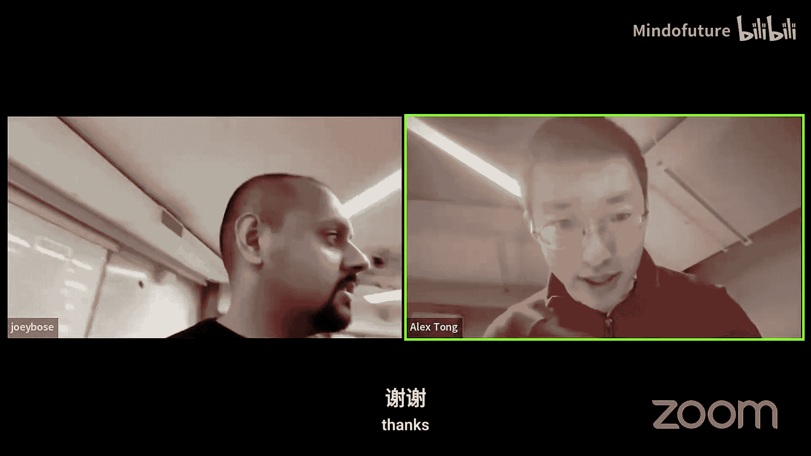

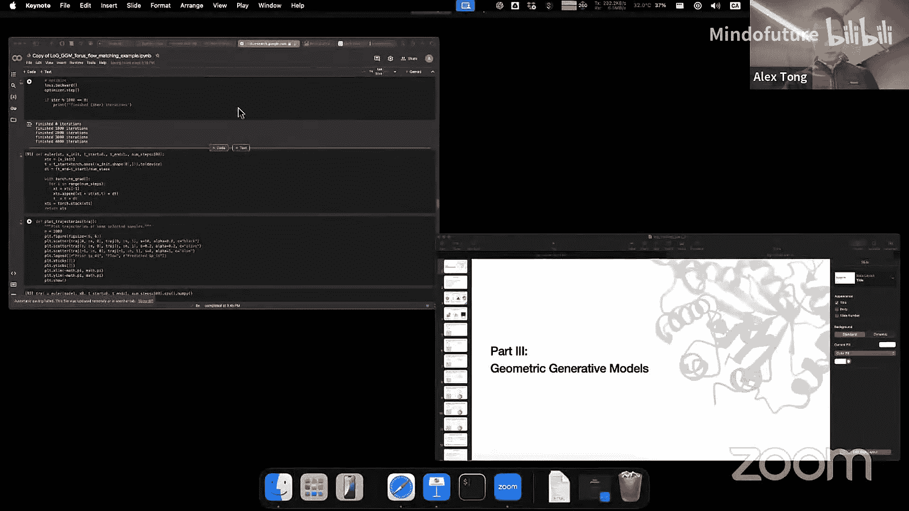


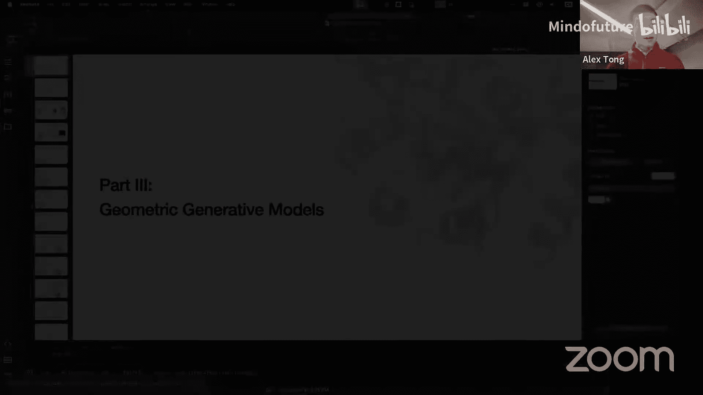

### 流匹配总结

在本节中，我们一起学习了如何利用流匹配框架构建生成模型。其核心步骤是：

1.  给定目标分布 \( Q \) 的样本，构建一个概率路径 \( p_t \)，使其在 \( t=0 \) 时为源分布，在 \( t=1 \) 时近似 \( Q \)。
2.  通过构建条件流（如仿射条件流）来定义该路径。
3.  使用条件流匹配损失学习一个速度场 \( u_\theta \)，其目标是回归到条件速度场。
4.  学习到的速度场定义了生成目标概率路径 \( p_t \) 的边际流。

与扩散模型相比，流匹配更加灵活（可以使用任意源分布和目标分布），定义在有限时间区间上，并且通常能提供更快的采样速度和稳定性。

---

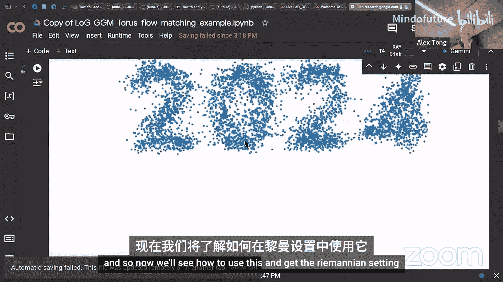

## 第二部分：几何机器学习工具

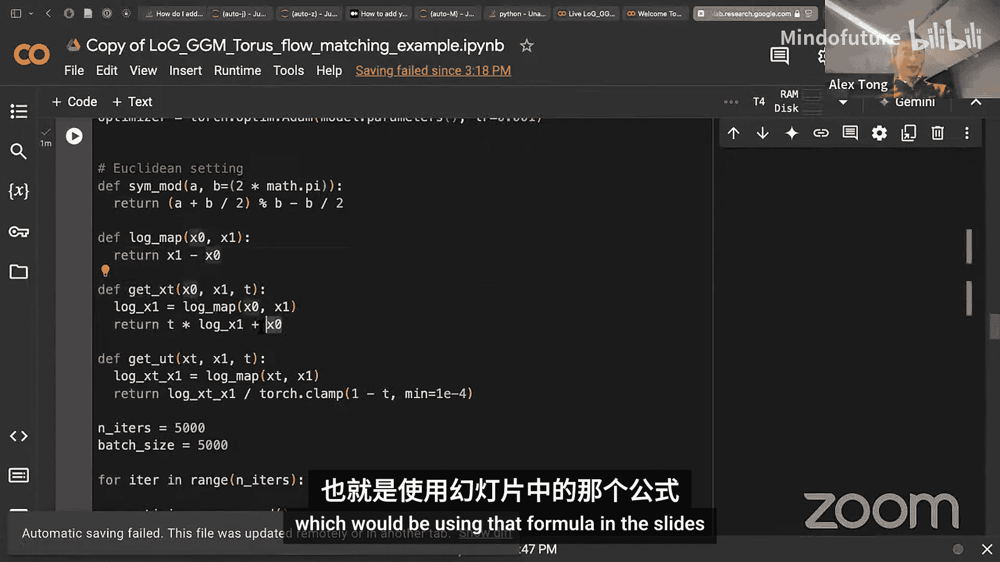


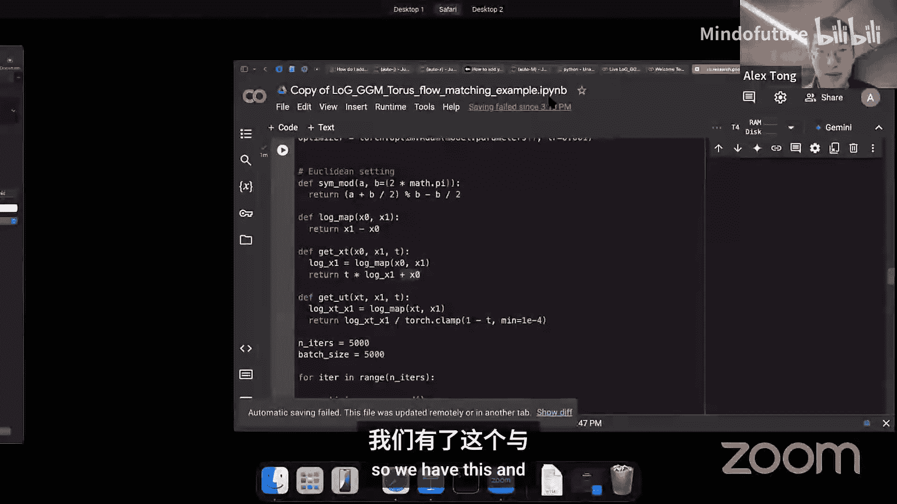

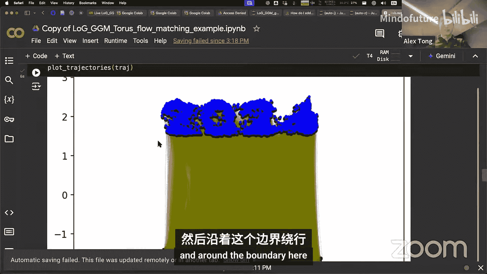

上一节我们介绍了流匹配生成模型，本节中我们来看看如何为这些模型引入几何结构。

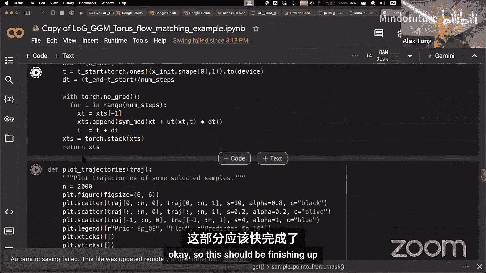

### 流形上的生成模型挑战

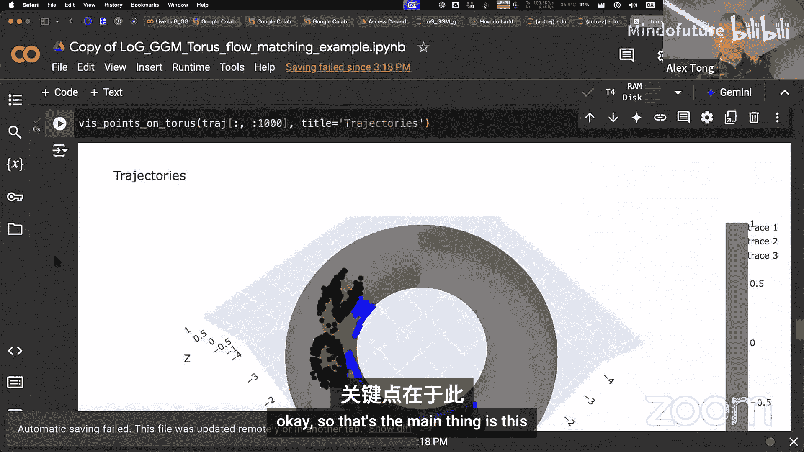

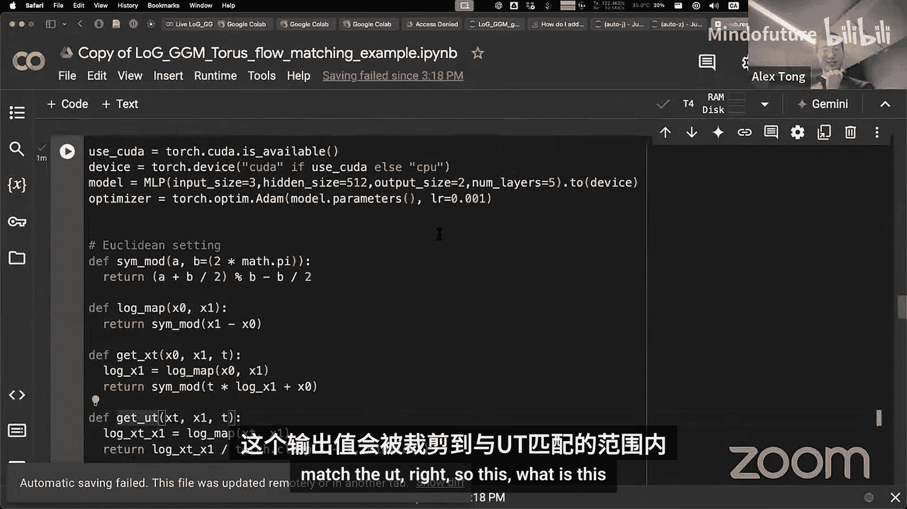

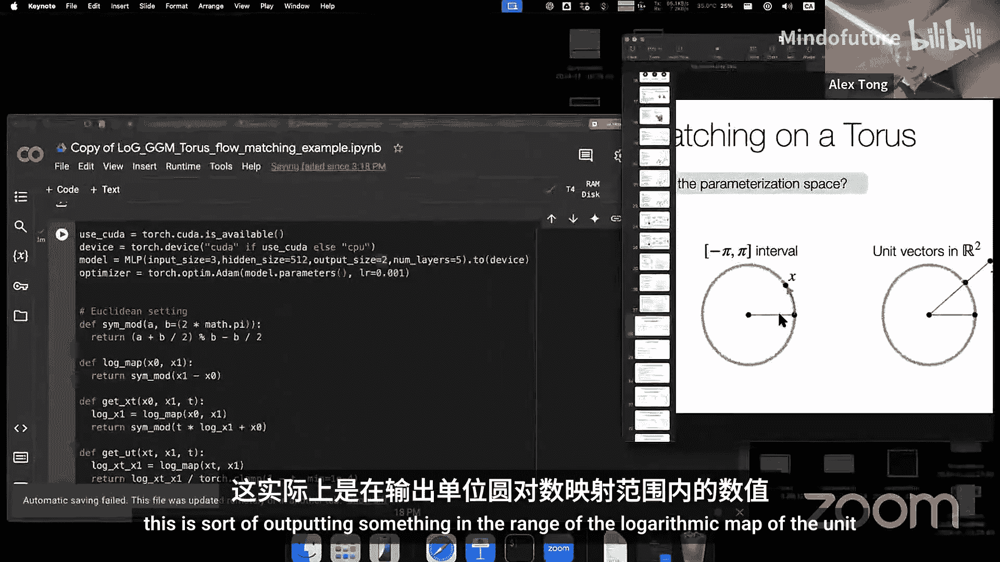

当数据位于流形而非欧几里得空间时，我们需要重新思考许多概念：
*   **数据表示**：如何表示流形上的点？
*   **概率路径**：如何构造流形上的“直线”路径？
*   **条件流**：如何定义流形上的仿射组合？
*   **速度场**：如何定义和参数化流形上的向量场？
*   **源分布**：流形上没有高斯分布的标准定义。

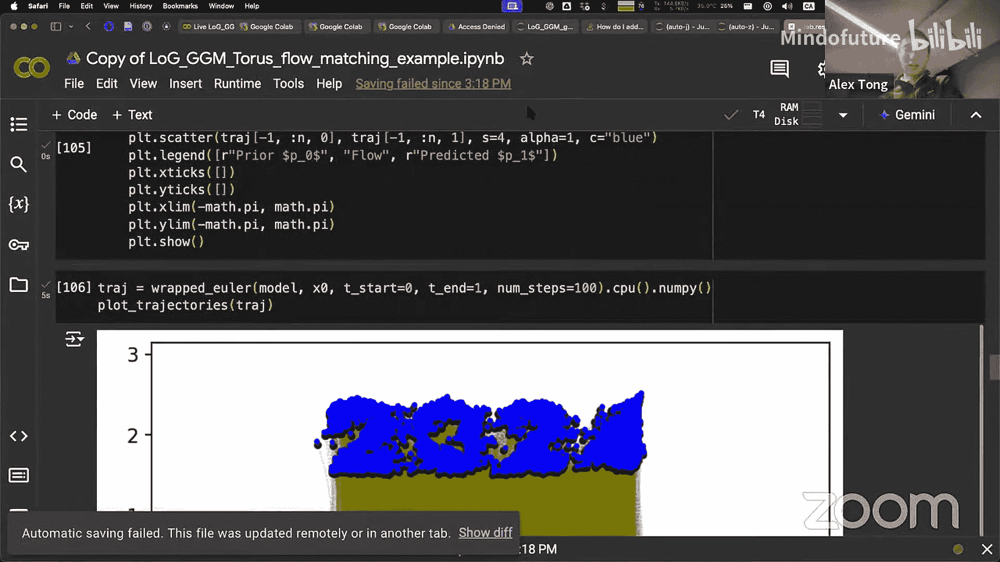

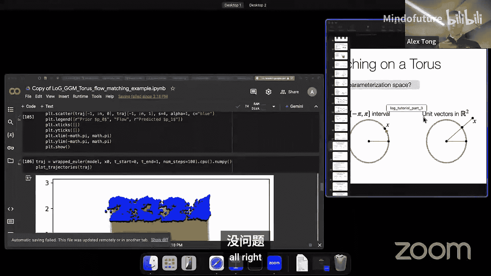

### 流形基础

为了进行生成建模，我们需要为流形添加一些结构。

*   **流形定义**：一个流形是一个光滑的拓扑空间，局部类似于向量空间（通过图表），但整体结构可能不同。
*   **参数化**：
    *   **外在参数化**：将流形嵌入到更高维的欧几里得空间 \( \mathbb{R}^m \) 中。优点是可以在环境空间中使用熟悉的向量运算。
    *   **内在参数化**：使用覆盖流形的局部图表。可能面临数值不稳定性（例如球极投影在极点附近）。
*   **切空间与切向量**：在流形上每一点 \( p \)，都有一个切空间 \( T_pM \)，包含所有在该点与流形相切的向量。切向量可以形式化地定义为通过该点的曲线的导数。
*   **黎曼度量**：为了计算损失函数中的范数（如 \( \| u_\theta - u_t \|^2 \)），我们需要在切空间上定义内积。黎曼度量 \( g_p \) 为每个点 \( p \) 的切空间平滑地分配了一个内积。它允许我们定义向量的长度、角度和点之间的距离。
    *   **范数**：\( \|v\|_g = \sqrt{g_p(v, v)} \)
    *   **距离**：两点间的最短路径称为测地线，其长度由度量决定。


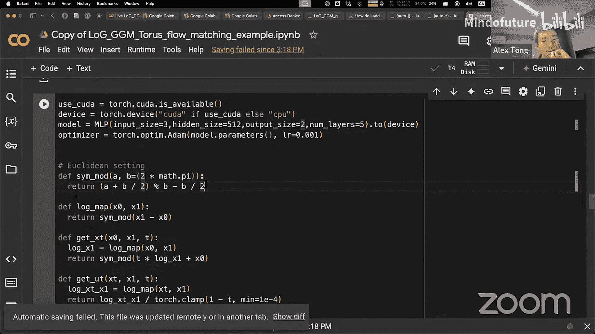


### 流形上的关键操作


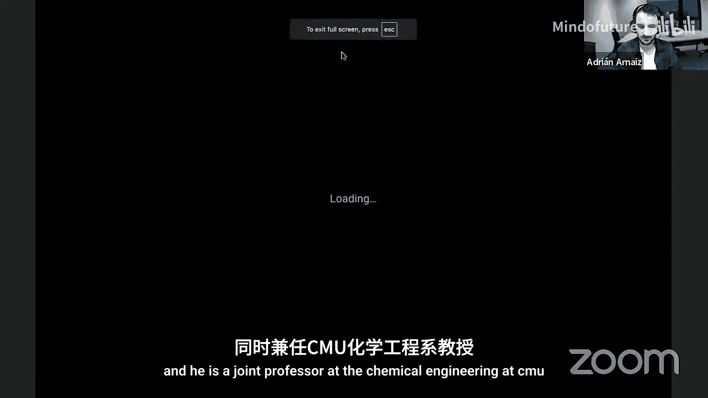

为了在流形上进行积分（模拟ODE），我们需要三个关键操作：

1.  **指数映射** \( \text{Exp}_p(v) \)：给定点 \( p \) 和切向量 \( v \)，沿着由 \( v \) 决定的测地线移动单位时间，到达流形上的一点。类似于欧氏空间中的加法 \( p + v \)。
2.  **对数映射** \( \text{Log}_p(q) \)：指数映射的逆。给定点 \( p \) 和 \( q \)，返回切空间 \( T_pM \) 中的一个向量 \( v \)，使得 \( \text{Exp}_p(v) = q \)。给出了从 \( p \) 到 \( q \) 的“方向”和“距离”。
3.  **平行移动** \( \Gamma_{p \to q}(v) \)：将切向量 \( v \) 从点 \( p \) 的切空间沿着一条曲线（通常是测地线）移动到点 \( q \) 的切空间，保持向量的某种不变性（如与另一向量的内积）。

### 流形上的流匹配

现在我们可以将欧氏流匹配提升到黎曼流形上。

*   **目标预测参数化**：在欧氏空间中，损失可以是速度场回归或目标点回归。在流形上，我们同样可以最小化预测目标点 \( \hat{x}_1 \) 与真实目标点 \( x_1 \) 之间的测地距离。
    \[
    \mathcal{L} = \mathbb{E} \left[ d_g( \hat{x}_1, x_1)^2 \right]
    \]
    其中 \( d_g \) 是由度量 \( g \) 诱导的距离。

*   **流形上的条件流**：欧氏空间中的线性插值 \( x_t = (1-t)x_0 + t x_1 \) 被替换为测地线插值。
    \[
    x_t = \text{Exp}_{x_0} \left( t \cdot \text{Log}_{x_0}(x_1) \right)
    \]
    对应的速度场为：
    \[
    u_t(x_t) = \frac{\text{Log}_{x_t}(x_1)}{1 - t}
    \]

*   **流形上的ODE积分**：欧拉积分步骤 \( x_{t+\Delta t} = x_t + u_t(x_t) \Delta t \) 被替换为：
    \[
    x_{t+\Delta t} = \text{Exp}_{x_t} \left( u_t(x_t) \Delta t \right)
    \]
    这确保了积分路径始终保持在流形上。

### 几何生成模型总结

在本节中，我们一起学习了为生成模型构建几何工具所需的核心概念：

1.  **流形表示**：选择外在或内在参数化，考虑数值稳定性和计算便利性。
2.  **黎曼度量**：添加度量结构以定义距离、角度和范数，这对于计算损失函数至关重要。
3.  **流形操作**：指数映射、对数映射和平行移动是模拟流形上动态系统的基本操作。
4.  **流形上的流匹配**：通过使用测地线作为条件路径，并将欧拉积分步骤替换为指数映射步骤，可以将流匹配框架自然地扩展到黎曼流形上。

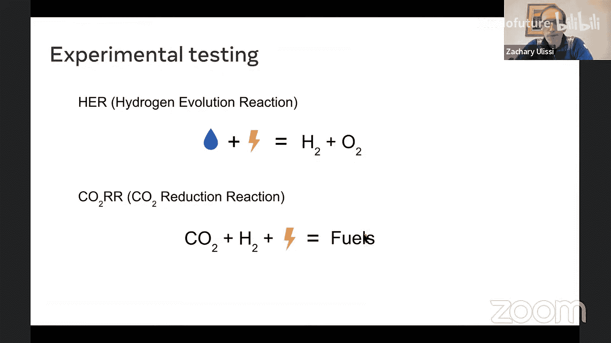

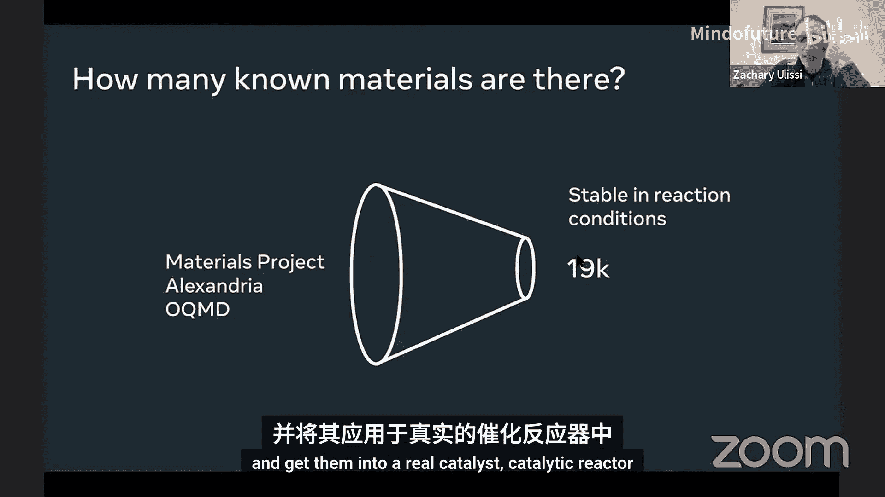

对于流形上的生成建模，流匹配通常比扩散模型更简单，因为它避免了在流形上定义布朗运动和分数函数的额外复杂性。

---

## 第三部分：结合几何与生成模型实践

上一节我们介绍了流形上的几何工具，本节中我们来看看如何将这些工具与生成模型结合，并应用于实际问题。

### 从欧氏到黎曼流匹配

将欧氏流匹配公式推广到黎曼流形，核心是将向量加法和减法替换为指数映射和对数映射。

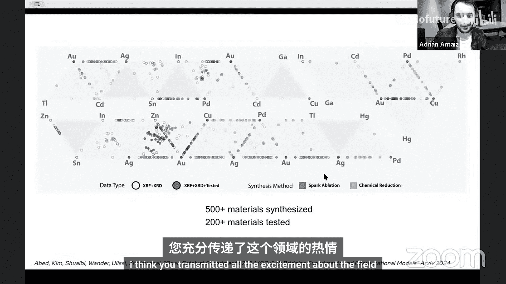

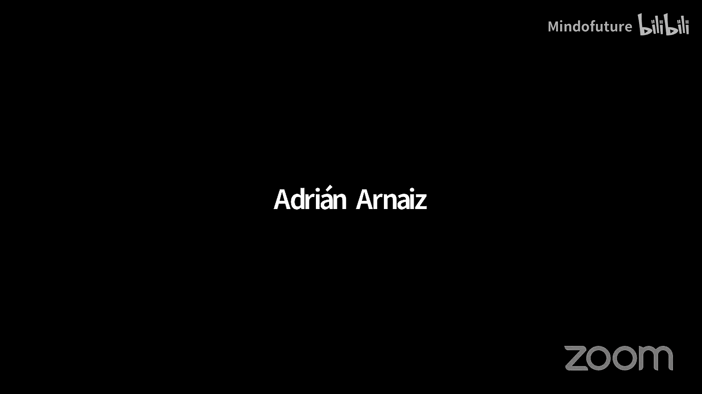

*   **欧氏流匹配（回顾）**：
    *   条件流：\( x_t = (1-t)x_0 + t x_1 \)
    *   速度场：\( u_t(x_t) = x_1 - x_0 \)
*   **黎曼流匹配**：
    *   条件流（测地线插值）：
        \[
        x_t = \text{Exp}_{x_0} \left( t \cdot \text{Log}_{x_0}(x_1) \right)
        \]
    *   速度场：
        \[
        u_t(x_t) = \frac{\text{Log}_{x_t}(x_1)}{1 - t}
        \]

### 案例研究：蛋白质设计与流形表示

蛋白质设计是几何生成模型的一个重要应用领域。蛋白质可以表示为：
*   **原子点云**：所有原子的3D坐标。可以在欧氏空间中处理，但忽略了已知的化学约束。
*   **刚体框架**（在 \( SE(3) \) 中）：每个氨基酸残基的位置和方向。这捕捉了主链的几何结构。
*   **扭转角**：描述侧链旋转的角度。位于环面 \( \mathbb{T}^n \) 上。

AlphaFold2等模型使用了 \( SE(3) \) 和环面表示，将几何先验知识（如键长、键角）编码到表示中，使模型更容易学习。

### 环面上的流匹配编码示例

以环面 \( \mathbb{T}^1 \)（圆）为例，说明参数化选择的重要性。

*   **角度参数化**：直接输出角度 \( \theta \in [-\pi, \pi) \)。问题是在边界 \( \pi \) 和 \( -\pi \) 处存在不连续性。
*   **单位向量参数化**：输出二维单位向量 \( (\cos\theta, \sin\theta) \)。这是一个光滑的嵌入，没有边界不连续性，但需要输出两倍的维度。

在实现环面流匹配时，关键点是：
1.  **对数映射**：计算从 \( \theta_0 \) 到 \( \theta_1 \) 的最短方向，需要处理模 \( 2\pi \) 的环绕。
    ```python
    def log_map(theta0, theta1):
        diff = theta1 - theta0
        # 选择最短路径
        return (diff + np.pi) % (2 * np.pi) - np.pi
    ```
2.  **指数映射**：将切空间中的向量加回到角度，并处理环绕。
    ```python
    def exp_map(theta, v):
        return (theta + v + np.pi) % (2 * np.pi) - np.pi
    ```
3.  **ODE积分**：使用指数映射进行更新。
    ```python
    theta_next = exp_map(theta_current, velocity * dt)
    ```

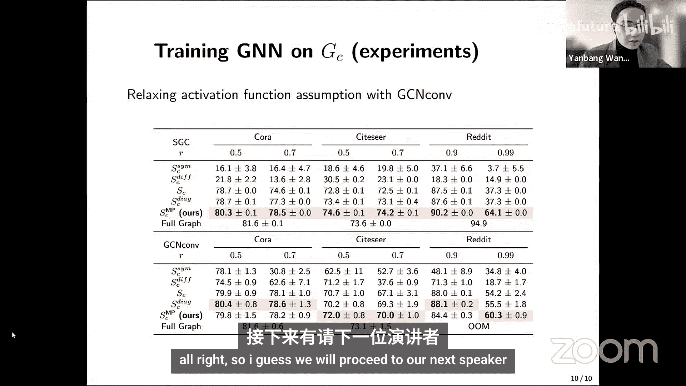


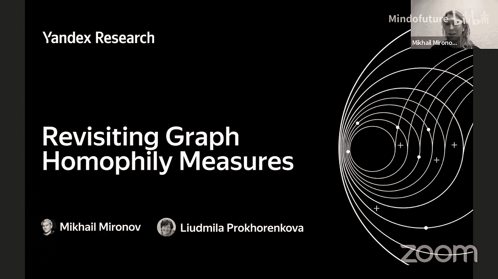

### 实用技巧与开放挑战

*   **参数化选择**：倾向于选择更接近欧氏空间、更光滑的参数化（如单位向量 vs 角度），即使维度稍高，这通常能带来更好的训练稳定性。
*   **向量场参数化**：实践中，许多模型选择“目标预测”参数化，即神经网络直接预测目标点 \( \hat{x}_1 \)，然后利用对数映射计算所需的速度场 \( u_t = \text{Log}_{x_t}(\hat{x}_1)/(1-t) \)。这通常更稳定。
*   **等变性**：对于像 \( SE(3) \) 这样的对称群，构建等变网络架构很重要，但最新的模型（如AlphaFold3）也展示了在环境坐标中直接操作的可能性。
*   **开放挑战**：
    *   **采样速度**：流匹配仍需模拟ODE，采样涉及多次网络前向传播。研究一步生成模型是一个挑战。
    *   **非参数化流形**：对于数据驱动的、没有解析形式的流形，如何定义几何操作和生成模型仍是开放问题。
    *   **损失景观**：不同参数化如何影响流形上生成模型的训练动态和损失景观，尚缺乏深入分析。

### 总结

在本教程中，我们一起学习了几何生成模型的完整流程：

1.  **生成模型基础**：我们了解了流匹配作为一种强大、灵活的生成建模框架，它允许我们在任意源分布和目标分布之间学习确定性变换。
2.  **几何工具**：我们引入了流形、黎曼度量、指数映射和对数映射等概念，这些是将生成模型扩展到非欧几何数据所必需的。
3.  **实践结合**：我们看到了如何将流匹配公式推广到黎曼流形，并通过蛋白质设计的例子了解了不同几何表示的选择。我们还讨论了环面上的具体实现细节和实用技巧。

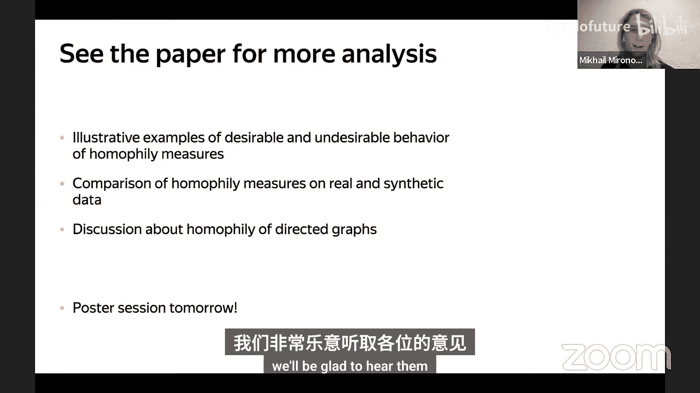

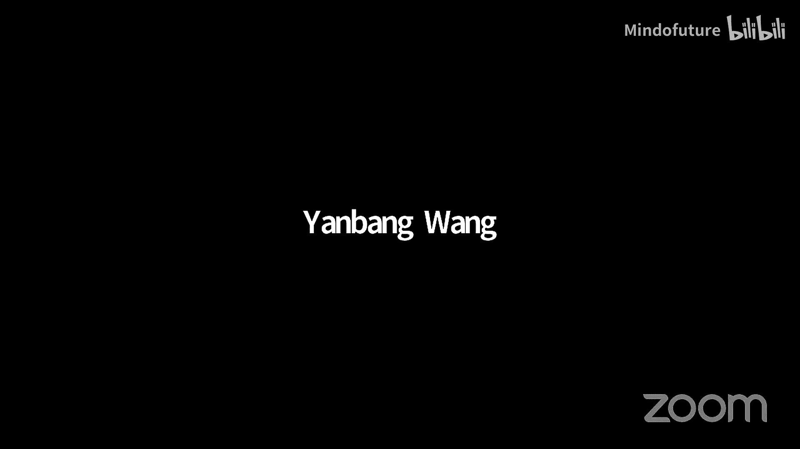

几何生成模型是一个快速发展的领域，为蛋白质设计、机器人学、气候建模等许多科学应用提供了强大的工具。希望本教程为你提供了坚实的入门基础，并激发了你在这一领域进行探索的兴趣。