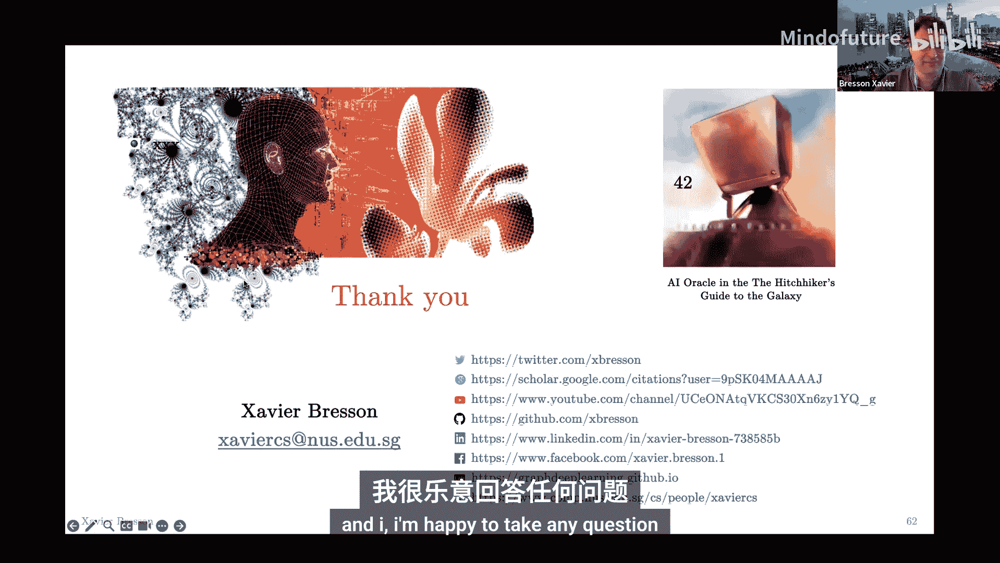
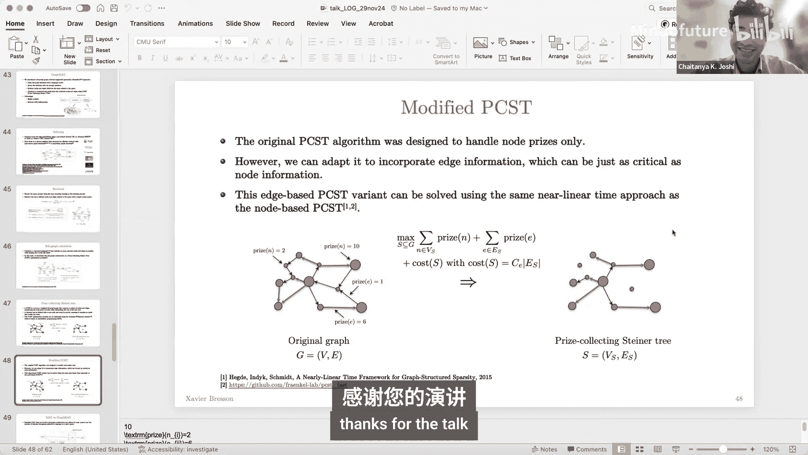

# 图机器学习会议 ｜ Learning On Graphs Conference 2024 p03 P03_Integrating_Large_Language_Models_and_Graph_Neural_Networks -BV1k9pAzpE8S_p3-

All right， so I think we can start I'll keep it very brief it's my pleasure to introduce Xavier Bsson Xaviers associate professor at National University of Singapore and。

He needs no introduction。 He is the pioneer of G deep learning。

 He has some of the most sightted works， has organized several conferences and tutorials。

 including being a huge supporter of the learninging on Gs conference and winning some of the biggest individual grants for this research。

 So Zavier take it away。😊，All right， thank you for the introduction Chaa so welcome everyone and thank you for joining so I'm excited to talk to you about Graph neural network and large language models。

 so this is a collaborative work with Shao Shiinhe， Brian Hoy， Thomas Laurent。

 Ian Lacoon and other collaborators。Okay， so here is the outline of the talk。

 so I will first introduce large language models and then I will like the question if we still need graph neural networks in the era of LLMs。

😊，嗯。I will review the advantages and limitations of large language models and graph neural networks to identify tasks where this combination can be useful and in particular I will present two works。

 the first one will be to use LLMs for improving GNN reing and the second one will use GNN for LLM reing and I will conclude。

All right， so I think we live in a very exciting times with the deep learning revolution compared to when I was doing my PhD。

 so computer vision completely changed with the introduction of deep learning as you know。

 so it was in 2012。😊，With INe architecture at that time was a commercial No network is still very powerful architecture with AlexNe。

 eight layers， 60 million parameters， two GPUs。And the industry quickly understood， actually。

 that there was going to be very。Very。Prodive for to make money so it works very well for automatic recommendation it will work pretty well in autonomous vehicle it's coming and of course for surveillances this is a very powerful tool。

😊，The revolution for natural language processing came a bit later in 2022 so that as set was internet。

 basically the architecture was a transformer。And there was much more layers like one of the layers and 175 billion parameters compared to AlexNe。

 number of GPUs was also much larger from2 to 10，000。

 but it really created a new industry that we call geneativeVI。For everyday task， for example。

 coding， text summarization， content creation， dialogue system。

 everything is automatic now with this system。And actually people gave a name to this large pretrain network train on massive data set。

 this is called a foundation model。So we have now this gene AI industry booming。

 so for Tech generation we have proprietary LLMs with GPT Jimmy and I from Google， Cloud。

 onropic and Coque。😊，Twitter we have also open source LLMs thanksly you know thanks to metata and Yan Lakuun basically we are able to manipulate these LLMs and this is fantastic for researcher I guess so Lama3 Miral Gima Gma by by Google that has set quite huge but something also also interesting is that the architecture has not very changed from know 2020 So it steel decoder there are some few improvements but basically this is still transformer The algorithm changed quite a lot so it's 20000 GPUus if you want to buy it for yourself so it would cost today like 4 billion US Dora and the next generation is going to be even larger with 100。

000 you know H10 GPUus。For image generation， so we have also pry models like Mi Fltable diffusion and Delhi。

 we are not lucky for research or because we don't have access to this open source。You know。

 models that I said are quite huge and architecture also strangely is still you know transformer with some variants but this is called a visual transformer and we use di model so this is the new stable way to generate new data。

So theseLMMs， they' are been trained on internet basically and we know that internet is a network right is a network connecting web pages and each webage is basically a text document with a lot of information so。

So and then if you look at， for example， also Wikipedia so you have you're going to have links inside the web page connecting to other Wikipedia pages the same also if you take adjacent find。

 so there is a lot of Jason fine on internet for the structure of。

Of websites and when you open adjacent file， you will see links so there is a lot of links so basically what it means it means that LLMs have been trained on graph data and a lot of graph data because internet is not only the text but also the connections between the text。

😊，So they have learned the relationship between text data。

So the thing that they have been trained on so huge massive data sets， so they are able to identify。

 for example， relationships between entities if you ask them and also predict and on labels in the network for example of scientific articles so when LLM came basically with Sheoing E and my collaborators basically we have to do question do we still need GNN actually for you reasoning over graphs structure data because LLMs have seen everything right so they have been trained on internet so they know graph data。

😊，So I was very worried to tell you the truth。So so in this talk I'm going to focus on text attributed graph so they are basically what we call textual graph so each node is going to be connected to other nodes for example here this is a knowledge graph and each node the feature will be text okay and also the edge information so the connection between two nodes and the edge feature will also be text okay so it's basically a topological graph and on the top of it you have a lot of text information。

😊，So we will not consider a non-textural graph like a molecular graph this is not the goal of this of this presentation so first of all what we did was okay let's look at a popular data set and let's try to predict using LLM so the popular dataset set we use was the one from OGB so this is OGBN archive so this is a data set which is a network of scientific papers so the number of nodes is 170。

000 number of pagess is 1 million and here the task is basically a prediction task for the class of the paper so we have 40 glasses to predict and the node feature are basically for each node this is an article so you have the title and the abstract and you just want to predict you know the class so the results are as follows so if you use a GnN。

Train on the bag of world features given by OGB library basically you would get 70% accuracy okay now if you look at the OGB leader ball the Sota paper is actually a gl which is a combination of a language model and graph neural network and the precision was 76。

6 percent accuracy okay and then what we simply did is basically we took at that time it was 2022 we took at that time the best LLM that was GPT3。

5 and we asked that you know given the title the abstract and the 40 classes to predict actually the core classes and he was able to do 73。

5% accuracy。そう。The good news is that it's not better than the state of the app using GNN is still closed。

 but I think that was a big relief， I think for me that we still need a GNN in the rear of LLMs。😊。

Also something that was interesting is that of course probably the OGB data set was part of the training data set of GPT 3。

5， so remember OGBT 3。5 was trained on internet and probably this data was part of the training data so we have seen the test set and this is what I mean。

Okay so now let's try to see the how can we combine graph neural networks and large language models so for this we need to identify what are the strengths and also the limitations of these techniques so large language models they are really impressive they are able to accurately model language distribution so predicting the next world given the context they do that you know it's very impressive and they have been trained actually on everything you know from human knowledge which is on internet so the way I see it for me is like so you have the human knowledge which which is here and then you have this LLM which is some kind of AI orac okay so Nacor knows everything you have seen everything and then humans we go to the orac and we ask we home to the Oac okay give me an answer to my question。

SoIt will answer something okay so you can ask anything to OA influence on something。

 but the problem with an OA code is that because you have so much knowledge。

 you need to have a very precise questions to theA authorized。

 it will not give you the answer that you like okay。😊，So but still。

 you know that was very impressive at that time， so in 2020 when GPT 3。5。

wa released so very strong zero short capabilities so the scaling lows despite some people can say today for training and influence have not yet saturated so bigger networks larger data set longer training time longer search inference actually still improves the result and it's very easy to see why it's because companies they are buying more and more GPUs so we know that the scaling load is not dead。

😊，The limitations so we know that because again we don't know how to pump correctly an LLM they will make you know a horse we call that gently hallucations。

 but this is basically very bad answers so they have logic they are also limited logical reasonzoing so for example there is Terto which is who is like a very strong mathematician and try you know the last version of GT and you say basically oh they are actually very limited again you need to you need to give them a lot of precise po to make it work so they have a limited logical reasoning So what openi try recently to do is to improve that by learning you know。

Chain of third for example and also for inference to do search algorithms so it improves this limitation but it's still not there they are also limited graphs and in capabilitiesabities。

 even again if they have seen the test set of the graph task during training。For GNNs。

 I think strength is basically to be able so if you have a graph like this and you have a question。

 for example， is the Monaisa in the same city as Alice's friend Bob， so you have here Monaisa。

 you have the city， you have Els， you have Bob so。😊。

If you do multiple layers of GNN what you will do you will basically learn a multih path that will go through the solution of your task so they are very they are very you know good to do that and they are very effective for many different modities and you know now we're talking about text but they are also very good for example。

 you know physics biology commoid optimization and also chemistry and we know that chemistry that was a very good year for AI so there was a nobel price chemistry for Al For and Al For as you know is a niche transformer so predicting the pairwise distances between residue in amino acid sequences so this is a graph neural network basically limitations for GNNs is basically they like graph foundation model in the scale of natural language processing and computer vision of course the community as well a lot on that it's very interesting to push in this direction but。

You know there is this emergent property basically means that we need to go beyond the scale of training data and compute to get something very powerful so we are not yet there the problem is basically the data set we don't have like a large data set available OGB is still comparatively small compared to ImNe which has 150 gigabyte of images。

 the hardware for running sparsing and algebra is not optimized it's much slower than standard dance operations existing  pre2GNNs because basically of that they are small they are not doing。

Billions of parameters this is basically millions of parameters and I think also something which is today which is an limitation is that industry has not yet found some interesting application of GNN because industry is really driven you know the AI research and AI product why we have GPT today because industry this interesting indeed deep learning and then also to develop you know product so it's not yet clear you know how to make profitable stuff from GNs it will come I think but it's not yet there。

So combining anLM and GNNs basically is it means developing a joint training a joint text and graph foundation model this is of course a very attractive idea。

 very promising idea but today I think the issue is that there is a very huge imbalance between the knowledge coming from text from LLMs and the knowledge coming from GNN so of course but we would like to do is to do some discount kind you of architecture where we have the text then the text we go through an LLM it will process it it will give us some vectors the same also for graph it will go to the GNN will process it will give us some vector and then the vectors be will be。

I'm sorry we be processed together with self attention or cost attention and we for example。

 we do text generation so the fact that you know we have a huge difference between these two domains。

 I think this is this is very challenging。So what it means it means basically that we need to tailor you know the combination of LLMs and GNNs to get some value of that so for example。

 what we can do we can use the LLM using the vast knowledge of LLM and then try to improve the performance of small scale text attributed。

Graphs and we can also do the reverse one that you know we can use a knowledge graph， for example。

 to constrain the LLM to give more precise response okay so reducing hallucations this way。

So this is what we will do next， so we will review you two walks that we have done and this is really focusing on text reing task so the first work will be we will use LLMs to enhance GNN reing so this is a work basically that is taking LLM reing abilities to improve GNN predictions。

😊，And and it's pretty actually effective and robust the second paper we will review is basically a GNN withNNs LLM reing so this is a foundation work where we try to put together all the benefits of LLMs GNNs and also something that we call graphHag that I will explain。

😊，Okay so let's see first the first technique here。

 so the technique is called tape so here the idea would be to use LLM knowledge to improve the quality of the node features in a tag okay so if we have better node feature then we would be able to predict you know with more accuracy。

😊，With higher accuracy so the question is how do we extract again。

 information from an LLM for a specific tag task。😊，So to do that。

 we are going to prompt theLLM because。LLM again， accumulated so much knowledge that what we would like to do is to prompt the prediction of the LLM。

 but at the same time we also want to understand its reasoning。

Okay so we will ask the so given for example， an article the article will be the title the abstract we would ask the poem question so basically predicted the class but the same time we will ask the LLM to give us you know its reasoning so why did you did you decide for this for these predictions okay。

So we could also reasoning your explanation if you want， okay？

So now that we have you know the sequence of words for abstract title or explanation prediction。

 this is not something that we can directly use with GNS so what we need to do basically is to have a mapping from sequence to vector okay so we want to take this input sequence of wordss and then output a D dimension of vector that will summarize this information and that will improve basically the。

The explicitlyosivity of this node feature so remember that in this example a node is an article okay。

 this is another article and then what we want is to predict if there is a relationship。I'm sorry。

 and what we want to predict is， you know the class。😊，Okay。So what we propose。

 we propose something that is going to leverage both Opre and open source LLMs。

This technique is a kind of integrator between a close LLM。And an open LLM。Okay。

 so the closed LLM can be GT that can be Gi so we know that this disclosed this proprietary LLMs actually are better than the open ones Okay so we can go on the leader world of LLMs and you see that always the top two are GP and Gi okay so the unfortunately for researcher proprietary proprietaryry LLMs they are better than the open ones but the problem is the closed LLMs is basically that they only provide sequence of words right they don't provide the vectors that we want to train the GN so in contrast if you look at the open source LLMs like Lama。

Or Gema basically they are going to provide the text but also the vectors right so we have access to everything inside the architecture。

 we have the hidden vectors， the hidden features， but also the you know the output everything is given to us。

So what we decided to do in 2022 so at that time GPT 3。

5 was the best closed LLM so this is the one that we used and so we have our article so this is the node I in the graph given the title of the abstract we query we get the explanation we get the prediction and then what we do is that we are going to convert the sequence of for example of what in the prediction by using。

A language model， also like a small one， which is the beta in this situation。

 it has 129 million parameters。And here let me zoom in so what we do is basically so we have a sequence of what token so this is basically the explanation if you want and here we have。

 you know in any transformer architecture you can have a class token basically something that will summarize the sequence of well so we give us an input these we go through transformer layers。

 we output would and then we get the class token after L number of transformer then we go through an MLLP。

 small MLLP to fine tune on the training set okay so the training set we know the correct class。

 so we want basically to fine tune the MLLP on on the correct class of the training set so in the MLP here it's a small one only two layers。

 the first layer basically we just be some features and then it will go through another layers to get the number of classes so for example that can be 47 if it is good。

if it is OGB archiveU。So this guy here is going to be a vector of seven all dimensions。

 so this is actually going to be our enrich feature so this feature will represent the input sequence that we have here Okay and this is very tailored to the。

To the task that you want to solve okay， so this way we are able to get enrich rich feature for the explanations and which feature for you know title abstract and and then we can also have a prediction feature。

Okay so what we should do if we are in 2024， actually we should change you know the smaller the verta language model by now using a large language model okay so why we can do that at the university is basically if you take。

 for example Lama2 or gma you can fine tune them using this very nice technique of Lo okay so low rank fine tuning and basically with my small GPUus actually I'm unable to fine tune you know a large language model like Lama2 so this is very great okay so basically what we would do we just need to change the proprietary 3 LLM which the best one so you take the one that you like and then here instead of using the verta you can use Lama Lama2 for example。

😊，Okay， so once you have your enriched node features。

 what you're going to do you are going to train your GNN okay with this new node features so you can use your favorite GNN okay。

 and then you can make the prediction。So we can compare the quality of Note feature now。

 so we are going to see shadow feature language model and large language model features okay so the shadow features so if you look at OGB data set so they have already designed some nice encrafted features for each data set。

 for example this skipgram for OGB archive。And what happened is that you get 70% accuracy on the test set in only four minutes。

 okay， so this is very fast and I think this is a very good baseline for model performance。Now。

 as I said before the state of the art is Gm and Gm was training simultaneously a language model okay and also a GNN and basically this model got the best accuracy of 76。

5% but of course because you need to train you know your language model this is going to take more time so it's going to take 9。

2 hours okay so there is here at that time before the introduction of GDPGPT that was really a huge tradeoff between you know if you want to increase your accuracy you need to pay the price of you much more computational hardware but also training time。

So now this is what we suggested， basically we use this LLM we pump them。

 we translate into vectors and then we fine tune so accuracy was 75 posons and only tris to do that so interesting once we published the paper so we got at the the top one of the little ball and then there was other techniques that used the same approach of course a little better and then now the top three even today actually I was surprised I look at that recently so even today the top three models for OGB archive are basically based on this type technique。

Okay so of course， one review two say that oh we cannot trust your results because OGB archive is part of the LLM training data set so we cannot trust you so what we did basically is that we produce a new OGB archive not a GB archive but an archive data set we could tape archive 23 so it's available to download we have 77000 papers same number of classes and basically we have the same conclusion there is nothing that changes when we do that and again this is also the reason that and then an LLM is even if you has seen you know the test set is not about to reason very strongly with G structure so so you still need the GNN you know to use the topological relationship to make good prediction。

We did some applicationss study what we observe is that there is no specific feature which is better than the others。

 it's actually the combination which is important。😊，So we term conclusion for this work。

 so basically we can use the LLM knowledge and its reasoning abilities to enhance the node features of the tag and also the make it to fine tune to the specific to the specific task okay so what we did is something like is not end to end so we don't run everything together it's actually we first generate good features。

And then we train the G。 So this is， I think， along the。

The trend now of LLM so basic LLM is not trend and to end they are like four steps self supervised fine tuning reward reward model and finally。

A reinforceinment learning okay so so each step is done independently because each step is very clear to do it to train and I think you know it's very stable and this is exactly the same conclusion that we have here。

😊，We can make it very stable and it's efficient， everything which is stable we have better performance usually。

😊，Okay， and also something interesting is that we can leverage both actually proprietary tree and open source LLMs。

 so we have the best of the two worlds。It's also， of course， yeah， so some people will like it。

 it's interpretable because you can see the reasoning world of the NLM。😊。

Okay so now let me go to the Suig technique that I want to introduce。

 this is called G retrieveever and the idea is as I told you before is that so LLM is very powerful knows everything but the poly is going to make errors because we never have a good pump in some sense。

 so we need to constrain to regularize you know the LLM response into a much smaller space。

And and to do that actually we are going to use you know a tag a text activity graph like your knowledge graph and it will force the LLM basically to to answer related to this to this tag okay。

 so the key question is of course， how do we extract pertinent information from you know。

A graph and to force the LLM to be more focused。Okay so to do that we are going to use the tokens so I think now everybody understand that so because of the transformal architecture what is very nice is to walk everything as an input right so the input of your NLM can be of course your query token but it can also be other information like visual visual tokens and also graph token so this is what we're going to do here we are going to use two kinds of tokens so the first one would be and I would explain that in the following slides a graph and token which is going to be here and then a textbased token which is going to be here okay。

So the graph encode token it is something very natural for example if you do molecular science。

 you want to represent your graph as one vector and then you use this one vector to make a prediction for the property that you want so here this is the same idea so we can select any ferator GNN we apply multipleipole graph learning layers to compute very deep node hidden feature you compute then the mean over on the nodes and then you apply an MP a small MP on that so this way you will have a graph encode token that summarize your topological graph and also the feature on your graph and with one vector okay so this is going to be this guy of g dimensions。

The other thing， of course， is that an LLM。😊，Wants to use word tokens right so the information the way it processes information is by using words so we need to you want to have access to tap you know to the knowledge of LLMs we basically need to transform the graph and its feature into a sequence of natural language tokens this is important to do that and so for example here you have a graph and you can represent this graph by some textual representation for example。

 the graph G is a set of directed edge is defined by I G where are node i points to node G so here the graph G is defined with edges04 16 and so on okay so you have a one to one mapping between this mathematical representation of the graph and this text representation of the graph。

However， there are many ways to use language to represent graph so for example in this paper they have this nice example to show oh you have you know many representation so the text based representation of a graph is not unique okay so this is this is this can be an issue the other one is also what I say is not text equivalentval okay it's not text equivalent in the sense that if you change you know this guy by this guy you will have probably different results okay so we want to have some kind of equivals for the text representation but we don't have it。

The other thing is a scalability issue when you want represent a graph with text okay so if you take an open source LLMs。

 the context window is limited right so for example if you use the one that we use in academia Lamma2 so basically this is 4000 tokens of limitation so if your graph is small no problem but if your graph is for example the Wikipedia graph then this is like a huge number of nodes and huge number of edges so this is not something that you can do there is a scalability issue。

Of course LLMs are uponne to eucation， so for example here we have an example that an LLM can produce nodes and edges that do not exist actually in the knowledge graph that we use so in the vocabulary of the graph。

 you know we have some for example here the one G doesn't exist and is able still you know it's part of the vocabulary so the LLM can give you actually this entity here which doesn't exist。

So what we propose is basically， so first we are going to apply a graph hug that I'm going to explain how we do that to retrieve a subgraphph from possibly a large text at which graph。

 which is going to be relevant to the query of the user。😊，Okay step two。

 we are going to concatenate the user query， but also the graph ending token and the text based graph tokens to create the input sequence of the LLM okay then step 3 the LLM will give us we generate an answer step four we will train everything so we will simultaneouslyly train the GNN parameters and also we fine tune the LLM parameters using Lo harm and the good thing is that you see if you use Lo harm you only using 0。

5% of 7 billion parameters so it's only 35 million and the GNN has something like 5 million so it's not that much actually to train so this is something we can do in academia。

So the graph hug that we propose so this is a graph retrieval augmented generation so hag is today very popular here we want to extend to graph the main problem is of course the scalability so I'm going to tell you how we how we solve this problem so。

😊，Yeah， let me maybe go here。 So the first thing is to do indexing。

 So what we do is that we're going to have a text attribute graph。 So we're going to take。

The node feature so this is a text node feature we are also the edge feature of the same。

 so we apply a pretrain and frozen large language model or small language models or at that time we just use a small language model but but we we can use a large language model now so you do that and you get some D dimensional representation of all the nodes and of theH and you store them in in a database in a graph database so today we are lucky there are many open graph databases that that can be used so。

 for example， pg DgL， but also Lama index also there is Microsoft and nebula graph there are also some poppy tree graph database like Neo4J。

Okay so we do that so we take this and we have Victor representation of the node and the edges okay the second thing is that we are going to do retrieval so given a query from the user we will represent the query for example what is the name of justin BL border so we would use the same you know language model to represent the query as we did for the node and the edges okay and then what we will do is basically we just do a similarity metric evaluation so here we just use you cosine metric and we can retrieve this way the top key node and edges from the graph database okay so we would get something like this which is a noisy I would say subgraph。

😊，And then the next step we basically to extract just you know a smaller a smaller graph which has the most event formation and that's it okay so the way we do that we are going to solve the price collectingstein or tree okay so the price collectingstein or tree is basically a tree so if you start from this original graph and then each node as a price so the higher price。

 the more important you want to be in the tree in the final tree so you can solve you know you want to maximize the price but also you don't want to take everything so you are going to have a penalty with the cost of the solution that you want so usually this is you don't want to or it should be minus'm sorry it should be minus here so you don't want to take too much nodes so。

Basically this is the number of nodes that you have here okay so when you when you solve this comm optimization problem which is NP but you can have an approximate solution using semideite programming SDP you will get something like that okay so this is a directed tree and you see that a directed tree usually has some kind of foot node any flowout for example and of course it wants to take the larger nodes okay so this is the original Steer。

ino tree we can modify it because here there was only the node。

 but of course when we do graph learning there is also the edge feature that we want to use so we can incorporate you can easily incorporate edge information okay so we have a prize also for the edge so you see this is for example an age which is more important than this age here and we just you know modify a little bit the communto optimization problem here and we can solve it you know using very fast technique so this is very the approximation is is almost mostly linear al approximation。

Okay， so if we compare the standard rug with the graph hug， so the standard。

 basically you will have your knowledge database and then you will extract you know the number of relevant document that you want。

😊，For the graph lag here， so we have also a graph database and we are going to extract a much smaller but very relevant graph related to the query of the user okay。

😊，So now I'm coming back to the tokens of the input LLM。

 so the first one again this is the graphangle do tokens I already talked about this。

 so this is you know an MAP on the mean the the node hidden feature or the last layer of of the GN and it's going to be here so this is something of course if you have longable parameter here。

 everything can be changed you know by back propagation。😊，So for the text base。

 basically we would have two sequence of input world， so the first one is the query of the user。

 which is the name of Justin Biber on broader。And the second one will be the textualization of the cloth。

 Okay， so this is。This is something again that is important for。😊，To use to tap the LLM ability。Okay。

 so we do that so we have the graphical representation。

 it will go through the text and so any LLM at this first layer that is's doing to do the word embedding okay。

 so here took an embedding and then it will go through you know the LLM。So the training。

 the training is very standard， so we give these input tokens。

 we have the L transformformal layers and then the system we generate reccursively the response because we know the label using a training set we can basically fine tune the system to give us the right answer okay so we can again we are going to okay compute the crossenttropis with respect to the generated answer and the ground truth and then we are going to do the backward path to compute the gradient and update the parameters of the system so for GNN but also for the LLM。

Okay， so in summary geo retrievalal is composed of four steps so we have graphH which are this here。

 which is for subgraphraph retrieval related to the query of the users then we have a computation of laptopkens using a GNN we have also。

Yes， response generations， once we go through the input tokens and also the transform layers and find any model training okay。

So here we try to combine the best of all world together and I think this is done in a very natural way yeah we have to change the existing data set and create a new benchmark to evaluate this task so doing the reasoning of text attributed graphs。

Yeah， so we have defined things， explanation graphs， scene graphs and web QSP。

So the menu result are basically that okay here there are many things。

 but you should only focus on that， so if you do our technology retrieval。

 basically you will be able to beat if you only do LLM so you have your LLM your query and then you get the answer if you do only the GNN po tuning so we still do better and if you only do the Loha fine tuning LLM so we still do better okay so this is really trained to combine the best of of this world。

Okay， so the scalability is basically now we are able to for example， only use。

 you know reduced by 83% and 99% number of you know the number of tokens。

 number of nodes that we use so instead of taking you know the whole Wikipedia graph we will only take you know a very small graph subgraph of the Wikipedia of the Wikipedia network。

Yeah， of course the one that we were interesting is does it improve hallucination so we compare with the baseline which is just you doing LLM with query and we manually。

 so what we did is that we ask you know one of we did one queries and then one of the responses and we look at manually you know there is some missing nodes or adding you wrong nodes in the same also for theHs and we see that if you use geotry where you really reduce the hallucination。

Add studies so what we observed basically is that and that was very interesting is so the token given by the GNN and the token the text tokens of the graph they are actually contribute equally okay so the information coming from the GNN and the information coming from the text and theLLM of the graph is they are basically both important okay so they are complementary they really improve everything so I think it makes sense of course because you have your GNN we know that they are pretty good for extracting graph information but also the LLM as a very strong capability with you know with text representation so the two are complementary。

😊，So in conclusion， so if we want to unlock the LLM Cap we need to use you graph as know represented as tokenen as wells。

 but actually combining everything so the LLM， the GNN and the graphraph hack provides superior performance。

 so it's not only the LLM Cap that does the work is actually many authors。So GA is effective。

 efficient and mitigate and imaginationmun， so here are the paper the code and I really invite you to read the blog post by Shashing he so she has done a terrific work here。

 she's the main the main you know researcher in this project and she received for this actually the 2024 Google scholarship and I really yeah invite you to read a blog post if you want to have a highly introduction of this。

So also yeah so the Py optmetric team you know they included the geori so this is very nice and I think also something which is very interesting is to look at again we are always go back to the question can we use GNN to improve products right and I think here there is an opportunity so if we look at the history of website engines so everything starting with you know Google Page rank they didn't use any text processing。

Then there was walk to V， they used walk to Vk， then they use an language model， they use also hug。

And finally we have Gemini okay so Gemini is LLM plus5 so LLM if they don't know the answer they we look at HG when you pump Gmini so the next step hopefully would be to use GNN and you know some text a graph knowledge graph that would that would be useful for web search engine so here what is attractive I think is that everything is integrated and learnable so this is a you know deep。

So the next step was of course that we are working with Xiao Xing is basically okay so we have the text the text feature。

 we have the graph feature so the last feature you want is basically doing the image introducing the image information so again today we as a transformer so what you can do is that you can take your image you can decompose your image into patches and then your patch can be represented by you just a vector so this is the visual token and then you go through transformal layers and you back propagate also to update the the parameters of your visual transformer。

And that's it， so thank you so much for。😊，Yeah， for being there and I'm happy to take any question。

难处的要送到。So if the participants have any questions， you can type those into chat or slacklack。And yeah。

 to perhaps get us started， I had a question。And yeah， I thought like how。

 how you propose to tokenize everything， essentially and fine tune with Laura。

 these language models is is really exciting， right， Like it really unlocks multimodality you。

 you did have a slide about graph tokenization， right， and that there is no canonical order。

 So how do you deal with that in this work， You know， like。

 how do you kind of decide how the graph is tokenized in the end。😊，Are you talking about this one？

Yeah， like you where you'd shown the talk like a graph slide as well， right？

kI'm not sure what you mentioned like this slide right so is this how you kind of textualize the graph well？

So textualization， where is it？😊，This one。😊，Yes， yeah。 yeah。So textization is arbitrary。

It's completely arbitrary， so I think Brian Pelozi know has his nice you know paper and this is an issue right so its you you want basically to have as you said a kindononicical presentation。

And there is not。Okay so so what is for the LLM that you have been trained you know the best representation to extract the most information so this is impossible to say so not only you don't have a unique representation but you still need to have like a world of representation otherwise you cannot have access to the LLM knowledge but at the same time you have no idea you know if this representation is good or not so this is like prompt right so there is no no way to know the quality of your prompt before before you try so for example what we did I don't know if you notice that but for example there is a change of performance in the prompt if you put the title after the abstract。

So so I think all these models they have this issue so the way you pump you're gonna to have very def so here there should be no def right if you put the title before before the abstract but there is a def so you need to play and this is you know I was half joking when when I talk about these LLMs that you know so they know they have seen everything you know they have seen all the human knowledge and you can ask them anything but if you are not precise if you don't know how to ask them the question they will never give you a right answer so the only way I think to bypass this is。

😊，Basically， to get along with the non uniqueness of the text presentation， but then to find tune。

So before you know Loha I was I was quite pessimistic about this technique and I say oh it's very hard you know to find actually some Google presentation that at the end will be some vectors and then you need to align the vectors together with the graph the graph vectors and everything else but you will never be able to get something good because they have not been trained this way but if you do this lo you know fine tuning then you have a way to align this vector information so it's not perfect so far it also doesn't make sense if you do the。

You know the end yeah， for example， yeah that's go to the end so it doesn't make sense in some sense in some sense。

 you know， to combine the visual tokens， the graph tokens with you know the world tokens because they are very different modities so what you do with the MLP that you put here you are training to align you know the visual space the graph space with the text space and then what you do if here this is frozen basically you don't do anything you hope for the best you hope that in this space you know the alignment is good enough to give you good precision so it's never the case I don't think so but there are so much parameters that eventually give you something good but now that we can fine tune with Lo then what you do is basically you force all these spaces to align。

And this is why it works better when you fine tune。Yeah thanks。

 I mean thanks for all the details it's always exciting to discuss research this way。😊，嗯。そいに。

Do you have time for one more question， Yes sure。Yeah。

 so I guess like another thing to discuss right would be so if we can convince industry of the potential of these approaches and I'm certainly excited。

 do you think it's it's possible in the future that we have LLMs which are let's say like more implicitly able to handle graph structured data here we had to fine tune with with Laura and so forth right but do you think like there's a possibility to have graphs as one of the pretraining modalities yeah。

😊，This is what the community is trying to do today， right， so let me go to the slide。

This is exactly what the community is trying to do right。

 it's basically can we do some graph foundation model？

So you will be able to portray your graph in different modalities。

And then you recombine then with auto modalities what we do today is that here we are using the LLM self-attention layers right so but what we would like to do ultimately is to use some so you train very powerful foundation model for graph foundation model for vision。

 foundation model for text， and then you combine them using this you know transformer layers for different task that would be you know I think for industry that would be the best way to go the problem is that today only LLMs as so much。

😊，Knowledge parameters you know so there is very it's very imbalanced there is no way I think today that we can do a product we can be powerful with Gen only G today is just a top cherry on the top in some sense so so it's not like you know we are missing data training data so the way is full of you know graphto data is full of that there is no issue with that the question is how do you make a product that would you know excite industry like you know metata Google and so on that would tomorrow say okay let's do like GDPgT but let's do this for graph so I think you know because it's not clear and also I have this you know that was already it at some point someone was saying you know why isn't GN in Hyman industry so that was very interesting I think you know。

Discion， so the only to the industry that likes G is biology。

Right so because you cannot do today LLM for biology。

 so the only one that can make money of that is basically biology and so we have the Nobel Prize so there is a huge promise that this deep learning Gar neural network and so on can make money of course it's a promise it's not yet there but I think this is today where the money is for GNN but of course we would like to do it also for you know for text there is no reason we cannot do that but。

As long as we don't have like industry， I mean we need to be honest with our so industry drives you know the AI。

 the big AI you know improvement like GT right so GPT could never be undeveloped in academia so of course academia is very important to get the ideas you know like for example division models that have been developed by a PhD student in Germany and so on so ideas we come from academia but you know scanning up and making a soet or change we come from industry so it's part of the pipeline if we are not able to convince people to use GNN for you know text so either GNN is not good enough or we are not doing a good work know to find the right products。

Yeahや。Nice， yeah。 I think， I think this work is is definitely going in that direction， right。

There's's a question。Yeah。There's a question from the audience so the questions as follows for graph Ra。

 could it be possible that retrieved nodes and edges are mutually exclusive and don't actually form connected subgraphras if so is their methodology to ensure that the subgraph is connected？

😊，Yeah， so this is a very good question so I think this is completely arbitrary again。

 so depending on the task you want to you know you want to solve so sometimes maybe you want directed you know subgraph you want undirected there are many ways to retrieve you know subgraph so you know minimum span tree is the simplest one but they don't have any you know in some sense the size of the the output size cannot be controlled。

 this is the number of nodes so here we wanted something you know with less so I would say everything is possible as long as you know the task that you want to optimize so here we use this one but again you know that was for us that was directed so that was for us and we also wanted to have like a small size so we can quickly you know do that so we wanted something better than the minimum span tree so this is why we used China tree which is done out but again。

You can use different you know subgraph extraction that is going to fit your objective there is no problem with that you just you know you need a process to extract a subgraph that's very important and this process has to be linear time because if you if you do that on you know。

On large graph， I mean， at the end again， we are talking about product， you want to do it， you know。

 on the fly， so you want something very， very fast。That's I think the only condition。

 so of course a linear approximation a linear time approximation is never as precise。

 but if you take enough nodes and edges it should be good enough， I think for your application。

Yeah that makes sense thanks for all the detailed answers and yeah thanks for the wonderful talk I think it's really exciting and you know like how all these technologies come together and with graphraphra with graphraph vector databases I think were we're on the cusp of hopefully the kinds of breakthroughs you talked about thanks for thanks for the talk。

😊。

Sure， thank you very。