# 图机器学习会议 ｜ Learning On Graphs Conference 2024 p04 P04_Day_4-Alden_Hung_keynote__Neural_Algorithmic_Reasoning_tutorial__orals -BV1k9pAzpE8S_p4-

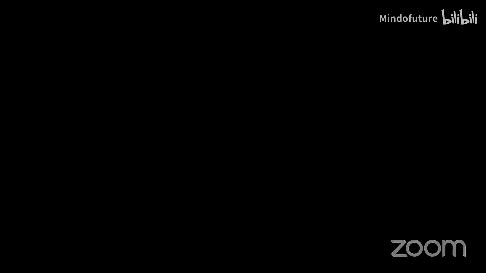

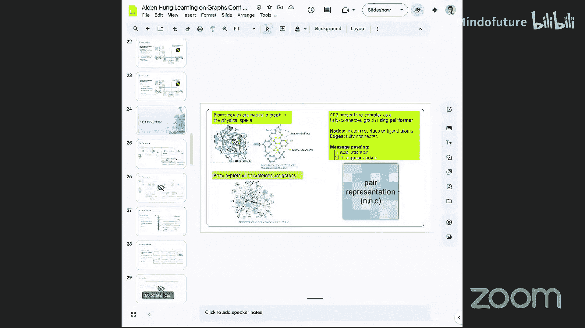

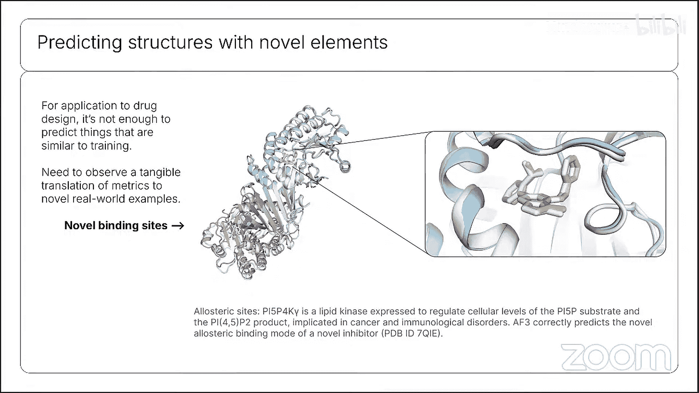

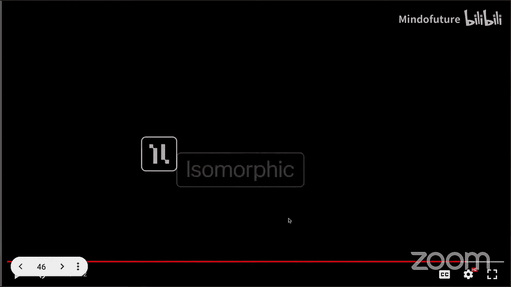

Can you hear me。Yes， I can do a quick introduction and then you can get started I think that。入诶。

Hello everyone， welcome today of the law conference and thank you for your participation so far today we have a keynote speaker to kickstart the day and very thankful to Dr。

 Aldenhung who is a principal research scientist at Iomorphic Las and a core contributor of Alpha fold3 and actually deliver a keynote on this very topic Dr。

 Aldenhung actually has a background both in neuroscience and in computer programming having won many competitions along the way and then having gotten his PhD from Johns Hopkins and then a post-doal fellowel from the NIH about nine years ago he moved to DeepMd to work more on reinforcement learning and now he's set his sights on drug discovery with the Alpha fold team Without furtherrado I will let Dr。

 Aldenhuung take over from here Thank you for giving a talk here。Thank you， thank you， Vigish。Hi。

 everybody。 I'm Alden Hong， and I'm representing isomorphic labs today to present our work to original drug design with Alphapho 3。

 So at isomorphic labs， our goal is to advance human health by reimaginaging drug discovery with power and pace of artificial intelligence and in this very example today。

 I'm going to show how Alphapho 3 is actually being the man like driving power in isomorphic lab in the last few years。

 So how can we use artificial intelligence to redefine drug design。

Here I want to just give a little bit background we know like we all love the exponential growth of the technology right we know like everybody here is very familiar with the more slow things are getting faster and faster on our hardware side and our GPU performance are getting just exponentially grow as well and on the other side things are very different in the drug discovery industry。

So you can see on the upper left hand side， if you can see my cursor。Here， you will see。

 this is the drug approved every year。 And you can see it's not。

A big amount is only on a handful of like scale of dozen of more like drugs being approved every year。

And the cost of each drug going to the market is just getting more and more across year。

 So there is a。Low Co rooms， low， which is like the rivers of Moore slow for the drug discovery industry。

 saying it's getting more and more expensive， exponentially to get the new drug into the market。

 So can we use artificial intelligence to make this getting better。

So I would quickly introduce you to the bottlenecks in the drug discovery。

 So on here we see a standard drug discovery pipeline looks like from left to right。

 the starting phases we call target discovery and target validation which is more on the biology side this is identify what is the protein or what is the molecular target that we should be aiming for to making the intervention and then on the middle of this is the chemistry side that we call hit identification and lead optimization This is once you identify the target how would you find the molecules that can be interacting and intervening with the target protein and then later stage there is this preclinical and clinical trials。

And there are various bottlenecks here， which I will focusing on bottlenecks  one and bottlene2 today。

 The bottle next one is understand the disease biology。

 so potentially can we use alpha photo to understand the biology better and also even more importantly can we use alpha photo to help us to design better molecules So this is a bottleneck two and there are other bottlenecks。

 but I will focus on one in two today。So one thing I would like to emphasize is structure prediction。

 Str biology is a key enabler in drug discovery。 There's two part of this。

 The first part is the structure prediction make us to have a better understanding of the biology。

 So， for example， for in this particular example， we are seeing how the protein is interacting with the DNA here so we can know what is the function looks like And also more so we can also use the structure prediction to help us doing this we call the rational drug design。

Which means if we understand the 3D structure of the target protein like here， this is the。

The gray area here with this cavity is a protein with the empty space we call the pocket。

 And you can starting from a small part of this ligan， which is a small molecule。

 You can gradually grow it into a bigger part。And eventually。

 growing into a full drug like ligan that is binding to this target protein and stopping intervening the function of this protein。

So we have this latest model A43 published earlier in the year。

 which is a joint collaboration between。Workers from Iomorphic Lab and Google Deep My。 And this is。

Graio work like building upon from the legacy of Aphafo and Aphafo2。

 and this new model is able to predict structure of not just protein， but also DNA RNA。

 and very importantly for the drug discovery the small molecules。And technical wise。

 this is a diffusion model， and this is getting to the new state of art。

Across all these different metrics。 And I will next go into deeper about the details about how our those3 is making this to work。

So overview of the Apaphos3。So let's starting reviewing what is alpha for2。

Avavo 2 is the first foundational model for biology。

 and it worked in the way that given a sequence of amino acid。

 as you can see on the left is' just like very simple， it's just like a string of characters。

 This model is able to generating the 3D coordinate of every single atoms。

Of this 3D protein structures from just like this sequence and the way this is working is actually it can also use the genetic database search which using the multiple sequence alignment which is a very important information also for folding the protein and this is Ava2 The limitation is that this is only working for protein sequence and this is actually also only working for a single protein chain。

So over the year after Avavo2 first release in 2021， the next year after。

Did my colleague also release alpha fold multitimer in 2022 and the difference。

 the extra advantage of alpha vote multipletimemer is that it's able to fold multiple protein chain。

 as you can see in this middle page。 And just earlier this year， we publish alpha vote 3， which。

 as mentioned earlier， this can fold all different kind of biomolecules。

 including DNA RNA protein and every possible small molecules。

 just as long as you can provided the molecular graph， we can fold it。Okay。

 so a very high level too long didn't read。Alpha force 3 is a diffusient model。

Aphavo3 can fold this different kind of biomolecule identities。

 Alpha 3 produce better result in protein ligan co folding better than the classical ducking algorithm。

A。Talk about more in details later。 It also give a better protein protein folding。Prediction。

 especially， it is reaching much better result in protein。Antibody， antibody antigen interaction。

Compared to Alpha photo2， and this is also working very well for nucleic exit folding。

So this is an overview of the model of Alpha Fo 3。I will not try to actually go through each single block on this page。

 but I will try to showing some high level ideas about how the model is working in the next few slide。

So， first of all。The model is taking input as in alphavavo2， but now besides protein sequence。

 its can also take different kind of modality of input， for example。

 here there's this ligan molecules and also it can also take an input as DNA and RNA and basically this is a conditional generative model and this is a diffusion model to be specific。

And the conditioning actually goes through like this。

 so the input to the model going through a feturization。And this also。

 including with each protein or DNA R sequence， we will do the multiple sequence alignment。

 and that will be the extra information into the model。

 And then there will be this trunk part of the computation， which we are generating a trunk invaing。

And this trunking bedding will be the input to the diffusion module。

 where the diffusion module is the head part of the module that is doing the diffusion kind of generation。

And also， very interestingly， which is that we also have a confidence head。

 This is something we already have in Alpha2， and is also still very helpful in Alphaphos 3。

 This head is taking both the embedding from the trunk and also the simple structure。

And the job of the confidence side is to predicting how well is the mothers。

Generative structures are。 so it can give the user a sense like how confident the model is。

 And I'll get in more details about how this confidence at work later。Okay。

 so in comparison of Alpha vote2， I just want to highlight if you are familiar with Alpha vote2。

 what is new from Alphavo3 and why it is working better？

So this is a diagram from the Apha photo2 paper， and basically the main is that we replace the middle part。

Of the model it was used to co Eform and we replaced from a simpler and more kind of uniform architectural co pairform。

 which I will mention in more details later。 and the second part that is also quite important is that we replace this very complex structure module which doing some kind of very fancy equilibriuman computation with a much simpler diffusion head and it turn out is working quite well。

Okay， so one thing I would like to get into more detail is like， what is the computing unit。

 What is the token or how do we visualizing the information。So this thing is kind of like。

A language model with tokens， but it's actually more like a graph， but it's a fully connected graph。

 So we have a sense of a token， or each token， you can also think as a node in a graph。

 And what is the token in this ofva those3。 It either can be a residue。

 So there can be a chunk of atoms in standard protein， DNA RNA is， for example。

 as you may know DNA and RNA have this standard vocabulary of8CG。

 And there's also 20 standard amino acid for the protein。 So in those cases。

 you can encode things at more compact way。 So each node will be a single residue。

 But for a general ligan， for any general molecules， you cannot use such kind of vocabulary anymore。

 because there are a vast amount of different molecules。 So in that way。

 we decided the best way is to just encoding things as a single level。 So in that way。

 it can express any possible molecules。 So you have this kind of。Iybrid description。

 some node are presenting a larger chunk of the ats。 Some node are presenting a single at。

 And the way the computation is working is actually save as like a 2D tensor。

 So it's like number of node by number of node by channel。

 and the computation is happening on 2D tensor。 So one way to think about this is this is a fully connected graph。

 And we are doing a lot of computation。 on fully connected graph。Okay， so just to give an example。

 what do I mean by a residue can be a standard protein。 That means， for example， if this is a glying。

Then like which is a standard amino residue。 Then this token will have multiple atoms positions。

 But if it's a ATP， which is a very common molecules in the body。

 then because this is not a standard vocabulary。 This will be We could flatten out。

 This will be represented by each one token。 is one single at。

 So this AP molecules of like 30 something atoms， it will lay over 30 something of the tokens in our representation。

Okay， and now let's move on to the feturization。As I mentioned a bit earlier， we get all this input。

 the sequence， the ligans and other information， and this will go to some further computation。

 We will do some template matching。 See if there are some template you can retrieve from the database to help you do the prediction and one very important information sources is this genetic search。

 which will give back the multiple sequence alignment which will be a very strong and helpful signal to help you know which two protein residues are coevolution and they may be in contact with each other and for the molecules we can generating the floating free floating conformers and this can be good reference signal about how those molecules looks like and we can fold those together with the protein。

 So this is how were visualizing the input。And then it's go to the trunk， the part we call pairform。

 and this is the detail of the pairform is doing two type of computation。

 One is the triangular update。Which is updating。The input and output。Of a particular node。

 say every signal flowing into the node and every signal flowing out to the other node。

 And there is also the Excel attention， which means because this is a very large 2D matrix。

 we are not able to do a standard， like transformer kind of attention with all this n squared tokens。

 So well choose a subset of token， like every single row or every single column。

 this subset to do the attention。 And this is being repeat for multiple blocks。

This is basically just a simplification from the E former。

 if you are familiar from La term in Alpha phototu。And then now we get down to the diffusion module。

 which is head upon the trunk part。The diffusion module is getting。The noise。Ground truth。

 or in the inference time， it was starting from random Gaussian noise。

 and were taking the input from。The trunk and this trunk input will be the information to guide the diffusion head to。

The noising， this noisy input into the ground truth target。

 And this is trend with a standard diffusion model training。

 And one thing interesting to mention is like we are not doing any kind of equiious diffusion in here。

 were just doing something very simple。 just randomly rot and translating the targeting with the。

This data have limitation and turn out working。 Just quite okay。

And the losses for the diffusion model， there's the first part is to min square error loss on the autumn coordinate。

 So this is the standard diffusion losses。 You're just denoing your current noisy input to the target。

 and then you computing the MS。 And we also have other part of the losses。

 which turn out to be very helpful， even though they may be。Like fully me mentallyally grounded。

 but these are the like extra weight for the banded ligan to make sure layer are in the correct location。

 and we also have a LDDT loss， which means we care about the distance between pair of the atoms。Okay。

 so now we'll move on to the Alpha4 3 training。So the full training loop is like thisz， we have list。

Network， and we have the diffusion inference here， and we have the ground truth here。

And with the ground truths and the denoised output from the diffusion model。We are computing a loss。

 This is the loss I mentioned in the previous page。

 So the means square error loss and other two losses。

 and also the other part of the loss is on the confidence module。

 So we have the confidence module that will be able to predicting itself。

 It's reflecting itself on how well is the generated molecule structures are okay。

 and this have three different part。 It's up the PDDT。

 which is already in alpha alpha2 and also have the two other terms， which is。

Quite similar to each other is predict distance  error or predict a line  error。

 Both of them are just estimating。Can you tell me how much is the arrow for predicting the distance between two tokens。

O。So here we show a little bit how the training looks like。

 The training takes about on the scale of like two days。 and then we do some extra fine tuning。

 And in the fine tuning stage， we increase the crop size。

So one thing we need to do for training the Ava model is that we need to crop the input data because the data that we use。

 these biomolecules are sometimes can be really large so they can have like on the scale of like several thousand tokens but during the training time we cannot fit in with such big token with our current hardware。

 So we need to crop into smaller part。 and it turned out this works really fine。

 We can always just learning from part of the input structure。

 It's like you learn from part of the image and this generalize okay when we are inference on the full structure。

And basically， the main thing is like we're adding some extra losses on this later fine tuning stage。

 but most important things that we also make the crop size bigger。

 And on the right hand side figure here， you can see this is how different metrics looks like。

 So everything here the Y axis is the LDT， which is a way we measure the quality of the structure。

 And this is for different kind of entities。 So for the ligan， intra ligan。

 this getting to a higher value and plateau like quite early。

 But for some other metrics like protein protein interaction。

 you can see this is actually convert much slower and actually getting this benefit from the fine tuning with a larger crop so。

We have a like weighted sum of all these metrics that help us deciding when is the best time to save the final model。

Okay， one thing that。I'm being mentioned very quickly in the previous page about the training laws。

 which I want to highlight further again here is this permute ground truth。

 This is some detail about training the model， but I think it's quite interesting to mention is like this particular block here is the permute ground truth。

 which is actually quite important and a tricky part to deal is in the alpha photo design。

So the idea here is like。When you are generating。Correct， like generating your samples。

 How do you matching your performance to the target。And in this particular example，10 Gs here。

 they are two identical chain。 We call it that a2 hometer。And there's also two ligans here。

 And when you denoising and generating your target。

You need to permuting your answer to your samples to computing the correct loss。 You cannot just say。

 okay， I'm just assuming my gene sample one is matching two target one。

 you need to run all the permutation。 and the same permutation is also necessary for the small molecules。

 For example， in this particular molecules here。 you see like there is a benzene ring here and with the oxygen here。

 And with this， this atom 0 to 5， it will be the same in this two different permutation。

 So one need to be very careful about when computing the losses like it's considering all the possible permutation and computing the loss correctly。

Okay， and now I'll move on to share some of the Al4 3 results。

 which is probably the most exciting part。 And this is a full summarize page about how the model performs on the ligan set on the nucle exit and on the coval modification and on the protein。

 I will go into each subcategory in the next few pages。 So first。

 let's focusing on the protein ligan。In this category， we rely on a data set called postbuster。

 which is a third party paper。 like there's this particular data set。

And here we compare Al those 3 with a few other。Also， like recent coming paper。

 like first Campbo Rotafold here and also a few other approaches。

Tiff dock and some other method and also like some classical old docking method。

 like like Vina or gold here。So。And the y axis is here you can see is percentage of arm is less than two and strong。

 This means like how well you can put the ligan correctly in the protein pocket。

And the blue R is the performance of alphavo 3。 You can see it is performing very well。

 One thing I want to mention is like Alvo3 is essentially very different from all this classical ducking method and some of the machine learning method like di do。

 in the sense， like this methods lay assuming you already have the protein structure。

 and your degree of freedom is only how you put your ligands within this already rigid protein structure。

 But Alvo 3 is doing a thing we code cofolding， which means we are generating both the protein structure and the ligan together。

 So potentially this ligan， this protein can actually。IIs there a question or no， sorry。

So potentially， this is able to actually generating a protein with ligan。

 Lets say when when you fold this protein by itself， theres a cryptic pocket。

 So this pocket actually comes up。 But only when you run the model together with protein and ligan。

You will see like this li going into the pocket nicely。Okay， so this is performing really well。

And as you can see here， we are overlaying the models' prediction and the ground truth。

 And you can see they are overlaying very well， which I I was showing more details。

 More more examples later。And one thing I want to show as a highlight or or as a like things for future work is like you can see this are。

A bunch of different quality control people do in the postbuster benchmark。

And there's like two things I want to highlight that。The alphavoory is not doing perfect yet。

 The first one is let's take tra your chi。 This means like when you have a molecules and you have a。

Autom in the molecule that is bounding to four other atoms。 There's a single chi。

 And do you get your molecule to have the correct chi。 And we can see the alphavavo is doing okay。

 but not perfect。 And some other approach like do is actually by construct doing this perfectly。

 So this is something we are trying to improve。 And there's also this intermole。But。

 this is like the distance between protein and Ligan。

 this means like when you fold this structure in your prediction。

 do you have any collision between your protein and ligan if you put them too closely to each other。

And Alvado is not working at 100% here， but very close to that。And the performance on DNA and RNA。

 which is list like new features we can do。 It's performing really well。 I will say。

 in general and and performing very well， it's not。Better than this approach called alchemy RNA to。

 which use a human input， But as the pure machine learning approach， This is the state of art。

 And as you can see in this example， it was able to nicely fold this DNA along with this protein and give a very reasonable。

Confidence predictions here on the right。 I， I will explain a little bit more on what the confidence prediction。

Means later， in a slide。And here， I want to also highlight an other new feature in alphaphavo 3。

 which is not in alphaphavo to this list co modification。 So in the protein。

 there is a single post translational modification， P TM， which means。

Usually you have this 20 standard amino acid residue。

 but sometimes after this protein getting generated translated， they will getting modification。

 for example， there will be like one extra phosph being putting onto the residue。

 and in the original Avavo2， we were not able to model Lla。 But in Alvavo 3。

 we have approached to just treated this。Modified residues as like a ligan。

 So we have a way to handle this kind of molecules。 And in here。

 you can see we have a specific amino acid residues here。

 which it correctly should be list called S EP。And the standard one will be this SR。

 and the difference is like among list two， as you can see。

 the difference is having these extra phospho groups here。

 Okay and Alvavo3 is able to correctly modelling this change。

 and this is actually a key importance thing to model in this particular example。

 if you are not modelling that one， then you are not able to correctly putting this peptide into the correct position。

 but while Avavo3 can actually modelling this complex well and putting this thing in the correct place。

Okay。X， and finally， I want to show this protein protein interaction Inter prediction。

 This is when you have like two or more protein trends。Whi。

hi you want to model how they are interact connectinging with each other。 This is， in general。

 much harder than。Folding a prediction by itself。 So this is a harder task。

And one thing particularly interesting is here is that we can actually modeling much better in this antibody antigen interaction。

And the way that we can。Actually， do this well is that we can actually run the model multiple times。

 so you can actually scaling at inference time。 What we do is that we' just making multiple seat like running the model multiple times。

 And each times the model will run with a different subseling of the MSA and。

The keys in wirelessless work is like because the model have this confidence had。 So it can use。

 The confidence has to choose among this like 1000 generated samples。

 And it actually indeed can use Laso。 So it' actually can scale， as you can see。

 when we're getting more samples。We actually can get a better performance metrics。

And this is just an example showing we are able to fold in this particular case。

 an antibody with the antigenteger。Okay， and finally。

 this part is about the confidence metric checking the accuracy。This is showing， again。

 the importance about this confidence metric， as I mentioned earlier in this antigenteigent antibody folding。

The confidence is a very important and very useful information for the chemist to look at the structure。

 So， for example， when we folding these particular structures here。

 this structure of four different chain like one in magenta here， one in orange。

 one in blue and one in gray。And this predictive distance  error matrix is showing how confidence are you。

About different parts of the chain。 So， for example， we can see there is a high confidence。

With in Chen， which is not surprising， Right， So， so because as mentioned earlier。

 it's always easier to fold the chain correctly。 But the more interesting thing is like。

 we know also here the the darker Gings like better confidence。 Okay， so here the model tell you。

 okay， I'm very confident between Chen A and F。 and I'm also very confident between Chen C and D。

 but I'm less confident between the relationship between Chen A C or A D。

 And this is actually quite makes sense because this。Whole complex is floppy in the middle。

 So this upper and lower half x can wly run。 So that's why the model correctly suggesting it cannot be very confident for those two terms。

Okay， and with all thoses description about AvaF3， I now want to move on to share a little bit about on the application side。

 how in isomorphic lab， we are using AvaF3 to enabling our regional drug design。

And one thing very important is that we want to make sure this is working on novel target working un novel protein ligan interaction。

 we don't want to have a model just memorizing the data set We want to make sure this is actually generalizable to new protein target that we actually don't have structure。

 new molecules is not being designed yet， but our model are still be able to predicting the structure with this novel protein and novel novel ligan combination and we are actually using our model in the day to day discovery pipeline in isomorphic lab。

Okay， in this first example here。We are showing this is a novel target， not in the training set。And。

In this kind of protein target， there's usually more than one packet。 that means you are。

 if you fold a ligan with this particular protein， it potentially can go to different places。

And in this particular example， we can。Correctly fold this target into folded this ligan into the correct pocket with respecting to this protein。

 which is not in the training data。

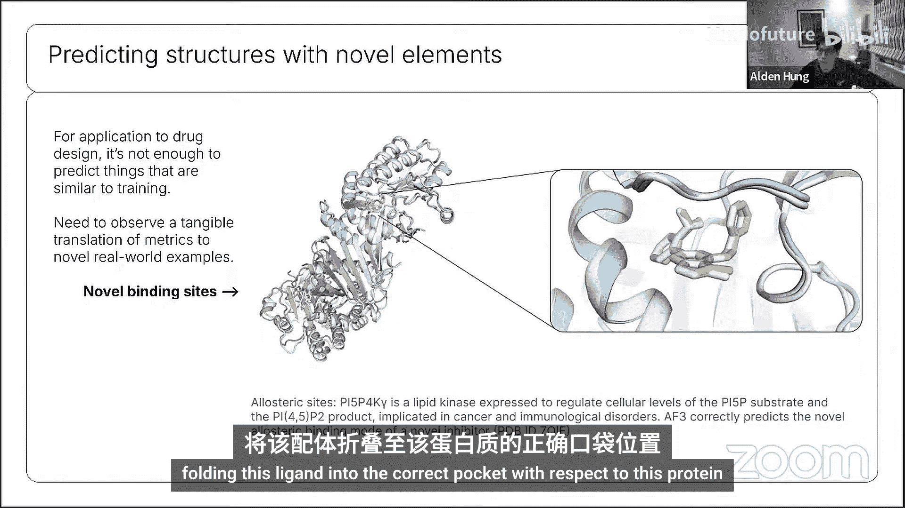

And then here， I would like to show you a short video。About another example of how we use the model。

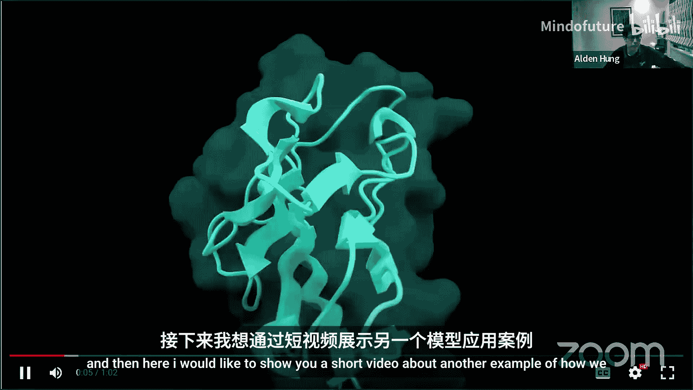

Sorry。

So here this is an animation of a protein target called team 3。

And we are folding lists by itself now at the moment。

And you can see now we are folding a particular ligan waste list。And as you can see。

 when we folding list the。Blue part is the ligan， and the orange part is the chen from the protein。

And you can see， whenever we folded。Different ligands in， this protein part slightly changes。

So this is what I emphasized earlier。 What we do is a co folding。

 We are not keep the protein rigid and just putting the ligon on it。

 So this is actually making it possible for the whole complex to find the。Most low energy。

 most plausible state。 So it's not like you have a rigid protein you vote first and then you just do your ligan onm it。

Okay。冇翻。I cant。

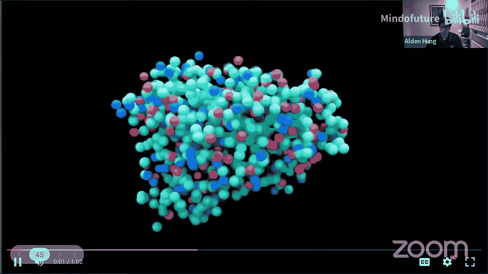

And here I want to highlight another very cool example here。

 So this is a very complex  terernary structure。 As you can see。

 this is a really really complex thing。 There are like two protein chains here。And here。

 the way it is showing is the white is the grand truths and the blue and the pinks are the structure prediction from the model。

 And as you can visually see， this there。Basically looks like overlapping super well。

 and this is quite complex because this is a structure where you have two protein chain and layer is a ligand standing in the middle that is interacting with both sides of the protein。

And we were able to fold this very well。 And one thing I would like to highlight with this particular example is that we are actually able to use the confidence matrix to correctly sa selecting this best folded result。

 So English this lower right scatter plot here。 The X X is the。😊，Re the quality of the result。

 the protein ligan pocket R MSD， so lower the better。 and the Y axis is the confidence score。

 So you can see were generating a bunch of different molecules。

 a bunch of different predicted structures。 Some of them are better than others。But the top one。

 the most confidence structures by the confidence。Mats score is actually indeed the one with the lowest R SD。

 So this is the like really nice example。 Our confidence metrics helping us to selecting the best possible。

Syimps。Okay， so。We also have this Alpho server， which is publicly available for everybody to use。

And this is a server launched by our colleague at Google Di Min。And。

You can find this on the Internet and feel free to leave a feedback。

 And I think there's a lot of people actively using this web server。And also， we have。

The Github code that is able for academic use， which you can find here on Github。Okay。

 let me now quickly go through some kind of not fully solved area and the limitation of alpha poster。

Okay， the first is the confirmation coverage。 This is actually a quite interesting one。

 So in this particular example， called Serbl here。We have two structures we call apple and Holtate。

 E state means you only have the protein by itself。

 and Hol states means you have the protein together with a lid。As you can see， if you look closely。

 there is a liance here。Okay， and。You can see。This is a case where the protein is taking different。

 that the silver one on the left hand side is the ground truth， and the blue is the model prediction。

And this is a very hard example， because this is saying。When there is no ligand around。

 this two sides of the protein layer far apart from each other。

 but when there is this ligan coming in here， this is kind of like close up and this part is taking a different confirmation。

And the current alphaholster is not able to modeling that correctly。

 It's actually modeling the part when the ligan coming in fine。

 But even when there's no ligan is still generating this wrong state。

 So this will be something to work on in the future。And the other thing is this hallucination。

Which is a quite tricky thing。 And this is happening with the diffusion model in alpha fold 3。

 which is less a part problem in alpha 2 before， because we have other losses to handle with life。

 This saying if you have a protein where your ground truth is this particular part so that this one is the ground truth。

 And you can see alpha 2 and alpha fold 3 I'm modeling this part5。 But this also have a lot of part。

 which is code。Disorder the region。And alphapha vote2 will just correctly put them as this thing we call a spaghetti。

 just just loosely put them in the space。 But alphaphavo3 will have kind of like hallucination like the language model does。

 It will try to fold them as if they are correct structure。

 This is not ideal as this will be affecting with like say protein in prediction or like protein legal interaction prediction。

 And this are something to work with to think about how to deal with later。And then。

There's another issue is like we also observe that when we are running inference on large structures。

 we are seeing the structures sometimes have this problem that they will be like overlapping themselves or like different channels overlapping on each other。

And this may be related to some issue with the noise in the initial noise in the diffusion noise。

 or maybe there are some other reason this is something to keep looking at。Okay， so。Where's next。

 I'm going to try to wrap up the talkkio。The first thing I want to highlight again of the whole alphaO and how it's related to the graph machine learning is first of all。

 biomolecules are naturally graphing the physical space， right so。As we describe earlier。

 this pair former thing here， as you can see in the right。

 they are basically a fully connected graph。 And each token here is an is either an autumn。

Or it can be a group of autumnom， which is like a residue in the protein。

 And what we are trying to do is we are modeling all these interactions。And。

The way ourvo is handling with this is that we are doing this fully connected graph。

And this is kind of like probably the best thing we can do at the moment。

 The reason is like before you do any folding， you don't know which molecules。

 which atoms are close to each other。 So you cannot quite do a local constraint。

 so you cannot have a more meaningful， like local physical constraint age， say， okay。

 I know this particular atoms is close to this atoms and these two atoms are very far away。

 so I don't need to do any age computation。Because before folding， you don't。

 you should not have any prior say any two at should be closed or far away from each other。

 So the way we handle this list， I would say， maybe a little bit proofful is like not' just assuming it's fully connected。

 So every token， every autumn can look at each other。This turned out to just working very fine。

 but maybe the caveat with list is like this is also very compute and memory heavy and as mentioned earlier as well。

 this means at the training time we need to crop into a smaller chunk and if there's maybe a better way to representing in a spa way then we can actually training on a bigger crop or in the training time we can training on the full structure and this would certainly be something。

Desirable because not reducing the training and evaluation time distributional shift。

And those are just to mention。Proin protein interaction。

 which or all any other kind of bio biomolecule interaction。

 like protein DNA and protein RNA interaction， can also be represented as graph。

 And it will be very interesting。For。To present this and understand this interaction in the。好嘅你す。O。

And there are some future directions that we are pursuing beyond Avaos 3。

The first one is function prediction。 So structure is just an important thing， but it's not angle。

 We actually want to use the structure to help predicting the function and something very nice as an example is this paper called Al mis。

 present a published by our colleague in Google did。

 they use Alphavo2 to use this model to predicting what is the single point mutation in the printing sequence that maybe be cosing。

A functional change of a poor。And at Iomorphic La， we actually want to make a full suite of machine learning models。

To help predicting the function and modulation of the functions。

 We want to go all the ways from the lower level， the highest resolution。

 say starting from quantum chemistry。Molecular dynamics， can we using this kind of。

Simulated data to get synthetic data to train our model to have this like better alpha a both kind of structure prediction model。

 And once we have a good model for the structure biology。

 How can we use that to build predictive interaction， like protein interactionome。

 And can we go from there to predicting the biology， Can we go from there to get a。Virtual sale and。

Eventually can we use that predicting the toxicity or effect of a drug？

A human body or the animal mother。ok。In conclusion。We are very excited about the progress。

 and we think understanding biomolecular structure is the key。

So we want to learn how the molecular machine is working and we， as showing earlier。

 we show this is regional developed modulator to change their behavior。C。

 understanding the structure is the key for the drug discovery。 And Alvoory is making this。

Not just a dream is a dream come true。 This actually works， and we can now fold all biomolecules。

 protein DNA， RNA and ligands。This diffusion model works very well。 This trend on all the PDB data。

 And we show this work on novel protein ligan pairs。

And we are actively day to day using avavoory to do regional drug discovery。

 We use this to predict the novel protein ligan k structure and this speed up our drug discovery pipeline。

 So we don't need to wait。For a crystal structure， which is usually taking at least months to get to verify a structure。

 but we can just run the model and have a very strong confidencence。

 say we know the Ligan is going to the particular pocket with this particular toes。Okay。

 so in the end， I would like just to share something about Iomorphic La and we are a very interdisciplinary company。

 so you can see we have this kind of very different diverse profile of people。

 but we are always looking for passionate machine learning researcher and engineer to join our company。

And as you can see， we are like having a very happy working environment。

And I will stop here and thank you for your attention。

Thank you for the talk about it There are a few questions people are posted in the chat The first one I think might be expecting is more about the sort of you know choice between equivaris and data augmentation and kind of what were the main sort of motivating factors between sort of going for data augmentation versus equivaris is it something that you kind of tested practically and just found to work better was it somehow also sort of engineering motivated basically sort of any thoughts in that that it's easier to。

嗯，Sory you夸到还还还行还是。😊，各 ahead。No， no， I was just saying， yeah。

 basically if you had any thoughts on on thatin。 Yeah。

 I don't know where maybe I should just stop at some。Yeah， I'll just double the slide。

 but it's probably not related to the answer。 Yeah， so， so this is a expected question， as you say。

 and I mean。Thisす。At first this is just like this is easier to implement so we started with lists right and just doing data documentation。

And。We actually have some form of investigation and trying to use some kind of equivaris like Gen or equis。

 transformer， this kind of thing and。To our experience is not working。 It works as well。

 but it's not working better and。I was assuming it potentially can be more data efficient。

 but I'll just say in practice it's working out fine and the data augment。

Just working equally well and for simplicity， we just go ahead with this simpler design。Yeah。O。

The other question is basically on you know， so one thing you kind of one thing is that we don't actually have enough data on how the protein evolves through time typically so to say compared to the amount of static structures that we have there's a question about are there like good possible ways to also sort of apart on the temporal evolution of proteins you know as I say conformal changes during docking。

 for example， that sort of directions along those。If there are ways to kind of model this well and etca here。

Can you see the question again。So the question is basically that you know one does not actually have easily available data for the actual sort of dynamics and temporal evolution of proteins。

 but are there kind of ways to go about modeling this essentially？Right， okay， so， yes， so that is。

A very interesting topic。 And I， I think also a very active topic in the field。 that is。 Can you。

 is' actually also related to one of the example in the limitation I mentioned earlier， Right。

 It's not able to modeling the two state correctly。 So， so currently。This is。Indeed。

 tricky because we are mainly relying on the PDDB data set， which is the crystal of the structure。

 which is the static snapshot。 And this data set is not a data set curated for machine learning。

 Right， This is a data set with like 50 years of hard work from the structure biologists。

 And they just put whatever important。Like they， they feel， they。

 they realize and and put into the database。 So database have some bias。ok ， but。

So there is the issue with that， I would say one thing is very promising and I think there are several groups is looking into is how do we combine machine learning approach with molecular dynamics？

So can you use molecular dynamic to simulating different state and with those different state。

 I think one holy grail， which is very hard problem is can you really have something like Avavo 3 as a generated model but it's actually generating each different conform state with the correct Boman distribution。

 and that is。Something this would be the next big breakthrough for the protein modeling， yeah。

I agree The last question is actually about the transfer learning capabilities when you kind of use multiple modalities。

 so basically if you look at protein nucleic acids。

 these are typically much more data scarces than say just single protein or protein protein interactions did you actually see benefits for example。

 if you trained a model from scratch on protein nucleic acids as opposed to doing this code training between different modalities。

Right， I think this is a very good question。 Thiss actually something we've been。

Recently looking into， I， I think we don't have very clear evidence。

 So the list is not part in the publication。 but I would say there are some good evidence。

When we co training both protein， DNA， RNA and ligan。

 we actually get better result from all of the modality。 So if we， for example。

 only training a model， particularly just for nucle acid， iss actually performing like。

It's prefer okay， but worse than a cold trend model like Alva those 3。

 This is kind of interesting because this may not be super。Kind of straightforward。

 like intuitive because they are using different vocabulary， right， But， but I think its still like。

Because co training with this bigger data set of protein is probably getting the model to some better like parametermeter space。

 that is making it also work other mod， yeah。Thank you。 Yeah。 I don't see any more questions。诶。

So but I guess to wait on for a couple of minutes just to see if anyone has anything sure yes。

So maybe maybe not， but yeah， I would like to thank you for your time and also for the wonderful talk。

😊，嗯 yeah。Thank you so much and thank you everyone for your attendance。Yeah。え。Thank you。😊。

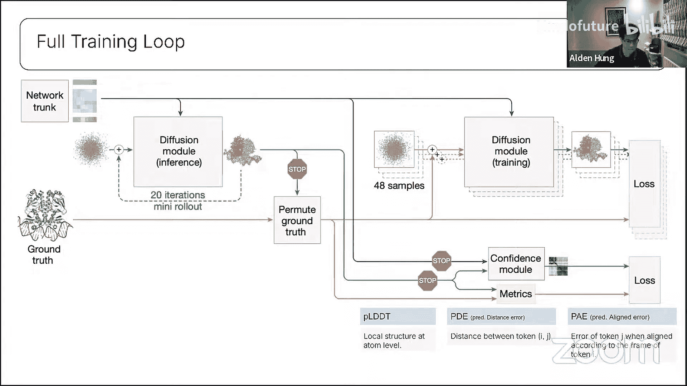

Okay， so we are now moving to the next session which will be a tutorial session。

 I think that we can have like a five minutes break for people who need to grab a cup of coffee or tea in the meantime we will set everything up for the tutorial。

Just to make sure that everything is working properly better， can you hear me？也不是我。Hello。Yeah。

We are all in the same room， so only I am unmuted right now， but we will alternate during the talk。

That sounds just great。Hello。Can you maybe you want to try to share the screen to check that everything is working as expected？

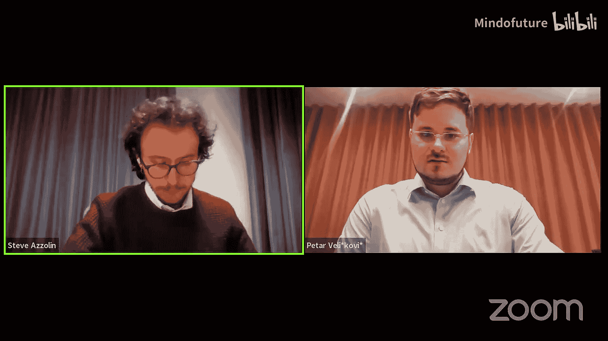

Of course， let's do it。Just a second。

HowAbout this， yeah， perfect。Great。I think we can still wait five more minutes and then we can start。

嗯哼。😊，Sounds good to me。Okay， so I think we can start is 4 pm UK time right on time。

So it's now time for the last tutorial of the season titled Ne algorithmrimic reasoning Part two from graphs to language。

This tutorial is a follow up to the previous tutorial that Lo 2022。

 and I'm very excited to see the progresses that field undergo in this relatively short time span。

For this tutorial， we have a big list of brilliant speakers。

Petr Viicchovi is a St research scientist at didmind and affiliated lecturer at the University of Cambridge。

Olga Kotslovan is a software engineer at Google Deep Mind。

Fderico Barbarro is a third year PhD student at the University of Oxford under the supervision of Michael Brotstein。

Theresa Markkiva is a research engineer at Google Deep Mind and Alex Vitwsky is also research engineer in a Google Deep Mind。

 and last but not least Will Fred Boey was also a research engineer in a Google Deep Mind。Remember。

 those sessions are live streamed on both Zoom and YouTube and the sessions are recorded and will be made available on Zoom on YouTube afterwards。

Please interact with the speakers using the QA tool from Zoom or by dropping questions on our Slack channel。

Now without further ado， let's welcome the speakers。Please， better。All right。

 thank you very much Steve for the kind introduction and thank you so much to everybody in the log conference organizing committee for giving us the platform to talk to you all about neuralalrimic reasoning for a second time after a two-y break a lot of really exciting things have happened and we cannot be more excited to share all of these great advancements with you all my name is Pat Relichkoch I'm a senior staff research scientist at Google Deepine and an affiliate lecture at University of Cambridge and I will be kicking us off for today we have a lot of exciting things in store for us so let's dive right in the first part of the tutorial will be talking about neuralalrimic reasoning on graphs and' be given by myself and Olga Koslova who will give a tutorial aspect of this work later。

😊，Before we dive in just to note， thank you all so much to all attendees who are joining us along on this journey and we would just like to call out this was hopefully communicated to all the log attendees but just saying that this tutorial does have a light prerequisite on the previous tutorial that was given a log 22 for which you can find all the materials on our website and we will actually also upload all of the materials of this tutorial to the same website sometime after it's finished it's not a must it's a light prerequisite it does help a little bit with the understanding Another thing that we will recommend for a latter co-ab session is if you don't already have a huggingface token to please create one it will allow you to more efficiently go through the tutorial in real time but once again don't worry if you haven't done this you will be able to follow along and all the materials will be available for you to produce later。

There as Steve mentioned， there are many modalities in which you can ask questions to us but personally especially because there's so many of us we actually all in the same room right now。

 we will prefer asynchronous questions so all of us will be monitoring the Slack channel and whenever we see a question that's like appropriate for one of us to answer we will do that so we highly encourage you if you have a question for any of the speakers at any point。

 just raise it in the Slack channel， the tutorial discussionsions channel and one of us will be with you shortly to answer the question and lastly but not least if you enjoyed it or did not enjoy the tutorial and you have any feedback for us please remember to give it at the end I believe Michelle will circulate the link in the Slack after the tutorial is over we would highly appreciate it and it will mean a lot for us when we prepare future iterations of this tutorial。

Okay， so let's get stuck into this let's talk a little bit about neural algorithmic reasoning and specifically I would like to kind of kick off with a few generic words on all of the key building blocks of the term neuralalic reasoning so that hopefully even if you haven't come across this term before you can sort of get a feel for what is it that we are trying to do here so first maybe let's dive into algorithms and already algorithm is something that maybe when I was going to high school I thought was a super welldefined term but actually then I went into the textbook on introduction to algorithms which is the authoritative text for this topic and I saw how an algorithm is defined there and as you can see it's not really well definedfin even in the authoritative textbook it's merely mentioned as any well-defined computational procedure that takes some value as input and produces some value as output there's not really a lot more to go on in fact they also mentioned。

Points like it's thus a sequence of computational steps that transforms the input into the output and it can be specified in many ways in English as a computer program。

 hardware design， and so on， the only requirement， whatever that is is that the specification must provide a precise description of the procedure that you're trying to follow。

So this doesn't give us a lot to go on so maybe it's even better if we ground it in a particular example and one classical example of an algorithmic problem for which we design algorithms to solve them is the sorting problem so to be more specific in the sorting problem you were given as input a sequence of n numbers a1 a2 to AN。

And what you're asked to produce as output is any permutation of these elements。

 so this will be a1 prime a2 prime to AN prime， which is a permutation of the original elements such that for some defined inequality less than or equal these elements are arranged in a sorted order This is a very fundamental task which is a building block of many other things we want to do in computer science and it should come as no surprise it's been studied a lot by previous literature and there's conversely many algorithms that solve this problem。

 one algorithm that you might have heard of it's one of the first algorithms typically encountered in a undergraduate algorithmic course is insertion sort so this is an algorithm that gradually sorts the list by scanning it left to right and at every step it looks at the current element and inserts it into the partially sorted list up to that position and this is repeated one step at a time until the list is sorted this is something you can nicely visualize with a step。

Step trajectory of how the algorithm works so here we have an input list 52431 and gradually as insertion sort goes left to right it readjusts these pointers。

 the green pointers of the list such that eventually you will end up with a list1，2，34。

5 and it's a welldefined computational procedure that you can make various proofs that it will necessarily terminate with the final list being sorted。

Okay， so that's algorithms， but we talk about algorithmic reasoning。

 so we need to talk also a little bit about reasoning and。

I want to do this in a way that doesn't open a can of worms because reasoning is such a loaded term in modern artificial intelligence and if you ask 100 people what reasoning is。

 you're very likely going to get 100 different answers。

 so I'm going to make it very clear that this is what we as in our group at Google Deepmind what do we mean when we say reasoning。

So to us， reasoning is a robust procedure for solving problem instances and really the keyword is robust。

 Many of the other things are not so important here。

 So what this means in practice is I actually don't require this procedure to be fully accurate I claim that humans are also capable of reasoning and as you know humans very often perform only approximate reasoning。

 especially when you have only partial data available to you right and furthermore。

 maybe this one is a little bit more controversial but we don't require the reasoning to be provided in a symbolic manner。

 So in a way that a human can interpret what's going on we would also be satisfied with a reasoning system that does all of its computations in this high- dimensionmensional latent space without an easy way for us to interpret how it's reaching its decisions really the keyword for us is robustness it should behave consistently across all instances of the problem that we care about So if it makes mistakes it should make mistakes in a predictable manner and when we talk about。

Predictability across all problem instances and we're talking about systems trained from data。

 this implies that what we care about is out of distribution or OOD generalization This is really the essence of the core problem behind what makes reasoning hard。

And。This hopefully explains algorithms and reasoning in isolation the way we see them。

 but why should we look at algorithmic reasoning as an approach so to see that we can talk a little bit about how can we even evaluate out of distribution generalization and that's something that's quite tricky to evaluate with any specific data you might have at your disposal today in fact you can think about what are the desired ratta for a data that you can use to evaluate such generalization and really you need to be able to measure generalization anywhere inside your distribution so you need to be able to generate outputs reliably efficiently for any input you care about and I argue that these three items together imply by definition that what you need is for there to be some algorithm that produces your data because the existence of a reliable efficient outputs generated for a given input is by definition an algorithm right？

And so now we know why algorithmic reasoning， but why do we care about introducing neural networks into the mix because algorithms themselves are capable of doing this really well and in fact。

 they're very robust。In order to quickly justify this I'm going to prime you with a question。

 find me an optimal path from A to B， I'm giving you no additional context whatsoever just what would you do if I told you find me the optimal path from A to B now if you are a theoretical computer scientist。

 chances are you will see this question and you will react in a very singular manner you're going to assume that what I'm giving you is a weighted graph on which I'm asking you to find shortest paths from a given source and you're going to diligently take out your favorite shortest pathfin algorithm like Dtra and use that algorithm to find all the shortest paths emanating from a particular note of the graph this is at least how I would intuitively react that someone who studied computer science at undergrad and I would argue many others would probably react to this question the same。

But I have never actually told you that this problem gives you a nice welldefined weighted graph with a single scalar weight per edge right in reality very often especially when we care about solving problems in the real world。

 there exists some real world problem that underlies this and that might be， for example。

 a real worldorld vehicle routing problem where you have to deal with not a nice well-defined weighted graph with a single scalar per edge。

 but rather you have the status of all the cars and traffic， how fast they're moving。

 you might have data from the phones in the cars， there might be various roadblocks， traffic lights。

 whether conditions all making these estimates much harder。And traditionally。

 how people would go ahead and solve this heurically is we would manually try to take this complexity of the natural world and try to map it into something that an algorithm can operate on because an algorithm does require the input to be in a very rigid state in order to act in an appropriate manner。

But okay we really cannot hope to always do that manually so we could also try neural networks This aligns with the modern paradigm of tool use where your neural network processes the complex real world data and produces inputs for an algorithm but actually and you can look at the first NR tutorial for justification behind this neither of these are likely to be successful for every problem you care about because there's bottlenecks inherently involved in invoking the tool and basically it doesn't matter if you have an algorithm that would probably correctly solve your problem if you're executing it on inputs that are incorrectly mapped this is really the problem garbage in garbage out。

 it doesn't matter what the procedure is and therefore this is the justification behind NR for higher flexibility to allow us to be more flexible in this we can actually try to train neural networks that more closely mimic what algorithms would do and therefore get the best of both worlds。

 both a neural network that can process data coming from a more rich input space。

And also have it be more robust out of distribution like an algorithm would and trying to tread this really careful line in a way that satisfies the tradeoffs the way we want it to is really the essence of NAR or neural algorithmic reasoning。

Now okay so far I'm just talking to you about reasoning in general。

 but this is a learning on graphs conference and I did promise you the first part of this tutorial would focus on graphs so why do we care about graphs specifically once again this is an argument that we explore a lot more detail in the original tutorial but here's just the one very simple picture that illustrates why graphph neural networks are a particularly good representation for dealing with these problems so on the left hand side you see a classical algorithm for finding shortest paths that is Belman Ford it iteratively updates the distances to each one of our nodes that's the D variables by always computing them as the minimal way to reach a neighbor so the distance to a neighbor D plus taking the edge from that neighbor to the target node so that's really what this minimum formula and codinging on the left and on the right- hand side you have the computations of a typical graph neural network and you can see how there's this very nice correspondence between the steps of what the algorithm is doing and the data flow of the GNN you can imagine。

Different variables， the DUs as node features， you can imagine the act of adding the edge weight onto these variables as computing a message function and you can imagine the act of aggregating across all neighbors as the aggregation function of the GN there's this very nice correspondence between solving different subproble and aggregating them together that lines up across both GNNs and classical algorithms and in fact this is something we can formalize a landmark paper from ILR 2020 from Kalu Shu and others in Stephanie Aelka's group at MIT has studied this in a lot of detail in the what can neural networks's reason about paper where they show that in fact graphraph neural networks are a good choice here because they align so well with the paradigm of dynamic programming。

 which is a very generic paradigm you can use to solve all sorts of classical algorithmic problems and additionally this is a concept we explored in subsequent work in fact together with Andrew Ddzick we published this。

On Graph neural networks our dynamic programmers at Newris a couple years back。

 which explicitly explores a category theoretic setup that aligns graphraph neural networks and dynamic。

So hopefully this justifies why should we be doing neural algorithmic reasoning and also why should we be using graph neural networks to do that。

 but I've mentioned to you the core idea is this algorithmic alignment so design parts of your model to align with parts of the thing you're trying to fit so let's give you a few basic groundwork steps on how to do that Here is our standard graph neural network equation so we are updating node features from an inputspace X to a latent space H we're doing so by computing a message function psi across every single edge of our graph we're aggregating all messages using our aggregator function O plus and once we are done with all of the aggregated messages we combine them into the final node embedding using the update function phi So what are some different ways in which we can take this neural network expression and make it better aligned to certain algorithms Well there's a variety of things we can do one thing we can modify are the parametric function。

 the size and the Ps one very beautiful example I still love to give on this。From Hao Tang。

 which was published at New's 2020 as part of the EerGN paper。

 which notices that many algorithms such as pathfining are homogenous and that means they have this very nice property that if you multiply all the inputs by a scalar。

 Lada the outputs are actually exactly the same just scaled up by that same scalar so shortest paths are a classical example of this if you multiply all of the edge lengths of your graph by a factor of lambmbda。

 you will still have exactly the same shortest paths is just that the lengths of the shortest paths will be multiplied by lambmbda and this means that if we're fitting a homogeneous task like this。

And if we make our neural network components psiine phi themselves compute homogenous functions。

 we're going to have a much better time， it turns out that to make a standard MLP homogenous all you have to do is get rid of the bias vector so make them pure linear transformations without the Fine part and that's one of the things that how T and others do in this paper to great success so it's just one example of a really simple but beautiful modification you can do to a GNN to make it fit better this particular class of algorithms。

We might also want to change the aggregator and actually this is something that was my first incursion into the field at ICear 2020 we noticed so once again you see the Belman Ford example in the lower right corner。

 all we did really was noticed that since the Belman Ford algorithm is doing minimization if we choose an aggregator that aligns with that like taking the max that will be much easier to learn the required message functions than if you take a more expressive aggregator like some and I'd say nowadays this feels like a very normal decision back in 2020 it was definitely contrary to public wisdom and it was well known especially around the time when the gin paper came out that it was understood that some was the most expressive aggregator than average than Max and Max was seen as kind of the least useful of all of them but it turns out for algorithmic reasoning that kind of bias is exactly what you need for a lot of problems and max is now a relatively standard choice in a lot of these problems but back then it was a bit of blasphemy。

Another thing we can modify RD input features themselves to make the problem more algorithmically easy for the model one standard example of this are end body simulations in physics like the early work on interaction networks from Peteat Bataia and others and the idea here is when you want to fit end body systems and their trajectories often the forces you need to model between them follow in inverse square law gravitation electrostatic forces they all decay with the square of the distance so if you put just raw distances as your edge features you might not have such a good time because your message function to function computing the force now has to compute an inverse square rule and this is quite tricky。

But if instead we feed the inverse square of the distance as the features， now。

 suddenly the required message function is linear in your features and it's much easier to extrapolate。

 So even something as simple as being mindful of your feature engineering can make a big difference。

😊，And lastly， you can modify the computation graphs。

 so the neighborhood of nodes over which you compute your embeddings。

 and one standard example of this is the pointer Graph network that we published at Nps 2020。

 where we explicitly force the edges of our model， we rewire our graph to align with a pointer- based data structure like thejo set union and this gives us a much better theoretical time complexity requirement。

So these are all the various things we can do to a model。

 but let's say you've now proposed a really interesting thing update to a model and you want to test it out or write a paper about it。

 how would you go about doing it back in the day it was really tricky every paper had to design its own dataset it was a bit like the Wild West in there it was really hard to compare results across different publications which prompted us to propose what is now known as the CLRS benchmark and really it's just a collection of these classical algorithmic skills we might want our model to respect in various ways so as the name implies CLRS 30 it's a collection of 30 benchmarks tasks from the CLRS textbook introduction to algorithms and even though it's only 30 algorithms it already spans a wide variety of skills sorting searching pathfinding string matching and even geometric algorithms。

And this is a publicly available benchmark that we published at ICML a couple years back。

 you can access it， play with it， use it for any data you might want for any publication。

 we've already had a lot of very happy users over the years。

 we hope that whatever the things that something we say today will resonate with you and lead to you also using this benchmark。

So what does CLRS offer to you， it actually offers a unified graph representation for a variety of algorithms here you see Belman Ford that we discussed before as well as matrix chain multiplication。

 a classical dynamic programming algorithm， and you see how the library gives you access to the entire step- by step trajectory of what this algorithm is doing as it's gradually computing shortest paths or optimal ways to multiply matrices。

 or also sequential algorithms are represented as graphs。

 so the already mentioned insertion sort is represented as well as a string matching algorithm like the naive string match which tries to find the first occurrence of one string in another。

So all of these algorithms are specified using a fixed number of probes and those just track the various variables that the algorithm is using during its execution and those variables may be used either as input or the model might be queried to predict them as output or they might be used both for input and output so the model might be asked to track their state over the lifetime of the algorithm and once you specify these probes。

 this uniquely determines what the data is going to look like what the encoder and decoder architecture should look like and what the loss function should be so CLRS 30 is not really just a single data。

 it's a data generator and the baseline generator because you can specify any new algorithmic task and once you use the CLRS language to specify the probes of that task。

 the library will take care of everything for you so it will design the machine learning model。

 design the batching， design the loss functions and Olga will show you a lot of this later on in the tutorial like you basically don't have to do almost any machine learning if you set things up the way you want to。

And I want to briefly walk you through the representation of CLRS 30 because as I said we have this common graph representation so specifically we're going to be looking at insertion sort again and I'll mention to you the six probes that are being recorded in the insertion sort specification the first such probe is the position probe we have this as a nice tiebreaker for all of our different algorithms and a way to nicely encode positional information so a position probe is just something that's given as input in each node of the graph and it's a scalar it's just a scalar encoding what is the index of each one of my five items in this case。

Then we also have the keys note I'm highlighting at the bottom trajectory what these different probes are in the picture。

 so keys are the actual input node scals telling you what are the values to sort so the5。

2431 those will be encoded inside the key probe。Then what we want to predict is the output is the final state of the sorted array。

 these green pointers at the end telling you what is the predecessor of each node in the sorted list。

 so this is now at the output stage for each node we're predicting a pointer to the previous node。

Now， of course， we can track how these pointers evolve over the lifetime of the entire data structure。

 and this gives us this spread H， which is also a node pointer。

 but it's a hint type meaning we track it over the lifetime of the algorithm for every node in the list。

 what its predecessor is over time as more and more items get sorted。

 and this is all exposed to the model so it can use it as input predicted as output。

 whatever is most preferable。And lastly， we have two additional node masks which tell you of certain elements that the algorithm is currently focusing on the first one。

 the blue pointer here I is telling you for the currently considered item where in the partially sorted list it will land。

And also， you have another sweeping pointer， which just goes left to right over the list。

 telling you what's the current element being sorted into place。

 So all of these are exposed in the setup for the model。And as already implied here。

 all of the probes can be either inputs， outputs or hints or live on nodes， graphs or edges。

 and they can also be of different types like scalar pointer and mask。

 and inputs and outputs are fixed during execution whereas hints are something where you have whole trajectories of them during the lifetime of the algorithm and they actually specify the algorithm。

 know that all sorting algorithms as long as there are no duplicates will have exactly the same inputs and outputs。

 the only place where they differ is how the intermediate states will change。

Now as part of these slides we have this nice animation showing you how these representations travel through the model and how they get embedded into nodes。

 how they get embedded into edge features and how all the mask features also get encoded and how the GNN then processes them I'm skipping quickly through this because this exact same animation exists in the original NAR tutorial I'm just leaving it here it's going to be in the slides that are already shared it's going to be here for your convenience you can easily see all of these things that CLRS does automatically for you all of the data passing you see here you don't have to implement it yourself once you've specified the probes of an algorithm。

 the CLRS benchmark takes care of all of this for you all of these losses。

 data passings encoders decoderrs and so on are all done for you。

Now of course because we already mapped everything to the same graph representation。

 why should we stop it learning just one algorithm why not have one graph neural network that can learn all 30 of them and this is exactly what we tried to do in some prior work so what you imagine here is you have this unified graph processor network and you have for each one of your tasks like sorting pathfinding or finding the convex hall of a set of points you have for each one of them a separate encoder function Fi and a separate decoder function Gi those map to and from this latent space and they're generally really simple and the question was can you train a single architecture like this it turns out you can we developed upgraded model called triplet GMPNN which we used as a foundation of our generalist neural algorithmmic learner that we published actually a the inaugural log two years ago and here you can see the performances of the multitask single architecture in orange across the 30 algorithms out of distribution versus the baseline single。

TaskEx in blue and you can see there's some differences。

 sometimes the multitask model is much better， sometimes it's much worse。

 but on average the performance of the two are quite comparable and therefore it led us to believe that we can indeed train just one model that can fit all 30 of these algorithms at the level of a single task expert。

😊，So this is roughly everything that led us to 2022 when the original NA art tutorial tutorial was given。

 so what did we miss， what happened in all this time since 2022 that is worth taking paying attention to。

So slowly and steadily starting from triplet GMNNs which augmented the normal gene equation with the message passing over explicit triplets and gating mechanisms and also Scor decoders for tasks requiring permutation outputs and this already achieved a really solid performance across the 30 algorithms as you can see on the left since 2022。

 this research just kept growing。The first such instance published at ICLA 2023 were relational transformers from MSR which show what you need to change inside the transformer architecture to make them a bit more competitive on these tasks。

 specifically most transformers don't have an easy mechanism to incorporate the edge features which are really important for graph tasks on NAR so what you do is you just let the edge features constitute part of the query and key vectors and value vectors and this suddenly allows you to have a more competitive transformer architecture。

Additionally， G fornets published at this year's ICear。

 they actually leverage the idea that these algorithms are designed to be Markovviian and therefore they have an explicit gateit mechanism which actually allows the model。

Explicitly forget some proportion of the previous embeddings of their processor network。

 and this led to a lot of really outstanding results， as you can see in the table。

 a lot of the algorithms are now at out of distribution performance above 90% accuracy。

And most recently， we've done something blasphemic， which is published this year at LoG。

 the Renar model， the recurrent neural algorithmrimic reasoner。

 where we actually set the aggregation function to an LSTM。

Therefore dropping all notion of permutation equivaris that is very beautiful and important for graph tasks。

 well we argue that in CLRS this might actually be not such a bad thing to do because for a lot of these algorithms like list algorithms and so on we have an explicit canonical node order that we can feed into our LSTM and actually we get not only really good results it' certain list algorithms but actually we get a double digits 80 plus percent performance on Quick Selectlect which my good friend Michael Galkin called out in a recent blog post that is very unlikely that it's going to happen this year。

 well it turns out all we had to do was drop permutation symmetry and we had a model that's capable of solving Quickselect。

😊，And actually when you take all of these results together across the state of the art models。

 there's only three algorithms left where we don't have above 80% score on the original out of distributionbution test sets used by CLRS that's Floyd Warsll。

nuthmoreris Pratt and strongly connected components hint hint。

 these are directions you might be interested to focus on in the immediate term to help us completely crush the existing test set and then in the future we're going to have to have an even bigger distribution shift because this one is just too small for a lot of these specialized GNN executors。

Beyond these main architectural advances， we've also done work to endow graph neural networks with memory mechanisms and two works that I think are worth calling out here are the recursive algorithmic reasoning module from Jononasra stillangath and myself that was published at Lo last year that endows GNs with a stack and neural priority cues that I published with Rishajain and Piiaro Leo at an ICML workshop last year that endows GNNs with a priority Q style data structure。

 so these both endowGNs with a persistent memory component which can be leveraged for more precise and more robust answers even across bigger distribution shifts。

Another thing that's quite important is I've mentioned how critical these trajectories were and the hints to the system performance。

 in fact there's been several papers arguing that if you just naively learn to predict the next hint given the previous one it might not be so good so Saak Mdaavi had this great TMLR paper where they basically showed that for many classic CLRS algorithms not using the hints was sometimes a good idea。

This prompted several other works like this paper from Groiono and Yoo Milla Procorencova that you can actually have very handicrafted supervised losses that let go of hints in their entirety but still allow you to execute out of distributionbut with great accuracy。

 this was published at Europe's last year and also recently。

 because many algorithms really require you to find the fixed point of a certain operation。

 Doic Gorgiev JJ Wilson and David de Bufffeli have shown in the forthcoming Europe's paper that will be presented next week that you can use Deep equilibrium models to greatly stabilize the training dynamics of these models。

Now， of course this might paint a slightly daunting picture for these intermediate states so should we just get rid of them altogether I would actually argue we had some papers recently that say that hints can take you a long way if you use them properly so if you don't just do simple next hint prediction so one approach that we used last year was to show that。

😊，Actually， the trajectories of algorithms will often have exactly the same initial few steps if you transform the input in some predictable ways。

 so here for depth for search， we have this trajectory exploration from node1 to node2 to node3 node 3 has no neighbors we go back to node2 and explore node4 that next step exploring node4 will still be exactly the same even if we attach all of these different nodes and edges to the graph and we might want to exploit that to design a more finecrafted contrastive objective and specifically the hint relic method which Beicche Bevilaquias published at ICMl last year in Hawaii was to basically use this to design a contrastive learning objective where we contrast a step in the original hint trajectory with against incorrect step in an augmented graph and this gives us a very rich space of contrastive learning to use and actually using this we set one of the current state of the art results Another recent very exciting result that will be presented。

s next week， the OpenBook NAR method actually not only uses the hints from the original from the actual input that you're trying to predict the output for but also give the access to the model of the entire training set of all of our sequences。

 that's why it's called open book so typically when you as a human tries to execute an algorithm very often you will look at examples of previous executions to ground your predictions better and it turns out if you give your model explicit access to the training set of possible reference sequences。

 this can give you a much better NAR performance once again a more non-trivial way in which these hints can be used。

And I mentioned previously we can align all these different parts， parametric functions。

 aggregations， features， computation graph， you might wonder is there anything else left to do。

 turns out there is and it wasn't even in this plot。

 there was this implicit clock which says that you always have features at time T and they all work together to compute features at time T plus1 and this is perfectly synchronized。

 but this might not be an assumption we might always want to hold because many algorithms we might want to fit are asynchronous meaning that we can only update a handful of variables at each computation step。

Yet all of our models， GNNs transformers and otherwise are fully synchronous。

 they update all of our nodes everywhere all the time and if you think about it。

 what kinds of auto distributionbution general can you get from message and update functions in such a model because they have to learn an identity function almost everywhere and then highly complex functions somewhere else and it's quite tricky so better alignment with asynchronous algorithms might be a very useful future direction and we had this paper with Valerie Engelmeyer and W Gogevt last year's log showing that this might just mean let's try to execute as parallel as possible algorithms and that's just better for GNNs to do that's easy to prove elegant scalable but obviously not all algorithms are embarrassingly parallel so we can't do this。

😊，So there have been a variety of methods like Guac and cooperative GNNs that used explicitly asynchronous message passing where at every step you only pass some of the messages and you only receive some of the messages is obviously directly solves our problem inside the architecture but it's quite tricky to scale on modern hardware which typically requires things to be done in parallel and there's many discrete decisions to make when deciding which messages to send and which messages to receive so actually we worked on asynchronous algorithmic alignment with Andrew Dodzik Tara von Glenen and Rasvan Pshcannu where actually we tried to tread the middle ground so we designed GNNs that are still synchronous so efficient to execute on a GPU or TU but make them provably invariant under various asynchronous execution traces this leads to a pretty cool monooid equivariant style result and it hits a sweet spot between a method that is theoretically sound scalable and modern hardware and also feasible to implement so I highly ask you to check it out if you're interested it was published。

That last year's log as a spotlight。Lastly， what about different applications of NAR or more theoretical understanding。

 how has that developed in the last two years in terms of places where NAR has been deployed。

 the four areas I'd like to call out are we used NARs to get better predictions in neuroscience。

 predicting blood vessel types in the mouse brain， this was the dualalmic reasoning paper with Daniel Numerosso and Davidvi debaccu that we published at IC 2023。

 then they've broken into computational biology with NARs Do Ggev and others have published the naT paper which uses these NARs for trajectory inference over gene expression data。

 they are also seeing usage in harder combinatorial optimization problems。

 the conar paper from Do Ggev and Daniel Numerosso was published at last year's log shows how we can pretrain a model on polynomial time algorithms and then use that model as a great foundation for MP hard problems and get better performance at fitting them。

Lastly， together with Ephiia Panagottaki and several other collaborators at Oxford。

 we worked on using these NARs to get better performance for an algorithm that's critical for point cloud registration and robotics by basically automating the steps of that algorithm better。

What about theory Well we believe that fitting algorithmic invariance requires to step beyond geometric deep learning and model things that are not just purely equivariant functions this prompted us to develop the categorical deep learning framework at ICML together with Bnagaovch Paulardard Andrew Ddzig Tama von Glenen andjaro we have published this at ICML earlier this year at Vienna then the great work from Arturra Bagdloka and Kimononallas at Waterloo has shown how you can use loop transformers to exactly simulate many NAR procedures that you might care about of course this still doesn't tell us exactly how to find such loop transformer parameters but it's a great encouraging step that such classes of architectures are in the right direction。

Then two really exciting works on quantifying out of distributionbution generalization better。

 this work from Andrea Sluka， Martinquis and others that was released on the archive earlier this year。

 there a great step towards quantifying out of distribution and also a great step from Bruno Riverro U Las Covs and co-authors on the graph Metro paper that improves the out of distributionbution generalization through a rigorous and motif-based approach。

Lastly， I'd like to call out two recent quality of life improvements to CLRS that Olga will tell you all about in her tutorial to follow。

The first one is in the basic CLRS benchmark we always use fully connected graphs and the salsa CLRS work from Mindder and others in Raj Wattenhoffer's group at ETH that was published at Lo last year actually shows that if you use sparse graphs in the algorithms where that is possible you can generalize to much bigger structures than what CLRS will allow you in and of itself this is a repository that's a public Pythtorchbased fork of CLRS that you can find on GitHub and lastly but not least through the work of Vladimir Miianch and others that was published at Lo last year we actually now have a nice way to visualize what these algorithmic executors are doing over time and plot their trajectories in PCA space sometimes it's covering really cool patterns over how these models process data once again all the code for generating these beautiful plots is publicly available on GitHub and we'll also tell you all about it in the forthcoming tutorial。

That was it and I hope you enjoyed the first part of the talk of the tutorial for NAR over graphs I'm now going to hand over to Olga Koslova who will tell you all about a coab tutorial that covers a lot of these concepts thank you so much and Olga the stage is yours。

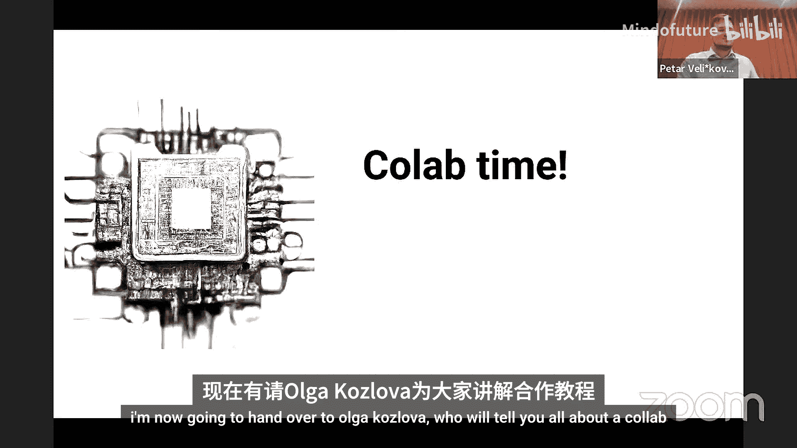

All right。嗯。Hello， everyone。Give me a second to share my screen and we can start。い。

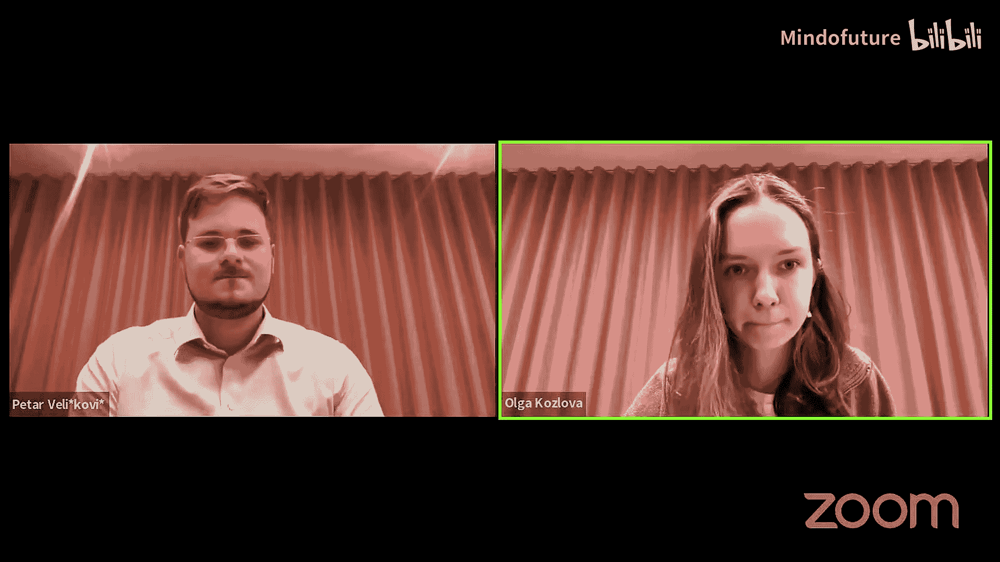

Yeah。Okay。

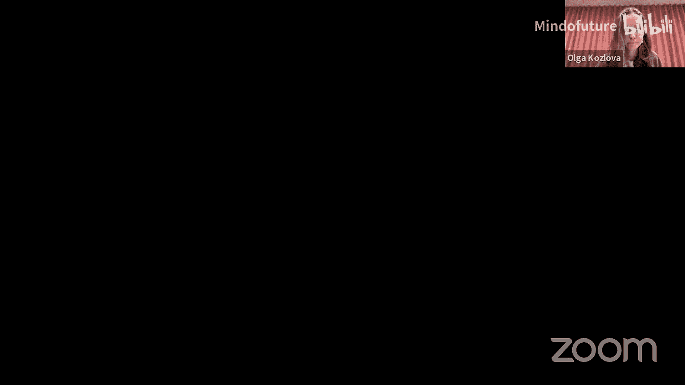

Yeah， so hello everyone， my name is Olga and I'm a software engineer at Google Dd and basically in this tutorial we will walk through the code snippets of how you can。

Train and Ya model on Cs Ver benchmarkmark， we will look into novelble architectures and multi algorithm training。

 and we will also explore the libraries that better just mentioned。

To make the experiment kind of clear， I will restart the session。

And we will walk through this column it starts from the O installations。

 which I conveniently installed while Peter was giving you a talk so we don't need to actually run them。

Then we import the libraries that we need。And initialize the jus random number generator。

Here we have two helper functions， one prints the data sample and another draw the plots for train losses and validation accuracy。

We don't need to get into them， but they are helpful to us。

Now let's recap briefly how you generated the data based on the tutorial two years ago。

 you would create a sampler for each algorithm specifying the number of nodes in each sample。

And you will iterate for it and will look something like this。You will see this spec。

 which basically shows you all the variables used in algorithm。

And the data bar will look somewhat like this containing the lens， the hands， the inputs。

 the outputs。What we can do now is we can use these create sampler functions。

And as we see in documentation， we can use it to create sample for training， validation and testing。

 setting out the train lens， the violence test lens and the algorithms that we want to use。

Same as I do here。The parameters I choose don't really have specific reasoning for that。

 apart from that I choose the validation length in distribution and test auto distribution。

And this is just the two algorithms I like for the shortest part。It。

So yeah let's print data batches from the new samplers and we see that we have two batches。

 one for each algorithm。And the spec list is also changed， now we have two of them。

Now we need to create model and we do this exactly as we did it before with small change we have added new models。

 for example， the triplet gion and model that that Pe mentioned kind of。Really great fun。

 it is that you can use it as easily as you did it before。Let's。

Let's see how we can load it and use it。So yeah here we specify the parameters of the model。

Then we pass it to CRS baseline model and then we initialize it。

 this is the kind of JX feature that in order to start using the model you tune first using the example batch of data。

Kia， I will just save the checkpoint for just initialize the model and I will use it in the second part。

So this is the train loop， I will start the training first and then walk you through the function。

Basically what we do， first we initialize some lists for losses and acuracies。

Then we do the for loop for like 500 steps， and each loop， we first do the training step。

 where we go through all the samplers for all the algorithms， do like the feedback step。

And collect the losses。Sometimes we will evaluate the model once every 50 steps， in this case。

 we will also go through every validation sample。And it will model basically。

And sometimes if the current accuracy is much higher than the best so far。

 we will run the evaluation of test set as well and save it and save the model if it's the best one。

Yeah， he's the training goes。Not that fast on the slow， so we will need to wait a minute。

And then we will draw the plots to visualize what's going on。In terms of loss and accuracy。

F more steps。Yep right， so we see the lowest decreasing for both algorithms。

 so this is the be first foratory and D Str。And accuracy for both of them as well。

Now let's look into the library which allows you to visualize the trajectories of each sample。

So the our latent Spaces library， we will need to do a few more inputs。Okay。

So what we do here is we choose an algorithm on which we will see。What happened？

And I will create kind of a test data site for that。

Another thing that I actually forgot to mention when I initialized the model。Let me get back to it。

Is that here？We add the back equals true parameter， this is a new feature which was just added。

 but it allows you apart from the current predictions and hence it allows you also to return embeddings from each time step so we will use them to visualize。

And yeah。If it's set to false， which is body default fold， the model will behave as it。Deate before。

So yeah，'ve with the fact that we know that the model is set to Dbu。

 we expect this third output of models predict。To be this stocked。

I will actually walk through it in a second。Basically， what happens in this function？

As we first initialized the for the trajectories and for the lens。

Then we go through all the samples in which we have like， yeah， approximately 16，000。

We dump these trajectories。Then we crowd them all together in bond list。啊。

Then we concatenate them along the batch axis， and then we need to move on very， very confusing。

 Let's look at it step by step。So the car charge shape is time steps， bo， notess and feature。

 What this means is that for each timet。We have a， a bunch of。Some posts。Each containing a。12 notes。

 I think。Yep，14， sorry，14 notes。And features like。128 features。So we gather these all together。

 then we collect them for all samples， getting all trench。

And what we do then is we reduce the nodes axis。Because it's quite tricky to track embeddings across many nodes。

So yeah， we want to have just one point for them。嗯。We do it。

 we use the element wise maxs because this is basically the same aggregatory which is used in cell as processors。

So what we do next and the transpose is basically just just to change some dimensions afterwards。

 so it will be easier to use by the library。So the two experiments we will do here is that we will build some plots for the train model and for just initialized and see what we have。

Okay。All right， we have all the data for both of them now let's visualize。

Briefly going through this function while the plots plotting。

So these lines are just like purely technical， we could create some folders for the plots。

And then set up some experiment setting like plotting setting。Here we。So we have。16000 samples。

Obviously。They will have different trace liness。So we need to select only those who have like equal length of the trace。

 In this case， we want to choose the most frequent one and。Filter only only these lens。

 so we choose the most frequent one， and then we filter the data and the lens using it。

And then we pass it all to the plotting functions from the library。And here's what we have。

So for just initialized model。So these two plots。What we see here is that we aggregate the graph embedding for each step。

And projected in 2D or 3D space using PCA。嗯。And we draw a line between different steps。

 so we choose like。50 samples and we draw 50 lines different for one sample for different timestamps to see how it changed。

Through time。And for ontrain model， we see that。Nothing really useful happens， the samples diverge。

 there is no clear solution here。But on the other side。This is a small spoiler。

 but like on the other side for the train model。We see that。

These samples actually converge in one place。So the star from the blue。And converge to the right。

And we also can see that the distance between the initial point and the samples moves is quite peak in the beginning and then it becomes small and small。

And the second floor we have。I。Instead of having one PCA model for all the points。

We do different PCM models for every time stamp。And at the timestamp axis， having these。

This with the representation。So as we see a phone train model。Each point。

 the points are quite spread。While。For the train model。

They all kind of well still not super in in one spot， but like we train them more only for 500 steps。

 that's very little， but we already see the difference。

And this is just like a you plotting functions from the library。

 we encourage you to go and explore what's available there and also check the paper it has much better description of what's going on。

And the last part that we will walk through is the sparse training。

We need to restart the kernel here and I will explain why。So we need to， to import。Again。

 everything we need， but the good thing is that we need only the inputs。And the part three。

 so we can。H I the Part one and part2。Yeah， we will explore salsa service Library here。

The good thing is that the execution will be faster。

But it has only four algorithms available from thisLRS 30 and two additional ones which you can check in a paper。

And another significant difference is that it uses Pytorch。So。你样。This is just for you to know。

 not advantage or disadvantage， just a different thing。

And the experiment we will set up here is that we will。

Run the small evaluation on like 10 samples for the slls model and for salsa Cs model and data sets and check the VrM usage。

 And the reason why we needed to restart is because there is no easy way to to reset the the ju jus memory。

Kind of starts and yeah， so we just restart run time and run from here。对。

I will launch the code first and then explain what was going on because it takes about three to five minutes to actually run it。

So we initialized the model this we've seen before。

And then we have a for loop where we create data samples from like2 to 4000 and run a short evaluation loop。

 so it's really short one， the nuM samples just then and we do it for PFS algorithm。And choose。

PGN model for both Silvers and Sal Silvers。We measure the。Ram usage this way。

 so in JX we measure big bytes in use and divide it for this number to get blankgabytes from bytes。

Yeah， here we will need to wait for about。Three more minutes， because the figure the size。

 the longer we need to8。And I expect that we even might hit the。

Runtime error because we take too much memories， as you can see， it already grows significantly。

If every step。While we wait， I will describe the Celsiuselsus thes function as well。

So in these lines we just remove the standard logging because we don't need it in this experiment。

 so the output will be as nice as this。Then we initialized the model。

 loading it from the config and yeah build the。Data sets to unit the model。Then we do same loop。

We can reset the thoughtr settings here。Build a data。Go through， go for it。

 measure the usage and save it。Then we still have some time to wait two。We evaluate the last bit。

Yeah， and afterwards， what we will do， we will plot the Ram usage for both of them together and see。

How significant the difference is？In this sample。Usually takes quite long。

 but hopefully right now it will be quite fast because the most significant part is load like a data set generation。

But because I I already have run this color well pattern gave you the talk， they should be cashed。

So do you expect that if you launch it first time， it will be much longer than when I did？

And another note， I forgot to say right in the beginning that we are using the GPU。嗯。First of all。

 because were limited on a time here and we want you to actually see what's going on。 And secondly。

 because here， for example。The example in the Salsus Sils Library for farm usage。

 they used the device。Yeah， this is super fast here。And that's spot。So basically， this is a。

Reimplementation of the plot from the paper。The blue line is the CRS line。

 the orange one is Celsius the CRS result for both four PGN models。And。This is the side of graph。

 The blue line stops here because later it hass the out of memory error。

 but despite that you can see that the difference is very significant and we can see that that。

Using Sal service is a much more efficient way， but it had like obviously it's up to you what to use。

 but we wanted to highlight that there are some advantages and disadvantages of different libraries。

And I think we're here with this I will stop， this is all that I wanted to tell you。

 I am happy to answer the questions in the slackck channel so please post them。

And right now I will hand over to Federico。

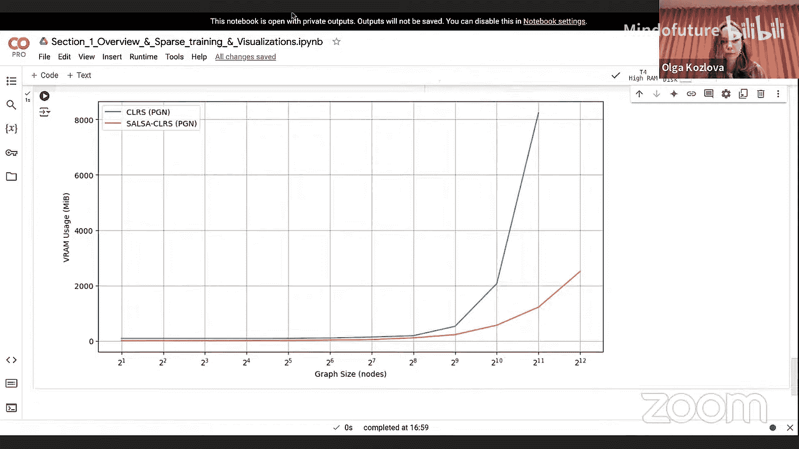

But here we'll be using same laptop so we will just switch places。嗯。あ？嗯ello。Yeah。

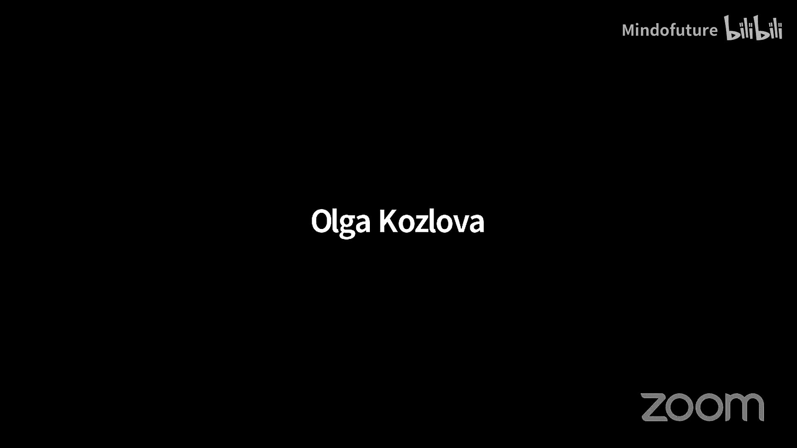

ちち。Hello。So let me just share my screen。Here am。Okay。

 hopefully everyone can see it or else you should probably tell me now。 So yeah， I'm Federico。

 I'm a third year PhD student in the University of Oxford。 and yeah。

 I'm happy to be presenting the part on language models。😊。

So I appreciate that a lot of people are coming from like graphraph neural networks perspective。

 so maybe not everyone is like super familiar with language models。

 so I'll give a very brief intro to them。So most language models actually use transformers。

 at least most of them like deployed and and so they're out aggressive and we'll kind of look into why this is important。

And the way they work is they essentially take text and they split it into tokens。

And the tokens are kind of like really the basic unit that this language model uses and the process of turning text into tokens is done by something called a tokenizer。

 and this tokenizer is kind of independent from the training of the language model but they are quite sophisticated。

 and they're actually very important for the performance of the language model。

And then these tokens are really just like IDs that the tokenizer gives to text to split it and then the part of the language model is kind of taking these token IDs and turning them into like token embeddings that then the transformer can process meaningfully。

And the language model is really a function taking token and token embeddings or really it's a function from text to text。

 of course， but there's some kind of intermediate process in which you turn text to these tokens。

 tokens are processed into final embeddings and these final embeddings are somehow processed to tokens or to text again。

嗯。And this utter aggressive process means that really the language model is predicting at one step it's predicting a probability distribution over what it thinks the next token should be and then it's doing this repeatedly so you really only generate one token at a time and maybe we can kind of illustrate a bit more tediously what this means so here we have this input which is like what is two plus two。

And this tokenization is the one that I believe would be the one that like ChaGPT would be doing。

 So it's splitting like words and and usually like digits are treated independently so numbers will have their own token usually or you know maybe multiple tokens and then。

You feed this sort of language model and then you extract the next token which would be the in this case。

And then in what you do is then you reffeed this this into the language model。

 so you've generated a new token and then you reffeed this new sequence where you added this additional token to get another token and then you do this again and you get another token and so on。

 And so from this you go like what is two plus2 then the model can generate like the answer is for so here even like spaces can have their own tokens like tokenization is actually very complicated and it's not like。

It's kind of like this dark art that makes language models work。

And these transformers usually use usually are called decoder only transformers and so this decoder part essentially means that they're using what's called a causal mask and I think people in GNNs will be quite familiar with masking this is how you kind of encode the topology of the graph well the causal mask really just means that like we have this lower triangular mask and this is important because essentially it's saying that tokens can only attend to tokens coming before them and this is quite useful because at least as a training trick of course because now you can if you didn't do this then itll be kind of hard to train models because the attention would be like looking ahead so if you're trying to predict the next token then you could easily like overfi to this and like not generalize at all。

And importantly， these transformers are actually extremely deep。

 so like the  400 billion parameter ma model has more than 120 layers。

 so these actually are extremely deep transformers and it's kind of remarkable that we can build such deep models and they work so well。

So just in equations， again， this is all like relatively simple， of course。

 but like so we compute first raw activations and these are based on the queries and keys。

 so here I'm kind of showing the computation based on like you fix a token and then you look at all the keys and these activations are simply the dot product between the two then people can modify this a bit。

 but let's say here you're not using positional encodings。

And then what you do is you you apply softmax and this softmax is simply you know kind of the standard way of taking a vector and RN and turning it into a probability mass function over an。

Overand things， essentially。And then what you do is you do a linear combination of this。

 so you take their values and then you linearly combine them based on the attention。

 and importantly this sum kind of goes only looks behind you right so like this is the fact this is coming from the causal mask。

Okay， so now we can start talking about reasoning and I want to give in this talk maybe more of an overview because I want to kind of introduce people to a lot of different concepts which I think are actually very related to what people are working on in graphal networks。

One of the kind of very pivotal papers which is also quite recent but extremely popular now is like is this idea of chain of thought and this was the this comes from the observation like from pretty nice observation it's like this fact that if you give a model like these examples are from a dataset set called GSM8K which is a dataset set of like kind of simple。

Math questions， but usually like word problems and so on。 if you give a model。Like this prompter。

 you can see that it gets the answer wrong， but instead what you can do is like you can kind of make it try to explain what it's doing so the difference between left and right is that here you give it in the left you give it an example in which you just ask it to spit out the answer。

 the answer is 11 while on the right you kind of tell it how it can potentially reach the answer and in this sense like the model is trying to to explain itself right when it's answering the question and somehow this helps with performance。

Now， there's also like people use this kind of different terminology。

 So there's like a difference between scratchpad and like k shot prompting。

 So K shot prompting is like in this sense， in this example， you have like K is one。

 So before you before the model is answering this question about the cafeteria。

 you give it an example on about tennis。 So this is like why you have you give it one example。

 if you give it two it be like two shot prompting and so on。

 and then there's also this idea of scratchpad。 So in some sense。

 scratchpad is like allowing the model to use additional tokens to do computation。 So for example。

 in some sense， in this output， the model is doing some kind of scratchpad computation where。

Where it's not just telling you the answer。 It's also like kind of saying how it's arriving to the answer。

 So there usually these two are used like at the same time。 But。

 but there's like a slight difference between the two。

And actually I think this can relate to a lot of work that people do in graphraro networks。

 which is that of like looking at the expressive power。

 connecting it to the Vifire Leman test and so on， people have done similar things in analyzing the excluivity of chain of thoughts so kind of analyzing how like does giving the model does allowing the model to kind of compute intermediate tokens actually help theoretically and the answer is yes。

 and perhaps this is not super surprising if you kind of look at transformers from a point of view like automata and so on like you can really view these these or like tuuring machines。

 you can view these kind of chain of thought process as allowing the model to have extra tape extra memory or so on so in this plot from this recent eye clear paper。

What they kind of show is like that you can in one way increase the amount of chain of thought the model is able to do so that it can capture a broader class of algorithms。

 in fact it can fit like even polynomial time algorithms and then instead you can also give it more embedding size and this is kind of like giving it more memory so these two are kind of two directions you can chain of thought can help。

Of course embedding size it's probably like you know it's kind of constant。

 but a chain of thought you can give it maybe more you have more freedom in this。

 but this is kind of a way in which people have theoretically shown that chain of thought actually has some theoretical benefits Of course these analyses usually have some restrictions so they'll assume like hard attention so attention only tends a single value or or sometimes they do like this kind of softer hard attention in which you can have multiple values but it's all uniform so you need to make some simplifications but this is a nice computational model and I don't want to maybe talk go too much deeper into this。

 but I'm linking here some papers like so for example there's this whole kind of line of work about complexity theory which is kind of what I was talking about now but there's also like very interesting work regarding like this introduction of this new kind of programming language which is called RAP and RAP is essentially a programming language that mimics。

Oations that a transformer can do and the people have， for example。

 observed that if the kind of task you want to solve has a small equivalent graspP program。

 then the transformer will be able to generalize better or at least fit this task better so it's kind of nice that people are going this direction of like trying to formally understand transformers but also these kind of connections to programming languages or what kind of programming languages。

They can implement， for example， this tracer work is is kind of showing how to implement given a RAS program。

 how to get an equivalent transformer out of this， so I think these kind of works are quite interesting and I'm assuming will be interesting to people who work on GNN expressivity。

Okay， so now let's talk a bit about length generalization。So I guess as Pe mentioned， you know。

 we're really interested in building well， I guess now also language models capable of performing robust computation and really for us we can try to restrict our sal for the scope of this talk to length generalization。

And this is the ability to extrapolate from short problem instances to longer ones。

Probably it's clear why you'd want to do this。 So you want your model to generalize。 but。

 but there's also some more subtle like advantages to this。 like in general。

 you can like shorter sequence data will be more abundant。 It's easier to to get。Data that's shorter。

 And， and also it's， it's computation more efficient to train on shorter data。 So it's。

 it's not just a nice thing to have， but it's， it's。

 there are also some kind of practical considerations that， you know。

 make this making a model that's good at this kind of helpful。

And so to this end there's this benchmark that Larisa and others in the group have worked on。

 which is this CLRs text benchmark which I guess Lasa will talk a bit about more in the collab part but essentially CRS text is a direct translation of the graph type the graph benchmark into text。

 so in this case there's like this insert insertion sort example where you you can tell the initial state and then you can give it the trace of the algorithm and ask it to predict the final step or you can ask it to predict the entire trace and the final step。

 so in some sense this is like taking the graph CLRRS benchmark and literally translating it to something that an LLM can like symbolically try to manipulate and this is quite nice because a lot of benchmarks in language model。

Like GSM8K are kind of word problems and they're harder to maybe generalize in terms of making them longer or more difficult or have more inputs。

While in this kind of benchmark， it's absolutely trivial， if you want to make it more difficult。

 you can just give it a longer array to try to sort so this is why this kind of procedural generation is very useful when you're trying to benchmark models and you want to do this robustly and kind of check generalization this way。

So here there's an interesting plot from the paper and what they show is so first of all this green line is this Gemini 1。

5 flash kind and where it's attempting to solve the CRS text benchmark and you can see that performance is essentially zero this model is huge compared to this 2 billion parameter Gema model which was instead specifically tuned for this task and you can see that the GeEma model even though it's much smaller has been tuned on it and it's much much better at the task and these red dots are kind of the indiriion dots while everything else is out of distribution so by in distribution I mean that the model has been trained on these sizes while where you don't have red dots it has not seen these sizes。

On the right when you have when you in kind of 35 to 40 this is the extrapolation regime。

 one the other ones like interpolation so。You can see that yeah。

 GeMA seems to be much better and also there's like this kind of plus RPE which stands for some type of position encoding improvement。

 which also helps the generalization， I'll talk a bit more about that later。

But here you can see for many kind of data sets， this is one model being trained to solve all of them simultaneously and you can see that tuning of course helps。

 but you can also usually see， for example in naive string match or a lot of them like in extrapolation。

 so in length generalization， the models really drop in performance quite quickly。Yeah。

 so I spoke a bit about position encodings now positioncoings really impact length generalization and for example the ones that they showed in the just showed in the plots are these randomized positioncoings and at the end I have references to everything so you can find everything I'm talking about but then there's like a lot of a lot of people in general have also looked at position encodings and tried to。

You knowT to develop positioncoings that generalize better and the main intuition is that for length generalization you really care about how these positioncodings behave in the limit or at least like as kind of your sequence gets larger and larger。

 so fire and RP are nice examples of this kind of careful type of study。

Then people also developed embeddings specifically for certain operations。

 so for example these as embeddings。Which are designed specifically for arithmetic type of operations。

 however， most most LLM still use these rope positional embeddings。

 which are probably like the most common at the moment。

And rope were motivated because essentially they decay the activations as the distance between tokens increases and this is the plot which they showed in which you can see this kind of decay as the relative distance increases but instead actually in our very recent work we show that this does not really have to happen and this only happens when these queries and keys are the same vector and so we have some kind of more like kind of mathematical analysis on this and and so for example what we actually show in our work is that like rope actually helps in probably length generalization for different reason。

 so for example it allows these models to build very specific attention heads so for example here you can see these like head five and eight are very distinct from the other patterns and this is kind of what we show in our paper we really kind of dive deep into like。

What's happening into these kind of embeddings now I won't go too much deeper into detail。

 but there's a reference here if you want to check it out。

 but my main point here is that like length generalization。

 well position codings play a huge role in this and actually understanding them is extremely valuable and because they're still quite poorly understood。

And I want to talk a bit about information propagation in these transformer models and I want to show motivating an example which is a discounting task so here we ask Gemini 1。

5 like can you sum1 plus1 plus one etc and this kind of X axises is how big this 1 plus1 sequences and the y axis is the absolute error so how far off is Gemini how far off is the answer and you can see that already at this task Gemini is really bad at doing this and in fact for many kind of related problems it's quite bad so here for example like counting just the ones in a sequence of ones and similarly we kind of try with chain of thought with few shot learning trying to make it like use like scratch pad it doesn't really work。

And these are huge， huge models。 I mean， Germany and 1。5 was at the time like the kind of。

The best German eye model we could find and and this kind of like there's an question here is like is this like a very fundamental issue or is this like just we need more training or for some reason they're not trained on summing one plus one plus one。

 etc。So to check this， maybe let me show you a nice experiment， for example。

 let's say we prompt Gemini how many ones are in the following sequence and I give it K1s and then how many ones are in the following sequence I give it K plus11s So one and two only differ that two has an extra1 at the end and I plot the norm difference between the last token at the end of the transformer so this I'm using Gema 7 billion parameter model Gema and you can see that as the K factor kind of grows the representation gets closer and closer。

And this is an issue because at some point you can see there's this BF16 precision。

 at some point if the sequence is too long the two sequences will have the same output representation。

 so they're forced to make a mistake， so essentially the two representations become indistinguishable as k grows。

 it falls under the floating point precision。And this is what we call representational collapse。

 which is in some sense analogous to oversmthing， there's some slight differences。

 but it's some kind of result about oversthing and we make this more formal there's like a few assumptions you need to make but but yeah so we pretty much verify that this occurs in GeMA 7b and this points to this kind of issue in transformers that you know like just due to this effect like counting in these kind of styles of prompts is forced to break at some point。

And there's also a similar effect which is due to the causal mask so this causal mask is again like this lower triangular type of mask and what happens is that information still has to reach this like y5 so at each layer at some point you need to extract this yfi。

 which is like the representation at the last layer of the last token because then this is like what you then softmax to get out the next token so the softm only looks at this last token。

And。The basic intuition here is that like let's say youre token V5 and you want your representation to survive into y5。

 there's only one path for your representation to kind of survive and it it's if these attention coefficients are quite large from V5 into V5 instead if you're like at V1 there's like many。

 many paths that your representation can take and kind of allow it to survive so for example in this diagram the blue starts to dominate simply because it essentially has more paths that reach y5 compared to the red so you can see nicely in this kind of illustration here。

And like a coroller is like we have some experience in the papers like that copying the last token for language models harder than the first and this is because essentially the information from the last token is much harder for it to survive into the representation of Y5。

😊，We have many more details in the paper， but I guess one of the takeaways is that like phenomena like over squashing and over smoothing are are actually also present in language models and in many ways theyre。

They're kind of analogous and I think this connection between language models and graphal networks or at least transformers and graphal networks has been kind of known。

 but what's very interesting to me is that like these phenomenon you can kind of start studying them from a point of view of like text and like how do these phenomenon related like tokenization and text and all these things is very interesting and then the fact that they then imply some kind of failure case into in some problem is I think maybe something that people in graphal networks are quite interested as like an application of these like over squashing and overs smooththing results。

Okay， and now I would like to talk finally about the softmax function。

And the submax function is really one of these like key functions in machine learning and they they take a vector and turn into a probability mass function and it has nice properties。

 of course， relating to like entropy and so on and it has been shown actually many works in previous years so some works at Ns and this works at calm that。

That some tasks like may suffer from this dispersion of the softmax and by dispersion。

 I mean as you add more tokens， the softmax is forced to lower attention to the existing tokens and this is simply because everything has to sum up to one and now if you're if you add more tokens like it's like。

🤢，Tokens cannot have zero probability because the only way for them to be assigned zero probability if is if their activation is negative infinity。

 So of course， activations are all bounded， so this cannot really happen so。For example。

 in this plot what we show is like for this max retrieval task。

 as you keep doubling the sequence length， at the start your max retrieval is correctly attending to the correct token。

 but as soon as you go in length generalization so out of distribution。

 the softmax has to disperse more and more until it's essentially uniform。

And this kind of points at fact that like the softmax function makes it quite challenging for you to be robust to very sharp types of operations。

And a nice way to formalize this is perhaps through entropy。

 and entropy is really just measuring like how close to uniform your distribution is。

So the highest entropy distribution is exactly the uniform distribution now this kind of channel entropy is defined on discrete distributions because in continuous distributions is' actually not as well behaveved but you know we're softming discrete distribution entries so we're fine and here what we plot is we give it we give GeEma some inputs and we grow the underlying sequence size so the sequence is like similar to the ones we had in our transformers need glasses papers so like you know can you count the number of ones and you give it a growing sequence of ones and you can see in these plots that the entropy in the attention heads grows as in the number of items is increasing and this is kind of showing how like this distribution is becoming more and more uniform simply as a function of the number of items which are。

Given to the。To the model。And in sometimes， this can be used to argue that like things like copying or you know very sharp very sharp operations cannot be robust unless you have like things go to infinity or negative infinity right so then you can have the softmax can build delta functions。

 but of course we cannot do this in fact what we show in the paper that what really bounds you is like the spectral norm of of the query and key weight matrices so these are the ones that kind of tell you how sharp your Somax can be because Somax being translation andvari really all you care about is the kind of range that the softmax values can have and this range is precisely given by the spectral norms of these weight matrices because these are the ones that define the range in the delt product。

So for example， what we show is that changing the temperature or things like this can be used to artificially sharpen the softmax and you if you're interested in this kind of work and like the relationship between softmax and entropy and out of distribution generalization。

 I invite you to check out our preprint。Which yeah， this paper here。Okay， so just as a summary。

 we studied decoder only transformers and we saw， for example。

 techniques like chain of thought and we kind of describe how these can provide。

Additional expressive power， like not only in practice， like empirically， but also theoretically。

And we really focus on length generalization， which is this problem of like you have a problem which or you have a task you want to solve which the number of inputs can grow and you want to generalize you want to be able to solve it regardless of the number of inputs and we saw how like CLRS text is a nice way to kind of benchmark this it's like a natural kind of paradigm to test length generalization。

We also saw how position encodings play a big role in lung stization。

 and this is I think a very interesting and active area research。

And then things like the causal mask and how this relates to overs sququaashing due to the topology or representational collapse so some kind of oversmthing idea and then we also saw how there's like issues in the softmax so the softmax is dispersive so this points is like some issues in generalization just from like architect the architectural level so of course it's very interesting now to like take these findings and like try to improve and on corner models and this is kind of what we've been trying to do in our work we try to point out issues and then try to somehow fix them。

Jude like it now that we have a better understanding I have left also a bunch of references。

 of course， this are not exhaustive， but hopefully it's a good way to get started some chain of thought on expresssivity。

On RAsp， on length ionization position encodings and other like miscellaneous ones。

 which might find interesting， a lot of them we did talk about in the slides， but not all of them。

 so maybe it's hopefully some nice these slides act as like a nice resource for people trying to get into this kind of research。

And now I'll hand over to Larisa for the collab。 So stop sharing。 Yeah， and thanks so much。

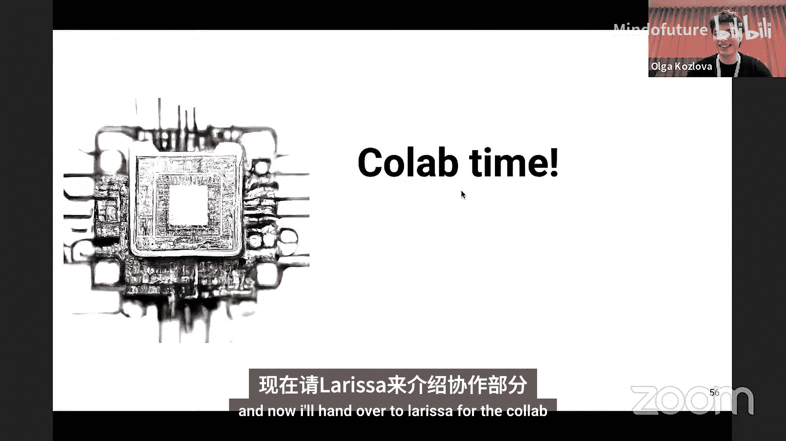

Yeah。I think we can't hear。😔，嗯。Thererissa， sorry， can you hear me？好。Laa， sorry。

 sorry to interrupt you。tryingrying to reach how to arrow。

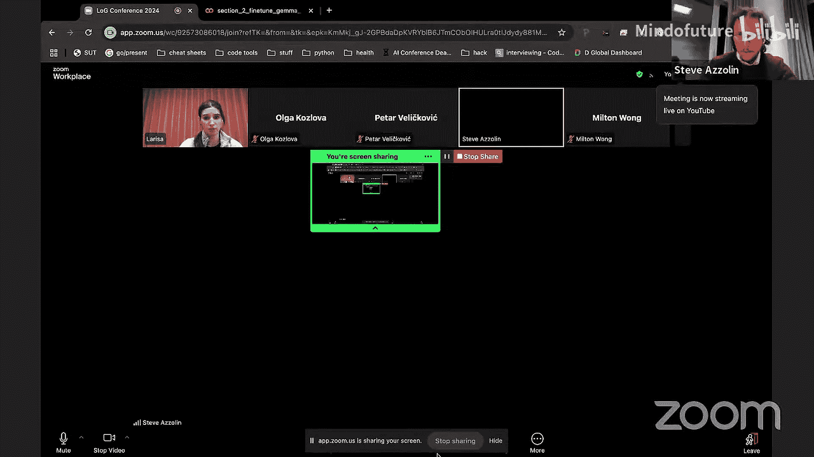

Yeah， Laza， can you hear me？Because we can't hear you。Let's throw one more time can Okay， no， yeah。

 no， yes， perfect Yeah， sorry， I try to， I try to contact you and I need a manage too。

So is it okay now？Yeah， I can hear you loud well Okay， great， sorry for this。

 What about screen sharing， Does it work now Yeah， we can see。

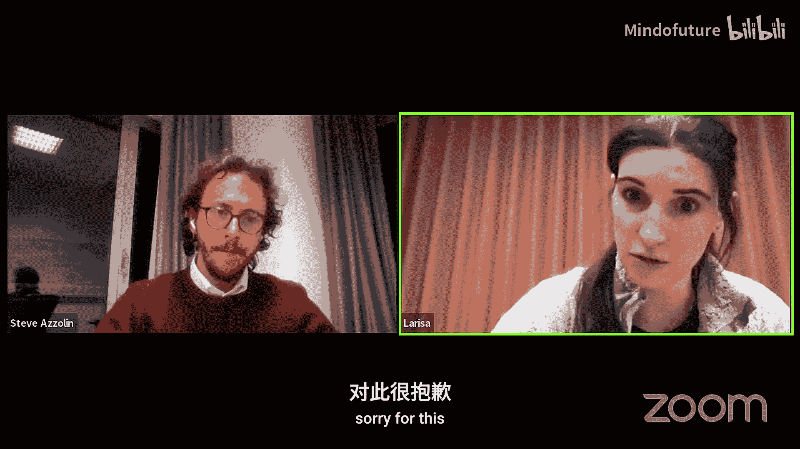

So we can okay， let's start over again， sorry about this Yeah apologize apologize for this so okay。

 sorry At number two， hello again， my name is Theresa。

 I'm a research engineer at Deep Mind and today I'm going to show you E Ecoop。

 which should kind of gear you up with。Everything you need to conduct your own experiments with CLRS and large language models。

To start so at the beginning， I want to emphasize that I use a co version to prevent any preemptions because actually fine sh of a large language model is a demanding compute demanding thing。

 so that's why I use co Pro to prevent any preemptions but you can try to use a free version it's not a problem。

 but sometimes you might get preempted so。And wait till the collab schedule gives you another batch of compute so for this collab I use a G4 GPU kernel of the coll you can find it there so if you click。

Connect if you change try to change runtime。 so my setting is T4 GPU and this is high Ram version because like usually you need a lot of memory in your experiments and it's better have more than less。

So at the first step， we just。Install all all packages， Python packages we need。

 And after them being installed， we are good to go for setting up the environment。

 And as the first step， we are going to to set up hugging face talkingken。

 So here's the instruction how to do this。 You need to do to the hugging face website set up the talkingken and then put it there into a special。

form。just to save a key which allows you to access Higing phase repository。

So the thing is why do we use Hi phase， h phase it's actually an industrial level standard right now for large language models。

 this is the most popular library， it contains a lot of different models。

 a lot of different pretrained ways， and it's very easy to work with it。

So that's why we choose it and as soon as you have your secret key and token。

 your secret installed and Hi face token is loaded into collab secrets， you can use it。

 you just need to import a correspondent library and then just ask the library to give you a token。

After this， we need to do some minor environment setup up it isn't very tricky I just switch off this pre allocatecate thing in checks to really to make more memory on GPU available because checks usually tend to pre allocatecate quite a lot of memory for itself for its own operations and there we don't really need this so I just switch it off through this。

Set through setting up this value。And create a random number generator keys for further use。诶。咩。

Rund this for you。Yeah， and in the final before I carry on to loading the model。

 I just want to make sure that everything is set up right and we are really having deal with GPUs and because this' is very important it's very hard to find model for example on CPUU but as you can see I checked our default backend and this is GPU。

 this means we're good to go。So the creation， the loading and creation of the model using Higing F is pretty straightforward for this。

 you need to choose the model name from the Huging F Report index。In our case。

 this is a Google Gema 2 B model。Then I set up some quantitization parameters。

 this is just a technical part。Quronization parameters for our model and then I load the tokenizer tokenizer this is you can think about it as a program which translates text into numbers and vice for the model and then to do the backward transform after the prediction so as you can see there I tell I use the hug phase talkingken to access actually tokenizer because it's loaded from the hugging phase repository。

And after having the tokenizer， I load the model， also as you can see I pass the model ID。

 which is the name from the repository index。I pass the quantization parameters。

 name the device and finally provide access token for the function to be capable to load the weights This model has only two billion parameters。

 but in fact it takes around five gigabytes of memory so。Yeah， it's quite big。 and it usually takes。

 as you can see， a few minutes to load everything into your co。

 but as soon as everything loaded we can。We can experiment with it。So why it's loading。

 I can just show show you the test imprint。 So as soon as model is loaded。

 you can ask it about something to just verify whether everything is fine with model， whether。

Like our setup in terms of accelerators， GPs， etc， works well or we have some problems and just for this purpose you can just ask the model something in this case I asked the model what would you be if you would be whatever you want to be and finally enough it started to advertise me some Netflix area which is pretty funny。

So， but。Now， good news， we actually have our model loaded， and we can conduct our experiments。

 but before。😊，We try to teach model something。 we need data。 so in the following section。

 we are going to actually create our own version of CRS text data set and then apply it as a source of data for fine fueling process。

So。Initially in the talk， you might notice that Sus has a variety of algorithms implemented。

 so it can generate samples for more。Different tasks to ask model to solve different tasks。

 there are 30 different algorithms we can employ for this in CE。Some of them are pretty trivial。

 for example， you have just searching of minimum in the array， but some of them are pretty advanced。

 for example， we have optimal BSD。Yeah， but yeah there are many different things and different types。

 also you have some sorting algorithms， string related algorithm。

 many of them the extra as a graph algorithm。So but let's imagine we choose something and want to generate our first data set to do so I provided you a function which does this is defined there。

 I'm not going to go into the depth about the code because it's quite selfexplanatory if you'd like to you can just read through it and use it。

That's why I'll jump to just to the main call which creates the data so in this example we want to create actually a very simple data set。

Wwhichch comprises two algorithms， Belman Ford and BFS， and it was in the previous tutorial。

 and used two lengths for each of this algorithm of size 8 and 16。

For each unique combination of algorithm names and task plans。

 we going to generate around we are going to generate 100 samples。Yeah。

 and then when all samples are generated， we are going to split the initial big data set into two sub data sets where a train data takes 80% the initial of all samples。

validationaledation test data sets take 10%。So once everything is generated。

 you'll receive the data object which this is a very typical data type for hug phase and Pytorch and this data actually contains train test and validation。

 data sets and provide all necessary interface interfaces which you need to run hugging phase fine sh function。

 so this is kind of a nice wrapper which frees you from any hustle with data as soon as you have it。

And now let's look into， actually，Content of this data。And there I print actually one sample。

 the first sample from the train dataset and we can see there that there are kind of two records inside of the sample。

 the first record is marked with the user role and the second is the assistant role the user actually the text is about setting up the task what are we going to ask the model and the assistant record is about dancer we expect to have。

I'll explain why data is formatted in this way a little bit later。A little bit later so。And。Actually。

 the main idea is since we have rows， this is a special way to signal the model。

Which part of the text is expected to be like the user input and which part of the text is expected to be actually the model output。

 the model answer to the text。So but obviously usually large language models they take on the like plain text。

 that's why we need a special function which turns this into a proper text。For this purpose。

 I imply the technique which is called chat templating， you can read more about it via this link。

But generally speaking， what it does。It takes your initial sample。

And actually turns it into a plain text， plot some special text which like adds some additional information per se signals to a large language models。

 for example， there we have this again this Belmon for example。

 but after applying tokenizer is this shot template to this data we have a very nice plain text with special symbols。

 for example BUS means beginning of the sequence， so this one marks the beginning actually of the sample。

Then we have a start of the turn and end of the turn these two tags actually separate different roles from each other and let model to understand where is the data input from the user and where is actually。

Something which we suppose the model has already predicted and we are trying to maybe continue through auto regressive predictions。

So yeah， and as we can see， we now have our text formatted and the only thing left I need to do before we start our fine tuning process。

 I need to define a function which will automatically。

Convert this original sample sample into the tokenized version which I just showed to you。

 so for this purpose I defined this function， it's very simple I just take the input sample and convert it。

And let's see how this works， I indeed took the first sample of the train data and you know to be fair with the model I don't want to show it the answer。

 that's why I remove the agent answer from the sample and convert it into the text and get a really nice and plain text function a plain text with text。

And then I feed it into our model。And as you can see。

Things don't go well because Mo has never seen this format before and has never most possibly tried ever solved problem like this。

 That's why it makes an attempt to answer something to our question， but utterly fails。

And that is to say its we might want to have a model which is like， you know， specialized。

 that is to say fine tune on our data to conduct our further experiments。So for this purpose。

 we are going to run a fine tuning fine tuning process using Laura， Laura。

 it's a low rank adaptation techniques， which allows your。Fune large language model。

 like kind of cheap， cheap because like if you try to function den entire model。

 it has that many ways that most possibly it won't fit into accelerator and it might take a really long time to train like a big model from the scratch。

That's why people came up with like you know simple and cheaper solution of doing so what do they do first we say that we are not going to train the model。

 we are going to train to only the subset of layers and for each layer what we do we take a layer and actually freeze it。

 we don't change it during the training but what we do in parallel to this layer。

 we create two layers。Two smaller layers， I mean one side of this layer is usually of size D but the internal side is kind of a set of two bottleneck layers is R and R is usually is very extremely small so that's why you have this low rank thing into the name of low rank adapter。

And you have two sequential layers of low rank and actually。

 in fact you train them instead of frozen weights and as soon as you pass data through your frozen layer and through the set of layers during function functioning step。

 you just sum them up together， and this is your new representation。

 which passes by further to the next layer。When the functioning process is over what you do。

 you just multiply a by B and you have a new matrix of size D by D as the original weight matrix of the layers was and just add them to the original frozen layer and you actually per se have a new。

New weights for your layer， we should just replace in the original checkpoint and this is said you find student your model。

Youll find your there。So and actually when you have your model loaded。

 when you have your data prepared， it's pretty simple to kick off the process。

 you actually define Laurara config where you say how small the rank of your lower rank adaptator is。

What kind of layers you are going to train and what kind of layers you are going to train for more details I encourage you actually to go to this tutorial which describes in depth all possible detail and tweaks you might use to find you the model。

Yeah， and as soon as your lower confi and the rest of the things are assembled together。

 you can just kick off the SFT trainer function and train your model and it takes approximately maybe 10 minutes or even less four minutes。

To see the results so there we did very little steps， we actually did 200 steps。

 but we can see that the last function went down and that is to say that you know model inhibited some changes in this behavior otherwise for our loss function won't change。

And yeah， and we want to actually see what's the difference now between what we used to have so this pretty strange answer there and what we have now and so for this purpose let's feed one more sample into our model and as we can see there。

Now model maybe so we've done a very few steps there。Model， maybe dancer might not be right。

 but now model is doing its best to follow the structure we provided even after a very few steps like 200 steps for the model it's。

It's very little， but due to some reasons I don't know why。

But the model decided to identify itself as thego instead of the model as we used to have。There。

Let me show you this place。😔，I heard it。Yeah， there are。 but overall。

 there is definitely a positive tendency in。In its response， so if you find your model for longer。

 you will definitely have much， much better results。

And in the final I just want to show you a few tools which might be useful for your research。

 for example you might see beautiful pictures from the Federica Federica paper so many of them were obtained by the Pennzi library library which allows you to visualize the internals of the models so you might see the weights for example。

 of heads， the activation etc etc and this actually helps you a lot to understand what's going on inside and why model respond to your question in one way and another so this library works not only with Google models but with all models which are presented in Higen F repository so if you'd like to do some NA visualizations for your research definitely give it a shot。

And in the rest of， this is just a very short code。

 the code that allows you to load models and to save your model after functioning， load it back。

And again， feed data into it， for example， to continue your research and your investigation about different things related to reasoning and maybe something else。

So actually， this is it I wanted to show you， I hope。

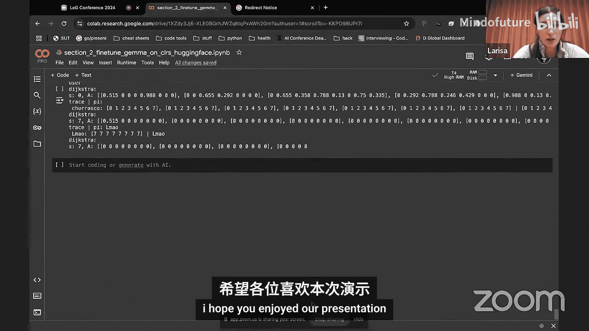

You enjoyed our presentation and now I think I hand over to Alex and Wilfred， right？So， yeah。

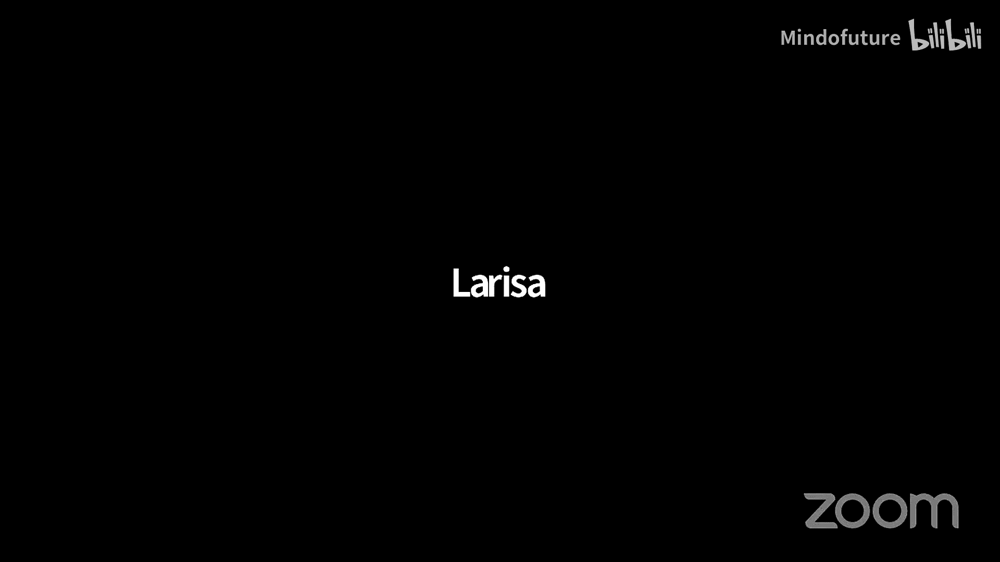

Yeah。さ。好。Soれ do you hear well？Yes， thank you you。and thank you for attending tutorial。

 this part I would like to talk about neurosymbolic crrising as well as NR neuro algorithmgorithmic crrising。

 specifically on language and graphs。😊，In this short and final part of tutorial。

 we would tie both parts together。嗯。And define how GNN can allevvate several of the issues。

Of the decoder on the transform。My name is Alex and research engineer at the Google Deep Mind。

So I would like to start with motivation。あさ。VO experience。Different kind of。

Basically a ran of one and which model can come into the every corner of the society。

 but surprisingly the very unstable fragile when we when it comes to out of distribution reasoning so one of the recent papers like a GSM symbolic very simple modification on of GSM the data set like basically a varying like just names and values。

 we see huge drop on performance for all modern large language models and even worse is like just irrelevant irrelevant information to problems performance drops up to like 65% and not only is so this is like just slight shift of distribution。

 but if you would consider maybe like a harder reasoning problem like for example chis。

Or like puzzles， we always see that we scale of the problem which which bigger and big have number of combinations。

 like performance of such models drops rapidly。😊，So and I think there's certain similarities with how people perceive reality and how they think。

 like just just small just example， like go on the first board。

 like if it's like average probably co， we will spot immediately that he or she can fork queen。

But on the second word when we need to have three moves to basically do the same it's already harder and requires something so it's deliberate thinking and like point in and reasoning so it's certainly true that like more and more data I mean there in being a training like becoming a master Grand master you can start recognizing this position the same proof is LOMs with a huge amount of data you definitely like create the bar and you can。

kindind of automatically detect and solve certain problems。

 but this does not imply that you solve reasoning because like you still can face bigger problems or still you can go out of distribution so I would claim that if any size of whs that will be always problems that unsolvable like and go puzzle always we will need to find like certain solution to like reasoning it definitely there are many ways of doing this but the problem is there and we wont I think go is try to solve and the problems which are not entirely training set so basically going out of distribution another small example I think there was recently is zebra logicic benchmarking logic or reasoning ability of language models which measure different performance of different language models on grid puzzles so grid puzzle is。

ASimple puzzle is like bunch of logical statement and you need to find for example。

 matching so like who lives in what house or who owns certain things and like testing on human we already see that like what dimensionality for the puzzles time required for human to solve it grows dramatically and so we would expect as well like for OOMs need more resources or better algorithms to solve this problem or probably both so can and we can take inspiration from like fundamental work of Daniel canning about thinking and fast and so like who defined like concept of system one and system two system one being。

Ft automatic and quick system so which operate effortlessly with no sense of monetary control so this application is human and system too is like requires attention and like effort andological step by step reasoning so it's frequently associated with agency or concentration。

😊，So I think。😊，Those combining those like assuming that like Lms so so significant part of like fundamental like pattern matching。

 I think the reasoning is still has way to go。 So I would just two quote of。

Leslie Raand who made fundamental contribution to learning theory。

 so he claims that most fundamental aspects of intelligentent cognitive behavior has ability to learn from experience and the ability to reason from what not。

As a quote from Yosha Benjo， it's maybe old but it still， I think。

 holds true that current training systems are are weak once they're required to go and generalize beyond training and distribution。

So I could just briefly look on this system one and system two characteristics。

 we can see that very much complementaryium so like if system one is fast maybe in a sense implicit but system two is so slow in the sense that it requires multistep or algorithmmics in here so the same is like we may think that system one is can easywise parallel processing system two usually does have some sequential momentum in it。

 so the same is fixed compute like if system one is maybe fixed compute or system two is definitely require variable amount of compute with BnB problem sizes you need to solve I think even it' an energyous human but maybe average human reaction time is like 200 milliseconds。

 but you cannot definitely solve complex problem or just。Of central 100 milliseconds。

 and you definitely need to also apply some deliberate logical step by step reasoning。

So the same as goes about the distribution outer distribution and pattern much and such。

 so like I think it's very nice and kind of a nice idea to。😊。

To combine those systems togetherza and definitely was done before in many different ways。

 I would argue that like Al zero system like which combines some Montetecarro research。

And like deep learning network is part is one of the approaches also like tuuring machine narrow tuuring machines。

 which emulate。Algorithms or alpha code maybe we can in sense things that like system one construct system two。

 So there are many definitely many different approaches。

 but many of them are very fruitful and promising and today we want to work in one of those like we work from our group where it now and Vi is going to present in detail this work So yeah please please take driver。

😊，Can you hear me。啊。Yes， we can hear you。Okay so hi everyone， I'm Wilfred。

 a research engineer in the foundational research Uni at Google Ded， and today I'm going to。

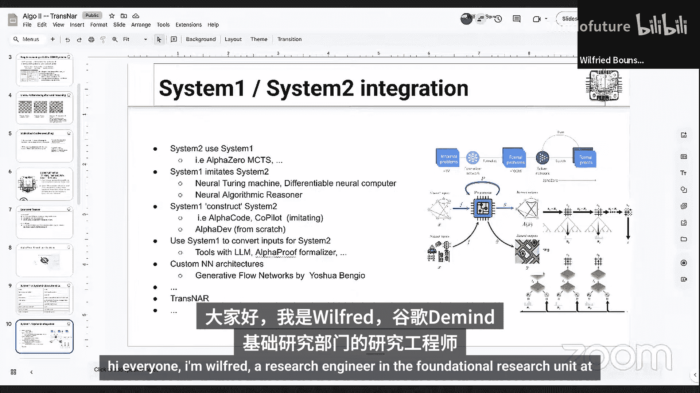

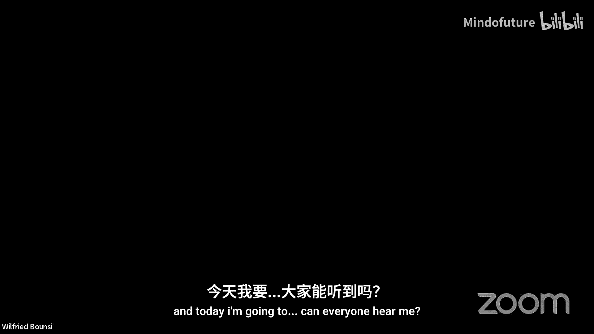

Can everyone to hear me。Yeah， yeah， we can hear you， but we we don't see anything just we talking。

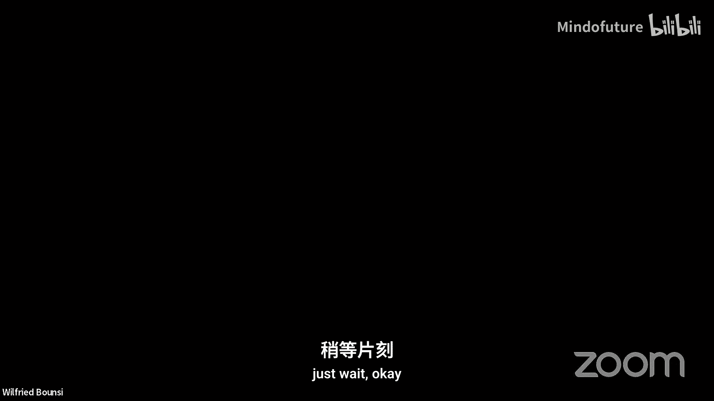

Just like good。I can't see my slides I'm not sure Alex are you still controlling of this sorry sorry we don't hear you。

Can you hear me。Yeah we can hear you we just hear your face know your slides my slides okay。Okay。

 let me just share the size then。So Im not to use with Zoom， so it's a bit。

 I thought it would be it should be like a green button。

 which like share screen in the bottom of the interface。Just to see。What this。

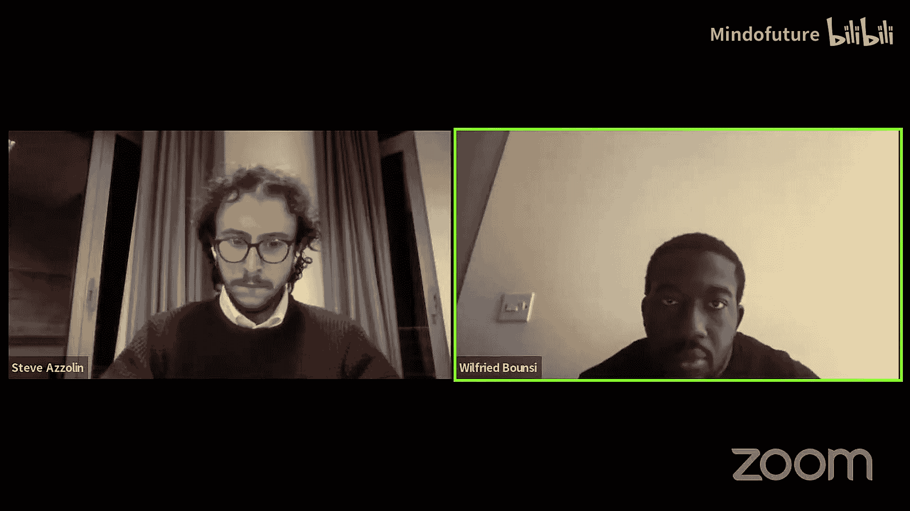

So can you， can you see the。Yeah， great， we can see it。别所以说。

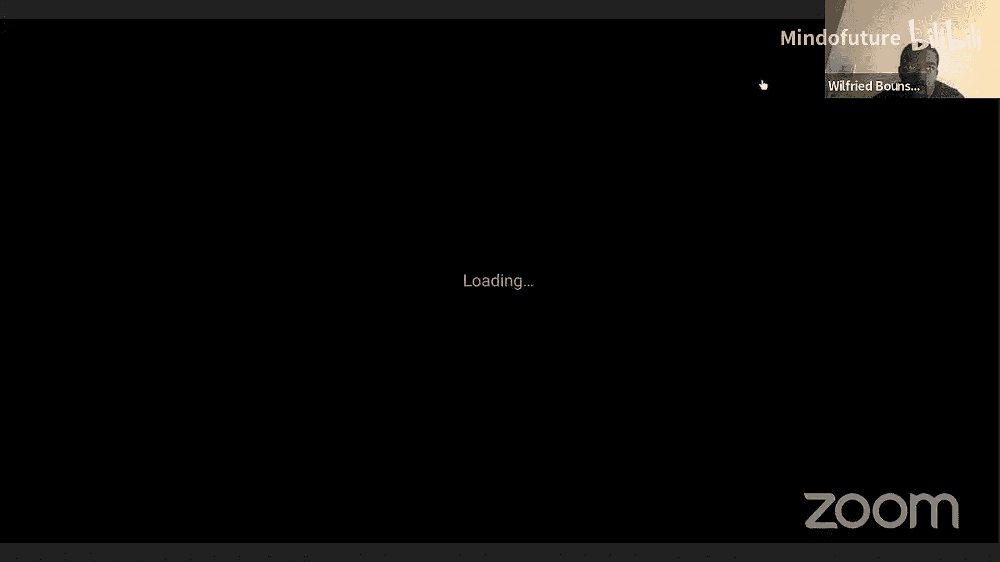

this my。Okay perfect sorry I'm really not just the Zoom okay so as I was saying hi everyone。

 I'm Wilfred a research engineer in the foundational research unit at Google Demind and so then I'm going to talk to you about our work on augmenting large language models with neuralalmic reasons。

And so the motivation behind combining LLMs and NEs is pretty straightforward。

 LLMs as you all really good at communicating natural language。

 but this still struggle with robot algorithmic reasoning on the other hand NAs have been so be。

Quite good at this kind of robust reasoning on symbolic graphical inputs。

 so the big question that we try to answer was can we get the best of what works namely。

 can we get a model that can robustly solve algorithm winning problem specified in text。

And to answer this question， we proposed the hybrid model whose architecture is depicted here。

 you can see it involves transformer layers with the N and it simply implements a unidirectal post attention mechanism between the N nodes and edges and the transformers tokens essentially。

 so the transformer updates to the post attention updates the transformer tokens representations using the computations performed by the nor algorithmic reasoner。

And the data set that we used for this study or the two dataset sets that we used the CRRS 30 and the CRRS text dataset。

 which I'm assuming you should be familiar with by now since they were covered in earlier tutorials。

 but if not we have a reminder of what a sample from this dataset looks like here you can see that the green part so you can see a sample here for the insertion So algorithm。

 the green part corresponds to the input the traces in blue and in the target against which we evaluateva the model is in red so for this study we didn't really use traces that we were trying to predict the target so the output given the input directly。

So we build the transna from a transer model of 70 million parameters equipped with rope plus randomized position includingcoding。

 I think federo mentioned how this randomized position includingcoing can help with our distribution generalization and this study we wanted to you have the transer as powerful as possible in terms of so that we wanted the baseline to be as good as possible。

あの。On auto distribution of geneticization engine so we equipped both models with randomized solution including we trained both models with the trans undertransform on  seven epochs of the training data。

 which included training sizes of four，8 and 12， we then evaluated both models on auto distribution sizes 10。

 which tested interpolation capabilities of the models and 14 which tested extrapolation capabilities。

We consider both the cases where the base model was pretrained and the cases where it was not pretrained so randomly initialized。

 and this in practice correspond or whether you are in a French tuning regime or in a pretraining regime or in an initial training regime。

Our results showed that the transna significantly outperformed the baseline so the Purrons owner on most categories of algorithm。

 as you can see here。In both the extrapo and the。And the interpoli regime。

And this was consistent across whether you pretrain the base transformer or not， essentially。

So at this point we've established that we can indeed build a hybrid model that is good at solving algorithmic problem specified in text right。

 but the obvious issue is that it requires two input streams at inference time text and graph when for a lot of problems of interest we only have one at inference time usually text right so the question is can we do better can we can we get rid of the second input stream can we get rid of the requirement of having this accompanying graph。

With the representation of the problem and so this end we explored distillation。

So we tried to see if we could distilllate a transform model into a pure transformomer model in such a way that the transformer recovers or so recovers the improved auto distribution capabilities of the transmit。

So here are some of the experimental details for the distillation， as I just mentioned。

 the trans was you know the model that we， the teacher was the trans model that we had just trained。

 so the one trained on sizes for eight and 12。The overall student loss was computed as a convex linear combination of the ground truth next to and prediction loss restricted to in distribution program size only。

 and the teacher distill loss present tropy between the teacher logins and the student prediction。

And these were weighted convex linear with a factor in a convex linear way。

So the student training sizes included for eight and 12 for which both the groundro and the teacher supervision were provided and we also provided teacher supervision for sizes 10 and 14 just so the teacher can somehow teach or show the student how to behave in this auto distribution setting。

 but because we provided signal at these sizes we call them soft kind of call this regime soft audioD。

 so the student test sizes included 6 and 10 which tested the interpo capability and 14 and 16 which tested the extra Po capability and further。

 10 and 14 because they were kind of seen through the teachers logs。

 we referred to them as as I mentioned above auto distribution sizes。

We on these soft adult distribution sizes， but we also evaluated on the you know truly never seen by the student sizes which are 6 and 16。

 so these were never seen either by the you know by the student neither via the groundro loss neither via the teacher supervision。

 so this one kind of true adult distribution sizes。

So this is it for the experiment details of the distillation。Experiments。And。Yes， so we。

So here are the results and again we showed them for various adiion regimes。

 including the interpolation regime which here corresponds to  six and 10 and the extrapolation regime which corresponds to 14 and 16 and we already mentioned that you know 10 and 14 kind of this soft OZ sizes because we provided teacher supervision for this lens。

 but we also have  six and 16 which for which we never provided any kind of signal or supervision signal to the pseudoarner so these are more like the the the。

The true adult distribution test， if you will， and you can see that so what you're looking at here is the comparative of the performance of the different models according to depending on the value of alpha and。

And alpha is was simply the coefficientient of the distillation of the teacher supervision。

 essentially in the distillation loss in the final distillation loss。

 so an alpha of zero means that there's no teacher supervision and it also means that。

It is a baseline so we're training a pure transformer model on the in distributionriion from central P loss so that's the baseline and any value of alpha that's greater than zero is a distilled model because it kind of benefits from the teacher supervision and the baseline here corresponds to the red bar then and you can see that across the board pretty much and for the various algorithms considered the red bar is always most of the time at least is the one that that's the smallest which means that the distilled transformers the transformers distilled from the transform most of the time better than the regular transformer。

So yeah so at this point we've shown that we can build this trans transform hybrid architecture that performs rather than the transformer。

 but we've also shown that we can then you use it to train a pure transform model that's also better than some transformer that you'll just train on the in distributionri sizes of your data。

 so let's now look at the limitations of the approach。

 so the first one that needs to be highlighted here is the dependence on initial graph representations。

 so even though with thisill， we kind of like were able to see content that at inference time。

 we still nonetheless need graph inputs to even train the transform before distilling it in so into a pure transformer。

So we we still depend on having， you know once one graph inputs thats graph inputs that are once one。

like that map points one with the text inputs and that's not always the case so that's one limitation of the study the second limitation regards the distillation experiment that we w run and you could see in the results that it's also always clear which which distillation factor to use yeah it kind of looks like it depends on on the task and it wasn't particularly clear as how to determine that automatically so yeah so the natural order limitation is maybe investigate that like how to find optimal alpha for you given scenario and also maybe consider using enemble decoding techniques where you for example you would train multiple distilled models we know with different alphas and then maybe decocode from this。

ble of distant models using ensemble techniques used in usually used in the field such as majority voting or even doing something more on the。

On the weights the different models in your ensemble， you can， for example。

 do weight averaging and then decode from a model that derives from this weight aaging right。

 so say so yeah， how exactly how exactly to choose the disstillation factor and morely how to deploy the distilled transform models is still on。

Okay， so。Moving on to the conclusions and steps， just as a reminder。

 we have introduced the transformna model which is a hybrid architecture combining the language an understanding of a transformer with the robustness of reasoning of a pretrained gene based nor algorithmic reasoner have shown through any evaluation on zero text that this transformer is much better than a transformer in terms of our distribution generalization。

 we've also shown that we can distill this transformma and a transformer only model which is also better than just a transformer trend on in distribution data。

 and we hope that future work will investigate expansions of interest notably in mathematics logical inferences and command and reasoning that's it。

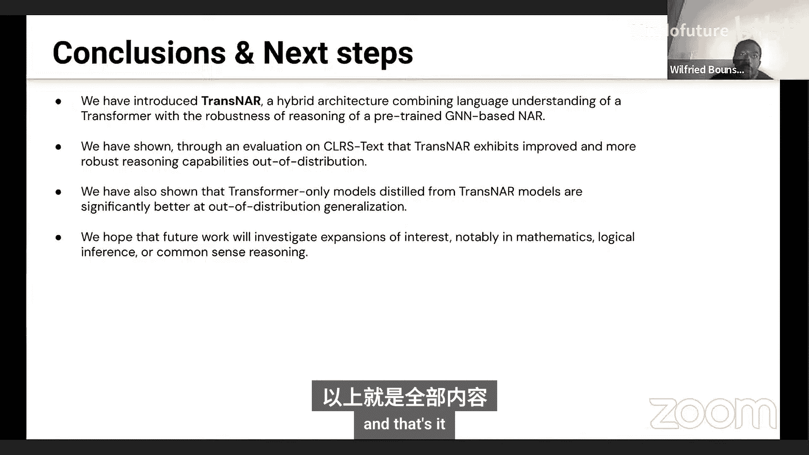

Thank you。 so now I will show small demomaco integration。Transar and Gema model。 So give me a second。

 I will try to share the screen。

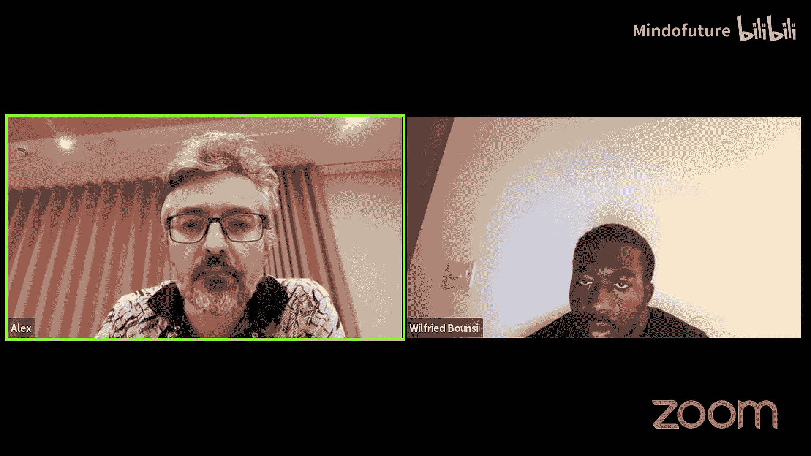

Okay， so in this scope， we will just try to have small demo how we can combine Gema model and transar gene and based architecture。

So it's based on the work of Vasa so what of things we are going to do is the same。

 so just we need to install a bunch of packages。嗯。To the patch dependencies。

 we do need to use Hi phase token this for basically like a Germanma model with open open weight model and it's hosted on in a high phase so to access and download't know what model we need HF token like you can configure it here。

And if you have higher， you can get audio your earth settings toins。给啊。Don on the packages。

 like could just setting up environment。The same way。

 so most of experiments in the paper were done on 70 million model here but the general is bigger just few parameters you can is this a2 billion model2 billion parameters。

 meaning I embedding parameters。It has the 18 wire，8 heads and like 2568 head size。So we okay。

 maybe double will check if it's ordered already。 Yeah， so we can after all in the model。

 we can inspect。content of the model and the structure。 So as you see， its。

compositeoses of 18 in JaA deco quader wires， each wear is attention where forward byopware with rotary inviting and normalorization so you can briefly expand explore configuration as well just model can so after all model we can do small tests that we can very bit。

modelelう。Does worker as it expanded on， Let me come still what it。嗯。Yes。

 it may take a little bit of time， but。Because it's。Okay， so in meantime， we can yeah。

 we can explore model and model parameter sources is for a bit quantitized model so pertrain it。呃。

Yes。Okay， let me check status Okay， more and checkpoint， Yeah I think it should be fine。

 so let me double check and。Yeah， okay， so we inference does work So we use generate method and it's of supply prompt we can get something out。

 So now we want to quickly integrate trans So it's。That's quite the difference。

 It's because we are using pre model。You just use multipat to change forward Gema model forward method so we can supply trans hiddenance。

So in the original paper， how its done， we basically have like frozen the genetic processor。

 it provides information to the proteinskins in the transformer。

 but here we simplify stuff so we just use nahance like storageserv input data。But what we will do。

 we will create。Basically， like in a transna， we add like cross attention after each where in transformer so let me just do this way so we can by we can just in center insert a bunch of these wirees so we get like double size of wirees and we can verify that model is changed。

Check， so yeah， we have like casual。Casual IOM model which after every second wear is N cross attentionware。

 which provides information to the transformers so in cross attention queries are coming from tokens and keys and values are coming from general。

Okay， so yeah we can。Maybe do few checks。嗯。Yeah so this is like input ID。

 this is what tokens are transferred to so after techchanization is done like every token gets an ID so we can in this Gema model it's I think 256000 tokenins is used each of them then like go through embedding and then like we provide it as an input to the model so here we can we have。

Right now they on Google Drive， but probably will move as a source like because it's trans activations so you can put them together with。

Data， basically like this is Ser's data which consists of query answer algorithm。

 so give a second we can probably we can award the strain and validation data sets and verify content。

嗯。And like using this data， we can basically like run our model。

And with appropriate we can also train it。Okay just a few checks so yeah we can get data this is like formatting is the same as basically what is I used in your work so we can optimizeize this formatting and yeah we can go point go through forward parts and like add maybe small training loop here。

Yeah， I think it's basically import everything which I wanted to show。

 so its I think it's trans ID is very promising and I as Wilford describe it to be is there lot of extensions which we can build on it？

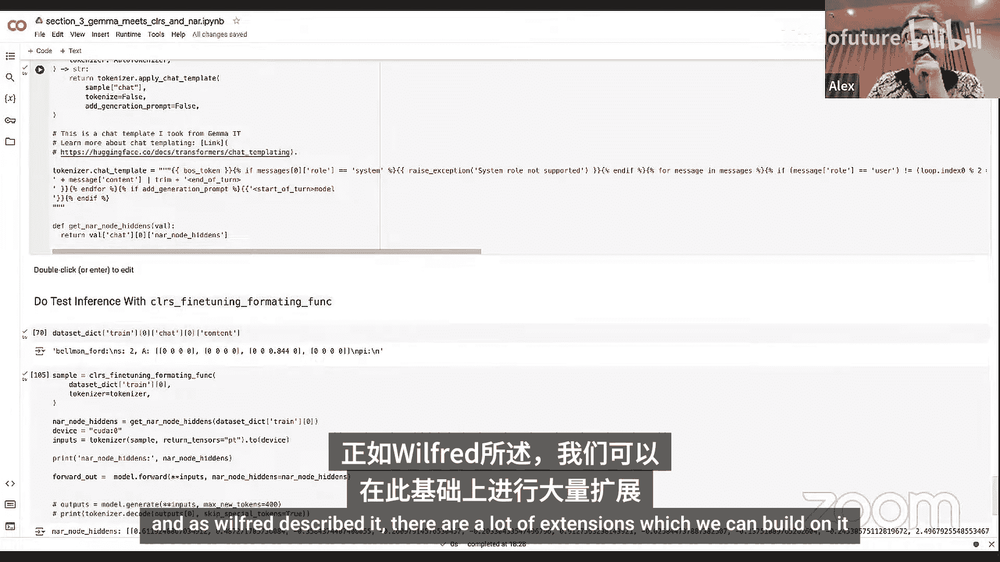

Allright， so that was the。Mic。So that was the last part of the last session of our tutorial we have finished with about 30 minutes to spare we been we've tried to be quite active in answering questions live in the Slack but if there are any other things you would like us to address while the whole team is in the virtual room so to speak please let us know we'd be very happy to talk more about this as you've seen throughout these two and a half hours we are generally very passionate about reasoning so this is a topic we love to talk about at length。

And we hope you enjoyed it， please do leave some feedback at the end。

That will really help us prepare future editions even better。Yeah。

 absolutely thank you very much and thank you also for being so in time why we leave some time for to the audience for typing some question。

 maybe I can go with like a very broad in general question。

 which will be which are in your opinion the next steps for now so where do you see it from here to the next year。

 the next steps， let's say。Okay that's a great question it feels like something that all of us should try to answer so maybe I will start and then we can go in the order in which we gave our answers so Olga Federicos Alex Wilford so in my opinion。

 well what I'm personally most excited about the future of like these NAR methods and their applications。

I feel like with LLMs， as we described in Federico's part and also through the Transnar that Alex and Wilfred talked to you about。

 we've sort of started to describe how a tiny GNN which in reality is much smaller than what a big language model might contain can carry a disproportionately huge amount of knowledge in a way that doesn't have a lot of bottlenecks and therefore can be more readily used by these models so already with very small GN style interventions you can make a big difference in the reasoning capability of the big models that are currently practically used on arbitrary data so I am generally quite excited about what we can do when we alleviate those bottlenecks for real especially around long context queries so Transnaar you should think of it as like the first prototype in hopefully a series of approaches that we try to address this problem we don't think of transnaar as the exact solution but we do think of it as something。

Will hopefully inspire future solutions and yeah I would say look out for more of the same I'm really curious to see what will happen in the future there that's that's my opinion at least Olga would you like to say a few words？

sorryrry。I will try。 hopefully right now we can hear me correctly。

 So I am not much a researcher myself， to be honest， I am a software engineer。

 and I don't know much about。Like I don't have deep knowledge in this topic to from my personal perspective。

 I'm just excited to observe what people in the area will continue to do what what they will achieve。

And at the same time， I wish that there will be good engineering practices that the code will be not painful to work with。

 that you actually can go to this code base at this mentioned in a paper and you will be able to launch it and it will work and there will be documentation there will be comments I just wish everyone to have good engineering kind of。

Day to day life。And I hope this will kind of become better， not worse in time。哎。

I'm jumping on from Alex's computer。I think there's。

There's a lot of need to understand what like to what extent。

The models we currently have are capable of performing robust computation。

Because to me it's not super clear like I feel like a lot of the work we've done is kind of showing that like at some point things break and how to fix that。

 I think to me is the most interesting next step and I think it's not obvious at all， but yeah。

 that's currently what I'm kind of interested like this kind of combination of better understanding the failure cases and like kind of pushing forward given our better understanding what you know。

 like essentially improving given our better understanding。到。Okay， I hope。Does sound work now？

I think I still I am still talking through Alex's laptop， right， no， okay， fine。Yes。

 speaking about my perspective， I totally agree with Federicica。

 it's very interesting to find blind spot or weak spot of the model and come up with some architectural trail solutions because right now we are very。

 very restricted in terms of this autoregressive paradigm。

Another thing which I find personally very interesting is different， maybe。

Mechanical alignment techniques， which allows you to understand better what's going on inside of the model。

 because right now， despite of having already a pretty solid set of literature about how transformers works it's still sometimes wonder in darkness because you don't really know what's going on inside you just feed something and hope that you receive some meaningful answer from the model and possibly hope that you'll capable to you know fix it on the fly I don't think that this approach might be reliable for systems where like you know quality interpretability or interpretability or which decisions are critical I don't think this is a like。

A sufficient level of reliability right now。Over to you， Alex， I guess。Yesす。Okay， and back。

I think we have ultimate and very interesting goal to kind of solve out of distribution reasoning and as Frederderica Varisa said。

 we definitely need much better understanding of limitations and like of architecture。

 so like we do know that small things。Preceivably like position of in or like techization of Star sometimes make significant difference。

 I don't believe that like such incremental solutions will as always way。 So I would envision like。

Really， envision like somehowi here architecture which。

Whats which would be very powerful in terms of reasoning but very powerful in terms of like pattern matching and I also would have to see this all this system would be tightly integrated and like maybe elegantly so like trans is great system but yeah it it maybe maybe it can be made simpler and at the same time more powerful so I do believe that there are still a lot of work and the lot of interest in the situation in this area。

Thank you。And Wilfred， do you want to add your opinion on this， any thoughts from Wilfred？

Are you mut。Yeah， sorry， I think I mostly share know Alex's perspective on this in that you know and all as well I think it also echoes what Federico is saying。

 you know we split it you a few pitfalls and fundamental reasons why there are these pitfalls and trans。

I'll budget them。And。But maybe there needs to be some more fundamental like architectural changes that needs to happen in order also you know。

 not like it would be good， it would be great if。Maybe models were cured in a more principled way。

so that we actually know， like， for example， if discovering pitfall's post ho is a bit。

It would have been great like to have like a theoretical like if you build old models from theory then you know we will have better understandings of what they can do earlier in process I guess and like more related to what we have been working on I'm very excited about efforts like you know what we did with the trans because I think it's its I think it's a more principal way of bringing robust reasoning abilities I mean I'm supposed to you know patching stuff by more quality data because it' know were really borrowing you know you know stronger capabilities like and from from you know for models that have been shown to be better aligned for reasoning and so for me that it's a very guarantee like provide more guaranteed than you know trying to you know build better data mixtures and so on so I really like to see this kind of ideas maybe like。

more investigated and also being applied more widely on you know than the series text dataset set。

 which I think is I mean obviously great starting point it would be great to like see how to deploy these ideas on dataset sets where you know the concept of an accompanying graph or like a problem defining graph is not so clear and obviously this is challenging because how do you do that but that could open you know as I was say。

 more principal ways of like。Yeah， more reasoning align our language models essentially and also just be cost effective in the long run because apparently the way our reasoning is pursue is。

 you know， it's not particularly cost effective。Yeah people are scaling our compute。

 not just the training time but also our inference time， maybe we could circumvent all that。

 maybe we don't need that with better models， maybe we wouldn't admit all those things yeah。

That's awesome， awesome。All right， great， so thank you all for giving those great answers。

 I'm actually particularly happy that Olga called out the engineering standards in the current code bases。

 which I think you can definitely tell the difference when you want to make something principled a codeb which is easy to work with versus one which isn't easy to work with and we're trying to play our part as much as possible and upholding those standards。

 CLRS itself is a really huge library machine learning benchmark speaking terms at least and we're trying our best to make it accessible。

 we always receive a lot of feedback that's very useful and I guess we would use this opportunity to say if anything we said today inspires you to try out CLRS or one of its variance and you have any hiccups even if you manage to do what it is you wanted to do to just please let us know like we're always on the lookout to make the benchmark more accessible and more easy to use for more and more people。

😊，Yeah， I think there's plenty of things to do right both from an engineering point of view from an algorithm point point of view and also from a task design point of view。

 so thank you very much for your opinions on this。Maybe one very quick final question like you don't need to do a round of answers。

 maybe like if you feel you can just answer by yourself or otherwise I'm very happy to your multiple point of views。

 but like regarding the use of or let's say wise architecture or regarding the proposal of new architectures that are better aligned let's say with reasoning or with the inductive bias that you aim at achieving for your task。

Where do you see like the prior human knowledge that we have about the task because like a very frequent trend in。

 for example， deep learning is just to let's say， rely as less as possible on the human knowledge and let the network learn by itself。

 where do you see where do you stand in this position so do you think that for now。

 we shall find better ways also to integrate human knowledge。

 human priors or human constraints or we just hope the networks to learn those from data？

Honestly I do think that this is the kind of question where more people want to answer I think it's a pretty interesting question。

 We actually discussed it a little bit in Slack as well So it's a great question thanks for asking Steve。

 I will give my personal point of view but know I think all six of us came into this field from different perspective so there is a chance that others will vehemently disagree with what I'm about to say so please feel free to shout if that's the case but I would say that first of all what you say is completely right so when you look at a lot of the things that we talked about in the tutorial today they can boil down to understand your problem and then apply or understanding of that problem to design a better architecture to design a better training data feturization to design a better you gradient descent regime or training data regime so yeah obviously sometimes there's really heavy math involved behind that particular step but for all intents and purposes you could summarize it as。

Understand your problem and then use that understanding to do better I think there are some really cool papers which we didn't mention today。

 but they were mentioned in the original anyar two years ago a blog which basically say that that's inevitable if you want out of distributionization so I'm referring to some previous works from Brunoary Bro's group with Baricche Be Vila and others talking about size generalization basically saying that in order to generalize you need a causal model of your test data right now in the extreme this is a causal model of your test data。

 but if you want to say generalization to arbitrary test data then this translates to some causal assumption about either the structure of the task or the structure of your model or more often than not both right so I would say it's inevitable now。

Obviously we are not just keen to solve the algorithmic challenge remember at the beginning I motivated all of this by saying we want the architectures to be a bit closer to algorithmic computations。

 but we don't want them to become algorithms， there are many reasons why algorithms are limited and we don't want the models to inherit those limitations。

 rather we want them to take the good parts of algorithms while not losing what makes them good in handling various kinds of generic noisy data。

So what I would say NAR is all about and where I stand in this area is we are basically treading this interesting line between models becoming more specialized for the task versus models becoming more general and we actually believe like our ethos is that there exists a sweet spot where the model is just specialized enough to be like maybe hugely more beneficial with the same number of training data points you have for your problem while still being general enough to be applicable maybe on general language problems or something like this which is where transar for example comes in So we believe that there is a sweet spot and that sweet spot is not discovered with just simple transformers in fact when you think about it。

 Transers or to incorporate some symmetries like there's explicit object boundaries attention is inspired by key query mechanisms in fact this kind of content-based attention was covered by neural tuuring machines which predate transformers by two years So you know computer science inspired priors have made their way in。

All architectures including the transformer itself and therefore like why would this be the global optimum right why can't we improve some things a little bit more while staying generic and one good example of this was our asynchronous algorithmic alignment paper with Andrew Rasvann and Tamara where as I've described it briefly in the tutorial we basically build an architecture that's asynchronous to invariant execution order sorry that's invariant to asynchronous execution order while still being synchronous itself so it still runs on a scalable GPU or TU but you have this very nice symmetry property that otherwise it wouldn't be it wouldn't be satisfied so I'd say that's for the most part what I would say the philosophy should be in the field but I would like to see if my co-presenters feel the same way maybe maybe I'll prompt Federicco to speak first。

Yeah。Yeah， I agree。 I think the sweet spot is is like a good。I mean。

 what came to mind is like maybe this strange analogy where it's like you know， if if I want。

 if I'm building cars and I want a car that can do like it can both like maybe move heavy objects and go kind of fast I build like a pickup truck。

 but if I just want to make a car that's very fast。

 I make like a formulaula one car and if I want to make a car that moves heavy objects I make like a tractor so like in the sense of like very specialized things。

I'm assuming we'll just work better for the things they' designed to do， but like。

I view these kind of things as as kind of orthogonal。

 like you can either go in the direction of like you want to make some hyper specialized system that's very good at。

Doing algorithmic reasoning or you can kind of try to go in the other direction。

 just make a very generally nice car。Um， and so yeah， I think the two views are kind of compliment。

 but it makes sense that like your pickup truck will never be as fast as a Formula One car。

 but your Formula One car will never be good off road。So。Yeah。

 it's probably just a game of trade offs， I guess， as you were saying。And。

Any thoughts from anybody else？From the team。应该咁还。对能。

YeahI think there may be Parreta front where you we still don't want to build X000。

Different model car models and like Z definitely like even like I don't remember like in enforcement planning in times。

 if you do take environments which are very far apart， it's hard to make system work boss but。

They what of similar environments they benefit in fact because you apply something from one to and as I in end you get better performance and they better if we understand the system the better we understand limitations I think this kind of sphere is becoming bigger and bigger so yeah it's probably impossible to build universal system but it definitely like con maybe certain optimals which can cover huge huge areas of expertise like so it still believes that like we can do better so transform is great model but for certain problems I think we still need to do better and I think even all this work with those usage like I don't know OOMs。

We calling like Is， so it definitely shows that we is a。

TheDemand and there are exist problems you want to solve。

And why there' are definitely a different ways of doing。

 but I think having great understanding of like neuro architectures and trying to find optimal one。

 I think is very interesting in very promising interaction in general。😊，Yeah， very interesting。

 very interesting。Somebody else want to give an opinion or yeah。

 does anyone else want to speak Larissa Wilfred any thoughts or are you just happy with how we've described the entire field？

有白意见。Okay， Aris is pretty heavy。Yeah， please。Okay， so。

I think that we can end it here and leave a 10 minutes break before the next session of orals so that also the audience can relax a bit relax and grab a cup of coffee or a snack。

 I will personally go for a snack now。I want to thank you very much again all the speakers for their very insightful and very interesting tutorial。

 I hope also that the audience enjoyed it and I will say see you in 10 minutes from now better nine minutes from now for the next session of As thank you all again。

Thank you so much， everyone。Hope you enjoyed it。对。Okay， I guess。

Let us hope this speaker joins at some point。😔，あもデア 나타로。H啊啦哈嘿。

I would not attempt to prounce this name when announcing the paper。Oh。啊。Nchoas k as as this。Oh。

 let me just make you co host， in any case。So my notion was that decomposing force fields as flows on graphs is the first paper that we're having now。

But maybe that's okay， maybe Im wrote sorry no no no。

 I thought there was great in scarcity stuff I mean the yes。

 it's gradient and scarcity So that is me well， this is great because Nicholas。

 I can actually pronounce。😊，Good。But you have a might to train talking0 one。嗯。To practice。嗯你可。😔，Okay。

Have you been enjoying further sessions of the。😔，Of this of this event。

 what's it called lock conference。Yeah， yeah yeah yeah yeah yeah I mean there was a post session on Wednesday yesterday I couldn't but today we had the Paris local meetup so I was oh nice yeah is Alexandra still organizing that one？

Yeah with with several of us， was also organizer。 It was in telecom， was very really。あ、こ goodこ。哈。😊。

That's yeah， I mean。Paris now has a whole bunch of people and or what means now always had a whole bunch of people in this area。

嗯。有。I wanted to add to make sure to send us some pictures from the meetup so that we can collect a very nice portfolio of meetup pictures。

 so oh yeah yeah， I know especially the took some maybe there's some radio over a Twitter I'm not sure but yeah'll pass I'll pass the message definitely if they' are not here。

呃。A decision。I think probably the local meetups are the nicest part of lock conference now both。

 I would say both。I like singing it's a nice combination of in person and seeing people from afar。嗯。

As well， yeah，Let's see what the in person version next year brings to the table。

That's for sure I definitely hope that local meetups will still happen。

 even though the main conference is imp person because I mean， not everybody is able to go。😊。

So kind of the I would be very much against polishing the local meetups because I think that's kind of the point of lock to Yeah。

 yeah yeah， accessible to everyone Okay， but then Steve。

 do you think we should get started with the oral or what's your take。😊。

Maybe we can try to wait one more minute I just made an announcement on slack let's see if we managed to catch some more people and then I think we can start What do you think you want me to start screen sharing to test stuff or Ed won hurt。

Okay。That。As show the whole screen is usually safe。😔，Yeah。

 is it good that way if I go for a screen like this。Yep， we can see the whole screen。

 Thats just at the top。 We have the， the black bar of the Lo meeting console， but I'm always the。

Then you can press hide here if you want， but it doesn't really matter。Vi it。II'm always。

Do you see the hide button now the menu that you just opened that yeah， okay， okay。

 it was in the menu。Hi video panel。Oh no ciing something else， Hannah。Whatever。

 I think if I just don't interact with it it's going to disappear。Yeah， and I mean。

 it's in the black area of your slides anyway， so who cares？嗯。有。ButOkay， so so five years later。

 we have to use whatever。😊，I mean， if you're a computer scientist and it's fine。

 then you don't need to know the stuff。Anyway， I think。Steve interrupt me if we should， oh。

 by the way， the like we literally none of your slides are obstructed by the bar no no no， but。

I prefer not to touch anything and。But then I would say let's get started if that's reasonable and with that。

 yeah， I mean， I don't really have much to say except for yeah we are starting the orals now Friend of the Sun and I hope we all excited about them and the first one by Nicholas Carvin who I'm sure we' we've heard that name a bunch of times if we're here in the the let's say learning on graph area and I'm sure he can tell you a lot more about his paper than just the title which I'm now saying the gradient scarcity with Plevel optimization for graphraph Learn but then just let's go Nicholas what's the deal yeah okay thanks a lot so thanks a lot to the organizer for this wonderful controls and especially so this was a paper on the Tla tracks which is new this year I think which I think is a really a wonderful idea。

So this work is mostly the work of my former student Hashham Gan， but he couldn't be here today。

 so I'm really presenting on his behalf， but this is his book。😊，So yeah。

 this work about gradient scarity with bi level optimization and graph learning。

 we'll see briefly what this means。😊，Okay， just change the time。Okay。

 so we all know what we're doing here here we're looking at transdive semiupervised learning。

 so very simple， one of the most basic tasks we all do when learning on graph， you have a graph。

 you have a bunch of nodes V and within these nodes you have a subset of labeled nodes that I call V training and they have the labels and you want to predict the other labels。

So before GNN， one of the most classical way of doing that was to do what is called laplashian regular in a sense that we were directly looking for the labels of the nonlabel nodes by optimizing over this vector here directly of the label。

 such that you compose your cost function with the cost function over the training labels。😊。

With some cost L here， so progression classification， whatever。

And you added some regular such that the predicted label were smooth of the graph。

 This was under some kind of homoophilic assumption of the graph and what is nice is usually especially when you do regression。

 this type of thing is very nice to solve。😊，It has a closed to expression and so on and so on that involves the laplation of the graph d minus a。

 the classical laplation， because this guy is just vector off labels computed against the dilalation of the graph。

Now we all know that the modern way of doing that is rather computing some parametric model， a GNN。

 so here I will consider a classical message passing GNN such that at each layer a node communicates only with its neighbor。

 but the message passing can be anything， it really doesn't matter for the rest of the talk here。

It's just a message passing JN so that's yeah the prediction here will be that you optimize the JN on the training labels and you get like the best possible weight for these JN and that's how you predict your whole vector of labels okay so note here that I have emphasized the dependency on this predicted label on the adjacency matrix of the graph a。

And you guess it's because we're going to do graph learning such that this A will actually change over time with some optimization for you。

Okay。So graphra learning is now a well established field in some sense。

 even though it's very active and that in many questions that and scrutiny。

 including the one that I'm presenting today， it comes from the observation that the graph that you observe usually the adjacent matrix is noisy in some sense。

 you can have missing links you can have spoilus links， stuff can be homoophilic。

 heteroophilic and so on and so on。😊，And so there are many methods to do graph learning。

 which graph learning here means I'm going to modify the underlying graph to do my prediction with laplaian or J。

So many way of doing that can be supervised and supervised with some you some prior that you're going to put on your graph。

 it can be differentiable or it can be purely discrete algorithm on the graph or such that it is better in some way。

And here in this talk as in the title I'm going to define it as a bilevel optimization problem I'm going to see in a minute just why okay so assuming supervised byle so it's supervised assuming that you have another set of label nodes V out so out here refers to the outer optimization problem so the the first one was the inner optimization problem is the out optimization problem so just another set of label nodes if you haven't one of them you divide it between training and validation as we do usually and you call the out your validation set so right。

😊，You're going to optimize。This time over the graph， so over the adjacency matrix。

A cost function that is a prediction of this sorry over these new training levels， right？

I think the key point is that this cost function it includes as a term already the predicted label with respect to these adjacentsymmetric that's why it's a bilevel optimization problem because this prediction usually involves itself an optimization so if you remember in the first slide I optimize the GNN to predict this way with respect to a and here optimizing over a and this as a term the optimal label that I'm considering with respect to a so here in this talk can be either the GNN or even the simple classical le regulation。

😊，Okay。😊，So of course you guessed that it's usually a bad ID to directly optimize over a as a full dance matrix。

 so what we're going to do is usually restrict this set of learnable graph it can be more or less complicated we'll see in the next slide。

And one way of seeing that is that of course complete graph are too closelyly， that's for sure。

 but also when you use complete graph， they are very。

 very prone to overfitting and you can even show very simply that if you optimize over the complete graph and you can learn any edges on anything well then it's going to discard a lot of edge where you don't have labels okay and this is a bit related to gradient scarcity and what we're going to see just after。

😊，You can also add some regular， it's usually a good idea again for the same mode。Again。

 for the same idea that you want to fight over a 15 if you learn all the edges on the graph。

So few remarks， this graph landing program was often formulated as a joint optimization problem over the labels and the graph so min mean right you minimize over the graph and and the labels in the same cost function。

 this is a marginal idea all the joint optimization can always be formulated very simply as the bilel optimization。

 just min min its a bilel optimization but all the bile optimization is not always the joint optimization。

 especially when the cost functions are different and the inner optimization problem is something a bit complicated non convex like a landing a JN for instance。

And when you do it in practice， if the inner optimization problem requires itself in practice。

 I mean in the code requires back propagation like learning in a GNN。

 then optimizing this outcus function will require to back propagate through the back propagation so what is called higher order by propagation。

 if you've never seen the term they are dedicating Pyto library to do higher order by propagation so by propagating through back propagation。

Okay。Okay， so just a few minutes on what I can choose for this problem。

So I'm not going to do the whole field here， but usually what we can choose for the set of matrix that you want to learn again said to you that the complete graph is not a good idea。

 you may want to learn just the weights of existing edge so you observe some edge and you optimize over the weights of the existing edge so it has a few names usually it's called edge refinement or edge learning on this type of。

It's also it may be a good idea to add some new edge in case the edge that you observe there are some missing links。

 so a compromise between existing the observed graph and and the complete graph is to learn edges up to KH or r hub here of the observed of the observed adjacent symmetry matrix sorry maybe be6 that's why so you learn the weight of the existing edge。

 but you also learn weights， new weights between nodes that are two hubs or three hub from each other there it can be a good idea to add a few shortcuts in the graph。

😊，It's also a good idea to add regular， there are many choices for this。

And usually you guessed it the modern way of learning a graph is to do itself a parametermetric model and optimize over the parameter of this parametermetric model。

 so it's usually it's some type of graph to graph GNN。

 it computes some kind of nodedown bedding for instance and then pretty edges with an MLP that takes the node bidding as an inputut。

It's usually the modern way of doing rough law。But to do some theoretical analysis。

 especially gradient scarcity and I'm going to explain what is gradient scarcity consider edge refinement so we just want to learn the edge weight of the existing graph right so if you take as a prediction model a geneN with scala here ourll start with JN here because location regulation is actually more complicated for what I want to say。

😊，If you take as a model genuine with scale layer， then you can see that it has a financial receptive field of size scale since it's a message by JN。

And as such the edges that are more than kHub from the training nodes do not play any this is something very known that they don't appear in the cost function so see that it's very known when you optimize when you want to predict labels you know that some edges were not going to be taken into account just at inference but not for training but when you optimize over the graph this is a problem because when you optimize over the graphs these edges are trained somehow you compute the gradients and the trained and gradient caity refers to the fact that from this very simple fact if you consider the edges that are more than KHub away from the training nodes KHub in terms of shorterest paths right？

Then the gradients of this outer cost function that is supposed to land the graph will be exactly zero with respect to these edges。

 so they will receive no gradients ever， and this is a problem this is quite is called gradient scarcity。

😊，So it was known for joint optimization， so in this paper we we prove it for bilel optimization。

 the proof is essentially the same it's a bit more complicated because you have some stuff that are where zero before they under zero。

 but everything concerns out and you still have gradient scarcity without surprise as expected for bilevel optimization okay。

So you have many ways of counteracting gradient scarcity you're not going to go about them here but I'm just going to talk a bit about laplation regular so if you don't know it。

 but if you know it I Im telling that to you now laplation regulation unlike JNN has an infinite receptive field so the whole graph usually comes into account when you compute the laplationian regular here when you predict the labels so do we have gradient scaraccity in this case it wasn't really clear because like JN it's not a strong K size scale receptive field。

Well， yes in some sense， guess in some sense， because you can compute some eigvalue of some matrix I'm passing the detail here。

 but what you're going to get is that the gradients of the edges that are far from the training nodes decrease exponentially with the distance to the training nodes。

Okay， so it's not exactly zero as before like we let you had for genN。

 but the decrease exponentially and it's go through is it can go very pretty far okay how might it can tie it okay。

😊，So what's interesting is that the eigenvalue of this matrix that determines the rate of decrease is a bit linked to the distribution of the training nodes and its relationship with the frequency of the laplation so I'm not giving you details here。

 but basically you can say that if the training nodes are very low frequency very grouped together。

 then the decrease is going to be slower， but then you're going to have like big distances in your graph from the training set because it's grouped。

 it's isolated from the rest。😊，And it's if it's more aligned with the high frequency of the lact。

 then the decrease is going to be very fast。 But that since it's well。

 the distance to the training set is usually， of course， you can find counter example。

 but it's usually much much less。 So you have this kind of trade off that is。😊。

Raise a lot of open questions that we don't have on to yet。

 but it's interesting because it' something we don't really talk。

 we don't really talk about like the， the distribution of the training nodes within some graph and。😊。

Within within the graph。Okay so from all the ways that I showed you before there are some ways to mitigate gradient scarcity of course I was only talking about edge refinements over the existing graph we're not going to go over all the details and I'm not proposing any new method to mitigate gradient scarcity they are more than enough already one interesting thing that we observe is that whatever type of the method that you choose to mitigate gradient scarcity organization or learning a graph to graph GN I mean everything else apart from edge refinement it's graph learning over small graph like co etcM I mean medium size graph it's a lot subject to overfi you can see here in the table of result we managed to do better testing than simple prediction of the observed graph but you still have a gap between the training test at least in no experiment graph learning if you're not careful it's。

It leads a lot to overfitting because you learn the edge between the training nodes and everything everyone is happy and they don't care about the testing also。

Yeah， the more， more parameterss that you have， of course， more of h， if you're not a bit careful。😊。

Okay， so I'm going to stop here to conclude it this was a simple work。

 but it raises some interesting question about graph learning。

 v scarcity and the distribution of the training sets within the graph and its relationship with the graph approachology。

 which is topic that I find is not often discussed。

 but has some interesting theoretical consequences。😊。

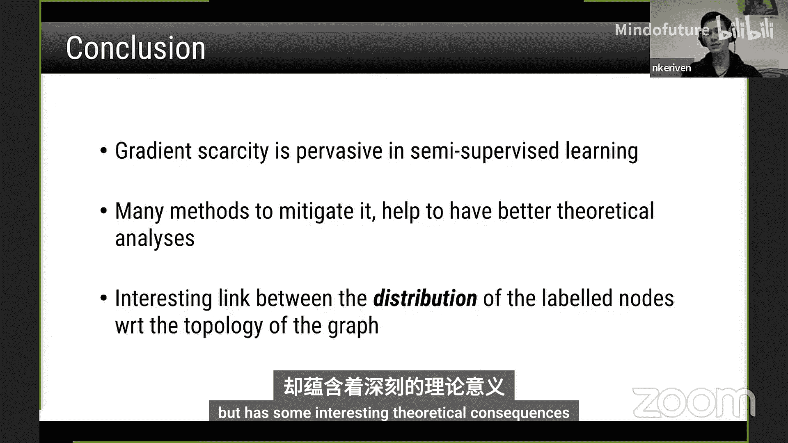

And I'm just adding my talk by saying that recently got。

IGrant to welcome on vertical graph machine learning so if you know any students we be happy to come to head to diversity of hand eating crs and stuff don't hesitate to send me a message thank you。

I was music。 But yeah， that's great。 I think。😊，Eating crs that's something to do as it happens I'm making for crs for the Thanksgiving weekend tomorrow I support that but then so the next speaker I think we would welcome having him here or them here so if you're around just shoot me a message in the chat because I cannot find you yeah because next we would like to talk about towards the GN framework for combbininatory optimization problems I see Frederick Ven there we go there we go。

Make code host so friick I made your code now which means that you can start screen sharing and doing deeds like that hello hello and with that Nicholas thanks for a nice talk and thank you I'm sure someone might reach out about those grants and working with you Oh and about the crs of course that's important as well but with that thanks Nicholas and。

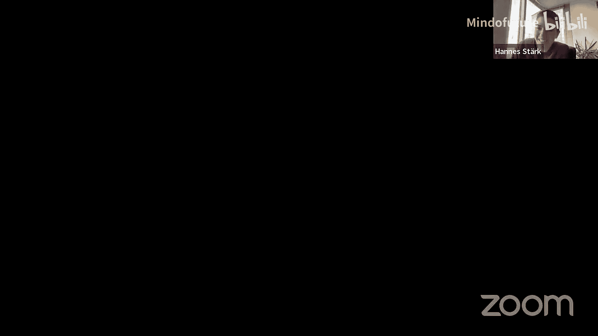

Let's move on to the next one with Phil。And yeah， are you all set to quickly want to say something so we can see where we can hear no yeah。

 can you hear us yeah that works very well but right yeah I will be presenting together you together with my first author Sammy。

And yes， so I hope the everything is fine and then in that case we will start like I think our talk was scheduled in 10 minutes。

 but we can all already start I guess yeah I mean by us。Absolutely let's go right Okay。

 so today we're going to present our latest work towards the general recipe for combinator optimization with multi filtered GNNs Fred and I are going to present this together but we would like to take the opportunity thank our coauors here。

 Stean Horoi， Michael Perarlmutter and Guy Wolf of course。Okay， so let's get started。

Many of us in the audience will be to a different extent be familiar with combinatorial optimization。

 but for the sake of completeness let's do a very quick overview here so in combinatorial optimization we're trying to find an optimal subset of objects from a finite set and in this context we're going to think about combinator optimization over graphs。

 which is like a very common case where the subsets are graph node they could be edges of the graph or paths over the graph。

 but basically some subset of graph of the graph object。

And there are many instantiations of combinator optimization on graphs like the most popular ones among many others being max clak。

 maximum cut minimum dominating set and perhaps the even more wellknown traveling salesman problem and then there are also other various like vehicle routing graph coloring。

 etc cetera， so like we're talking about a very large family of problems here。

The thing is most of these commator optimization problems are NP hard or MP complete。

 so especially when you scale your graphs to about let's say tens of thousands or hundreds of thousands of nodes generating exact solutions with conventional tools like MIP programming like let's say using the GroB solver these types of things can be prohibitively expensive so that's where deep learning comes in because with deep learning the idea is that let's generate app solutions more efficiently。

 let's just do a forward pass let's say across neural network and just get certain predictions。

And supervised or unsupervised as in self supervised methods。

 as well as reinforcement learning approaches are all viable。 Many of them are。

 we have been tried and have been successful to a different extents。

And since we're talking about comm optimization on graphs here。

 obviously GNNs emerge as like a natural candidate。

 but conventional GNNs typically assume that like your information is very local and like the treats essentially graph smoothing as an inductive bias what we know from a fact is that this is not an assumption that always works well for combinatorial optimization where you also need high frequency information depending on the task at hand。

 we're going to explore this in more depth and real soup。

So let's look at a few problems that we mentioned in the previous slide。

So in the maximum cut problem you have your vertex set and then you want to partition this vertex set into two subsets such that you maximize the edges that connect nodes from different sets。

 that's the idea so you want to get a cut with as many edges as possible。

In the maximum clique problem， you want to find the largest node subset that is fully connected。

 which is by definition a cl， So you want to find the maximum cl。

 essentially and in the minimum dominating set， you want to find the smallest subset of nodes such that every node in the whole graph is either within this subset or is neighboring this subset。

 So in the sense of like you can think of it as from a GNN perspective。

 if you just diffuse do a one step diffusion over the graph or the MDS you can reach every node in the graph。

 that's the main idea in MDS。Okay， so I'm going to pass the to to Fred who's going to take us through the methodology we employ here。

😡，Thanks， Sammy。So yeah， talking about the methodology。

 we have here an input graph to our pipeline which is then equipped with intrinsic node features。

Those encode the structure of the surrounding area about a node can be， for example， the node degree。

 the clustering coefficient or the eccentricity。This information goes from an MLP decoder。

 which then feeds into our multifil to GNN。The output of this GNN is on the node level and we feed it for an MLP decoder together with a sigoid。

So the output of the learned part of our pipeline is a vector。

 which we can see as a probability vector。That gives us for every node and probability to be part of the solution。

Looking here into the case of the maximum cut problem。

 we then have an answererous loss function that we use for training。

And what we can think here of the probabilities is that yeah we want to buy partition our node subset here so that we cut as many edges as possible。

 but as we move between the different classes and the probability for every node will tell us if it's smaller than 0。

5， then we want to have it in the first part of the petition， if it's bigger than 0。5。

 we will move it to the second part of the petition。

How can we train with that so the first step is that we apply the transform 2 p minus1 to our output vector that means that we move our values from the interval01 to the interval plus minus1。

And what this pdratic form then does is that we will sum over all the edges and we will get a negative contribution to our loss if the two nodes that are connected through the edge have a different sign or in different parts of the partition and we will have a positive contribution to our loss if they have the same sign。

This is the learned part of the pipeline here， and once we have learned these probabilities。

 we can pass them through a rule based decoder where we can simply separate the notes of our graph according to the sign of T2p minus1。

Similarly， we also have an unsupervised loss function to train this model for the maximum click problem。

And here our loss function acts as a surrogate to the true objective of the maximum clique problem。

 so you can see this here on the bottom here， the true objective function can be seen as like assuming that we know all the cliques in our graph。

 we could just for each of the cliques， see how many edges the clique contains and then pick the one with the most。

this translates to our surrogate loss function that the first loss term encourages the model to push probabilities to nodes that are within the click。

 while the second last term encourages that nodes with high probability are highly connected and together these two this loss function then approximately makes the true objective of the maximum cut problem。

To decode a solution from this， we will order then the nodes of our graph according to decreasing probability。

 we will iniate our solution as the highest probability node and then subsequently add notes to that set according to decreasing probability and every time check if we are still within a click。

Lastly， for the minimum dominating set problem here。

 we want to find a minimum set so that every node of the graph set most one step away from that cell。

 so again we have a two term loss function where the first part the L1 norm of the probability vector enforces sparsity so that makes us encourage this a model to have the least nodes possible in the solution set。

While at the second last term， make sure that next to every node of our graph。

 we have at least one node with high probability next to it。

And the decoder will function very similarly as for maximum click that we again order our nodes according to Greece decreasing probability and then step by step construct a solution by going through the nodes by decreasing probability。

So what's interesting about this is that all these problems are NP hard。

 so it's prohibitively difficult to get enough ground truth solutions for supervised training。

But the nice thing is that our unsupervised loss functions allow us to train these models without access to even a single ground truth solution。

The second nice thing is that our rulebased decoders are constraint preserving。

 that means that even though we cannot guarantee that the solution of our model will be the optimal solution。

 we can always be certain that it will satisfy the constraints for instance。

 the solution our approximation for the maximum cut we can make sure that is a maximum it is a cl。

 although we can't guarantee that it's the maximum cl and similarly for the minimum dominating set。

 the solution we propose will be a dominating set， although it may not be minimal。With that。

 I will move on to our modeling approach。Wwhichhich is through a multi filter GNM where you can see here for each layer of this model。

 our input node features will go through different pathways where each of them can be seen as a separate GNN layer。

So the ones we see here are traditional averaging operations which have different scales of the support matrix。

 this is the matrix we use for message passing and for instance， if we take S to the path of one。

 this is the most traditional aggregation mechanism which we know from， for example。

 GCN and GAN and many others and will just aggregate information around every node from a one step neighborhood。

But we also have like higher orders of the support matrix where we then for x S square we will aggregate from the two step neighborhood and so on。

 so even though those are very traditional methods like each of those channels will give us access to a different receptive field around each node。

Then we complement those filters with what we call comparison operations。

 and those are filters where we replace the support matrix by sing diffusion wavelets。

And those are those encodes fundamentally different operations compared to what we know from traditional GenN because here we have differences of different scales of the sub matrix for instance the Psi 1 diffusion wavelelet what we will do here we will first aggregate or around every node from the one step neighborhood what we see here on the left and for S square we will aggregate from the two step neighborhood and then take the difference of that so this diffusion wavelelet at every node we compare two neighborhoods of different size。

And this carries on to higher order waveleletths here， for example， size two。

 where the scales of the sport matrix are usually powers of two， so here we will first。

 we will compare a neighborhood of size two around every node to a neighborhood of size4。

The magic of this model is now that how we combine at the node level。

 the information from these different filters， where we have two different attention mechanisms where at every node。

 the model can decide to which of the filter responses it wants to attend and this is very different compared to what we know。

 for example， as graph attention networks where we attend to our neighbors at every node。

 here is really that our node can attend to different filter responses。For instance。

 you can see here at this node that yeah it can choose which information is most important at this node。

 and this can be different for each of the nodes of the graph。

So what this model is capable of doing is to learn very complex local functions that depend on the local node neighborhood。

 which is very very helpful for the problems we are dealing with here。Additionally。

 it's very important to have this decoupled attention mechanism that you see here that we have an attention mechanism for the averaging operations versus the comparison operations。

 and we show theoretically our paper， how this is an upgrade compared to former architectures。

 which had just a single attention mechanism that throws together all the filter responses at the same time。

And we show that in such cases， the filter responses of the averaging operations will always outweigh those of the comparison operations and limit the expresslusivity of the model。

And with that， we move forward to the perfect results with Simon。

So before we actually look at the results what are our baseline what are we what are the tasks and models we're comparing against so again we are testing on max Cu max click in dominating set and we ran experiments for a set of small and large graphs this is going to be relevant in a second where like the small graphs are about 200 to 300 nodes and the larger ones are I believe 800 to 1000 nodes each。

And so first we have non deep learning pipelines like Grobi， a general purpose optimizer。

 and then greedy algorithms and then meanfield andnealing algorithms essentially and then from there on the real like more comparable baselines we have arearddo GNN which is a seminal GNN from a few years ago by Carius and Lucas。

 which is basically a slightly altered gin that is suitable for combinatorial optimization and like gets good results across several task as well。

There's the anal model， which is essentially the adverse GenN with some max entropy anneing regularization that helps the optimization process in certain cases。

There's the scattering C， which is a prior work that also leverages these diffusion wavelet based band pass filters。

 but with a different mechanism。And finally， we have the Gflow network based GFN that is like a paper from last year。

 I believe， which will prove to be quite successful across these tasks as well。

 while like the caveat being that it's much more computationally expensive to train and run inferluenza。

So we see that in our results， Gcon is the best self supervised learning method on both MaxDt and MDS overall for launch grass。

 but also on the smaller ones。Whereas in MaxL we're pretty much on par with GFN or GFN like prove to be slightly better。

 but overall we're either like the best method or the second best essentially so which kind of is in line with our aim that we want to arrive at a model that is consistently good across large variety of commuter optimization task。

 which may require different inductive biases than just you know lowpa filtering graph signal processing perspective and what's more is like Gcon while being so successful has similar scalability properties to other MPNNs like address GNN which makes it much faster to both train and test compared to methods like the Gflow netbased solver and like it's much。

 much more faster than say the Grobe solver and the bottleneck here is not。

The inference pass of the GNN but rather the decoder and when your decoder is very fast。

 which our implementation is for the max cut， we not only beat like a time budgeted Grobi but we also gain like a 130 time speed up on Max cut compared to Grobi so I think to run this on these large graphs。

 500 of them it took us about like half a minute where for Grobi it's more than an hour like just to put it in context。

And we see that like these decoupling of low and high pass filter is very essential for Max cut and MDS。

 whereas MaxClick tasks seem to rely more on low pass information essentially。But overall。

 we have arrived at a network that can pick and choose the types of information it may want to focus on at a node by node basis。

 as well as depending on the task， so we arrive at something that's very flexible。

Finally we run some generalization experiments and we see that Gcon is actually quite adept at generalizing across graph size so in the table you see we to run two types of generalization experiments like I mentioned we have small and large data sets for each test so we're testing okay like what if what happens if we train on the small data set and try to extrapolate to the large ones and basically the percentage differences are here you see are what's the difference what's the percentage drop you see when you train on say a small and test on the large compared to just training and testing on the large graphs and overall we have less than 6% performance drop which when you put it into perspective like the overall how much better Gcon was doing for example compared to standard message passing neural network based methods。

Um， we see that GCon can outperform in distribution GNN methods like A GNN。

 even when trained on like u graphs on different sizes than it's tested on。

We also see that like the Gflownet is also quite successful in generalization， whereas like address。

 Anil， these types of like conventional GNN based methods struggle quite a bit。

 even though like the variance per task changes a lot。So okay。

 what are the main takeaways we have here？Perhaps the most important thing to notice is that like conventional GNNs like the biases associated with conventional GNNs is not really compatible fully with several CO tasks where high through information is also relevant so we need something that can leverage both types and here we introduce Gcom which leverages again these both types of information。

 making a powerful architecture for a very large array of CO problems。As we showed。

 like GCon can outperform both other GNNs as well as Gflownets and even challenges Gbi while retaining like scalability and like the sparsity of a standard GNN method。

And finally， we discuss this in more context and like in the paper。

 but we see that Gcon is like the overall framework we presented is extendable to many optimization problems that we don't cover in this paper。

 including ones that are based on edges or paths like say traveling salesman problem the only thing you need to do is to introduce a modular loss and decoder that's appropriate for your task and you can keep the model backbone separate and get close to optimal performance with the Gcon framework。

So that concludes our presentation， but we're more than happy to take any questions and you know discuss this in further。

Awesome， thank you very much。It seems we do not have any questions in the chat。

 but we have the QR codes and yeah I'm sure people might be happy to check out the paper further and take away some some more details and with that would you have any last words that you want to say about the paper or should we call the day and move on to next？

I think we're good I think we covered everything and yeah always feel free to reach out to us we have some ideas about future work as well so this is probably not the last you hear of this work but yeah thanks a lot thank you。

Great， thank you very much， Vi， thank you。😊，Sorry， I' forgot the name Shin。

Do you want to say his name， the name of your call Frederick and Sammy and we are Sammy Thank you very much。

 Thank you， Frederick， and you're welcome that's let's get to the next aura and I think that is by you。

😊，But if not， then whoever else is next， please write me a message so I can make a cool host and you can start screen sharing。

But we are also a little bit in front of the schedule， so it might be happening that yeah。

 it might be happening that。Our third presenters still taking a little while I'm presenting closing remarks It's not my turn I thought we had a third Okay visiting graphholy sorry。

 neuro incomplete factorization as a third or。Houseer we have any Oh yeah。

 there's a Po house now here。嗯。I couldn't send you a message for some reason， but no。

 seemsre we're good to go。 Yep， sorry about that I might have should have called your name sooner。

 but then let's just get straight into it so we get as much time as possible for your presentation。

So sorry。All right， thank you very much Hannes it's very nice to be here so my name is Paul I'm a PhD student at Osa University in Sweden and I have the pleasure to talk today about our recent team and our paper about using graph neural networks in order to learn preconditioners for the Conjugate gradient method。

that's a topic I've been working on together with my supervisors。

 Uan Uum from KDH in Stockholm and Ys Clluland from Sal for the last roughly two years。

But let's take a step back and first talk about sort of learning to optimize。

 so using machine learning models in order to accelerate the solution methods for numerical optimization problems。

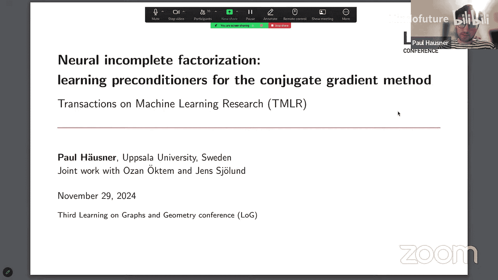

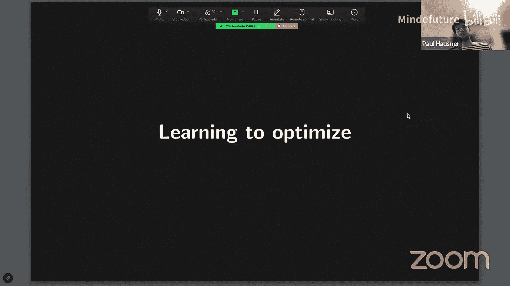

And so the idea is that we often have to solve similar problems over and over again。

And we can then use sort of the similarity between different optimization problems in order to train a machine learning model。

And then later， we can amortize the cost of this training of the model and creating of the model by solving many related problems in the future。

And so this paradigm is also known as learning to learn or meta learning when the underlying optimization problem we're considering is actually neural network optimization itself。

 that's a quite a famous paradigm or also a more general framework is related to autoML。

Where we interested in learning sort of learning to optimize general machine learning algorithms。

So let's make those a little bit more concrete， so usually we start with a parameterized optimization problem。

 so we want to minimize some function F。With some optimization variables X。

 and we have sort of some distribution over parameters y。

 So that is just the context of our optimization problem。

 So then we assume some unknown probability distribution。All by these parameters。

And they're goal then to learn a machine learning model， G。

 which takes the parameters and of our optimization problems and some learnable parameters for optimization and produce sort of either directed the solution to optimization problem or sort of augment the classical optimization algorithms。

And we can then use different kinds of loss functions in order to train this model。

 so either we can go towards end to end learning or we can use theory in order to inspire our loss functions in order to get a better performance。

The ultimate goal is then to solve some optimization problems fast for new parameters that we might obtain in an online fashion。

So we are at the Learning Graphs conference here， right so it's natural that we might assume that our learning Talk toise model will be parameterized with a graph in neural network。

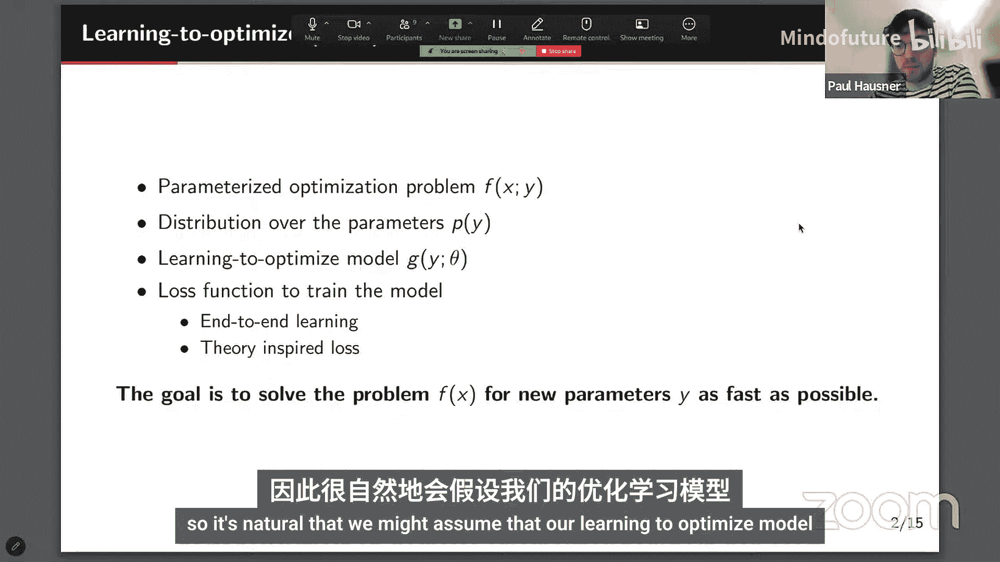

And here we especially want to highlight sort of the connection between graph neural networks and classical numerical linear algebra methods。

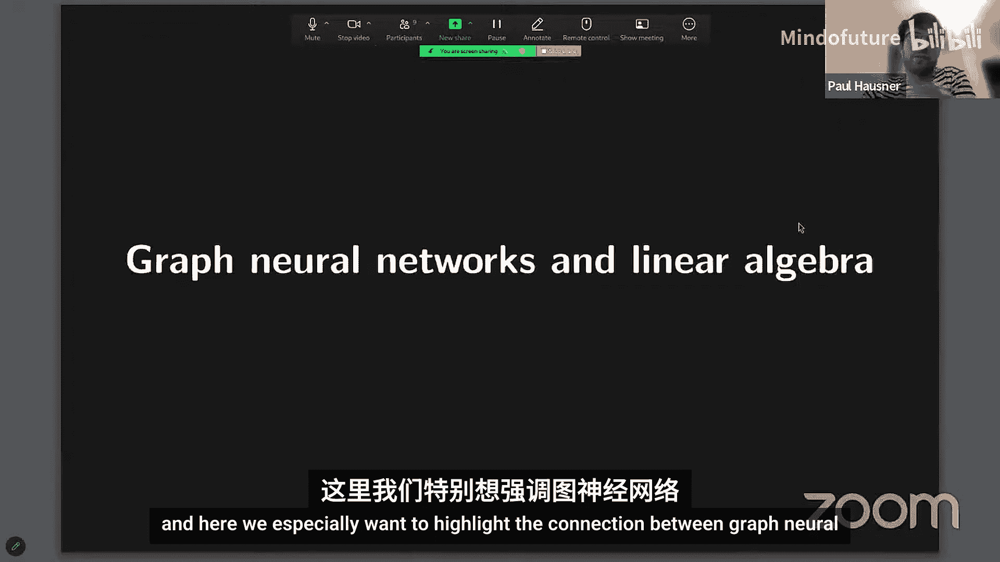

So I guess everybody here is familiar with the classic graph neural networks that operate or this process data that lists on a graph。

 but just to recap real quick， the classic message passing framework。

Sor of consists of three consecutive steps， so in the first step we sort of compute an et em bedding for every directed edge in our graph based on our old edge features and the adjacent nodes。

Then in the next step， we aggregate the adjacent edges for each node using some permutation invari and function。

 and the final step we update the nodedding node embeddings and both these updates of both edge embeddings and node embeddings are usually implemented using some small fully connected neural networks。

And since these neural networks only operate on so if the building blocks of our graph。

 a graph in your network can operate on any size of graph。

 as we' all seen in the previous presentations。So how does linear algebra come in。

 well every matrix a actually corresponds exactly to adjacency matrix that we can interpret as a graph。

 moreover， many， both numerical algorithms， but also numerical linear algorithms can be described as a graph problem。

And we use this insight in order to construct our GN architecture later on。

And so the optimization problem we're looking at as the title already says。

 is the conequ gradient method， so the con gradient method aims to solve just the near equation systems。

A exit could be， so and we can also see this as minimizing unconstrained quadra objective。

Where both A and B are sort of the parameters of our optimization problem。

And X is the optimization variable we want to solve for。

 And so the connegate gradient method is a is a quite famous iterative method to solve these equation systems we obtain。

Where we assume that our matrix a is square and symmetric and also positive definite。

 so that means our quadratic objective itself is strongly convex。

And the method is especially effective when we have a large scale and very sparse problems。

So one very common setting， where this occurs is an riskization of finite element methods for partial differential equations。

The conversion speed of this method library typically depends on the condition number of our matrix A and also the distribution of the eigenvalueius of the matrix。

So a classical heuristic that's very important for dis solvers。Is finding good preconditioners。

 so the idea is that we want to find a matrix M which usually also has to be a symmetric and positive definite and for research constraints also sparse。

That improves the spectral properties of our system。

 so instead of solving our original system A x equal B。

 we might solve a different system where we multiply， for example by the left with our matrix n。

And so here we sort of have to make a tradeoff between the time spent to compute the preconditioner versus the acceleration we obtain and the con gradient method。

 so if we use for example， just the identity matrix of preconditioner。

 we obviously don't obtain any speed up since we just recovered the original problem。

On the other hand of the spectrum， if we use the inverse matrix itself as a preconditioner。

 we recover a direct method， so we don't need any additional iterative steps anymore。

 So usually preconditioners are somewhere in between these two extremes。So the Chioi method。

 for example， approximates8 using a diagonal matrix， which we then know how to invert。

And another class of quite popular algebraic preconditioning techniques are the incomplete factorization preconditioners。

 so there we start computing a factorization of our matrix a， but do not fill out all。

The elements of that matrix。

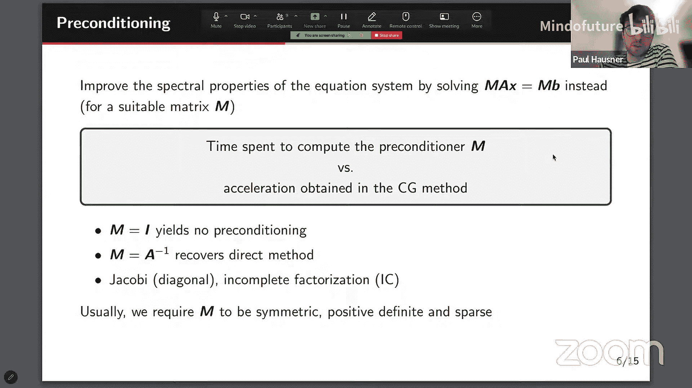

And our method is highly inspired by that by including a new component into this incomplete factorization。

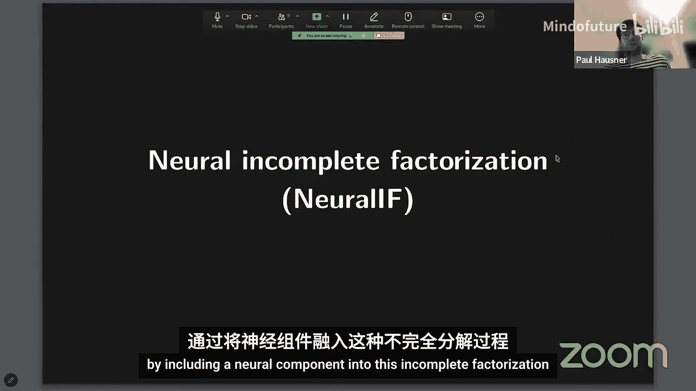

So the idea is to parameterize to learn to optimize model that takes a matrix A and produces a suitable preconditioner。

And as I said on my previous slide， we both need symmetric and positive definiteness as well as vrsity constraints for our preconditioning metrics。

 for our output of our neural network。So the pararsity constraints I'm going to talk later about。

 let's first focus on how we make sure that our preconditioner itself is symmetric and positive definite。

So instead of directly mapping。To a matrix M。We instead actually map to a lower triangular factor。

 La。And for lower triangular factor， we know exactly how we can make it at least positive definite。

 and that is exactly by enforcing positiveness on the diagonal elements。

And that we can achieve by just using a suitable activation function in our neural network。

In order to get them reob our preconditioner， we can just multiply the lower triangular matrix。

Together with its transpose， similar to the incompet Tulesky factorization itself。So。As I said。

 there's a very strong connection between graph neural networks and matrices。

 but the problem here is that we cannot actually use the matrix A directly for the message passing So why is that so if we just use a directly for the message passing the outputs that we get from a network in the terms of edge embeddings are typically nonsymmetric anymore even though we take into we take in a matrix A which is symmetric and that is just due to the fact that the edge updates usually take into account both the。

The notes that the edge is connecting in a diered fashion。The other problem。

 which is way more severe， is actually。That we use a lower triangular part only of the output。

 and that breaks the computationation equivaris we obtain usually from the neural network。So in the。

Nowive framework we would first use message passing and then use lower triangular matrix of our message passing output。

 we instead suggest to first transform our matrix to a lower triangular matrix and use the graph of this lower triangular matrix for our message passing。

The problem then becomes that by only using the lower triangangle matrix。

 we basically only let information flow in one direction。

 and that is from low order nodes to higher order nodes where we in the beginning。

 fixed the node ordering。In order to circumvent that。

 we first do a step with the lower triangular part of our matrix using message passing。

 and then the second step we use the upper triangular part of our message passing using the same action bearings for the second step。

So now we can obtain a。Valt factorization of our matrix， which is positive definite。

 but now we have to achieve that we can also train this factorization in order to resemble a neural incate factorization。

And so how we phrase this is that we want to minimize the distance between our original matrix A and the learned factorization that we obtain from the neural network。

Which then we make subject to sparsity constraints。So since we only input edges in the beginning。

 these are exactly the non zero elements we obtain in the end in our output matrix。

And we can encode here also different types of verrsity constraints。

 so the ones I've shown here in the upper objective is exactly the ones that doesn't allow any fill ins。

 so exactly the elements that are nonze in our original matrix A will also be nonzero in the learn preconditioner。

We can also allow additional fiins using some classical heuristics from numerical linear algebra。

 for example， we can use the sparsity pair corresponding to a square or using high a polynoms。

It is also possible to then learn actually sparse outputs by adding a long penalty term to the objective function itself。

So we start with a bigger sparsity pattern add level one penalty to our objective in order to get a sparse output again from a graph neural network。

But here we， of course have to make a trade off between the time we need to run for the forward path of our Graph neural network and how good the approximation is we get out in the end。

UmSo in order to actually allow efficient training。

 we need to do some additional computational tricks。

One key problem here is actually that the Frbinus norm scales computationally quite poorly since it requires matrix matrix multiplication。

And so for very large scale matrices， this is extremely costly on one hand and on the other hand。

 we need to compute the gradients with respect to these， which then just blows up our memory。

So instead， instead of minimizing the Frenus norm， we propose to instead minimize an unbiased approximation using the htchin and trace estimator。

 so you can just sample a vector with ID Gaussian elements and multiply that with both of our matrices in order to get an approximation of the Frenius norm that only relies on。

Matriric vector multiplications that we can compute very efficiently。

So this allows us to have very efficient training and then if we look at the difference here on the right hand side and the figure between using our stochastic approximation as a training objective or a forbeus norm as a training objective。

 we see that in terms of performance on the validation mode where we always compute the full forbeius norm。

 it is very marginal。During inference， we can also show you that our model is very。

 very efficient and only requires linear time complexity in the number of nonzero elements in our matrix。

So let's look at some results。So we evaluate our methods on two different synthetic data sets。

 so these are basically the generating distributions over our different problem classes。

 so one is using random matrices of size 10，000 by 10。

000 with approximately 1% non zero elements in each matrix。

And the other problem is motivated by an example I already talked about earlier it a P saw a partial differential equation discized on different two dimensional domains using the finite element method。

 and there we have our method on problems from the size 20，000 until 500，000。But here。

 one key goal is also to show the size generalization of our model。

 so wed only train with problems up to size 150，000 by 150，000。In general， it's however not。

Easy to generate suitable dataset sets for those problems。

And so we have to sort of trade off the difference between the problems within a data set and the generalization abilities of this model。

 and so future work is needed in this area in order to address these issues。

 so these are really most synthetic data sets we are evaluating on here。

So for the synthetic data set， we can see that our learned approach with additional sparsity is around 40% faster than incomplete Schlesky。

 the fastest other baseline we're testing against。So if you're interested in solving many。

 many random matrices， then our methodist is quite good。

So for the partial differential equation data， we can see on the left hand side we can see how long it takes to actually compute the preconditioner。

 so that is just the pass through our model and here we can very nicely see the linear scaling of a model that we also showed theoretically。

And compared to incomplete Schleski， we're significantly faster in computing。

 so our linear complexity grows with a better rate compared to the baseline method。

On the right hand side， we see the solving time of the actual optimization problem。

 and there we see that both methods technical basically scale the same。

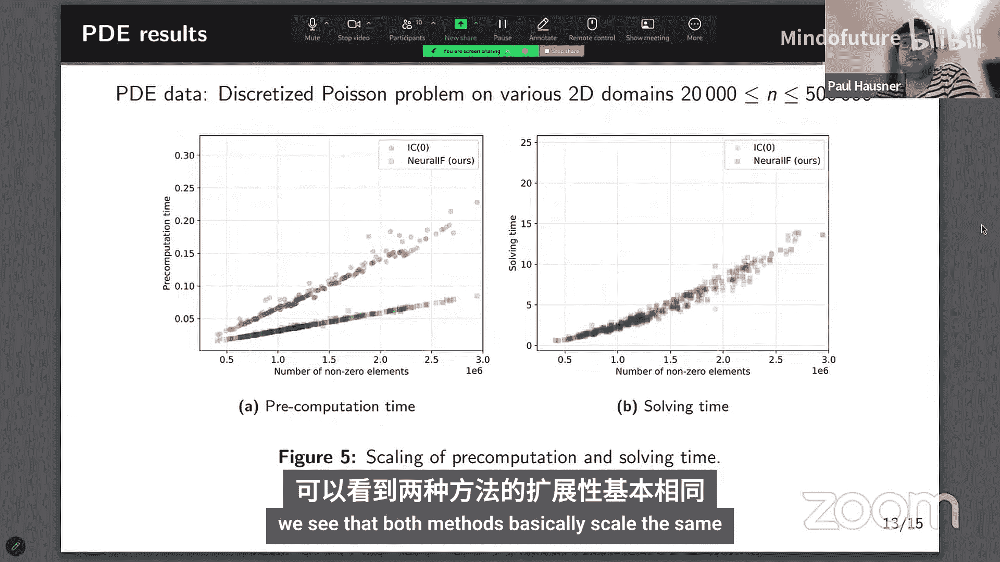

Yeah， then let me give some outlook and future work。

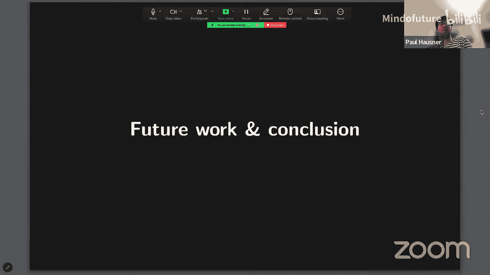

So as I said before right now， most of these problems are fairly synthetic。

 so future work includes that we want to extend these methods to other problems such as interior point methods and gaussher processes。

 we actually have to solve over and over again linear equation systems within these methods。

Additionally， we can learn additional heuristics for these preconditioners。

 like extending the sparsity pattern and learning the sparsity pattern directly or additionally learning the reordering of the matrix in the forward pass。

We get in our forthcoming paper that's going to be presented at the Northern Lights Conference in the beginning of next year。

 we've also extended the Learn preconditioning to other iterative schemes such as GM rest and have improved the training objective。

Insurance connection to large and small singular values。

So development of updated data preconditioning really has just begun。

 and the story doesn't end at only linear equation systems。

 but preconditioners can be important for any type of optimization problem。

So let's give into a quick summary。So heuristics such as preconditioners and optimization algorithms can be replaced by data driven approaches as we shown in this paper。

 and preconditioning is there a very natural form for learning to optimal my essence。

 it can be applied to all kinds of different optimization problems。

And maybe most interesting for the graph community is that graph neural networks are extremely natural computational back end for numerical linear algebra so there's a lot of different things we can use graphra neural networks for in order to improve actually the linear algebra side and exploit sort of this connection between GNNs and matrices in order to speed up optimization problems Yeah thank you and I'm happy to take any questions。

No， the thanks is frost us， Paul， this is excellent， a awesome finish to this conference。

 I think with this last thoroughal session。And yeah， this， I think marks the end of the， the deal。

 except for the use closing remarks。 And let's get to those。

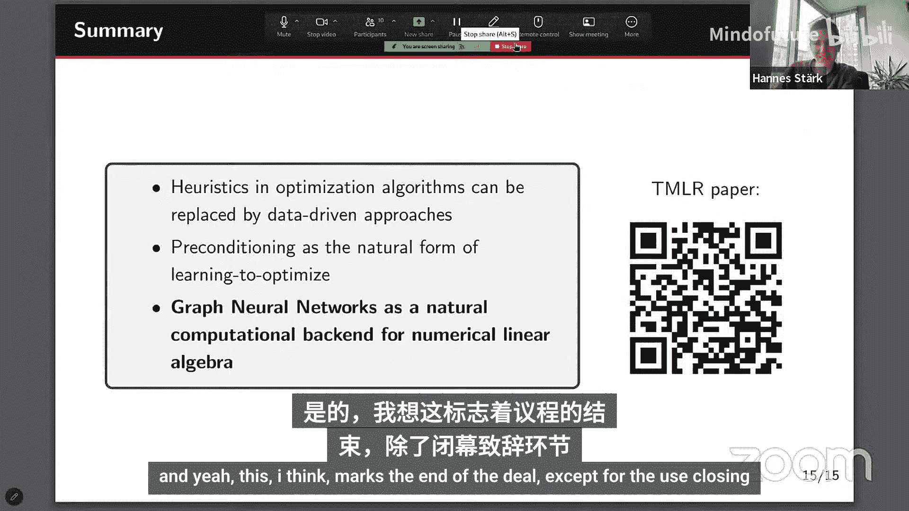

And I'm pretty sure we're going to hear some exciting stuff。 There are like some， some news。

 say you are you announcing some things， I that right？

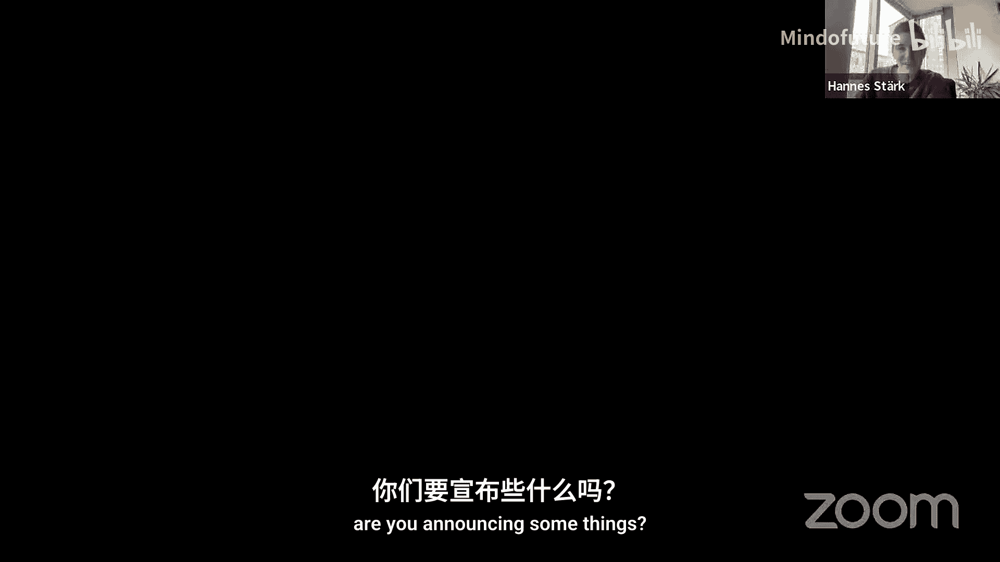

Yeah， thank you。O， let me share my。Like the reviewer awards did we already announce those。

Yeah we haven't I'll be announcing the awards for yeah then that's pretty exciting who gets the moneyies let's see Of course we're grateful for any review but there are some especially highlight worthy reviews and they should be should be rewarded but then yes let's go。

😊，Exactly， thank you so much。😊，So thank you everyone for attending the Learning on Gras conference this year and here comes to the end of our conference and I'll be presenting the closing remarks and presenting the awards for the best paper。

 top ACs and top reviewers。😊，So just to recap， the Learn on graphra conference was established with the core ideas to present the latest advances in graphra and geometric ML and we are a community- drivenn conference and we want to build a community that is truly accessible to all by making the conference free to attend and in a virtual format。

 we also emphasize local meetups where the researchers in MLL GraphML can meet up locally around the globe。

 we also focus on review quality by providing monetary rewards to the top reviewers as an incentive to improve the review quality。

So this year's program spans over four days and we had four keynote speakers， five tutorials。

 12 orals and two post sessions with 16 local meetups。

 and we are truly thankful for everyone participating in our conference presenting their research in GraphML that spends such a large and one。

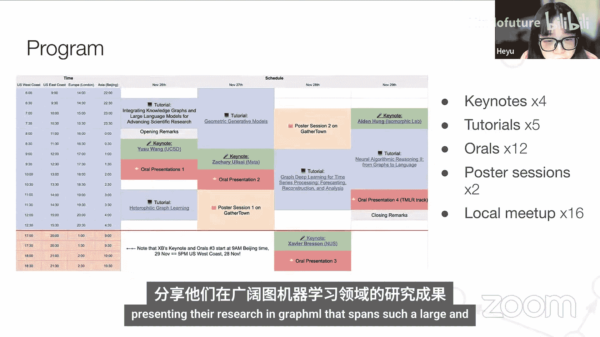