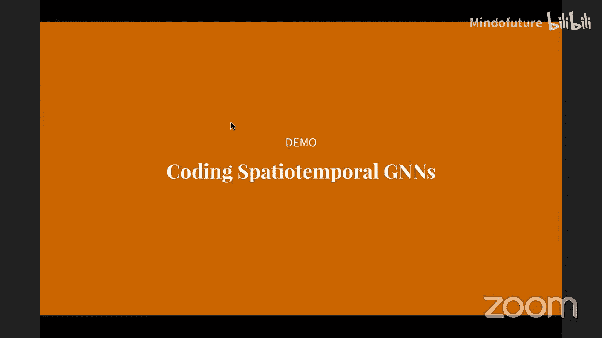
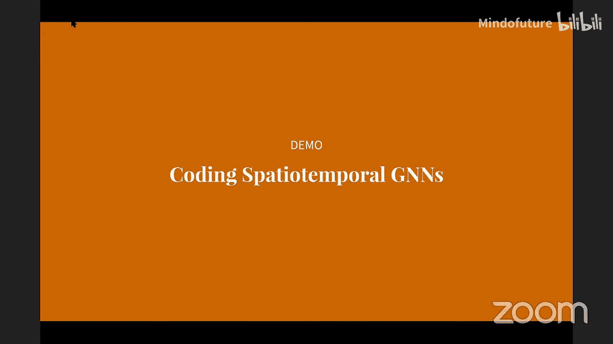
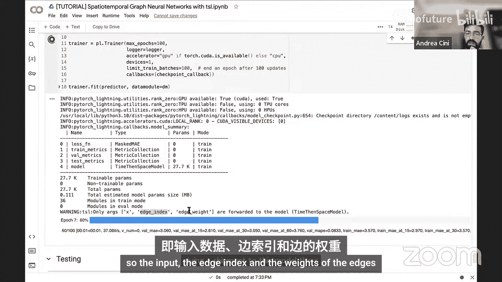
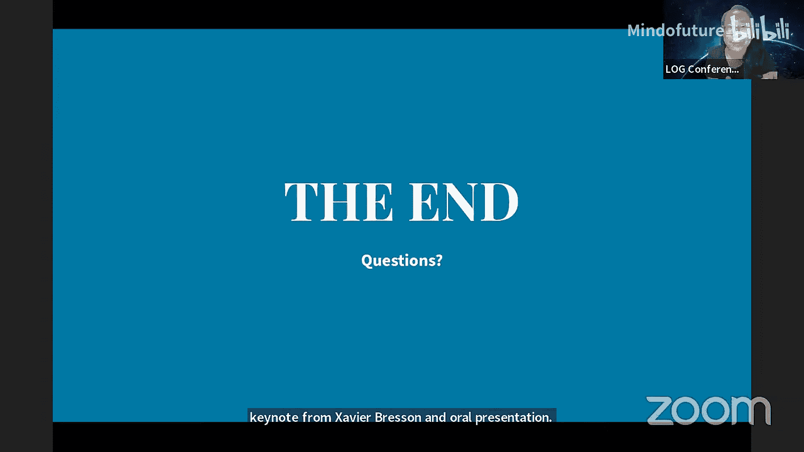

# 图机器学习会议：P05：时空图深度学习教程 - 第一部分

在本节课中，我们将学习如何利用图神经网络来处理具有相关性的时间序列数据。我们将从问题定义开始，介绍全局与局部模型的概念，并深入探讨如何构建时空图神经网络。

## 概述：相关时间序列处理

我们面临的核心问题是处理一组相互关联的时间序列。传统的深度学习方法通常采用**全局模型**，即使用一个单一模型在来自不同来源的多个时间序列上进行训练。这类似于现今人们所称的“基础模型”，但这里的范围可能更有限，例如仅限于来自特定领域的时间序列。

这种方法的优势在于其**样本效率**，这种效率允许我们构建更复杂的模型架构来处理输入的时间序列。

然而，上述两种标准实现方法的共同缺点是，它们都忽略了时间序列之间可能存在的依赖关系。除了我们稍后将讨论的图表示方法外，文献中还有一些处理此问题的方法。

一种简单直接的方法是，将输入的时间序列集合视为一个非常大的**多元时间序列**。但这显然存在严重的可扩展性问题，因为它会受到维度灾难的影响，导致样本复杂度高和计算可扩展性差。

我们可以转而考虑在**时间序列集合**上操作的模型，并保持模型参数在这些时间序列之间共享。基于注意力的架构（如Transformer）就是一个例子，在这种情况下，注意力将相对于空间维度而非时间轴进行计算。这种方法可以很好地工作，但缺点是我们没有利用依赖关系结构及其稀疏性的任何先验知识。

文献中还使用了其他方法，例如依赖于**降维**。其思想是从这个庞大的时间序列集合中提取一些共享的潜在因子，并使用这些因子来调节全局模型。如果数据在某些应用中具有低秩特性，这种方法可以很好地工作。但其缺点是，我们失去了局部的细粒度信息，而基于图的方法可以很好地捕捉这些信息。当然，在数据量非常大的情况下，这些方法也可能面临与其他方法相同的可扩展性问题。

## 基于图的表示方法

现在，我们可以开始讨论这些基于图的表示方法。如前所述，其思想是使用一个图来表示时间序列之间的功能依赖关系，并将此图作为我们学习模型的**归纳偏置**。

我们可以使用**邻接矩阵**来建模这些依赖关系。该邻接矩阵可以是非对称的，也可以是动态的，即它可以随时间 `T` 变化。除了邻接矩阵，我们还可以有边属性，这些属性本身也可以是动态的，并且可以是分类的或数值的。

以交通为例，邻接矩阵的结构可以从道路网络的结构中提取，并且可以为边关联属性或权重，例如编码道路距离。在这种情况下，动态拓扑可以帮助我们考虑交通网络结构的变化。

下图总结了我们在每个时间步可用的所有信息：目标时间序列、可以是动态或静态的外生变量，以及我们刚刚添加到设置中的关系信息。

现在的想法是利用这种关系侧信息来调节我们的预测器（即预测架构）。这些关系可以作为一种正则化手段，将预测结果相对于每个节点进行局部化。特别是，它们可以用来消除由于未考虑这些结构而可能产生的虚假相关性。此外，这些方法比标准的多元模型更具可扩展性，因为我们可以保持模型参数在处理的时间序列之间共享。事实上，我们可以使用这类架构来预测和处理任何相关的子时间序列。

专门为处理这类数据而开发的图神经网络被称为**时空图神经网络**，指的是模型中的传播同时跨越时间和空间发生。我们将重点关注那些基于**消息传递框架**的模型。

我们将通过考虑以下模板架构来实现这一点：该架构由一个**编码器**组成，它独立地编码每个时间步和每个节点的观测值；编码器之后是一堆**时空消息传递层**，这是架构中唯一发生时间和空间传播的组件；时空消息传递块提取的表征随后可以通过一个**解码块**映射为预测。

我们可以更详细地观察这个过程。编码器的处理发生在单个时间步和单个节点的层面。由此产生的观测序列随后由时空消息传递层处理。解码器再次在单个节点和时间步的层面运行，将这些表征映射为预测。

时空消息传递块可以有多种实现方式。我们可以将其视为标准消息传递层的一种泛化，不同之处在于，这里每个节点关联的不是静态表征，而是表征序列。因此，我们需要修改构成消息传递架构的标准算子，使其能够处理序列。

显然，实现这一目标有许多可能的设计方案，这些方案可以与每个特定应用的需求相匹配。下一步将是描述这些时空块的可能设计范式，但在继续之前，现在是提问或澄清任何疑问的好时机。

## 时空块的设计范式

关于不同的设计，我们可以区分几种模型。

*   **时空融合模型**：在这些模型中，时间和空间的处理无法分解为独立的步骤，它们是联合发生的。
*   **先时后空模型**：顾名思义，这种模型将时间和空间维度的处理分解为两个独立的步骤。
*   **先空后时模型**：这基本上是“先时后空”模型的反向顺序。

对于时空融合模型，正如之前提到的，表征在时间和空间上的传播方式意味着最终模型架构的处理无法分解为独立的阶段。实现这些架构有几种方法。

以下是实现时空融合模型的几个标准示例。

*   **将消息传递集成到序列建模架构中**：例如，我们可以从标准的GRU单元开始，每个时间序列被独立处理。通过使用消息传递来实现循环单元的每个门，我们可以轻松获得其时空图神经网络版本。这类模型被称为**图卷积循环神经网络**。一个非常流行的架构是**扩散卷积循环神经网络**，其中消息传递算子通过双向扩散卷积实现，其思想是对入边和出边采用不同的处理方式。
*   **时空卷积网络**：这里所做的只是交替使用时间卷积滤波器和图上的空间卷积。基本上，这是在每个节点上分别应用标准的时间卷积（可以是任何1D卷积滤波器），然后进行一步消息传递。通过堆叠多个这样的层，可以得到一个感受野在每一层都相对于时间和空间增大的架构。**STGCN**是文献中引入的第一个此类架构。另一个模型是**Graph WaveNet**，它使用更先进的卷积算子（包括膨胀卷积）来增加模型的感受野。
*   **使用序列建模算子计算消息**：一个简单的例子是使用TCN计算消息。基本上，将两个相邻节点的时间序列（观测序列）连接起来，然后对结果序列应用卷积滤波器。显然，你可以使用任何想要的序列建模算子。例如，有许多使用注意力算子的此类架构示例，在这种情况下，这将是跨注意力，因为你将计算两个不同节点序列之间的注意力。

我们还有**乘积图表示**。这些表示源于一个简单的观察：你可以将时间维度视为一个线图，并以某种方式将其与空间图结合起来。然后，再次使用标准的消息传递网络处理得到的表示。例如，你可以考虑标准的笛卡尔积，其中每个节点在每个时间步都连接到其邻居以及前一个时间步的自身。还有其他连接此图的方法，如克罗内克积，其思想是将每个节点连接到前一个时间步的邻居。你还可以提出许多不同的方法来连接这个图。

接下来，我们看看**先时后空方法**。这种方法很容易理解，构建的模型也很简单。其思想是分别将每个序列嵌入到一个向量表征中，然后在得到的图上执行消息传递。这里的优势是易于实现且计算高效，因为在训练时，你不需要在每个时间步都执行消息传递，而只在最后一步执行。我们还可以重用所有已知的处理序列和图的算子。其缺点是，这种两步过程可能会引入非常严重的信息瓶颈，并且由于只对单个图表征执行消息传递，因此更难考虑拓扑变化和动态边属性。

然后是**先空后时方法**，这基本上是另一种顺序。你分别在每个时间步执行消息传递，然后用一个序列模型对表征序列进行编码。这些方法在文献中经常使用，但它们仍然存在这种瓶颈和分解处理，可能使信息传播更加困难，并且它们不具备“先时后空”模型的计算优势，因为你需要为每个时间步计算消息传递。

## 全局性与局部性

全局性和局部性在整个演示中扮演着重要角色。至少按照我们讨论的模板实现的STGN是**全局模型**，因此它们可以处理任意集合，是归纳模型。它们可以利用依赖结构为预测提供进一步的调节。

然而，这种进一步的调节可能还不够，模型可能在建模时间序列集合中可能存在的所有异质动态时遇到困难。因此，模型可能需要非常长的观测窗口和非常大的模型容量来考虑所有这些不同的异质动态。

文献中遵循的一种解决方法是考虑**混合的全局-局部架构**。实现混合架构的一种直接方法是，例如，再次查看我们的模板架构，将某些组件转变为局部的。例如，你可以让编码器和解码器的参数特定于将要处理的时间序列。由此产生的模型将能够更容易地捕捉这些局部效应。当然，缺点是如果你想使用这种方法处理许多时间序列，这将导致大量的局部参数。

缓解这个问题的一种方法是简单地考虑**节点嵌入**，即可学习的参数向量，可以与每个节点关联。你可以将这些节点嵌入视为一种可学习的位置编码，但它们在这里实际上不是编码节点在图中的位置，而是负责建模每个时间序列的特定特征。这些可学习的向量可以被输入到编码器和解码器中，它们分摊了这些局部时间序列特定处理块的学习，允许保持大部分模型参数共享。当然，我们仍然有一个缺点，即可学习参数的数量与我们要处理的时间序列数量成线性比例。因此，可以考虑一些折中方案，例如为时间序列簇学习嵌入，而不是为每个单独的序列学习。

另一个需要考虑的重要问题是，当我们转向混合架构时，得到的模型不再是归纳式的。这听起来像是一个缺点，但在迁移学习场景中，你也能获得一些好处。特别是，拥有混合架构允许保持模型的共享参数（全局部分）共享，而只微调局部部分（例如嵌入）。文献表明，正则化这些节点嵌入可以进一步促进这种迁移学习过程。

## 实证结果

我们可以看一些实证结果。以下是相关时间序列预测中非常流行的基准。在表格的最上方，我们有一些使用刚刚看到的模板开发的基线参考架构，特别是使用的GCRNN（基本上是时空融合模型），以及“先时后空”模型的不同实现。然后，我们还有三个来自最先进水平的架构。

我们可以看到，当我们添加这些局部嵌入（即使基线模型变为混合模型，引入一些单独建模每个时间序列特征的部分）时，性能可以得到显著提升。以至于使用这些非常简单的架构，在许多情况下，你能够匹配更复杂、参数更多的最新模型的性能。

然后，我们可以看看一些迁移学习结果。基本上，我们取了来自四个不同交通网络的数据，在三个网络上训练了一个模型，然后在第四个网络上执行迁移步骤。第一个观察结果是，经过微调的模型（迁移学习后的模型）比零样本归纳模型表现好得多，这在某种程度上是意料之中的。另一个非常有趣的现象是，仅微调局部组件的混合架构的性能远优于微调的全局模型。此外，文献中研究的变分和聚类正则化（此处引用的论文）可以进一步提高迁移性能。

## 总结

在本节课中，我们一起学习了如何处理相关时间序列。我们形式化了处理相关时间序列的问题，并展示了如何使用图表示来建模它们之间的依赖关系。我们讨论了预测问题，以及时间序列全局与局部深度学习模型之间的重要区别。最后，我们探讨了构建时空图神经网络的方法及其相关的权衡。

在讨论挑战之前，我们将查看上述内容的软件实现。接下来将介绍我们开发的一个库的教程。在此之前，我们可以回答一些问题并短暂休息五分钟。