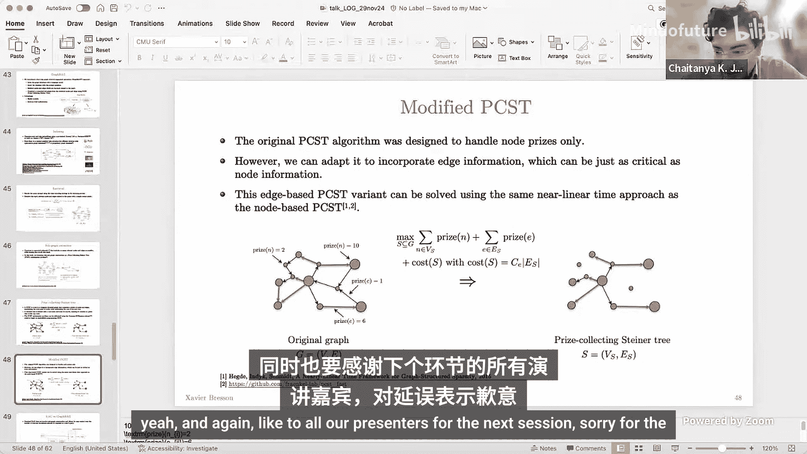
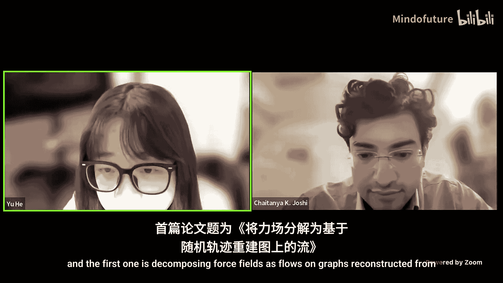
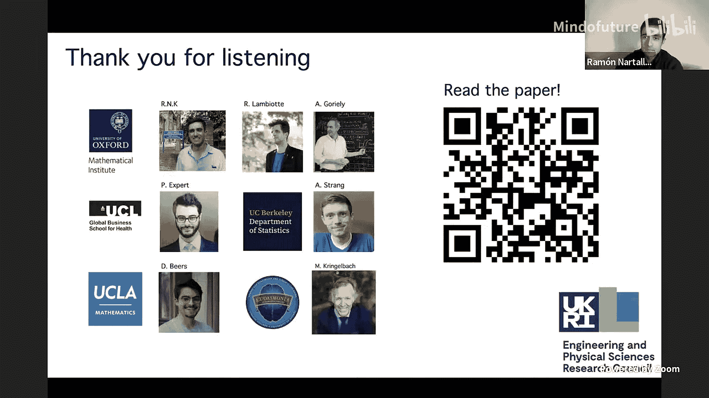
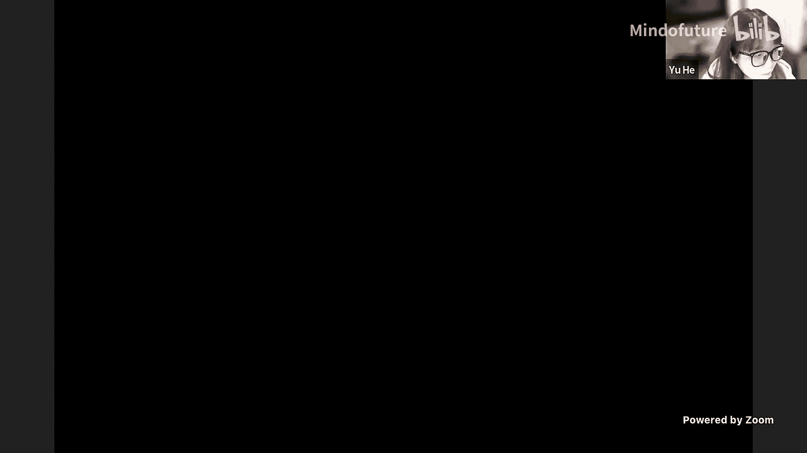
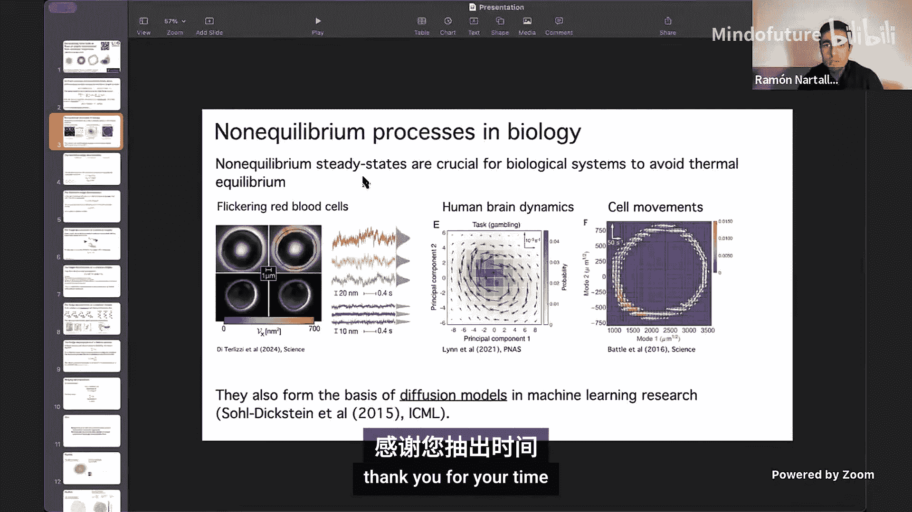
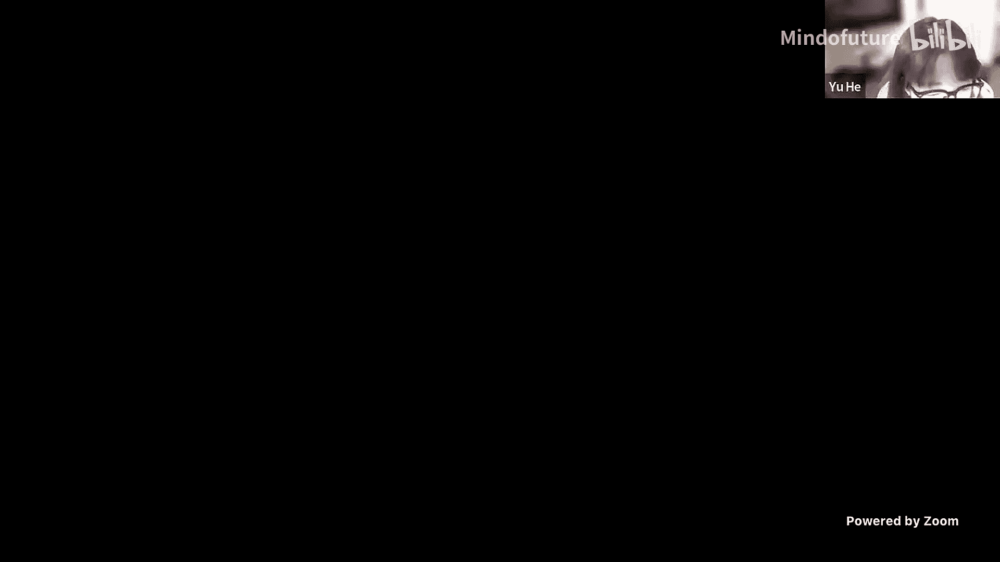
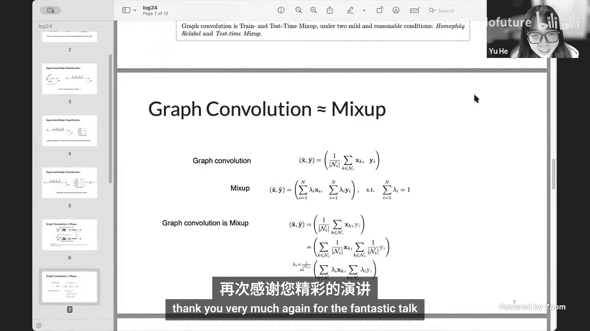
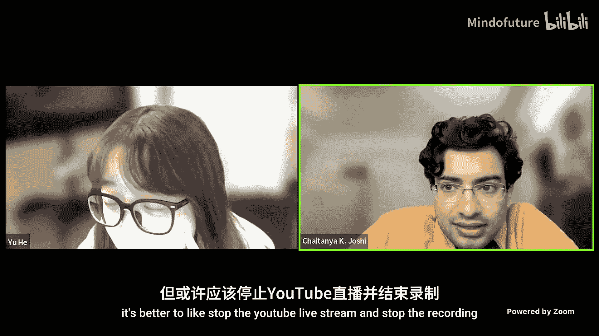

# 图机器学习会议：P06：Xavier Bresson 主旨演讲与口头报告

在本节课中，我们将学习 Xavier Bresson 教授在图机器学习会议上的主旨演讲，以及后续三篇口头报告的核心内容。我们将探讨大型语言模型与图神经网络的结合、非平衡态动力学的图信号处理、宇宙学数据集的等变模型基准测试，以及图卷积与数据增强技术 MixUp 之间的理论联系。

## 概述

本次演讲和报告涵盖了图机器学习的前沿方向。首先，Xavier Bresson 教授探讨了如何结合大型语言模型和图神经网络的优势，以处理文本属性图任务。随后，三篇口头报告分别展示了图方法在生物物理、宇宙学和理论分析中的创新应用。我们将逐一解析这些工作的核心思想、方法及贡献。

---

## 大型语言模型与图神经网络的结合

上一节我们概述了本次课程的内容，本节中我们来看看 Xavier Bresson 教授如何分析大型语言模型与图神经网络的优劣，并提出结合方案。

大型语言模型在图任务上存在局限性。它们虽然拥有海量知识，但逻辑推理能力有限，需要精确的提示才能工作。即使在训练中见过图任务的测试集，它们处理图结构的能力依然不足。

相比之下，图神经网络在处理图结构数据方面具有天然优势。例如，对于一个包含人物和城市关系的图，询问“莫娜莎和爱丽丝的朋友鲍勃在同一个城市吗？”，GNN 可以通过多层消息传递学习到连接问题答案的多跳路径。GNN 在文本、物理、生物、组合优化和化学等多个领域都非常有效。2023年诺贝尔化学奖授予了 AlphaFold，其核心是一个预测氨基酸序列残基间成对距离的等变 Transformer，这本质上也是一个图神经网络。

然而，GNN 也存在局限。目前尚缺乏像自然语言处理或计算机视觉领域那样规模的图基础模型。问题的关键在于数据规模、硬件优化和工业应用。现有数据集（如 OGB）相比图像数据集（如 ImageNet 的 150GB）仍然较小。运行稀疏代数运算的硬件未得到优化，速度远慢于标准的密集矩阵操作。现有的预训练 GNN 参数量仅为百万级别，而非十亿级别。此外，工业界尚未找到 GNN 有吸引力的盈利应用，这影响了相关研究的投入。

结合 LLM 和 GNN 意味着开发一个联合训练的文本与图基础模型，这是一个非常吸引人且前景广阔的想法。但当前面临的挑战是文本知识（来自 LLM）和图知识（来自 GNN）之间存在巨大的不平衡。理想的架构是让文本通过 LLM 处理得到向量，图通过 GNN 处理得到向量，然后通过自注意力或交叉注意力机制共同处理这些向量以生成文本。然而，协调这两个差异巨大的领域非常具有挑战性。

因此，我们需要定制化地结合 LLM 和 GNN 以获取价值。例如，可以利用 LLM 的广泛知识来提升小规模文本属性图的性能。反之，也可以利用知识图来约束 LLM，使其生成更精确的回答，从而减少幻觉。

以下是两种具体的结合思路：
1.  **利用 LLM 增强 GNN**：使用 LLM 的知识和推理能力来提升图中节点特征的质量，从而改进 GNN 的预测。
2.  **利用 GNN 增强 LLM**：使用图（如知识图谱）来约束和正则化 LLM 的响应，使其专注于与图相关的信息，减少幻觉。

接下来，我们将详细介绍这两种技术路径。

---

## 技术一：TAPE - 利用 LLM 知识增强 GNN

上一节我们介绍了结合 LLM 与 GNN 的两种思路，本节中我们来看看第一种技术：TAPE。其核心思想是利用 LLM 的知识来提升文本属性图中节点特征的质量，从而让 GNN 做出更准确的预测。

关键问题是如何从 LLM 中提取针对特定图任务的信息。我们的方法是通过提示工程来获取 LLM 的预测及其推理过程。例如，给定一篇学术文章的标题和摘要，我们不仅要求 LLM 预测其类别，还要求它给出做出此预测的推理或解释。

这样，我们就得到了由单词序列组成的标题、摘要、解释和预测。然而，GNN 无法直接处理单词序列。我们需要一个映射，将输入单词序列转换为一个 D 维向量，以总结信息并增强节点特征的表征能力。在这个例子中，节点代表一篇文章，我们的目标是预测节点之间的关系或类别。

我们提出了一种集成闭源和开源 LLM 的技术。闭源 LLM（如 GPT、Claude）通常性能更好，但它们只提供文本序列，不提供内部向量，因此难以用于训练 GNN。相反，开源 LLM（如 LLaMA、Gemma）不仅提供文本，还提供内部的隐藏向量等所有信息。

我们的方案是：使用当时最好的闭源 LLM（如 GPT-3.5）来处理文章，获得解释和预测的文本序列。然后，我们使用一个较小的开源语言模型（如 BERT，1.29 亿参数）将这些文本序列转换为向量。具体做法是，将序列输入 Transformer，提取 [CLS] 标记在经过 L 层 Transformer 后的表示，然后通过一个小的多层感知机在训练集上进行微调。这个 MLP 根据正确的类别标签进行训练，最终输出一个定制的、富含任务信息的 D 维向量作为增强后的节点特征。我们可以为解释、标题、摘要和预测分别生成这样的特征。

在 2024 年，我们可以将小型的 BERT 模型替换为大型语言模型（如 LLaMA 2），并利用 LoRA 技术进行高效的微调，这在学术界的有限 GPU 资源下是可行的。

一旦获得了增强的节点特征，就可以用它们来训练你喜欢的任何 GNN 模型，并进行预测。

我们比较了不同节点特征的质量。在 OGB-arXiv 数据集上，使用预定义的词袋特征作为基线，可以在 4 分钟内达到 70% 的测试准确率，这是一个很好的性能基准。当时的 SOTA 模型 GLEN 同时训练语言模型和 GNN，达到了 76.5% 的准确率，但需要 9.2 小时的训练时间，存在巨大的性能与计算成本权衡。

我们的 TAPE 方法使用 LLM 提示并转化为向量后进行微调，达到了 75.5% 的准确率，且训练时间很短。这项技术发表后曾登上排行榜首，后续其他技术也采用了类似方法。即使在今天，OGB-arXiv 排行榜的前三名模型也基本基于这种思路。

为了验证结果的可靠性（避免因测试集被 LLM 见过而产生质疑），我们创建了一个新的数据集 TAPE-arXiv-23，包含 77,000 篇论文，结论保持不变。这再次证明，即使 LLM 见过测试集，若缺乏图结构推理能力，仍需要 GNN 利用拓扑关系来做出良好预测。

消融研究表明，没有单一特征比其他特征更好，特征的组合才是最重要的。

**本工作结论**：我们可以利用 LLM 的知识及其推理能力来增强文本属性图的节点特征，并使其针对特定任务进行定制。我们的方法并非端到端，而是先生成优质特征，再训练 GNN。这符合当前 LLM 的训练趋势（如指令微调、奖励建模、强化学习），每个步骤独立进行，稳定且高效。该方法可以同时利用闭源和开源 LLM 的优势，并且具有可解释性，因为可以看到 LLM 的推理过程。

---

## 技术二：G-Retriever - 利用图增强 LLM

上一节我们学习了如何用 LLM 增强 GNN，本节我们来看看反向思路：如何用图来增强 LLM，减少其幻觉。这项技术称为 G-Retriever。

LLM 虽然强大，但可能会因提示不当而产生错误。我们需要将其响应约束到一个更精确的空间中。为此，我们将利用一个文本属性图（如知识图谱）来强制 LLM 的回答与此图相关。

关键问题是如何从图中提取相关信息，并迫使 LLM 更加专注。我们的方法是将所有信息都表示为 Transformer 的输入标记。输入不仅包括查询标记，还可以包括视觉标记和图标记。这里，我们使用两种标记：**图编码标记**和**文本化图标记**。

**图编码标记**：对于图学习来说，将图表示为一个向量是很自然的想法。我们可以选择任何图编码器 GNN，应用多层图学习来计算深度节点隐藏特征，然后对所有节点特征取平均，再通过一个小的 MLP 得到图编码标记。这个 D 维向量总结了图的拓扑结构和节点特征。

**文本化图标记**：LLM 通过单词标记处理信息。为了利用 LLM 的知识，我们需要将图及其特征转化为自然语言标记序列。例如，一个图可以用文本表示为“图 G 是一组有向边的集合，定义为...”。然而，用语言表示图的方式并不唯一，这可能导致问题。此外，文本表示不具备不变性（改变描述顺序可能得到不同结果），并且存在可扩展性问题（如 LLaMA 2 的上下文窗口限制为 4000 个标记，无法处理大型图）。LLM 还容易产生幻觉，可能生成图中不存在的节点或边。

我们提出的 G-Retriever 包含四个步骤：
1.  **图检索增强生成**：首先，从一个可能很大的文本属性图中检索出与用户查询相关的子图。
2.  **标记构建**：将用户查询、图编码标记和文本化图标记拼接起来，构成 LLM 的输入序列。
3.  **答案生成**：LLM 根据输入序列生成答案。
4.  **联合训练**：同时训练 GNN 的参数，并使用 LoRA 微调 LLM 的参数。使用 LoRA 仅需微调 70 亿参数中的 0.5%（即 3500 万参数），加上 GNN 的约 500 万参数，总参数量在学术界可承受范围内。

**图检索增强生成**：其核心挑战是可扩展性。我们的解决方案如下：
*   **索引**：对于一个文本属性图，我们使用一个预训练且冻结的（大）语言模型，为所有节点和边生成 D 维向量表示，并将其存储在图数据库（如 Neo4j）中。
*   **检索**：给定用户查询，用相同的语言模型将其表示为向量，然后使用余弦相似度等度量，从图数据库中检索出 top-K 相关的节点和边，形成一个“嘈杂”的子图。
*   **提炼**：为了提取信息最密集、更小的子图，我们解决一个**带权斯坦纳树问题**。该问题旨在最大化所选节点的总权重（重要性），同时惩罚解决方案的成本（节点数量）。这是一个 NP 难问题，但可以使用半定规划进行近似求解，得到一棵有向树。我们可以轻松地修改问题以纳入边的重要性信息，并获得快速的线性时间近似解。

与标准 RAG（检索相关文档）相比，图 RAG 是从图数据库中检索一个更小但高度相关的子图。

回到 LLM 的输入标记：图编码标记如前所述；文本化标记则包括用户查询的文本序列和子图的文本化表示序列。这些标记经过词嵌入层后输入 LLM。

训练过程是标准的：给定输入标记，经过 Transformer 层，递归生成响应。利用训练集的真实答案，通过计算交叉熵损失并进行反向传播，来更新 GNN 和 LLM 的参数。

**总结**：G-Retriever 包含四个步骤：图 RAG（用于子图检索）、图编码标记计算、响应生成和联合模型训练。我们结合了各方优势，以一种非常自然的方式完成。为了评估该任务，我们创建了新的基准数据集。主要结果表明，G-Retriever 能够击败仅使用 LLM、仅使用 GNN 提示调优或仅使用 LoRA 微调 LLM 的基线方法。在可扩展性上，它能将使用的标记/节点数量减少 83% 到 99%。更重要的是，它有效减少了 LLM 的幻觉。消融研究显示，来自 GNN 的图编码标记和来自图的文本标记贡献相当，两者互补，共同提升性能。

**结论**：要解锁 LLM 的图处理能力，需要将图也表示为标记。结合 LLM、GNN 和图 RAG 能提供卓越的性能。G-Retriever 是有效、高效且能缓解幻觉的。这项技术已被整合到 PyTorch Geometric 库中。从搜索引擎的发展历史（PageRank -> Word2Vec -> 语言模型 -> RAG -> Gemini）来看，下一步有望将 GNN 和文本属性知识图整合到网络搜索引擎中，实现完全可学习的端到端系统。未来的工作还将引入图像信息，通过视觉 Transformer 将图像块表示为视觉标记，并与文本、图标记一起处理。

---

## 口头报告一：从随机轨迹重建的图中分解力场为流

上一节我们探讨了 LLM 与 GNN 的结合，本节我们将进入第一个口头报告，了解如何利用图信号处理技术分析非平衡态随机过程。

本报告关注随机过程和非平衡稳态。连续空间随机过程由随机微分方程描述，包含漂移项和扩散项。虽然这是单个轨迹的动力学，但其概率密度随时间的演化遵循著名的福克-普朗克方程。当密度达到稳态时，过程处于稳态。稳态可以是平衡态（热平衡）或非平衡态，这取决于概率流是否为零。

非平衡过程在许多领域非常重要，尤其是在生物学中，因为生物系统通过维持在非平衡稳态来避免达到热平衡（即死亡）。例如，红细胞膜的非平衡波动、人类大脑动力学以及细胞运动。

**亥姆霍兹-霍奇分解**：任何非平衡随机过程都可以分解为可逆和不可逆两部分。可逆部分是随机的，其漂移平衡了扩散；不可逆部分则驱动系统围绕稳态分布旋转。在各项同性扩散的假设下，过程可逆当且仅当漂移是保守的（即梯度流），此时不可逆分量为零。

现在，我们将视角转向图和单纯复形。**单纯复形**可以通过从团中构建高阶单纯形（如三角形）来定义。**边流**是定义在边上的交替函数。这种边流可以分解为三个部分：梯度部分、旋度部分和谐波余项。这类似于随机过程的分解。如果复形是三角剖分，则谐波余项消失。

如何将随机过程的分解与单纯复形上的流分解联系起来？我们通过考虑离散状态马尔可夫过程的霍奇分解来搭建桥梁。离散状态马尔可夫过程的状态可以映射为图的顶点，转移则对应边。关键在于定义一个与 SDE 漂移类似的边流。数学上，正确的定义涉及转移速率的对数平方根之比。这确保了马尔可夫过程可逆当且仅当该边流是梯度流，从而与连续情况完美对应。

**方法流程**：
1.  **近似**：使用从随机轨迹直接推断出的离散状态过程来近似随机微分方程。
2.  **分解**：分解该离散状态过程，从而从随机轨迹中恢复 SDE 的可逆和不可逆分量。

具体步骤如下：
*   从相空间中的轨迹点云开始。
*   执行最远点采样以获得均匀密度的子样本点。
*   对这些子样本点进行三角剖分（如 Delaunay 三角剖分），形成三角形网格。
*   将每个三角形区域视为一个离散状态，通过统计轨迹在区域间的转移来估计转移速率，从而推断出一个离散状态随机过程。
*   取该过程的对偶三角剖分，使得状态对应于顶点，转移对应于边。
*   使用最大似然估计的转移速率定义边流。
*   最后，通过求解一个最小二乘问题，将边流分解为梯度部分和旋度部分，分别对应可逆和不可逆电流。

**数值实验验证**：
*   **时间反演对称性检验**：可逆分量在时间反演下应为偶函数，不可逆分量应为奇函数。实验证实了这一点。
*   **不可逆性度量**：定义旋度流占总流的比例作为不可逆性度量。在线性和非线性可解过程（如 Ornstein-Uhlenbeck 过程、平面极限环）中，该方法能正确捕捉随着参数增加而增强的不可逆流。
*   **非线性示例**：在随机 van der Pol 振荡器和 Rössler 吸引子中，该方法也能定性地捕捉到不可逆性随参数增加的趋势。

**实际应用**：
我们将该方法应用于两个已知真实情况的生物物理学案例：
1.  **红细胞膜波动**：健康的（活跃的）红细胞比合成 ATP 耗尽的（被动的）红细胞具有更高的耗散（即更不可逆）。
2.  **人类心跳**：健康的心跳比心律失常的心跳具有更高的不可逆性。

对于这些单变量时间序列数据，我们使用时间延迟嵌入法将其重构到相空间。由于实际数据扩散可能非各向同性，我们估计了扩散张量并进行坐标变换，使其满足各向同性假设。应用我们的方法后，结果证实了健康状态下的不可逆流水平显著高于受损状态，这与文献结果一致。

**总结**：我们开发了一种方法，利用单纯复形上的离散亥姆霍兹-霍奇分解来近似 SDE 的连续形式分解。该方法在可解和不可解随机过程中都能捕捉不可逆电流，并成功应用于红细胞和心跳数据分析，证实了健康条件下不可逆性水平更高。这项工作在图信号处理与随机动力学、生物物理学的交叉领域开辟了新 ground。

---

## 口头报告二：用于保持对称性的数据处理的宇宙尺度基准

上一节我们看到了图方法在分析动力系统中的应用，本节我们转向宇宙学，探讨一个用于测试等变图神经网络的大规模基准数据集。

宇宙学中的一个核心观测是**星系聚类**，即测量星系的位置和属性。研究星系的空间分布可以揭示宇宙的基础结构和物理过程。这些观测数据通常非常复杂且高维。传统上，宇宙学家使用**两点相关函数**等概要统计量，但它们可能丢失数据中高阶关联的信息。这推动了机器学习工具的发展，以更可靠地从这些数据中提取信息。

星系聚类数据具有几个特点，使其成为压力测试 GNN 和其他方法的宝贵基准：
1.  **大规模点云**：每个点云可包含超过 10^6 个点，对可扩展性提出挑战。
2.  **跨空间尺度的信息**：存在由引力导致的短程关联和由结构增长导致的远程关联，需要能捕捉局部和全局信息的方法。
3.  **对称性结构**：由于宇宙是均匀且各向同性的，星系分布应表现出欧几里得对称性（对平移、旋转、反射不变），适合用于基准测试 E(3) 等变神经网络。

基于此，我们的贡献包括：
*   从现有的宇宙学 N 体模拟中策划了一个点云数据集，并提供了易于使用的访问接口。
*   引入了一个基于 JAX 的代码库，实现了多种常见的等变神经网络架构。
*   系统评估了各种 GNN 在该数据集下游任务上的性能，特别关注等变模型。

**数据集细节**：数据来源于名为 Quixote 的 N 体模拟套件。模拟输入是描述宇宙条件的 5 个宇宙学参数，然后跟踪周期性体积内数百万个暗物质粒子的演化。我们收集了总共 12,384 个模拟数据。通过后处理识别暗物质晕（宿主星系的引力束缚结构），并选择每个模拟中质量最大的 5,000 个晕来构建点云。每个点带有位置、速度、角动量和质量等特征。每个点云都用输入的宇宙学参数（如物质密度 Ω_m 和涨落幅度 σ_8）进行标注。我们还计算了每个点云的**两点相关函数**作为基准线。

**基准任务**：
1.  **图级参数预测**：给定星系位置，预测宇宙学参数 Ω_m（依赖长程关联）和 σ_8（依赖短程关联）。
2.  **节点级速度预测**：仅给定位置，预测每个点的速度向量。

**方法**：我们将点云通过 K 近邻法转换为图。基准测试的模型包括几种常见的消息传递架构，其中三种是 E(3) 等变的。所有模型都使用径向基函数作为边特征，这对等变模型的性能至关重要。

**实验结果**：
*   在所有三个任务上，等变模型的表现都优于非等变 GNN 和 PointNet++。
*   然而，在依赖长程信息的 Ω_m 预测任务上，所有模型都未能击败基于 2PCF 向量训练 MLP 的基线。这表明 GNN 在捕获长程信息方面存在困难。
*   通过将 2PCF 向量与图嵌入拼接，模型性能得到提升。进一步分析发现，仅使用 2PCF 的大尺度部分就几乎能达到使用全部向量的效果，验证了模型缺失的正是长程关联信息。
*   在不同训练集规模下的实验中，SEGNN 模型在所有规模上都表现出更好的性能，显示出更高的模拟效率。

**总结**：我们引入了一个由模拟星系构成的数据集，其空间分布反映了底层宇宙学模型。我们展示了图级和节点级任务都能受益于等变模型的使用，并且等变模型具有更高的模拟效率。同时，2PCF 概要统计在推断对长程关联敏感的参数时优于 GNN，这使得该基准成为测试旨在缓解长程信息传递问题的方法（如 Transformer）的理想目标。

---

## 口头报告三：论图卷积与 MixUp 的等价性

上一节我们了解了宇宙学基准测试，本节我们进入最后一个报告，探讨一个有趣的理论发现：图卷积与数据增强技术 MixUp 之间的内在联系。

图卷积神经网络的核心操作是**邻居聚合**，即聚合目标节点邻居的特征来更新该节点的表示，这被认为能丰富目标节点的表征。

我们从监督节点分类任务的角度给出了另一种解释。假设有一个单层 GCN，我们关注节点 A 的标签（例如 one-hot 向量 `[0,1,0]`）。在训练时，我们用这个标签来监督经过聚合后得到的节点 A 的新特征。而这个新特征是由节点 A、B、C、D 的原始特征聚合而来的。这意味着，我们实际上也在用节点 A 的标签来监督其邻居 B、C、D 的原始特征。换句话说，目标节点的标签被用来训练其邻居的特征，这可能是 GCN 效果良好的原因之一。

基于这一观察，我们可以为原始图卷积构建一组**等价训练数据**。对于节点 A 及其邻居，每个节点都获得与 A 相同的标签 `[0,1,0]` 和它们各自的原始特征。这样我们就有了多个数据样本。

现在，如果我们对这组等价数据应用 **MixUp** 数据增强技术，即对样本的特征和标签进行线性插值，那么为节点 A 生成的新特征和新标签，与经过图卷积更新后的节点 A 的特征和标签是相同的。因此，**图卷积等价于在特定条件下（即邻居节点被重新标记为目标节点标签）的 MixUp 策略**。

**方法框架**：我们提出“同质性重新标记”的假设，即将目标节点的邻居节点重新标记为目标节点的标签。在此假设下，对重新标记后的数据应用 MixUp，所得目标节点的特征和标签与经过图卷积操作后的结果相同。

**数学表达**：图卷积的数学表达式是更新节点特征，但保持节点标签不变。而 MixUp 则同时对特征和标签进行插值。如果我们对邻居节点进行“同质性重新标记”，使其标签与目标节点相同，那么图卷积的公式就可以重写为 MixUp 的形式。

**实验验证**：
1.  在经典引文网络数据集上，使用 MLP 配合 MixUp 可以达到与 GCN 相似的节点分类准确率。
2.  使用“同质性重新标记”配合多层感知机，在不同训练数据比例下，取得了与 GCN 相似的性能曲线。
3.  **测试时 MixUp**：仅使用原始标记节点训练一个 MLP，然后在测试时使用训练好的 GCN 权重进行推理（即测试时聚合），其性能与 GCN 相似。实验还显示，测试时 MixUp 能使不同类节点的表示在特征空间中远离决策边界。
4.  将“同质性重新标记”与测试时 MixUp 结合，其性能与 GCN 高度相似。

**结论与意义**：我们建立了图卷积与 MixUp 之间的理论联系。这种联系的意义在于：
*   **计算加速**：MixUp 可以避免在训练时进行耗时的邻接矩阵乘法，只需训练一个 MLP，可能加速图卷积过程。
*   **理论理解**：为理解 GCN 的工作机制提供了新的视角。
*   **扩展性**：虽然实验主要在同质图上进行，但数学框架并未假设图必须是同质的，未来可以探索在异质图上的应用。

---

## 总结

本节课中，我们一起学习了图机器学习领域的多个前沿方向。

我们从 Xavier Bresson 教授的主旨演讲开始，深入探讨了结合大型语言模型与图神经网络以发挥各自优势的两种技术路径：TAPE（用 LLM 增强 GNN 的节点特征）和 G-Retriever（用图结构约束 LLM 以减少幻觉）。这些工作展示了跨模态融合的巨大潜力。

随后，三篇口头报告展示了图方法的广泛应用和理论深度：
1.  第一篇报告利用图上的霍奇分解来分析随机轨迹，成功地从生物物理数据（红细胞波动、心跳）中提取出非平衡态信号，连接了图信号处理与随机动力学。
2.  第二篇报告构建了一个宇宙尺度的点云数据集，用于基准测试等变图神经网络，揭示了当前 GNN 在捕获长程依赖方面的不足，为未来方法发展提供了明确目标。
3.  第三篇报告发现了图卷积操作与数据增强技术 MixUp 之间的理论等价性，为理解图卷积的工作原理和设计更高效的算法提供了新的思路。

这些工作共同体现了图机器学习在理论创新、跨领域应用以及解决实际挑战方面的活力和价值。