# 图机器学习会议：P07：图深度学习用于时间序列处理教程

## 概述
在本教程中，我们将学习如何结合图深度学习与时间序列处理技术，以处理具有复杂依赖关系的多变量时间序列数据。我们将从问题定义开始，介绍图表示方法，构建时空图神经网络，并探讨实际应用中的挑战与解决方案。

---

## 1：问题定义与图表示

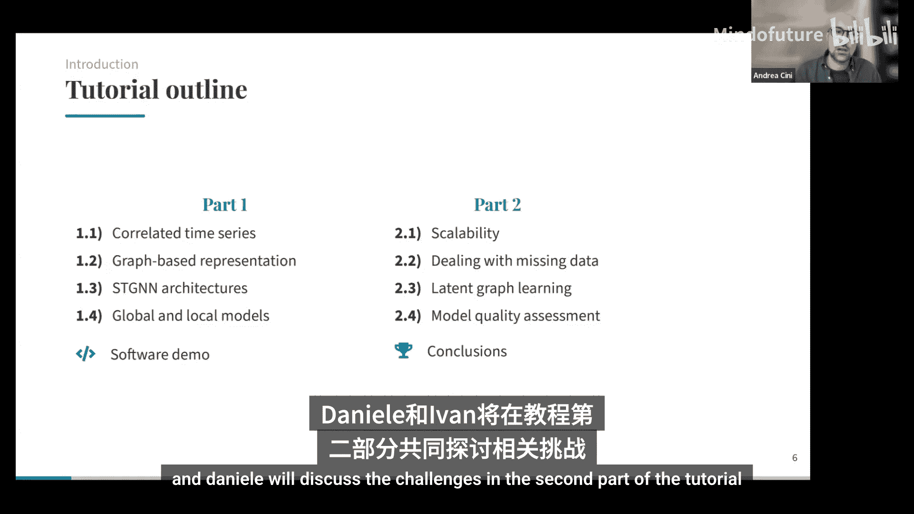

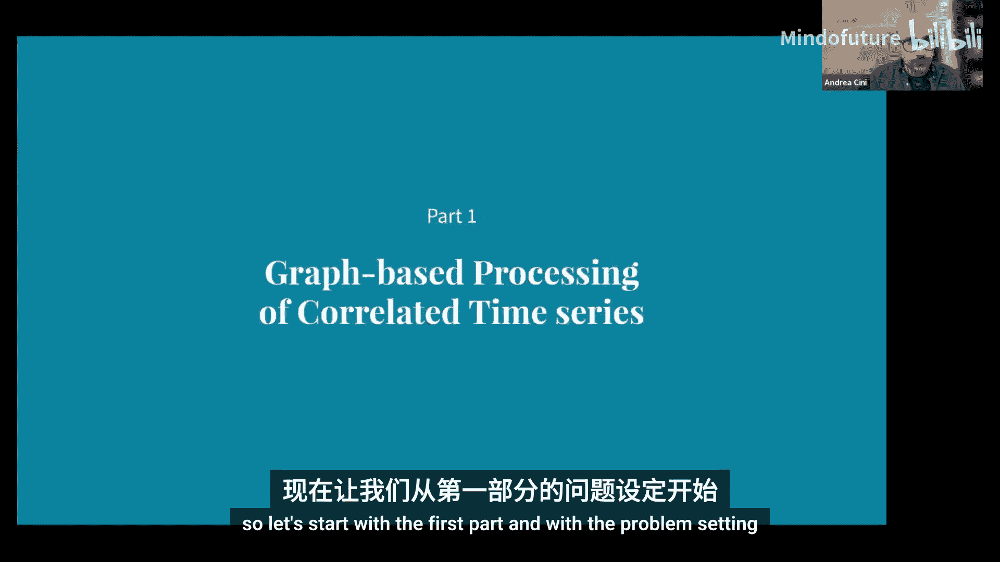

上一节我们概述了教程内容，本节中我们来看看具体的问题设定。

我们假设有一个包含 `n` 个相关时间序列的集合 `D`。每个时间序列可以是多变量的，即每个时间步有多个观测值。除了目标时间序列，我们还可以有协变量，这些协变量可以是动态的，也可以是静态的属性。

我们使用大写字母表示跨时间序列集合的堆叠表示，并将跨越集合的维度称为空间维度。

**什么是相关时间序列？** 我们假设数据是由一个潜在的随机过程生成的，并且时间序列之间存在因果依赖关系。这意味着，通过考虑集合中相关时间序列的观测值，可以使对某个特定时间序列的预测更加准确。

此外，我们假设所有时间序列是同质的，即每个时间序列的观测值具有相同的物理意义，并且观测在时间上是同步且规则的。我们并不假设每个时间序列由相同的过程生成。

虽然这些假设在实践中可能听起来很严格，但通常可以通过适当的预处理步骤来满足，并且可以在教程的第二部分放宽。

**示例：交通监控系统**
交通监控系统是这类场景的经典例子。可以想象有许多传感器分布在交通网络中，每个传感器获取其位置的交通测量值，例如车辆的平均速度或数量。外生变量可以是日期时间信息或天气预报。静态协变量可以包括车道类型或是否存在交通信号灯等信息。在这些场景中，时间序列集合之间存在强烈的依赖关系，这些依赖关系反映了道路网络的结构。

---

## 2：预测任务与模型分类

上一节我们定义了问题，本节中我们来看看核心任务之一：预测。

预测的目标很直接：从一个过去观测值的窗口，我们想要预测未来 `h` 个时间步的观测值。具体来说，我们希望通过学习数据生成过程的参数模型来实现这一点。

在本教程中，我们将重点讨论点预测器，而概率方法也可以考虑。点预测器通常通过最小化衡量预测误差的成本函数来训练。使用不同的成本函数，可以得到不同值的预测。例如，使用均方误差（MSE）可以预测随机过程的均值，而使用平均绝对误差（MAE）可以预测过程的中位数。

现在，在讨论预测架构时，我们需要做出的第一个重要区分是**局部模型**和**全局模型**之间的区别。

**局部模型**是过去几十年来通常用于预测时间序列的模型家族，例如使用像 Box-Jenkins 方法这样的统计方法。这里的想法是，模型的参数特定于你要处理的每个单一时间序列。这种方法的优点是，由于模型是针对特定序列或特定过程定制的，因此可以轻松处理集合中时间序列动态的异质性。缺点是效率低下，包括计算效率低下（因为需要训练许多不同的模型）和样本复杂性方面的效率低下（因为只使用单个时间序列的样本来拟合模型）。

在光谱的另一端，我们有**全局模型**，这是深度学习中通常采用的方法。这里我们有一个在来自不同来源的许多时间序列上训练的单一模型。这类似于如今人们所说的基础模型，但通常范围更有限，例如仅限于来自特定领域的时间序列。这里的优势显然是样本效率，并且这种样本效率允许构建更复杂的架构来处理输入时间序列。

这两种方法在其标准实现中的共同缺点是，它们都忽略了时间序列之间可能存在的依赖关系。

除了我们稍后将讨论的图表示之外，文献中还有一些方法可以处理这个问题。最直接的做法是将输入的时间序列集合视为一个非常大的多变量时间序列，但这显然存在严重的可扩展性问题，因为它会遭受维度灾难，导致样本复杂性高和计算可扩展性差。

我们可以考虑在时间序列集合上操作的模型，同时保持模型的参数在这些时间序列之间共享。基于注意力的架构（如 Transformer）就是这类模型的例子，在这种情况下，注意力是相对于空间维度而非时间轴计算的。这种方法可以工作得很好，但缺点是我们没有利用依赖结构或其稀疏性的任何先验知识。

文献中还使用了其他方法，例如依赖于降维的方法。这里的想法是，我们可以从这个大的时间序列集合中提取一些共享的潜在因子，并使用这些因子来调节全局模型。如果数据在某些应用中具有低秩特性，这种方法可以工作得很好。但缺点是，我们失去了局部细粒度的信息，而图基方法可以很好地捕捉这些信息。当然，在数据集非常大的情况下，这些方法也可能遭受与其他方法相同的可扩展性问题。

---

## 3：基于图的表示与时空图神经网络

上一节我们介绍了预测模型，本节中我们来看看如何使用图来表示和处理时间序列间的依赖关系。

如前所述，其思想是使用一个图来表示时间序列之间的功能依赖关系，并将此图作为我们学习模型的归纳偏置。

我们可以使用邻接矩阵来建模这些依赖关系，邻接矩阵可以是非对称的和动态的，即它可以随时间步变化。除了邻接矩阵，我们还可以有边属性，这些属性本身可以是动态的，并且可以是分类的或数值的。

回到交通示例，图的结构（邻接矩阵）可以从道路网络的结构中提取，并且可以有与边相关联的属性或权重来编码道路距离。在这种情况下，动态拓扑可以帮助考虑交通网络结构的修改。

这是我们在每个时间步可用的所有信息的总结：我们有目标时间序列，以及可以是动态和静态的外生变量，再加上我们刚刚添加到设定中的关系信息。

现在的想法是使用这种关系侧信息来调节我们的预测器（预测架构）。正如我们将看到的，这些关系可以作为一种正则化，使预测相对于每个节点局部化。特别是，这些关系可以用来消除可能因未考虑此结构而产生的虚假相关性。此外，这些方法比标准多变量模型更具可扩展性，因为我们可以保持模型参数在处理的时间序列之间共享。事实上，我们可以使用这类架构来预测和处理相关时间序列的任何子集。

具体来说，为处理这些数据而开发的图神经网络被称为**时空图神经网络**，指的是在这些模型中，传播同时跨越时间和空间发生。我们将特别关注那些基于消息传递框架的模型。

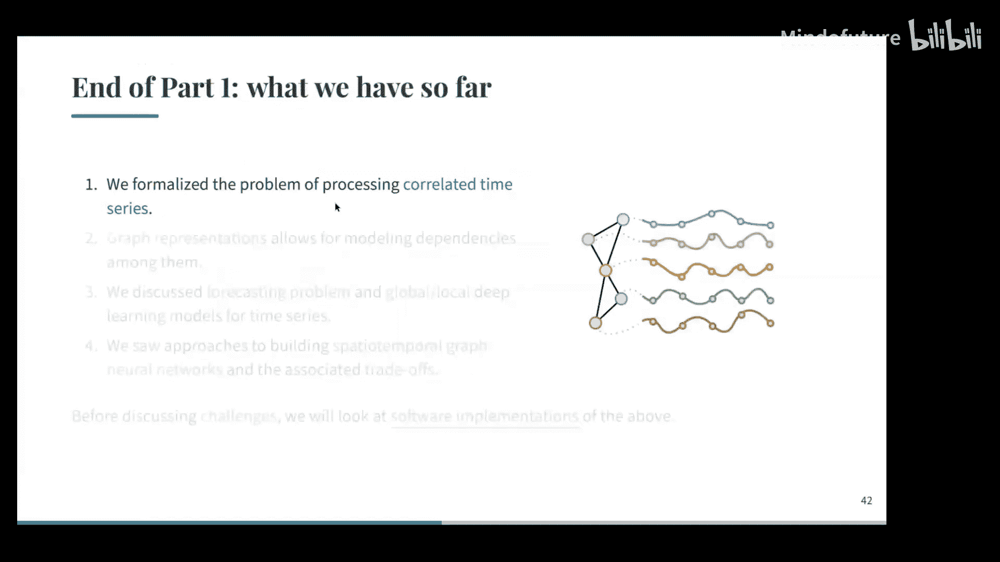

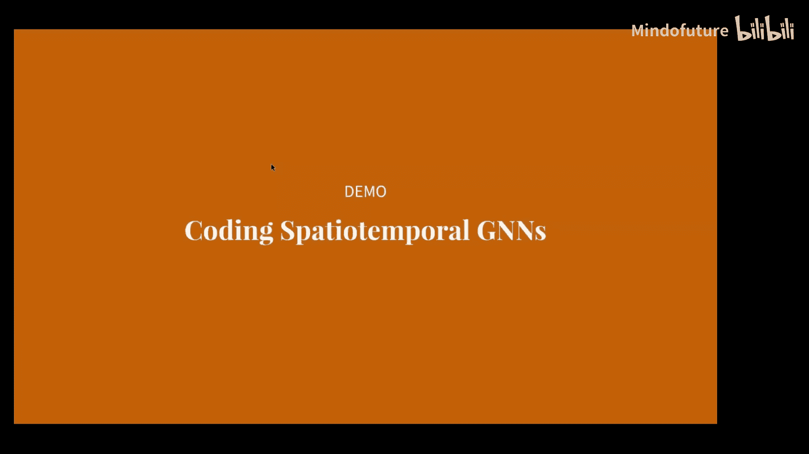

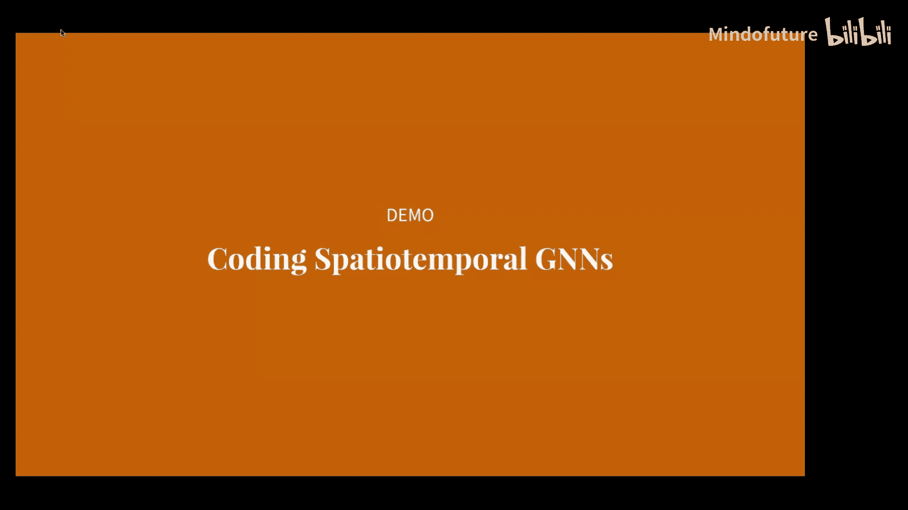

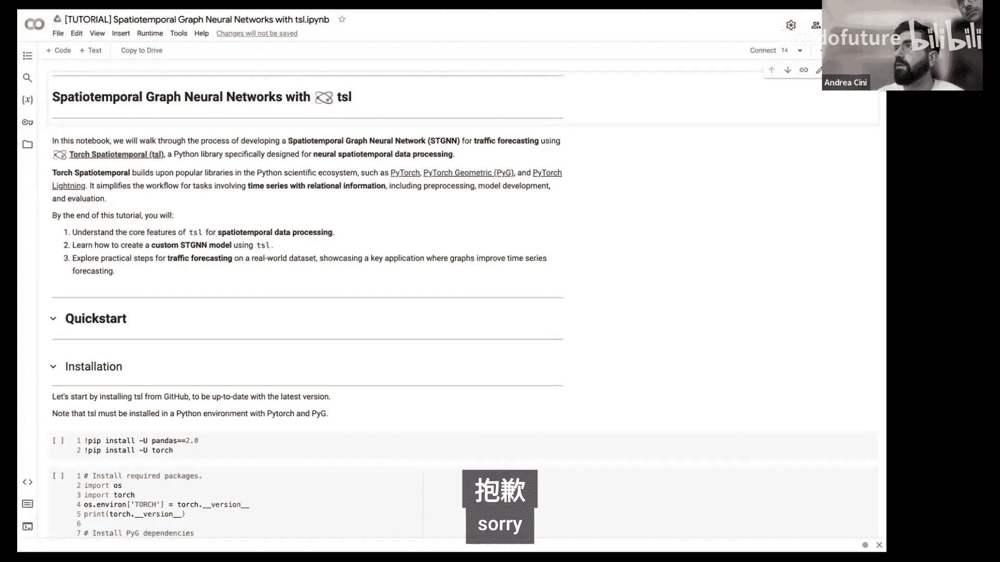

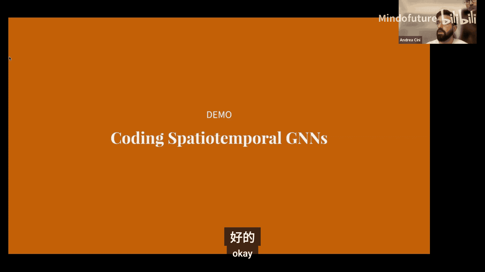

我们将通过考虑这个模板架构来实现，该架构由一个编码器组成，编码器简单地编码每个时间步和每个节点的观测值，然后是一堆时空消息传递层，这是架构中唯一发生跨时间和空间传播的组件。时空消息传递块提取的表示然后可以通过解码块映射到预测。

我们可以查看更精细的细节，处理发生在单个时间步和单个节点的级别（对于编码器而言）。生成的观测序列然后由时空消息传递层处理。解码器再次在单个节点和时间步的级别上运行，将这些表示映射到预测。

然后，时空消息传递块可以有几种实现方式，我们可以将其视为标准消息传递层的泛化，其中不是每个节点有关联的静态表示，而是有关联的表示序列。因此，我们需要做的是修改组成消息传递架构的标准算子，使其能够处理序列。

显然，有许多可能的设计可以做到这一点，并且可以与每个特定应用的要求相匹配。

下一步将是描述这些时空块的可能设计范式，但在继续之前，现在是提问或澄清任何疑问的好时机。

---

## 4：时空块的设计范式

上一节我们介绍了时空图神经网络的基本架构，本节中我们来看看其核心组件——时空块的不同设计范式。

我们可以区分几种设计范式：

1.  **时空融合模型**：在这些模型中，时间和空间的处理不能分解为单独的步骤，它们是联合发生的。
2.  **先时后空模型**：顾名思义，它们将时间和空间维度的处理分解为两个独立的步骤。
3.  **先空后时模型**：这基本上是先时后空模型的逆序。

对于**时空融合模型**，正如前面提到的，表示在时间和空间上的传播方式使得最终模型架构的处理无法分解为独立的阶段。

有几种方法可以实现这些架构。例如，一种标准方法是将消息传递集成到序列建模架构中。另一种方法是直接使用序列建模算子来计算单层内的消息。最后，还有**乘积图表示**，这基本上是从这些时间序列集合中获取静态图表示的一种方式，以便我们可以在其上使用标准消息传递算子。

**乘积图表示**源于一个简单的观察：你可以将时间维度视为一条线图，并以某种方式将其与空间图结合起来。然后，再次使用标准消息传递网络处理得到的表示。例如，你可以考虑一个标准的笛卡尔积，其中每个节点在每个时间步都连接到其邻居和自身在前一个时间步的状态。还有其他连接此图的方法，例如克罗内克积，其思想是将每个节点连接到其在前一个时间步的邻居。你也可以想出许多不同的方法来连接这个图。

然后是**先时后空方法**，这也很容易理解，并且由此产生的模型也很容易构建。其思想是分别将每个序列嵌入到一个向量表示中，然后在得到的图上执行消息传递。这里的优势是这非常容易实现，并且在计算上高效，因为在训练时，你不需要在每个时间步都执行消息传递，而只在最后一步执行。我们也可以使用我们已经知道的所有处理序列和图的算子。这种方法的缺点是，这种两步过程可能会引入非常严重的信息瓶颈，并且可能使我们在图上常见的一些问题（如过度平滑和过度挤压）变得更加严重。此外，由于你只针对单个图表示执行消息传递，这也使得考虑拓扑变化和动态边属性变得更加困难。

然后是**先空后时方法**，这基本上是另一种方式：你在每个时间步分别执行消息传递，然后用序列模型对表示序列进行编码。这些方法在文献中经常使用，但它们仍然存在这种瓶颈和这种分解处理，可能使信息传播更加困难，并且它们不像先时后空模型那样具有计算优势，因为你需要为每个单一时间步计算消息传递。

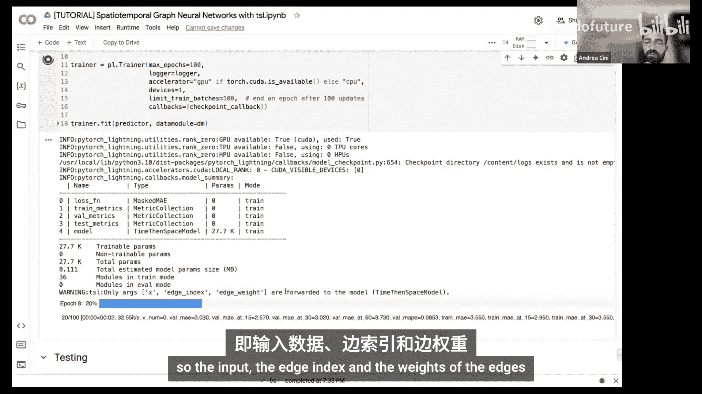

---

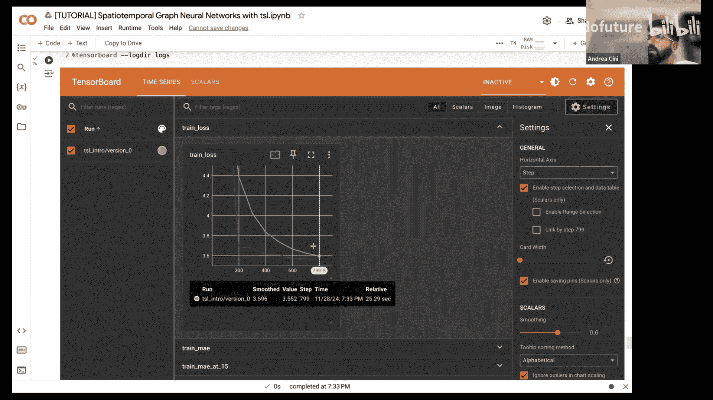

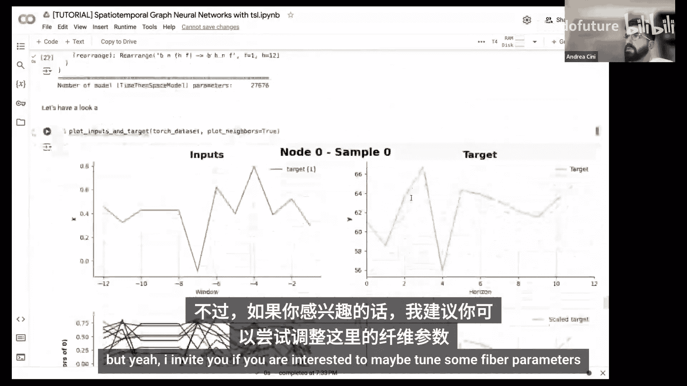

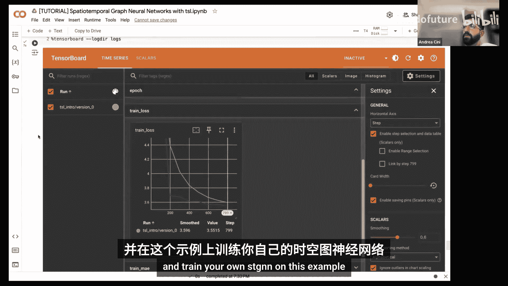

## 5：全局性与局部性及混合架构

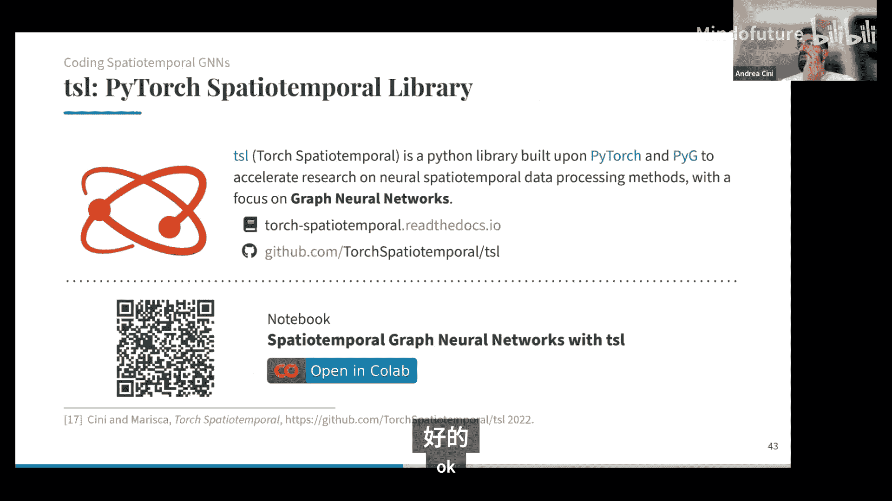

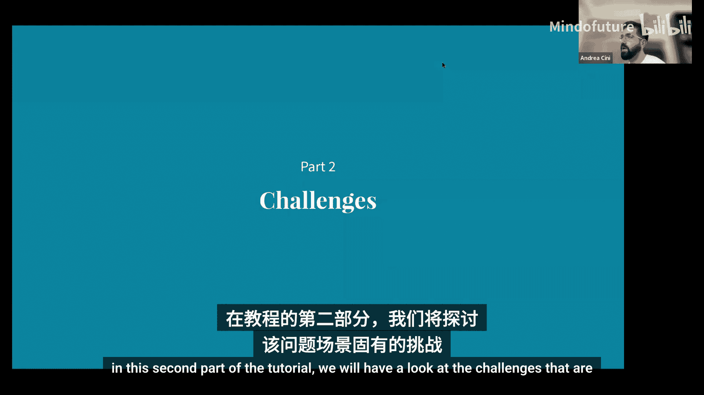

上一节我们讨论了不同的设计范式，本节中我们来看看全局性与局部性在时空图神经网络中的重要作用。

至少在我们讨论的模板实现中，时空图神经网络是全局模型，因此它们可以处理任意的节点集，是归纳模型。它们可以使用依赖结构为预测提供进一步的调节。

然而，这种进一步的调节可能还不够，模型可能在建模时间序列集合中可能存在的所有异质动态方面遇到困难。因此，模型可能需要非常长的观测窗口和非常高的模型容量，以考虑所有这些可能存在的不同异质动态。

文献中遵循的一种解决方法是考虑**混合的全局-局部架构**。

实现混合架构的一种直接方法是，例如，再次查看我们的模板架构，将某些架构组件转变为局部的。例如，你可以使编码器和解码器的参数特定于将在那里处理的时间序列。显然，由此产生的模型将能够更容易地捕捉这些局部效应。你可以将此视为类似于使用骨干模型，并有一些针对你要处理的数据类型进行微调或特定的层。当然，缺点是，如果你想使用这种方法处理许多时间序列，这将导致大量的局部参数，具体取决于这些编码器和解码器块的实现方式。

**节点嵌入**是缓解这种成本的一种方法，节点嵌入只是与每个节点相关联的可学习参数向量。你可以将这种节点嵌入视为一种可学习的位置编码，但它们在这里所做的实际上不是编码节点在图中的位置，而是负责建模每个时间序列的特定特征的局部组件。这些可学习的向量可以被馈送到编码器和解码器中，正如我所说，它们分摊了这些局部时间序列特定处理块的学习，允许保持大部分模型参数共享。显然，我们仍然存在可学习参数数量与我们要处理的时间序列数量成线性比例的缺点。因此，可以考虑一些中间解决方案，例如为时间序列集群学习嵌入，而不是为每个单一序列学习。

这里需要考虑的另一个非常重要的问题是，当我们转向混合架构时，由此产生的模型不再是归纳式的。这听起来像是一个缺点，实际上也是，你肯定会失去一些灵活性，但在实践中，你在迁移学习场景中也获得了一些东西。在那些你可以使用来自目标域的一些数据来微调模型的场景中，拥有混合架构允许保持模型的共享参数（即大部分全局组件）共享，只微调局部部分（在这种情况下，只微调嵌入）。特别是，文献表明，正则化这些节点嵌入可以进一步促进这种迁移学习过程。

---

## 6：软件演示与库介绍

上一节我们探讨了理论架构，本节中我们来看看如何通过软件库实际构建时空图神经网络。

我们将使用我们实验室开发的一个名为 **Torch Spatiotemporal (TSL)** 的开源库。TSL 不仅仅是一个层的集合，它旨在覆盖从数据获取到下游任务的整个流程。它包括加载数据集、应用预处理（如缩放和归一化）、处理缺失数据和不规则性的工具，以及建模和推理的所有部分。

**演示步骤概述：**
1.  **安装与导入**：安装必要的依赖并导入库。
2.  **加载数据**：使用 TSL 加载一个交通数据集（例如 METR-LA），该数据集包含来自洛杉矶 207 个环形检测器的交通速度数据，采样间隔为 5 分钟。
3.  **数据探索**：查看数据集的基本信息、统计数据和协变量（如传感器间距离）。
4.  **图构建**：当没有现成的关系图时，可以从数据中构建图。例如，基于传感器距离使用高斯核计算相似度矩阵，然后通过阈值化、移除自环、归一化等步骤将其转换为稀疏的邻接矩阵（边索引格式）。
5.  **创建时空数据集**：将长时间序列分割成滑动窗口样本，用于模型训练。这涉及定义回看窗口长度、预测范围（horizon）和步长（stride）。
6.  **定义模型**：我们将构建一个自定义的**先时后空**模型。该模型将包括：
    *   **节点嵌入表**：用于捕获每个时间序列的局部特性。
    *   **编码器**：一个简单的特征编码步骤（如线性层或 MLP），应用于每个节点和时间步。
    *   **时间部分**：一个序列模型（如 GRU），用于处理每个节点的时间序列，并取其最后隐藏状态作为该节点的时序表示。
    *   **空间部分**：在图结构上执行消息传递（例如使用扩散卷积），聚合邻居信息。
    *   **解码器**：一个 MLP，将聚合后的节点表示映射到预测值。
7.  **训练与评估**：使用 PyTorch Lightning 框架设置训练循环、验证和测试。我们将使用常见的预测指标（如 MAE、RMSE）来评估模型性能。

这个演示展示了使用 TSL 库构建和训练一个时空图神经网络的完整流程，突出了其易用性和灵活性。

---

## 7：挑战一：可扩展性

上一节我们进行了软件实践，本节中我们来看看应用图深度学习处理时间序列时面临的第一个主要挑战：**可扩展性**。

可扩展性实际上是一个特性，因为使用图，我们可以实现一个单一的归纳模型（全局模型），同时仍然以稀疏的方式调节相关时间序列。我们不会将整个时间序列集合或仅其中一个作为输入给模型，而是使用我们认为对预测目标时间序列最相关的时间序列。这样做，我们将考虑所有其他时间序列的通常操作成本从与时间序列数量成二次方降低到与这些边的数量（即我们发现的依赖关系）成线性关系。

但可扩展性也可能是一个问题，因为数据跨越两个维度：第一个是空间维度（即我们拥有的时间序列数量），另一个是时间维度（即每个时间序列中的时间步数量）。在现实世界的应用中，处理高频时间序列和大规模时间序列并不少见，例如在智慧城市中的交通预测或环境监测，或者在金融领域。

通常的问题是，我们有大量数据，我们希望一起处理它们，特别是当我们想要考虑可能在时间或空间或两者上都存在的长程依赖时。

**时空图神经网络的计算复杂性**
如果我们考虑一个时空融合模型的一般公式，它们通常需要一些逐节点的时间处理，并且还具有通常随时间步数量扩展的空间处理。例如，对于基于图的循环神经网络，在每个时间步，我们执行 L 层消息传递。因此，我们需要执行的消息传递操作次数乘以输入的时间步数。

改进这种可扩展性的第一步是由**先时后空模型**提供的，其中只有时间处理仍然是逐节点的，然后我们只在一个单一的图上执行消息传递（就像我们只有一个时间戳一样）。在这种情况下，我们相对于边和时间步具有加性的计算复杂性，而不是乘性的。正如我们之前所见，先空后时模型并不具备这种优势。

**进一步的解决方案**
当图非常大或存在非常长程的依赖时，这可能还不够。其他可能的解决方案包括：
*   **子图采样**：考虑全网络的子图，例如选择目标节点的子集，然后仅考虑该子集上直到给定阶数的邻域的自我图（ego-graph），然后仅在此子集上进行训练。另一种选择是通过图重连来减少边的数量。这些方法实际上是从静态图社区借鉴的。问题是，如果我们使用非常小的 K，子采样可能会破坏长程依赖；如果我们使用大的 K，我们可能最终得到原始图或类似的东西。另一个缺点是学习信号可能有噪声。
*   **预计算**：将部分计算移到训练之前。例如，SIGN 架构预计算节点邻居的某些表示，然后允许我们将获得的特征像 IID 样本一样采样。扩展到时空设置的扩展是 GraphGPS，其中除了节点特征的预计算外，我们还通过一个状态网络（如深度 RNN）对每个节点的历史进行预编码。然后，我们可以使用给定图移位算子的幂来在图上传播这些编码。这减少了训练步骤的成本，使其独立于窗口长度、节点数或边数。但缺点是，我们现在提取了越来越多的特征，下游网络的输入向量维度比初始时间序列大得多，并且更依赖于超参数选择。
*   **使用粗粒度表示**：在处理的每个步骤中，我们可以降低输入在时间和空间上的分辨率。对于空间，我们可以依赖图池化技术，通过将节点子集关联到新图中的超节点来减小图的大小。这样做可以减少达到与原始图相同感受野所需的操作次数，但也会在信息传播中引入瓶颈。

---

## 8：挑战二：缺失数据处理

上一节我们讨论了可扩展性，本节中我们来看看第二个挑战：**处理缺失数据**。

到目前为止，我们假设处理的是完整的序列，即在每个时间步和每个节点我们都观测到一个有效的观测值。当然，在现实世界的应用中并非如此，由于传感器故障（可能是暂时的或永久的）、时间序列之间的不同步或其他错误，我们通常会有缺失数据。

问题是大多数预测方法不考虑这个问题，它们假设处理的是完整序列。因此，我们需要一种方法来填补这些缺失值，以重建输入中的缺失数据。

**时间序列插补问题**正是估计时间序列中缺失观测值的问题。我们有一个辅助的二元变量掩码 `M`，指示一个值是缺失的还是可用的。最终，我们想要为所有掩码输入为零的值提供一个估计。

**缺失数据类型**：
*   **点缺失**：类似于完全随机缺失的情况，一个点缺失的概率在节点和时间步之间是相同的。
*   **块缺失**：缺失的分布不独立于其他节点或时间步的缺失数据。例如，我们可能有连续缺失值的时间块，或者由于区域中断导致的部分块缺失。

当存在缺失值时，我们需要在优化模型参数时进行一些调整。我们只想在已有的有效观测值上计算损失。例如，MSE 损失然后由掩码加权，以表明我们只考虑问题中真正可用的值。这个损失通常用于带有缺失值的预测，或者当我们在进行插补时计算我们已有的数据的重建损失。有时，为了训练我们的模型或评估我们的模型，我们可能需要注入一些缺失值，然后以这种方式我们获得真实标签。当然，这些数据不能用于模型中以获得插补值。

**深度学习方法**：
*   **自回归模型**：例如 RNN。当我们发现缺失值时，我们使用循环神经网络的预测来插补缺失值。这有效地利用了我们在单个节点上拥有的所有过去信息，如果我们使用双向模型，还可以考虑未来的观测。但如果我们有一个缺失值的时间序列，我们在这里是连续地使用 RNN 的预测来更新、提供该值的预测，因此可能会沿着时间块产生误差累积。另一个缺点是，这种方法难以捕捉数据中可能存在的非线性空间和时间依赖。
*   **利用关系信息**：我们可以使用我们拥有的关系信息来调节模型。例如，GRIN 模型将图处理集成到我们刚刚看到的自回归方法中。消息传递允许我们考虑相关的并发观测。这在给定节点有长序列缺失值，但在相邻节点仍有信息时非常强大。

插补通常作为下游任务（例如预测）的预处理步骤。这通常是必要的，因为预测模型期望完整的序列作为输入。因此，通常的流程是先插补缺失值，然后进行预测。当然，这可能会由于插补中的错误而引入偏差。

另一种用例是使用插补模型代替预测模型。我们可以想象有一个比我们拥有的更长的序列，但充满了缺失值。在这种情况下，我们也可以采用本质上不用于此目的的插补方法。但这当然是一种变通方法，由于缺乏值，性能也可能很差。如果我们使用的方法强烈依赖于值（例如边界），这不是一个好的选择。

**更直接的方法**是避免这种重建步骤，直接处理不规则的观测。在这种情况下，我们做的是拥有一个专门设计用于处理可能不完整值的预测时空图神经网络。这样做的几个好处是：我们现在可以直接学习如何仅利用有效观测，我们不需要插补或携带我们对缺失值的某些估计，并且这是专门为我们手头的下游任务完成的。此外，我们还避免了通常在预处理的插补步骤中带来的计算负担。

除了插补，另一个可以考虑的重要主题是**虚拟传感**，即使用我们模型中的数据来估计不可测量的数据状态的做法。如果我们有一组节点，我们可能想知道在我们数据中没有的给定节点上的相应观测值。在这里，我们可以看到图在做这件事上的力量，因为我们可以利用这些关系依赖来调节估计。这实际上就是我们在某种空间（在这种情况下是传感器空间）中接近的数据上调节估计所做的。由于消息传递的归纳特性，我们可以非常容易地引入新的节点和边。这在虚拟传感作为成本的应用中也很有用。

---

## 9：挑战三：隐图学习

上一节我们讨论了缺失数据，本节中我们来看看第三个挑战：**隐图学习**。

我们目前所看到的一切都依赖于我们确实有一些关系来连接我们的时间序列，但如果这样的信息不可用怎么办？当然，我们可以想象一些场景，我们有多个时间序列，但没有给出任何关系；或者，我们有一些时间序列或一些关系，但我们并不知道所有关系；其他场景也可能是，给我们的信息不可信，因此我们不能假设它们足够可靠，所以我们想从数据中学习它们。事实上，从我们拥有的时间序列中学习关系的能力，使得我们可以将目前所看到的一切也应用到其他场景中。

学习这类关系之所以重要，是因为为了真正依赖图神经网络，我们期望从数据中提取的图在某种意义上是稀疏的，这样我们就可以依赖之前介绍的所有优势，例如低计算量、可扩展性（与边数成线性关系，而不是与节点数成二次方关系）。这在某种程度上也可以作为我们注意力机制的正则化器，这样我们就可以移除或丢弃我们知道或发现与改进预测无关的多个连接，从而只关注最相关的连接。

**隐图学习方法**：
1.  **基于相似性的方法**：计算所有时间序列对之间的某种相似性（例如皮尔逊相关性或格兰杰因果关系），构造一个存储所有这些相似性的矩阵，然后可能应用某种阈值化以获得稀疏图。
2.  **基于图信号处理的方法**：假设图在某种意义上是决定我们可用时间序列实现的基础。这通常依赖于信号平滑性等假设，并通过优化特定损失（如信号的总变差）来尝试恢复决定我们观测的拓扑结构。
3.  **面向任务的隐图学习**：以更集成的方式处理这个问题，我们学习关系的方式使得我们的模型最终在所考虑的任务上表现最佳。我们优化下游任务损失，并且可能希望进行端到端学习。这与之前的方法不同，在之前的方法中，我们基本上先训练模型或学习关系，然后应用它们或与正在优化的模型一起考虑它们。

对于面向任务的隐图学习，我们有两种主要方法：
*   **直接方法**：我们的图被建模为一个实数矩阵 `A ∈ R^(n×n)`，我们试图优化它以最大化下游任务的性能。图 `A` 可以建模为一些边得分参数 `Φ` 的函数 `C`。`Φ` 可以是可学习参数矩阵，也可以是输入数据的函数。函数 `C` 用于强制执行不同类型的结构（例如，通过阈值化获得二元矩阵、K-NN 图、树等）。为了处理参数数量与节点数平方成正比的问题，通常利用因子分解，例如使用源节点和目标节点的嵌入矩阵 `Z_s` 和 `Z_t`，通过乘积或函数来提取参数 `Φ`。
*   **概率方法**：学习一个随机变量 `A`，它根据某个参数化分布 `P_Φ` 分布。通常，这允许 `A` 是离散对象（例如二元矩阵）。关键挑战是在基于梯度的优化中检索到一个稀疏的 `A`。这通常通过**重参数化技巧**或**得分函数梯度**来实现。重参数化技巧允许梯度通过函数 `g` 流向参数 `Φ`，但通常需要连续的松弛，因此在训练期间计算不能是稀疏的。得分函数梯度允许计算保持稀疏，因为 `A` 可以保持离散和稀疏，而梯度部分被转移到对数似然的微分上，但可能会带来梯度方差大的问题。

学习图分布的主要目的通常只是为了从学习过程中获得离散或稀疏的图，但我们拥有的是一个概率模型，因此我们可以查看学习到的边概率，看看它们是否能为我们的应用提供有价值的见解，以实现可解释性和更明智的决策。一个有趣的问题是，由于图是隐变量，在真实数据中我们没有任何关于它们的观测，这使得我们很难评估通过端到端学习过程从数据中提取的边概率是否在任何意义上都是有意义的。我们可以从理论角度研究学习保证，以某种方式绕过这个问题。我们发现，如果我们能够最小化某些损失（这些损失仅在两个分布相同时为零），那么在某些假设下，与隐变量相关的概率分布也需要等于生成观测数据的真实分布。这令人放心，确实以这种方式处理图可以提供有趣且可靠的边概率。

---

## 10：挑战四：模型质量评估与未来方向

上一节我们探讨了隐图学习，本节中我们来看看最后一个挑战：**模型质量评估**，并简要展望未来方向。

我们拥有所有这些模型、原始数据和预测，最后一个问题当然是：我的模型到底有多好？我们的损失已经为我们提供了一个拟合优度的度量，但随着时间序列数量的增长、时间序列长度的增加，以及时间序列之间错综复杂的相互依赖关系，训练过程中产生的单个数字可能有点局限，难以理解发生了什么以及一切是否按预期工作。除了询问我们的模型是否良好之外，我们还希望询问我们的模型是否最优，以及是否存在某些区域或方面（例如时间处理或空间处理）可以从进一步的设计改进中受益。最后，当然，问题是一旦我确定了模型可能需要改进的地方，我需要解决方案或指南来采取行动以实际实现这些改进。

最优性通常取决于你选择的标准，例如优化预测损失（如平均绝对误差），但也不一定如此。

**相关性分析**
研究时间序列之间的相关性是理解我们的预测或我们试图建模的数据中是否存在我们无法从数据中提取的信息的一种方法。具体来说，如果我们看到残差（预测与实际观测之间的差异）之间存在一些依赖关系，这意味着我们的残差中留下了我们的模型无法提取的结构信息。从这个意义上说，我们的模型还有进一步改进的空间，因为数据中存在结构信息。因此，相关性分析在某种意义上独立于我们感兴趣的性能指标类型。当然，它并没有告诉我们我可以改进多少，只是说存在一些相关的数据，所以你可能可以做得更好。但最终，这也是有趣的，因为它不需要进行比较分析。我不需要两个项来说，看这两个，我可以说哪个更好；它在某种意义上是绝对的答案。

到目前为止，大多数研究都集中在序列相关性（沿时间维度的相关性）上，但也有研究空间维度相关性的工作。这里我提出了一种时空方法，同时处理空间和时间。这些工作如下：从我们的数据中，我们在每个时间步都有我们的图和观测值，因此我们可以通过不仅连接空间维度上的边，还连接时间维度上的边来构造这个时空图。通过查看相关的单一统计量（例如残差内积的符号），我们设计了一个非常简单直接的测试，以了解数据中是否还存在一些相关性。这分为两部分，一部分处理偏相关（红色部分），另一部分仅处理时间相关。虽然原则上研究相关性应该查看残差之间所有可能的相关性（节点数和时间数的平方），但这里我们只关注最相关的那些，即更可能导致相关性的所有可能连接。这就是为什么图允许我们设计统计上强大的统计检验，尽管数据维度增长很大。最终，由于我们使用了符号，这使我们得到无分布的统计检验，并且这些检验与节点数量成线性比例。因此，这是一个可以在图级别全局应用的检验，同时考虑空间和时间，可以拆分仅查看空间或时间，但也可以通过查看单个节点或单个时间步甚至更局部化的空间和时间来进入更精细的细节。

**未来方向**
1.  **分层建模**：考虑更高阶的依赖关系，通过创建节点或甚至沿时间维度的层次结构（如池化），允许我们考虑更粗粒度的尺度，同时也能触及数据中更远的信息。
2.  **状态空间模型**：具有本质上是马尔可夫性的内在优势，观测或预测仅从我们系统的当前状态做出，并且该系统在每个时间步从先前状态更新，并且可能由输入图驱动。这解耦了所有三个维度（输入、状态和输出），允许我们拥有具有不同关系的不同类型的图，可以用于分层建模或其他原因，为不同目的使用不同的图。
3.  **归纳学习**：我们的监控环境可能发生多种问题，例如拓扑变化、新节点添加到我们的网络（例如，我们还没有节点嵌入），因此我们需要进行一些调整以将我们的模型应用于这些新设置，甚至将整个模型迁移到新网络。
4.  **基准测试**：需要解决另一个主题。我们有一些大型开放数据集，主要涵盖能源和交通流，这类模型从一开始就是为此设计的，但这当然还不能提供全面的基准测试环境。我们也有一些软件，如 Torch Spatiotemporal，但尚未接近 Open Graph Benchmark 的水平。

---

## 总结
在本教程中，我们一起学习了用于建模时间序列的框架，该框架结合了时间序列的深度学习和图的深度学习。这两种的结合在多个应用中证明是极其富有成果的。这不仅使我们能够提高性能，而且在更精细的层面上，我们有可能共享参数，从而获得更好的训练数据与模型复杂度比率，并且克服了数据中可能存在的所有问题，例如缺失数据或其他不规则性。最后，我们建议将全局-局部模型作为建模此类应用的安全起点。我们讨论了挑战，并希望您对我们的教程论文和 Torch Spatiotemporal 库感兴趣。