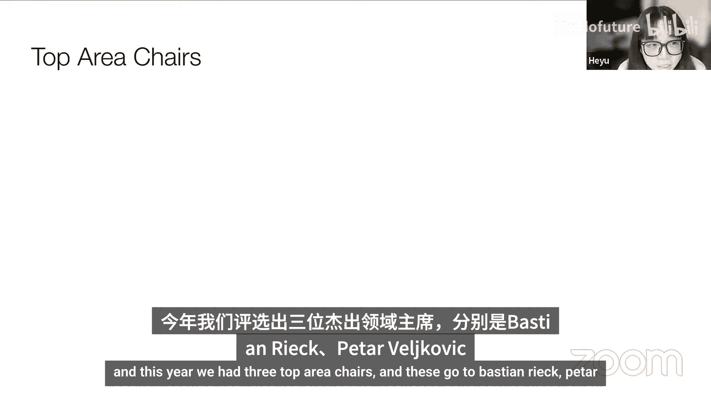
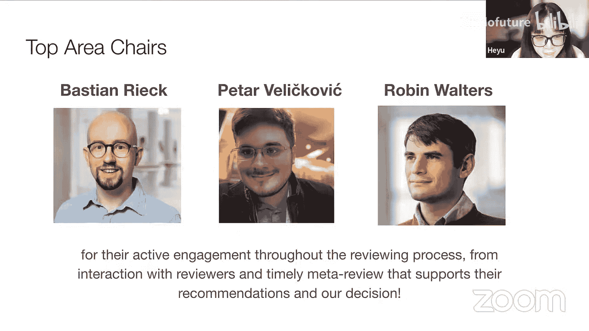
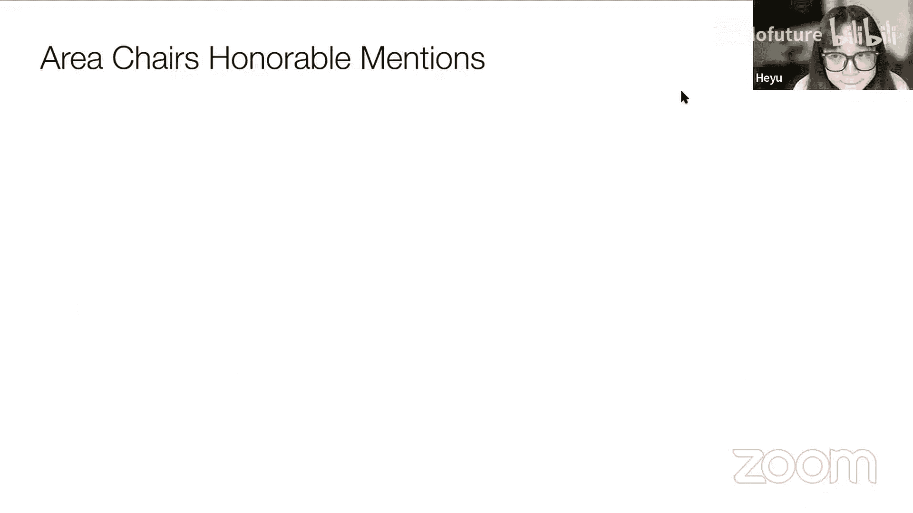
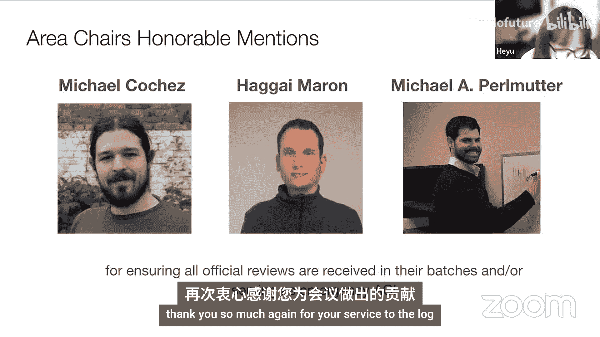
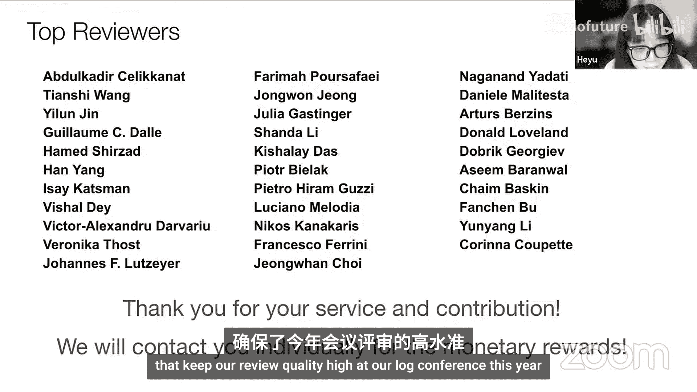
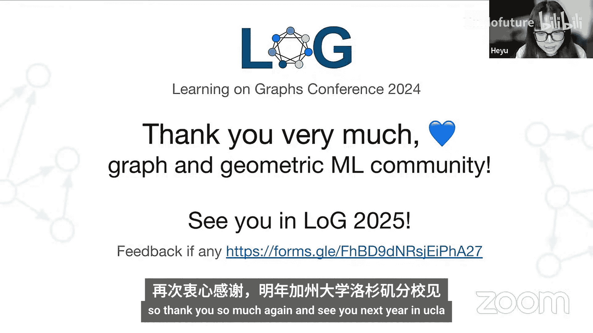

# 图机器学习会议 ｜ Learning On Graphs Conference 2024 p08 P08_Closing_Remarks -BV1k9pAzpE8S_p8-

So this year we had 16 local meetups around the globe。

 some of them have already taken place and some of them will be happening in a few weeks time。

 and we are grateful to all the organizers for the local meetups and we look forward sharing to seeing your photos around the globe as your local meetup。

So this is the third edition of log and we've already had three years of log in the virtual format and we're truly excited to announce that for our log next year it will be the first in-person log conference happening in UCLA Los Angeles in the USA we're really excited about this and the success of log cannot be made possible without everyone participating and contributing to log conference in the past three years we will still be making the virtual format as an option and we will be announcing more details when the time comes and so we look forward to seeing every one of you in Los Angeles next year for our first in-person log conference ever。

😊，So if you really enjoyed log this year and you wanted to contribute to our conference either to become a committee member or reviewer。

 we will be sending out our public calls in the next few weeks so stay put for our public calls for new committee members and reviewers or if you want to submit the paper or host tutorials next year or any kind of feedback we welcome you to fill up the feedback form we will also be sending out the link in the Slack channel。

 any kind of feedback is welcomed and we are committed to constantly improving our log conference over the years。

So here comes the exciting part， I will be announcing the award for the best papers。

 top ACs and top reviewers。So this year we had 194 submissions with 79 posters and out of all of these wonderful papers。

 the best paper goes through。Drum roll， please。Decomposing force fields as flows on graphs reconstructed from stochastic trajectories。

 congratulations to the authors the paper was selected due to its significance by modeling the dynamics of a stationary launch one process as a discrete state remarkable process over a graph representation of the phase space This paper unlocks new applications of graph based learning the authors showcase this by decomposing the dynamics into reversible and irreversible components to study biological systems Congratulations to the authors for this truly remarkable achievement。

We also have a best paper honorable mention， and this goes to。Unravel。

 a neuro symbolbolic framework for answering graph patternss and curiousries in knowledge graphs。

This paper introduces a framework for efficiently answering arbitrary graph pattern queries over incomplete knowledge graphs。

 encompassing both tree like andcyclic queries， which serves as a key advance in neuro symbolic frameworks for answering graph pattern queries in knowledge graph congratulations again to the authors for their wonderful paper。

And our conference cannot be made possible without the contribution and services from our area chs for coordinating between the authors and reviewers and for writing their final recommendations and this year we had three top area chairs and these go to Basing Ri。

 Pear Vi Covich and Robin Walters。

We'd like to thank them for their active engagement throughout the reviewing process interaction with the reviewers and timely matter review that supports their recommendations and our decisions thank you so much for your service。

😊。

We also have three area chairs， honorable mentionsions， and these go to。

Michael Kohi， Haga Marron and Michael Parramat， and we'd like to thank them for ensuring all official reviews are received in their batchs and serving as emergeies AC。

Thank you so much again for your service to the log。😊。

And now here comes to the top reviewers， we'd like to thank all the reviewers of our conference who volunteered to take out their time to read papers。

 write reviews and engage with the authors。And this year， we have。32 top reviewers。

 thank you so much for writing the reviews and contributing to our event and we will contact you individually for the monetary rewards and thank you for your high quality reviews that keep our review quality high at our lab conference this year。

😊。

So here comes to the end of our conference thank you so much again for attending and participating in our conference。

 we'd like to thank everyone from the Graph and Gemetric andL community for making a lot conference possible and we'd like to see you in our law conference next year happening in Los Angeles USA and we welcome any kind of feedback so here's the link for a feedback form and feel free to let us know anything you think about our about our event so thank you so much again and see you next year in UCLA。

😊。

