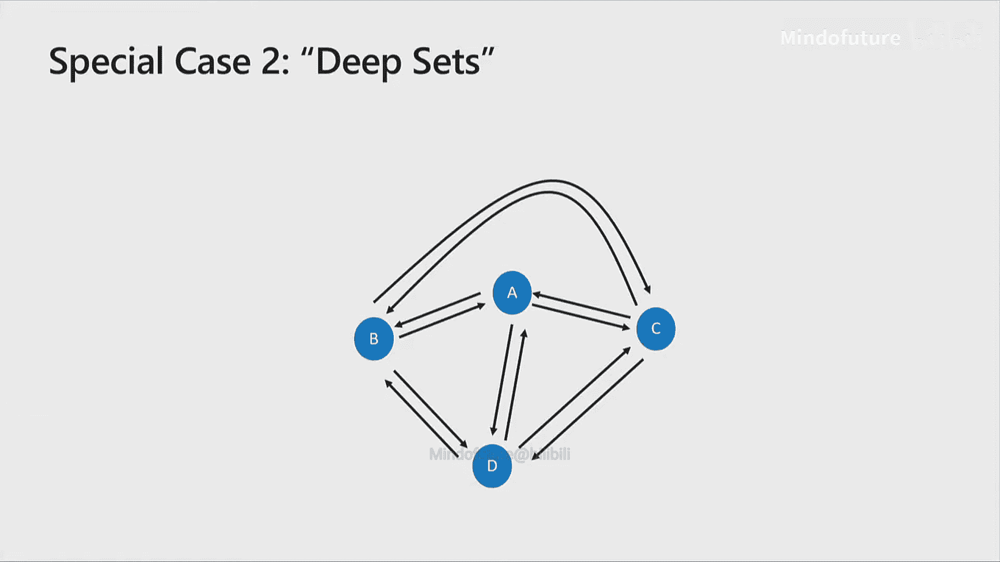
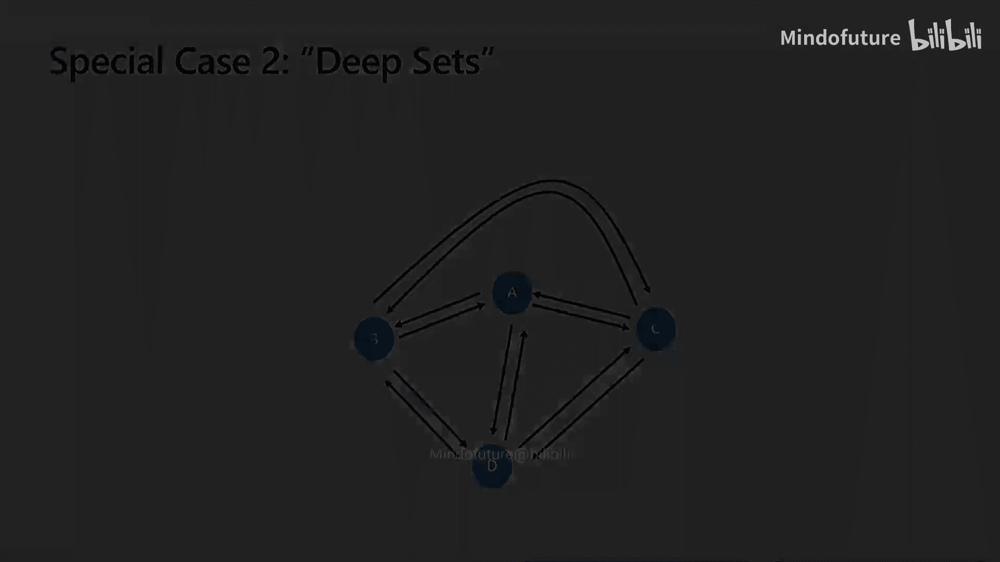

# 001：图神经网络导论-模型与应用

在本节课中，我们将要学习图神经网络的基础知识。我们将从机器学习的宏观背景开始，逐步深入到图神经网络的核心概念、工作原理以及实际应用。课程内容旨在让初学者能够理解并掌握这一领域的基本思想。

## 机器学习背景

上一节我们介绍了课程的整体目标，本节中我们来看看图神经网络所依赖的机器学习基础。

机器学习的目标是设计一个模型，该模型包含可调整的参数。人类负责设计模型的结构，而模型中的参数则通过数据来自动学习。在监督学习中，我们拥有一个数据集，其中每个数据点都包含输入X和对应的输出y。我们的目标是训练一个模型F，使其在给定输入X时，能预测出尽可能接近真实y的输出。

我们通过一个损失函数来衡量预测的好坏。为了最小化损失，常用的一种计算方法是梯度下降法。其核心思想是：在模型尚未收敛时，我们计算损失函数关于参数的梯度估计，然后根据这个梯度方向更新参数，从而逐步降低损失。

我们期望机器学习模型能够泛化到未见过的数据上。这意味着模型既不能过于简单（欠拟合），也不能过于复杂以至于完美拟合训练数据但无法捕捉真实规律（过拟合）。

## 分布式向量表示

在深入图神经网络之前，我们需要理解一个在深度学习中常见的概念：分布式向量表示。

传统的局部表示法（如独热编码）使用一个大部分为零、仅有一个位置为1的高维稀疏向量来表示一个离散对象（如“香蕉”、“芒果”或“狗”）。这种方法的问题在于，它无法体现不同对象之间的关联性。

深度学习模型通常学习的是分布式向量表示。在这种表示中，语义信息被分布到向量的各个分量中。例如，“香蕉”和“芒果”的向量可能在代表“黄色”的分量上相似，而与“狗”的向量不同。

以下是学习这种表示的一种常见方式：
```python
# 假设 one_hot 是一个 V 维的独热向量，E 是嵌入矩阵（参数）
distributed_vector = torch.matmul(one_hot, E)  # 形状: (1, D)
```
其中，V是词汇表大小，D是嵌入向量的维度（通常远小于V，如128或500）。嵌入矩阵E就是模型需要学习的参数。像Word2Vec这样的技术就是学习此类分布式向量表示的例子。

## 图的基本概念

在介绍图神经网络之前，我们先简要回顾图的基本概念。

图由节点（或称顶点）和边组成。边可以是有向的或无向的，也可以有不同的类型（图中常用不同颜色表示）。图的核心思想是：节点代表实体，边则编码了实体之间的关系。图可以用来表示社交网络、分子结构、程序代码等多种复杂系统。

## 图神经网络核心思想

上一节我们了解了图和分布式表示，本节中我们来看看图神经网络是如何将两者结合的。

图神经网络的核心思想如下：
1.  **问题建模为图**：首先，你需要将你关心的问题建模成一个图结构。这是一个由人类做出的建模决策。这个图可以是社交网络、分子、程序或任何你能用节点和边表示的事物。
2.  **节点初始化**：图中的每个节点都需要一个初始的信息表示。这个信息被编码为一个分布式向量（也称为嵌入）。这个向量可以从节点的原始特征计算得来（例如，通过卷积网络处理图像，或直接使用词嵌入）。
3.  **GNN处理**：图神经网络接收这个带节点特征的图作为输入，经过计算，输出一个具有相同结构的图。但是，输出图中每个节点的向量表示已经包含了该节点在其图上下文中的信息。它不仅包含节点自身的初始特征，还聚合了其邻居节点以及图结构的信息。
4.  **任务特定处理**：最后，你可以利用GNN输出的节点表示，根据具体任务（如节点分类、图分类、链接预测等）进行进一步处理，例如输入到一个分类器或回归器中。

在这个过程中，人类设计的部分主要是图的结构以及如何为节点获取初始特征。模型需要学习的大部分参数存在于GNN内部以及后续的任务特定层中。

## 图神经网络的工作原理

现在，让我们深入图神经网络内部的“黑盒”，看看信息是如何在图中传播和更新的。

考虑一个简单例子，节点F与节点E和D通过不同类型的边相连。在某一时刻t-1，每个节点（包括E、D、F）都有一个状态向量 `h`。

GNN的更新过程通常遵循“消息传递”框架，分为三步：
1.  **生成消息**：对于节点F的每个邻居（如E和D），根据该邻居节点的状态、连接边的类型以及当前节点F自身的状态（取决于具体模型），通过一个函数计算一条“消息”。该函数通常包含可学习的参数。
    > 消息 `m_{e->f} = M(h_e^{t-1}, h_f^{t-1}, edge_type)`
2.  **聚合消息**：节点F将所有从邻居收到的消息聚合起来。聚合操作必须是置换不变的（即不依赖于邻居节点的顺序），例如求和、求平均或取最大值。
    > 聚合消息 `a_f^t = AGGREGATE({m_{k->f} for k in neighbors(f)})`
3.  **更新状态**：节点F结合其自身上一时刻的状态 `h_f^{t-1}` 和聚合后的消息 `a_f^t`，通过一个更新函数（如一个神经网络）来生成新的状态 `h_f^t`。
    > 新状态 `h_f^t = UPDATE(h_f^{t-1}, a_f^t)`

这个过程在所有节点上**同步并行**进行。整个网络会按时间步展开，重复上述消息传递过程多次（例如10次）。每经过一个时间步，每个节点就能接收到来自更远一层邻居的信息。因此，重复的次数决定了每个节点所能感知的图的“范围”或“感受野”。

## 具体架构示例

消息传递框架是通用的，具体实现有不同的变体。以下是两个经典的图神经网络架构。

**门控图神经网络**：
这种架构使用一个循环神经网络单元（如GRU）来更新节点状态。
*   **消息生成**：消息通常仅依赖于发送节点和边类型。`m = E_k * h_sender`，其中 `E_k` 是对应边类型k的可学习矩阵。
*   **消息聚合**：通常使用求和。
*   **状态更新**：使用GRU单元，将聚合消息和上一时刻状态作为输入，输出新状态。`h_new = GRU(h_old, aggregated_messages)`

**图卷积网络**：
这种架构的更新方式类似于卷积操作。
*   **消息生成与聚合**：通常合并为一步，即对邻居状态求和（或平均）。
*   **状态更新**：将聚合后的邻居信息与自身信息结合，并通过一个可学习的权重矩阵变换。公式近似为：`h_new = σ( W * (h_self + ∑ h_neighbor) )`，其中σ是激活函数。

## 实现技巧与代码视角

在实际实现中，我们通常利用矩阵运算来高效处理整个图。

一个关键技巧是使用**邻接矩阵**。对于一个有N个节点的图，邻接矩阵A是一个N×N的矩阵，如果节点i到节点j有边，则 `A[i,j]=1`，否则为0。对于多种边类型，我们有多个邻接矩阵 `A_k`。

消息传递过程可以向量化表示：
1.  所有节点的状态堆叠成矩阵 `H` (形状: N × D)。
2.  对于每种边类型k，计算发送的消息：`M_k = H * E_k` (E_k 是 D × D 矩阵)。
3.  利用邻接矩阵收集消息：`R_k = A_k * M_k`。
4.  聚合所有边类型的消息：`R = ∑ R_k`。
5.  更新状态：`H_new = UPDATE(H_old, R)`。

这可以通过类似爱因斯坦求和约定的符号清晰表达，并在深度学习框架中高效实现。

另一个重要技巧是添加**反向边**。在有些图（尤其是有向图）中，信息可能无法有效传播到所有节点。例如，一个只有出边没有入边的节点，无法接收来自图其他部分的信息。为了解决这个问题，通常为每条有向边显式地添加一条反向边，确保信息能在图中双向流动。

## 应用实例

理论需要结合实际，本节中我们通过两个例子看看GNN如何解决实际问题。

**分子属性预测**：
在化学领域，分子可以很自然地表示为图：原子是节点，化学键是边。节点特征可以是原子类型（碳、氧等），边特征可以是键类型（单键、双键等）。我们可以使用GNN来处理分子图，最终输出整个图或特定原子的表示，用于预测分子的性质（如溶解度、毒性等）。

**程序漏洞检测**：
在软件工程中，我们可以将源代码转换为图。节点可以代表代码元素（变量、字面量、操作符等），边可以代表各种关系（语法结构、数据流、控制流等）。例如，要检测“变量误用”漏洞（本应使用变量A却错误使用了变量B），我们可以构建包含漏洞位置的程序图，并使用GNN学习代码元素的表示。通过对比漏洞位置节点与候选变量节点的表示相似度，即可判断是否存在错误。

## 与经典模型的联系

理解GNN与一些经典模型的关系，能帮助我们更好地定位其能力。

*   **卷积神经网络是GNN的特例**：如果将图像像素视为网格图上的节点，并为每个像素定义“上、下、左、右”等类型的边，那么特定的GNN架构（如图卷积网络）在规则网格上的操作等价于传统的卷积操作。
*   **Deep Sets 是GNN的特例**：如果我们有一个无序集合，可以将其建模为一个全连接图（每个节点都与其他所有节点相连）。在此图上应用GNN，并对所有节点的输出表示进行聚合（如求和），就构成了处理集合数据的Deep Sets方法。Transformer模型中的自注意力机制也可以从这个角度理解。

## 实践建议与总结

最后，我们简要讨论一下机器学习项目的一般流程和调试技巧。

一个典型的深度学习项目流程包括：
1.  **数据分析与元数据提取**：从数据中提取关键信息（如词汇表、边类型数量等），用于指导模型构建。
2.  **数据转换为张量**：将原始数据（文本、图结构等）转换为数值张量。
3.  **构建小批量**：将张量组织成小批量，以利用GPU并行计算。
4.  **模型训练与优化**：将小批量数据输入模型，计算损失，通过反向传播计算梯度并更新模型参数。

调试深度学习模型颇具挑战，以下是一些常用策略：
*   在极小数据集上尝试过拟合，如果模型无法学习，则可能存在bug。
*   使用构造的合成数据测试模型，验证其能否解决已知的简单问题。
*   监控学习曲线，观察训练和验证损失的变化趋势是否正常。
*   检查梯度流，确保没有梯度消失或爆炸的问题。
*   进行错误分析，仔细检查模型预测错误的案例，寻找规律。





本节课中我们一起学习了图神经网络的基础知识。我们从机器学习的基本概念出发，介绍了分布式向量表示和图的基本定义。然后，我们深入探讨了图神经网络的核心思想——消息传递框架，并了解了GGNN和GCN两种具体架构。我们还从矩阵运算的角度理解了其实现，并探讨了添加反向边等实用技巧。通过分子属性预测和程序漏洞检测两个实例，我们看到了GNN的应用潜力。最后，我们指出了GNN与CNN、Deep Sets等模型的联系，并提供了一些实践建议。希望本教程能帮助你建立起对图神经网络的初步理解。