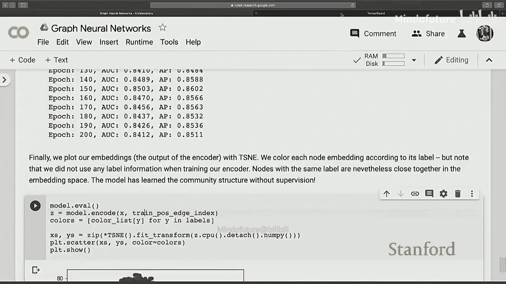

# 002：使用PyTorch Geometric的图神经网络(GNN)

在本节课中，我们将学习如何使用PyTorch和PyTorch Geometric库来构建和训练图神经网络模型。课程将从基础的PyTorch机器学习流程开始，逐步深入到图神经网络的实现与应用。

## 概述：PyTorch基础与机器学习流程

首先，我们将简要介绍如何使用PyTorch构建基础的机器学习流程。我们将从一个简单的图像分类任务开始，这是机器学习中大家应该都熟悉的例子。

我们将主要使用以下PyTorch包：
*   `torch.nn` (简称 `nn`)：包含神经网络模块。
*   `torch.nn.functional` (简称 `F`)：包含与神经网络操作相关的函数定义。
*   `torch.optim`：用于模型优化。
*   `sklearn.metrics`：用于模型评估。

---

### 数据加载与Dataset概念

在开始训练之前，需要理解`Dataset`的概念。`Dataset`是PyTorch用于存储和提供模型输入数据的数据结构。

以下是加载数据的示例。`Dataset`继承自一个可迭代的抽象数据格式。构建自定义数据集时，主要需要实现`__len__`方法（返回数据集长度）和`__getitem__`方法（用于索引获取特定数据样本）。

例如，可以打印数据集的长度，或者索引获取第10个样本。但在实践中，我们通常进行小批量训练，即每次迭代处理多个样本。`DataLoader`可以帮助我们实现这一点。

---

### 构建模型

构造好数据后，接下来是构建模型。PyTorch中的模型通常继承自`nn.Module`类。这个父类提供了许多便利功能，例如优化的简易接口、推理和训练的简易接口。

一个模型主要需要实现两个函数：
1.  `__init__`：初始化函数，用于定义模型中所有可训练的参数。
2.  `forward`：前向传播函数，定义了从输入到输出的计算图。

例如，在一个简单的卷积神经网络中，我们可能在`__init__`中定义卷积层和线性层。`forward`函数则接收输入张量`x`，并通过定义好的层构建计算图。

在`forward`函数中，我们可能会使用`view`函数来改变张量的形状（例如展平操作），这比直接使用`flatten`操作更高效，因为它只提供了张量的不同视图而不实际改变内存中的数据。

最后，模型输出10个类别的分数（logits），然后通过softmax函数将其转换为概率分布。softmax公式如下：

\[
P(class=i) = \frac{e^{z_i}}{\sum_{j} e^{z_j}}
\]

其中 \( z \) 是模型输出的logits向量。之后，我们可以使用交叉熵损失来计算损失。

---

### 模型训练与优化

定义好模型后，就可以开始训练了。首先，我们需要将数据转移到GPU上（如果可用）以加速计算。我们可以使用`torch.cuda.is_available()`检查GPU，并使用`.to(device)`将张量或模型转移到指定设备。

接着，我们定义损失函数（如交叉熵损失）和优化器（如Adam）。优化器接收模型的参数列表，这些参数可以通过`model.parameters()`获取。

训练循环的基本步骤如下：
1.  遍历设定的轮数（epoch）。
2.  在每个epoch中，枚举`DataLoader`以获取小批量数据。
3.  将数据和标签转移到GPU。
4.  将数据输入模型，得到预测。
5.  计算预测与真实标签之间的损失。
6.  在反向传播前，调用`optimizer.zero_grad()`将模型参数的梯度清零，这是为了防止梯度累积。
7.  调用`loss.backward()`计算所有参数的梯度。
8.  调用`optimizer.step()`，优化器根据计算出的梯度更新参数。

需要注意的是，只有被定义为`self.`的属性（例如`self.layer1 = nn.Linear(...)`）才会被包含在`model.parameters()`中。如果参数被放在Python列表里，则需要使用`nn.ModuleList`来包装，才能被优化器识别和优化。

---

### 模型评估

训练完成后，需要在测试集上评估模型性能。评估指标（如准确率、精确率、召回率）不需要是可微分的。

评估过程与训练类似，我们遍历测试集的`DataLoader`，用模型进行预测。然后，选取预测概率最高的类别作为最终预测。我们可以使用`sklearn.metrics`中的函数（如`accuracy_score`, `precision_score`）方便地进行评估。注意，需要将GPU上的张量通过`.cpu().numpy()`转换回NumPy数组以供scikit-learn使用。

损失函数和优化器之间的联系在于梯度。`loss.backward()`计算的是损失相对于模型所有参数的梯度。优化器则持有这些参数的引用，在`optimizer.step()`中，它查看每个参数的`.grad`属性，并根据优化算法（如SGD）更新参数值。

---

## 过渡到图神经网络

上一节我们介绍了使用PyTorch进行传统机器学习任务的基本流程。本节中，我们将重点转向图神经网络，并使用PyTorch Geometric库来简化实现。

PyTorch Geometric是众多图神经网络库中的一种，它易于使用。当然，你也可以使用其他库（如Google的GraphNets，Amazon的DGL）或从头开始实现。

---

### PyTorch Geometric简介与模型定义

首先，我们需要安装并导入必要的库，包括`torch_geometric.nn`（图神经网络模块）和`torch_geometric.utils`（图效用函数）。我们还会用到`networkx`进行可视化，`tensorboardX`来跟踪训练过程，以及`sklearn.manifold.TSNE`用于嵌入可视化。

让我们从如何为图卷积编写一个通用模型开始。假设我们使用PyTorch Geometric已定义好的卷积操作。

模型依然继承自`nn.Module`。在`__init__`中，我们使用`nn.ModuleList`来存放所有的图卷积层。例如，我们可能有一个从输入维度到隐藏维度的卷积层，以及两个从隐藏维度到隐藏维度的卷积层。之后，我们可能还会定义一个`nn.Sequential`模块，包含线性层和Dropout层，用于在消息传递后进行进一步处理。

`forward`函数接收一个`data`对象，它是数据集中的一个元素。`data`通常包含：
*   `x`：节点特征矩阵，形状为`[num_nodes, num_features]`。
*   `edge_index`：图的边索引，可以看作邻接表的稀疏表示，形状为`[2, num_edges]`。
*   `batch`：用于图分类的批处理向量，指示每个节点属于哪个图。对于节点分类任务（通常只有一个图），`batch`可能全是0。

在前向传播中，我们循环执行卷积层列表中的每一层。每一层卷积后，我们通常会应用ReLU激活函数和Dropout。Dropout在训练和测试时的行为不同，需要通过`model.train()`和`model.eval()`来设置模式。

如果是图分类任务，在卷积层之后需要对所有节点的嵌入进行池化（例如全局平均池化），得到一个图的整体表示，然后再通过`post_mp`（即之前定义的`nn.Sequential`）进行处理。

最后，模型返回log_softmax后的结果以及中间嵌入（用于后续可视化）。损失函数可以使用负对数似然损失。

---

### 实现自定义图卷积层

PyTorch Geometric中的卷积层（如`GCNConv`）都继承自`MessagePassing`基类。如果我们想实现自定义的卷积层，也需要继承这个类。

在自定义层的`__init__`中，我们首先调用`super().__init__()`，并指定聚合方式（如`aggr=‘add‘`）。然后，我们定义该层所需的可训练参数，例如线性层。

在`forward`函数中，我们接收节点特征`x`和边索引`edge_index`。我们可能需要对图添加自循环（`add_self_loops`）或移除自循环（`remove_self_loops`）。然后，我们调用`self.propagate`函数，它会根据`edge_index`定义的邻接关系进行消息传递。

`propagate`函数内部会调用`message`函数来计算每条边上要传递的消息。默认情况下，`message`函数接收邻居节点的特征`x_j`。我们也可以让它接收中心节点特征`x_i`，从而定义更复杂的消息函数。消息聚合后，还可以通过`update`函数对聚合结果进行进一步变换。

定义好自定义层后，就可以在之前的通用模型里用它替换标准的`GCNConv`。

模型的深度（即消息传递的跳数）由`nn.ModuleList`中卷积层的数量决定。在`forward`函数的循环中，每一层的输出作为下一层的输入，从而实现多跳邻域信息的聚合。

---

### 训练循环与可视化

图神经网络的训练循环与之前PyTorch的例子非常相似。

对于节点分类任务，数据集中通常只有一个大图。我们通过掩码（`mask`）来划分训练、验证和测试节点。`data.train_mask`指示了训练阶段使用的节点。在计算损失时，只考虑这些被掩码标记的节点。

对于图分类任务，我们通常拥有许多独立的图，直接按图划分数据集即可。

在训练循环中，我们同样需要：
1.  清零梯度（`optimizer.zero_grad()`）。
2.  前向传播得到预测和损失。
3.  反向传播（`loss.backward()`）。
4.  优化器步进（`optimizer.step()`）。

我们可以使用`tensorboardX`来记录训练过程中的损失和准确率等标量信息，方便可视化监控。

训练完成后，我们可以可视化学习到的节点嵌入。使用`TSNE`将高维嵌入降维到2维，然后用散点图绘制出来，节点的颜色代表其真实类别。通过观察同类节点是否在嵌入空间中聚集在一起，可以直观感受模型的学习效果。需要注意的是，降维本身会损失信息，因此可视化主要用于不同模型间的比较分析。

---

### 扩展应用：链接预测

最后，我们简要介绍链接预测任务，例如知识图谱补全。这通常使用图自编码器架构。

编码器（`Encoder`）部分使用图卷积网络来获取所有节点的嵌入。解码器（`Decoder`）部分则很简单，例如使用内积来预测两个节点间存在链接的可能性。如果内积接近1，则认为很可能存在边。

训练时，我们需要正样本（图中存在的边）和负样本（图中不存在的边）。PyTorch Geometric提供了`train_test_split_edges`这样的函数来帮助构建正负样本。

训练和评估流程与之前类似，评估指标通常使用AUC或平均精确度。

---

## 总结

本节课中，我们一起学习了如何使用PyTorch和PyTorch Geometric库。我们从PyTorch的基础机器学习流程开始，涵盖了数据加载、模型构建、训练与评估。接着，我们深入探讨了图神经网络，学习了如何定义GNN模型、实现自定义的消息传递层，以及针对节点分类和图分类任务的训练流程。我们还介绍了如何使用TensorBoard进行训练监控和如何可视化节点嵌入。最后，我们简要了解了链接预测任务及其实现。希望本教程能帮助你入门图神经网络的实际编程。