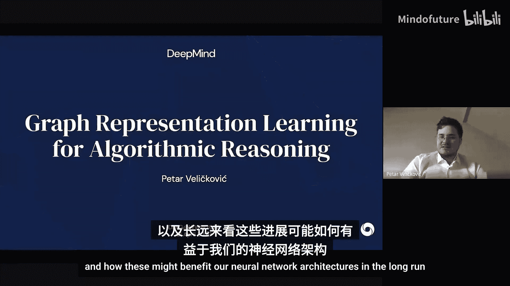
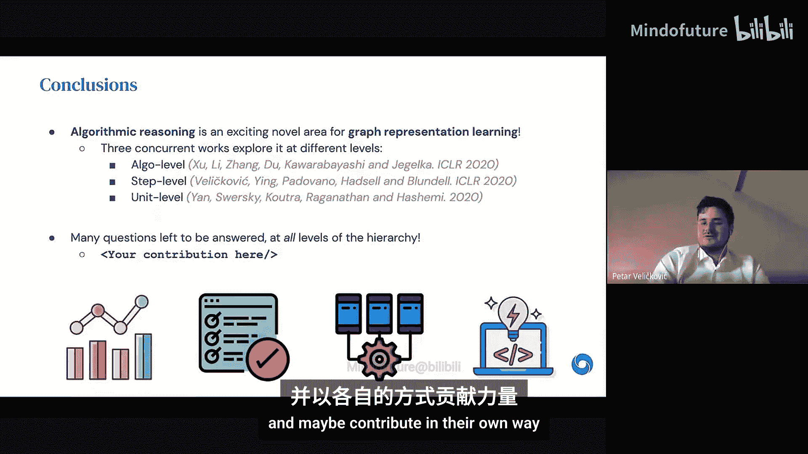
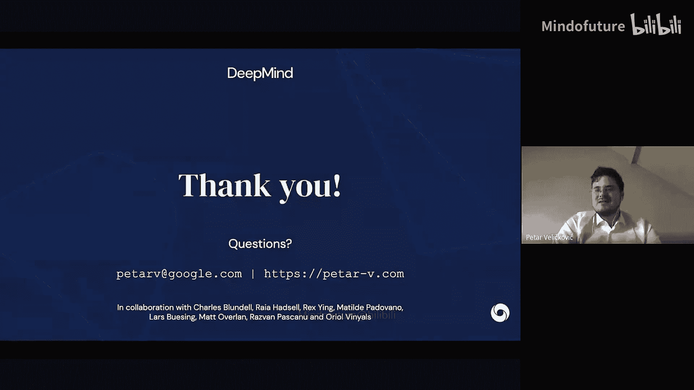

# 003：用于算法推理的图表示学习

在本节课中，我们将要学习如何利用图表示学习的最新进展，来支持和增强算法推理类型的任务，并探讨这些方法如何从长远上使我们的神经网络架构受益。

## 概述：两种问题解决路径

当我们思考解决问题的方法时，通常可以将其划分为两个方向。一方面，我们有严谨、硬编码的方式来处理特定问题，它明确考虑了问题中的一些不变性，并在不同的输入范围内以相同方式工作。这通常可以归类在经典算法的范畴内。另一方面，我们有机器学习，它基于原始数据的特性，动态地学习适应从原始输入到输出的具体映射，而不必深入探究任务的具体细节。在这里，我将神经网络作为机器学习的代表，因为如今神经网络几乎被用来增强机器学习方法的各个方面。

这两种方法在优缺点上似乎截然不同。神经网络的优势在于可以直接处理原始数据，这意味着我们不必在将数据输入模型之前进行特定的预处理。它们在泛化到噪声条件时表现良好，并且我们创建的特定神经网络模型通常可以在不同任务间复用。例如，一个好的卷积网络架构在某种图像分类任务上有效，我们通常可以在尝试完全不同的图像分类任务时复用许多类似的想法。

神经网络的缺点在于，它们通常需要大数据才能正确泛化，并且在推断时变得相当不可靠，即使只是稍微超出训练数据分布，尤其是在输入规模大于训练数据时。此外，一旦你有了一个表现顶尖的神经网络，通常很难推理它为何做出某个决策，因此可解释性也是神经网络的一大问题。

经典算法则似乎处于光谱的另一端。一旦你编写了一个算法，它通常能轻易地强泛化。如果你输入一个比你构思算法时检查的输入大两三倍的输入，算法也能无缝工作。这与算法具有非常可解释的逐步操作有关，你通常可以通过严谨的理论或形式化验证方法来证明或保证其正确性或一定的近似比。算法的另一个优点是它们具有组合性，你可以从“菜谱”中选取一堆预先准备好的子程序来构建算法，并基于先前算法的部分来组装新的算法。

因此，在某种程度上，算法支持了许多神经网络倾向于挣扎的方面。但另一方面，为了使算法对你的问题有效，你必须能够将问题的输入转换为算法所需的规范和前决条件，否则算法会做什么完全是未知的。如果任务变化很大，例如要求识别与原始算法设计完全不同的东西，通常你必须从头开始，重新发明一个全新的算法，从而失去了特定结构在不同类型任务间的可复用性。

可以看到，这两种方法的优缺点似乎能很好地互补。因此，如果我们能以某种方式取两者之长，避两者之短，我们可能就在创造强大的通用学习者的道路上迈出了一大步。

已有相当多的工作利用神经网络来增强算法，通常是使用神经网络作为算法内部的某种预言机或启发式方法。但在本次讲座中，我将主要关注另一个方向，即我们能在多大程度上复用经典算法中存在的思想或流程，并用它们来增强神经网络所做的决策。这个方向最近受到了相当多的关注。

## 核心问题：神经网络能像算法一样稳健推理吗？

因此，本次讲座寻求回答的主要问题是：神经网络能否像算法一样稳健地推理？我们能否将算法推理的某些方面融入神经网络？

观察算法的一般行为：你给它们一组有序或无序的对象，以及它们之间可能存在的关系。然后，算法对这些对象进行一系列操作，并计算出你关心的最终结果。由于涉及对象和关系，算法基本上是在输入的某些部分指定的某种图上进行操作。这意味着图神经网络可能非常相关且适用。

我们将要做的是，利用具有消息传递机制的图神经网络来监督执行算法计算。这里给出一个高层次示例：在无权图中计算最短路径的广度优先搜索算法。最初，我们有一个标记距离为0的源顶点，所有其他顶点的距离未定义（无穷大）。然后，我们监督一个图神经网络，该网络在潜在空间中执行迭代的消息传递步骤，每个节点接收并与邻居交换特征。结果，在输出层，我们应该得到每个顶点到源的距离，以及最短路径树的重构。这种使用图神经网络直接从原始输入建模算法输出的一般方法，我称之为**神经图算法执行**，这也是本文将探讨的工作的核心主题。

## 为何要进行神经算法执行？

我经常被问到：为什么要这样做？如果你要建模经典算法的输出，尤其是多项式时间算法，为什么不直接执行算法，而需要在中间加入这个额外的神经网络建模步骤？我对此进行了深入思考，并总结出四个大致按短期可用性排序的主要方向：
1.  我们可以利用这种训练模式为图神经网络获得更好的基准测试。
2.  我们可以增强模型的强泛化能力。
3.  在这种设置下，多任务学习存在先前未被发掘的潜力。
4.  最终，当我们利用前三个方向时，甚至可以在某些情况下用它来发现新算法。

我将从最明显的一个开始：基准测试方面。

### 1. 为图神经网络提供更好的基准

目前图表示学习存在一个大问题：我们用来衡量不同图神经网络模型优缺点的许多基准非常不可靠。这里仅强调两篇针对节点分类和图分类问题探讨此问题的论文。事实证明，我们使用的一些最标准基准（如Cora和CiteSeer）此时基本上就像MNIST一样，最近提出的不同图模型表现大致相同，只有微小且不显著的差异。因此，这些数据对于区分不同思想并不理想。而在图分类中，问题有时变得更加复杂，以至于有时完全忽略图结构会更好，多层感知机在大多数情况下比图神经网络表现更好。显然，目前大多数论文使用的这类数据集并非理想选择。

我认为这些数据集出现这种情况的一个假设是，它们的学习复杂度并不高。这里链接的SGC论文试图将图卷积网络简化为最简单的模型，他们移除了模型中的所有激活函数，只在最后有一个分类层，其他所有部分都是线性的，只对顶点进行特征聚合。这个非常简单的模型（几乎不涉及深度学习）在许多经典图基准上表现非常好，有时甚至达到最先进水平。这表明输入或其之间的关系并不那么复杂，以至于一开始就需要复杂的深度学习架构。

在这种背景下，学习如何模仿和执行算法被证明是非常有利的。首先，因为我们是在模拟给定抽象函数的输入和输出，原则上我们可以生成无限量的数据，因此不存在过度拟合特定细节的问题。其次，算法通常需要复杂的数据操作，因此通常图神经网络模型表达能力越强，就越能更好地建模底层动态。在我将要讨论的三篇论文中，当你让它们处理算法推理基准时，可以清楚地看到不同图神经网络模型之间出现了非常清晰的层次结构。这些图来自我今天将涵盖的三篇论文，它们讨论并解决了图表示学习在算法推理任务中的不同方面。仅通过查看这些图，你就能看到各种已建立的图神经网络基准之间存在明显差异，而这些差异在更标准的数据集中是无法区分的。因此，这至少是为什么这类任务是个好主意的额外动机。

另一个可能被忽视的好处是，我们有一个明确指定的函数来生成数据，即底层算法。这意味着数据中通常没有噪声会让我们的模型感到困惑。因此，我们可以严格评估不同图神经网络架构能在多大程度上推理算法的不同部分，以及它们是否真正学习了底层的推理规则。这意味着我们可以在这里进行严格的归因分析。我提供了我们ICLR论文中的两张图，我们训练网络执行可达性任务：你从一个值为1的源顶点开始，你的任务是将这个值1传播到从源顶点可达的所有其他顶点。这对任何图神经网络来说都是一个非常简单的任务，但考虑到我们的大多数图都是连通的，你几乎可以通过直接预测所有顶点都可达来获得同样好的性能。因此，大多数模型可以学会“作弊”，只是给所有顶点都附加一个1。但由于我们知道图神经网络有明确的生成函数，我们实际上可以使用一些图神经网络可视化和可解释性技术来突出显示图的哪些部分对给特定顶点附加1负主要责任。在这里，我们看到对于两个特定的输入图，它实际上学会了精确地突出显示从源顶点到目标顶点的路径，并且突出显示了最短的可能路径。因此，它并非偶然地给这个顶点附加了1，而是真正学会了遵循最短路径并将此含义附加到顶点上。拥有这个清晰的生成函数为我们提供了一种进行模型诊断的方法。

此外，尽管我们在这里主要关注多项式时间算法（它们是高效的，因此可以有效地模拟），但这仍然没问题，因为我们实际使用的大多数算法（包括针对更难问题的启发式方法）本身也是多项式时间算法。然而，我应该指出，这里讨论的大多数技术也适用于NP难问题。这里仅强调Chatania、Joshshi、Thomas Laurron和Xaviia Bisong的一篇论文，它以类似的方式看待旅行商问题，尝试在一些较小实例上模拟最终输出，并观察其泛化到更复杂TSP实例的效果。

因此，从基准测试的角度来看，使用算法生成的数据有很多好处。

### 2. 强泛化

我想在这里强调的是，当我说我想学习一个算法时，这与说我想学习一个输入输出映射是截然不同的。这里有一些来自神经图灵机论文的图，它学习执行复制任务：顶部有输入，真实输出与输入完全相同。有人可能会从算法角度问：学习复制不一定是非常棘手的算法，它只是获取输入的部分并复制它们。然而，如果神经网络只是学会了如何进行输入输出映射，它可能会学会捕捉训练数据中的细微差别、模式或奇怪的人工痕迹。然后，当你尝试外推到更长的序列时，你会发现实际上它们并没有真正学会如何复制。这里有一些比训练序列更长的未见测试序列，模型错误用不同颜色高亮显示。一旦序列变得比训练分布稍长，模型就会犯一些错误；当你将其扩展到大约四倍长时，模型会犯相当多的错误。因此，你可以看到它并没有真正学会如何复制，它只是学会了在特定大小的序列上进行输入输出复制映射。它没有真正学会一个算法，只是学会了一种利用较小范围内训练序列的某些特性来规避算法计算的方法。

然而，如果我们有这种算法执行设置，明确模仿算法的各个步骤，这可以使我们真正实现强泛化。这意味着无论我给你多大的输入，我仍然能够稳健地给出答案。这有点类似于人类手工设计算法的方式：你可能会在白板或笔记本上画出一些小图，并推理算法应该对它们做什么，而你提出的推理步骤在扩展到更大的数据集时同样适用。这里有一些图展示了今天将涵盖的一篇论文中，他们通过这种监督方式获得的结果。他们只在最多8个对象的输入上训练排序和最短路径算法，当以特定的单元方式训练时，他们能够获得100%的准确率，即使扩展到大小为100的输入（这远远超出了他们的训练范围）。

有趣的是，潜在空间中单个对象的表示在这种意义上会变得相当有趣且可泛化。在右侧，你看到一个神经网络学习二进制加法的表示（将两个二进制数相加得到第三个），这是许多算法的重要基础。你可以看到它在潜在空间中学习到的结构使得连续的整数遵循这种弯曲的箭头模式，当你跟随箭头模式时，数字总是增加1。这种数据组织对于能够正确泛化至关重要，因为当我面对一个未见过的二进制输入时，我大致知道需要将其映射到这个空间中的哪个位置，它自然会泛化。

因此，我们在这里所做的，基本上是将图神经网络建立在底层算法推理规则的基础上。如果说所有深度学习都是关于学习抽象表示，那么在这种设置中，我们实际上学习的是操作的表示。我们学习对数据进行原子更改的表示，当足够多次组合时，将导致理想的真实输出。因此，一旦我们明确了强泛化的概念，我们可以看到它实际上为多任务学习释放了大量潜力。

### 3. 多任务学习的潜力

因为如果我们学习操作的表示，这意味着存在大量先前不存在的知识转移和复用的潜力。这是因为许多算法非常密切地共享一些子程序。这里给出了两个算法的例子：用于计算生成树的Prim算法和用于计算最短路径的Dijkstra算法。伪代码基本上是从《算法导论》教科书中复制的，你可以看到，尽管这两个算法在输入加权图上计算了相当不同的东西，但实际上它们内部的不同子程序之间存在巨大的对应关系。实际上，如果你并排比较这两个算法，数据操作的方式只有微小的差异。因此，如果你有意义地学会了如何为其中一个操作数据，那么复用你获得的一些知识来更轻松地学习执行另一个算法应该是非常可能的。

因此，基本上，这些操作表示可以真正地相互促进，从而形成一种算法的元表示。这为我们提供了充足的机会来进行各种多任务及相关类型的学习，如元学习或持续学习。我们还有一个额外的好处：因为我们知道底层算法和子程序之间的联系，我们有明确定义的任务关系，我认为这在许多标准的元学习或持续学习数据集中是缺失的。因此，我们可以利用更多结构化的归纳偏置来进一步推动我们的模型和基准。

我也喜欢从另一个角度思考：可能存在更简单的算法和更难的算法。一旦你学会了如何完美地建模一个更简单的算法，你可以使用它的输出作为更复杂算法的输入。例如，广度优先搜索学会了如何在无权图中进行最短路径计算，你可以从广度优先搜索中泛化一些知识，以学习如何在更一般的图中进行最短路径算法，如Bellman-Ford或Dijkstra，因为推理非常相似，唯一的区别是现在你必须考虑到某些边可能有权重。

### 4. 算法发现

一旦有了多任务学习和操作表示的概念，实际上离算法发现这个最终目标并不遥远。因为如果你有一个算法执行器，它逐步模拟特定算法，你可以检查算法的一些中间输出，从而解码底层行为。如果你能够对解码出的行为进行一些推理，最终可能推导出新的算法。我认为这里有两个方向将非常令人兴奋：一是我们可能为棘手问题（如旅行商问题）找到更有趣的启发式方法。右侧仅用于可视化，展示了在欧几里得空间中执行旅行商问题的一种可能方式：你排列出数据的一个特定生成树，然后在生成树上行走，并将其用作你的环。我们可以轻松地使用这些修改后的启发式方法来提出新颖且改进的启发式方法。

另一个可能令人兴奋的领域是，许多这些算法以及启发式方法都是针对单线程CPU机器设计的，这种机器一次只能专注于一个节点或一个对象。然而，GPU和TPU是我们现在用于执行神经网络（也包括图神经网络）的工具，它们有一个非常好的优势：能够同时查看许多节点，并独立地对所有节点进行推理步骤。这为我们提供了设计新颖、稳健算法的机会，这些算法可以在GPU或TPU上运行，并获得更好的近似界限。我们可以使用这些神经网执行器的输出来更好地设计此类算法，我认为这也可能是一个令人兴奋的应用领域。

在某种程度上，因为我们正在研究这些输入输出映射，并复用先前的操作知识（就像你过去学过的所有算法），这在某种程度上是将竞争性编程情境化到机器学习中。因为竞争性程序员看待一个新问题：一个问题的描述，一堆需要建模的输入输出映射，而竞争性程序员也具备他们过去训练过的所有其他算法的知识，因此他们可以复用其中的一些知识。至少对我来说，这种对应关系非常令人兴奋，因为我曾通过解决Sphere Online Judge和Codeforces等平台上的任务，将竞争性编程作为进入计算机科学的一种方式，也曾参加ACM ICPC（右侧是我团队某年赢得ACM区域赛的照片）。因此，对我个人而言，由于这两个领域之间的联系，这个方向非常令人兴奋。

关于这类算法执行器如何帮助我们至少发现新的启发式方法，我有一个猜想：我们可以从在大量高效多项式时间算法上训练它们开始。当你查看图上的高效搜索算法和多项式时间算法时，实际上并没有那么多，可能只有20到30个算法。因此，拥有一个多任务学习器来掌握所有这些算法的操作并非不可行。然后，将这个网络作为先验起点，来解决一些NP难问题或仅从输入输出映射来看更难的问题。我希望神经网络能够做到的是这种软子程序复用的概念：它将能够以更高效的方式重新组合来自先前高效算法的知识片段，以推理更困难的任务，从而基本上利用神经网络的“软”特性，以比人类更高效的方式探索多项式时间启发式方法的组合空间，因为我们只能看到启发式方法组合空间中非常小的一部分。这就是我对我们最终如何利用这一点来为真正复杂的问题找到更高效启发式方法的思考。

## 三种不同层次的研究工作

现在我将完全转换话题，介绍三篇非常近期的研究工作，它们在不同尺度上启动并建立了这个领域。令人兴奋的是，这三篇论文基本上是同时出现的，它们探索了算法推理设置中完全不同的领域，并且都得出了非常有利的结论。

首先，我将从一个类比开始，它着眼于不同级别的编程语言复杂性，取决于你想要解决的任务类型或你想要控制的操作级别。你可以有像Python这样的高级语言，它是脚本语言，通常包含许多非常复杂的子程序（例如，计算矩阵的特征分解在Python中只需一行代码）。然后，你有像C++这样的语言，它让你对内部有更多的控制，如果你愿意，甚至可以深入到指针级别和底层机器级别，但它也支持类和构造等，可以用来简化程序并使其更具可读性，因此它处于中间级别。在最低级别，你有纯汇编语言，甚至是二进制机器代码或其他简单的图灵完备语言，你必须明确写出机器必须执行的每一个操作，这是原生语言。然而，这样做你也保证了你的程序将尽可能高效，因为你手动设计了每条指令以映射到底层架构。

在这种对应关系中，有三篇相关的论文（其中两篇刚刚在ICLR发表），它们在不同的算法执行级别上操作。在算法级别，有Kluu等人的论文《What Can Neural Networks Reason About?》。在步骤级别，有我们在ICLR上发表的关于图算法神经执行的贡献。最后，在单元级别，有来自Google Brain的Eugenia等人的工作《Neural Execution Engines》。这三篇论文都使用图神经网络在不同级别上探索算法推理。

### 算法级别的工作

算法级别的论文着眼于端到端地学习一个算法，即仅进行输入输出映射，而不对操作进行任何额外的监督。他们更侧重于理论。他们在神经网络架构的部分与底层推理过程如何对齐以及你可以从该架构中期望的泛化能力之间建立了理论联系。他们形式化了这一点，并证明了一些非常相关的定理。最值得注意的是，他们从经验和理论上都证明了图神经网络与动态规划非常吻合，而大多数多项式时间算法基本上都建立在动态规划之上。因此，从理论角度来看，使用图神经网络执行这类任务是非常有意义的。

### 步骤级别的工作（我们的贡献）

在我们自己的步骤级别贡献中，我们实际上监督算法的原子步骤。我们找出算法执行的特定时间单位是什么，然后尝试监督它可以访问的所有中间值。我们实际上进一步推进了这个想法，并意识到当你进行这种原子步骤监督时，你可以在强泛化和分布外测试方面做得更好，这正是我们所做的并进行了验证。同时，在步骤级别，我们可以进行多任务学习以复用子程序中的知识。我们发现，使用这种多任务学习加上依赖最大化操作的神经网络架构，你将获得更好的强泛化。这也证明了子程序复用是一个在这个领域可能非常有用的概念。

### 单元级别的工作

最后，在单元级别，这些算法执行器实际上只学习执行非常微小的操作，比如加法、求最大值、乘法等非常简单的独立步骤，这对神经网络来说仍然可能相当复杂，但它们学会了非常稳健地执行这些操作。然后，它们以特定方式组合这些操作以达到特定算法。通过使用二进制编码和条件掩码等技巧（这也暗示了这种架构最接近算法的“裸机”），它们实际上能够实现完美的强泛化，因为这些微小组件可以被完美学习，然后组合它们不会对底层算法性能造成任何损害。因此，这也是一个很好的提示：如果100%准确率是你关心的，那么至少使用这些方法也是可能实现的。

## 详细探讨：算法级别的工作

我将首先简要介绍三篇论文中的第一篇。它提出了一个通用问题：哪些网络最适合某些类型的推理？他们形式化并改进的定理是：如果你的神经网络与底层算法有更好的结构对齐，意味着它将在由该算法建模的任务上泛化得更好。具体来说，图神经网络与动态规划非常吻合。他们给出了一个将图神经网络映射到Bellman-Ford最短路径算法的示例，并在底部给出了一个更通用的表达式，说明图神经网络的不同组件如何直接关联到动态规划算法可能进行的重组和更新规则，从而解释了为什么它们非常适合建模动态规划任务。

他们研究的架构首先是多层感知机，它只是将所有对象连接起来并产生输出。这种结构不能很好地推理对象之间的交互，只能很好地提取特定对象的特定特征，基本上是隔离输入的特定组件，这是它们可以做得好的地方。在下一个级别，我们有像Deep Sets这样的集合架构，它独立处理每个对象，然后将它们聚合到一个集合表示中以获得最终结果。这类架构，尽管像MLP一样是通用逼近器，但在汇总统计任务上会更具样本效率。例如，如果我取一组输入并询问最大值、平均值等，Deep Sets可以非常容易地将这些对象级别的统计信息组合成汇总统计。

然后，图神经网络是进一步的步骤，因为它们明确建模对象之间的成对交互。你取两个节点的隐藏特征，使用关系MLP组合它们，然后将所有这些交互求和，你可以在图级别推导出一些答案，这明确考虑了关系信息。例如，如果我想让你计算一组点中两点之间的最长距离，Deep Sets可以很好地回答这个问题。但如果我想让你识别哪两个点相距最远，Deep Sets就会遇到困难，因为它们必须汇总整个集合，从而失去了跟踪哪两个对象实际上具有最长距离的能力。而图神经网络可以在其关系推理中明确编码这一点，并且可以更有效地隔离是哪两个对象促成了特定结果。我在这里将“成对”放在括号中，因为也可能存在超过成对关系的超图概念，但事实证明，在大多数情况下，你可以将三元关系分解为一堆二元关系，只需堆叠更多层。因此，通常成对关系就是你建模任意规模关系所需的一切。

他们在三个不同构造的任务上获得的结果在很大程度上突出了这些好处。如果我询问汇总统计（例如在一组整数或实数中，两个项目之间的最大差异），多层感知机在这方面会非常挣扎，只有9%的准确率，而Deep Sets在建模方面会相当好，达到87%的准确率，图神经网络在这类问题上也相当好且有竞争力。

但是，当我询问Argmax问题（即哪两个对象实际相距最远，或者它们的某些特征，比如它们的颜色是什么）时，Deep Sets现在突然面临巨大的挑战，需要解开所有这些集合关系，并实际告诉我哪两个对象相距最远。因此，它们的性能将下降到大约20%，而专门处理关系的图神经网络仍然表现得非常好。

最后，他们在动态规划风格的竞争性编程任务上运行了测试，该任务迫使你找出图中的某种最短路径或相关问题。Deep Sets在这方面再次表现不佳，而MLP和图神经网络的表现取决于你执行实际动态规划算法的步骤数（需要7步）。你越接近7步，建模性能就越好，但即使只有几步消息传递，你也能获得比使用Deep Sets风格架构更好的归纳偏置。

因此，希望这说明了图神经网络是建模至少动态规划任务的好主意，而大多数高效多项式时间算法都可以表述为某种形式的动态规划。

## 详细探讨：步骤级别的工作（神经图算法执行）

现在我们将专注于更紧密地学习模仿算法，这是我们在ICLR论文中所做的。在这种情况下，我们监督算法在每一步的输出值。左侧是Bellman-Ford最短路径算法的示例，它在每一步为每个节点维护一个x值，这个x值告诉你当前认为离源顶点有多远。在每一步，你将获取所有邻居的x值，将它们与从邻居到中心节点的边权重（即从该节点到U的边值）结合。在算法的一步中，你将通过选择到达最快的邻居来聚合所有这些选项。因此，你取x_neighbor + edge(neighbor, vertex)的最小可能值。右侧是标准图神经网络（如消息传递神经网络）执行的计算，它查看连接到一条边的两个节点的潜在特征，以及任何边特征，并使用消息函数M计算向量值消息。

因此，每个节点基本上向其邻居发送一个向量值消息，然后一个顶点使用某种置换不变聚合器（我在这里用O+表示，可以是求和、最大化等）聚合发送给它的所有消息，然后使用读出函数U重新组合。通常m和U都只是简单的线性层。我们在这里所做的，因为消息传递所做的与算法所做的之间存在明显的强对齐，是在每一步强制这些读出函数的输出能够预测算法将拥有的知识。因此，在设计用于模拟最短路径的图神经网络执行K步之后，我应该能够预测每个节点到源的K跳最短路径距离。如果使用的边不超过K条，我能离源点多近？这就是我们的算法执行框架的本质。

我们将其概念化的方式是：对于每个算法（可能是一个多任务设置），我们将有这些非常小的编码器、解码器和终止网络，它们通常只是简单的线性层，是算法特定的。它们的任务是将你的输入从原始输入空间转换到共享潜在空间，并将其从潜在空间转换回期望的输出空间。终止网络类似于自适应计算时间，它在每一步使用图级别的潜在嵌入来决定是否终止。

算法执行器的核心是处理器网络P，它位于中心，直接在潜在空间上操作，执行底层算法。这是我们实际使用图神经网络建模的部分，它明确考虑了边。我们在这里为共享组件尝试了多种架构。我们假设，由于算法具有复杂的操作，消息传递神经网络将成为最通用和最有用的架构风格。并且由于许多动态规划算法需要选择特定的邻居或一小部分邻居，因此你需要进行严格的归因分析，我们发现可能最大化聚合器表现最好，因为它们直接编码了“我只想选择少数邻居而不是以某种方式聚合所有邻居”的归纳偏置。

我们在各种并行和顺序问题上评估了这个执行架构。对于并行问题，我们研究可达性和最短路径。我所说的“并行”是指所有节点可以在同一步中同时更新。同时，我们研究顺序算法，特别是用于最小生成树的Prim算法，它是顺序的，因为它一次只向结果生成树添加一个节点。我们实际上明确编码了这种归纳偏置：我们学习一个掩码，使用softmax选择每一步要更改的顶点，并且只修改该特定节点的输出，所有其他节点保持不变。这种归纳偏置最终对强泛化非常有用。

我们从各种分布（包括自然分布和更规则的分布）生成无向图，例如Erdős–Rényi、Barabási–Albert，以及网格和树。我们为每条边附加随机值权重，这或多或少保证了解决方案是唯一的。

我们研究这种“人类程序员”视角：我们在相当小的图（约20个节点）上训练，以执行这些算法的各个步骤，然后观察学习到的执行器在测试图大得多（最多50或100个节点）时的泛化情况。

关键的是，我们同时学习使用相同的处理器网络执行这些并行算法（BFS和Bellman-Ford），以观察我们实际上能在多大程度上利用子程序复用，因为广度优先搜索可以被视为Bellman-Ford算法在无权图上的特化。

我们在这里得到的结果是：我们在20个节点的图上训练，并观察各种处理器网络在建模最短路径算法（Bellman-Ford）时，在最多100个节点的图上的表现。我们可以看到，当我们将测试图扩大到训练图的五倍大时，正如我们预测的那样，具有最大化聚合器的消息传递神经网络成为最佳选择，它最好地保留了归纳偏置，实际上在重构最短路径树方面保持了约89%的准确率，而大多数其他架构到那时性能已经灾难性下降。

关键的是，我们还与仅训练最短路径而没有额外BFS目标的变体进行了比较。事实证明，首先将算法建立在可达性（这很容易做到）的基础上，是扩展最短路径之前的一个良好第一步，因为当你没有可达性目标而只进行单任务学习时，你将损失大约7个百分点的准确率。

此外，步骤监督也相当重要，因为一个不包含监督单个步骤，而是直接从输入图经过一定数量的消息传递步骤后得到最短路径的变体，也损失了大约10个百分点的准确率。因此，步骤监督和多任务学习对于强泛化都相当重要，而最大化聚合器与这种推理方式非常吻合。

这些结果在很大程度上延续到了顺序执行任务。特别是，这种一次选取一个节点然后决定如何将其添加到树中的归纳偏置，被证明是非常有益的。如果你有一个非算法变体，它直接从输入到生成树，而没有这种必须一次处理一个节点的偏置，即使我们给予它大量的计算信用，它在训练分布级别上也只是勉强可以，但当我们在大五倍的图上测试时，它的表现甚至比一个非图基线（一个LSTM，它没有很好地考虑图特征，但它实际上具有一次选取一个节点的偏置）还要差。因此，当我们知道算法实际上是顺序进行时，这种归纳偏置非常有帮助。

## 详细探讨：单元级别的工作（神经执行引擎）

最后，我将简要介绍神经执行引擎框架，它学习在单元级别模拟微小操作，实际上可以实现100%的强泛化。我们在这里所做的是，教一个图神经网络稳健地执行非常小的任务，如求和、乘积或求最大值，然后我们可以组合它们来指定最流行的算法。这仍然是一个相当具有挑战性的任务，因为当你给它们非常长或分布外的序列时，这些构建块必须保持稳健。

他们复用了许多触及“裸机”（如汇编级别）思想到他们的模型中。一个我认为很酷的想法是，他们使用比特级嵌入对所有输入进行编码。因此，他们不像我们在论文中那样表示标量，实际上对单个对象使用二进制输入。他们使用Transformer作为主要的执行块，学习如何关注特定输入，然后学习如何使用注意力处理它以获得特定输出。

他们还在每一步预测一个掩码，这种条件掩码的概念是说，在每一步，你通过只查看输入的某个子集来建模控制流。例如，如果你想做排序算法，在每一步，你可以认为这个Transformer隔离最小的元素，然后在下一层不再关注那个最小的元素。因此，你基本上是迭代地学习一次提取一个最小元素，你可能会认出这正是选择排序。因此，重复组合求最大值操作并屏蔽掉刚刚取出的元素，恰好导致选择排序算法。这是他们进行序列到序列排序建模的第一个动机示例。因此，在每一步，他们的执行引擎接收数组和迄今为止的掩码，他们从未掩码的元素中取出最小元素，并学习如何为下一步再次掩码它，从而得到一个排序的输出列表。

当他们在长度为8的序列上训练时，他们的Transformer变体表现最好，但他们修改的一些普通Transformer也能达到99%的准确率。但真正的差异出现在你尝试将训练好的模型扩展到最多100个项目的序列时。基本的Transformer在扩展输入空间时，表达能力有时会迅速下降，而这种神经执行引擎明确挑选和更新掩码的想法在所有输入大小上始终保持100%的准确率。在这张幻灯片的左下角，你可以看到这种情况发生的一个原因。当你尝试将这种序列到序列的注意力扩展到更长的序列时，注意力在大约处理第30个元素后很快变得非常模糊，注意力系数变得非常不明确且几乎冻结。而在右侧，你可以看到执行引擎的注意力系数，你可以看到它非常稳健地学会了专注于单个元素，即使序列长度变得非常长（最多100步）。因此，这是这些架构表现如此出色的一个定性原因。

然后，他们从那里继续研究这些独立的执行引擎如何被高效组合以获得Dijkstra算法。你需要将求和引擎、最小化引擎和最后的求最大值引擎组合起来，这三个引擎按顺序组合以迭代地导出图中的最短路径。他们还表明它们可以递归组合。因此，如果他们学会了归并排序中的合并操作（它查看两个子数组和指向这些子数组的指针，并学习如何迭代地将它们合并成一个排序数组），那么他们可以递归组合这个来学习归并排序算法。他们发现，无论是选择排序、归并排序还是最短路径，当他们在8个对象的输入上训练并尝试泛化到最多100个元素的输入时，他们在所有这些情况下都获得了100%的强泛化性能。因此，稳健地学习微小组件是保证执行强度的一种方式。然而，问题是，至少在目前他们的架构中，他们必须通过明确决定哪个引擎的输出馈送到哪个其他引擎的输入来“烘焙”算法的控制流。但除此之外，这似乎是在更单元级别执行上一个非常稳健且有前途的方向。

## 总结

本节课中我们一起学习了算法推理，这是图表示学习中一个非常令人兴奋的新领域，它可以支持更好地基准测试图神经网络、更强的泛化潜力、多任务学习，并最终实现算法发现。三篇几乎同时出现的工作在不同的级别上进行了探索，在所有级别上都得出了非常有趣的结论：算法级别的Kluu等人的方法，步骤级别的我们发表的方法，以及单元级别的Google Brain的Eugenia等人的方法。显然，这个领域仍处于起步阶段，在所有可能的层次级别上仍有许多问题有待回答。因此，我希望这能激励人们在这个领域进行一些探索，并以自己的方式做出贡献。

最后，我要感谢所有与我合作完成这项工作的优秀合作者：Charles、Ble、Rahatel、Rexing、Matilda、Padovanno、Labuing、Mat、Razvan、Pshcano和Oriel Viigns。如果你有任何进一步的问题，我将非常乐意回答。谢谢。