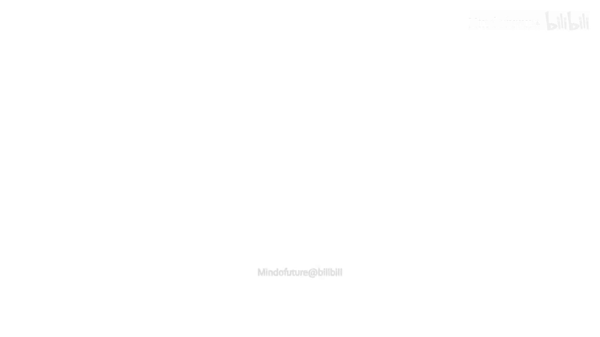
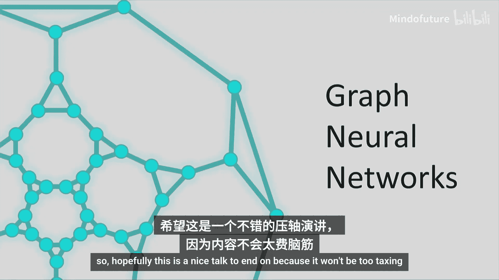
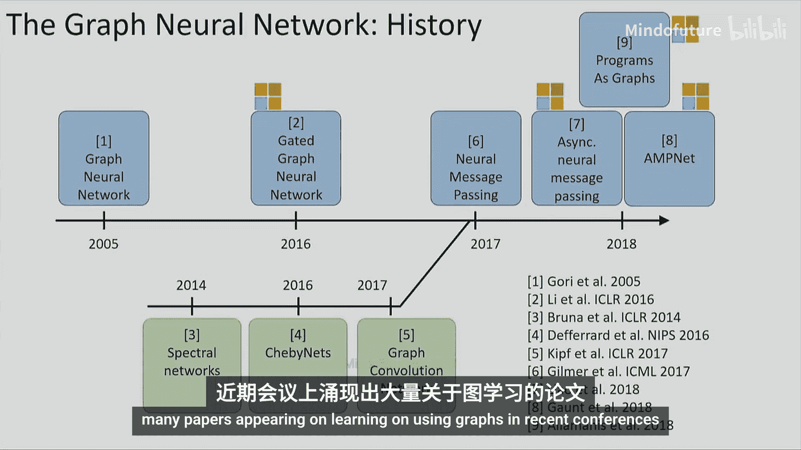
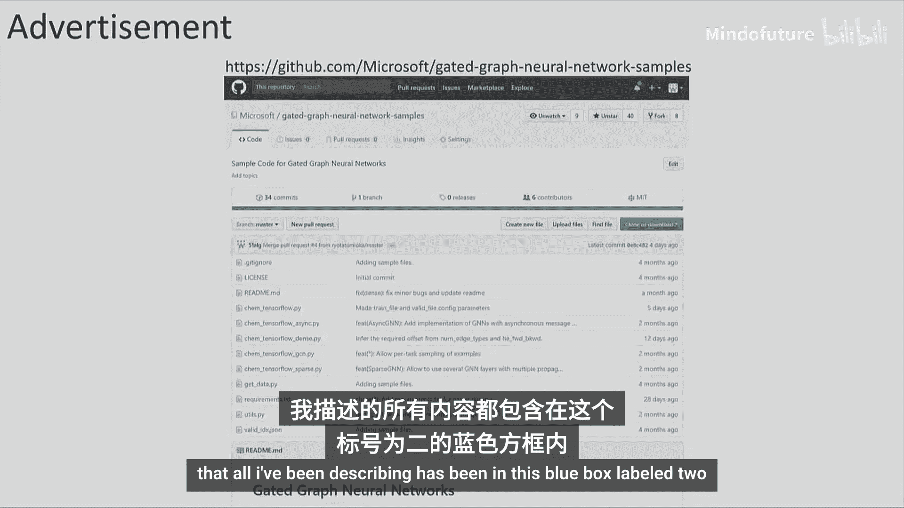
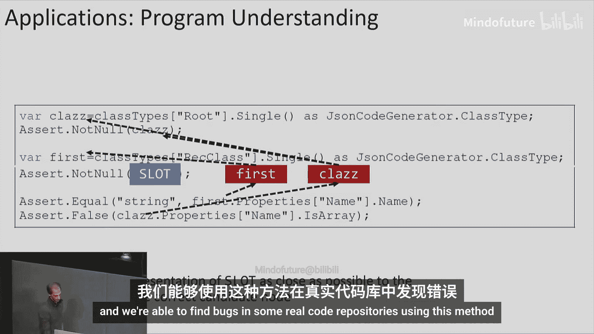
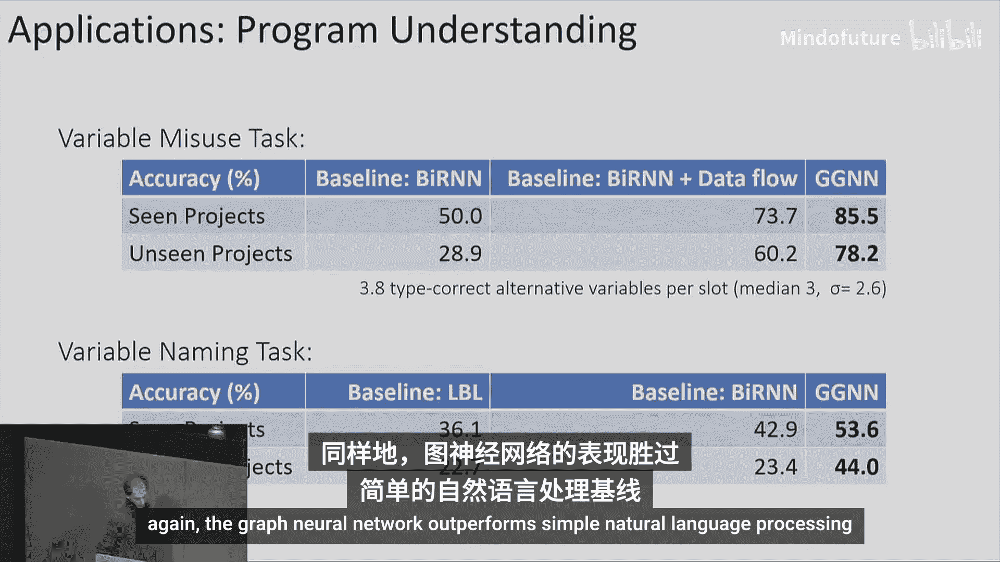
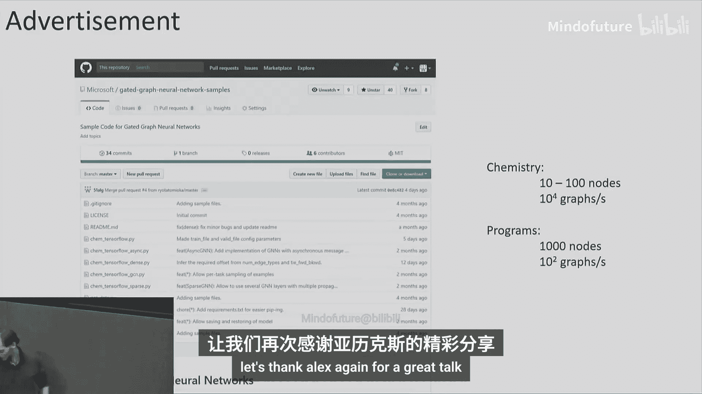

# 004：图神经网络-变体与应用 🧠

在本节课中，我们将学习图神经网络的基本概念、发展历史及其在化学和程序分析等领域的应用。我们将从循环神经网络出发，逐步理解如何将其思想扩展到处理图结构数据。

---

## 从循环神经网络到图神经网络

上一节我们介绍了处理序列数据的循环神经网络。本节中我们来看看如何将其核心思想扩展到更复杂的图结构数据。

循环神经网络处理的是链式图，即序列。每个节点（如单词）通过循环单元（用三角形表示）连接，信息按顺序传递。每个节点存储其嵌入向量（用信封符号表示），并通过循环关系更新状态。

然而，现实世界的数据常常是图结构的，例如分子或知识图谱。图具有置换对称性，即节点的排列顺序可以改变，但图本身不变。因此，任何处理图的模型都必须对这种对称性保持不变。

## 图神经网络的基本原理

以下是构建图神经网络的基本步骤：

1.  **初始化节点特征**：为图中的每个节点分配一个特征向量。例如，在分子图中，特征可以表示原子类型（碳、氢等）。
2.  **定义边类型神经网络**：为每种类型的边关联一个神经网络。不同类型的边（如单键、双键）可以有不同的网络。
3.  **信息传递**：在每一个时间步，每个节点从其邻居节点收集信息。这些信息在通过边时，会经过对应边类型的神经网络进行转换。
4.  **聚合信息**：每个节点将收集到的所有邻居信息求和。求和操作是置换不变的，保证了模型的对称性。
5.  **更新节点状态**：节点使用聚合后的信息和自身当前状态，通过一个循环单元（如GRU或LSTM）来更新自己的状态表示。
6.  **重复传播**：重复步骤3-5进行固定次数（T步）的信息传播。经过T步后，每个节点的表示包含了其T跳邻域内的信息。
7.  **生成图表示**：将所有节点的最终表示求和，得到一个代表整个图的向量，可用于下游任务（如分类或回归）。

这个过程的核心公式可以概括为节点状态的更新：
`h_v^(t) = UPDATE( h_v^(t-1), AGGREGATE( { TRANSFORM(h_u^(t-1)) for u in neighbors(v) } ) )`
其中，`TRANSFORM` 由边上的神经网络执行，`AGGREGATE` 通常是求和操作，`UPDATE` 由循环单元执行。

## 图神经网络的发展历程

图神经网络的思想并非一蹴而就。早期工作试图通过无限次迭代直到达到不动点，但这会导致信息随距离指数衰减，效果不佳。

随后，微软剑桥研究院等机构引入了门控循环单元（GRU）和长短期记忆网络（LSTM），使得信息能在图中进行更长距离的有效传播。

与此同时，另一条研究路线从图卷积出发。通过在傅里叶域定义图卷积并进行一系列近似优化，最终发现其结构与基于信息传递的图神经网络本质相同。一篇重要的论文统一了这些方法，并将图神经网络成功应用于严肃的化学数据任务，推动了该领域的爆发式增长。

## 图神经网络的应用实例

图神经网络具有广泛的应用前景，以下是两个具体例子：

*   **药物发现**：分子天然地可以用图来表示。我们可以训练一个图神经网络来预测分子成为药物的可能性。通过将此网络作为评分函数嵌入到优化算法中，可以生成具有高“药物似然性”的新分子结构，为药物研发提供新思路。
*   **程序分析与漏洞检测**：程序代码可以表示为抽象语法树等图结构。例如，可以训练图神经网络来检测“变量误用”类型的bug（如本应使用变量`first`却错误地使用了`class`）。网络通过比较代码中空缺位置的表示与候选变量的表示，找出最匹配的正确变量。实验表明，在此任务上，图神经网络优于仅处理令牌序列的循环神经网络基线。

## 总结与资源

本节课我们一起学习了图神经网络。我们从循环神经网络的基础出发，探讨了如何通过信息传递机制来处理具有置换对称性的图结构数据。我们回顾了其从早期研究到与现代图卷积相统一的发展历程，并了解了其在化学和程序分析领域的强大应用潜力。

如果你想动手尝试，微软研究院在Github上开源了高效的图神经网络实现（链接：`https://github.com/microsoft/gated-graph-neural-network-samples`），这是一个很好的起点。

---
*（教程内容整理自Alex Gaunt在图表征学习讲座中的演讲）*