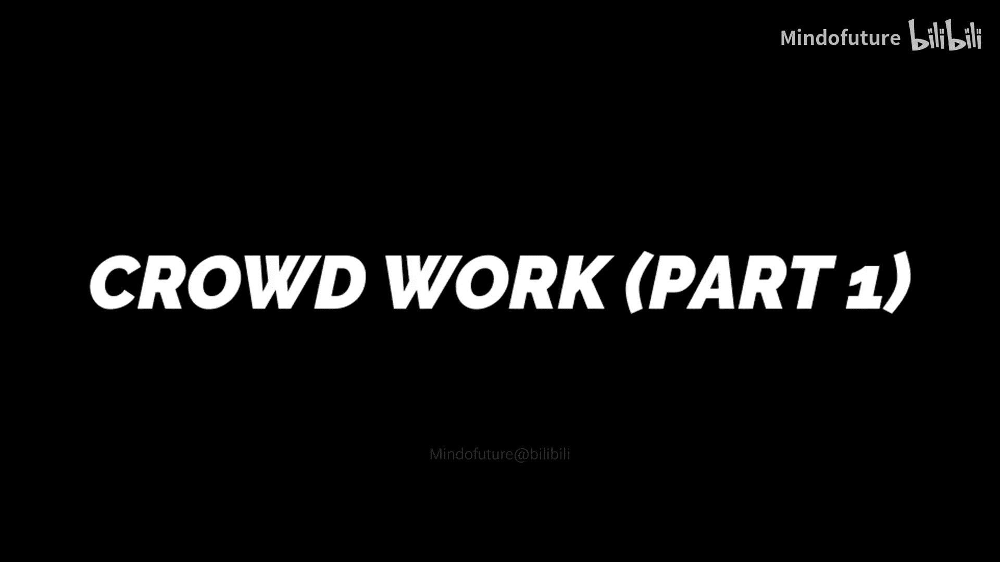

# 006：图神经网络实战




## 概述
在本节课中，我们将学习图神经网络的核心概念与实战应用。我们将从图的基本定义开始，逐步深入到图卷积操作，并通过代码示例展示如何构建一个简单的图神经网络模型。

---

## 图的基本定义
上一节我们介绍了图表示学习的重要性，本节中我们来看看图的基本数学定义。

一个图 **G** 通常由一组节点（或顶点）和连接节点的边组成。我们可以用以下公式表示：
**G = (V, E)**
其中，**V** 是节点的集合，**E** 是边的集合。

---

## 图的邻接矩阵
为了在计算机中处理图结构，我们常用邻接矩阵 **A** 来表示节点之间的连接关系。

邻接矩阵 **A** 是一个 **N x N** 的矩阵（N为节点数），其元素定义如下：
**A[i][j] = 1**，如果节点 i 和节点 j 之间有边连接。
**A[i][j] = 0**，如果节点 i 和节点 j 之间没有边连接。

以下是一个简单的代码示例，用于生成一个随机图的邻接矩阵：

```python
import numpy as np

# 假设有5个节点
num_nodes = 5
# 随机生成一个5x5的邻接矩阵（无向图）
A = np.random.randint(0, 2, (num_nodes, num_nodes))
# 确保矩阵是对称的（无向图）
A = (A + A.T) // 2
print("邻接矩阵 A:")
print(A)
```

---

## 图卷积网络（GCN）核心思想
图卷积网络的核心思想是将卷积操作从规则网格（如图像）推广到图结构数据上。其关键步骤是聚合每个节点邻居的特征信息。

一个简化的图卷积层操作可以用以下公式描述：
**H^{(l+1)} = σ(Â H^{(l)} W^{(l)})**
其中：
*   **H^{(l)}** 是第 l 层的节点特征矩阵。
*   **Â** 是经过归一化的邻接矩阵（通常包括自环）。
*   **W^{(l)}** 是第 l 层的可学习权重矩阵。
*   **σ** 是非线性激活函数（如ReLU）。

---

## 构建一个简单的GCN层
以下是使用PyTorch框架实现一个简单GCN层的代码示例：

```python
import torch
import torch.nn as nn
import torch.nn.functional as F

class GCNLayer(nn.Module):
    def __init__(self, in_features, out_features):
        super(GCNLayer, self).__init__()
        self.linear = nn.Linear(in_features, out_features)

    def forward(self, x, adj):
        # x: 节点特征矩阵 [N, in_features]
        # adj: 归一化的邻接矩阵 [N, N]
        x = self.linear(x)  # 线性变换
        x = torch.matmul(adj, x)  # 聚合邻居信息
        return F.relu(x)  # 非线性激活
```

---

## 模型训练流程
训练一个图神经网络通常遵循以下步骤：

以下是训练流程的关键步骤：
1.  **数据准备**：加载图数据，包括邻接矩阵、节点特征和标签。
2.  **模型初始化**：定义GCN模型结构，并初始化优化器。
3.  **前向传播**：将数据输入模型，计算预测输出。
4.  **损失计算**：使用损失函数（如交叉熵损失）计算预测值与真实值的差异。
5.  **反向传播**：计算梯度并更新模型参数。

---


## 总结
本节课中我们一起学习了图神经网络的基础知识。我们从图的基本定义和邻接矩阵出发，理解了图卷积网络的核心思想，即通过聚合邻居信息来更新节点表示。最后，我们通过代码实现了一个简单的GCN层并概述了模型训练流程。掌握这些内容是进一步学习更复杂图神经网络模型的基础。