# 007：图神经网络的理论基础

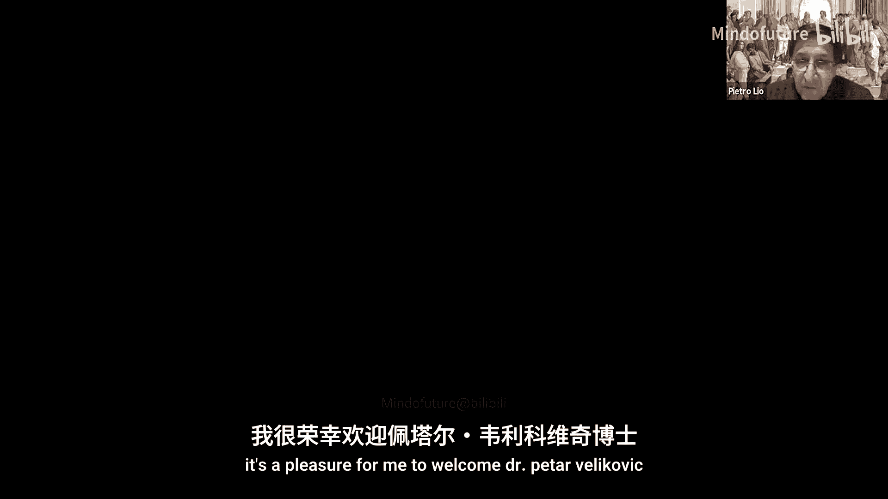

在本节课中，我们将学习图神经网络（GNNs）的理论基础。我们将从基本原理出发，探讨如何定义在图上运行的有用函数，并理解这些函数应具备的关键属性，如置换不变性和置换等变性。随后，我们将这一蓝图置于更广阔的研究背景中，展示它与节点嵌入、谱方法、概率图模型等独立研究方向的联系。最后，我们会简要讨论GNN的表达能力及其未来发展方向。

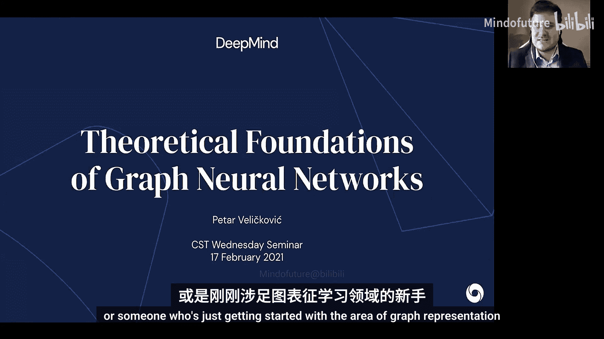

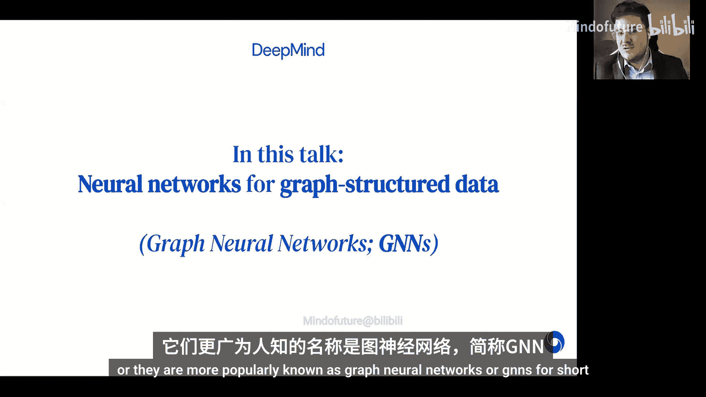

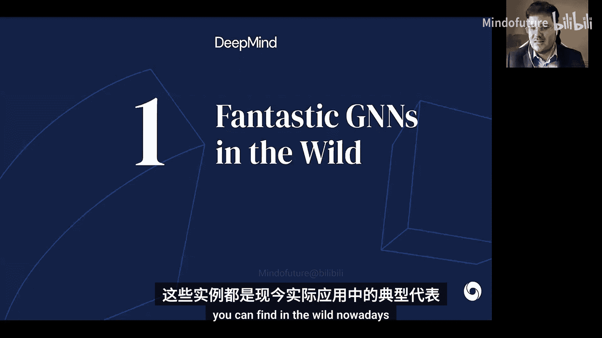

## 引言与动机

下午好。很高兴欢迎Per Veikovvi博士，他将为我们讲解图神经网络的理论基础。

Per Veikovvi博士于2012年作为本科生进入计算机实验室学习。大约在2014年5月，他收到一封邮件，询问是否愿意参与一个生物信息学的Part two项目。之后，他开始了博士研究，导师是Yoshua Bengio。在提交论文后，他立即加入了DeepMind，目前是高级研究科学家。今天，有大约400名观众在线聆听他的讲座。

非常感谢Piro的介绍，也非常感谢大家以如此庞大的阵容出席，我深感荣幸。看到这么多熟悉的面孔，即使是在线上，能回到计算机实验室与大家交流，谈论过去几年我最热衷的课题之一，也让我非常高兴。随着我对这个领域的理解越来越深入，我也在不断改进呈现整个领域的方式。因此，无论您是经验丰富的GNN实践者，还是刚刚开始接触图表征学习领域的新手，我都希望您能发现今天的讲解很有趣。

在这次讲座中，我们将介绍在图形结构数据上运行的神经网络，它们更广为人知的名字是图神经网络（GNNs）。

首先，如果您之前没有接触过这个领域，我想通过几个在现实世界中非常出色的图神经网络例子，简要概述一下为什么研究它们是个好主意。

## 图神经网络的应用实例

第一个，或许也是最直接的例子，是分子数据处理。您可以很自然地看到，分子可以表示为图。例如，这里是扑热息痛的分子结构，可以将分子中的不同原子视为节点，将分子键视为连接它们的边。然后，您可以有意义地为原子和键附加一些特征，例如原子类型、电荷、键类型、是否在环中等。一旦以这种方式对分子进行特征化，您可以向机器学习系统提出的一个非常有趣的问题是：这个分子会成为有效的药物吗？提出这个问题的一种特定方式是一个二元分类问题：给定一个分子的表示，询问GNN这个分子是否会抑制某种细菌（例如大肠杆菌）。然后，一旦您用已知对大肠杆菌有反应的分子训练数据集建立了这样的任务，就可以使用GNN训练一个图分类系统来预测该细菌是否被抑制。

这种方法真正酷的一点是，一旦您训练了这样的系统，就可以有意义地将其应用于任何分子，甚至是训练数据中未见过的分子。因此，您现在可以在已知的可能候选药物的大型数据集上运行您的系统，您的模型将给出这些先前未见过的药物抑制大肠杆菌的概率。您可以选择前100个候选药物，然后交给化学家进行深入研究。很可能在这前100个候选药物中，就包含一种先前被该领域研究人员忽视的高效抗生素。这里我展示了一个以此方式发现的化合物例子，叫做Halicin。当然，这是使用图表征学习发现抗生素的一个非常重要的发现，因此它发表在了高影响力的期刊上。随后，这在媒体上引发了一阵热潮，被《自然》杂志转载，并被《泰晤士报》、《BBC》等报道。如果您在去年年初左右看到过诸如“科学家利用AI发现强效抗生素”这样的标题，您现在可以知道，实际上在那所有“AI”的核心，基本上就是一个图神经网络。因此，这至今可能仍然是图神经网络最广为人知的应用。

现在来看一个完全不同的例子，这更接近我最近参与的工作。您可以将像谷歌地图上看到的交通网络自然地表示为图。您可以将不同的节点（交叉路口）和边（连接它们的道路）视为图的结构，并可以将各种有趣的节点特征（如长度和速度）附加到这些输入上。在DeepMind，我们与谷歌地图有一个非常成功的合作，我们在以这种方式构建的道路网络上部署了一个图神经网络，用于预测当前的预计到达时间。这显然是交通建模中一个非常重要的问题，特别是对于像谷歌地图这样的服务。作为GNN的一个成功案例，我们已经将系统部署在世界各地的几个主要城市。您可以在右侧的图片中看到其中一些城市的说明。在悉尼等一些城市，我们将负面系统预测的百分比降低了40%以上。这也是图神经网络和图表征学习如何每天影响数十亿用户的一个例子。如果您身处世界任何主要城市，并在谷歌地图上查询从A点到B点的最短路径，您的查询很可能就会经过我们实现的图神经网络。

总的来说，即使在应用领域之外，图神经网络也是一个非常热门的研究课题。图神经网络经常是主要机器学习会议中增长最快的关键词之一，图表征学习研讨会也经常是NeurIPS等会议上参加人数最多的。因此，可以说GNNs目前正在经历它们的“ImageNet时刻”，现在开始研究它们是一个非常合适的时机。

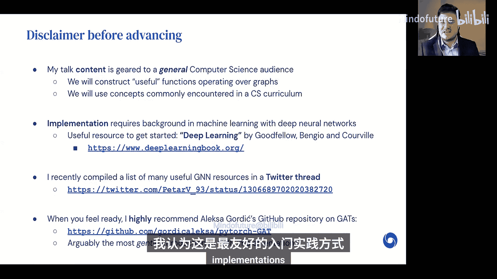

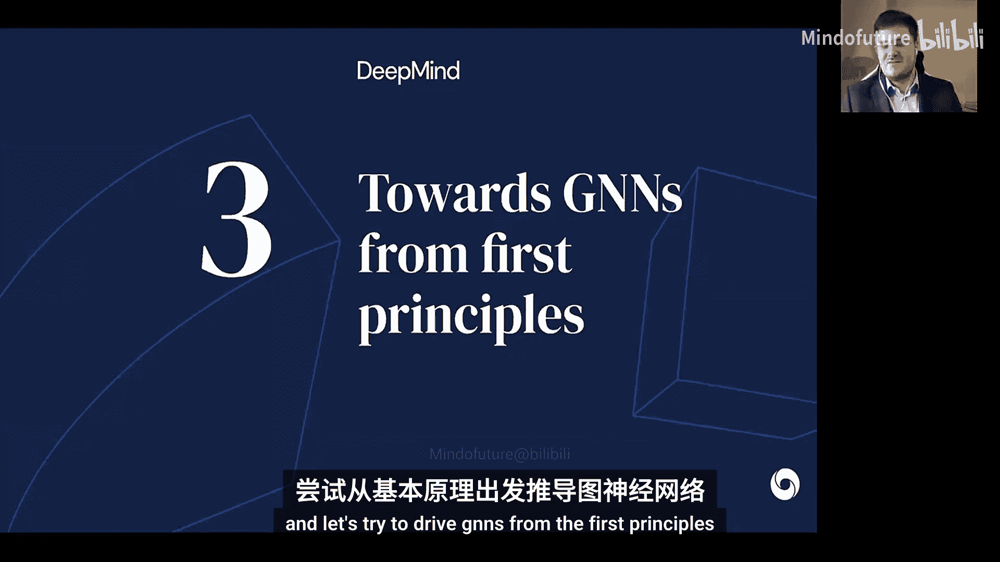

此外，如果您想开始实现，还有一个丰富的库生态系统。无论您使用PyTorch、TensorFlow还是JAX，都能找到适合您需求的库。本次讲座将被录制并发布，您之后可以查看相关链接。除了库之外，还有许多有用的数据集可以用来验证您的模型，例如Open Graph Benchmark、TU数据集以及“Benchmarking Graph Neural Networks”数据集。

希望现在我已经为您提供了令人信服的理由，说明为什么研究GNNs是有用的。如果您想看到更多这些前沿应用，我在EML 2020上做了一个更长的讲座，该讲座可在YouTube上找到，您可以查看。今天我想做的是，如果您想进一步研究这个领域，为您提供一个良好的蓝图和背景。因此，我将首先从第一性原理推导GNNs，然后将其置于几个独立研究方向的背景下，这些方向最终驱动了本质上相同的想法。希望这个视角对寻找相关工作和实现调查的新手，以及可能从这种特定视角和看待方式中受益的经验丰富的图神经网络从业者都有用。当然，我欢迎任何和所有的反馈，请在讲座期间或之后告诉我您的想法。

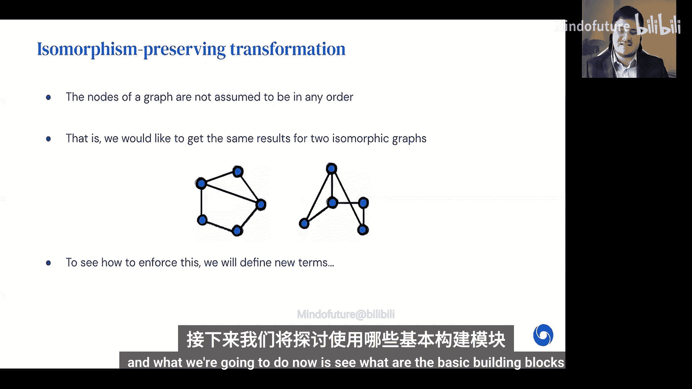

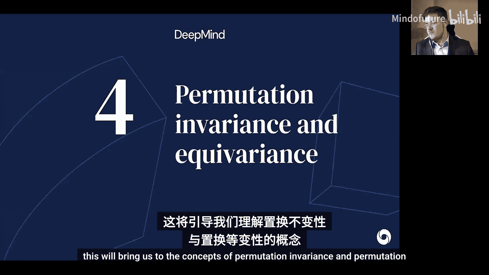

## 讲座内容与背景

讲座内容基于我目前与Joan Bruna、Michael Bronstein和Taco Cohen在分类几何深度学习方面的合作。您可以在Will Hamilton优秀的图表征学习教科书第7章中看到我将在这里呈现的各种背景。我也对这里所有内容的历史背景进行了一些思考，并感谢这里概述的研究人员在各个时期为我提供了有用的见解，我将这些见解融入了本次讲座。当然，任何错误和遗漏都是我个人的，如果我在本次讲座中有什么表述不当之处，请告诉我。

最后，在深入探讨一切之前，本次讲座的内容面向一般的计算机科学受众。我们将只构建在图上运行的有用函数，并使用您在计算机科学课程中常见的概念。如果您真的想开始实现这些模型中的任何一个，将需要一些深度神经网络的机器学习背景，您可以使用Goodfellow、Bengio和Courville的《深度学习》一书来开始这个领域的学习。我最近在Twitter上发布了一个帖子，列出了许多有用的图神经网络资源。当您准备好开始实现时，Alex Agorodkin最近发布了一个非常有影响力的GitHub仓库，从头开始展示了我们的图注意力网络模型，在我看来，这可能是开始实现的最温和的方式。

说完这些，让我们开始吧，让我们尝试从第一性原理推导GNNs。我们将看到如何定义在图上运行的有用函数，基本上，我们将研究对于一个函数来说，哪些属性对于在图上进行有意义的操作是有用的。

## 从图像卷积到图：对称性与不变性

具体来说，图神经网络理想情况下应该保留哪些对称性和不变性？为了开始这项研究，我将回顾一个已知的例子，如果您做过任何图像处理，您可能见过这个想法：图像卷积。这里提供了一个简要的动画，说明它是如何工作的。您有一个小的核矩阵K，它在图像上滑动，并在图像周围局部捕获感兴趣的模式。

这种模型编码的是平移不变性的概念。这意味着一个模式无论我在图像中的哪个位置找到它，都是有趣的，这就是为什么我将矩阵滑动到各处。同时，它还编码了局部性的假设：彼此接近的像素可能比图像中相距很远的像素有更强的关联。这些概念对于图像非常有用，那么对于图来说可能是什么情况呢？

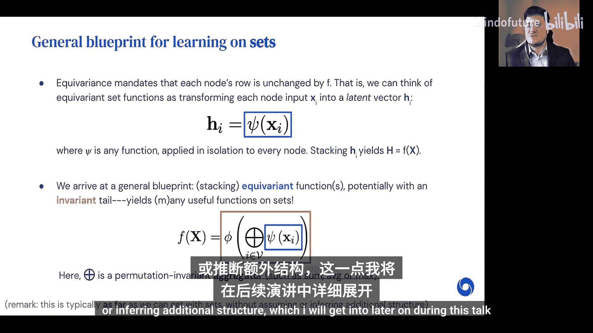

对于图，您可能会看一会儿并意识到，如果您不假设它们有任何特定的几何结构，那么图的节点被假定为没有任何给定的顺序。这意味着如果我给您两个完全同构的图（这里给出了两个例子，如果您看它们，会发现它们实际上是同一个图），我们希望我们的图神经网络为这两个图给出完全相同的结果。我们现在要做的是看看我们可以使用哪些基本构建块来强制执行这一点。

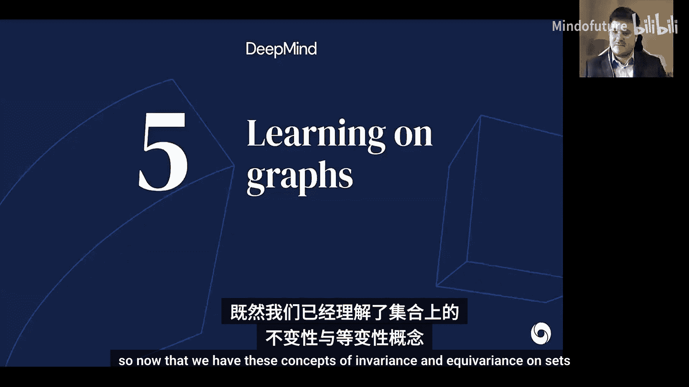

这将把我们引向置换不变性和置换等变性的概念。

## 集合上的置换不变性与等变性

为了简化当前设置，我将暂时假设我们的图没有边。因此，我们只有一组节点V，在每个节点中，我们可能有一个特征向量Xi（对于节点i）。在图表征学习领域，我们通常处理的方式是将这些行向量堆叠成一个形状为n×K的矩阵，其中有N个节点，每个节点有K个特征。矩阵的第i行对应于第i个特征向量。非常重要的一点是，仅仅通过堆叠节点这一行为，您就指定了访问它们的顺序，而我们理想地希望应用图神经网络的任何结果都不依赖于这样的操作。

因此，思考哪些操作可能只改变节点顺序而不做其他事情是有用的。您可能知道，在数学中，这样的操作被称为置换。对于n个节点，有n!种置换。非常棒的是，我们可以思考置换并完全保持在线性代数的领域内，因为每个置换都定义了一个唯一的n×n矩阵。这里给出了一个针对置换2413的矩阵示例。这些矩阵中的每一个都称为置换矩阵，它们在每一行和每一列中恰好有一个条目为1，其他地方都是0。正如您通过矩阵乘积可以快速看到的，与这些行堆叠的特征矩阵之一相乘，它们唯一的效果就是置换您顶点的顺序，仅此而已。因此，这些矩阵是进一步研究这一点的非常有用的工具。

因此，为了设计在这些集合矩阵X上运行的函数，使其不依赖于节点顺序，我们基本上想说，如果我对输入应用一个置换矩阵（即，如果我改变呈现给您的节点的顺序），这不应该改变结果。这为我们提供了一个非常有用的置换不变性概念。我们说，一个在集合上运行的函数是置换不变的，如果无论我在应用函数之前对集合应用什么置换矩阵P，我都会得到相同的结果，就像我一开始就没有进行置换一样。

您可能以前见过一些表现出置换不变性的模型。一个非常通用的形式是发表在NeurIPS 17上的Deep Sets论文中提出的模型，您基本上将集合上的函数表示为应用于行向量Xi的某个独立函数Psi，然后执行一些对顺序不敏感的置换不变聚合函数，如求和、最大化或平均。之后，您可能还会在末尾拼接一个额外的函数Phi，该函数对聚合后的表示进行操作。因为您有这个关键的求和聚合，所以能够以独立于您提供的节点顺序的方式总结整个集合。

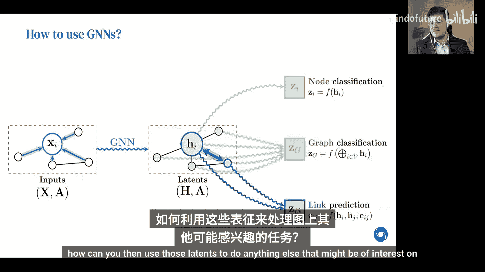

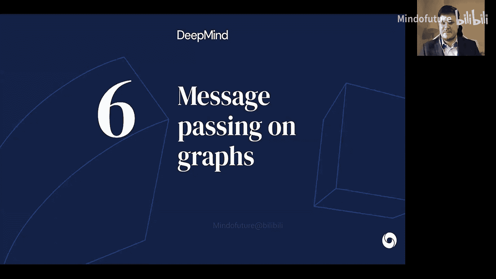

这是在整个集合级别上获得输出的一个非常好的方法，因为我们聚合了整个集合。但是，如果我们想在单个节点级别上进行预测呢？如果我们想这样做，我们并不完全需要置换不变性，我们需要一些更细粒度的东西。我们希望能够在对集合执行函数之后，仍然能够识别输出的哪一部分属于哪个节点，而一个置换不变的聚合器几乎会破坏这一点，因为如果我们将所有节点压缩成一个单一的向量。

因此，在这种情况下，我们可能寻求的是不改变节点顺序的函数。也就是说，如果我有一个由置换矩阵P指定的置换，那么无论我在应用函数之前还是之后用它对节点进行置换，函数本身都会保持顺序。因此，我们可以相应地定义置换等变性的概念：无论我对输入施加什么置换矩阵，无论我在应用函数之前还是之后施加它，都没有关系，这在下面的方程中得到了简洁的总结。

有了这个，我们可以说等变性要求每个节点的行在我应用此函数后保持不变。我们可以基本上这样思考：如果我们专注于函数按行操作，当我们转向图时，这将是一个非常重要的视角。因此，我们可以将集合上的置换等变函数视为这些Psi函数，它们独立地、孤立地应用于每个节点i，为我们提供潜在向量Hi。

一旦您堆叠了所有的H，就可以得到一个潜在空间矩阵H，它代表了应用变换后每个节点的特征。结合不变性，这为我们提供了一个非常强大的蓝图。如果我们堆叠这些等变函数（它们孤立地转换每个节点），并在末尾可能加上一个不变性的“尾巴”（如果我们对整个集合级别的结果感兴趣），这为我们提供了许多在集合上有用的函数。可以说，在没有假设或推断额外结构的情况下，这是我们在基本集合上所能达到的极限，我将在本次讲座的后面部分讨论这一点。

## 从集合到图：引入边结构

现在，既然我们有了集合上的不变性和等变性概念，我们可以尝试将它们转移到图上。事实证明，这种转移相当容易。现在，我们假设不仅有节点，而且它们之间还有一些边。因此，我们有一组边E，它是节点笛卡尔积的一个子集。我们通常可以方便地用这个邻接矩阵A来表示它们，其中在有边的地方有1，否则为0。您还可以向其中添加其他内容，如边特征、边类型等，但为了保持蓝图简单，我故意忽略了它们。通常，重新引入所有这些内容相当容易。我们想要的主要东西——置换不变性和等变性——仍然成立，我们只需要稍微不同地表达它们。

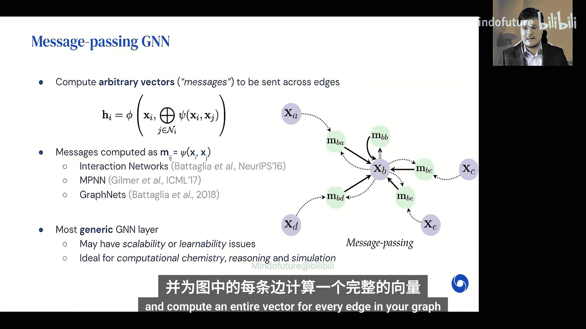

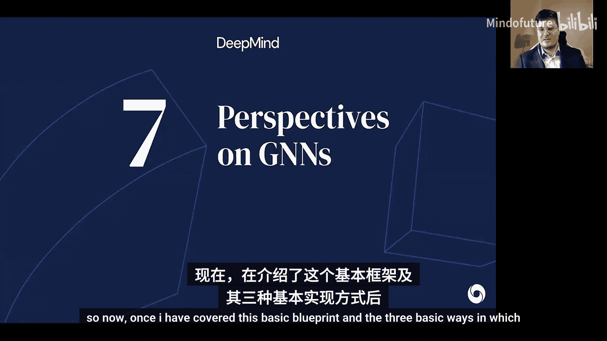

因此，现在的主要区别是，当您对节点应用置换时，您也在对边应用置换。因为节点特征矩阵的行对应于邻接矩阵的行和列，您需要将置换矩阵分别应用于A的行和列。这可以方便地写成P A P^T。这只是为您提供了图结构输入的更新版本的不变性和等变性规则，就像之前一样。因此，现在我们的函数接受节点特征以及邻接矩阵。如果我要适当地置换输入和邻接矩阵，对于不变性，无论我在之前还是之后这样做都没有关系；对于等变性，无论我在之前还是之后这样做，我仍然能够识别所有节点特征。

这是一个非常清晰概括的概念。但是，图上有一些我们在集合上无法完全做到的东西。正如我们在图像上提到的，我们非常喜欢局部函数的概念，即仅在某些节点的局部区域上运行的函数。图为您提供了一个非常好的上下文来做到这一点，那就是节点的邻域。对于一个节点，您可以将其一阶邻域定义为所有与其相邻的节点，即存在连接它们的边。

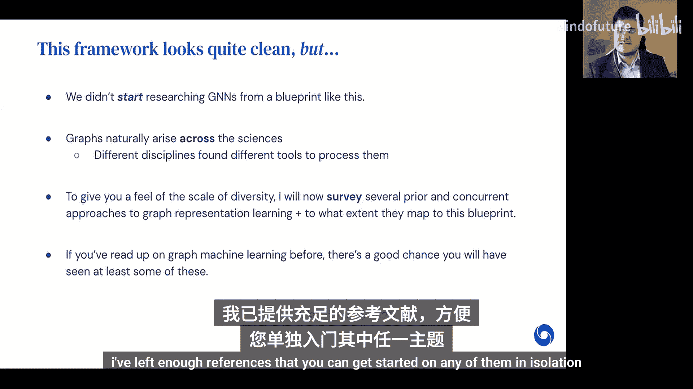

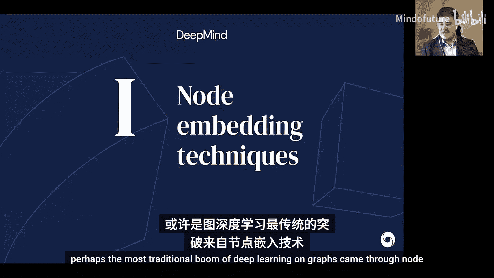

因此，您可以通过提取邻域中所有节点的X矩阵行来提取邻域中的特征集合，我将其表示为X_N(i)，表示与节点i相邻的所有节点的特征向量。

如果您想定义一个局部函数，您可以说，现在一个局部函数G在一个节点及其邻域的多重集上运行。

这为我们提供了通用图神经网络的配方，因为现在如果您想构建一个通用的置换等变函数，您可以以共享的方式在所有邻域上适当地应用这个局部函数G，并将得到的潜在表示堆叠为矩阵的不同行。为了确保这个东西仍然是等变的，我们需要确保G不依赖于您呈现邻域的顺序。因此，G通常应被构造为对X_N(i)的条目是置换不变的。

这只是为了给您一个到目前为止我们涵盖的所有内容的视觉展示。我们将图神经网络表达为一个局部共享函数G，应用于每个节点及其邻域。作为应用G的结果，我们将从输入特征Xi转换到潜在特征Hi。这里我给出了一个节点B及其在图中的局部邻域的例子，该图包含节点A、C、D和E。通常我们还包括节点B本身，然后这个函数将该邻域转换为下一步的潜在表示。

现在，一旦您有了这样的GNN，我将快速回顾一下如何使用它们来解决图上指定的实际问题。想象一下，我给您一个图，其中有一些输入特征X和一些邻接矩阵A，使得Xi包含节点i的特征。在其上应用GNN会将这些X转换为潜在特征，同时考虑到它们的局部环境。现在，如果我有一个节点分类任务，我可以单独查看每个节点的潜在表示，并在其上学习一个分类器。如果我有一个图分类任务，我可以再次使用一个置换不变函数（如求和）将所有节点组合成一个表示，然后应用我的图级分类器对它们进行分类。对于某些类型的GNN，如果您想预测边的属性甚至边的存在（这被称为链接预测），您也可以构建一个函数，该函数在两个节点的潜在表示上运行，并可能考虑它们之间的任何边特征。因此，这是一旦您有了等变潜在表示后，如何使用这些潜在表示在图上去做任何其他可能感兴趣的事情的通用配方。

## 图神经网络的三种空间实现方式

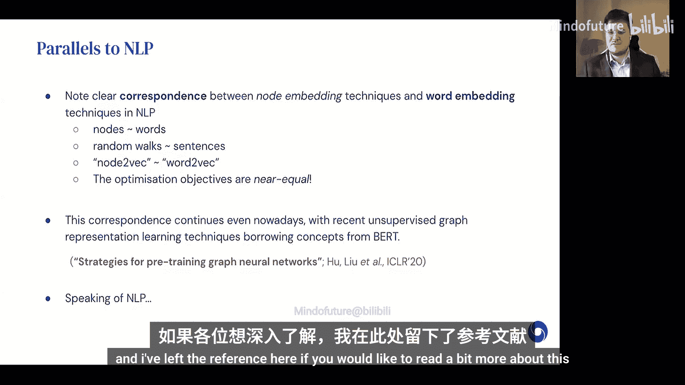

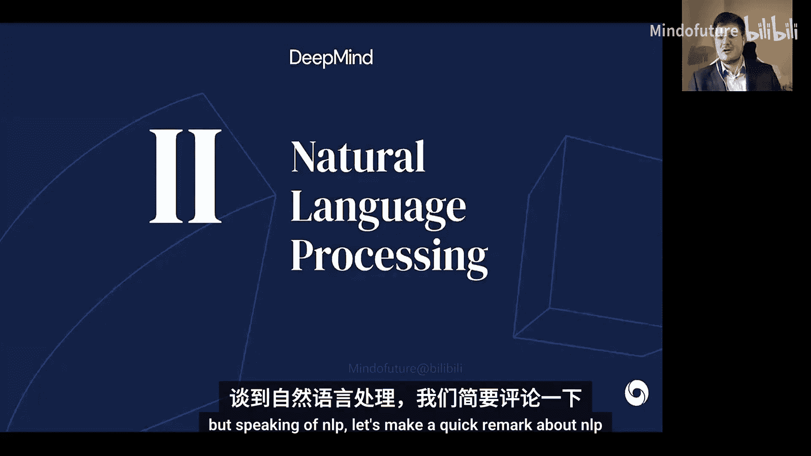

一旦您掌握了这个主要蓝图，让我们看看我们通常会以哪些方式实例化它们。

如前所述，我们通过在所有邻域上共享应用一个局部置换不变函数G来构建这些置换等变函数F。在各种伪装下，您可能看到G被称为扩散、传播或消息传递。现在我们将看看实际定义G的方法。这显然是一个研究非常密集的领域，但对我们来说非常幸运的是，如今提出的几乎任何层都可以归类为三种空间风格的GNN之一。

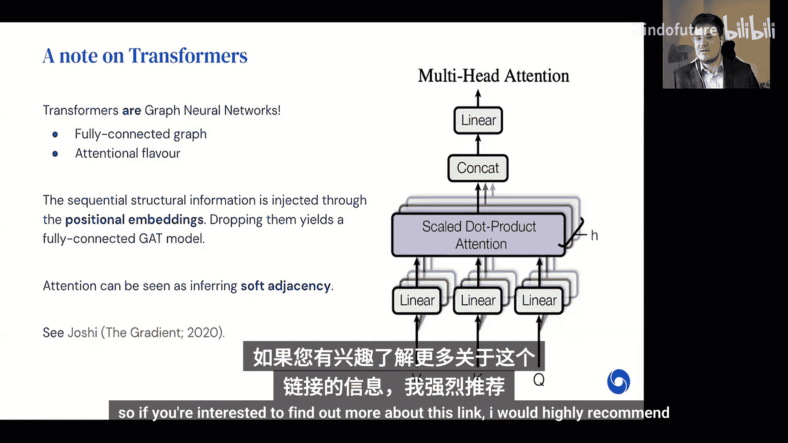

它们是卷积风格、注意力风格和消息传递风格，我现在将逐一为您介绍。

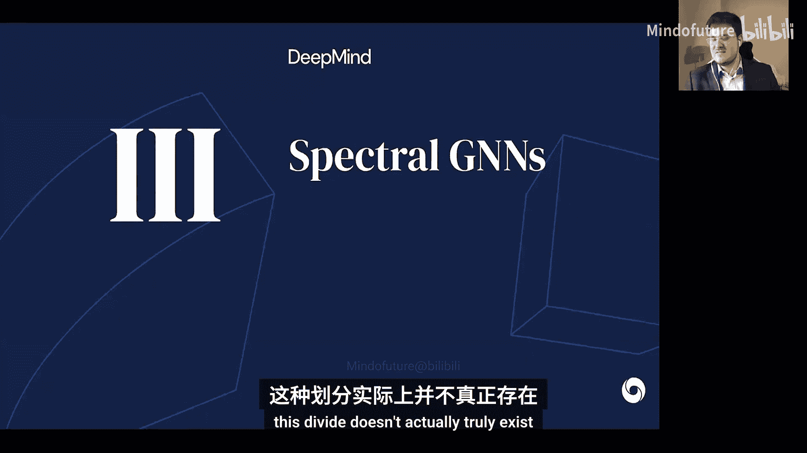

首先，在卷积设置中，我们只是给出一个交互常数C_ij，它表示节点i对节点j特征的重视程度。然后，它们基本上是局部变换特征的加权和或不同种类的加权组合中的系数。因此，我有一个Psi函数独立地应用于每个节点特征，我通过使用C_ij常数权衡它们的贡献来聚合它们，并使用一些置换不变的聚合器（如求和）来组合它们，然后这为我提供了该节点在下一步的特征的配方。通常，这些权重C_ij将直接依赖于邻接矩阵中的内容。一些著名的例子包括切比雪夫网络、图卷积网络和简化图卷积网络。

如果您的图是同质的（即相连节点标签相似），它们非常有用，因为您通常只需对节点内部的内容进行非常简单的平均即可。同时，它们也非常有用，因为它们具有很好的可扩展性。如果您知道您的图将是同质的，这种模型非常轻量级，易于使用简单的矩阵运算实现，因此更容易扩展到数十亿节点的图。

然后，如果您想让事情稍微复杂一点，比如假设您的边不再仅仅编码标签相似性，还可能存在一些排斥效应（例如，如果我转发某人的推文，并不意味着我完全同意他们，我可能实际上完全不同意他们），我们可以将这些固定的常数权重替换为可学习的权重。如果您过去做过像Transformer这样的工作，这可能对您来说很熟悉，这就是注意力机制。它是任何接受发送节点和接收节点特征的函数（这里的a函数），并给出一个系数，您可以用它来权衡该节点对接收节点的贡献。这是一种非常优雅和强大的方式，可以学习更复杂的加权组合，但它仍然不需要计算和存储太多信息。有几个模型实现了这个想法，其中一些最早的包括MoNet模型、图注意力网络和门控注意力网络，它们在这里列出。它们非常有用，作为一种“中庸之道”：如果您的边不编码严格的同质关系，您可能想要一些更复杂的求和，但您仍然希望只为每条边计算一个标量，因此它仍然具有合理的可扩展性。这是介于两者之间的选择。

在表达能力谱的另一端，您有消息传递GNNs，其中发送节点和接收节点在这个Psi函数中共同协作，计算一个基于任意向量的消息，该消息被发送到接收节点。请记住，在注意力情况下，我们仍然只发送原始邻居特征，并乘以某个常数。在这里，发送节点和接收节点共同协作来计算消息的内容。它在交互网络、消息传递神经网络和GraphNets模型中以各种伪装出现。因此，它们可以被视为最通用的GNN层。这意味着它们可以拟合一些非常复杂的模拟数据，如算法推理、物理模拟或计算化学，但这可能意味着一些可扩展性或可学习性问题，因为现在您必须为图中的每条边存储和计算整个向量，而边的数量通常比节点多得多。

## 将蓝图置于更广阔的研究背景中

现在，既然我已经介绍了这个基本蓝图以及实例化它的三种基本方式，您可以看到以这种方式呈现看起来相当清晰。但有一件事您可以注意到，我们实际上并不是从这样的蓝图开始研究图神经网络的。如果您研究过图神经网络，尤其是几年前，您可能没有看到它们以这种特定方式呈现，您可能看到过诸如谱方法与空间方法、DeepWalk与Node2Vec之类的视角。原因是图很自然地出现在科学的不同分支中，不同学科找到了不同的工具来处理它们。但现在，我将通过调查许多这些先前和并行的研究方法，向您展示这个蓝图实际上有多准确，展示在大多数情况下它们如何几乎完全映射到我刚刚展示给您的这个蓝图。如果您以前阅读过任何类型的图表征学习，很可能至少见过其中的一些，但如果您没有见过其中一些，也完全没关系，我已经留下了足够的参考文献，您可以单独开始研究其中任何一个。

## 节点嵌入技术

第一个，也许是深度学习在图上的最传统热潮，是通过节点嵌入技术实现的。

它们依赖于找到将图中的节点嵌入到向量中的好方法。我以非常感谢Will Hamilton的方式采用了这个图，他使用Z表示嵌入，我通常使用H。它使用一个编码器函数，但在当时，所有这些编码器函数实际上都是查找表，因此您只是学习每个节点的平面表示，而没有使用任何特定或复杂的函数来推导它。

现在的问题是，什么使这个H向量是好的？图承载着有趣的结构，如果您有一个好的节点表示，它理想情况下应该保留这种结构。您能拥有的最简单的结构概念是什么？那就是一条边。

因此，如果我有一个边连接的两个节点i和j的特征Hi和Hj，它们应该以某种方式预测这两个节点之间是否存在边。这为我们提供了一个非常直接的无监督目标。我们可以优化这些H向量，使它们在形成边时彼此接近，否则远离。这允许我们仅使用点积：两个节点的点积相似性将告诉我们这个值的估计值，然后我们可以使用标准的二元交叉熵来优化它，使图中边的点积高，非边的点积低。这实际上只是一个更广泛的称为随机游走目标的方法家族的一个特例，这些方法试图通过将条件从“如果它们在一条边上就应该接近”细化为“如果它们在短随机游走中共现就应该接近”，从而使这一点更有趣。这允许您稍微扩展您的感受野。

应该注意的是，在GNNs成为主流之前，这主导了无监督图表征学习。如果您在那个领域待过，您可能听说过像DeepWalk、Node2Vec或LINE这样的方法，它们是引领这个领域的旗舰论文。

但有一件非常重要的事情需要注意，正如我提到的，这些随机游走目标强制嵌入在图中彼此接近的节点在嵌入空间中也接近。但是卷积GNN是做什么的呢？它将您周围的一整套邻居总结为一个向量嵌入。因为在大多数像这里展示的小世界网络中，如果您有两个像i和j这样通过边连接的节点，它们实际上在它们的邻域中会有很多重叠的节点。例如，对于i和j的所有邻居，只有侧面的红色和蓝色节点没有同时出现在两个邻域中。因此，如果您只是应用一个GNN，即使没有任何特定的训练，仅凭设计就应该使它们具有相似的嵌入。

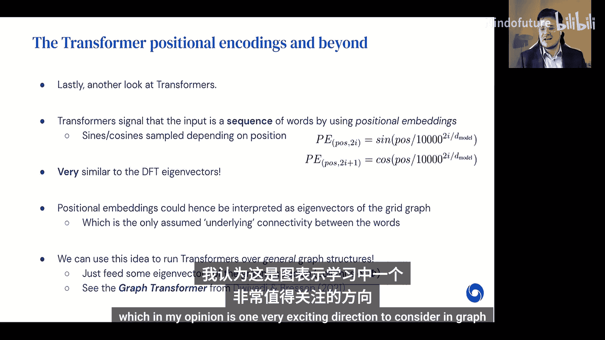

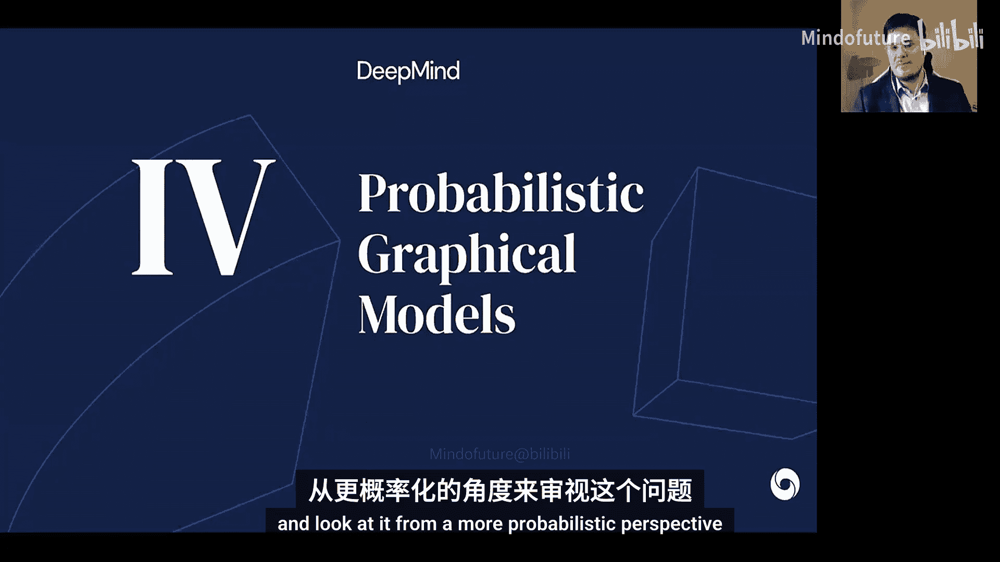

基本上，从表示的角度来看，这些DeepWalk风格的模型模拟了一个未经训练的卷积GNN。一个推论是，通常将随机游走目标与GNNs结合效果并不好，实际上，有时您可以通过一个完全没有训练过的卷积GNN来匹配DeepWalk的性能。我最初在Deep Graph InfoMax论文中偶然发现了这一点，作为将训练周期数设置为零的意外结果，此后该领域的其他几位研究人员也独立验证了这一点。

因此，您可能还会发现这里有趣的一点是，我刚才提到的节点嵌入技术与自然语言处理中一些更传统的词嵌入技术之间存在明确的对应关系。如果您将节点视为单词，将这些随机游走视为句子，您基本上可以将Node2Vec与Word2Vec目标等同起来，它们的优化目标实际上是近乎相等的，它们甚至都包含负采样之类的东西。

实际上，这种对应关系甚至延续至今。最近一些关于图神经网络预训练的工作借鉴了BERT的许多概念，如果您想了解更多关于这方面的信息，我在这里留下了一个参考文献。

## 与自然语言处理的联系

说到NLP，让我们快速评论一下NLP。

不仅仅是GNN的设计受到NLP的启发，有时您可以看到概念向另一个方向发展。如果您看一个句子中的单词，它们显然会以一些有趣的方式相互作用，比如主谓宾关系，这些相互作用的方式不是平凡的，也不是顺序的。这意味着使用简单的循环模型或卷积模型处理它们可能不是最准确的方式，我们实际上可能希望使用更通用的图来处理它们。但问题是，这个图是什么？当您不知道图是什么时，一个常见的假设是只使用一个完全图，并让图神经网络推断关系是什么。如果您在过去几年中从事过任何自然语言处理工作，这听起来应该非常熟悉。事实上，我刚才向您描述的就是Transformer。所以这不是巧合，Transformer实际上可以被视为图神经网络的一个特例。它们非常符合我提到的蓝图，因为它们在一个完全连接的图上工作，并且使用GNN的注意力风格。

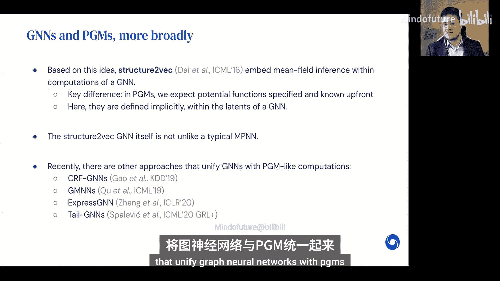

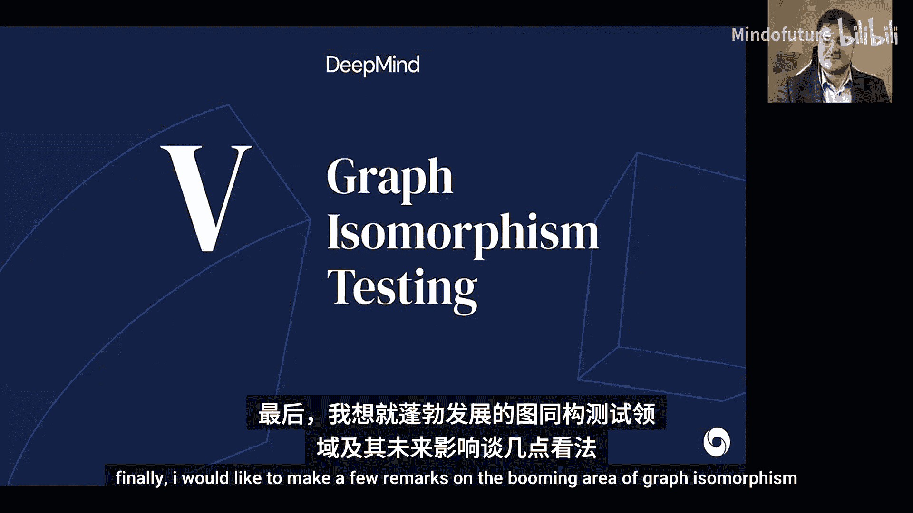

您如何告诉Transformer它仍然在处理一个序列？是通过添加这些额外的特征——位置嵌入——来告诉您确切的位置，这样您就不只是在看一个词袋。但是，如果您去掉这些位置嵌入，您会得到一个非常标准的、普通的全连接图注意力网络模型。

看待这个问题的另一个非常好的视角是，这些注意力系数可以被视为推断软邻接矩阵的一种手段。这是一个非常有趣的领域，Chatanya Joshi在这篇Gradient出版物中更清晰地阐述了这些联系。因此，如果您有兴趣了解更多关于这种联系的信息，我强烈建议您查看这篇论文。

## 谱方法与空间方法

与此同时，我将继续讨论部署图表征学习最流行的早期方法之一。您可能已经在许多案例中看到，早期的论文（包括我自己的）会将图神经网络分为谱方法和空间方法。我现在希望向您展示，在大多数情况下，这种划分实际上并不真正存在。

那么，我们是如何走到这一步的呢？数字信号处理中一个非常有用的量是卷积定理，它定义了一个恒等式，对我们非常有吸引力，因为它允许我们在某个域（如时域）中将卷积表示为在另一个域（如傅里叶域）中的逐点乘法。这是定义卷积的一种迂回方式，因为定义一个以可学习的方式进行逐点乘法的算子对我们来说相当容易。但问题是，卷积定理和傅里叶变换通常是针对这些时间指定的信号定义的，那么在图的案例中，域会是什么呢？要到达那里，我们首先将看到当您查看离散序列时图是如何出现的。

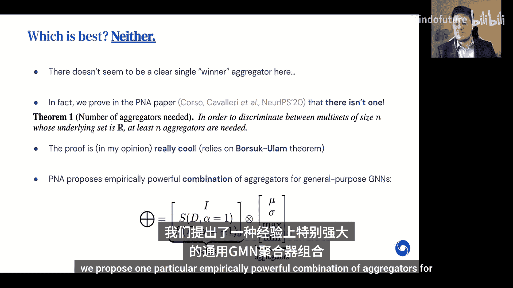

我们可以想象一个时间序列或序列，就像这个循环网格图。我之所以从第一个时间步到最后一个时间步添加一个循环，是为了更容易处理边界条件，但通常不会改变我将要得出的结论。我们可以通过类比图像，将卷积操作表示为查看当前时间步及其一些直接邻域的东西。因此，我们通过应用节点2及其一些直接邻居（例如节点1和3）的局部加权和来计算节点2的更新特征H2。假设这个操作的系数是这些常数，或者说是可学习的常数A、B和C。

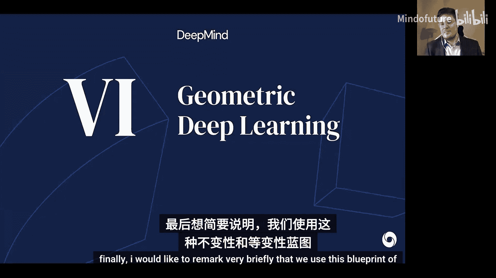

现在非常重要的一点是，看一下幻灯片的底部，这指定了您在每个时间步上独立应用的矩阵运算。我们称这些矩阵为循环矩阵。之所以这么叫，是因为您可以从第一行开始，然后随着行向下移动，总是将所有系数向右移动一位。任何具有此属性的矩阵都称为循环矩阵，在一维卷积的情况下，这一点非常明显。

循环矩阵的一个非常重要的特性是它们可交换。也就是说，无论我选择什么向量作为循环矩阵的第一个向量，我都能与任何其他循环矩阵可交换地应用它。可交换的矩阵也被称为可联合对角化，即其中一个的特征向量是所有其他矩阵的特征向量。这意味着它们以相同的方式进行特征分解。非常方便的是，所有循环矩阵都分解为由单位复根形成的这些向量的离散傅里叶基。

通过研究一个循环矩阵（如移位矩阵，它只在第二个位置有一个参数），您可以非常容易地计算这些特征向量。

如果您将这些傅里叶基向量堆叠成一个矩阵，您就准确地恢复了离散傅里叶变换，因为如果乘以这个矩阵的共轭转置，您就将信号转换到了谱域。这也允许您，因为所有循环矩阵共享这个特征分解，将任何循环矩阵分解为傅里叶基乘以特征值的对角矩阵再乘以傅里叶基的共轭转置的乘积。由此，您可以自然地推导出卷积定理：应用于特征矩阵X的任何循环矩阵都可以使用这个特征分解来表达，因此您可以首先将您的特征X乘以Φ*将其转换到傅里叶域，然后因为您乘以的是特征值矩阵（它是一个对角矩阵），这正好对应于逐点乘法。一个非常重要的推论是，只要您知道Φ（这些傅里叶基向量），您就可以仅使用其特征值来表达您的卷积，而不需要循环矩阵的实际参数。

总结一下我目前所说的一切：在空间域中，我们可能通过直接将循环矩阵应用于输入X来进行卷积。但现在我刚刚为您提供了一条迂回路线：我可以首先应用离散傅里叶变换Φ*将X转换到谱域，在这个域中，应用卷积只是与那个卷积的特征值进行逐元素相乘。然后，一旦我在谱域中有了结果，我可以通过应用逆离散傅里叶变换（即Φ）将其转换回空间域。

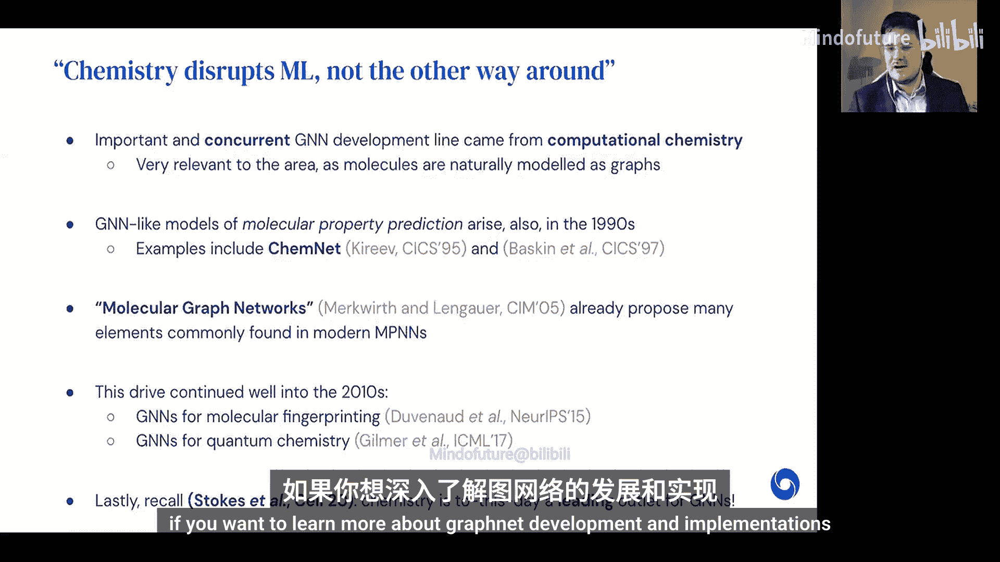

这里的关键思想是，如果我知道卷积操作关于傅里叶基的特征值，我不需要知道卷积操作本身是什么。

这为我们提供了图的配方。现在图的问题是，感兴趣的卷积通常比循环矩阵更通用，因此很难推理这些矩阵可能是什么样子。但我们仍然可以使用共享特征基的概念。因此，如果我们知道图的某个图傅里叶基，我们可以只专注于学习该操作的特征值。

对于网格，我们希望与移位可交换，这就是为什么我们有循环矩阵，我们可以将这些移位视为网格的邻接矩阵。

当您没有网格时，这可以推广。如果您在n个节点上有网格卷积，您的傅里叶基总是相同的，它是n维离散傅里叶变换基。但现在对于任何图，您将只计算其自己的Φ，这取决于图的结构。以前结构是固定的。我们希望我们的卷积与之可交换的一件非常重要的事情是邻接矩阵，因为它以最直接的方式指定了图结构。但不幸的是，我们并不总是能对邻接矩阵进行特征分解。因此，我们选择以一种易于数学上特征分解的方式来表示邻接矩阵中的信息，这引出了图拉普拉斯矩阵，它是度矩阵和邻接矩阵的差。

这里您可以看到一个拉普拉斯矩阵的例子，您可以看到它代表了邻接矩阵的所有属性，但以一种在数学上更方便的方式。您可以在所有-1条目中看到图的边被编码，沿着主对角线，您有图中每个顶点的度，在这种情况下从0到5排序。

假设您的图是无向的（我将在这里重点讨论），拉普拉斯矩阵是对称且半正定的，这意味着我们将能够对其进行特征分解。这意味着我们可以将拉普拉斯矩阵表示为这个特定的傅里叶基Φ乘以某个特征值矩阵再乘以Φ*。现在，如果我改变这些特征值，我会得到所有与L联合对角化的矩阵，即任何与L可交换的矩阵。我们通常将这个表达式视为图傅里叶变换，由Joan Bruna在ICLR 2014上推广。

因此，现在如果您想进行卷积，即将某个图卷积应用于节点上指定的某个新特征矩阵，您首先乘以这个先前预计算的Φ*，您就进入了谱域。现在您用这些theta系数进行逐点相乘，这些系数现在可以是可学习的，您可以将它们指定为可以通过梯度下降学习的东西。最后，一旦您有了该乘积的结果，您可以再次乘以Φ转换回空间域。

然而，直接学习我刚才提到的这些theta通常是不合适的，因为它不局部化，不能推广到其他图结构，而且计算成本高。因此，即使它为您提供了更强大的一类算子，直接学习系数也存在很多问题。相反，我们通常为了使这易于处理，是使特征值与拉普拉斯矩阵的特征值相关。通常，我们强制这个对角矩阵中的特征值是拉普拉斯矩阵特征值的多项式函数。这个多项式的一些流行选择包括三次样条、切比雪夫多项式或凯莱多项式。现在需要注意的重要一点是，一旦您强制自己使用拉普拉斯矩阵的多项式，您就定义了一个卷积GNN，因为您可以字面上计算拉普拉斯矩阵的多项式，并使用它来指定我之前提到的蓝图中的系数C_ij。基本上，大多数高效的谱GNN方法都以这样的方式空间化自己。因此，基本上许多论文讨论的这种空间-谱划分并不真正是一种划分，因为真正的谱非空间算子通常不具备我们期望的计算性能或局部化特性。

在转向下一个视角之前，我想简要地再看一下Transformer的位置编码。如果您读过Transformer论文，您会知道每个节点中的这些位置编码是由这些与位置相关的正弦和余弦的复杂序列给出的。正弦和余弦与离散傅里叶变换的特征向量非常相关。因此，人们实际上可以将这些位置嵌入解释为网格图（我们最初假设的单词之间的连接性，即时间序列坐标的循环网格图）的特征向量。

您实际上可以使用这个想法在通用图结构上运行Transformer。只需将这些位置编码更改为您假设的数据特定图的拉普拉斯矩阵的一些前K个特征向量。这实际上最近在来自Vijay Dwivedi和Xavier Bresson的Graph Transformer模型中得到了应用，在我看来，这是图表征学习中一个非常令人兴奋的方向。

## 概率图模型视角

完成谱方法部分后，我将完全换档，从一个更概率的视角来看待它，即概率图模型的视角。

到目前为止，我们使用图中的边来表示节点之间存在某种关系，但我没有非常明确地说明这是哪种关系。相反，我们可以采取更概率的观点，说节点对应于随机变量，边是它们的分布之间的依赖关系。这允许您指定这些概率图模型的概念，这些边帮助您将联合概率分布分解为更易于管理的分布的乘积。在这个底部的典型贝叶斯网络示例中，您可以将A、B、C、D和E的总体概率分解为由图的边指定的概率的乘积，并在这里进行了颜色编码，以便理解。有向边意味着直接依赖。

但我们将在这里研究的一个特定PGM是马尔可夫随机场，它允许您将联合分布分解为这些边势的乘积。具体来说，如果我们假设节点可以由输入和我们希望计算的潜在表示来表示，即对于节点i，X_i是输入，H_i是潜在表示。

那么我们可以假设它们对于每个节点是孤立相关的，然后假设潜在表示仅根据图的边相互关联。这将您的概率分布分解为与应用于同一节点的X和H的一个势函数以及图中所有边上成对潜在表示的势函数乘积成比例的东西。

因此，这些φ和ψ是任何实值函数，它们告诉您这个特定节点潜在表示或潜在表示对的能量，这指定了概率分布。现在，如果您想嵌入节点，如果您有一些输入X并想计算H，您需要从后验分布P(H|X)中采样这些向量。即使您知道势函数，这通常也是难以处理的，您需要一些近似才能正确地进行。解决这个问题的一个流行方法是所谓的平均场变分推断，您假设后验可以通过这些节点级密度Q的乘积来近似，这些密度为每个节点单独指定，它们定义明确且易于计算和采样，例如高斯分布。

然后，我们可以通过尝试最小化与真实后验P(H|X)的KL散度或其他距离概念来获得Q的参数。最小化这个KL散度是难以处理的，但它确实允许一个非常有利的近似算法。如果您看最终的公式，我们推导这个公式的实际方式不幸超出了范围。我们可以从某个初始猜测开始，按照这个公式迭代更新H，从Q(t)得到Q(t+1)。如果您长时间运行这个方程，您实际上会看到它非常符合消息传递GNN的计算。我特别分离了哪些对应于消息函数，哪些对应于置换不变聚合器，以及哪些对应于最终转换。因此，本质上，您可以将所有这些标准PGM计算嵌入到GNN计算中。关键区别在于，在PGM中，您期望势函数是预先指定和已知的，但在这里，GNN在其潜在表示中隐式定义了它们。第一个以这种方式推导的模型Structured VAE本身与典型的MPNNs并不完全不同。

但最近出现了许多将图神经网络与PGMs统一起来的方法，在我看来，这是一个非常值得关注的未来领域。

## 图同构测试与表达能力

最后，我想对蓬勃发展的图同构测试领域和一些未来影响发表几点评论。

我们可能经常问自己一个问题：GNNs有多强大？它们是处理图数据的强大工具，但它们不能准确地解决图上的任何任务。我们用来估计其能力的一个典型例子是决定图同构：我们能否使用GNN来区分两个非同构图？因此，如果您有非同构图G1和G2，我能否通过应用我的GNN为它们获得不同的嵌入？如果我做不到这一点，那么任何需要区分这两个图的任务都是无望的，因为它们将获得完全相同的编码。

区分同构图的一个非常简单的方法是沿着边传递随机哈希值并将它们相加。这就是Weisfeiler-Lehman算法，正如您在右下角看到的，它与卷积GNN的计算非常吻合。这种联系很早就被发现了，包括Thomas Kipf的第一篇GCN论文。这解释了为什么这些未经训练的GNNs效果很好：未经训练的GNNs基本上相当于一个随机哈希函数。需要注意的重要一点是，这个测试相当强大，但有时也会失败。例如，它无法区分我在这里用红色和蓝色突出显示的两个图。请记住这个例子，我稍后会再提到它。

现在非常重要且有些令人惊讶的是，在离散特征上，图神经网络只能像我刚才描述的这个测试一样强大。为了达到最大的区分能力，重要的是您的聚合函数是单射的，例如求和。图同构网络提出了一个遵循这一原则的最大表达能力GNN，您可以在那里看到求和聚合器。

实际上，您可以通过查看Weisfeiler-Lehman算法的失败案例来开始使GNNs更强大。例如，正如您在右下角看到的，它无法检测到闭合三角形中的U形结构，根据推论，GNNs也无法做到。因此，用一些随机位置特征增强节点（这些特征会告诉您在图中的位置）或计算有趣的子图是使它们更强大的一种方法。我们还可以考虑拥有k个节点的子图并将它们一起嵌入，这被k-3 GNNs所利用。

还有其他非常有趣的途径，如Haggai Maron的方向性图网络或不变和等变图网络，它们进一步阐述了表达性图神经网络的想法。

现在我想在这里做的最后一个评论是，当我们放弃离散特征假设时，情况实际上发生了很大变化。到目前为止，我假设我的节点特征是离散的。但如果我的特征是连续的（这在现实世界应用中非常常见），求和聚合器的单射性证明就不成立了。这里我刚刚给出了几个例子，您可以查看节点V的两个邻域，并展示实际上求和聚合器以及许多其他聚合器将无法区分它们。特别是从左数第三个例子，其中均值、最小化和最大化都未能区分这两个邻域。

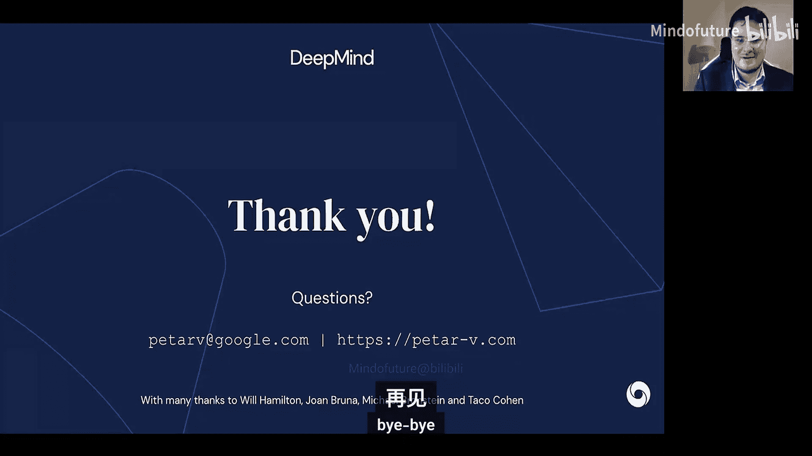

因此，现在的问题是，在这种情况下最好的聚合器是什么？在Gabriela Corso、Luca Cavalleri等人提出的主邻域聚合论文中，我们实际上证明了不存在一个最好的聚合器。为了区分大小为N的邻域（当特征是连续的），您至少需要N个聚合器来完全区分它们。请查看这篇论文，在我看来，它有一个非常酷的证明，依赖于著名的Borsuk-Ulam定理。在