# 008：自监督学习进展

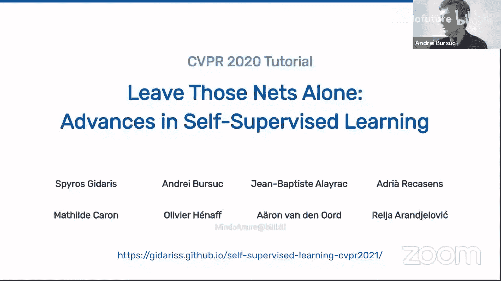

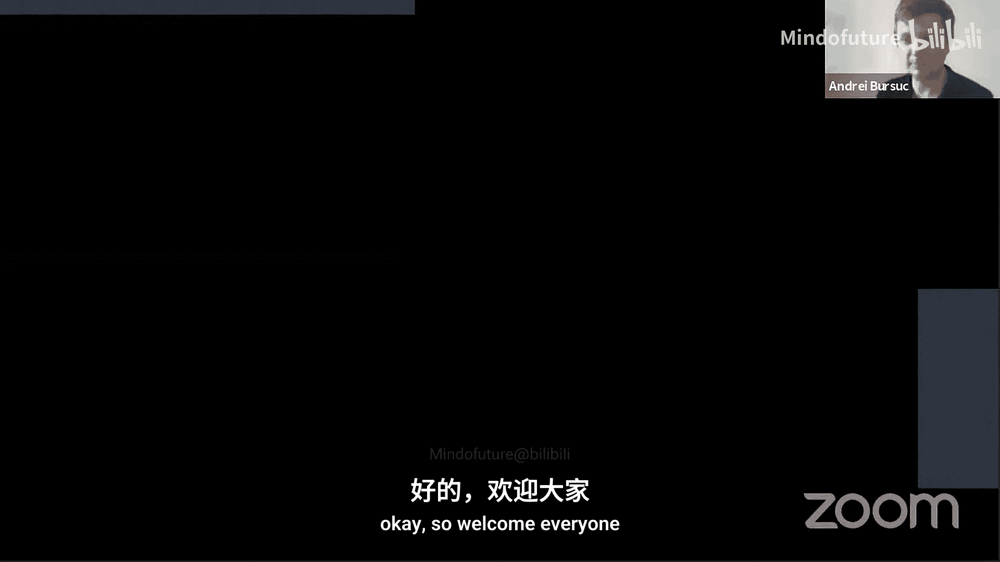

在本节课中，我们将要学习自监督学习的基本概念、动机、核心方法及其在多模态数据上的应用。我们将从自监督学习的定义出发，探讨其如何克服监督学习的局限性，并深入介绍对比学习、师生特征预测以及聚类方法等核心自监督技术。

## 概述

自监督学习是一种无监督学习形式，其核心思想是利用数据本身生成监督信号，而非依赖人工标注。本节将介绍自监督学习的动机、基本流程和评估方法。

### 自监督学习的动机

监督学习与深度学习的结合在过去十年中取得了巨大成功，尤其在计算机视觉任务中表现出色。然而，监督学习依赖于大量、多样且经过精心标注的数据，这在实践中面临诸多挑战。

**数据获取与标注的困难**
获取大规模标注数据集（如ImageNet）通常需要大量的人力、时间和资金投入。例如，为一张高分辨率图像进行语义分割标注可能需要约1.5小时。此外，标注过程容易产生人为错误，且难以对标注噪声进行建模。

**数据分布偏移**
现实世界中的数据是动态变化的。例如，时尚趋势、游戏画面或传感器技术都会随时间演变。如果算法仅针对特定时期的数据进行训练，当面对新数据时，其性能可能会显著下降。持续重新标注数据不仅成本高昂，而且效率低下。

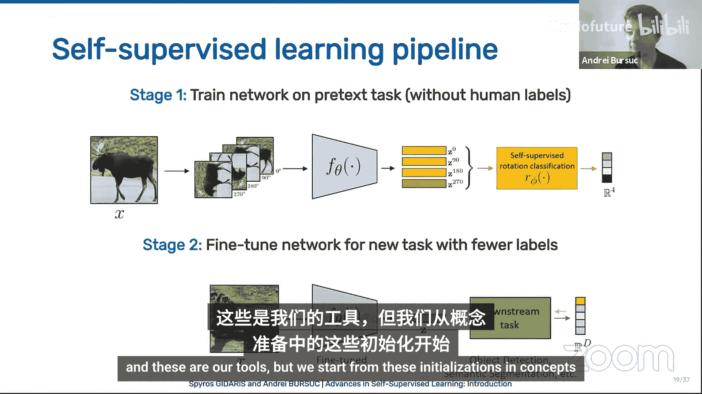

**监督信号可能引入偏差**
即使拥有大量标注数据，监督学习学到的表征也可能存在偏差。例如，在图像分类任务中，网络可能过度依赖纹理信息而非物体形状进行判断，这限制了其学习到更通用、有用的表征。

**自然语言处理中的成功先例**
在自然语言处理领域，自监督学习（如掩码语言建模）已取得显著成功，模型通过预测被掩码的词语或判断句子连贯性，从未标注文本中学习到了强大的语言表征。这启发了在视觉领域应用类似的思想。

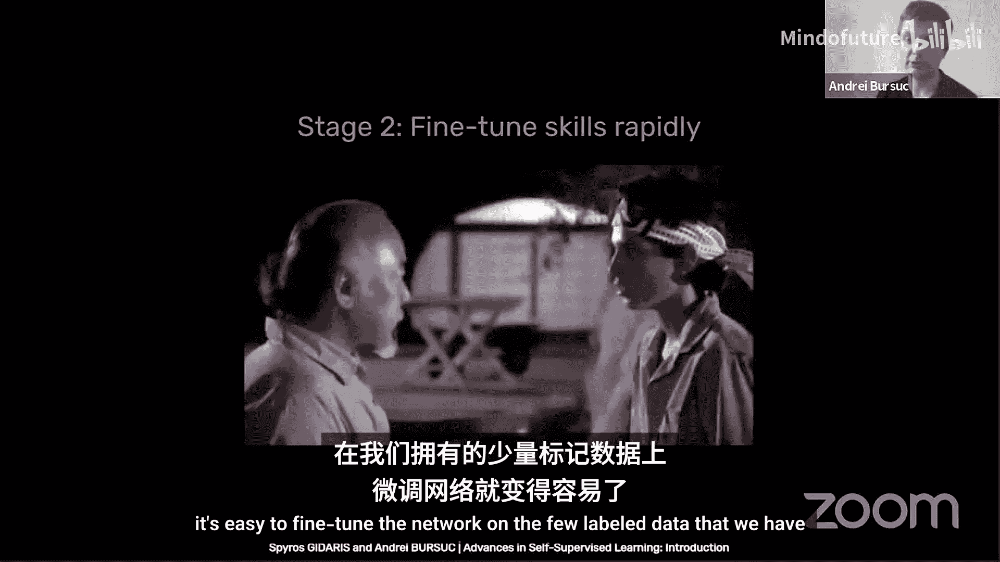

**自监督学习的核心目标**
自监督学习旨在利用大量未标注数据，通过设计“前置任务”让模型学习数据的内在结构和有用表征，从而减少对昂贵人工标注的依赖，并学习到更通用、任务无关的特征。

### 什么是自监督学习？

自监督学习是无监督学习的一种形式，其中监督信号由数据自身提供，而非来自人类标注。其典型流程包含两个阶段：

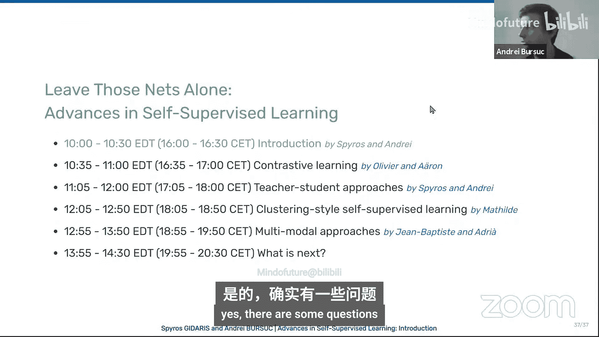

1.  **前置任务训练阶段**：在此阶段，我们定义一个“前置任务”，该任务不需要人工标签。例如，预测图像的旋转角度、重构图像的缺失部分或颜色化灰度图像。模型通过解决此任务来学习数据的有用表征。
2.  **下游任务微调阶段**：将第一阶段学到的编码器（或其特征）用于实际关心的下游任务（如分类、检测）。此时，我们可以利用少量标注数据进行微调或直接训练一个简单的分类器（如线性分类器）。

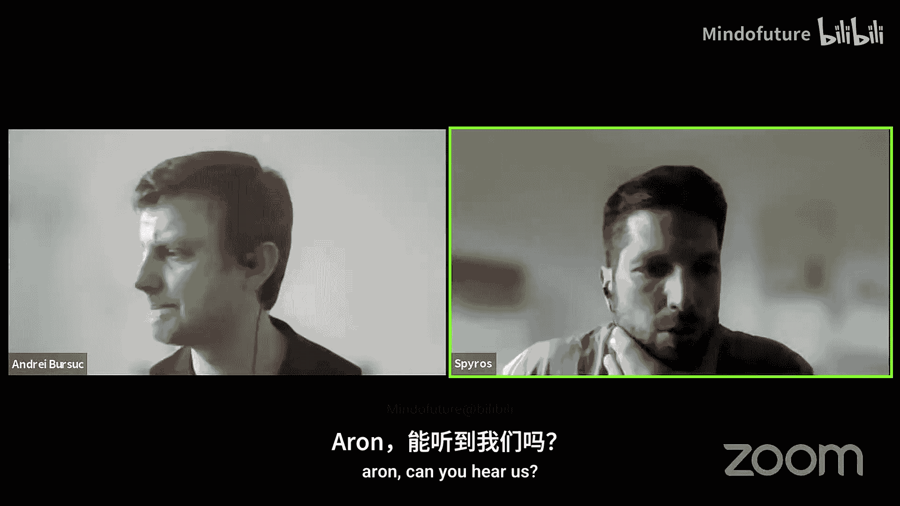

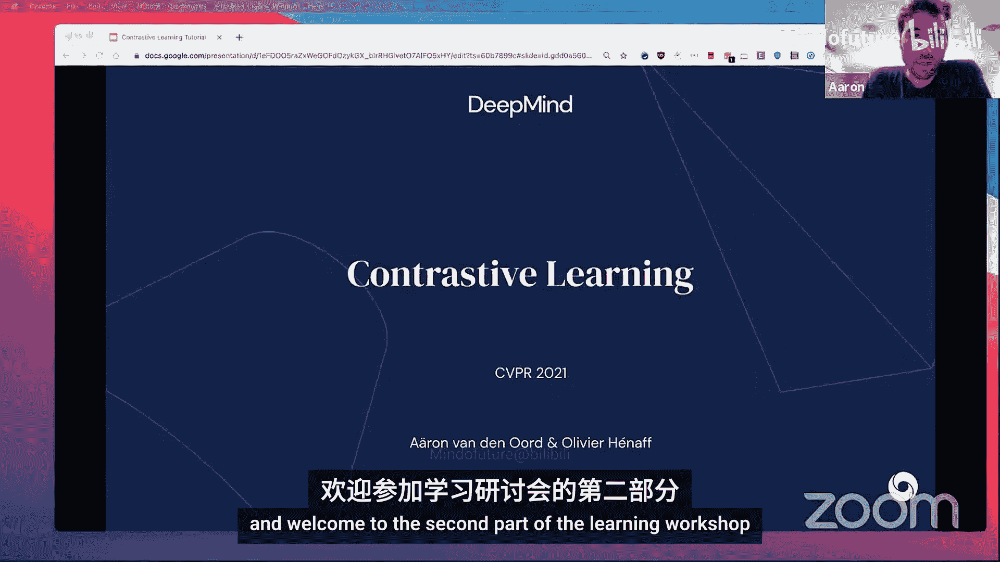

一个经典的前置任务是**旋转预测**：假设所有图像都是正向的，我们将其旋转0°、90°、180°或270°，然后训练一个四分类器来预测所应用的旋转角度。通过这个看似简单的任务，网络被迫学习图像中更本质的视觉线索。

### 自监督学习流程

自监督学习通常遵循一个两阶段流程：

1.  **第一阶段：前置任务训练**
    *   在大量未标注数据上训练一个编码器网络，使其能够解决前置任务（如图像旋转预测）。
    *   训练完成后，保留编码器部分，移除与前置任务相关的特定输出层（如旋转分类器）。

2.  **第二阶段：下游任务适应**
    *   将第一阶段得到的编码器应用于下游任务。
    *   如果下游任务数据量少，可以冻结编码器，仅在其输出特征上训练一个线性分类器（线性评估）。
    *   如果下游任务数据量较多或更复杂（如目标检测、语义分割），可以在编码器基础上添加任务特定的解码器或头部，并对整个模型进行微调。

### 评估协议

为了比较不同自监督方法的性能，研究者们通常采用以下几种评估协议：

1.  **线性分类评估**：将预训练好的编码器冻结，仅在其输出的特征上训练一个线性分类器（如逻辑回归）。这是一种简单直接的方式，用于评估特征本身的质量。常用数据集包括ImageNet、Places、VOC等。
2.  **标注高效分类**：也称为半监督学习评估。首先在全部未标注数据上进行自监督预训练，然后仅使用一小部分（如1%或10%）的标注数据对模型进行微调。这能有效评估方法在标注数据稀缺时的表现。
3.  **迁移学习**：将预训练编码器用于更复杂的下游任务，如目标检测（PASCAL VOC， COCO）或语义分割（Cityscapes）。通常会对编码器及任务特定模块进行端到端的微调。

### 自监督学习为何有效？

一个生动的比喻来自电影《龙威小子》。主角Daniel想学空手道，师傅Mr. Miyagi却让他完成刷漆、打磨等日常杂务。Daniel感到沮丧，认为没有学到任何功夫。然而，在后续的冲突中，他发现自己无意中运用了做杂务时练就的动作进行防御。在这里：
*   **Mr. Miyagi（师傅）**：相当于深度学习研究者。
*   **Daniel（学生）**：相当于待训练的模型。
*   **日常杂务（前置任务）**：相当于自监督学习的前置任务（如旋转预测）。
*   **学习空手道（下游任务）**：相当于我们最终关心的视觉任务（如物体识别）。

自监督学习的目标就是设计那些能有效为下游任务做准备的“日常杂务”（前置任务）。

---

## 对比学习

上一节我们介绍了自监督学习的整体框架和动机，本节中我们来看看其中一种核心方法——对比学习。对比学习通过拉近相似样本、推远不相似样本来学习表征。

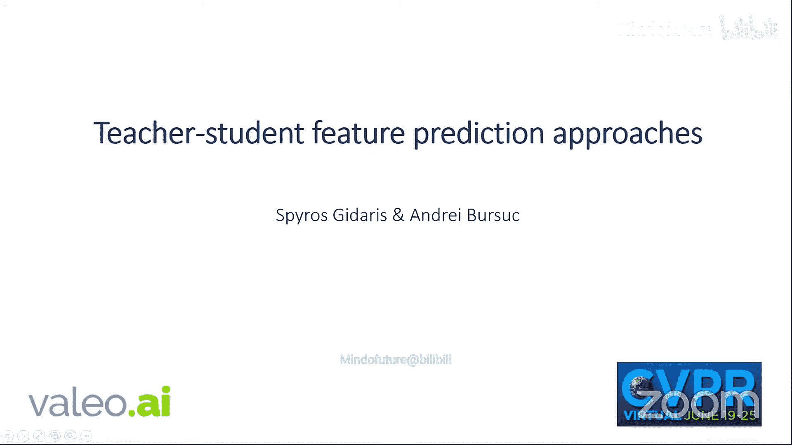

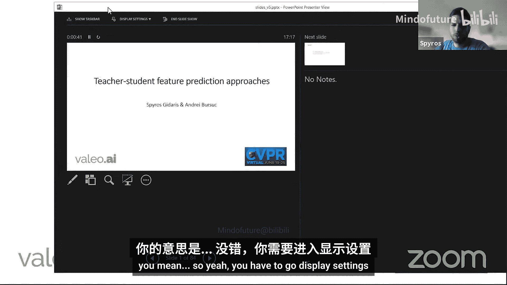

### 什么是对比学习？

对比学习是一种通过比较数据点来学习表征的方法。其核心思想是：对于一个锚点样本，我们希望其与正样本（相似的样本）在表征空间中的距离更近，而与负样本（不相似的样本）的距离更远。

一个非正式的定义如下：给定一个图像 \(x\)，我们采样一个正样本 \(x^+\) 和一个负样本 \(x^-\)。然后，我们训练一个评分函数 \(s\)，使得 \(s(x, x^+) > s(x, x^-)\)。

### 常见的对比损失函数

以下是几种经典的对比损失函数：

1.  **成对损失**：早期方法，分别处理正负样本对。对于正样本对，最小化它们的距离；对于负样本对，如果它们在某个阈值范围内，则将其推开。
    *   **公式**：\(L = \begin{cases} \|f(x) - f(x^+)\|^2 & \text{if positive pair} \\ \max(0, \epsilon - \|f(x) - f(x^-)\|^2) & \text{if negative pair} \end{cases}\)

2.  **三元组损失**：同时考虑锚点、正样本和负样本。希望正样本与锚点的距离加上一个边际值后，仍小于负样本与锚点的距离。
    *   **公式**：\(L = \max(0, \|f(x) - f(x^+)\|^2 - \|f(x) - f(x^-)\|^2 + \text{margin})\)

3.  **InfoNCE损失**：目前最常用的对比损失之一，基于噪声对比估计。它使用一个正样本和多个负样本，通过softmax分类来区分正样本。
    *   **公式**：\(L = -\log \frac{\exp(s(x, x^+) / \tau)}{\exp(s(x, x^+) / \tau) + \sum_{i=1}^{N} \exp(s(x, x_i^-) / \tau)}\)
    *   其中，\(s(x, y)\) 通常是特征向量的点积或余弦相似度，\(\tau\) 是温度超参数，用于控制分布的尖锐程度。

### 对比学习的三种视角

我们可以从不同角度理解对比学习为何有效：

1.  **几何视角**：对比学习在单位超球面上优化表征，使得相似样本的特征彼此对齐（靠近），同时所有样本的特征在球面上尽可能均匀分布。这最大化了特征空间的信息保留，并使得不同类别的特征易于线性分离。

2.  **语言模型视角**：在自然语言处理中，当词汇表非常大时，直接使用softmax计算下一个词的概率开销巨大。噪声对比估计通过采样负样本来近似这个分布。类似地，在图像对比学习中，我们将所有可能的图像视为一个巨大的“词汇表”，使用神经网络将像素映射为特征，并通过采样来近似数据分布。

3.  **信息论视角**：对比学习可以被视为最大化正样本对之间的互信息的下界。然而，互信息本身并不能完全解释为何能学到有用的表征。关键在于前置任务的设计：我们需要构建正样本对，使得它们之间共享我们希望模型学习的高级语义信息（如物体类别），同时尽可能消除低级、干扰性的信息（如具体像素值、颜色直方图、JPEG伪影等）。数据增强在此扮演了关键角色。

### 数据增强的重要性

数据增强是构建有效正样本对的核心。理想的数据增强应该：
*   **保留高级语义信息**：例如，裁剪后的图像仍然包含完整的物体。
*   **消除低级干扰信息**：例如，颜色扰动可以减弱模型对特定颜色的依赖。
*   **避免过度增强**：过度的增强（如过度缩放）可能会破坏语义信息，使任务过于困难或无法解决。

研究表明，存在一个最优的数据增强强度。不同的下游任务可能需要不同的增强策略。

### 实例判别任务

在自监督学习中，一个常见的对比学习前置任务是**实例判别**：将同一图像的不同增强视图视为正样本对，将不同图像的视图视为负样本对。模型需要学习将同一实例的不同视图映射到相似的特征，而将不同实例的视图映射到不同的特征。

---

## 师生特征预测方法

上一节我们探讨了基于对比的自监督学习，本节我们将关注另一类方法——师生特征预测。这类方法通过让一个学生网络预测教师网络生成的特征目标来学习表征，通常无需负样本。

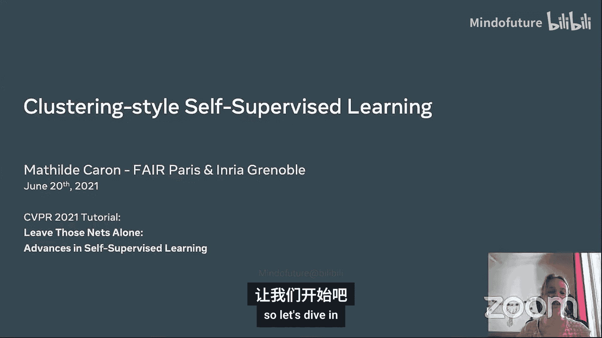

### 从输入重构到特征重构

早期的自监督方法多基于输入重构，例如去噪自编码器、上下文自编码器（预测缺失区域）或图像颜色化。这些方法的直觉是，为了重构输入，模型必须理解图像内容。然而，它们存在局限性：
*   **任务可能太简单**：如去噪，模型可能仅利用低级线索即可解决。
*   **任务可能太困难或模糊**：如像素级重构，迫使模型关注不必要的低级细节，而这些细节对高层语义理解可能并无帮助。

特征重构方法应运而生，其核心思想是：**重构高级特征而非原始像素**。假设教师网络生成的特征目标编码了高级视觉概念，那么学生网络预测这些特征将是一个更简单且更有意义的任务。

### 师生框架概述

在师生框架中，我们有两个网络：教师网络和学生网络。
1.  给定一张图像，教师网络为其生成一个目标特征向量。
2.  学生网络接收同一图像的不同随机增强视图作为输入，并尝试预测教师网络生成的目标特征。
3.  通过最小化学生预测与教师目标之间的重构损失（如均方误差、余弦距离或交叉熵）来训练学生网络。

这种方法的一个关键优势是：学生必须为同一图像的不同增强视图预测相同的目标特征，从而被迫学习对增强不变的表征。同时，它通常不需要像对比学习那样使用负样本。

### 知识蒸馏与自监督师生方法的区别

师生方法也常用于知识蒸馏，但自监督中的师生框架有所不同：
*   **知识蒸馏**：拥有一个强大的、监督预训练的教师网络，目标是训练一个更小的学生网络以匹配教师性能。
*   **自监督师生**：没有现成的强大教师。教师可能是一个弱模型，目标是训练一个与教师同规模甚至更强的学生网络，使其表征质量超越初始教师。

### 代表性方法

以下是几种重要的师生特征预测方法：

1.  **BoWNet**：该方法使用自监督预训练的网络（如RotNet）作为教师，从图像中提取局部特征，并将其量化为视觉词汇，形成词袋表示。学生网络的任务是预测图像的词袋表示。通过迭代更新学生和教师，表征得到增强。然而，它依赖于一个静态的、预训练的教师。

2.  **BYOL**：这是一个完全在线的方法，无需预训练教师。教师和学生的权重初始相同。教师网络通过学生权重的指数移动平均进行更新。学生网络包含一个额外的预测头，用于预测教师网络的特征。BYOL 避免了特征坍塌，且对批量大小和数据增强的鲁棒性较强。

3.  **DINO**：该方法也采用动量教师和停止梯度策略。它使用交叉熵损失，并对教师输出进行中心化和锐化操作以防止坍塌。DINO 与视觉变换器结合时表现出色，并能产生具有语义意义的注意力图。

4.  **Barlow Twins**：该方法不属于严格的师生框架，但思想相关。它通过比较同一图像两个增强视图的特征，并最小化其跨相关矩阵与单位矩阵的差异来学习表征。其目标是令特征内部维度之间去相关，同时令对应维度高度相关。

### 如何避免特征坍塌？

特征坍塌是指所有输入都被映射到相同的输出特征，导致模型无法学到有用信息。在师生方法中，避免坍塌是关键。不同方法采用了不同策略：
*   **BYOL**：动量更新和预测头的组合被证明是关键。
*   **DINO**：对教师输出进行中心化和锐化。
*   **Barlow Twins**：通过设计损失函数直接约束跨相关矩阵。
*   **SimSiam**：研究发现，停止梯度和预测头是避免坍塌的充分条件，动量教师并非必需但能提升性能。

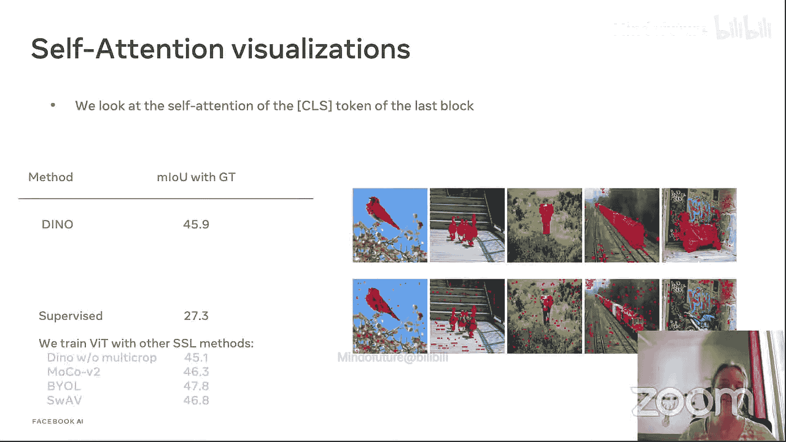

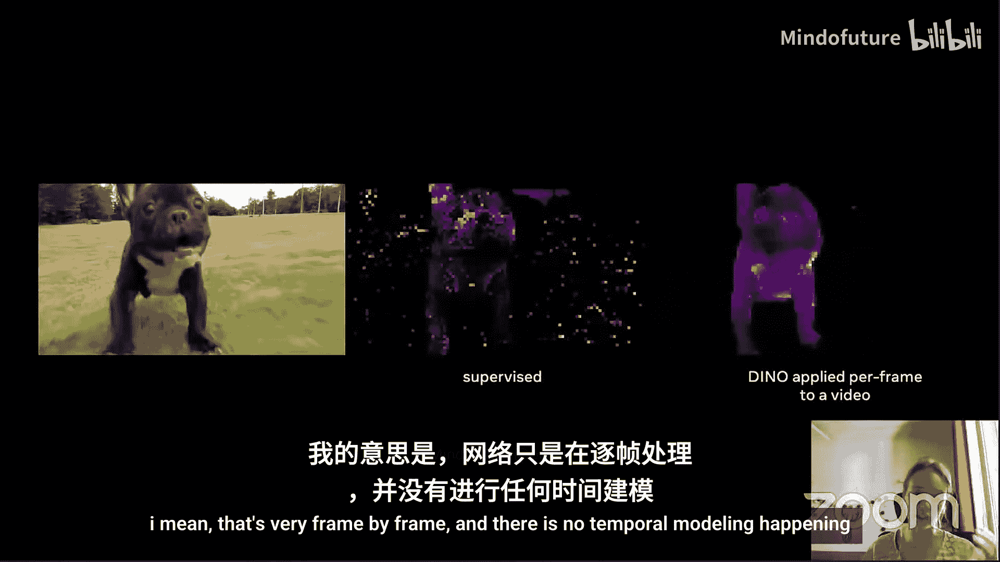

### 方法对比与评估

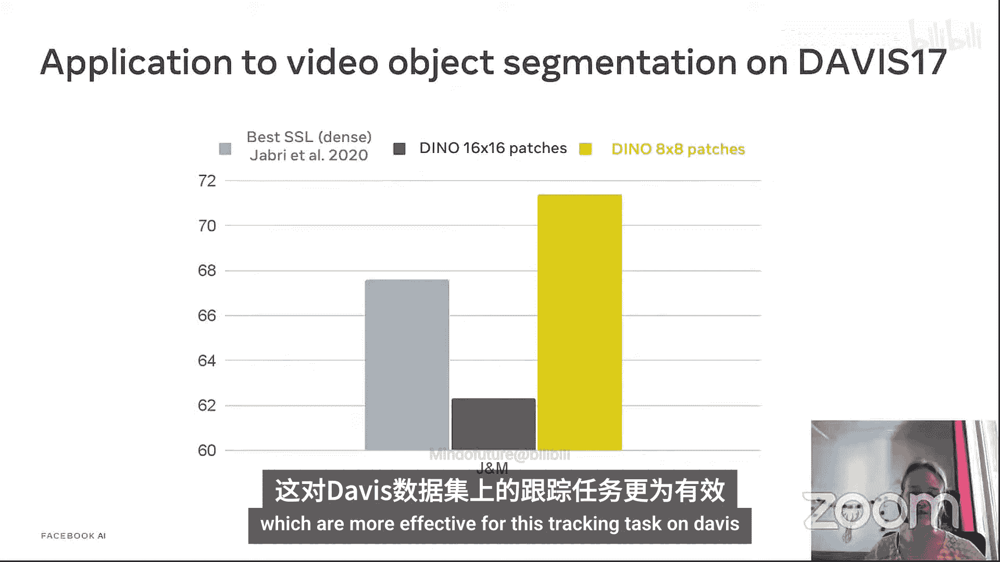

特征预测方法在多项基准测试中取得了与对比方法相媲美甚至更优的性能，尤其是在线性评估和迁移学习任务上。它们通常对批量大小不那么敏感，计算效率可能更高。

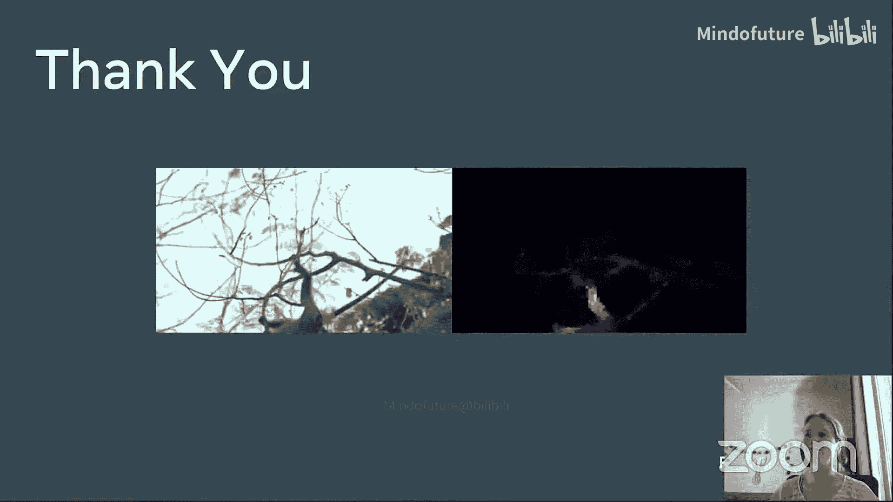

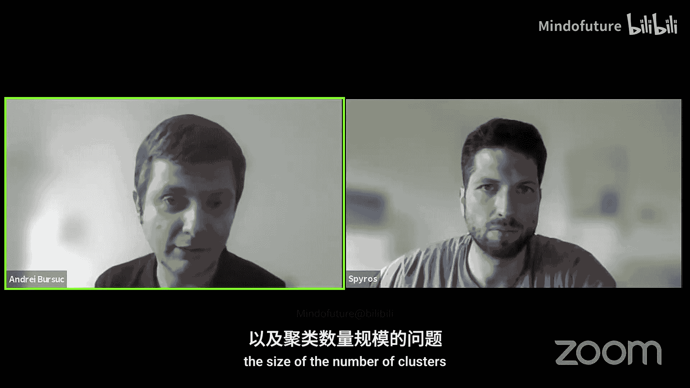

---

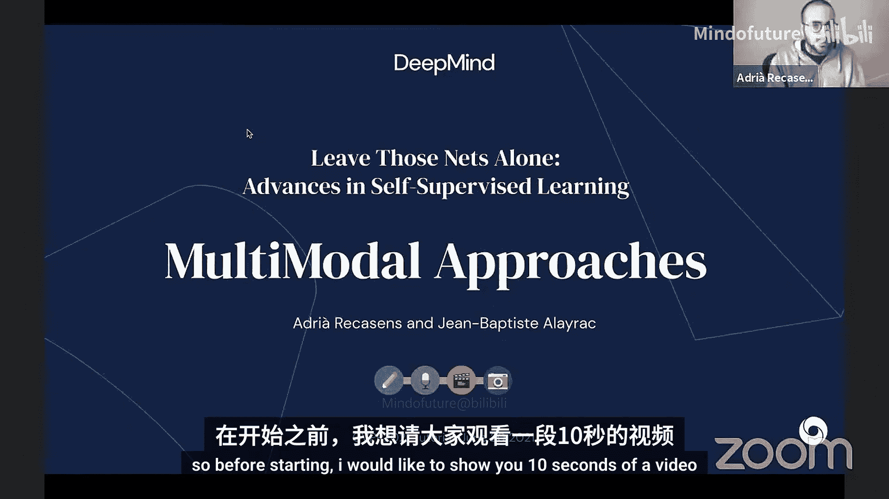

## 聚类方法

上一节我们介绍了师生特征预测方法，本节我们将探讨另一类重要的自监督学习范式——基于聚类的方法。这类方法通过将数据特征聚类，并将聚类分配作为伪标签来训练网络。

### 深度聚类

深度聚类是此类方法的开创性工作。其核心思想是模仿监督分类，但在无标签情况下使用聚类产生的伪标签。
1.  **聚类步骤**：使用当前网络为整个数据集提取特征，然后对这些特征进行K-means聚类，得到每个图像的伪标签（聚类ID）。
2.  **分类步骤**：利用这些伪标签，像监督学习一样训练网络进行“分类”，即预测聚类ID。
3.  **迭代**：重复以上两个步骤，网络特征和聚类结果相互促进，逐步改进。

深度聚类证明了使用聚类进行自监督学习的可行性，但其存在局限：需要在整个数据集上进行离线聚类，难以扩展到超大数据集；并且需要一些启发式技巧来防止所有样本塌缩到同一个聚类。

### 在线聚类：SwAV

为了克服深度聚类的扩展性问题，SwAV 提出了一种在线聚类方法。
1.  **在线分配**：SwAV 不再对整个数据集进行聚类，而是在每个小批量内，将样本特征分配给一组可学习的原型向量。这个分配过程通过解决一个最优运输问题来实现，同时约束每个原型被分配的频率大致相同。
2.  **交换预测**：对于同一图像的两个不同增强视图，SwAV 要求用一个视图的特征分配（伪标签）来预测另一个视图的特征分配。
3.  **多裁剪策略**：SwAV 引入了“多裁剪”策略，使用多个不同尺度的裁剪视图，特别是利用局部小裁剪来预测全局大裁剪的分配，这增强了模型学习局部到全局一致性的能力。

SwAV 实现了完全在线训练，无需存储大量特征或进行离线聚类，从而能够处理任意规模的数据集，并在多项基准上取得了当时领先的性能。

### 视觉变换器与自监督：DINO

DINO 方法将师生框架与聚类思想结合，并在视觉变换器架构上取得了卓越性能。
1.  **自蒸馏**：DINO 训练一个学生网络去匹配一个教师网络的输出。教师网络的参数是学生网络参数的指数移动平均。
2.  **避免坍塌**：通过对教师输出进行中心化（减去批次均值）和锐化（使用低温度的softmax）来防止特征坍塌到均匀分布或单点。
3.  **与视觉变换器的协同**：DINO 与视觉变换器结合时，不仅在线性评估上表现优异，其产生的特征在K近邻分类中表现极佳，并且网络的自注意力图能够清晰地聚焦于图像中的语义主体，实现了良好的可解释性。

DINO 展示了自监督学习与新型架构结合的巨大潜力，并为密集预测任务（如视频对象分割）提供了高质量的特征。

### 聚类方法的优缺点

**优点**：
*   无需显式构造负样本对。
*   将问题转化为标准的分类问题，可以利用成熟的监督学习技巧。
*   某些离线方法对批量大小要求不高。

**缺点**：
*   离线方法（如深度聚类）需要多次遍历数据集进行聚类，扩展性差。
*   需要防止聚类坍塌（如空簇或单一大簇），通常需要一些启发式技巧。
*   在线方法（如SwAV）可能对批量大小和优化细节更敏感。

---

## 多模态自监督学习

在前面的章节中，我们主要关注了单模态（如图像）的自监督学习。本节我们将视野扩展到多模态数据（如视频、音频、文本），探讨如何利用不同模态间的自然对应关系进行自监督学习。

### 动机与优势

人类通过多种感官（视觉、听觉等）理解世界，不同模态的信息相互关联、互为补充。例如，在视频中，视觉内容与音频通常是同步且语义对应的。多模态自监督学习旨在利用这种丰富的、免费的跨模态监督信号，学习更强大、更通用的表征。

其优势在于：
*   **更丰富的监督信号**：除了单模态内的增强视图，我们还有来自其他模态的天然对应视图。
*   **学习联合表征空间**：可以学习一个共享的嵌入空间，其中不同模态的语义相似内容靠近。
*   **互补性**：某些模态可能提供另一些模态缺失的信息，促进更全面的理解。

### 评估设置

多模态自监督学习的评估遵循类似单模态的流程：
1.  **预训练**：在大型未标注多模态数据集（如带有音频和/或自动生成文本的视频）上训练模型。
2.  **评估**：在下游任务上评估学到的表征，常用任务包括：
    *   **视频动作分类**：如UCF101， HMDB51， Kinetics。
    *   **音频分类**：如AudioSet， ESC-50。
    *   **跨模态检索**：给定一种模态的查询，检索另一种模态的相关内容。

评估协议同样包括K近邻、线性评估、微调等。

### 多模态对比学习

多模态对比学习将单模态对比学习的思想扩展到跨模态场景。

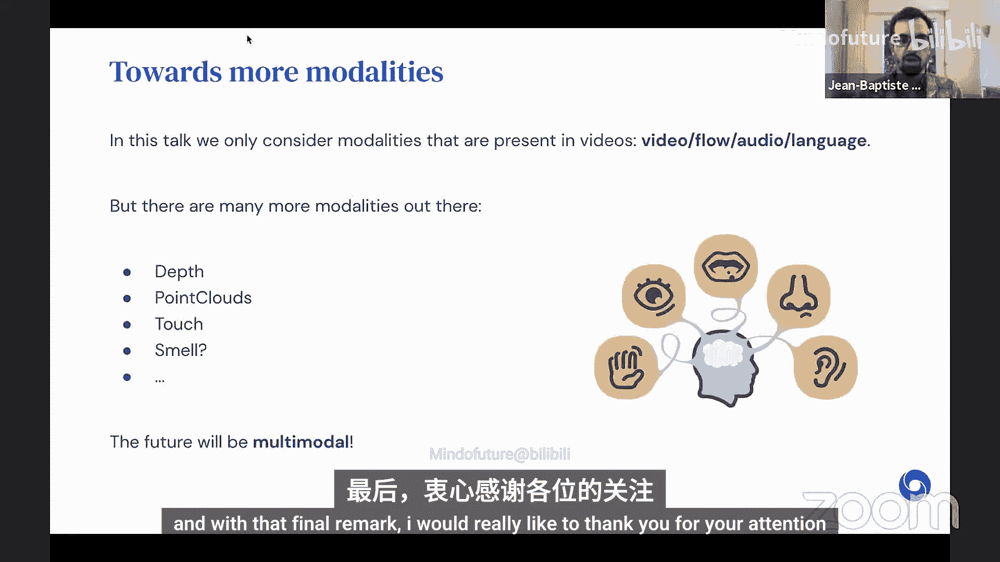

**核心思想**：拉齐共同出现的不同模态样本（正样本对）的表征，推远不相关模态样本（负样本对）的表征。

**示例方法：MMV**：
*   **目标**：从视频、音频和文本中学习联合表征。
*   **方法**：使用InfoNCE损失，最大化视频-音频、视频-文本等正样本对的相似度，最小化与负样本的相似度。
*   **关键设计**：探索了不同的嵌入空间策略，如共享空间、分离空间和层次化空间，以更好地处理不同模态对之间粒度差异（如视频-音频更细粒度，视频-文本更粗粒度）。

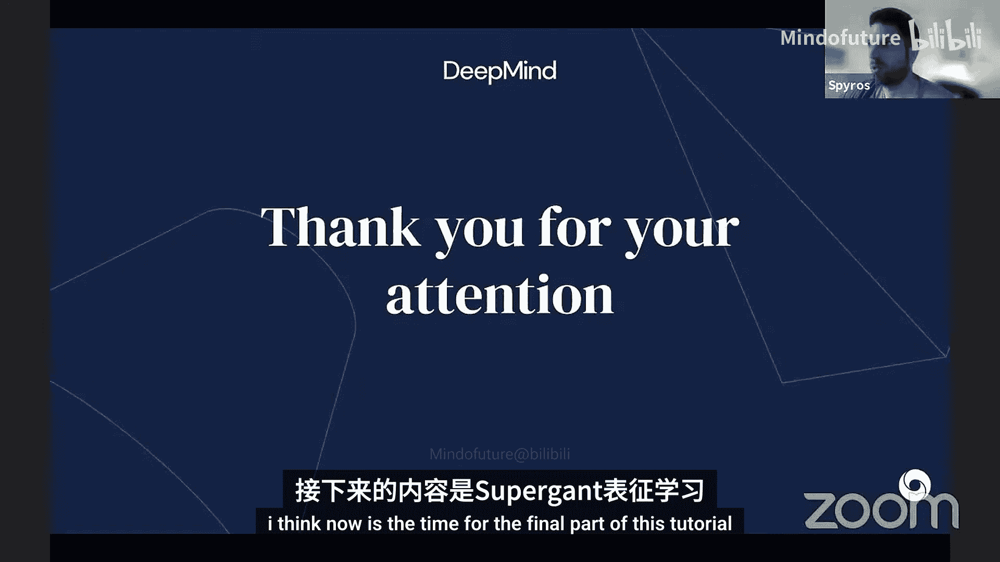

### 多模态师生特征预测

这类方法通过让一个网络预测另一个网络（或另一个模态）的特征来进行学习。

**示例方法：BraVe**：
*   **目标**：从视频、光流和音频中学习表征。
*   **方法**：采用不对称的师生框架。给定一个视频的“窄视图”（短时长高分辨率），让学生网络预测其“广视图”（长时长低分辨率）的特征，反之亦然。教师网络通过动量更新。广视图可以使用不同的模态（如RGB、光流、音频）。
*   **优势**：无需负样本，通过时间上下文预测任务学习到了强大的表征，在视频和音频任务上都达到了先进水平。

### 多模态聚类方法

将聚类思想应用于多模态数据，利用跨模态一致性生成伪标签。

**示例方法：XDC**：
*   **目标**：从视频和音频中学习表征。
*   **方法**：扩展了深度聚类的思想。探索了多种聚类预测策略：
    *   **单模态聚类**：各自聚类，各自监督。
    *   **多模态聚类**：聚类时融合多模态特征，或用一种模态的聚类标签监督另一种模态。
    *   其中，**跨模态深度聚类**表现最佳：分别对视频和音频特征进行聚类，然后用音频的聚类标签监督视频网络，用视频的聚类标签监督音频网络。

### 挑战与良好实践

**挑战**：
*   **计算成本**：处理视频等时序数据计算量巨大。
*   **模态缺失**：现实数据中可能某些模态缺失，需要设计能处理不完整模态的模型。
*   **评估标准化**：需要更统一、全面的评估基准，避免过拟合到少数数据集。

**良好实践**：
*   **详细报告**：清晰说明训练数据、模态、网络架构、超参数和评估细节。
*   **共享资源**：发布代码和预训练模型，促进可复现性和应用。
*   **探索高效方法**：研究在有限计算资源下有效的自监督方法。
*   **推动新基准**：采用更大、更多样的数据集进行评估，并关注线性评估、KNN等轻量评估方式以减少调参影响。

---

## 未来方向与总结

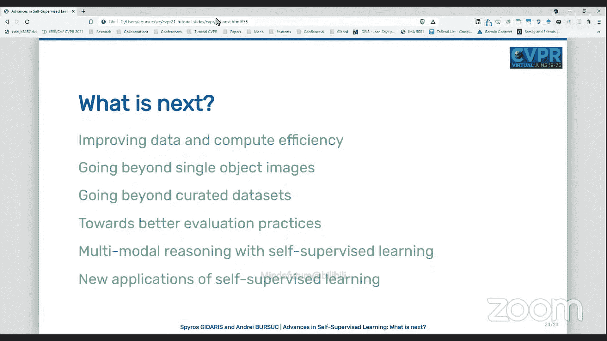

在本教程中，我们一起深入探讨了自监督学习的动机、核心方法（对比学习、师生预测、聚类）及其在多模态领域的应用。自监督学习通过挖掘数据内在结构，显著减少了对人工标注的依赖，并学习到了更通用、更鲁棒的表征。

### 未来研究方向

尽管自监督学习取得了巨大进展，但仍有许多开放问题和研究方向：

1.  **提升数据与计算效率**：当前许多方法需要非常长的训练时间和大规模批量。研究更高效的算法、更智能的数据利用策略是重要方向。
2.  **超越单物体图像**：大多数方法在ImageNet类数据集上开发，其中通常有一个主导物体。如何将自监督学习有效应用于复杂场景（如自动驾驶、医疗影像），其中可能包含多个物体或无显著物体，是一个挑战。
3.  **处理非平衡与噪声数据**：现实世界的数据通常是长尾分布、充满冗余和噪声的。研究如何在这种数据上进行有效的自监督学习，或如何选择信息量最大的样本进行学习，具有实际意义。
4.  **开发更全面的评估体系**：避免过拟合到少数几个基准数据集，建立更广泛、更挑战性的评估协议，例如使用小样本学习协议或在更多样化的下游任务上进行测试。
5.  **深度融合多模态**：不仅利用多模态进行预训练，更探索如何让多模态在推理时协同工作，实现更鲁棒的环境感知与理解。
6.  **探索新应用场景**：例如，在测试时利用自监督任务进行模型自适应，以应对领域漂移；或将自监督学习应用于机器人学、强化学习等更广泛的领域。

### 总结

自监督学习已成为表征学习领域最具活力的方向之一。从最初的启发式前置任务，到如今理论相对扎实的对比学习、师生框架和聚类方法，其性能已逼近甚至在某些方面超越了监督学习。随着对模型架构、数据增强和训练动力学的深入理解，以及向多模态、大规模数据的拓展，自监督学习有望成为构建下一代通用人工智能系统的基石。我们鼓励研究者不仅追求更高的性能数字，也关注方法的效率、可解释性、公平性和在新领域中的应用潜力。