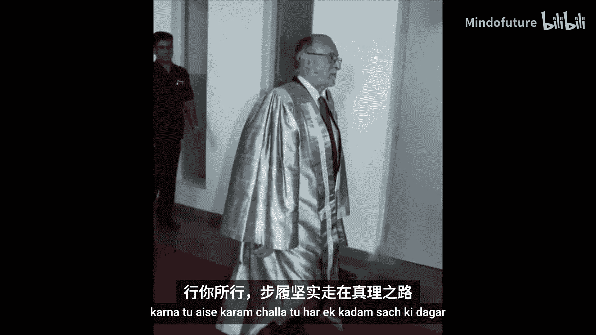
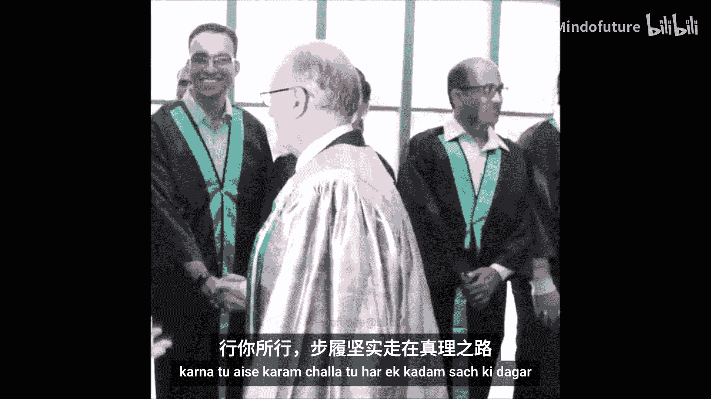
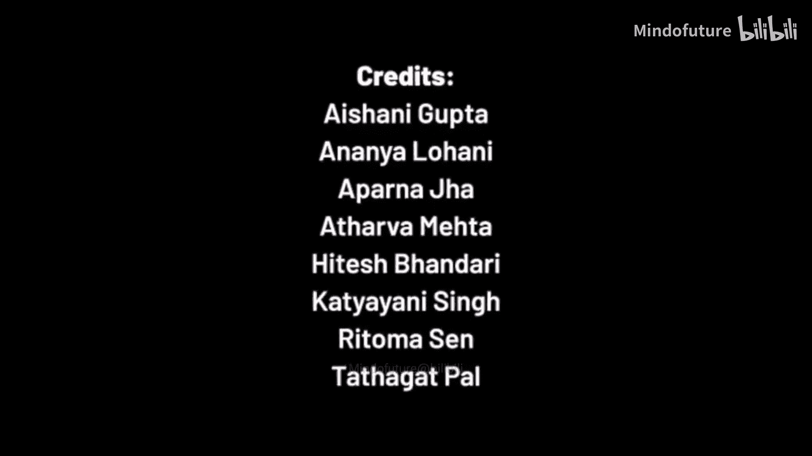
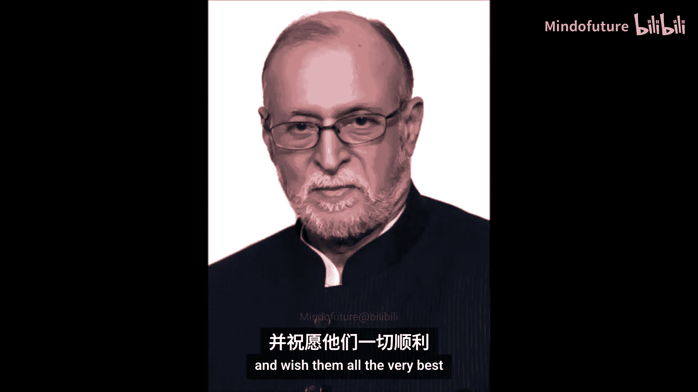

# 010：IIIT德里第十届毕业典礼

## 概述
在本节课中，我们将一起回顾印度信息技术学院德里分校（IIIT Delhi）第十届线上毕业典礼的完整流程与核心内容。我们将学习毕业典礼的标准结构、致辞要点以及其中体现的教育理念与科技愿景。

---

## 典礼开幕与校长致辞

典礼以传统的祈福歌曲开始，随后由主席宣布典礼正式开始。

接下来，学院院长（Director）作年度报告。他首先向所有与会者表示欢迎，并特别感谢了首席嘉宾Gagandeep Kang教授和名誉校长（Chancellor）的出席。

**年度报告核心内容如下：**

*   **毕业生情况**：本年度共授予345个学士学位、204个硕士学位、1个双学位以及26个博士学位。
*   **师资力量**：学院致力于吸引和保留最优秀的教师。去年新增的11名教员中，9名拥有海外博士或博士后经验，超过35%的新教员为女性。多名教员入选全球前2%科学家榜单。
*   **科研成果**：去年共发表超过478篇研究论文，并获得多项最佳论文奖和国家级研究资助。
*   **研究中心与创新**：学院成立了多个研究中心，例如可持续交通中心、医疗保健卓越中心、生物信息学中心等，致力于解决德里及国家首都区的现实挑战。
*   **产业与国际化合作**：学院与多家国内外大学及企业签署了谅解备忘录（MOU），以拓展国际联系并加强产学研结合。
*   **学生支持与成就**：学院加强了学生导师计划，改革了迎新项目。尽管受疫情影响，本年度学生仍获得了618份工作录取通知，并有大量学生选择前往海外顶尖大学深造。学生们在各类竞赛中屡获殊荣。
*   **社会责任**：学院积极承担社会责任，例如教师协助开发了“德里新冠”应用程序，并举办了关注可持续发展的年度数字德里领袖会议。
*   **排名与荣誉**：学院在多项国内和国际排名中表现优异，例如在QS亚洲大学排名中位列前500，在印度《今日》杂志的政府工程学院排名中位列第13。

院长在报告结尾向毕业生致辞，赞扬他们在充满挑战的时期所展现的韧性与学习热情，并鼓励他们成为富有同情心、致力于解决问题和推动社会变革的未来领袖。

---

## 名誉校长致辞

由于 unforeseen circumstances，名誉校长未能亲自出席，其致辞由他人代为宣读。

致辞首先祝贺了所有毕业生和获奖者，并特别肯定了大家在疫情期间坚持学习的努力。

**致辞的核心观点围绕“教育的未来”展开：**

1.  **在线教育的机遇**：疫情迫使全球教育体系转向线上，这虽然带来了挑战，但也 democratized education，使教育变得更加可及和普惠。这符合印度2020年国家教育政策（NEP 2020）的愿景。
2.  **在线教育的挑战**：需要警惕完全线上模式可能带来的问题，如数字鸿沟、缺乏 physical contact 和社交互动，以及过度使用数字屏幕可能引发的健康问题。家长和教师有责任帮助学生 achieve a healthy balance。
3.  **对毕业生的期望**：毕业生应持续培养 ingenuity（创造力）、innovation（创新）和 integrity（正直）的品质，利用所学知识 transform personal lives, society and the nation。

致辞最后肯定了IIIT德里在教学质量、研究和跨学科研究方面取得的卓越声誉，并鼓励学院在现有成就的基础上追求更高的目标。

---

## 董事会主席致辞

董事会主席 Kiran Karnik 先生向2021届毕业生致以特别问候，并指出第十届毕业典礼是一个重要的里程碑。

**他的致辞主要包含以下几层含义：**

1.  **肯定 resilience**：他赞扬了学生、教职员工在疫情这一艰难时期展现出的 resilience（韧性）。大家成功 transition 到在线教学模式，并保持了学术质量和严谨性。
2.  **汲取 life lessons**：他鼓励学生将这些艰难时期视为学习“人生课程”的机会，包括 resilience、团队合作和关心他人。
3.  **展望未来与技术角色**：他乐观地认为最困难的时期已经过去。同时，大家亲身体验了技术如何连接世界、支持日常生活。他期望毕业生能利用在IIIT德里学到的技能，推动技术边界，让科技造福更广泛的社区。
4.  **感谢与告别**：他感谢了董事会成员、德里政府一直以来的支持，并特别感谢了名誉校长。最后，他叮嘱毕业生永远记住IIIT德里是他们的 family，鼓励他们保持联系，并祝愿他们在未来取得成功。

---

## 首席嘉宾演讲

首席嘉宾 Gagandeep Kang 教授是首位当选英国皇家学会院士的印度女性科学家。她的演讲围绕 **科学、奋斗与同理心** 展开。

**她对毕业生提出了三条核心建议：**

1.  **建立你的科学殿堂**：必须以 evidence-driven（证据驱动）和 science-based（基于科学）的方式应对挑战。她以疫情期间一些未经证实的治疗方法为例，强调了 critical thinking（批判性思维）和依据证据做决策的重要性。这不仅适用于医学，也适用于所有领域。
    > **公式**：`决策 = 批判性思维(证据)`
2.  **拥抱奋斗**：真正的创新和突破往往源于失败和反复尝试。不要因为害怕失败而选择容易解决的问题。**Struggle（奋斗）和 failure（失败）正是我们成长的时刻。**
3.  **培养同理心**：她指出，社会常将成功定义为权力和财富，这令人担忧。她引用了“同理心”的定义：想象自己站在他人的立场，理解其感受的能力。
    > **引用**：“It is a stunning act of imaginative daring... to experience the world from that person's perspective.”
    她认为，如果大家能培养这种同理心，就能更好地理解社会需求，并利用自己的技能帮助他人，而不仅仅是追求个人成功。

最后，她总结道，未来充满不确定性，没有绝对安全的道路。但通过扎实的教育和准备，毕业生们完全有能力应对未来的挑战，并成为社会的积极贡献者。

---

## 学位授予与颁奖仪式

此环节由参议院主席（Chairman Senate）主持，正式授予毕业生学位并颁发奖项。

**流程如下：**

1.  **宣读授权与名单**：主席依据章程授予所有符合条件的毕业生相应学位。
2.  **颁发奖章**：宣布并颁发多项学院奖章，包括：
    *   **校长金质奖章**：授予全体BTech项目中成绩最优异的学生。
    *   **学院银质奖章**：分别授予各BTech专业（如ECE, CSE等）中成绩最优异的学生。
    *   **全面发展奖章**：授予在各专业中学术和课外活动综合表现最出色的学生。
    *   **MTech金质奖章**：授予全体MTech项目中成绩最优异的学生。
    *   **最佳博士论文奖**：授予在博士研究中做出卓越工作的毕业生。
3.  **宣读毕业生名单**：按学院和专业，逐一宣读获得学士（BTech）、硕士（MTech）和博士（PhD）学位的毕业生姓名。

---

## 宣誓与典礼闭幕

所有毕业生在主持人的带领下进行庄严的宣誓。

**誓词核心承诺**：维护个人尊严与职业诚信，恪尽职守，诚实无欺，运用所学知识与技术为学院争光，并为国家与全人类服务。

宣誓完毕后，主席正式宣布第十届毕业典礼闭幕。

---

## 总结

本节课中，我们一起学习了IIIT德里第十届毕业典礼的全过程。从开幕致辞、年度报告到嘉宾演讲，我们看到了一个顶尖理工学院对学术卓越、科研创新和社会责任的追求。核心收获包括：
1.  **教育的力量**：即使在疫情等巨大挑战下，高质量的教育和社区支持也能帮助学生成功。
2.  **科技向善**：技术不仅是工具，更应用于解决现实问题、促进社会公平与可持续发展。
3.  **对毕业生的期望**：成为具备**科学精神**（证据与批判思维）、**坚韧品格**（勇于拥抱奋斗与失败）和**同理心**的未来领袖，利用技术专长服务社会。

这场典礼不仅是一场仪式，更是一堂关于教育本质、科技使命与人生价值的生动课程。