# 1： 使用 LeanRL 以光速训练小型强化学习模型

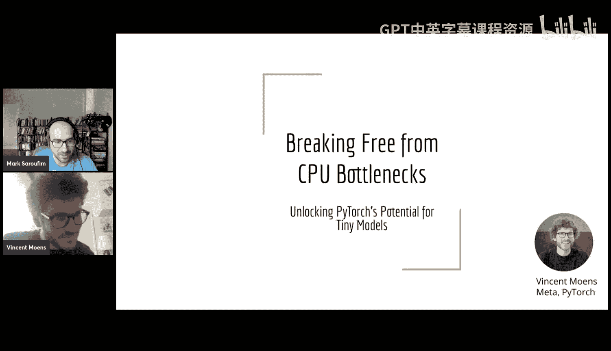

在本节课中，我们将要学习如何通过优化 CPU 瓶颈来加速小型强化学习模型的训练。我们将探讨强化学习的基础概念、现有工具库的局限性，并深入介绍一种名为 LeanRL 的实验性解决方案，它通过结合 PyTorch 编译和 CUDA Graphs 技术，显著提升了训练效率。

---

## 什么是强化学习？🤖

强化学习将问题建模为智能体与环境之间的交互。环境是一个“黑盒”，它接收智能体的动作，并返回观察结果和奖励。智能体的目标是通过学习一系列动作来最大化累积奖励。

第一张图来自 Sutton 和 Barto 的经典著作，它很好地总结了强化学习的核心循环。关键在于，环境是动态的，而非静态数据集。这种动态特性使得强化学习非常强大，理论上可以解决任何能表述为“最大化奖励”的问题。

近年来，人们开始将大语言模型的后训练也视为一个强化学习问题。此时，环境可能是一个包含固定答案的数据集（如数学题），而智能体就是待训练的 LLM。这种框架的通用性极强，可以应用于机器人控制、网页浏览、GPU 内核优化等广泛领域。

强化学习的优点包括：
*   **处理复杂问题**：当问题难以用数学方程精确描述时，强化学习提供了一种通过最大化奖励来寻找解决方案的途径。
*   **持续改进**：通常，投入更多数据或任务能带来线性的性能提升。
*   **过拟合问题较小**：相比监督学习，过拟合有时不那么严重。
*   **计算高效**：使用像 PPO 这类方法时，无需通过奖励模型进行反向传播，计算开销更小。

然而，强化学习也存在一些挑战：
*   **入门门槛高**：需要一定的专业知识才能有效运用。
*   **RLHF 的局限性**：基于人类反馈的强化学习像是一个“不完整的补丁”，其效果受限于奖励模型训练数据的质量。

---

## 构建通用强化学习库的挑战 🧩

上一节我们介绍了强化学习的基本概念，本节中我们来看看在 PyTorch 生态中构建通用强化学习库时遇到的独特挑战。

在 PyTorch 领域，像 TorchVision 这样的库任务相对明确，因为输入（如图像）和输出（如标签）的格式是预先可知且固定的。但强化学习不同，它并非关于某种特定媒体，而是关于一系列算法。用户可能将其用于 LLM 后训练、机器人学、自动驾驶、药物设计等任何领域。

这意味着构建一个“非主观”的、能处理所有情况的库非常困难。另一个核心挑战是“策略”的多样性。在智能体-环境范式中，策略负责根据观察输出动作。但根据所用算法的不同（例如 DQN 与 PPO），策略的实际输出可能是一个值、一个概率分布或其他复杂结构。

此外，在多智能体场景中，复杂性会急剧增加，例如需要考虑集中控制、智能体间通信、团队分组等多种设置。尽管场景复杂，但所需的基础工具（环境、智能体、数据连接和存储）在概念上是相似的。

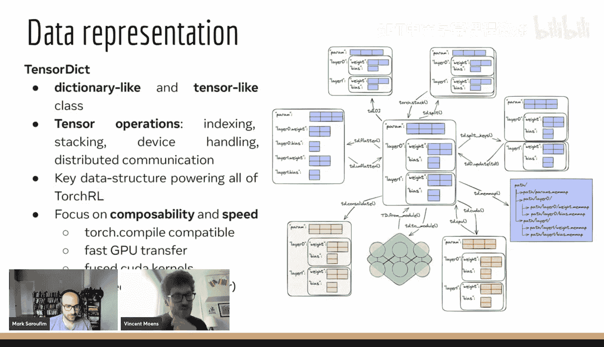

为了解决输入/输出格式多变的问题，我们提出了一个方案：让库中的所有组件都通过字典进行通信。这样，策略只需要负责选择动作，而不必关心具体实现细节；环境也只需提供重置和步进等方法，无需严格限定签名。

但直接在 Python 中处理字典会很繁琐，例如需要堆叠字典、处理嵌套键等。因此，我们在其基础上构建了一个名为 **TensorDict** 的类。

---

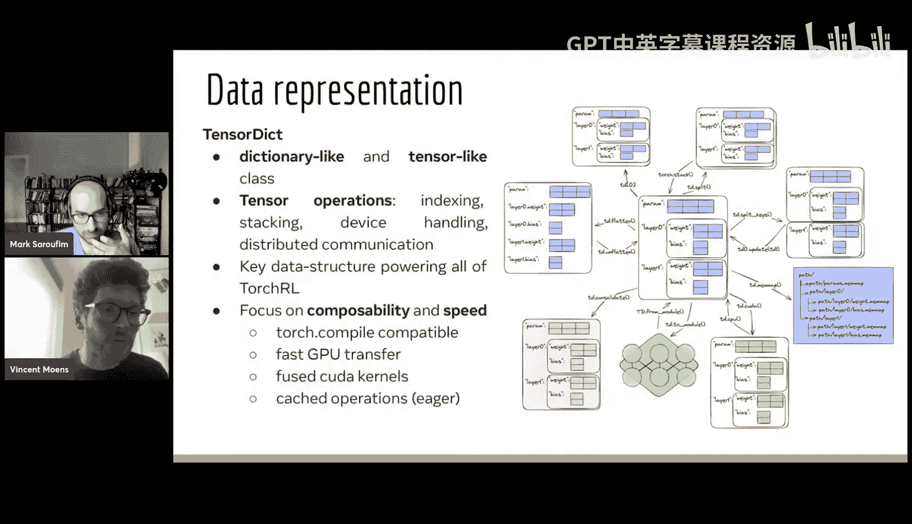

## TensorDict：字典与张量的结合 🔄

TensorDict 是字典和张量的混合体。你可以将其视为一个张量般的对象，它具备许多张量的特性。

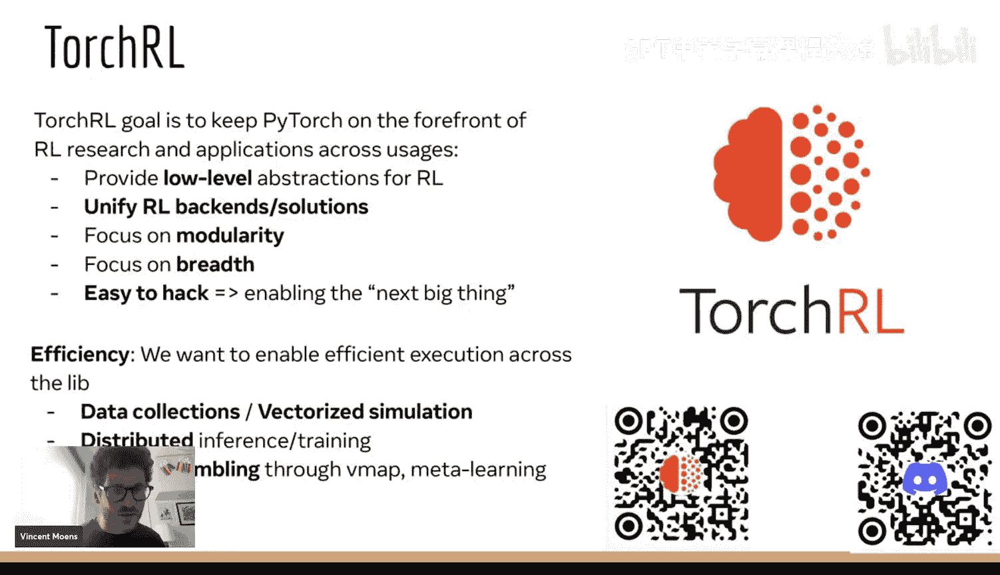

以下是 TensorDict 的关键优势：
*   **批量操作便利性**：你可以像操作单个张量一样，对一组张量执行批量操作（如加法、乘法）。例如，`tensordict1 + tensordict2`。
*   **高效设备转移**：你可以将整个 TensorDict 同步转移到 CUDA 设备，操作快速且能避免 CUDA 同步相关的错误。
*   **丰富的工具集**：它提供了许多工具函数，用于处理张量的重塑、共享内存存储等。

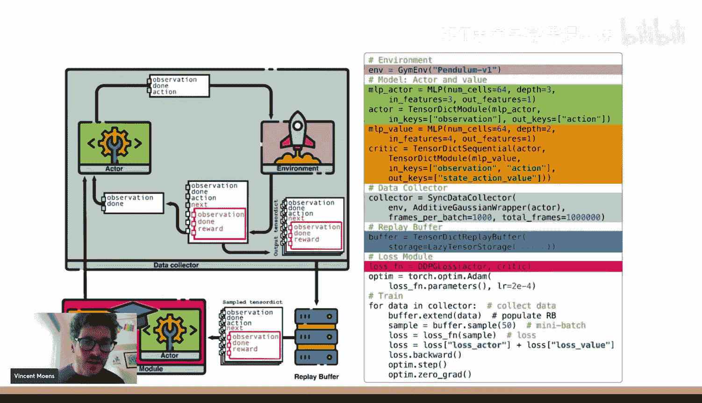

这解决了一个“一对多”的问题。例如，当你为单个张量写了一个优化器更新规则后，可以轻松地将其应用于一个包含多个张量的 TensorDict，而无需使用复杂的树状结构来分发操作。这种设计思维是：任何我想对单个张量做的操作，都可能想对一批张量做。

虽然也有人考虑过使用 JSON、Pickle 或原始指针等方案，但 TensorDict 的面向对象设计使得消息传递更加方便，并且为底层优化提供了可能。所有算术运算都使用 `torch.vmap`，速度远快于普通的 Python 循环。同时，它能与 `torch.compile` 兼容，确保整个计算图可以被编译和优化。

目前 TensorDict 是完全基于 Python 的，因为结合 `torch.compile` 后，性能开销已不再是问题。我们计划未来将其上游到 PyTorch 主库中。

基于 TensorDict，我们构建了 **TorchRL** 库。

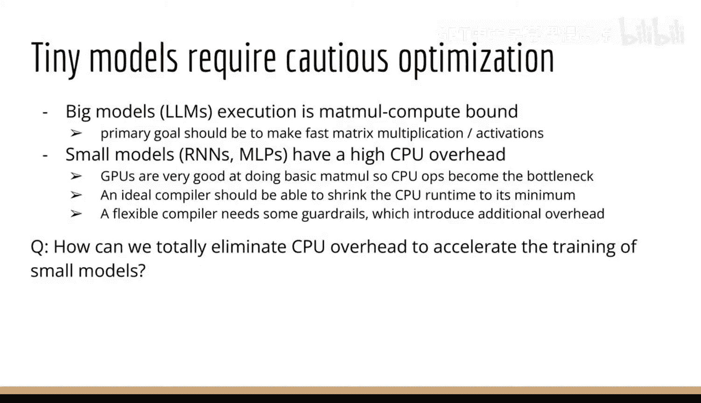

---

## TorchRL：模块化的强化学习库 🧰

TorchRL 的目标是提供高度可复用的组件。由于所有组件都基于 TensorDict 这一通用抽象，因此它们的接口非常灵活。

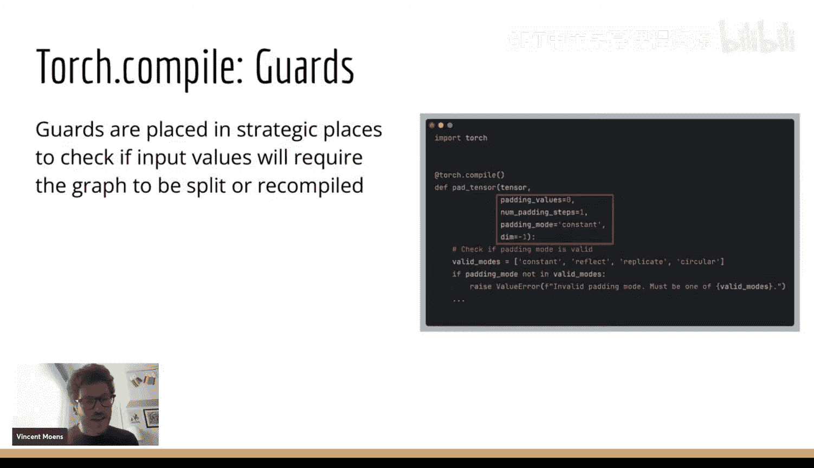

TorchRL 的核心组件包括：
*   **Actor 抽象**：用于执行策略的模块。
*   **环境抽象**：高度通用，可以封装游戏、数据集（如数学题）等。
*   **经验回放缓冲区**：一个动态的数据集，支持读写操作，数据会随时间变化。
*   **损失函数模块**：各种强化学习算法的损失计算模块。

该库支持单节点单进程、单节点多进程以及多节点部署，并集成了多种分布式后端。其最大的特点是**模块化**。用户可以选择只使用库中的特定组件（例如仅使用经验回放缓冲区），而不必引入整个框架。这与生态系统中许多其他库不同，那些库通常要求用户全盘接受其整个训练流程。

---

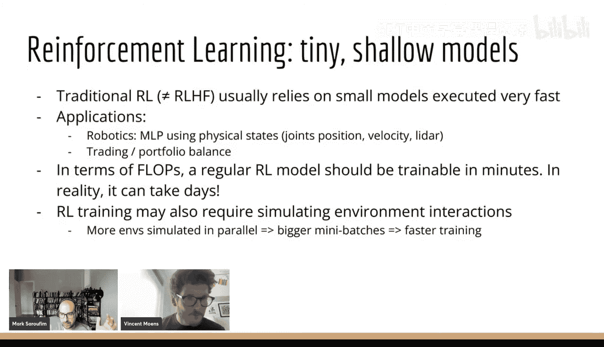

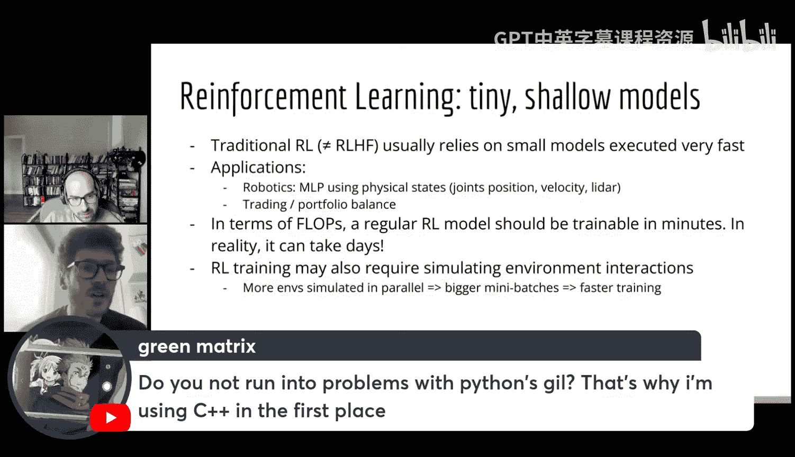

## 小型模型的 CPU 瓶颈问题 ⚡️

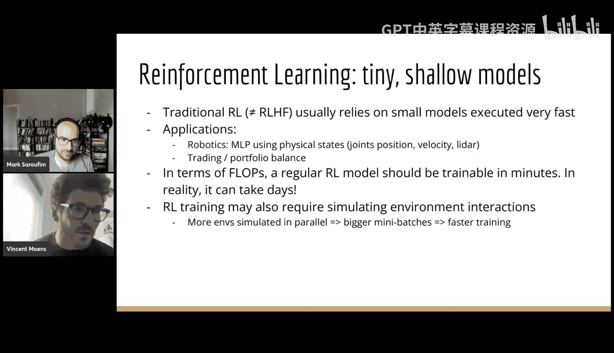

上一节我们介绍了 TorchRL 库的模块化设计，本节中我们来看看强化学习中一个突出的性能问题：小型模型的 CPU 瓶颈。

强化学习社区长期以来一直关注小型模型（如简单的多层感知机 MLP）。早期是因为与环境的交互数据有限，不需要大模型。如今，虽然有了可以在 GPU 上大规模并行运行的仿真器，每秒可收集数十万甚至数百万帧数据，但在实际部署时（例如在机器人上），仍然需要模型小而快，无法承受数十亿参数大模型的推理延迟。

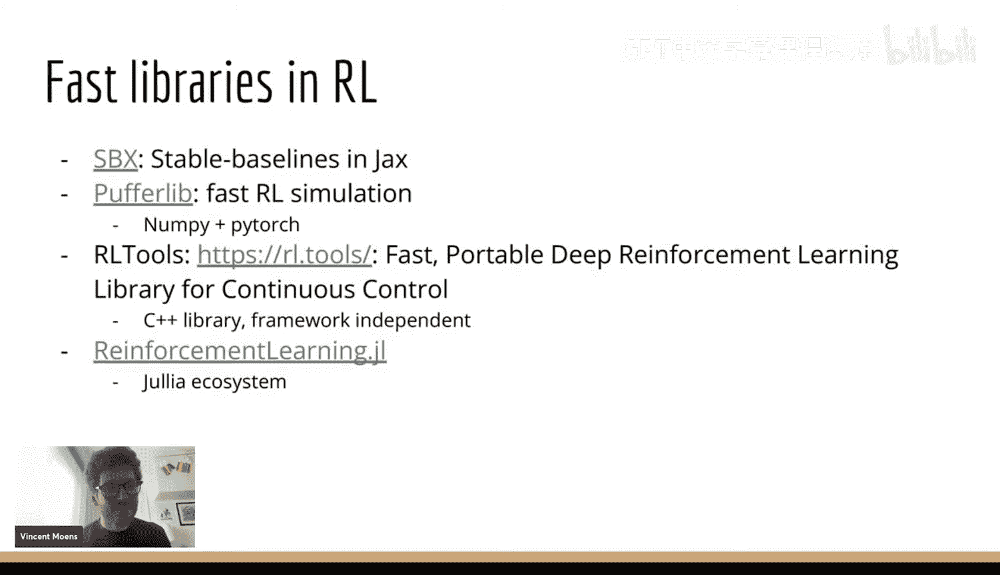

在 Python 中训练这些小模型时，一个主要问题是 **CPU 开销过大**。研究人员喜欢用 Python 快速实验，但 Python 的解释执行和与 C++ 层的频繁交互会导致显著开销，使得 GPU 利用率可能低至 10%，这是非常低效的。

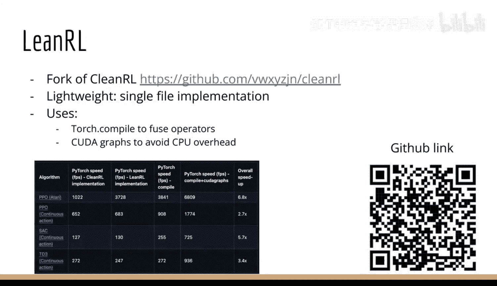

`torch.compile` 通过融合 C++ 操作、减少返回 Python 层的次数来提升性能。但对于小型模型，编译引入的“守卫”检查开销可能比模型实际执行时间还长。守卫检查是为了确保编译后的代码在输入条件（如张量形状、字符串参数）未改变时才能被复用。

例如，编译一个简单的填充操作时，如果填充模式和填充值是字符串或整数，编译器会为这些具体值生成特化代码。如果后续输入中这些值发生变化，就需要触发新的编译和守卫检查。对于大模型，矩阵运算是主要开销，守卫检查的影响微乎其微。但对于一个在 CUDA 上只有四层、每层 500 个神经元的小型 MLP，守卫检查的时间可能超过模型前向传播的时间，导致编译后速度没有提升甚至更慢。

---

## 解决方案：LeanRL 与 CUDA Graphs 🚀

那么，如何为小型强化学习模型打破 CPU 瓶颈呢？解决方案是结合使用 **`torch.compile`** 和 **CUDA Graphs**。

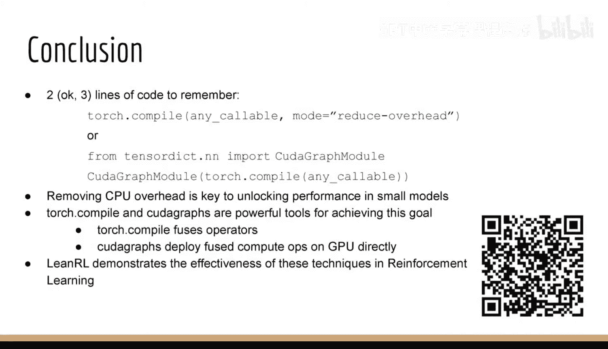

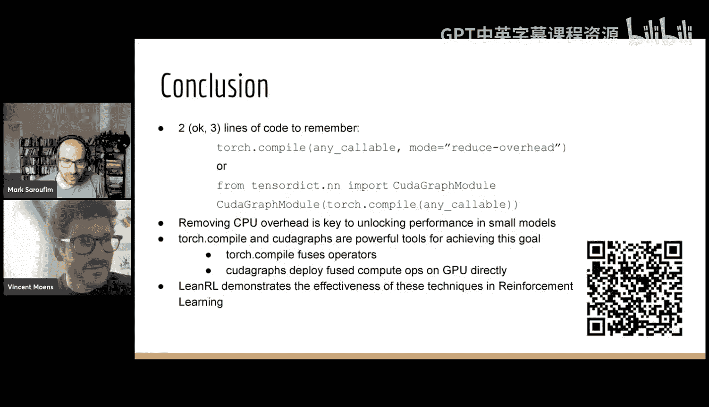

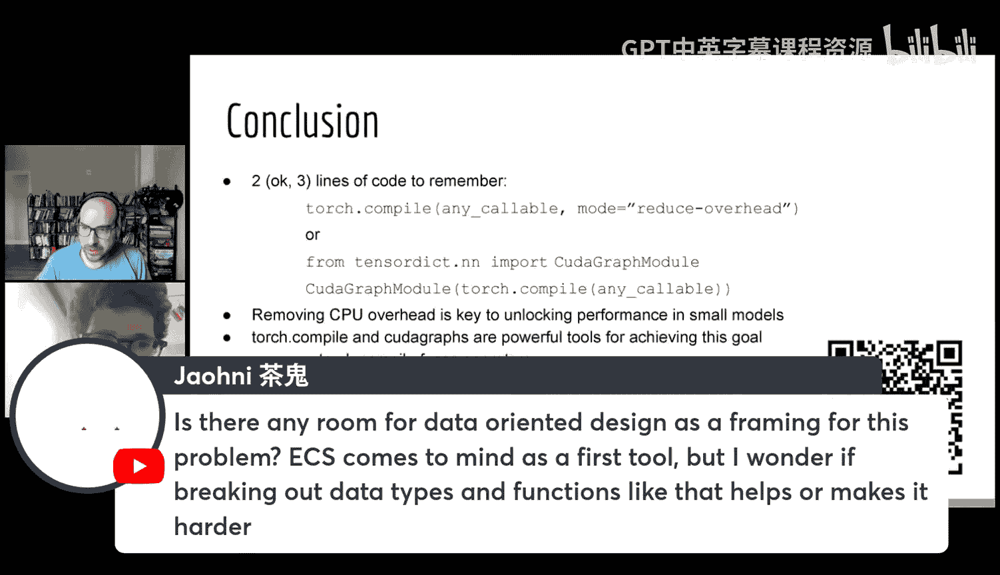

CUDA Graphs 允许你将一系列 CUDA 内核（操作）封装成一个图，然后一次性提交执行，避免了单个内核启动的开销。如果只使用 `torch.compile`（其底层会使用 CUDA Graphs），你仍然会在图的前后有守卫检查。

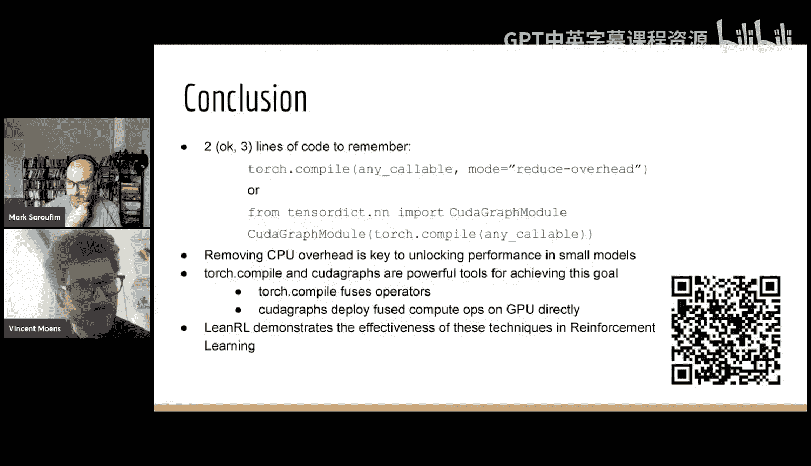

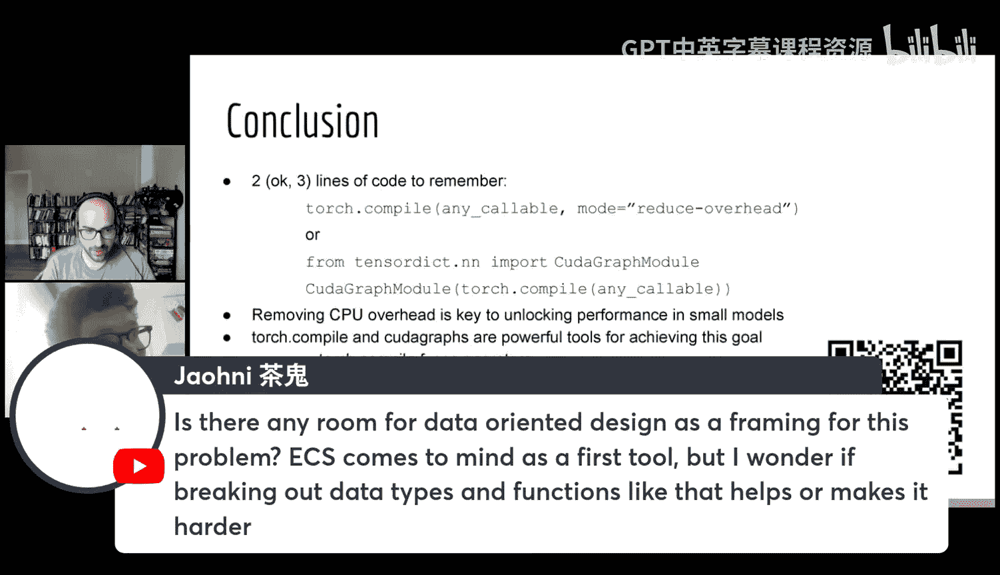

我们的洞察是：在机器人、游戏等强化学习场景中，**输入结构通常是高度可预测的**。机器人有多少个关节、摄像头，LiDAR 的输出尺寸等，在训练过程中往往是固定的。批大小也可以固定，或者使用可预测的动态形状。

如果我们能做出“输入结构不变”的保证，就可以消除守卫检查。具体做法是：先使用 `torch.compile` 编译代码，然后**在编译好的代码外部**包裹一层 CUDA Graph，而不是让编译过程内部去管理 CUDA Graph。这样就能完全绕过守卫检查。

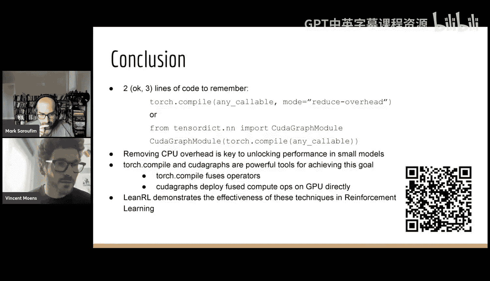

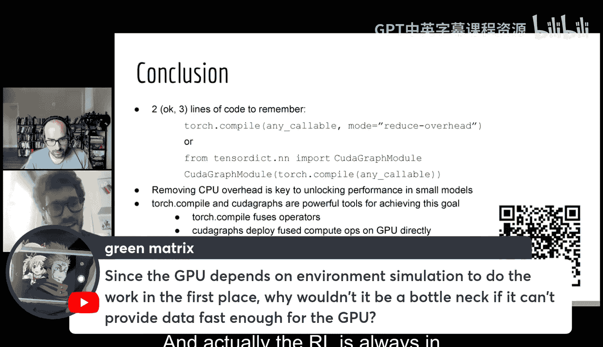

我们在一款名为 **LeanRL** 的实验性库中实现了这一想法。LeanRL 基于一个包含流行 RL 算法简洁实现的库，我们将其 fork 并应用了编译和 CUDA Graphs 加速。

以下是性能对比数据（以 TD3 算法为例）：
*   **Eager 模式（纯 Python）**：247 帧/秒
*   **仅编译**：272 帧/秒（提升很小）
*   **仅 CUDA Graph（无编译）**：778 帧/秒（显著提升，仅消除了 Python 开销）
*   **编译 + CUDA Graph**：速度进一步提升
*   **JAX 版本**：561 帧/秒

在这个例子中，PyTorch 方案展示了显著优势。我们还测量了训练过程中的 GPU 利用率曲线下面积。使用“编译+CUDA Graph”方案时，GPU 平均利用率更高，但总的使用量（面积）更少，这意味着我们更高效地利用了 GPU。

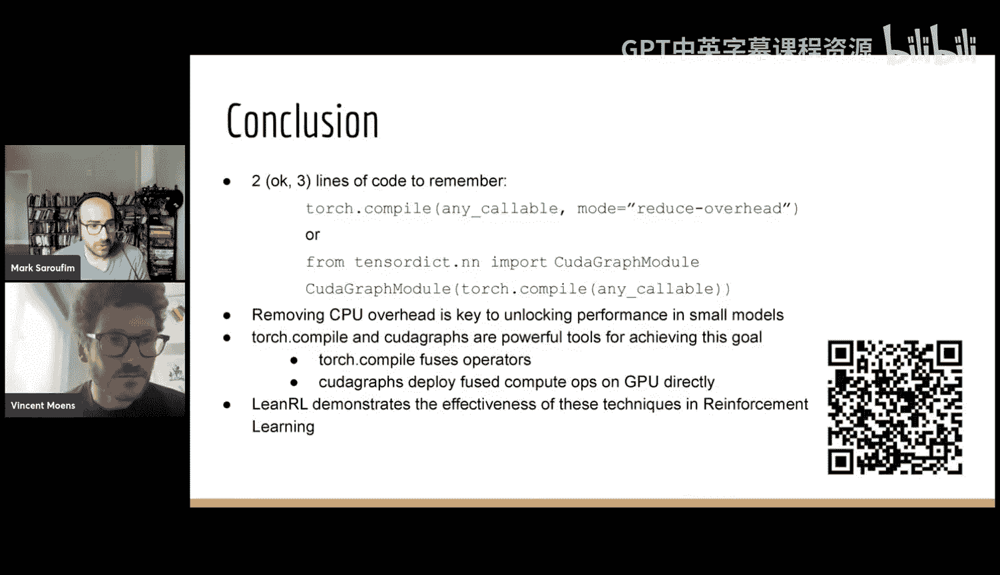

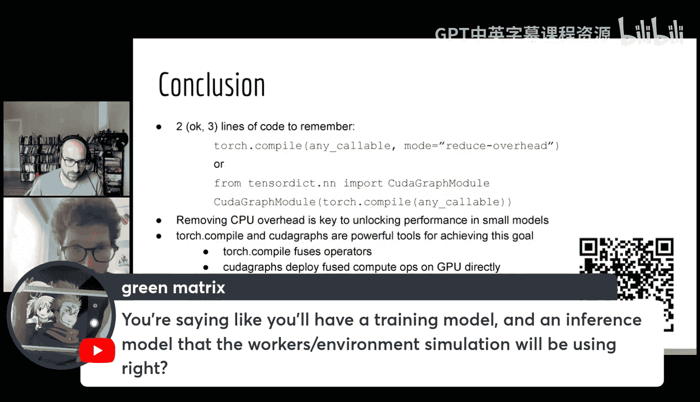

LeanRL 已成功帮助多个研究团队将训练速度提升了高达 6 倍。

---

## 最佳实践与生态系统 🌍

在结束之前，让我们看看强化学习领域的其他高效库，并总结一些最佳实践。

现有的高效强化学习库包括：
*   **SB3**：基于 JAX 的算法库。
*   **Parlay**：基于 C++ 的环境库，通过共享内存实现高速仿真，可达每秒数百万帧。
*   **RLtools**：一个极简的 C++ 库，专注于少数几种算法（如 PPO），旨在为嵌入式或机器人平台提供极快的训练和部署。
*   **Julia 生态中的库**：也提供了高性能的解决方案。

对于希望优化自己代码的开发者，我们建议遵循以下步骤：
1.  **首先尝试 `torch.compile`**：使用 `mode="reduce-overhead"` 编译你的代码，观察速度提升。
2.  **如果效果不佳**：考虑使用类似 LeanRL 中的技术，手动为你的更新函数或策略创建“编译后+外部 CUDA Graph 包裹”的版本。
3.  **避免常见陷阱**：
    *   直接在 CUDA 设备上创建张量，而不是在 CPU 创建后再转移。
    *   避免在训练循环中调用 `tensor.item()` 进行日志记录，这会触发昂贵的设备同步。
    *   多使用分析工具查看性能轨迹。

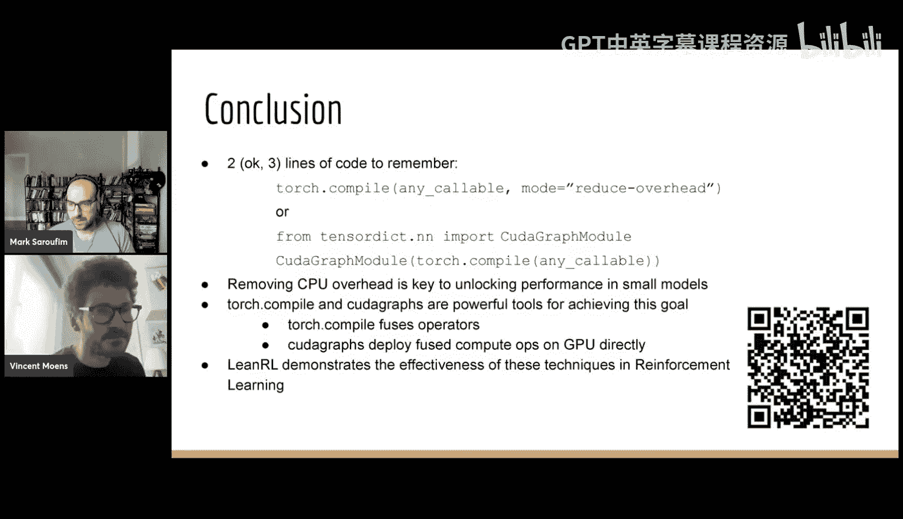

---

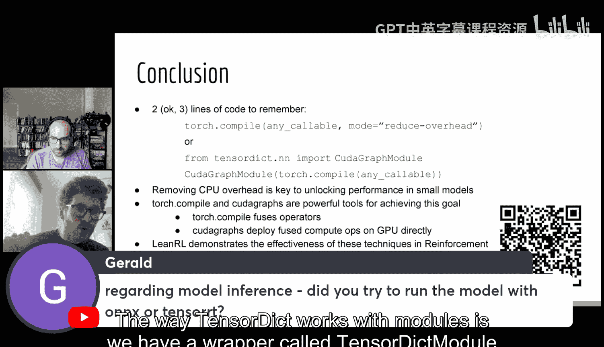

## 总结 🎯

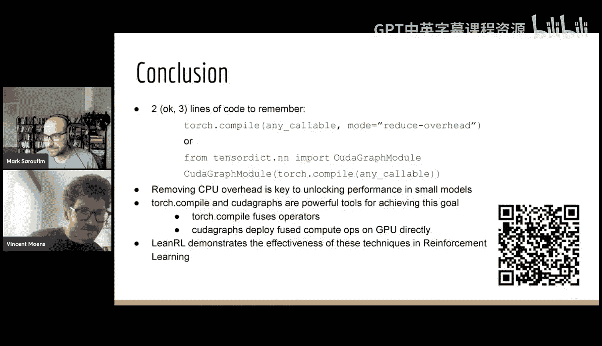

本节课中我们一起学习了如何加速小型强化学习模型的训练。我们从强化学习的基本概念和挑战出发，介绍了 TensorDict 和 TorchRL 如何通过模块化设计提供灵活性。然后，我们深入探讨了小型模型训练中的 CPU 瓶颈问题，并揭示了 `torch.compile` 守卫检查对微小操作的开销影响。最后，我们介绍了 **LeanRL** 的解决方案：通过将编译后的代码用 CUDA Graph 外部包裹，彻底移除守卫检查，从而实现了显著的性能提升（最高可达 6-7 倍）。我们还回顾了生态系统中的其他高效工具，并总结了一些实用的优化最佳实践。希望这些知识能帮助你更高效地进行强化学习研究和开发。