# 2：Modular的统一设备加速器语言


## 概述

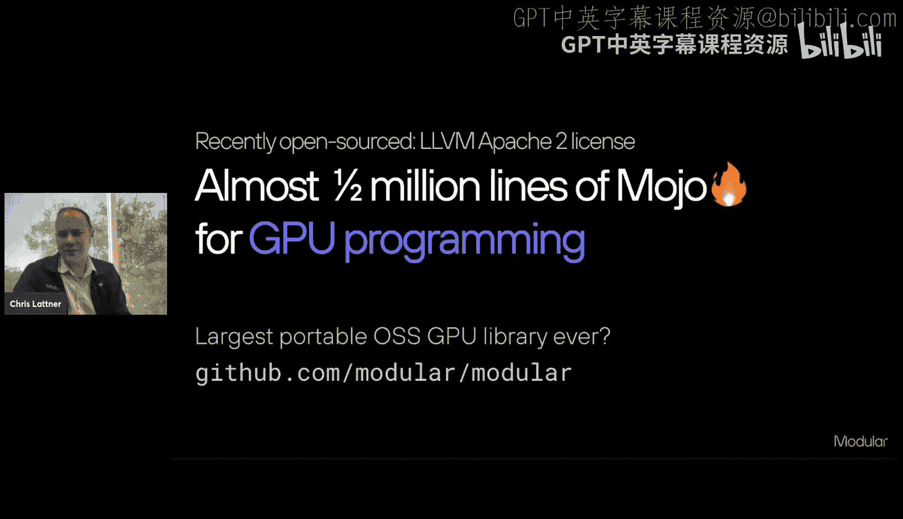


在本节课中，我们将深入探讨现代GPU编程的现状、挑战以及Modular公司提出的全新解决方案——Mojo编程语言。我们将学习Mojo如何通过强大的元编程能力、统一的编程模型以及对性能与可移植性的极致追求，旨在解决当前AI与异构计算领域面临的多语言、多系统复杂性问题。课程内容涵盖从高级概念到具体代码示例，特别是Mojo在GPU内核编程、性能优化和跨硬件支持方面的独特优势。

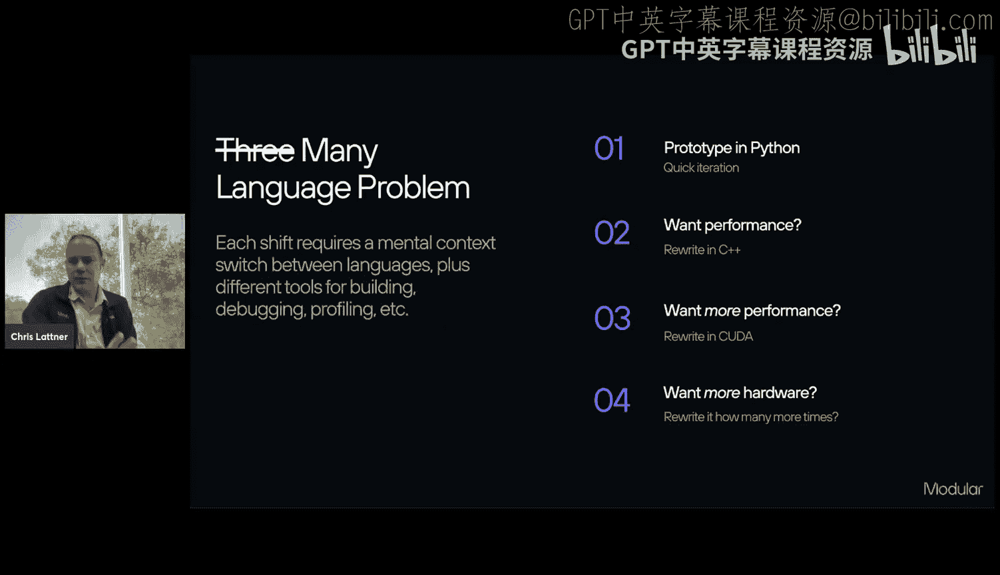

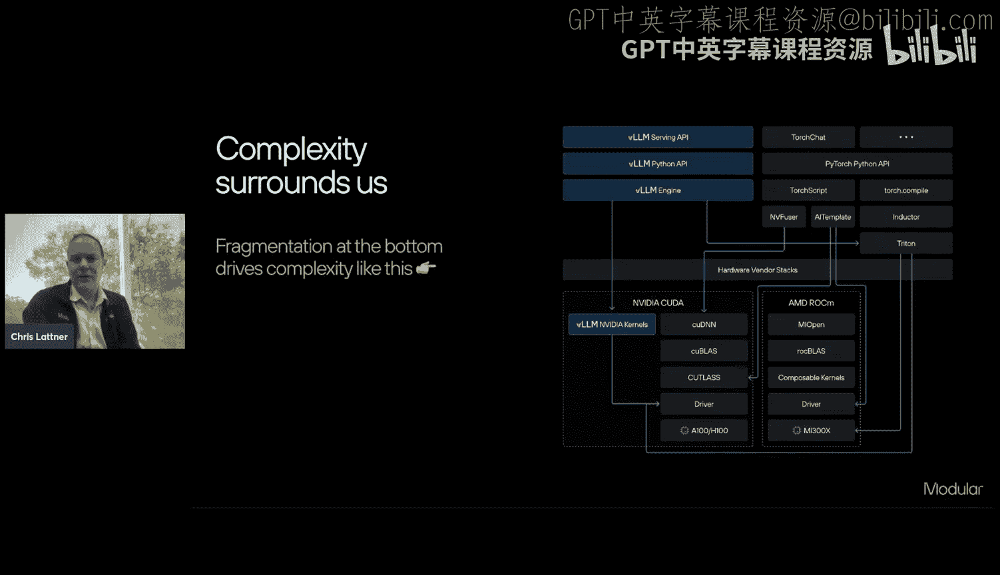

## GPU软件现状与挑战

上一节我们介绍了课程的整体框架，本节中我们来看看当前GPU编程领域面临的核心问题。

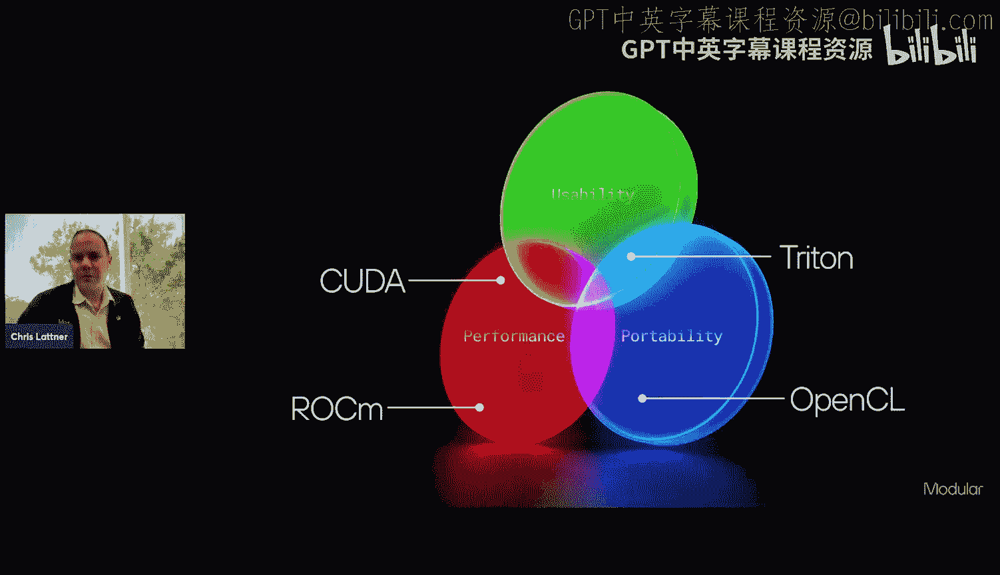

现代AI软件栈面临“多语言”困境。为了获得高性能，开发者经常需要在Python（用于快速原型和建模）、C++/Rust（用于系统级性能）以及CUDA（用于GPU硬件）等不同语言和范式之间不断重写代码。这种分裂不仅成本高昂，还导致团队需要在不同思维模式间切换，降低了整体效率。

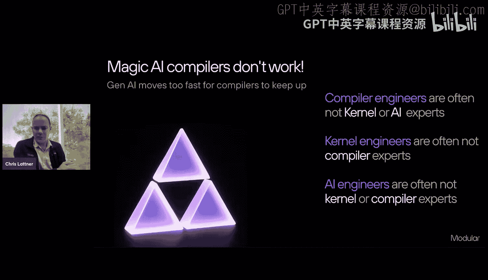

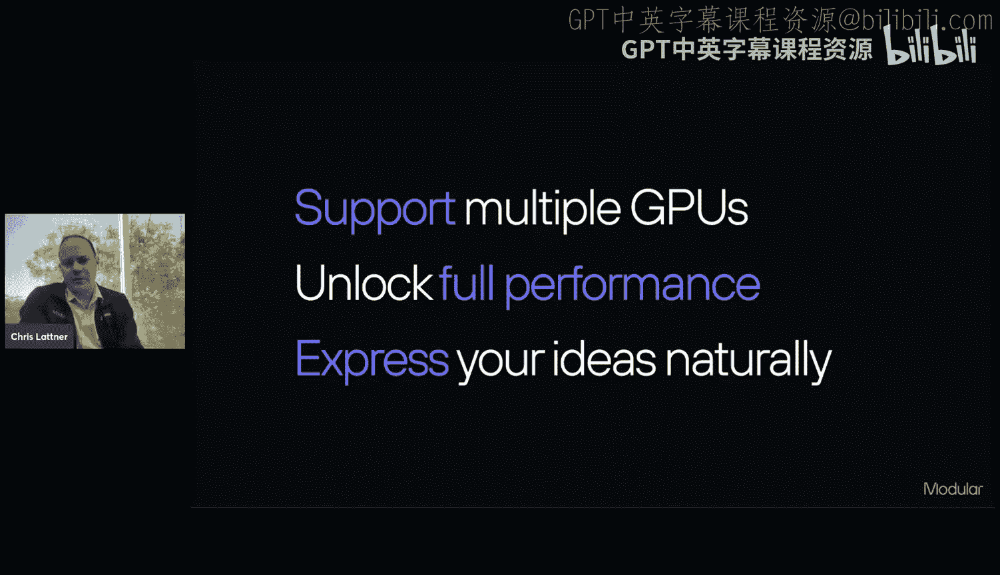


由于这种分裂，现代AI系统栈往往由许多不同时期、不同目标的技术拼凑而成，形成了一个复杂且脆弱的“缝合怪”。每一层都在独立演化，缺乏统一设计，导致在特定硬件、特定量化方案或特定用例下，常常出现性能不佳、兼容性问题或难以调试的故障。

对于专注于内核编程和GPU编程的开发者而言，三个核心目标至关重要：
1.  **性能**：充分利用昂贵的GPU硬件，获取峰值算力。
2.  **可用性**：提高开发效率，降低GPU编程门槛，让更多人能够参与。
3.  **可移植性**：代码能够跨不同硬件（如NVIDIA、AMD）甚至未来新型加速器运行。


然而，现有主流方案往往只能满足其中一两个目标：
*   **CUDA**：性能王者，但专属于NVIDIA硬件，可移植性差。近期在可用性上有所改进。
*   **Triton**：显著提升了可用性和一定的可移植性，但在追求极致性能时需要做出妥协。
*   **OpenCL**：注重可移植性（支持FPGA等），但在张量计算性能和现代开发体验上已落后。
*   **ROCm**：在AMD硬件上性能优异，但未聚焦于跨厂商的可用性和可移植性。

目前缺乏一个能同时完美满足性能、可用性和可移植性三大目标的解决方案。

## 传统编译器方案的局限性

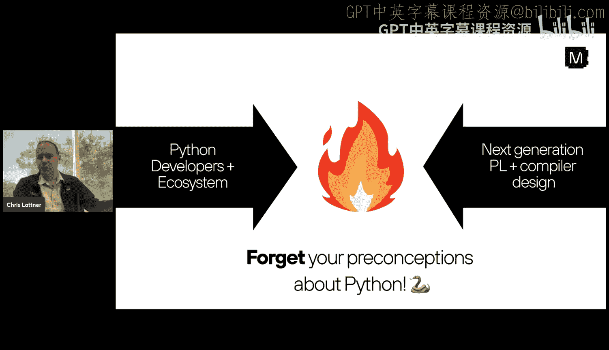

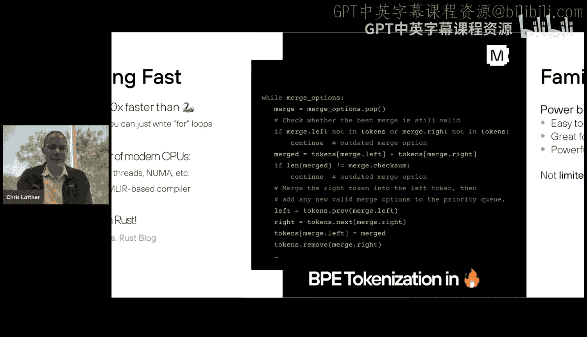

上一节我们分析了现有方案的不足，本节中我们来看看另一种常见的解决思路——AI编译器——及其面临的挑战。

作为编译器领域的专家，我们曾长期致力于构建“足够智能的编译器”来自动化解决性能与可移植性问题，例如XLA等项目。然而，AI领域算法迭代速度极快，而全球编译器工程师的数量有限，且他们通常并非算法和微架构领域的专家。这导致编译器成为创新的瓶颈。

更重要的是，成功的AI生态系统需要算法研究员、内核工程师、AI应用开发者等不同角色高效协作。传统的AI编译器方案试图将所有复杂性封装在编译器内部，迫使内核工程师去理解中间表示等底层细节，这背离了让各领域专家专注于自身所长、通过工具高效协作的初衷。

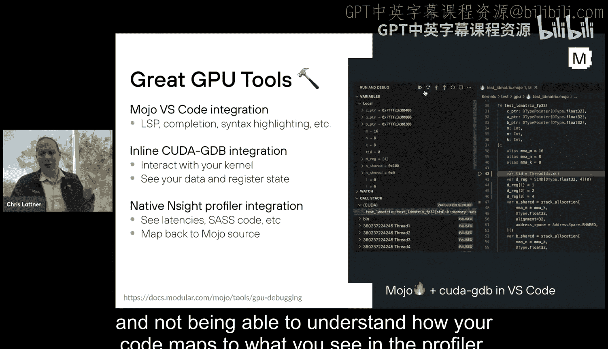

## Mojo的愿景：统一、原生的异构计算平台

上一节我们探讨了传统方案的瓶颈，本节中我们将介绍Modular公司提出的全新愿景和解决方案。

我们需要的是一个**统一、原生的生成式AI软件平台**，它需要从第一性原理出发重新构建，吸收现有各系统的经验教训。这个平台的目标是：
*   支持来自不同厂商的多种GPU。
*   释放硅芯片的全部性能潜力。
*   提供卓越的开发者体验和可用性。

这正是Modular公司正在构建的。Mojo不仅仅是一个新的编程语言，它更是一个全新的、为异构计算和现代AI用例从头设计的完整软件栈，涵盖了从底层内核到上层服务与集群管理的整个垂直领域。

目前，Mojo已经实现了对CPU、NVIDIA GPU（包括消费级和数据中心级）以及AMD GPU（如MI300系列）的全面支持。重要的是，Mojo不依赖于CUDA等现有生态，而是基于第一性原理构建了自己的技术栈，确保了统一性和控制力。

## 为什么选择构建全新的Mojo语言？

上一节我们了解了Mojo的宏大愿景，本节中我们来探讨实现这一愿景的核心载体——Mojo语言本身。

构建一门全新的通用编程语言（而非领域特定语言DSL）通常被认为是一个糟糕的主意，因为它面临采用成本高、构建难度大、需要长期一致的愿景和大量资源投入等挑战。然而，我们认为异构计算正是需要这种“硬核”方案的正确时机和领域。

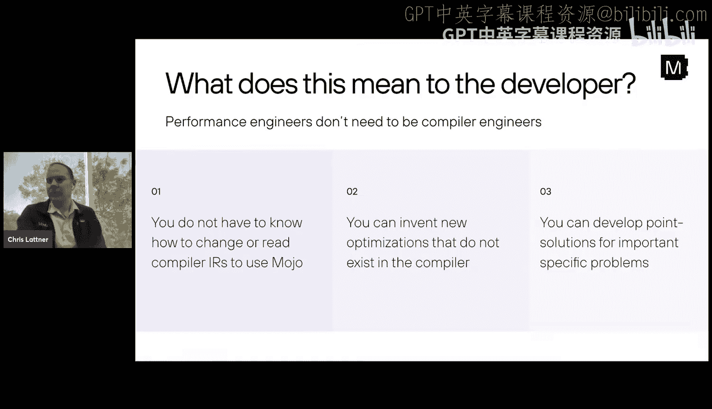

构建新语言是获得最佳解决方案的唯一途径。我们想要创造的是一个真正强大、能产生巨大影响、能让AI开发者和内核工程师都爱不释手的工具。Mojo的目标不是做一个临时的演示或研究性质的项目，而是旨在提升整个行业水平的基础设施。

Mojo的成功建立在几个关键因素上：清晰的愿景、多年的持续投入、顶尖的团队以及我们在LLVM、Clang、Swift等语言和编译器项目上的丰富经验。这一切使得我们有信心迎接这个挑战。

## Mojo语言初探

上一节我们解释了构建新语言的必要性，本节中我们来具体看看Mojo是什么。

Mojo是一门**具有Python风格的系统编程语言**。
*   **Python风格**：它采用了Python的语法和生态系统，降低了学习成本。
*   **系统编程**：它拥有与C++、Rust相媲美的性能，是一个完全通用的系统编程语言，但并非使用Python解释器，而是使用了Python的语法。

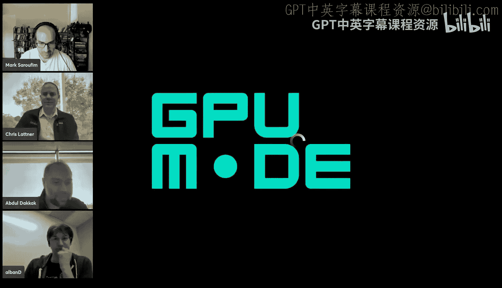

Mojo包含完整的工具链，如编辑器支持、调试器、性能分析器集成等。它的目标是为Python生态的开发者赋予新的超能力，同时将编程语言和编译器设计的最新成果结合起来，形成一种新颖的组合。

尽管代码看起来像Python，但Mojo是一门全新的语言，它并非Python的DSL。

## Mojo的核心：强大的元编程

上一节我们介绍了Mojo的基本概念，本节中我们将深入其最核心的特性——元编程，这是理解Mojo如何实现其目标的关键。

元编程是Mojo赋予开发者超能力的核心机制。与传统AI编译器将权力收归编译器内部不同，Mojo通过元编程将这些能力交还给内核工程师。这使得开发者无需等待编译器团队支持，就能自行实现新数据类型、硬件指令或优化策略。

Mojo的元编程主要基于两个概念：**参数**和**别名**。
*   **参数**：使用方括号 `[]` 声明，在编译时确定。类似于C++的模板参数，但更强大、更易用。
    ```mojo
    struct SIMD[DT: DType, width: Int]:
        var value: … # 内部实现
    ```
*   **别名**：使用 `alias` 关键字声明，是编译时可计算的任意表达式变量。
    ```mojo
    alias float32 = DType.float32 # float32 是在库中定义的别名
    ```

Mojo的关键突破在于**统一了运行时语言和元语言**。这意味着你可以在编译时使用`for`循环、`if`语句等几乎所有运行时能用的结构，进行符号执行并将结果直接嵌入二进制。这允许将大量复杂的计算（如张量索引数学）从运行时转移到编译时，实现零开销抽象。

以下是一个简单的例子，展示如何在编译时生成一个列表：
```mojo
fn fill_list(lb: Int, ub: Int) -> List[Int]:
    var result = List[Int]()
    for i in range(lb, ub):
        result.append(i)
    return result

alias vec = fill_list(5, 20) # 在编译时计算，vec 是一个编译时常量列表
```

在更复杂的场景中，比如实现一个SIMD水平归约操作，你可以利用编译时`if`语句为不同架构、不同数据类型选择最优的实现路径，就像在编写一个专属的小型编译器。这赋予了库作者极大的灵活性和控制力。

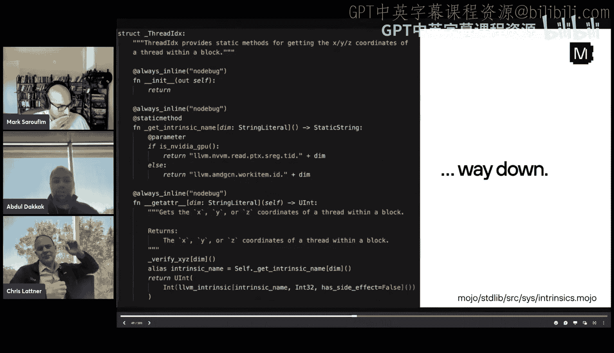

此外，Mojo的元编程还支持高阶函数作为编译时参数，使得算法可以高度可配置和可组合。例如，可以编写一个通用的向量化算法，它接受一个表示元素操作（如`sin`, `cos`）的函数作为编译时参数，并确保循环被正确向量化，而不是依赖编译器的提示（如OpenMP的`pragma`），后者可能失败。

**这意味着**：热爱性能、内核、硬件的开发者，不再需要成为编译器专家。你可以发明编译器中没有的新优化，可以无需修改编译器就支持新硬件指令，如果现有库不满足需求，你可以直接绕过它们，编写自己的实现甚至内联汇编。Mojo提供了直达硬件的路径和提升生产力的工具。

## Mojo GPU编程实战

上一节我们深入探讨了元编程这一核心概念，本节中我们来看看如何用Mojo实际编写GPU代码。

Mojo统一了CPU和GPU编程。一个函数可以轻松地在CPU或GPU上启动。
```mojo
fn say_hi(value: Int):
    print("Hello", value)

# CPU 调用
say_hi(42)
# GPU 调用
say_hi[grid_dim=(1,), block_dim=(1,)](42)
```

Mojo中的所有基础类型和数学函数都是在库中实现的，而非编译器内置。例如，`exp2`函数的实现会根据目标硬件和数据类型（如`f16`, `bf16`）选择最优的路径，可能调用特定的PTX内联汇编或LLVM内部函数。这一切都通过编译时参数和条件判断完成，无需修改编译器。
```mojo
fn exp2[width: Int](x: SIMD[DType.float32, width]) -> SIMD[DType.float32, width]:
    @parameter
    if width == 1:
        return _call_scalar_ptx("ex2.approx.f32", x)
    # ... 其他优化路径
```

Mojo提供了高级抽象来简化编程。例如，`foreach`（或`elementwise`）函数允许你以声明式的方式编写逐元素操作，而库会自动处理在CPU（多线程、向量化）或GPU（线程索引、块划分、向量化加载）上的并行化细节。其内部实现同样是可探查、可修改的库代码。

Mojo的**特征**系统（类似于接口或协议）提供了强大的组合能力。例如，在实现注意力机制时，可以定义一个`MHAMask`特征，然后为因果掩码、滑动窗口掩码、分块掩码等不同变体提供具体实现。多头部意力内核可以泛化地接受任何满足`MHAMask`特征的类型，从而使算法保持清晰，避免充斥条件判断。特征还支持组合（如与、或操作），进一步增强了灵活性。

## 基于分块的编程与操作组合

上一节我们看到了Mojo如何简化常见的GPU编程模式，本节中我们关注更复杂的、性能关键的模式：基于分块的编程。

矩阵乘法、注意力等操作是AI工作负载的核心。Mojo从Cutlass、CUTE等库中汲取灵感，引入了强大的**布局**和**分块张量**抽象。布局定义了从多维坐标到线性内存地址的映射，支持行主序、列主序、旋转、Swizzle等复杂模式。这些抽象全部在库中实现，是可调试、可可视化的，而非编译器魔法。

基于这些抽象，可以实现高性能的矩阵乘法内核。代码结构清晰，通过参数化来适应不同硬件（如A100、H100、MI300）的特定流水线策略（如双缓冲、异步拷贝、Warp专业化）。矩阵乘法的核心（MMA操作）也被抽象出来，根据硬件选择对应的张量核心指令。

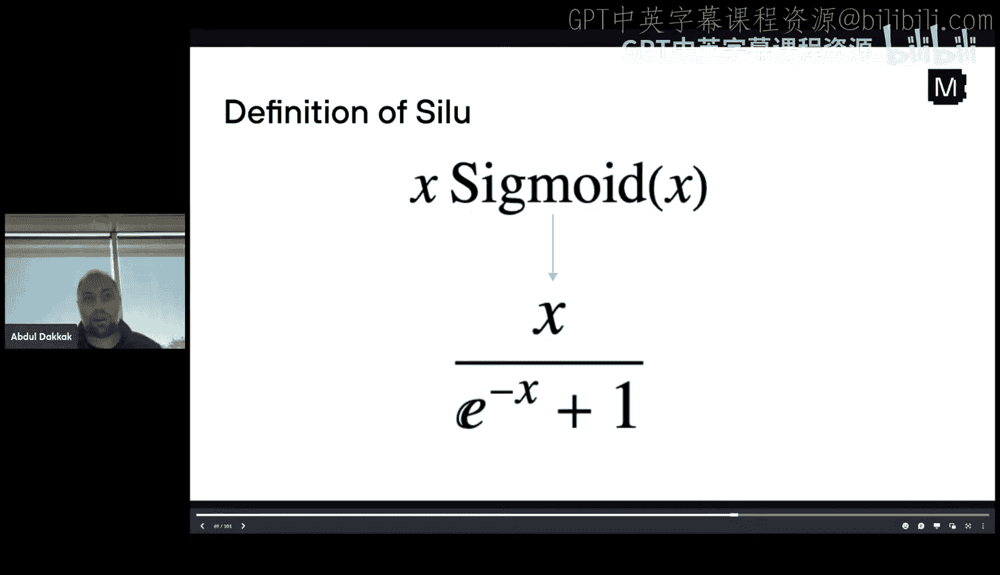

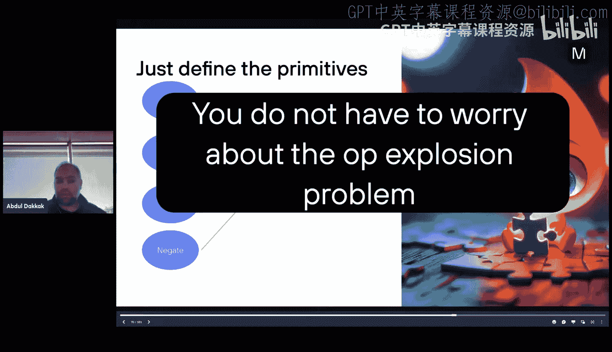

更重要的是，Mojo强调**操作的组合**。在真实场景中，矩阵乘法之后往往会接一个激活函数（如SiLU）。传统的库方案需要为每个“矩阵乘+激活”的组合编写专门的内核，导致算子爆炸。Mojo结合其图编译器，可以自动将基础原语（加、乘、`exp`、`sigmoid`）融合成单一高效内核。开发者只需定义基础原语，系统便能自动合成如SiLU这样的复杂操作，实现了“最好的内核是你根本不用写的那个”。


## 性能表现

上一节我们探讨了高级抽象和组合，本节中我们关心最实际的问题：Mojo的性能到底如何？

我们追求的是**业界一流的性能**。以下是一些早期基准测试结果（仍在持续优化中）：
*   **对比 cuBLAS (NVIDIA)**：在多种对于LLaMA 70B等模型重要的矩阵乘法形状上，Mojo的实现接近甚至有时超过cuBLAS的性能。请注意，Mojo的矩阵乘法内核设计允许灵活地融合后续激活操作，而cuBLAS的接口通常不支持，因此在真实场景中Mojo可能更具优势。
*   **对比 ROCm/hipBLAS (AMD)**：在AMD MI300上，Mojo的实现同样瞄准并达到了hipBLAS和rocBLAS的先进水平，在不少情况下表现更优。
*   **对比 Triton**：在注意力内核上，Mojo在MI300上展示了优于Triton的性能。

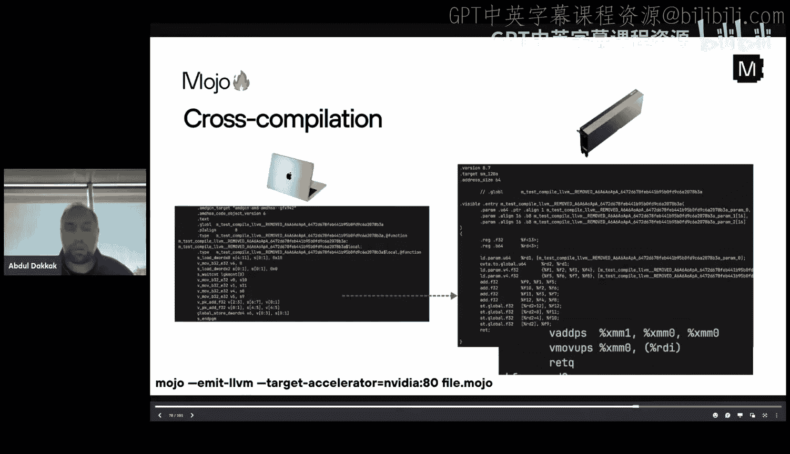

这些数据表明，Mojo在提供高可用性和可移植性的同时，并没有牺牲性能，真正致力于同时实现性能、可用性、可移植性这三个目标。

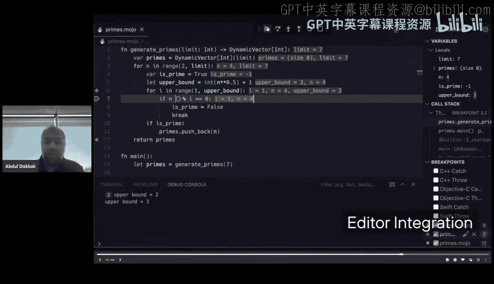

## 开发工具与调试

上一节我们验证了Mojo的性能潜力，本节中我们来看看支撑高效开发的工具链。

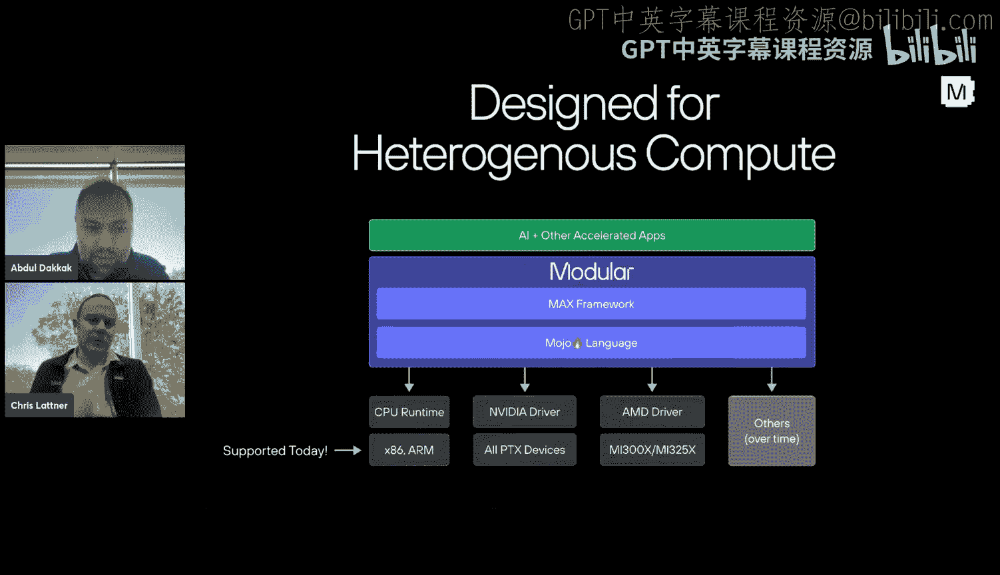

Mojo提供了完整的现代开发体验：
*   **调试器**：支持源码级调试、断点、变量查看、调用栈跟踪。
*   **性能分析**：与NVIDIA Nsight Compute、ROCgdb等工具无缝集成，性能剖析结果可以直接映射回Mojo源代码，方便定位热点。
*   **交叉编译与代码生成**：无需实际硬件，即可编译并输出针对特定目标（如NVIDIA B200，AMD GPU）的PTX或汇编代码，便于研究和优化。
*   **编辑器支持**：提供语法高亮、代码格式化、LSP支持等。

## 对比与总结

上一节我们了解了Mojo强大的工具链，本节中我们将其与现有技术进行整体对比并总结。

与Python DSL（如Triton）相比，Mojo在保持高生产力的同时，提供了更强的性能、更通用的编程能力、更强大的元编程以及更丰富的工具链。Mojo不是将控制权交给某个黑盒编译器，而是将能力赋予开发者。

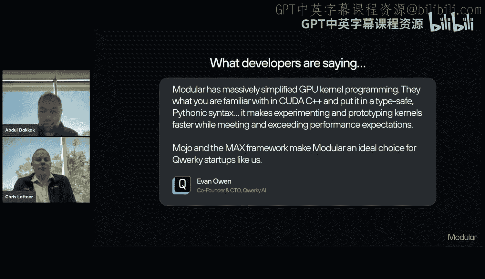

与CUDA C++相比，Mojo提供了更好的可移植性、更现代的语法、更安全的特性（如借用检查器）以及更快的编译速度。

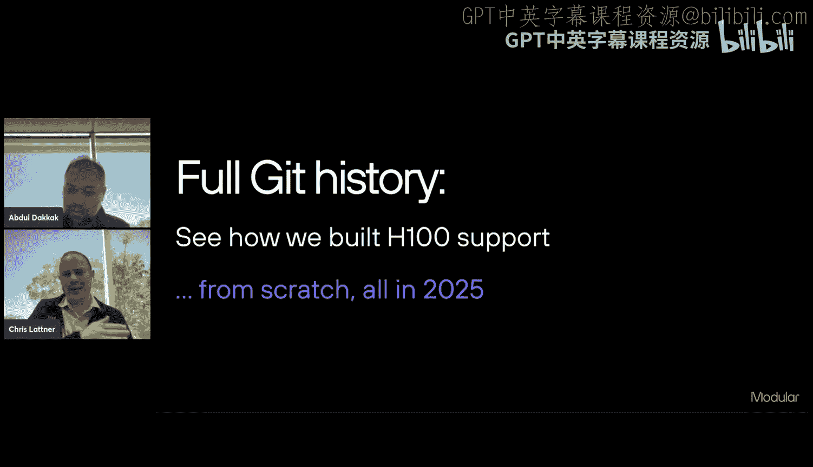

与库方案（如cuBLAS）相比，Mojo的开源内核库（可能是最大的开源GPU内核库之一）提供了透明性和可定制性，并且其抽象允许更灵活的操作融合。

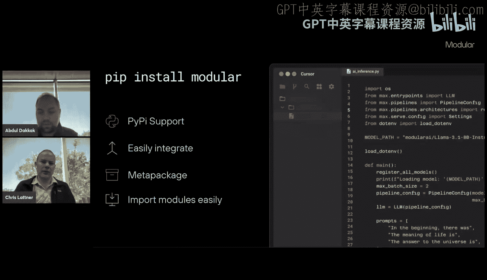

**Mojo的核心理念**是构建一个**统一、原生的生成式AI软件平台**。它通过一门为异构计算从头设计的语言，将编译器能力下沉到库中，赋予开发者超能力，旨在解决AI时代的软件分裂问题。

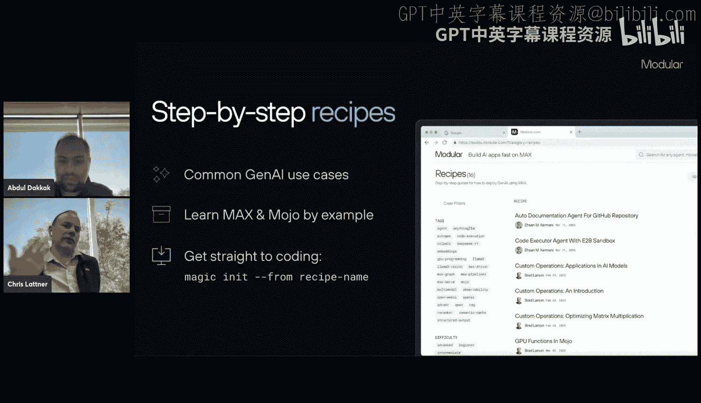

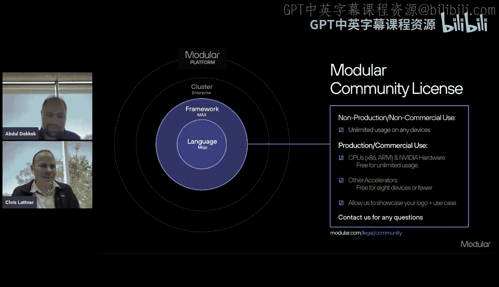

## 生态、许可与未来

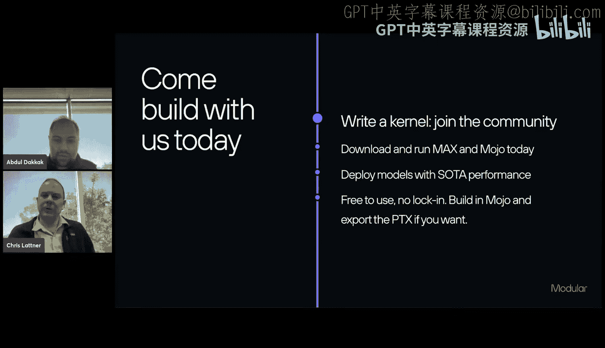

本节课我们一起学习了Mojo语言的理念、特性与能力。最后，我们来了解一下它的生态现状。


Mojo及其内核库已在Apache 2.0（附LLVM例外）许可证下开源。你可以免费下载并使用Mojo和MAX进行非商业或商业项目（有一些简单的归属要求）。目前主要支持NVIDIA（Ampere, Hopper, Blackwell）和AMD（MI300系列）GPU，并在CPU上表现优异。社区正在快速成长，Modular也定期举办黑客松等活动鼓励开发者参与。

编译器核心计划在明年年底前开源，当前优先确保其稳定性和一致性。

## 总结

在本节课中，我们一起深入探讨了Mojo编程语言如何试图重塑GPU和异构计算的编程范式。我们学习了：
1.  **当前GPU编程的挑战**：多语言分裂、系统复杂、难以兼顾性能、可用性与可移植性。
2.  **Mojo的解决方案**：构建一个统一、原生的全栈平台，其核心是一门Python风格的、高性能的系统编程语言。
3.  **元编程的超能力**：通过编译时参数、别名等特性，将传统编译器的能力赋予库开发者和内核工程师，实现硬件抽象、算法优化和零开销抽象。
4.  **实际的GPU编程**：从简单的元素级操作到复杂的分块矩阵乘法，Mojo提供了从高级抽象到底层控制的全频谱编程能力。
5.  **性能验证**：早期基准测试表明，Mojo能够在保持高开发效率的同时，追求并达到业界一流的性能水平。
6.  **完整的工具链**：提供调试、性能剖析、交叉编译等现代开发工具。

Mojo代表了一种大胆的尝试：通过重新思考编程语言和系统设计的基础，来应对AI时代异构计算的根本性挑战。其成功与否取决于社区的采纳和共建，但无疑为开发者提供了一个强大且富有潜力的新选择。