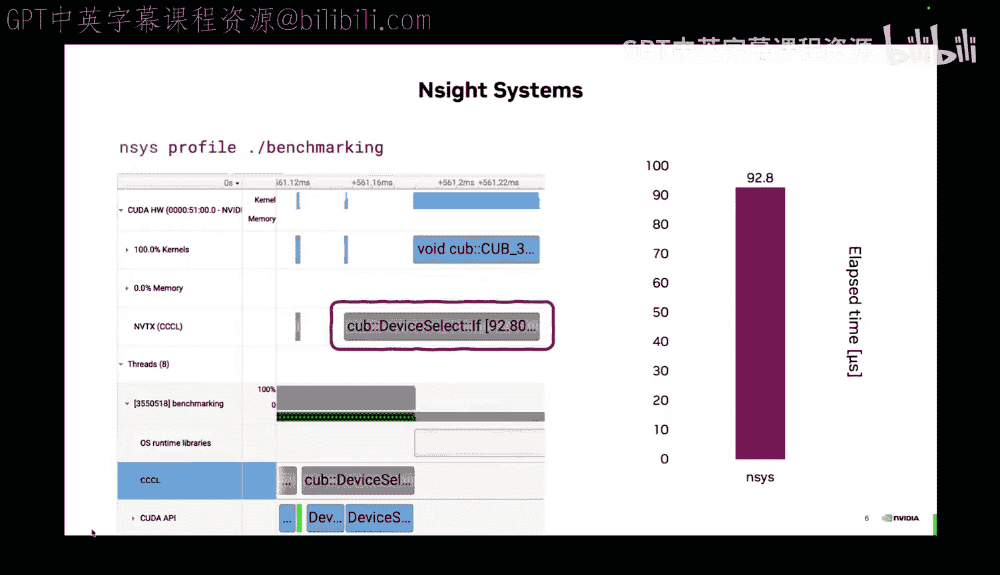
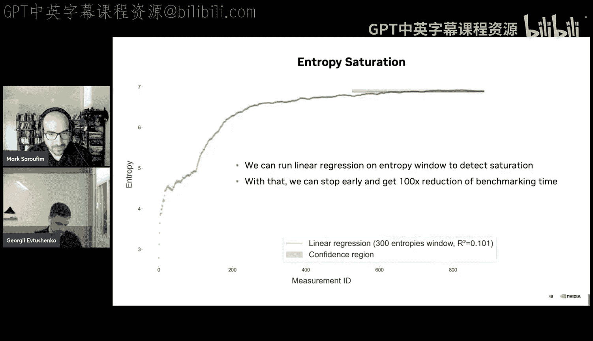
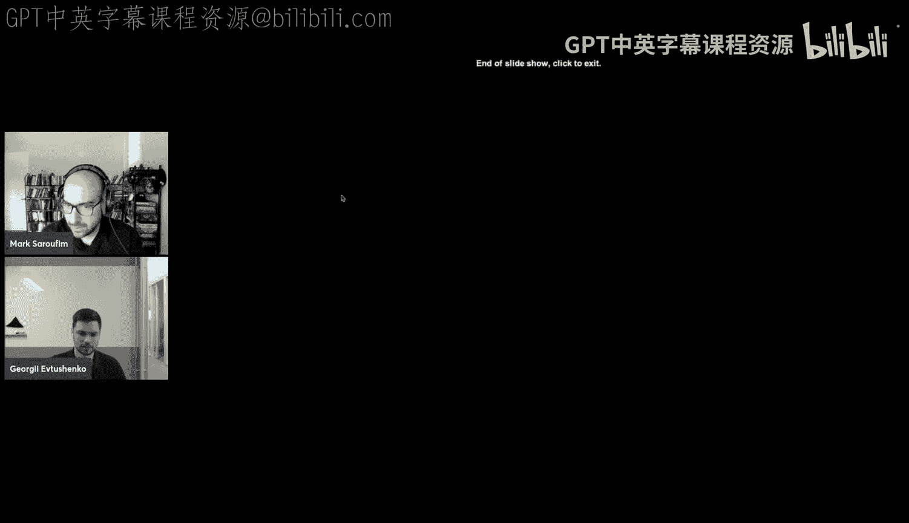
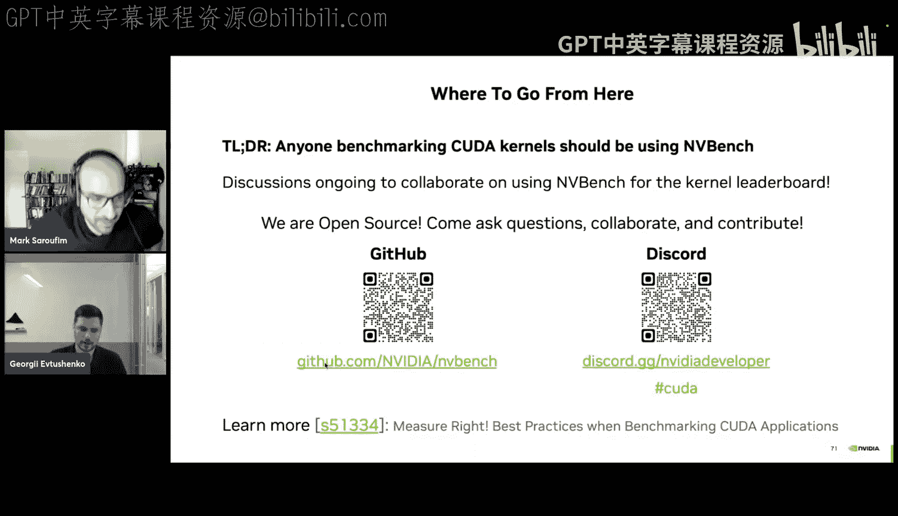

# 3：基准测试的传说 🧪

在本节课中，我们将学习如何为CUDA内核进行准确且可靠的性能基准测试。我们将探讨基准测试与性能分析器的区别，揭示在测量GPU内核性能时可能遇到的各种陷阱，并介绍一个名为NVBench的工具，它可以帮助我们自动化处理这些复杂问题。

## 什么是基准测试？

基准测试是一种工具，用于回答关于代码内核最基本的问题之一。首先要问的问题是：你的内核是否提供了正确的结果？这类问题通常由单元测试来回答。一旦解决了正确性问题，就可以继续探讨性能问题：我的内核有多快？这类问题通常由性能分析器和基准测试来回答。



虽然性能分析器和基准测试在技术上提供了正确的答案，但发现答案的过程往往像格林童话一样充满曲折，因此有了本讲的标题。这个领域初看似乎很熟悉，但随着深入，它会变成一场噩梦。

## 为 `device_select` 评估性能

让我们尝试为 `device_select` 算法回答性能问题。具体来说，假设你有一个应用程序，在某个地方调用了 `cub::device::select`。如果你不熟悉这个算法，它的作用是：接收一个输入范围和一个谓词（例如，选择所有奇数），然后将符合条件的元素原地紧凑排列到输出范围中。

假设这个内核提供了正确的结果。现在我们的问题是：它快吗？在应用程序层面，我们如何弄清楚这一点？

### 使用性能分析器

你应该从使用性能分析器开始。NVIDIA Nsight Systems 是一个提供CPU和GPU活动系统级视图的分析器。它会可视化地表示异步内核、内存传输等活动。

当我们对应用程序使用 Nsight Systems 时，会看到一些以微秒为单位的测量值。通过查看时间线，我们可以发现该算法由两个内核组成，总共耗时约92微秒。

但这并不是唯一可用的工具。NVIDIA Nsight Compute 提供了内核的详细性能视图，包括与源代码级别的性能指标关联以及性能优化指导分析。然而，当我们使用 Nsight Compute 时，两个内核的持续时间总和达到了114微秒，比 Nsight Systems 报告的要长。

这是因为 Nsight Compute 默认将GPU时钟频率锁定在基础值（例如900 MHz），而实际使用的GPU（如A6000）可以加速到更高的频率。这导致了性能下降。我们可以通过告诉 Nsight Compute 避免锁定时钟来改善，这显著减少了算法的运行时间，降至约57微秒。但这仍然与 Nsight Systems 报告的92微秒不符。

### 理解差异：延迟加载

要回答这个问题，必须理解启动内核前需要发生什么。最初，设备代码存储在磁盘上。我们必须将数据加载到RAM，处理它，并将其放入GPU的全局内存，然后才能调用内核。以前，所有设备代码都在应用程序启动时加载。这意味着如果你的应用程序有数千个预编译的内核，但只使用其中几个，就会产生大量的启动开销。

因此，在 CUDA 11.3 之后，默认切换为设备代码的延迟加载。这意味着设备代码将在首次使用内核时被处理和加载到全局内存。这需要大量时间，从而拖慢了性能分析。

我们可以通过设置环境变量 `CUDA_MODULE_LOADING=EAGER` 来控制此行为。在这种模式下，所有内核在应用程序启动时再次加载，我们不会将模块加载时间计入分析。这有助于我们看到 Nsight Compute 和 Nsight Systems 现在报告大致相同的时间。

仍然存在微小差异，这是因为 Nsight Compute 提供的是每个内核的结果，而 Nsight Systems 给出的是执行由多个内核组成的算法所需的实际时间跨度。内核之间的微小差异是由内核拆卸和设置时间造成的，目前 Nsight Compute 没有包含这部分时间。

## 基准测试与性能分析

现在，我们可以稍微转变一下视角。在应用程序层面，当我们使用加速算法时，我们可以问：这个内核在我特定的用例中速度如何？例如，对于 `device_select`，如果50%的数据被选中，问题规模是2亿个元素，数据类型是 `int8_t`。这类问题由性能分析器回答。

但是，当你开发一个内核时，你的视角会转变为：我的内核在各种用例下的速度如何？你需要一种针对内核性能的“单元测试”，覆盖更广泛的工作负载。对于 `device_select`，如果只有1个选中项或2亿个选中项，性能会怎样？如果数据类型是 `double` 呢？这有助于你在开发时更局部地思考内核性能。

因此，我们可以在性能分析器和基准测试之间划清界限。性能分析器本质上是性能调试器，它们提供对特定执行的单次深入分析，并具有更好的硬件可见性。而基准测试则是一种性能单元测试，可用于性能CI，通常覆盖广泛的工作负载，如输入大小、数据类型等。

## 尝试编写基准测试

现在，让我们尝试编写一个基准测试。我们需要自己计时。一个简单的尝试是使用 `std::chrono` 包裹内核调用。

```cpp
auto start = std::chrono::high_resolution_clock::now();
cub::device::select(...);
auto end = std::chrono::high_resolution_clock::now();
```

但这样会得到不切实际的快速结果（约4微秒）。这是因为 `device_select` 是异步的，我们计时的只是启动内核的时间，而不是算法运行的时间。

为了修正这一点，我们可以在计时前后添加 `cudaDeviceSynchronize()` 调用。这确保了我们在开始计时前等待任何先前的异步操作完成，并在算法结束后再记录结束时间。现在我们看到了更现实的100微秒，但这仍然是 Nsight Systems（启用急切加载模式）报告时间的两倍。

这是因为我们仍然处于延迟加载模式。为了绕过这个问题，我们可以进行一次预热运行：先调用一次 `cub::device::select` 并同步，然后再进行计时。这有所帮助，现在我们看到57微秒，但这比 Nsight Systems 急切模式下的结果还要快。

这是因为第一次调用触发了设备代码加载到全局内存，同时也预热了所有缓存。算法将要读取的所有数据在第二次调用时已经驻留在L2缓存中。我们无意中将算法置于了一个理想场景。为了绕过这一点，我们可以尝试刷新缓存。一个简单的方法是写入大量随机数据以驱逐L2缓存中的任何内容。

这有所帮助，现在我们回到了66微秒，比之前慢了，但仍然比 Nsight Systems 急切模式的60微秒要慢。

### 提高计时精度：CUDA 事件

要回答这个问题，让我们看看当前的基准测试方案。我们使用 `chrono::now()` 记录开始时间 `T0`，然后启动所有内核，接着调用 `cudaDeviceSynchronize()`（在GPU端完成工作的时刻记为 `Ts`），最后用 `chrono::now()` 记录结束时间 `T1`。

问题在于，我们希望在 `Ts`（内核实际结束）时刻尽可能接近地获得结束测量值 `T1`。但 `cudaDeviceSynchronize()` 做了更多工作：它等待GPU完成工作，然后同步CPU，这显然需要一些时间。因此，`T1` 和 `Ts` 之间存在开销。

我们可以依靠CUDA事件来消除这种开销。CUDA事件直接在GPU时间线上记录，不涉及CPU同步。在代码中，可以这样实现：

```cpp
cudaEvent_t start, stop;
cudaEventCreate(&start);
cudaEventCreate(&stop);

// 预热和刷新缓存...
cudaEventRecord(start);
cub::device::select(...);
cudaEventRecord(stop);
cudaEventSynchronize(stop);

float milliseconds = 0;
cudaEventElapsedTime(&milliseconds, start, stop);
```

这给了我们更好的结果，现在更接近急切模式下的 Nsight Systems 测量值。我们移除了一些开销，但仍然存在差距。

### 消除内核启动开销：流阻塞

让我们再次审视当前方案。开始事件的记录点 `T0` 距离GPU上内核的实际开始时间 `Tk` 相当远。这个开销是由CPU端启动内核所需的时间（称为内核启动延迟）造成的。我们对这个时间不感兴趣，因为我们试图了解GPU端完成工作需要多长时间，而不是启动工作需要多长时间。

我们如何让 `T0` 更接近 `Tk` 呢？我们可以尝试通过阻塞CUDA流来“欺骗”系统。这样，我们可以在流被阻塞时记录开始事件，然后启动所有内核，记录结束事件，最后解除流的阻塞。如果我们能做到这一点，就能让 `T0` 非常接近内核的开始时间。

通过结合预热、刷新缓存、使用CUDA事件和流阻塞，我们最终得到了与 Nsight Systems 报告非常相似的时间。这是相当准确的测量。

## 测量的噪声与分布

但这还不是故事的全部。这也是本次演讲标题“基准测试传说”的第二个原因。如果你多次运行基准测试，实际上会得到一个测量值的分布，而不是单一值。像任何童话一样，部分真实情况是，880微秒确实存在于分布中的某个位置，但内核可能运行得更快或更慢。

童话的部分在于，我们可以用单一值来代表整个分布。在这一点上，我们快速回顾一下。我们已经明白，性能分析器是性能调试器，基准测试是性能单元测试。我们还理解了准确计时CUDA内核需要预热运行、刷新缓存、复杂使用CUDA流和事件，而这些最好留给专门的工具。但最重要的是，我们意识到测量是有噪声的，这导致需要进行多次测量。

如果我们进行多次测量，就必须问几个问题：第一，我们能否或应否尝试减少数据中的噪声？第二，我们需要进行多少次测量？

### 测量次数与节流

简单的方法是直接运行内核很多次（例如10万次），然后计算平均运行时间。但如果我们这样做，会看到完全奇怪的结果：现在内核运行需要毫秒级的时间，而之前我们还在800微秒的范围内。发生了什么？

当我们收集测量值时，可以看到GPU频率开始下降。这是因为我们的 `select` 实现非常高效，导致GPU发热。随着GPU变热，它开始降低频率，这被称为节流。这种节流影响了 `device_select` 的执行时间，导致运行时间有大约35%的差异。

我们该如何处理这种差异？这种差异仅仅是由节流引起的，还是有其他因素？为了回答这个问题，我们可以尝试按频率范围对数据进行分桶。首先，这帮助我们认识到 `device_select` 的实现与GPU频率呈强逆线性相关：GPU工作得越慢，算法运行时间越长。

其次，我们可以观察到，在相同的频率范围内，算法的运行时间仍有约2%的变异。这是由 `device_select` 内部的并发机制造成的。该算法内部有一些复杂的并发机制，导致其性能不具有确定性。因此，我们必须进行多次基准测试，以找出该算法实际所处的代表性性能状态集合。

从这个图中我们还可以得到另一个启示。深绿色部分是通过使用均匀分布并选择所有元素来运行算法观察到的。如果我们改为使用一个接近零的常数，并选择该常数，使得写入内存的元素数量相同，内核中所有代码路径也相同，但可以观察到运行时间显著下降。为什么会发生这种情况？为什么相同的代码路径会导致不同的频率缩放和不同的执行时间？

我选择这个工作负载是为了说明，接近零的值意味着该字段中的所有位都是零，而零意味着芯片上没有电流。电流更少意味着热量更少。因此，仅仅通过选择不影响任何代码路径的不同工作负载或输入，就可以观察到不同的热节流行为。

这对我们来说意味着，在进行基准测试时，花时间准备一些现实的工作负载至关重要，而不是仅仅提供一些随机的人工常数。

### 锁定时钟频率

无论如何，我们能否减少这种差异？假设我们确实需要对均匀分布进行基准测试，因为它更现实，更能代表应用程序使用 `device_select` 的情况。我们能在硬件层面减少这种差异吗？

我们可以尝试将时钟锁定在尽可能接近用户设置的值，比如查看3.1 GHz。但更快的GPU会更快地发热，所以我们仍然会有一个小的频率下降范围。总体而言，这并没有真正减少10万次内核调用中运行时间的差异。这并不奇怪，因为GPU如果发热，就必须降频。

那么，查看较低的时钟频率呢？例如2.5 GHz或2.2 GHz。但这次让我们使用一个不同的算法：`device_histogram`。这再次导致了一些令人惊讶的结果。

在完全相同的工作负载、问题规模、数据类型和所有值都相同的情况下，我在2.5 GHz和2.2 GHz下进行基准测试。数据显示，降低时钟频率后，算法运行得更快了，有大约6%的速度提升。这有些令人惊讶，为什么会这样？

`histogram` 是一个重度使用原子操作的算法。在某个时刻，我们会向内存发出大量原子操作，这会导致争用。在更高的时钟频率下，我们以更高的速率发出原子操作是合理的。但如果我们降低GPU端的频率而保持内存频率不变，我们发出原子操作的速率就会降低，这意味着争用减少，这可能对性能产生积极影响，正如我们在屏幕上数据中看到的那样。

如果我们现在绘制每个GPU频率下的运行时间分布，会看到一些有趣的现象。起初，频率越高，运行时间越短，这是合理的。但当你达到2.2 GHz左右时，运行算法的时间开始增长，然后略有下降，这是一种非线性的行为。

### 稳定测量的意义

这对我们意味着什么？我们能查看较低的时钟频率吗？现在是时候问一个问题了：我们为什么首先需要准确的测量或稳定的测量？通常，当你试图比较某些东西时，才会对稳定的测量感兴趣。例如，你可能想知道我的内核性能是否退步了？或者我的更改是否带来了性能改进？但是，当运行时间对频率存在非线性依赖时，答案可能会令人惊讶。

以 `histogram` 为例。这次我们关注一个更改：我们希望将线程块大小从300个线程改为1000个线程。这个更改将如何影响性能？

在左侧（2.2 GHz GPU），更改导致性能退步。从300个线程增加到1000个线程，性能下降了。这有一定道理，因为我们没有发出足够的原子操作来造成内存端争用，因此增加线程块大小只是降低了占用率，导致并发工作的线程块减少，这是一种退步。

但在更高的时钟频率下（右侧，2.5 GHz），降低占用率反而有帮助，因为我们发出的原子操作更少，但更大的线程块处理着更大的私有化直方图，这显著提升了性能。

简而言之，如果我们查看较低的GPU时钟值，我们可能会观察到不能代表真实设置的性能变化。用户运行你的内核时不会锁定低频，他们感兴趣的是GPU的最大性能。因此，如果你在较低频率下观察到退步，你可能会避免应用这个更改，而这个更改实际上在更能代表用户工作负载的较高频率下带来了显著的性能提升。

相反的情况也可能发生。我们多次看到，在较低频率下观察到性能改进，但在较高频率下性能却退步了。因此，这强烈取决于你的算法运行时间对GPU频率的依赖曲线的形状。

对于一些算法来说，情况没那么糟。例如，`adjacent_difference` 是Thrust库中最简单的内核之一，它几乎不依赖于GPU频率，因为这个算法是内存瓶颈型的，计算量很少。

### 关键要点

在这一点上，我们可以得出哪些结论？
*   锁定在较低频率是不安全的，锁定在较高频率也无济于事。
*   算法本身会导致差异，因此我们必须进行多次基准测试。
*   但我们又面临着因启动大量基准测试而导致的过度节流问题。

那么，我们可以做的是尝试测量基准测试期间GPU的平均频率，然后直接丢弃在明显节流期间发生的测量值。例如，我们可以声明一个最大频率，获取平均频率，并设置一个阈值（比如峰值的75%），认为这对于我的应用程序来说是不现实的，然后丢弃这些测量值。这将帮助我们获得更具代表性的性能指标样本。

还有一个相关问题：我们应该锁定CPU时钟吗？由于我们之前讨论的流阻塞方法，我们并没有真正将CPU端启动内核的时间计入测量。因此，CPU目前无法影响我们的测量，锁定CPU时钟没有帮助。

## 高效的测量：熵停止准则

但我们仍然存在10万次测量耗时太长的问题。这只是一个工作负载，我们实际上可能有许多数据类型和问题规模需要测试，而这正是基准测试的目的。因此，我们希望能够尽可能减少测量次数。我们该如何做到这一点？

我们可以尝试重新表述这个问题。打个比方：我有一个骰子，但不知道它有多少面。我该如何弄清楚需要投掷这个骰子多少次才能理解它的面数？要回答这个问题，我们可以参考香农熵。

香农熵表示描述一个随机变量状态所需的信息量的期望值。对于性能测量，事件 `X` 是我们从内核运行中观察到的具体运行时间。

让我们尝试投掷骰子一次。假设我们掷出了6。我们唯一观察到的事件是6，并且观察到一次。所以观察到6的概率是1，熵是0。这是合理的，因为根据我们看到的数据，描述下一个随机变量不需要任何信息，它还会是6。

如果你第二次投掷并观察到2，现在我们有两个等可能的事件（6和2），熵增加到1。现在我们需要更多信息来描述下一次投掷，可能是2或6，我们不知道。随着你不断投掷，每次出现新的、令人惊讶的测量值时，熵都会增加。

如果我们掷了19次，终于看到了最后一面（假设是6面骰子）。理想情况下，如果我们知道骰子的实际面数，我们就会在这里停止。你会看到熵随着投掷次数增加而逐渐饱和，因为看到每个新测量值变得越来越不令人惊讶。但我们实际上并不知道只有六面，也许有更多面，所以让我们尝试掷47次。你会看到熵现在已经完全稳定，不再进一步增加，它已经饱和了。





我们可以在基准测试中利用这个特性，提出一个停止准则。让我们从投骰子回到性能测量。对于 `select`，尝试追踪样本熵随时间的变化。你可以看到同样的效果：我们得到越来越不令人惊讶的测量值。

我们如何停止基准测试？我们可以尝试在熵的窗口上运行线性回归，以查看线性回归在何处表明熵已达到饱和。通过这种方法，我们可以更早停止。例如，我们在大约800次测量后停止，这比我们原本计划的10万次要少100多倍。

这就引出了一个问题：我们是否真的看到了之前观察到的所有性能分布？数据显示，虽然不完美，但我们至少覆盖了与过度基准测试相同的运行时间范围和频率范围。因此，我们在尽可能减少测量的同时，获得了更符合现实的测量值分布。

## NVBench：自动化基准测试框架

但是，实现所有这些（流阻塞、停止准则、预热、缓存刷新等）变得非常复杂。将这些抽象到一个框架中是合理的。这正是我们所做的，我们创建了 NVBench。

它类似于 Google Benchmark（如果你熟悉这个工具），但不同之处在于它支持 CUDA。它理解CUDA计时器、设备、缓存刷新。它还通过流阻塞和基于熵的停止准则提高了基准测试的稳定性。此外，它还具有强大的参数扫描框架实用程序，允许你探索工作负载空间，以及灵活的命令行界面。



让我们看看如果使用 NVBench，基准测试会是什么样子。基准测试只是一个接受 `nvbench::state&` 引用的函数，然后你用 `NVBENCH_BENCH` 宏注册它。你还可以为内核的参数注册不同的轴。例如，我们可能关心 `select` 在小、中、大问题规模下的性能。你可以注册一个名为 `elements` 的轴和三个值，基准测试将被调用三次。在基准测试函数内部，你可以通过 `state.get_int64("elements")` 检索当前元素