# 4：CuTe张量代数库入门教程

## 概述

在本节课中，我们将学习CuTe（CUDA Tensor）库的核心概念。CuTe是一套用于在GPU上高效构建张量线性代数运算的抽象工具集，它通过独特的布局（Layout）系统，将复杂的多维数据访问和线程分区模式转化为可组合的数学对象，从而兼顾了编程的灵活性与运行时性能。

## 1. CuTe的起源与目标

上一节我们介绍了课程概述，本节中我们来看看CuTe库是如何诞生的，以及它旨在解决什么问题。

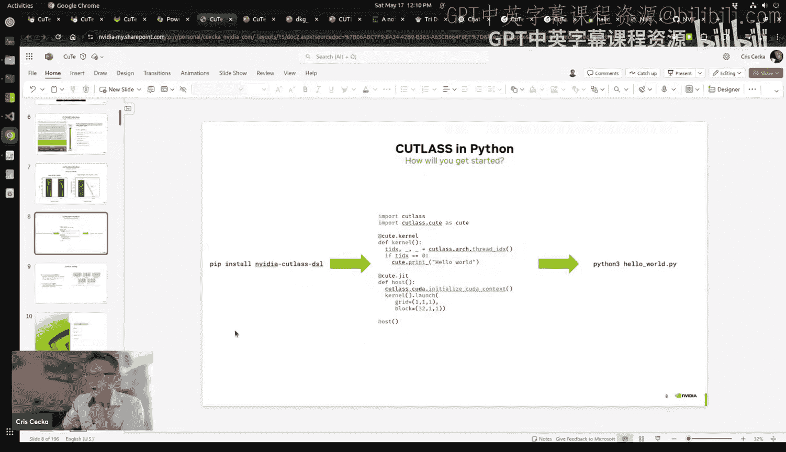


CuTe的创造源于一个核心痛点：张量收缩（Tensor Contractions）操作在现有库中实现起来异常困难。尽管张量收缩本质上可以视为广义的矩阵乘法（GEMM），但传统方法（如BLAS扩展）在处理多维数据的复杂布局和分区时显得笨拙且低效。

CuTe的开发历程证明了其设计的优越性。在早期实验中，一位实习生仅用一周时间，通过修改一个基于CuTe的单文件GEMM示例，就超越了高度优化的cuBLAS库25%的性能。这得益于CuTe提供的“可破解”的、高级别的抽象，使得开发者能够深入底层进行优化，同时保持代码的简洁性。

CuTe的核心目标是：**为构建GPU上各种规模和范围的张量线性代数运算，提供一套兼顾生产力（Productivity）与性能（Performance）的抽象**。它是一个多层次系统，开发者可以从任意层级切入：
*   **速度极限（Speed of Light, SOL）内核**：提供接近硬件理论极限性能的预构建内核（如GEMM）。
*   **集合（Collective）层**：允许开发者对计算和通信模式进行定制化“ hacking”。
*   **基础CuTe层**：整个cuBLAS库都构建在CuTe之上，提供了最底层的布局和代数操作原语。

## 2. 从循环到布局：思想的转变

上一节我们了解了CuTe的目标，本节中我们来看看它是如何通过重新思考循环来建立其核心抽象的。

传统的多维循环代码包含大量起始索引、步长和偏移量参数，使得数据在内存中的实际布局难以一眼看清。CuTe的思想是将这些参数抽象为一个**布局（Layout）** 对象。

布局是一个数学函数，它将**逻辑坐标**（例如矩阵中的`(i, j)`）映射到**物理索引**（内存中的一维偏移量）。最常见的布局是仿射变换，通过**步长（Stride）** 来描述。

以下是如何用步长描述常见布局：

*   **列优先（Column-major）**：对于一个2x3的矩阵，形状为 `(2, 3)`，步长为 `(1, 2)`。这意味着沿着行（第一维）移动时，内存地址连续（步长为1）；沿着列（第二维）移动时，需要跳过一行的元素（步长为2）。
    *   物理内存顺序：A, B, C, D, E, F
*   **行优先（Row-major）**：形状同样为 `(2, 3)`，步长为 `(3, 1)`。沿着列（第二维）移动时内存地址连续。
    *   物理内存顺序：A, D, B, E, C, F
*   **带填充的布局**：形状 `(2, 3)`，步长 `(1, 4)`。这会在每“行”末尾留下一个未使用的填充元素。
*   **高维张量**：此概念可轻松扩展到任意维度。对于一个三维张量，其布局由形状 `(dim0, dim1, dim2)` 和对应的步长 `(stride0, stride1, stride2)` 定义。

给定逻辑坐标 `coord` 和步长元组 `strides`，计算物理索引 `physical_idx` 的公式为：
`physical_idx = sum(coord[i] * strides[i]) for i in range(rank)`

**CuTe的创新之一：静态形状与步长**
在GPU编程中，尤其是在处理寄存器、共享内存或静态分块时，张量的形状和步长常常在编译时已知。CuTe允许将这些值定义为**静态整数**。编译器可以利用这些信息进行激进优化（如完全展开循环、预计算偏移量），从而消除所有运行时开销。

```cpp
// 动态形状
cute::Tensor tensor_dyn = make_tensor(data_ptr, cute::make_shape(22, 19));
// 静态形状（22在编译时已知）
cute::Tensor tensor_static = make_tensor(data_ptr, cute::make_shape(cute::Int<22>{}, 19));
```
静态信息会在打印的布局中以下划线 `_` 标示，并且在性能关键的内核中至关重要。

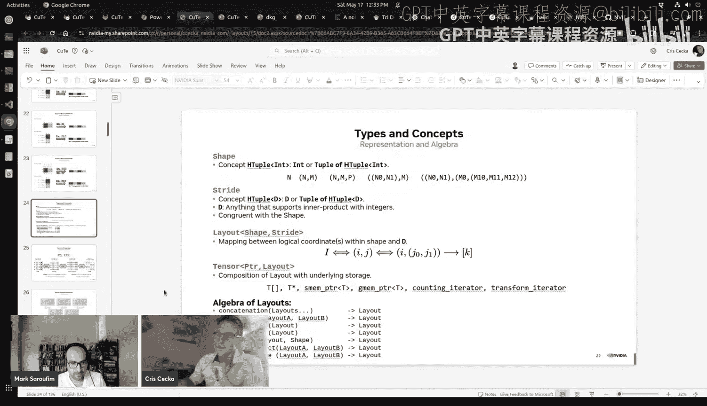

## 3. 布局的威力：折叠与代数运算

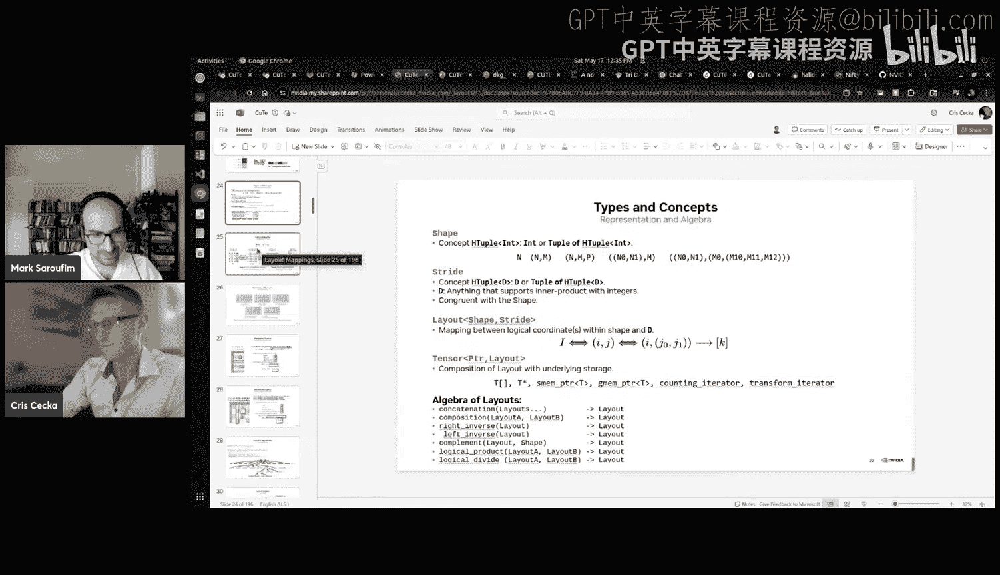

上一节我们介绍了基础的布局概念，本节中我们来看看CuTe布局如何通过“折叠”和代数运算解决传统方法无法处理的难题。

一个常见的需求是将高维张量“折叠”成矩阵，以便调用高效的GEMM库。然而，传统的“展平”操作存在不对称性。

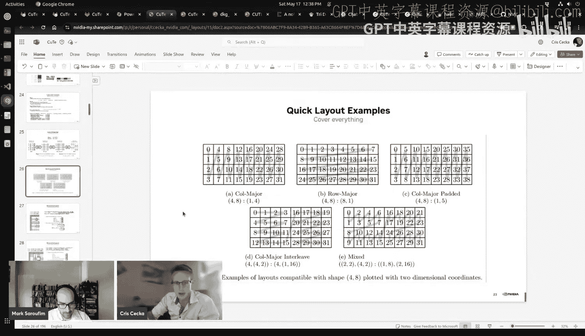

**问题**：考虑一个形状为 `(2, 2, 2)`，步长为 `(4, 1, 2)` 的三维张量。我们可以轻松地将其前两维合并，视为一个 `2 x 4` 的矩阵。但是，如果我们想将其视为一个 `4 x 2` 的矩阵（即合并后两维），却找不到一个**单一的整数步长**来描述新“行”中元素的物理位置（因为元素A、C、E、G在内存中并非等间距排列）。

**CuTe的解决方案**：放弃强制“展平”为单一步长矩阵的思维。CuTe允许我们创建**层次化形状（Hierarchical Shape）**。

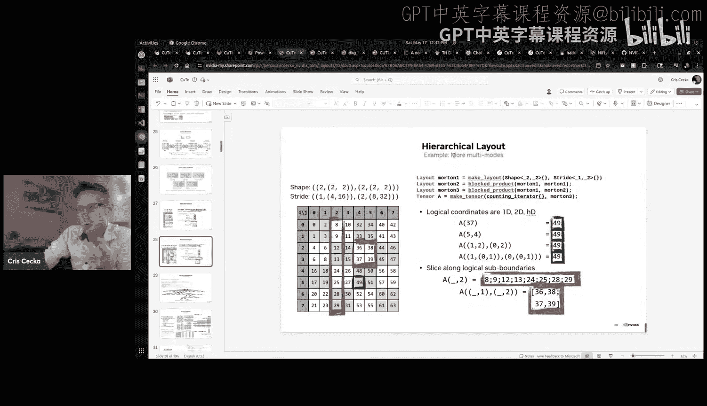

与其将 `(2,2,2)` 张量强行视为 `(4,2)`，不如将其视为 `((2,2), 2)`。这意味着新的行坐标本身是一个二维坐标 `(i,j)`。通过这种方式，我们保留了原始的步长信息 `(4,1,2)`。当使用行索引 `(i,j)` 和列索引 `k` 进行访问时，计算物理索引的公式依然成立：
`physical_idx = (i, j, k) · (4, 1, 2) = i*4 + j*1 + k*2`

在代码中，我们可以通过一个简单的索引转换，将一维的行编号 `r` 映射到这个二维坐标 `(r/2, r%2)`，从而在算法层面仍然将其当作普通的 `4x2` 矩阵来处理。这揭示了**折叠的对称性**：只要通过层次化形状保留内部结构，任何张量都可以折叠成任何形式的矩阵。

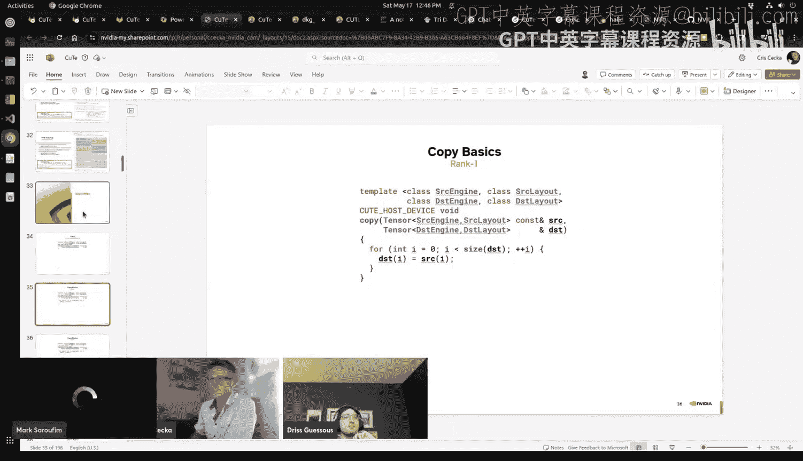

**布局代数**
CuTe将布局视为可进行数学运算的对象，形成了一个丰富的代数系统：
*   **组合（Composition）**：`layout_c = layout_a ◦ layout_b`。这是最强大的操作，可以构建复杂的分区。
*   **乘积（Product）**：用一个布局替换另一个布局中的每个元素，形成“布局的布局”。
*   **除法（Divide）**：根据一个布局将另一个布局分割。
*   **逆（Inverse）**：获取布局的逆映射。

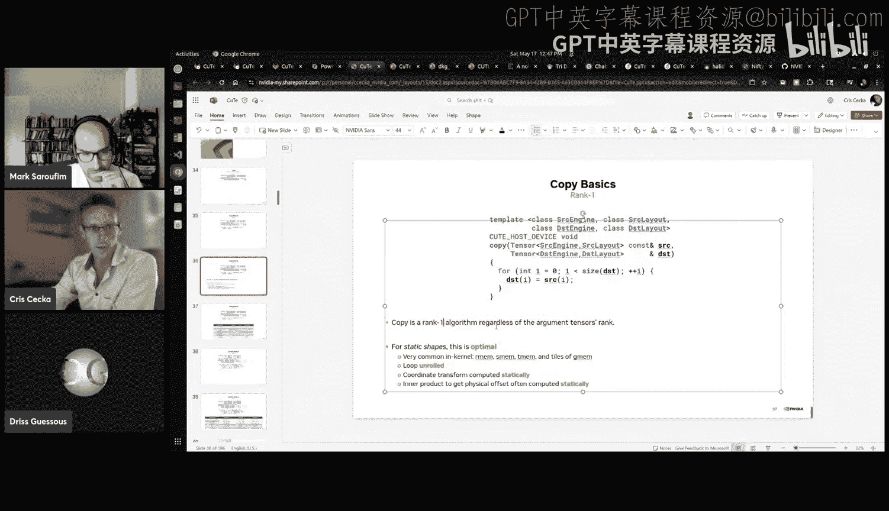

这些操作为实现通用的分块（Tiling）和分区（Partitioning）提供了坚实的基础。

## 4. 通用算法：一次编写，处处运行

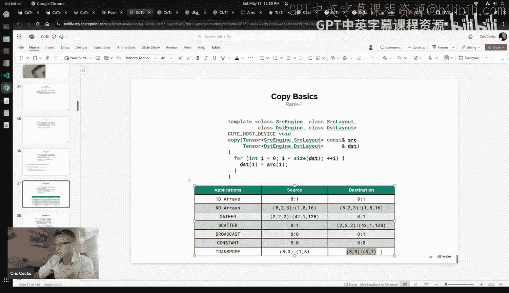

上一节我们探讨了布局的代数性质，本节中我们来看看如何利用这些性质编写极其通用的算法。

得益于布局抽象，我们可以编写出与张量维度、形状、步长无关的算法。

**以Copy为例**
一个朴素的复制实现需要根据源张量和目标张量的维度编写多重嵌套循环。但在CuTe中，由于所有张量都可以通过整数坐标进行索引，复制算法可以简化为一个一维循环：

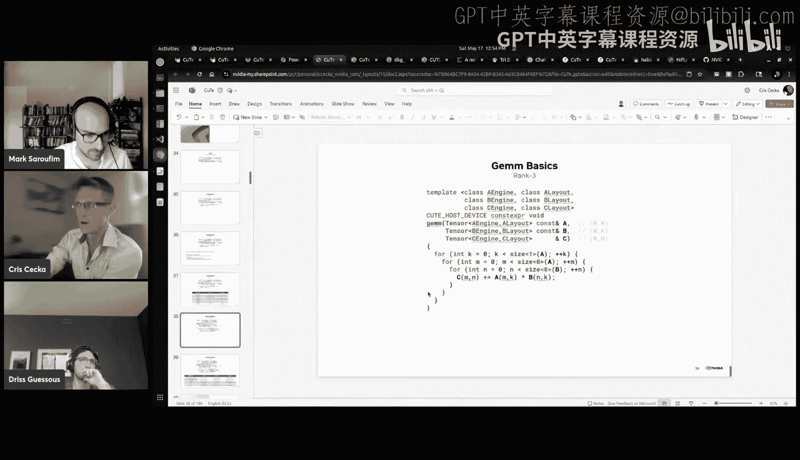

```cpp
template <class SrcTensor, class DstTensor>
void copy(SrcTensor const& src, DstTensor& dst) {
    for (int i = 0; i < size(dst); ++i) {
        dst(i) = src(i);
    }
}
```
这个简单的 `copy` 函数可以处理：
*   任意维度的张量之间的复制。
*   转置操作（例如从列优先布局复制到行优先布局）。
*   广播操作（从步长为0的张量复制）。
*   收集（Gather）和散射（Scatter）操作。
*   静态形状的完全循环展开与零运行时开销优化。

**以GEMM为例**
同样，矩阵乘法的核心也可以用一个与具体布局无关的三重循环来实现：
`C(m, n) += A(m, k) * B(k, n)`
只要 `A`, `B`, `C` 张量支持通过 `(m,k)`, `(k,n)`, `(m,n)` 坐标进行访问，这个算法就成立。这使得同一个GEMM实现可以用于普通矩阵乘法、批处理GEMM、张量收缩甚至卷积（通过Im2Col变换）。

## 5. 核心应用：线程分区与Tensor Core编程

上一节我们看到了通用算法的简洁性，本节中我们来看看CuTe最具威力的应用：描述复杂的线程数据分区，特别是用于Tensor Core编程。

在GPU内核中，一个关键步骤是将全局数据分块（Tile）并分配给线程块（Block）或线程（Thread）进行处理。CuTe通过**布局组合**来优雅地定义分区。

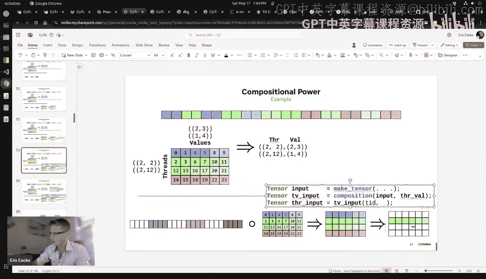

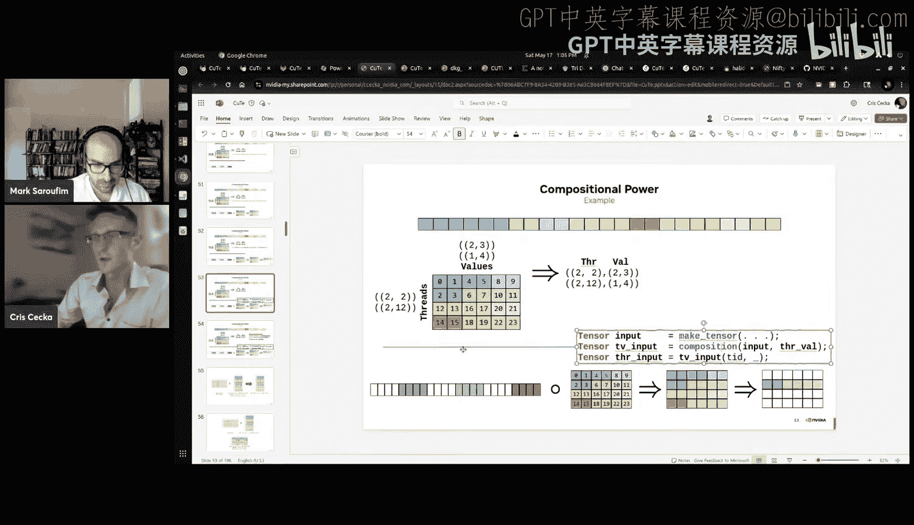

**分区即组合后切片**
1.  **定义线程值布局（Thread Value Layout）**：这是一个描述“哪个线程负责哪些逻辑坐标”的布局。例如，对于一个有4个线程的向量，可以定义一个 `4x6` 的布局，其中每一行对应一个线程，行内的6个坐标是该线程需要处理的向量元素位置。
2.  **与输入张量组合**：将输入张量的布局与线程值布局进行**功能组合（Functional Composition）**。这产生了一个新的布局，其第一维是线程ID，第二维是该线程负责的元素在其本地视图中的索引。
3.  **切片**：每个线程通过自己的线程ID对这个组合后的布局进行切片，就得到了自己负责的那部分数据的视图（一个子张量）。

**公式化表示**：
`thread_sub_tensor = slice(compose(global_tensor_layout, thread_value_layout), thread_id, _)`

这个方法的强大之处在于：
*   **适用于任意张量**：因为任何张量都可以通过整数坐标索引，所以此分区方法适用于任何维度、任何布局的张量。
*   **完美匹配Tensor Core**：NVIDIA Tensor Core指令集有严格的输入数据分区要求。CuTe可以精确地将这些要求编码为线程值布局。开发者只需构建正确的共享内存布局和寄存器布局，然后使用相同的分区模式，即可安全、正确地调用复杂的Tensor Core指令（如Volta、Ampere、Hopper架构的MMA指令）。
*   **提升开发效率**：无需手动跟踪每个线程负责哪些复杂非连续的数据。CuTe的抽象使得编写和调试Tensor Core内核变得更加直观和安全。优化工作通常简化为设计更高效的共享内存布局，而核心计算逻辑保持不变。

## 6. 高级优化：自动化向量化与未来方向

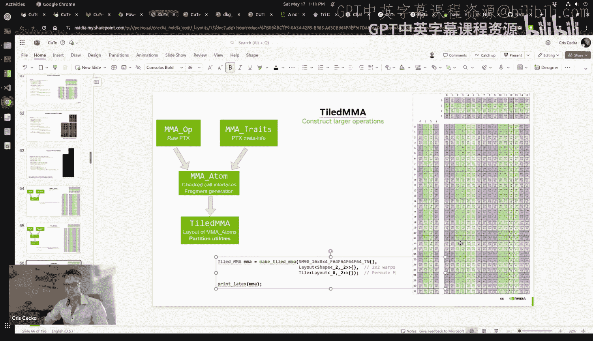


上一节我们深入了解了CuTe在核心计算中的应用，本节中我们简要探讨其如何支持高级编译时优化，并展望其未来。

CuTe的数学基础允许在编译时进行深度分析，从而自动启用优化。

**自动化向量化**
考虑两个张量之间的复制操作。如果源张量和目标张量在某个逻辑子区域上，其元素在物理内存中都是连续的，那么就可以用更宽的向量化加载/存储指令来加速复制。CuTe可以通过数学运算（如计算两个布局的**公共子布局**）自动发现这种机会。

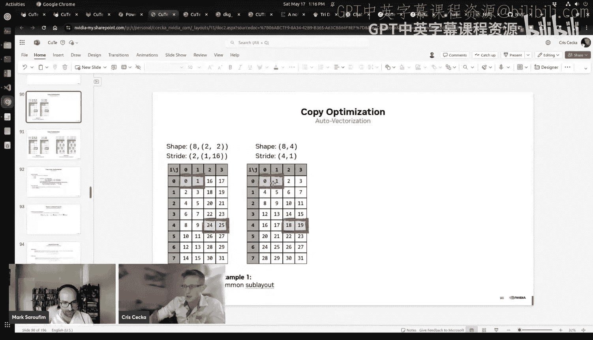

**公共子布局的数学本质**可以归结为计算 `inverse(layout_b) ◦ layout_a`。其结果揭示了两个布局在坐标映射上的最大公共连续模式，编译器可据此安全地确定向量化宽度。

**CuTe的Python前端**
为了应对C++模板元编程带来的编译时间慢、错误信息冗长等挑战，CuTe团队正在积极开发Python前端。这将带来：
*   **极快的编译/“编译”时间**（提升超100倍）。
*   **与PyTorch等ML框架的无缝集成**。
*   **更易上手的编程体验**，同时保留CuTe的所有表达能力。

## 总结

本节课中我们一起学习了CuTe张量代数库的核心思想与应用。我们从其解决张量收缩难题的起源出发，逐步深入其核心抽象——**布局（Layout）**。布局作为一个将逻辑坐标映射到物理索引的数学函数，通过支持静态信息、层次化形状和丰富的代数运算（组合、乘积等），实现了前所未有的灵活性。

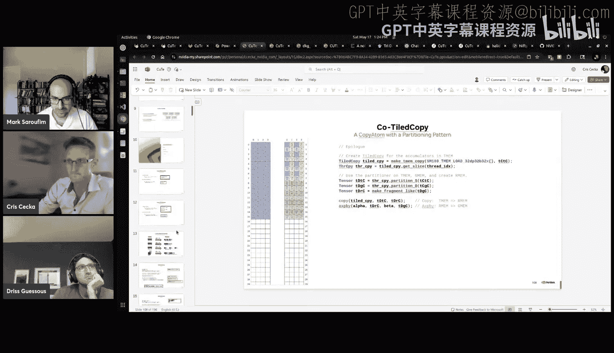

我们看到，基于布局的抽象使得编写维度无关的通用算法（如`copy`、`gemm`）成为可能。更重要的是，CuTe通过“**分区即组合后切片**”的范式，为GPU内核中复杂的数据分区，特别是Tensor Core编程，提供了安全、简洁且强大的描述工具。最后，我们了解到CuTe的数学基础还能支持编译时的自动化优化，并且其正在向更友好的Python生态系统演进。

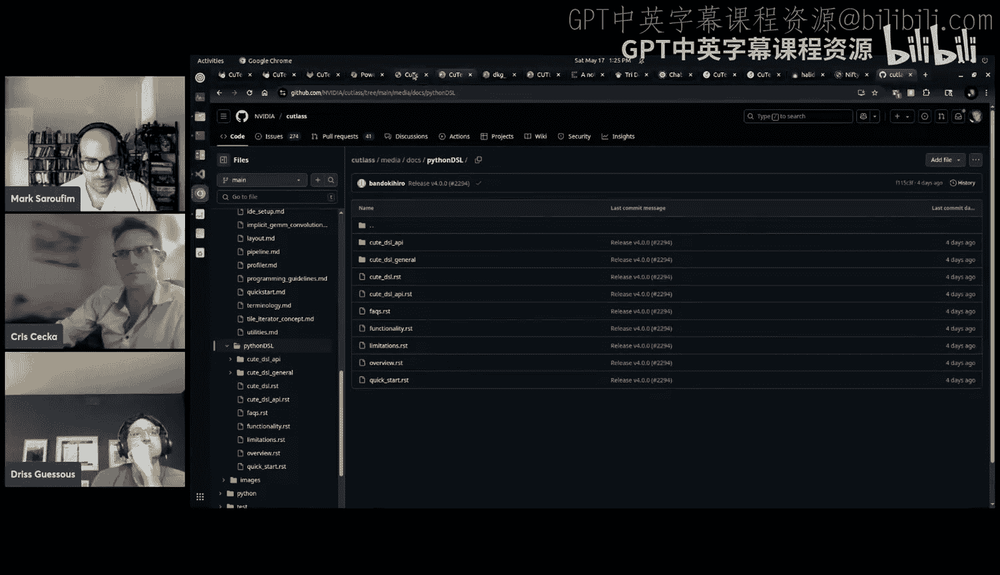

CuTe的成功体现在其作为cuBLAS等高性能库的基石，以及被广泛应用于从基础线性代数到注意力机制等各种GPU计算场景中。它证明了良好的抽象不仅能提升生产力，更能释放硬件的极限性能。