# 5：解耦式大语言模型推理 🚀

## 概述
在本节课中，我们将要学习解耦式大语言模型推理。这是一种将推理过程的前缀阶段和解码阶段分离的系统设计方法，旨在优化服务质量和资源利用率。我们将探讨其核心动机、设计挑战、实现方案以及社区的最新进展。

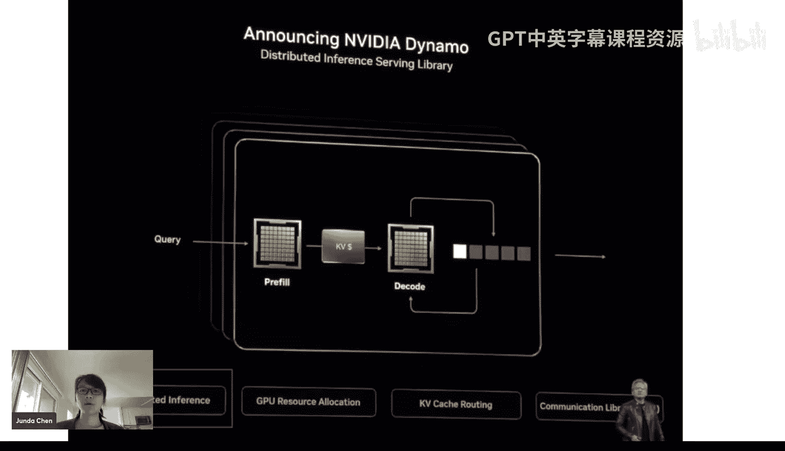

---

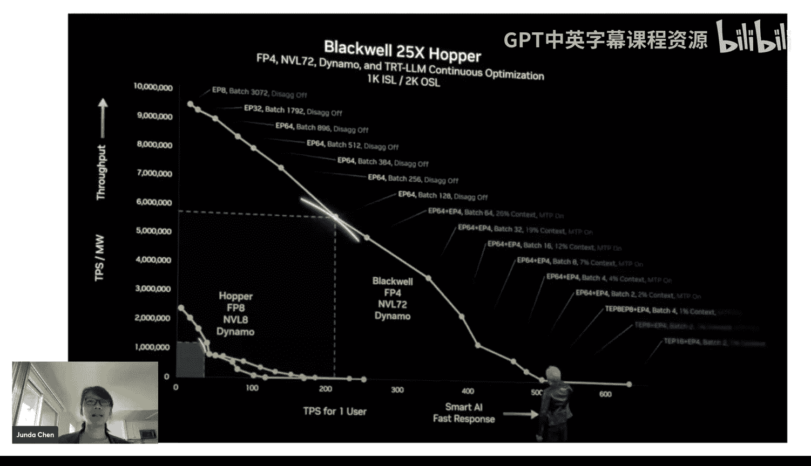

## 引言与背景

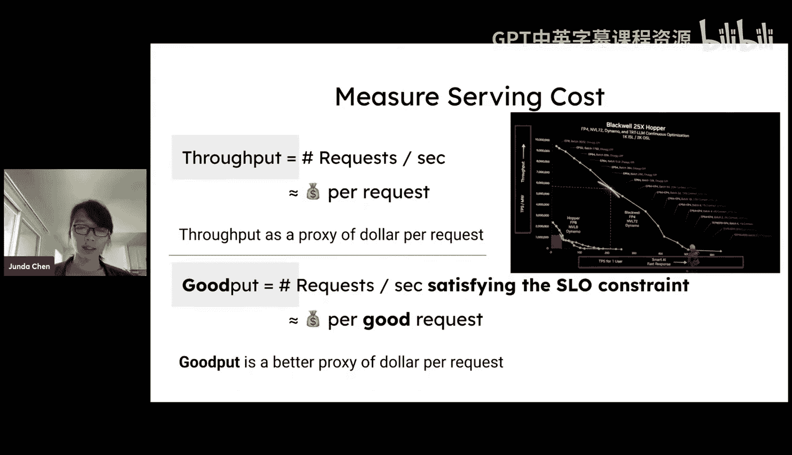

上一节我们介绍了课程主题，本节中我们来看看解耦式推理的背景和动机。

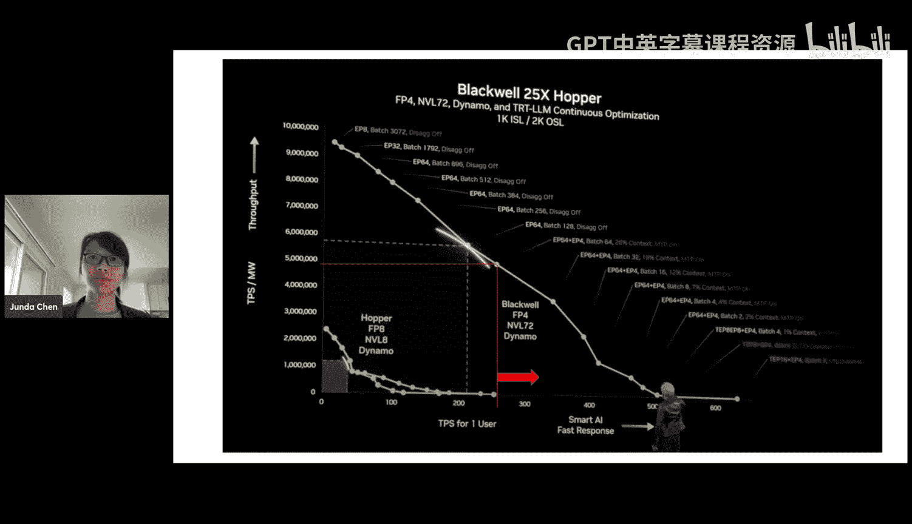

欢迎来到GPU MODE的第58讲。本次讲座将讨论解耦式大语言模型推理。这项研究是近年来最具影响力的机器学习系统研究之一。

如今，我们有多种不同的应用场景，例如聊天机器人、搜索引擎或编程助手，它们对服务等级目标有着不同的要求。我们主要关注两个指标：
*   **首令牌时间**：从收到请求到生成第一个输出令牌所需的时间。
*   **每令牌时间**：在生成第一个令牌后，后续每个输出令牌之间的间隔时间。

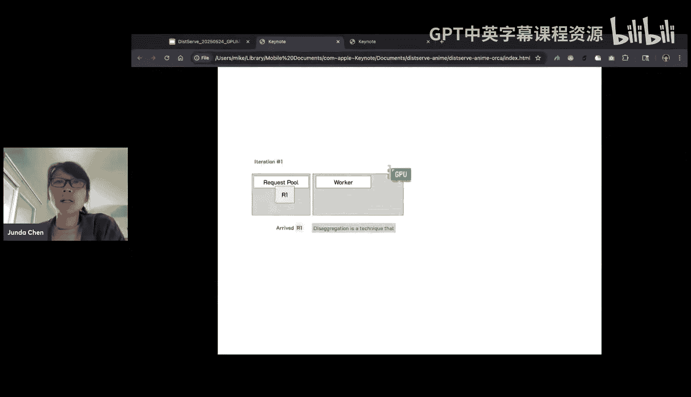

不同的应用对这些延迟有着不同的敏感度。

---

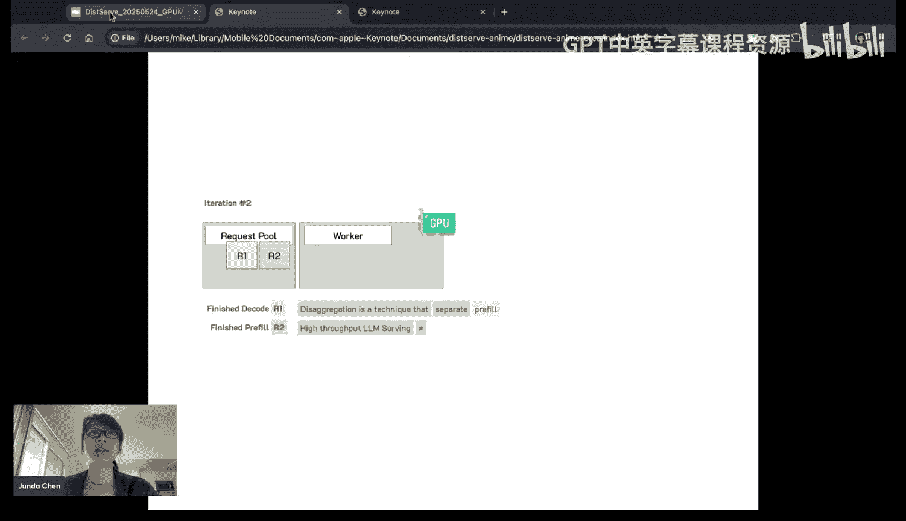

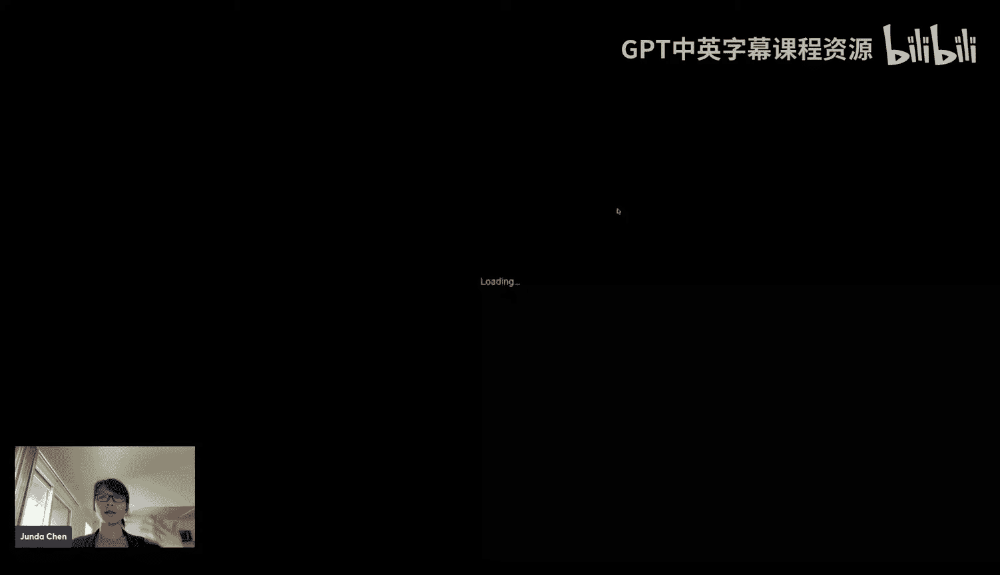

## 从吞吐量到优质吞吐量

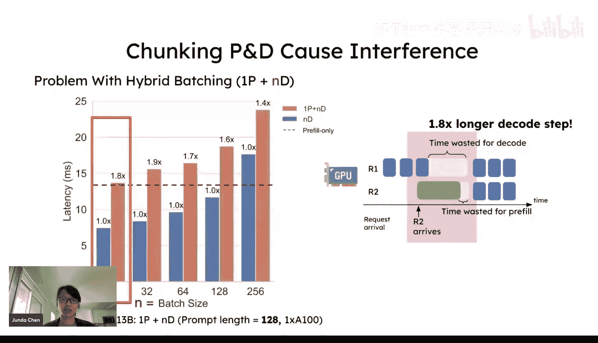

上一节我们提到了延迟指标，本节中我们来看看如何更全面地评估系统性能。

长期以来，人们通常使用**吞吐量**作为衡量推理系统成本的代理指标。这里的吞吐量指系统每秒处理的请求数或生成的令牌数。

然而，仅考虑吞吐量是不够的。如果系统负载过高，导致用户请求的延迟无法满足其应用的服务等级目标，那么用户体验就会下降。因此，我们引入了一个更优的指标——**优质吞吐量**。

**优质吞吐量**的定义是：在满足特定服务等级目标约束的前提下，系统每秒能够成功处理的请求数量。它可以更好地衡量“每请求成本”，因为未能满足延迟要求的请求对用户而言价值很低。

高吞吐量并不等同于高优质吞吐量。例如，一个系统每秒能处理10个请求，但如果设定严格的服务等级目标，可能只有3个请求能满足要求，那么其优质吞吐量就是3。

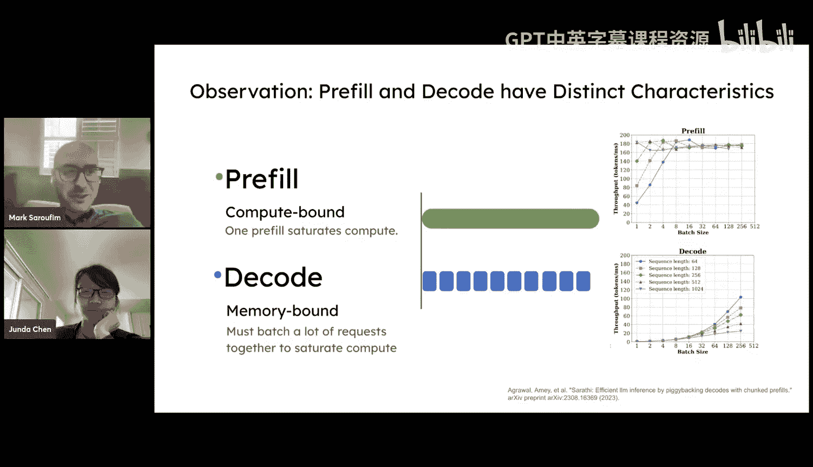

因此，我们的系统设计目标是：在满足各种应用延迟要求的前提下，使用最少的GPU资源服务更多的请求，即最大化优质吞吐量。

---

## 前缀与解码：不同的计算特征

为了理解解耦的必要性，我们需要先了解大语言模型推理的两个核心阶段：**前缀**和**解码**。

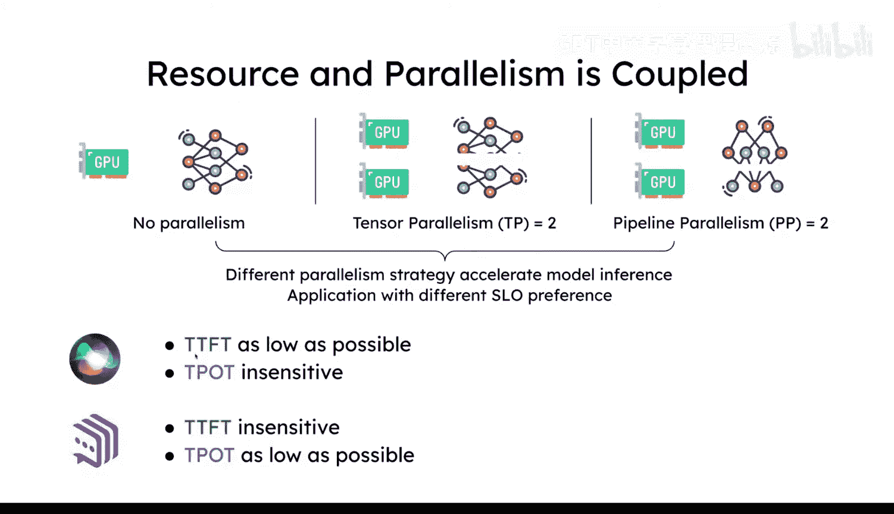

以下是这两个阶段的简要说明：
1.  **前缀阶段**：用户输入（提示词）的所有令牌被一次性送入模型进行并行前向计算。此阶段会生成注意力机制所需的键值缓存，并输出第一个令牌。处理整个提示词的时间即**首令牌时间**。
2.  **解码阶段**：模型以上一个生成的令牌为输入，自回归地逐个生成后续令牌。每个解码步骤的时间即**每令牌时间**。

这两个阶段具有截然不同的计算特征：
*   **前缀阶段是计算密集型**：即使单个请求也容易使GPU计算饱和。
*   **解码阶段是内存密集型**：主要开销在于从内存加载模型权重和键值缓存，通常需要较大的批处理大小才能充分利用计算资源。

---

## 传统方案的挑战：干扰与资源配置

上一节我们了解了两个阶段的特性，本节中我们来看看将它们混合处理时面临的问题。

传统服务引擎通常将前缀和解码请求放在同一批中进行处理，这带来了两个主要挑战：

**1. 计算干扰**
当解码请求与新的前缀请求被批处理在一起时，计算密集型的前缀阶段会显著拖慢内存密集型的解码步骤，导致解码延迟大幅增加。这种干扰使得系统难以保证解码请求的低延迟要求。

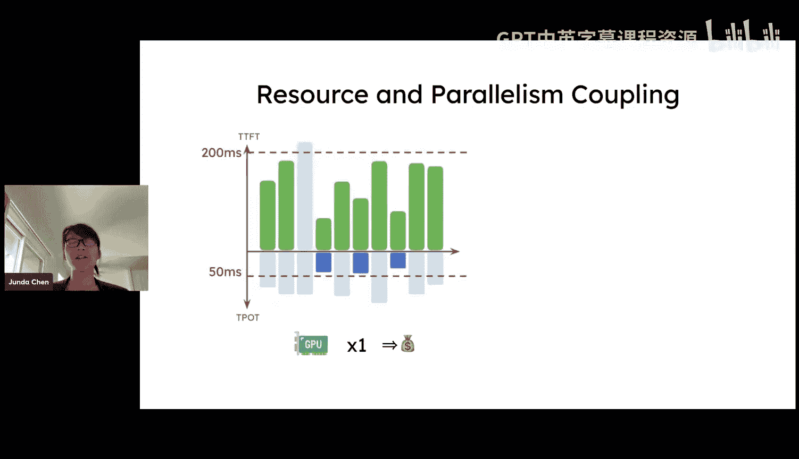

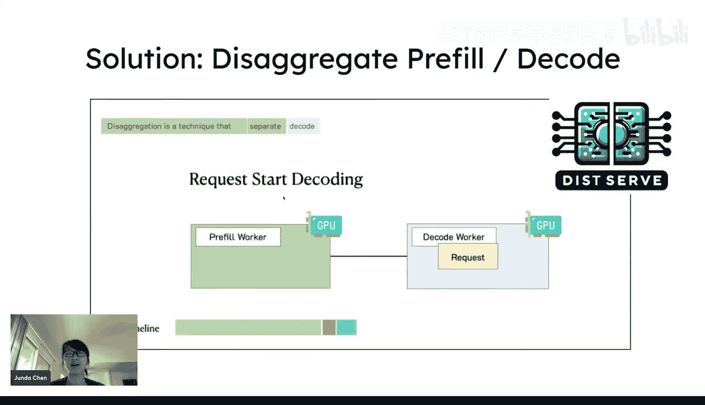

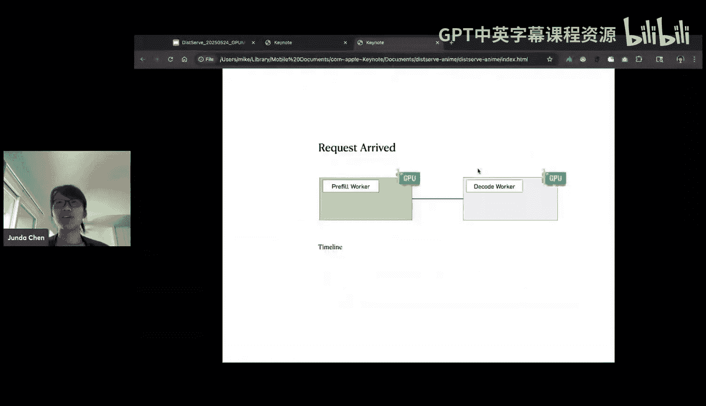

**2. 资源配置僵化**
不同的应用对首令牌时间和每令牌时间有着不同的优先级。然而，在混合调度的系统中，前缀和解码阶段共享相同的并行化配置（如张量并行、流水线并行的程度）。这导致我们无法为前缀阶段（追求低首令牌时间）和解码阶段（追求低每令牌时间）分别独立地优化资源配置，从而无法在两者间取得最佳平衡。

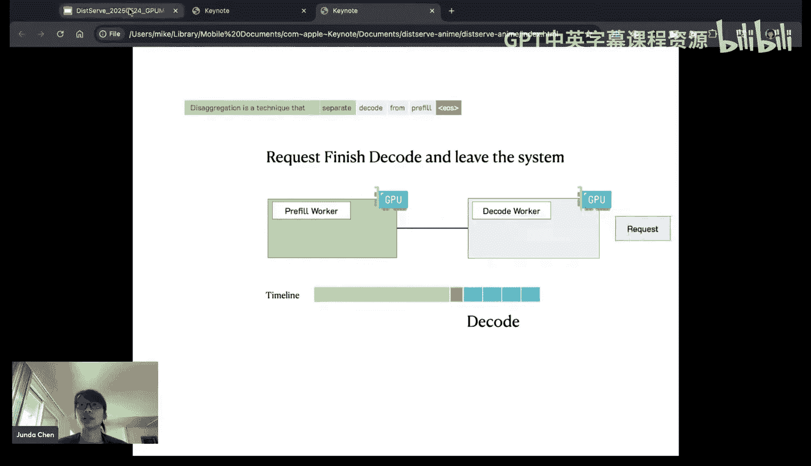

---

## 解耦式推理的核心思想

针对上述挑战，解耦式推理提出了一个直观的解决方案：**将前缀阶段和解码阶段物理分离到不同的计算设备上**。

核心思想如下：
1.  设立专门的前缀工作器组和解码工作器组。
2.  请求首先进入前缀工作器，完成提示词处理并生成键值缓存。
3.  将生成的键值缓存和请求状态迁移到解码工作器。
4.  请求在解码工作器上完成剩余令牌的生成。

这种分离带来了以下好处：
*   **消除干扰**：前缀和解码阶段不再相互影响。
*   **独立优化**：可以为前缀工作器和解码工作器独立配置最适合的并行策略和资源数量，以分别优化首令牌时间和每令牌时间。

---

## 关键设计挑战与解决方案

实现解耦式推理需要解决几个关键的技术挑战。

**1. 如何确定最优的并行配置？**
我们通过一个模拟器来解决。该模拟器会针对给定的工作负载特征（请求到达率、提示长度等）和服务等级目标，在前缀和解码的配置空间（如张量并行度、流水线并行度）中进行搜索，找到能使系统优质吞吐量最大化的资源配置方案。

**2. 如何高效迁移键值缓存？**
键值缓存的迁移可能成为性能瓶颈。我们采用了两种策略来优化：
*   **基于网络拓扑的智能放置**：在高带宽互联（如NVLink）的GPU组内进行键值缓存迁移，避免跨低速网络的传输。
*   **拉取式传输**：改为由解码工作器在需要时主动从前缀工作器的内存中拉取键值缓存，这有助于缓解解码侧内存突增的压力，并实现更灵活的传输调度。

**3. 如何应对请求突发？**
拉取式传输机制本身有助于应对突发请求。此外，结合流水线并行等技术也可以平滑请求处理流程。

**4. 如何减少流水线气泡？**
可以采用分块等技术来优化流水线并行的效率，减少计算资源的空闲时间。

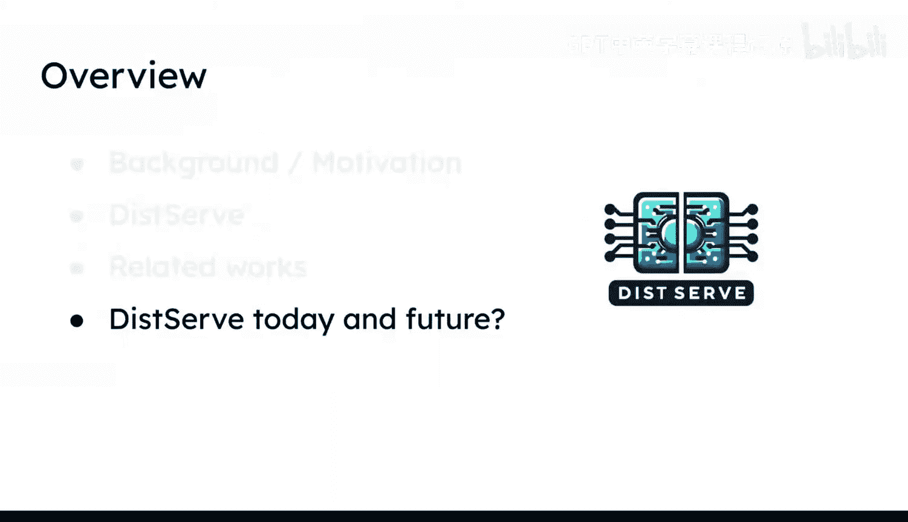

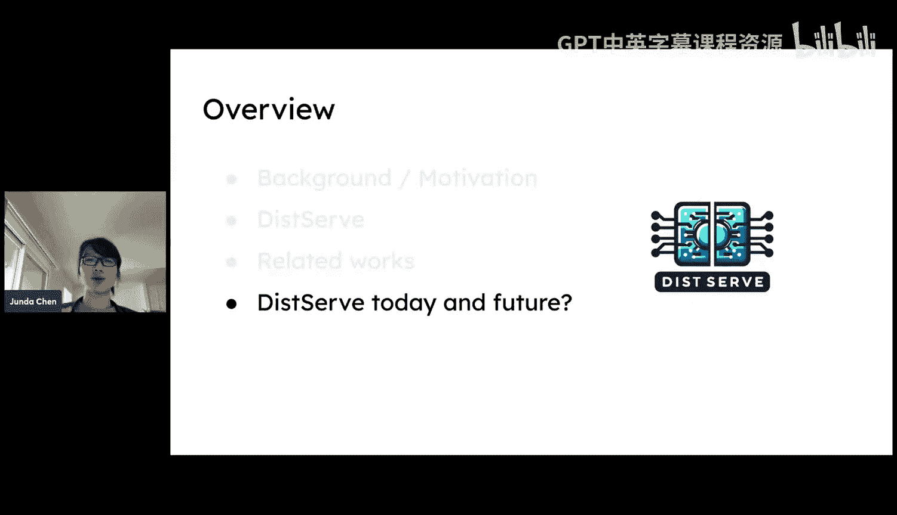

---

## 评估方法与社区进展

我们使用**优质吞吐量**和**服务等级目标达成率**作为核心评估指标，而不仅仅是原始吞吐量。实验表明，解耦式设计能够显著提升系统的优质吞吐量。

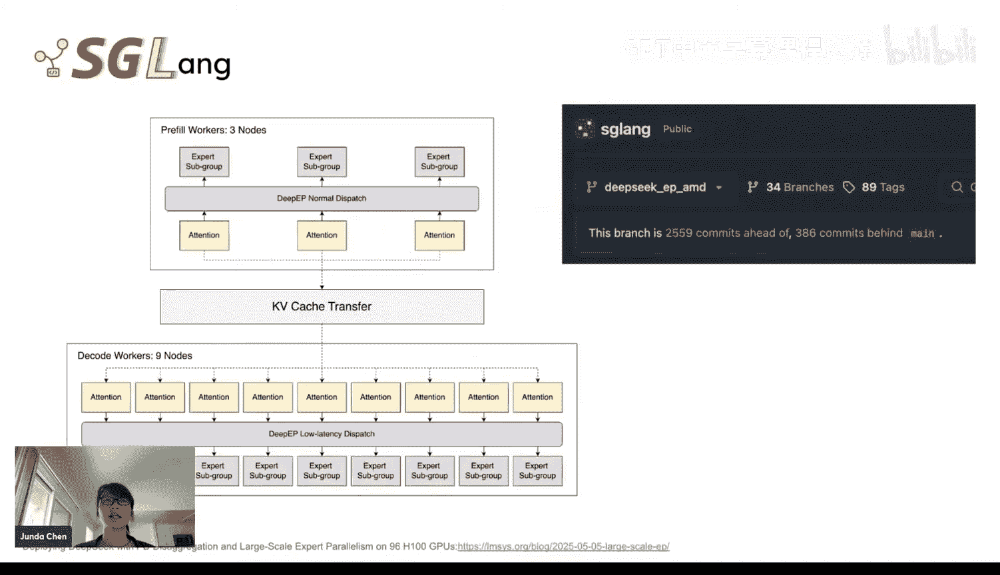

目前，解耦式推理已成为业界主流方案。英伟达的NIM、微软的DeepSpeed、vLLM等各大公司的推理引擎均已集成或正在集成此特性。社区也涌现出如OneCache（专注于键值缓存中心化存储）等创新设计。

---

## 未来展望

解耦式推理为系统设计打开了新的空间，未来的研究方向包括：
*   **快速重配置**：实现系统能够根据工作负载的变化，动态、快速地调整前缀与解码资源的比例和并行配置，向“Serverless”化演进。
*   **更广泛的集成**：将解耦思想与推理优化、长上下文处理、多模态模型等更广泛的场景结合。

---

## 总结

本节课中我们一起学习了：
1.  **解耦式推理的动机**：为了优化以优质吞吐量为代表的真实服务质量，并解决前缀与解码阶段混合调度时的干扰和资源配置问题。
2.  **核心思想**：将前缀和解码阶段物理分离到不同的计算单元，允许独立优化。
3.  **关键挑战与方案**：通过模拟器寻找最优配置，利用智能放置和拉取式传输优化键值缓存迁移。
4.  **现状与未来**：该技术已被业界广泛采纳，并为进一步实现弹性、高效的Serverless化推理系统奠定了基础。

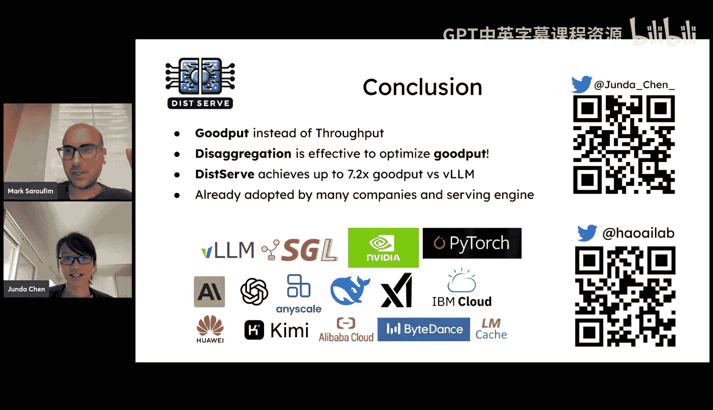

解耦式推理通过重新思考推理系统的计算组织方式，为实现更低成本、更高质量的大语言模型服务提供了关键路径。