# 6：加速大型视频扩散模型

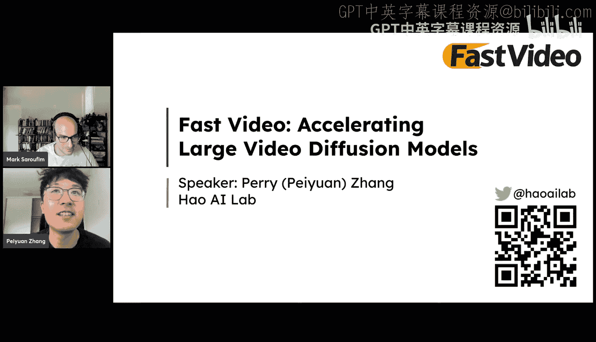

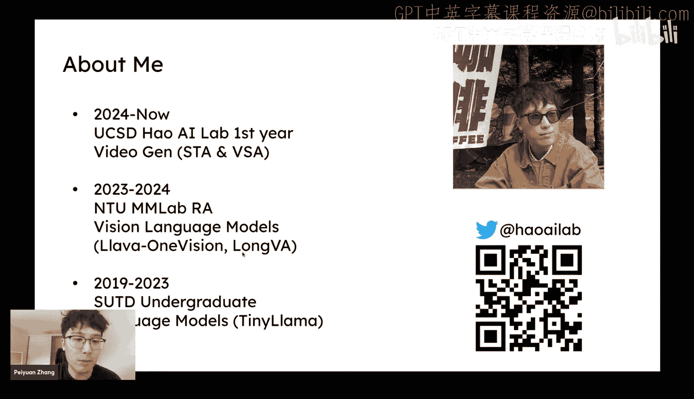

在本节课中，我们将学习如何加速大型视频扩散模型的推理过程。我们将探讨视频扩散模型的工作原理、当前面临的性能瓶颈，以及通过蒸馏、特征缓存和稀疏注意力等技术来显著提升推理速度的方法。

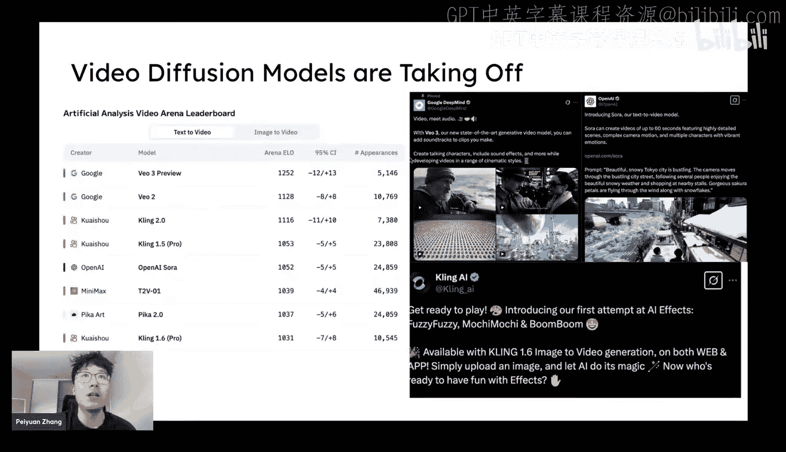

## 概述：视频扩散模型的挑战

视频生成模型正经历快速发展，但其推理过程非常耗时。以生成一段5秒、720P的视频为例，在高端H100 GPU上可能需要长达16分钟。这主要源于两个核心瓶颈：扩散过程的迭代性（通常需要20-50步）以及注意力机制在长序列上带来的巨大计算开销（可占总计算量的85%以上）。

## 视频扩散模型的工作原理

上一节我们介绍了视频扩散模型面临的挑战，本节中我们来看看其基本工作原理。我们以当前先进的开源视频模型SVD 1.2为例。

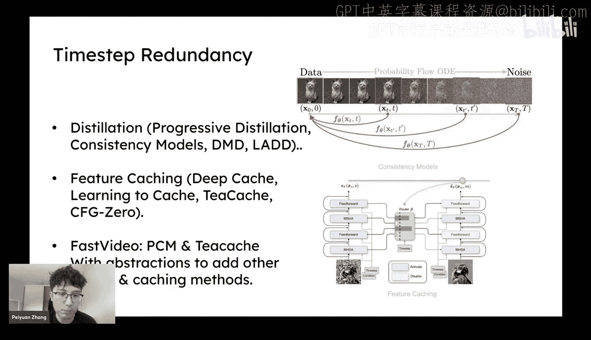

视频扩散模型与图像扩散模型类似，但处理的序列更长。其核心是一个扩散变换器（Diffusion Transformer, DiT）。去噪过程以输入噪声、用户提供的文本提示和时间步长为条件。为了融入文本信息，会在扩散变换器和视觉/文本编码器之间应用注意力机制。

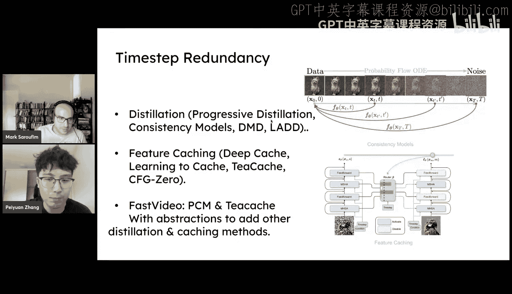

视频是三维数据（高度、宽度、时间/帧数）。在输入变换器前，需要将3D视频展平为1D序列。最后，一个解码器将潜在表示解码为最终的高分辨率视频。扩散变换器通常在潜在空间中工作，这可以稍微压缩序列长度。

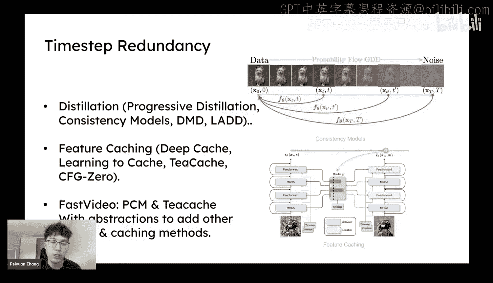

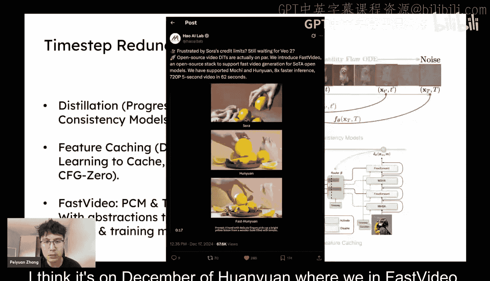

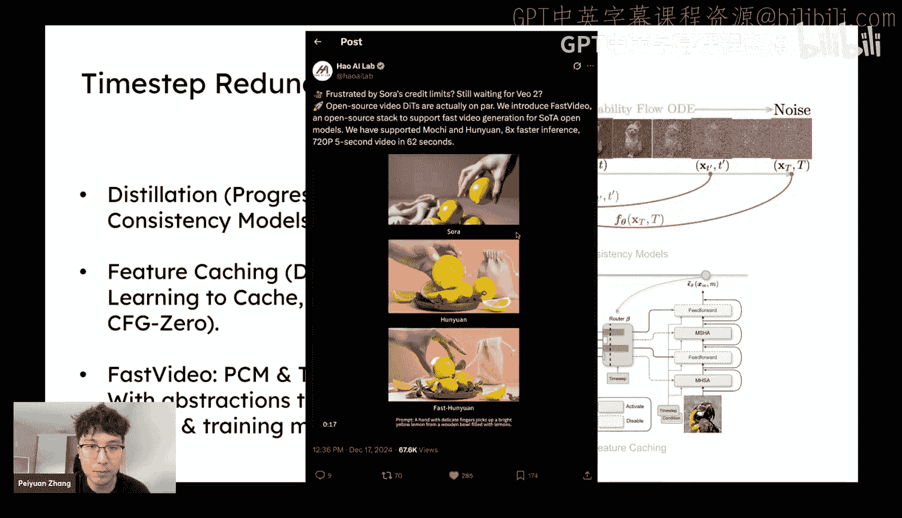

## 视频扩散模型的性能瓶颈

了解了基本工作原理后，我们进一步分析其推理时间的构成。以另一个先进模型Hunyuan Video为例，生成5秒720P视频时，扩散变换器需要处理超过10万个令牌，这是一个非常长的序列。

因此，扩散变换器中使用的长序列因果注意力机制占据了超过85%的计算量。扩散本身又是一个迭代过程（例如Hunyuan默认50步）。在H100上，即使使用了Flash Attention 3和Torch Compile等优化，单次前向传播仍需约19秒。总计生成一个视频需要约16分钟，这非常耗时。语言编码器和VAE解码器耗时极少。

综上所述，现有开源视频生成模型主要受限于两个因素：
1.  扩散的迭代过程。
2.  注意力机制的计算开销。

我们需要开发方法来应对这两个主要成本以加速视频扩散模型。

## 加速方法一：减少扩散步数（蒸馏）

为了应对迭代过程的瓶颈，一个主要方向是减少所需的扩散步数。以下是相关方法：

*   **蒸馏方法**：如渐进式蒸馏、一致性模型、DMD、LCM等。这里的“蒸馏”并非指从大教师模型到小学生模型，而是在相同大小的模型之间，从使用多步扩散的教师模型蒸馏到使用极少步数的学生模型。这类方法可将扩散步数减少5-10倍，从而显著加速推理。
*   **特点**：蒸馏需要训练，且训练过程通常非常不稳定。在图像生成领域应用较多，但在视频生成领域成功的开源代码较少，复现难度大。

## 加速方法二：特征缓存

另一种无需训练的方法是特征缓存。它利用了连续扩散步之间中间特征图相似性高的启发式方法。

其思想是：在当前的扩散步中，策略性地重用前一个扩散步计算出的部分特征图，从而避免重新计算扩散变换器的某些组件（例如前馈网络层或注意力层）。这类方法通常能将推理速度提升约2倍。

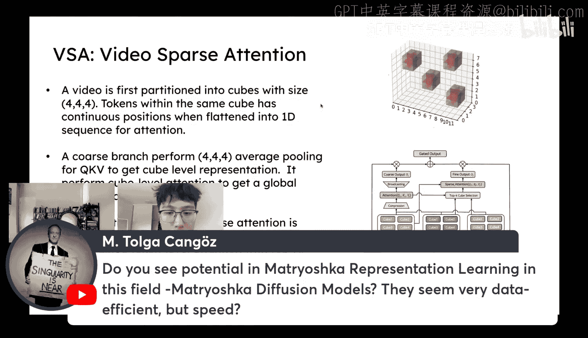

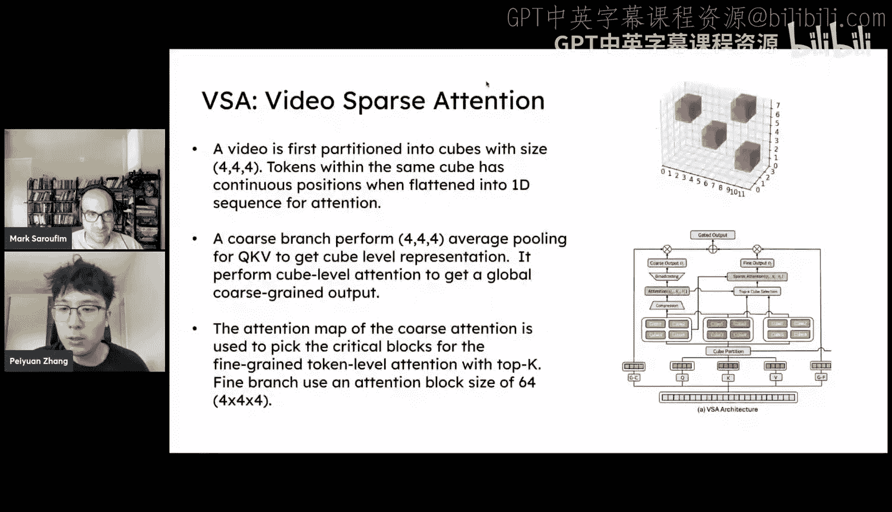

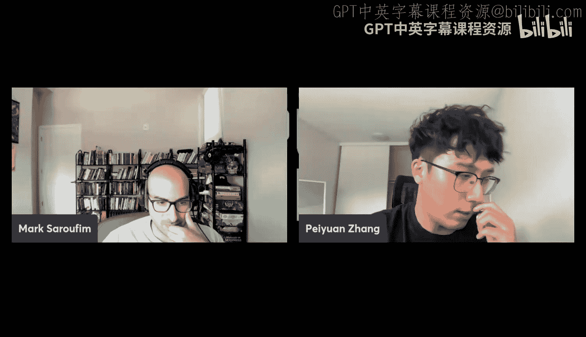

> **关于内存带宽的讨论**：有人可能会问，跳过计算但需要加载之前步的权重，是否会变成内存带宽瓶颈？实际上，由于序列非常长（超过10万令牌），视频扩散模型通常是计算受限的。不过，缓存所有中间特征确实会带来不小的内存开销。

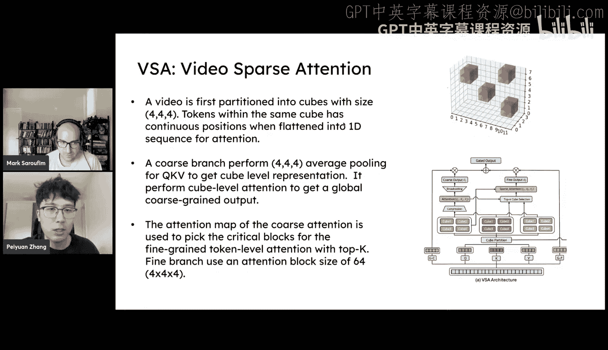

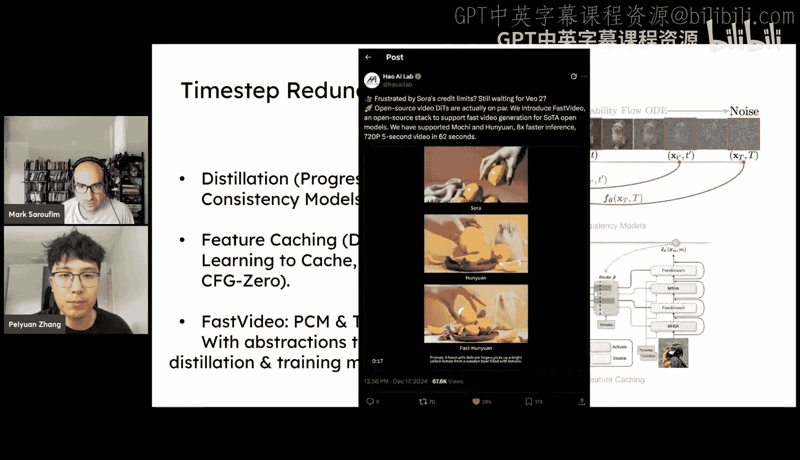

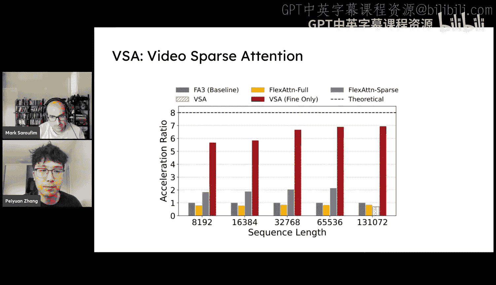

## FastVideo项目：统一的加速框架

目前，各种加速方法（蒸馏、缓存）的代码分散在不同的仓库中，难以比较和集成。FastVideo项目旨在构建一个统一、高效的视频生成模型训练和推理引擎。

FastVideo目前整合了一种蒸馏方法（PCM）和一种特征缓存方法（T-Cache），并提供了抽象接口以便集成其他方法。例如，项目已成功对Hunyuan模型进行了蒸馏，在质量略有下降的情况下实现了8倍的加速。

## 加速方法三：稀疏注意力

除了减少步数，另一个关键方向是直接减少注意力机制本身的计算量。这在视频扩散模型中尤为重要，因为其序列长度远超图像模型。

注意力分数通常是稀疏的。观察注意力图可以发现，只有少数位置的注意力分数较高，其余大部分接近零。不同层、不同注意力头的稀疏模式差异很大。如果我们能预测这些关键模式，只计算关键部分，就能加速注意力。

然而，为了实现硬件高效执行，我们需要**块稀疏注意力**模式。GPU计算注意力时以块（Tile）为单位。如果一个块完全稠密或完全空，都可以高效处理。但如果一个块是混合的（部分需要计算，部分不需要），GPU仍需计算整个块再丢弃不需要的部分，这会造成算力浪费。因此，理想的预测模式应只包含稠密块和空块。

这引出了几个设计权衡：
1.  **预测开销与实际注意力开销**：预测关键令牌的过程本身必须非常轻量。
2.  **块大小与效率的权衡**：较小的块大小能使注意力模式更灵活、更具表现力，有利于模型性能，但会降低注意力核函数的算术强度，可能拖慢计算速度。较大的块大小则相反。
3.  **是否需要全局上下文**：既然只计算部分连接，是否还需要设计专门的轻量级分支来提供全局或局部上下文？或许可以借鉴CNN的思想，让令牌主要关注其邻居。

我们的研究试图回答这些问题，并提出了**视频稀疏注意力**方法。

## VSA：视频稀疏注意力详解

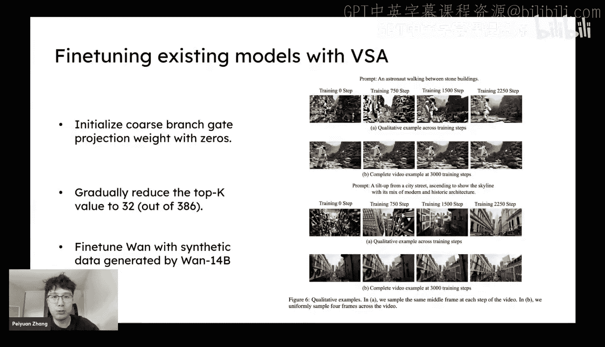

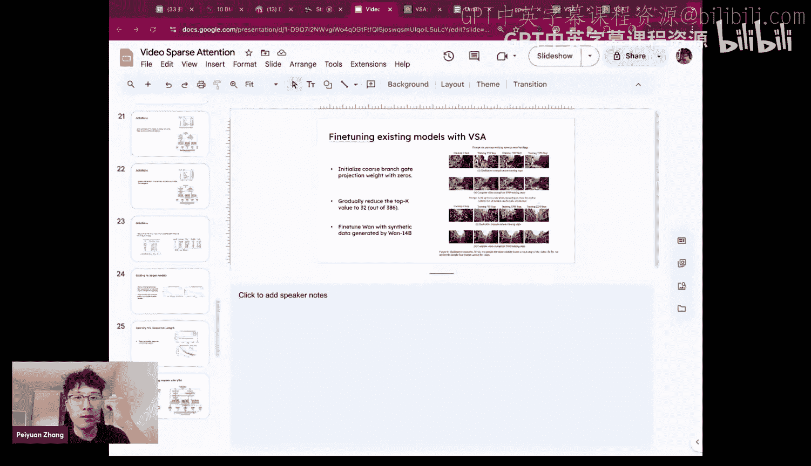

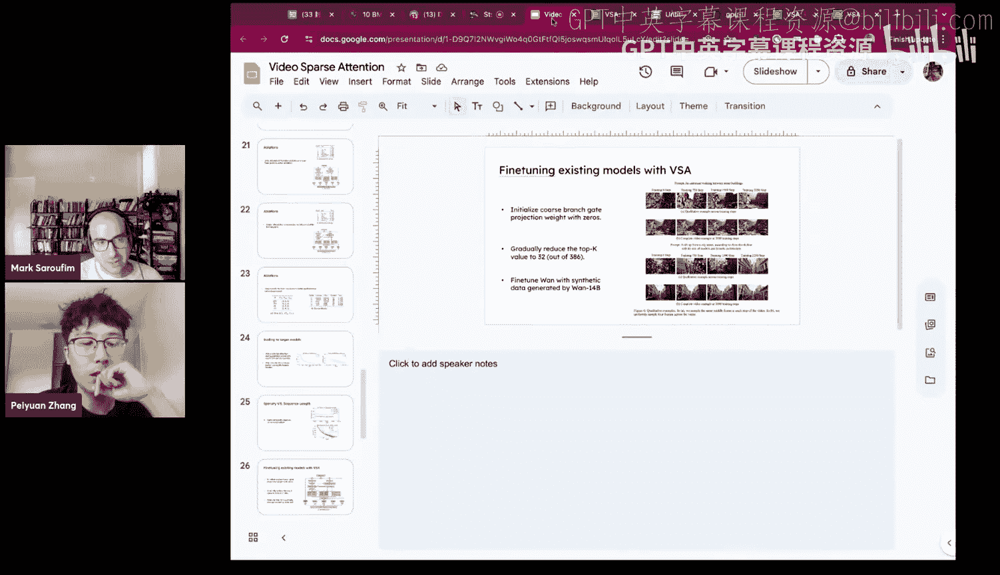

我们的工作《Fast Video Generation with Sliding-Window Attention》和《Faster Video Diffusion with Trainable Sparse Attention》提出了具体的稀疏注意力方案VSA。

一个关键技术是**令牌重排序**。传统上，视频被展平为1D序列时，空间上邻近的令牌在序列索引上可能相距甚远。我们提出将视频分割成小的3D立方体（例如4x4x4），并确保同一立方体内的令牌在展平后的序列中拥有连续的索引。这样，每个立方体可以映射到注意力核函数中的一个计算块。在执行稀疏注意力时，整个立方体要么被全部计算，要么被全部跳过，从而自然形成块稀疏模式。

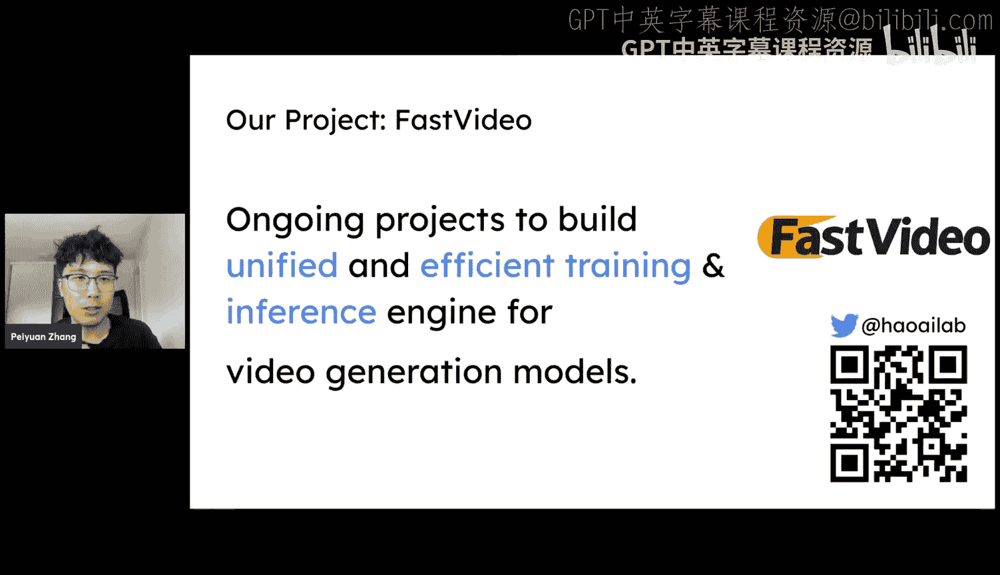

VSA的结构包含两个分支：
1.  **粗粒度分支**：对Q、K、V进行4x4x4的平均池化，得到立方体级别的表示，将序列长度减少64倍。然后计算轻量级的立方体级别注意力，获得全局上下文输出。
2.  **细粒度分支**：基于粗粒度分支的注意力图，使用Top-K选择关键立方体块。然后仅对这些关键块执行令牌级别的细粒度注意力，块大小为64。
3.  **门控融合**：两个分支的输出分别经过一个可学习的门控权重，然后相加，以平衡两者对最终注意力输出的贡献。

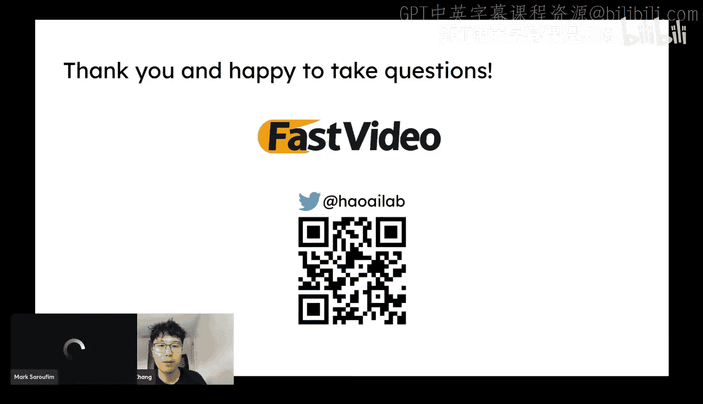

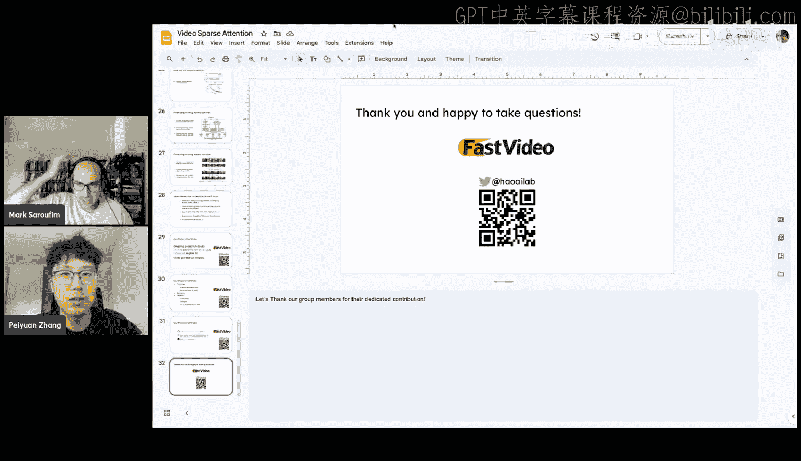

通过大量实验，我们得出了最佳配置，并验证了其有效性：
*   在控制计算量的情况下，VSA的性能优于全注意力。
*   即使引入87.5%的稀疏度（仅计算12.5%的注意力），VSA在百万至十亿参数规模的模型上，其损失-计算量曲线始终优于或匹配全注意力模型，显示出更好的扩展性。
*   稀疏度的最优选择取决于训练预算和序列长度。模型训练得越充分，所需的稀疏度越低（越接近全注意力）。

## 微调现有模型使用VSA

对于已训练好的全注意力模型，我们可以通过渐进式的方法将其微调为使用VSA：
1.  **初始化**：将粗粒度分支的门控权重初始化为零，使其初始贡献为零。将细粒度分支的Top-K值初始化为总块数（即模拟全注意力）。
2.  **渐进稀疏化**：在微调过程中，逐步将Top-K值降低到目标稀疏度（例如，从300块降到32块）。
3.  **数据**：我们使用Synthetic数据（由Sora 1.4B生成）进行微调。实验显示，即使从高稀疏度开始，随着微调进行，生成质量会迅速提升，最终达到与全注意力模型相当的水平。

## 总结与未来方向

本节课我们一起学习了加速大型视频扩散模型的多种技术：
1.  **蒸馏**：可带来5-10倍加速，是当前最显著的方法，但需要训练且开源生态分散。
2.  **特征缓存**：无需训练，能提供约2倍加速。
3.  **稀疏注意力**：我们的VSA方法既能加速推理（约2倍），也能加速训练，且性能优于全注意力。
4.  **其他技术**：如量化（FP8线性层、平滑量化）以及针对扩散变换器中特定算子的定制核函数（如AdaLN）也值得探索。

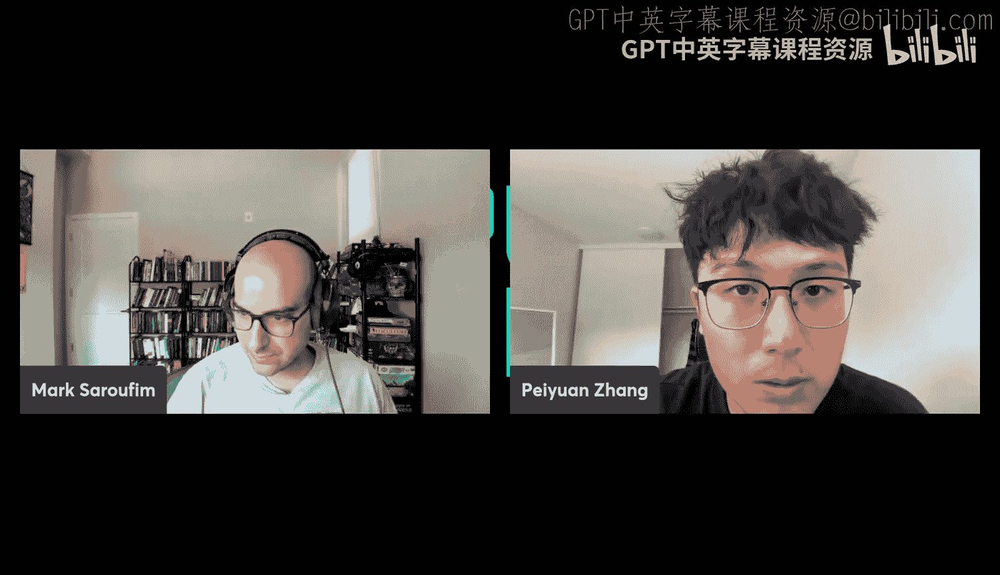

**FastVideo项目**的目标是构建一个统一平台，支持不同模型、不同蒸馏技术和不同稀疏注意力方法，集中优化视频生成模型的训练和推理效率，最终目标是将H100上16分钟的推理时间缩短至实时水平。

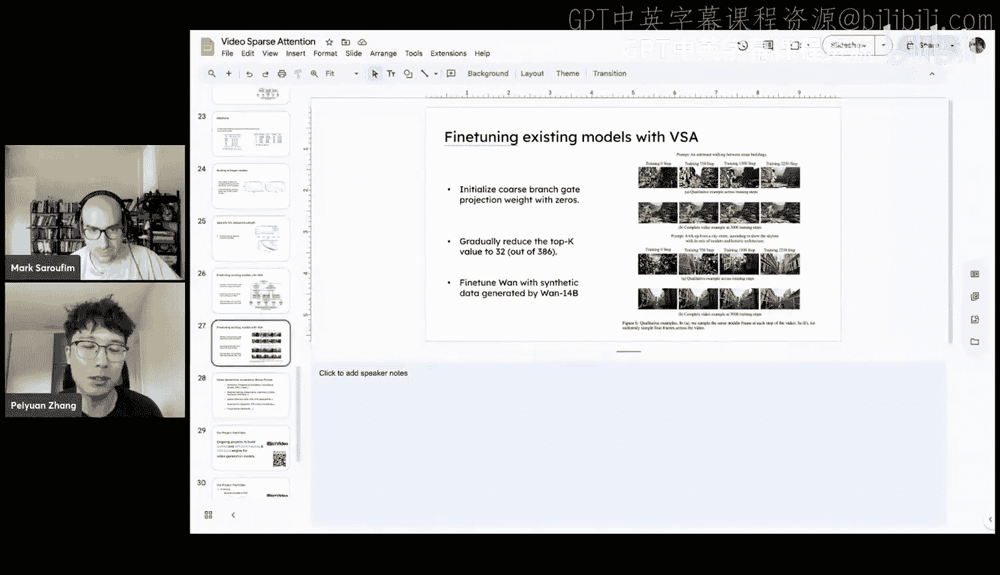

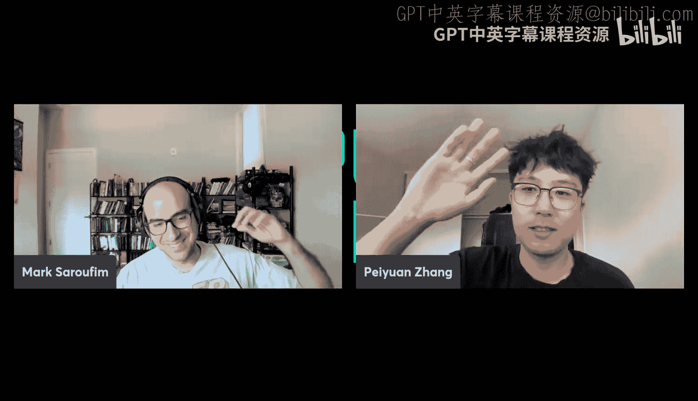

未来方向包括：探索混合专家模型、研究更精细的稀疏策略（如不同时间步或层使用不同稀疏度）、以及借鉴大语言模型推理基础设施的经验来优化多模型组成的扩散流程。