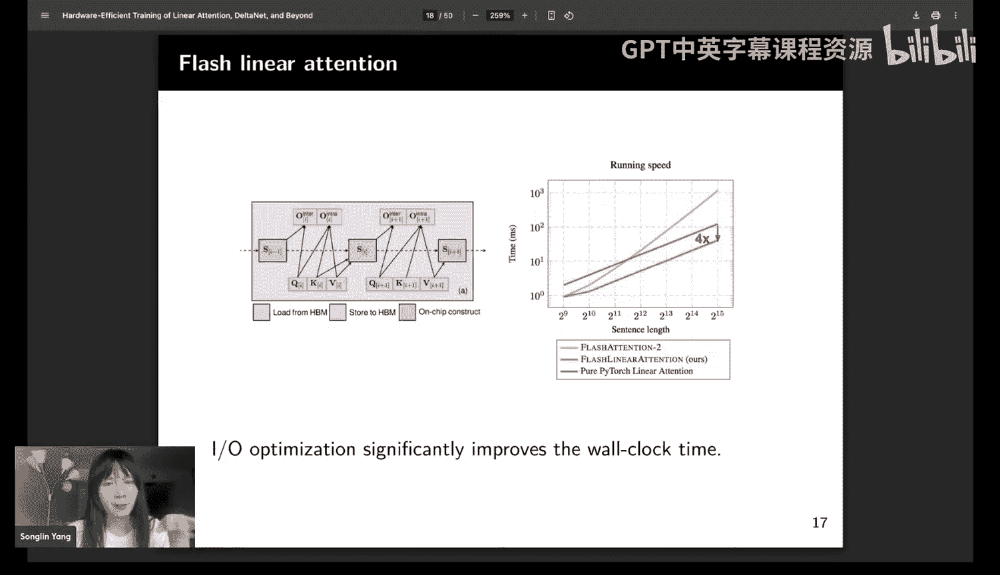
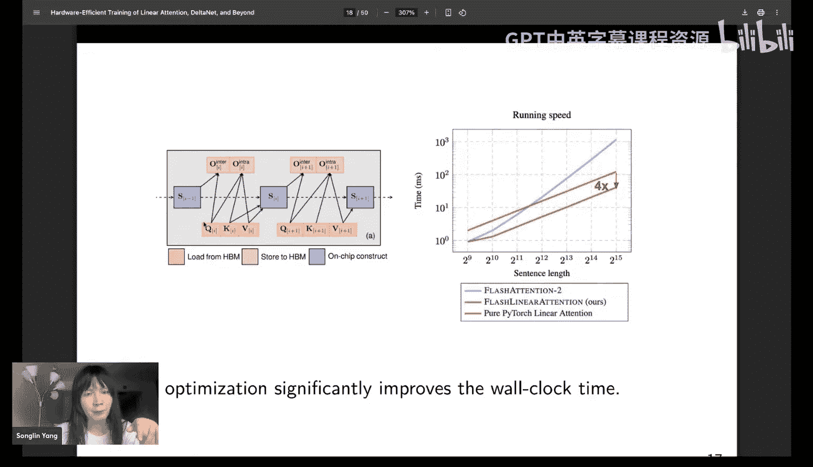
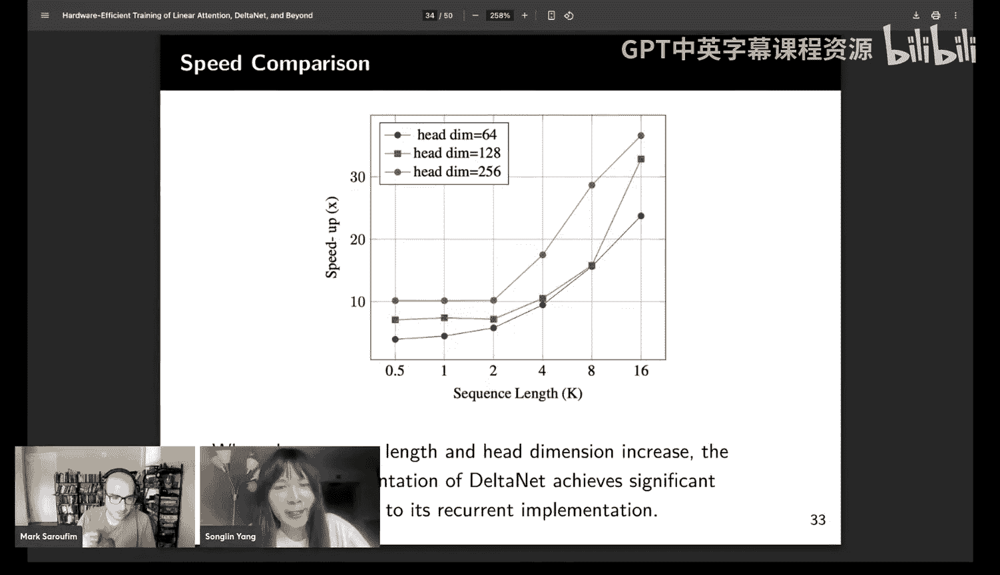
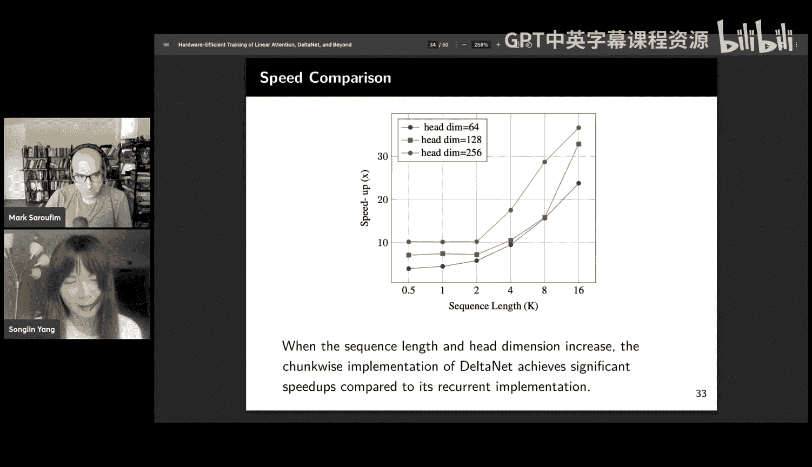
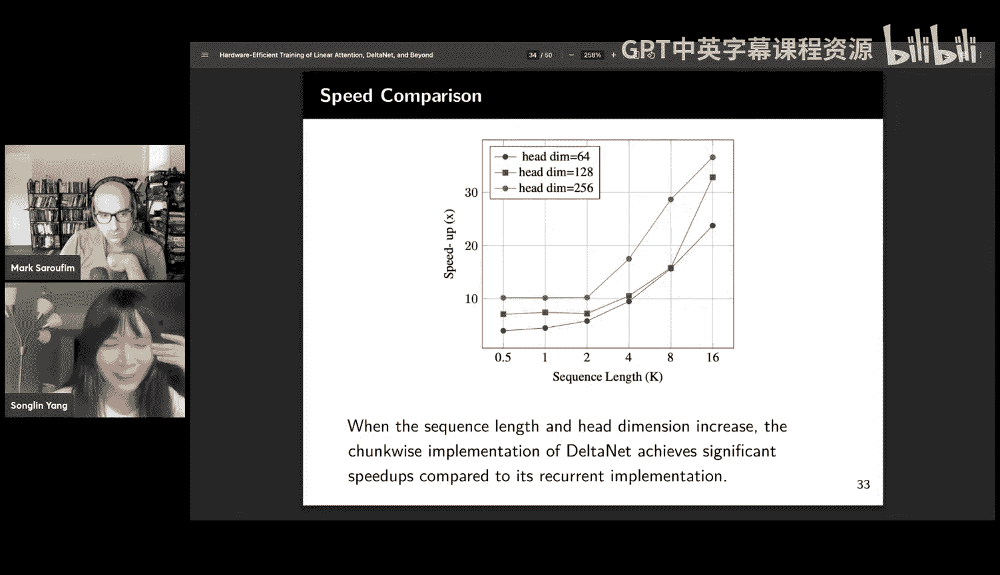
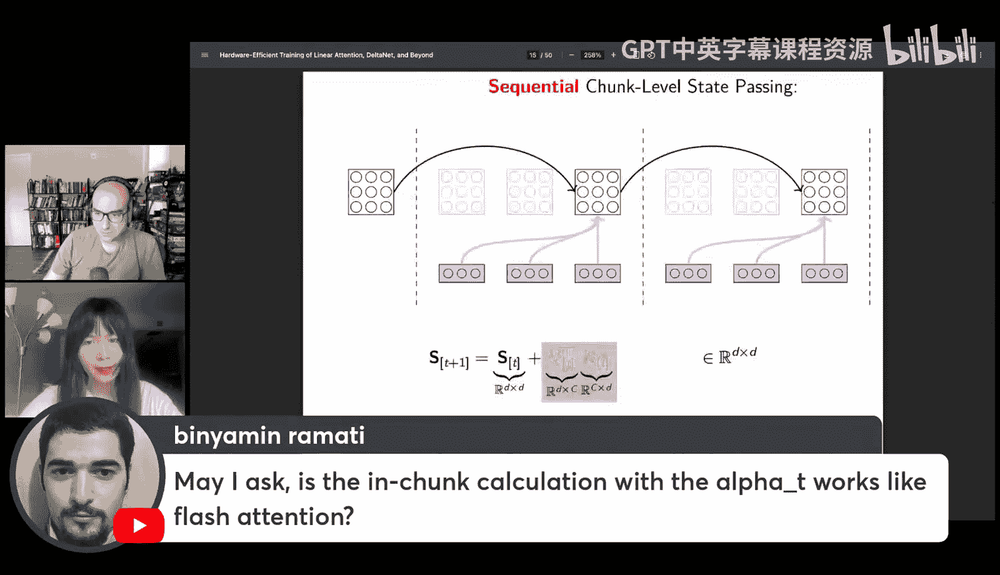
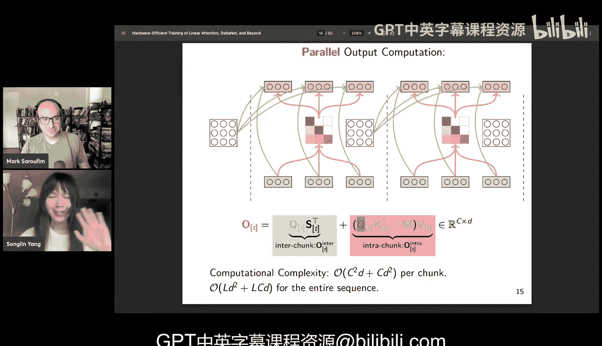

# 7：优化线性注意力

在本节课中，我们将学习线性注意力的工作原理、其效率挑战，以及如何通过分块递归算法和Flash线性注意力等技术实现硬件高效的训练。我们还将探讨Deltanet等改进模型如何解决线性注意力在上下文检索中的性能问题。

---

## 欢迎与介绍

大家好，欢迎来到GPU MODE的另一期节目。今天，我们很高兴邀请到Songland Yang作为嘉宾。

Songland被多位同行推荐为演讲者，主要原因是她在构建高效架构和加速这些架构方面，是研究社区中的关键人物之一。她围绕编写自定义内核和探索非典型架构的工作非常有趣。

## 传统注意力机制回顾

上一节我们介绍了本课程的主题，本节中我们来看看Transformer，它是现代生成式AI的主力模型。

我们都熟悉其核心的自注意力机制。以下是快速回顾。

对于并行训练，我们有三个矩阵 **Q**、**K**、**V**，大小为 **L × D**。其中 **L** 是序列长度，**D** 是头维度。这里我们只讨论单个头的情况。**M** 是因果掩码。

在并行训练中，我们可以使用几个矩阵乘法：
1.  首先，计算查询矩阵和键矩阵的点积，得到注意力分数。
2.  然后应用因果掩码，接着进行Softmax操作。
3.  最后，将得到的注意力矩阵与值矩阵进行点积，得到输出。

这是并行训练的形式。在自回归生成场景中，我们使用迭代形式。基本上，在时间步 **T**，我们使用该时间步的查询向量 **q_T** 去关注之前所有的键向量，得到注意力分数，然后用这个分数对历史值向量进行加权求和，得到输出。

这是一个非常快速的自注意力机制回顾，相信大家都很熟悉。

## 传统注意力的效率问题

我们了解到，Softmax注意力存在几个效率问题。

第一个问题在于训练效率，因为注意力机制的计算复杂度是序列长度的二次方。当序列长度非常大时（例如在视频生成或DNA建模中达到百万级别），这将成为关键瓶颈。

第二个效率问题在于推理。在推理时，我们需要维护历史的键和值向量，即所谓的KV缓存。KV缓存的大小随生成长度线性增长，在进行长序列生成时，缓存大小可能爆炸式增长，导致内存不足。

现在我们理解了自注意力机制的关键效率挑战。虽然有许多优化技术可以降低这个成本，但今天我们将聚焦于一种可以从根本上消除KV缓存的不同架构——线性注意力。

## 线性注意力的核心思想

线性注意力背后的关键思想非常简单。它基本上移除了Softmax注意力中的Softmax算子。

因此，我们得到了这个迭代形式。让我们深入了解一下。

这里我们有一个注意力分数，但没有Softmax算子，现在它是一个完全线性的算子。

首先，这是一个标量值，我们将其放在第二个位置。然后，我们利用这些算子的结合律，先将值和键组合起来。

我们得到这个标红的部分，它是所有历史时间步的键值外积的累积和。右边这个项通常被称为递归隐藏状态，因为在推理时，这个隐藏状态通过外积计算结构将键值关联对编码到记忆里。

现在变得非常清楚，线性注意力实现了一种线性递归。其递归状态就是键值外积的简单累积和。

对于输出计算，我们使用矩阵向量乘法来获得输出。

这是一个非常简单的线性递归。我们知道，在经典的RNN或门控循环单元中，递归状态的大小通常在输入维度 **D** 的量级。而现在，递归状态的大小在 **D²** 的量级。从这个意义上说，线性注意力拥有一种机制，允许我们以非常高效的方式扩展递归状态的大小。

我们都知道，对于RNN来说，递归状态大小非常重要，因为RNN只有一个固定大小的状态记忆来编码所有历史数据。直观上，状态越大，RNN的记忆能力就越好。

## 线性注意力的高效训练挑战

接下来，我将讨论如何以硬件高效的方式训练这种线性注意力模型。

之前，我们展示了线性注意力的并行形式和递归形式。然而，不幸的是，这两种形式都不适合进行硬件高效的训练。

首先，对于并行形式，它与Softmax注意力的情况非常相似，计算复杂度也是序列长度的二次方。如果我们进行非常长的序列建模，这将非常成问题。

对于递归形式，也存在问题，原因有几个。第一个原因是，在递归形式中，我们必须进行顺序递归，这限制了在序列维度上的并行性。其次，我们可以看到，对于递归状态更新，我们只涉及一个秩为1的外积更新；对于记忆读取，我们只进行矩阵向量乘法。这两个操作都不是矩阵乘法，因此无法使用张量核心进行加速，而张量核心是非常高效的。

一个常见的问题是，为什么我们不使用并行扫描算法来训练这个线性注意力模型？因为递归的第一个限制是它无法在序列上并行，而我们知道线性递归可以使用并行扫描算法在序列上实现并行计算。

但是，在线性注意力的情况下，即使并行扫描算法可以提供序列级别的并行性，你仍然无法获得能够进行快速矩阵乘法的操作。这主要是由于递归形式的限制，它本身就不具备基于矩阵乘法的注意力机制。

当扩展递归状态大小时，这可能是个问题。因此，Mamba无法将其状态大小扩展到数万，因为它无法利用张量核心的算力。此外，并行扫描往往会带来非常大的内存和I/O开销。

对于递归形式，我们只需要维护一个大小为 **D × D** 的递归状态。但对于并行扫描，特别是当状态大小太大无法放入共享内存时，我们必须将其存入高带宽内存。这就需要为每个时间步维护大量的递归状态，这是非常消耗内存的。正如我们之前提到的，我们有一个线性状态扩展机制，每个位置的递归状态大小是 **D × D**。如果我们为每个时间步都物化递归状态，内存复杂度将是 **O(L × D²)**，这比查询或键向量大 **D** 倍，这是不可接受的。

由于这些原因，在实践中，使用并行扫描训练这些注意力机制和模型太慢了。

## 分块递归算法

由于递归形式和并行形式的局限性，我们现在讨论分块递归形式，它基本上是介于递归形式和并行形式之间的一种中间形式。

分块递归算法的高层思想是：首先，我们有一个序列和一个块大小 **C**。我们将序列分割成几个大小相等的块。

当块大小等于1时，我们可以恢复递归更新机制。当块大小等于整个序列长度时，它将简化为并行形式。

这里我想强调，分块递归形式不是一种近似。它在数学上等价于递归形式和并行形式。因为线性注意力包含许多线性操作，允许我们利用结合律进行这些数学变换。

在分块递归形式中，我们不是为每个单独的令牌计算递归状态，而是只为每个块计算递归状态，并可能将其物化到高带宽内存中。

然后，我们可以使用一种混合形式来计算所需的输出。对于历史上下文，由于我们已经将所有历史信息编码到块级别的隐藏状态中，我们可以利用递归形式来计算来自先前上下文的输出贡献。

对于局部上下文，由于我们没有递归状态，我们可以转而使用并行形式直接计算由当前块内局部上下文贡献的输出。

这就是分块递归形式的高层思想。

为了用数学公式表示，我们有几个符号。首先，这是块级别的隐藏状态，我们使用带括号的下标来表示块的索引。

此外，我们使用这些块来表示查询、键、值和输出矩阵。它们的大小是 **C × D**。完整矩阵的大小是 **L × D**，但现在我们只取一个子块来考虑第 **i** 个块的计算。

首先，在第一步，我们进行块级别递归状态的计算。在这个阶段，我们只计算每个块的递归状态，这基本上是每个块的最后一个位置的状态。我们直接从这个状态跳转到那个状态。在中间，有几个状态，但我们跳过了计算，直接跳到最后一个状态。

对于这个递归状态更新，我们需要计算这个块内键值向量外积的累积和。这里有一个非常优雅的数学性质：这个外积的累积和可以写成矩阵乘法的形式。这就是为什么我们可以将递归状态更新写成矩阵乘法。

这里我们有大小为 **C × D** 的键块和值块。我们取值块的转置，然后进行点积，并在这个块大小维度上求和，我们将得到一个 **D × D** 的输出，其大小与递归隐藏状态相同。然后我们将这两项相加来实现状态更新。

对于输出计算，正如之前提到的，我们有两个贡献源。

第一个是历史上下文，它被总结到前一个隐藏状态中。因此，对于这些块，我们可以利用递归形式，让每个查询关注这个递归状态以获得输出。由于我们在这个块中有多个查询，并且它们都从同一个递归状态读取输出，这是一种批量化计算。我们可以在查询序列维度上进行批量化，使其成为一个矩阵乘法。

因此，第一项的大小是 **C × D**，第二项是 **D × D**，所以我们可以将这个重写为矩阵乘法过程。这是块间贡献，我们计算由先前上下文贡献的输出。

其次，我们还需要考虑由当前局部块贡献的输出。在这种情况下，我们直接利用并行形式，基于输入的查询、键和值直接计算输出。我们不需要计算任何中间递归状态，可以直接基于输入数据计算输出。这非常类似于自注意力机制的并行形式。基本上，这是一个局部块的线性注意力。我们对每个块分别应用这种并行线性注意力形式。

总结一下，使用这种分块递归形式，并固定块大小 **C**，总的时间复杂度是 **O(L × D² + L × D × C)**。当 **C** 不随序列长度 **L** 增长时，这是亚二次的。在实践中，我们将 **C** 设置为一个小的常数（例如64、128、256），这允许我们进行硬件高效的计算，这些是编写矩阵乘法内核时非常常见的块大小。

这种分块递归形式也非常通用，我们可以将其扩展到其他线性注意力变体（如带数据控件的Mamba）的高效训练。

这种形式已成为现代线性注意力模型（如基于Mamba的Deltanet等）的标准训练技术。

## Flash线性注意力

对于分块形式，我们有一个与现代硬件非常契合的算法，但我们还需要进行一些I/O优化来进一步提高吞吐量。

在Flash线性注意力中，我们进行了几次内核融合，试图减少I/O成本。例如，在这种情况下，查询块可以用于计算两个部分的输出贡献。键块可以用于更新隐藏状态，也可以用于计算来自局部上下文的输出。

这是一个简单的内核融合，以减少I/O成本。在实践中，这种内核融合可以在GPU上带来显著的加速，与朴素PyTorch实现相比，可以达到约4倍的加速。

我们还有一个名为Flash线性注意力的开源库，在这个库中，我们提供了多种线性注意力机制（如RetNet、基于Gated的RWKV等）的实现。

总结一下，在线性注意力中，概念上的线性注意力非常简单，它只是没有Softmax的注意力，可以被表述为具有矩阵值隐藏状态的线性递归，允许你拥有更大的递归状态来编码历史数据。

分块递归形式是一种用于训练这些线性注意力模型的硬件高效算法。

而Flash线性注意力是该分块递归形式的一个I/O优化实现。

## 线性注意力的性能问题与Deltanet

现在我们已经了解了一些线性注意力的基本优化技术。然而，线性注意力本身存在一些性能问题，特别是在上下文检索方面。有多篇论文表明，线性注意力或RNN空间模型都受到一些常见问题的限制，例如由于状态大小有限导致的上下文检索能力不足。这也很直观，因为你不能期望RNN以无损的方式编码所有历史数据，因为隐藏状态是固定大小的。

因此，这些方法在下游任务非常重要的上下文检索中表现非常差。所以，我想提出一个模型来改进线性注意力的上下文检索能力，这就是Deltanet。

首先，我们可以分析为什么线性注意力在上下文检索中表现不佳。如前所述，线性注意力可以被视为一种关联记忆，使用外积结构编码键值关联对。这与经典的关联记忆非常相关。

如果我们想使用一个键从这个递归记忆中检索输出，我们使用这个记忆读取操作来检索输出。我们可以看到，因为 **k_j** 与时间步 **j** 的值相关联，理想情况下，我们希望从这个递归记忆中检索出 **v_j**。

但是，在这个关联记忆中，我们还有其他键值关联对，因此存在一些不需要的交叉项。我将这些交叉项称为检索误差，因为这是我们不希望从这个递归记忆中得到的项。这是因为，如果我们想实现完美检索，键向量应该彼此正交，这样我们就可以实现完美检索。但由于关联记忆是 **D × D** 的，在这个向量空间中最多只能有 **D** 个正交向量。因此，当序列长度大于模型维度时，这种真实误差是不可避免的。

这就是为什么增加头维度非常有用，因为如果增加头维度，向量空间中就有更多空间来容纳更多的正交键向量，从而获得更好的检索性能。

这是线性注意力的一个基本限制。因此，我们想设计一些机制来缓解这个问题。这里我们有了Deltanet。

Deltanet实际上是由...提出的经典模型。它使用了一种非常直观的记忆管理机制。

我们有查询、键和值向量，类似于线性注意力或注意力。我们对输入数据进行几次线性投影以获得查询、键和值向量。

在Deltanet中，我们还有另一个线性投影，将输入令牌映射到一个标量值。我们还应用Sigmoid函数将这个值限制在0和1之间。

这个 **β_t** 可以被想象为当前输入的写入强度。

Deltanet有一个记忆管理机制，最终输入由新输入和旧值的加权和计算。这个旧值是这样计算的：首先，我们使用输入键从记忆中检索关联值，然后模型动态决定是使用新的关联值（绿色的输入值）还是旧的关联值（蓝色的值）。模型必须决定是保留先前的关联值还是使用当前的关联值。

我们使用 **β_t** 来控制这个过程。**β_t** 是数据依赖的，因此模型可以动态决定是保留当前值还是使用先前的关联值。

然后，在Deltanet中，它从递归记忆中擦除旧值，并将新的键值关联信息写入递归记忆。

这种擦除机制是实现良好关联检索性能的关键。

对于记忆读取，它与普通的线性注意力相同，我们使用矩阵向量乘法来完成。

这里我们有一个非常简单的基准测试，称为多对关联检索。这是一个合成基准，用于测试这些新兴架构的上下文检索性能。

这个任务非常简单。我们在先前上下文中提供多个键值对。键是大写字母，值是数字。模型需要根据先前上下文中的键来检索值。这是一个纯粹的上下文学习任务，因为答案只出现在先前上下文中，而不在训练数据中。这些训练数据是即时生成的，因此模型无法在其直接记忆中对这些关联对进行编码。

尽管这个任务非常简单，但Transformer可以完美解决。然而，对于其他亚二次模型，如Mamba、Gated RNN，当模型维度较小时，它们无法实现完美性能。正如我们之前讨论的，因为当模型维度较小时，模型只能在空间中拥有少量正交键，这时模型会有较大的检索误差。

但对于Deltanet，它拥有更好的记忆管理机制，即使模型维度较小时，也能实现完美性能。

## Deltanet与测试时训练

现在我们知道Deltanet在上下文检索中表现非常强大。

我想将Deltanet与一个非常近期的概念——测试时训练或测试时回归——联系起来。

这里有一个非常优雅的框架，称为测试回归。它将许多最近的自回归序列建模层分为几类。

在Deltanet中，有一个在线学习目标，它使用随机梯度下降来优化这个在线学习目标。

Deltanet的在线学习目标是键的转置和值之间的线性回归损失。在这种情况下，递归隐藏状态 **S** 被视为权重矩阵。这也有一个与快速权重编程非常有趣的联系，RNN的递归状态可以被视为快速权重（即每一步都在变化的权重）。

测试时训练框架也有这种解释，它将递归状态视为这个权重矩阵。因此，我们使用这个权重矩阵进行线性变换，然后希望恢复输入值。这是一个线性回归损失函数。

如果我们对这个目标函数执行单步梯度下降，我们将恢复Deltanet的更新规则。

因此，这里的 **β_t** 从先前上下文中的梯度下降角度来看是学习率。**β_t** 是写入强度，控制我们希望为历史关联值保留多少信息，以及我们希望为新传入的输入值使用多少新信息。

这样我们就可以恢复Deltanet的更新规则。

一个常见的问题是，我们为什么要使用这个在线学习目标？这是我之前演讲中经常遇到的问题。这里我给出一个非常直观的理解：对于上下文学习，我们希望使用先前上下文中提供的一些键值关联对。对于Softmax注意力，它使用KV缓存直接存储这些键值关联对以供后续使用。然而，对于RNN，它没有KV缓存来存储这些上下文信息，因此我们希望RNN的递归隐藏状态尽可能准确地编码那些键值关联对。

如果我们有这个学习目标，RNN模型直接优化这些键值关联预测，因此希望它能更好地记忆这些键值对。这就是为什么我们希望优化这些键值对之间的线性回归损失的一个非常直观的理解。

## Deltanet的并行训练

接下来，我将简要讨论Deltanet的并行训练。

通过重新排列Deltanet的线性递归，我们可以得到这种形式。我跳过了一些推导，这是Deltanet的最终线性递归形式。

我们也可以将其写成与普通线性注意力非常相似的形式。在这里，我们可以非常高效地计算这个 **u_t**。然后，我们可以利用之前讨论的线性注意力内核进行硬件高效的训练。

首先，如果我们想并行训练模型，我们需要展开这个递归。通过展开递归，我们将有这个转移矩阵的累积乘积。在Deltanet的情况下，我们也有这个累积乘积转移矩阵。

对于任意的 **D × D** 转移矩阵，这个累积乘积计算将非常耗费计算资源。然而，对于Deltanet，由于它使用结构化的转移矩阵（该矩阵是单位矩阵加上低秩矩阵），存在现有算法可以进行快速计算。例如，这种形式非常类似于众所周知的Householder矩阵。当 **β_j** 等于2时，我们可以得到Householder矩阵，而Householder矩阵的乘积在数值分析领域已有深入研究。

在这项工作中，我们利用了一种称为WY表示的经典算法，以硬件高效的方式计算这种类Householder矩阵的累积乘积。这样我们就可以将这个累积乘积重写为使用WY表示的累积和。这使得优化变得容易得多，因为这个外积的累积和可以很容易地写成矩阵乘法。这与之前线性注意力的状态更新规则非常相似。

因此，我们可以将线性注意力的算法适配到这个情况。首先，对于状态更新，我们还需要考虑状态转移矩阵。对于普通的线性注意力，我们可以将状态转移矩阵视为单位矩阵，它基本上什么都不做。然而，在这种情况下，我们需要考虑这个块内转移矩阵的累积乘积。

这里我们需要计算这个块内转移矩阵的累积乘积，这可以写成这种形式。我们也可以将其写成矩阵乘法的形式，这样我们就可以有这个状态更新的矩阵乘法。

此外，我们还可以利用另一个众所周知的技术，称为实值变换，以非常硬件高效的方式计算这个 **w** 向量和输入 **u** 向量。

我不想详细讨论这个，因为它涉及较多的数学。但关键直觉是，我们可以使用一些矩阵方程来获得这个 **C × C** 矩阵，然后取其下三角部分并将对角线元素设为1，接着求解这个下三角矩阵。我们可以使用前向替换来计算这个矩阵。

一旦这个 **C × C** 矩阵被计算出来，我们就可以使用矩阵乘法来计算这个 **w** 和 **u** 矩阵。

如果你