# 8：D-Matrix Corsair 🚀

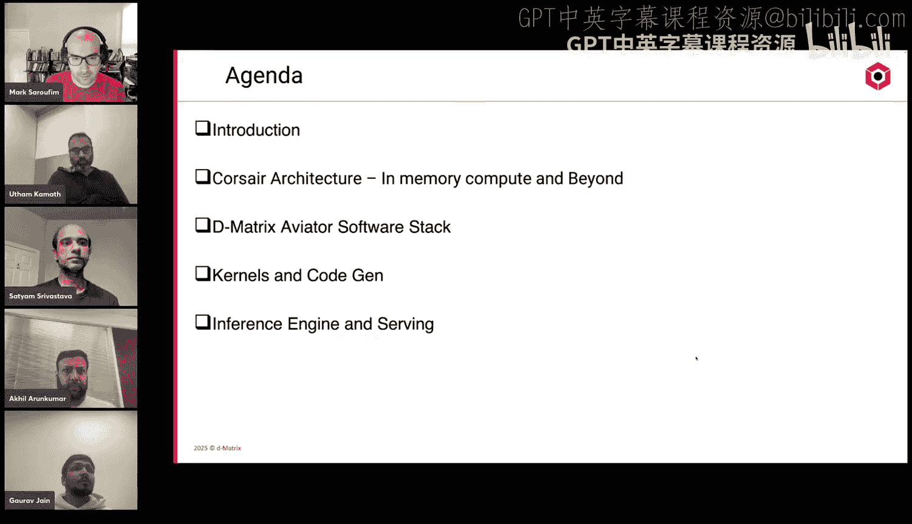

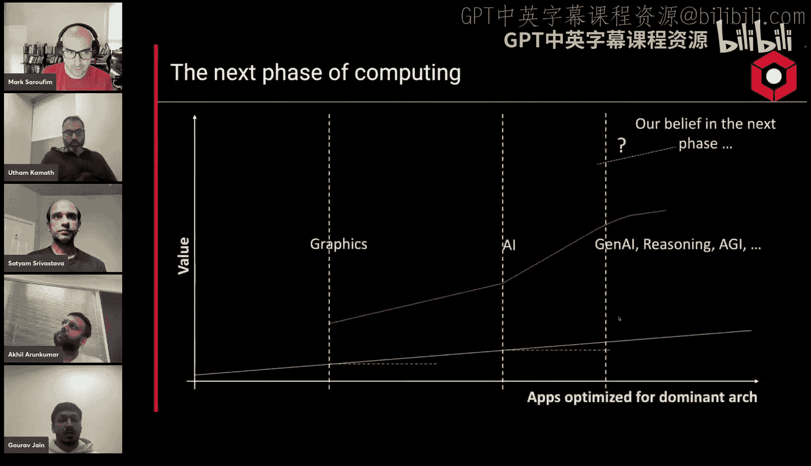

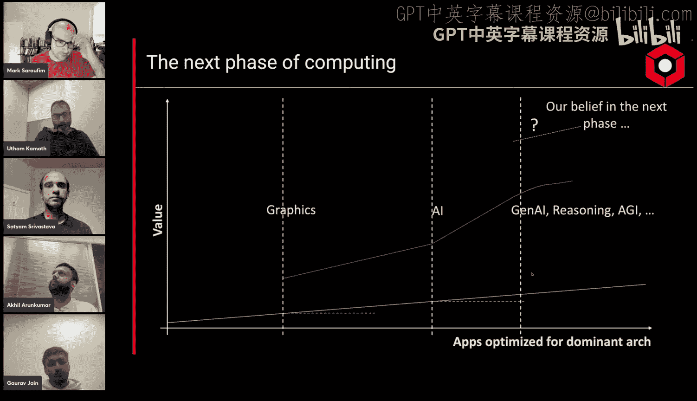

## 概述
在本节课中，我们将学习D-Matrix公司推出的Corsair架构。这是一种专为生成式AI推理设计的存内计算解决方案。我们将从设计动机开始，深入探讨其架构、软件栈以及如何高效地服务于大语言模型推理。

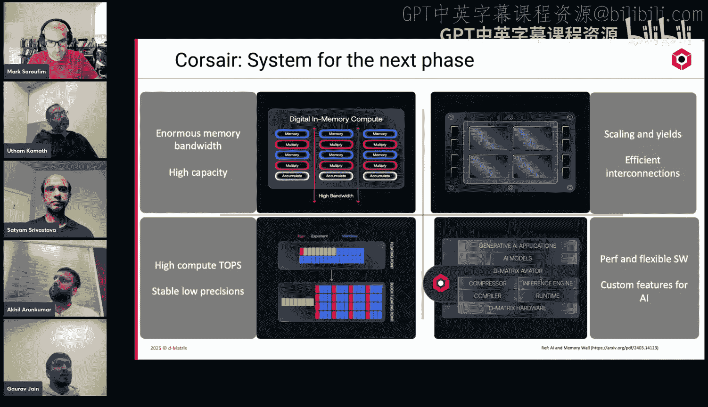

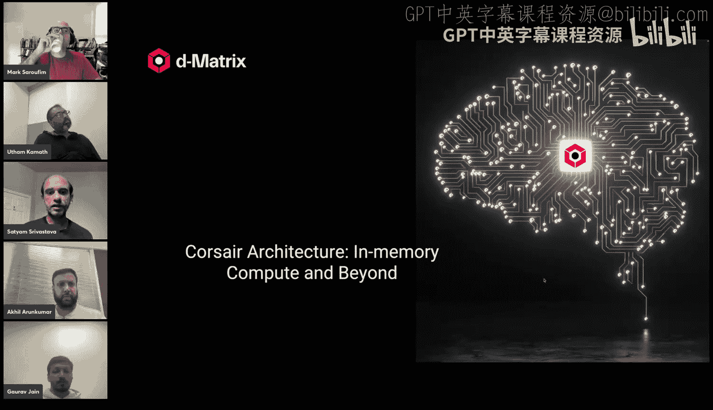

---

## 章节 1：设计动机与核心优势 🎯

随着生成式AI推理工作负载日益成为主导，传统的计算范式面临挑战。过去，图形处理的需求催生了GPU，显著提升了性能。如今，AI训练同样受益于GPU的高吞吐量。然而，在推理阶段，特别是随着思维链、长文本生成等技术的发展，对低延迟和高效率的需求变得尤为关键。Corsair架构正是为解决这一“内存墙”问题而诞生。

“内存墙”指的是计算吞吐量与内存/互连带宽之间日益扩大的差距。对于LLM解码这类计算强度低、内存访问频繁的任务，传统架构的带宽限制成为主要瓶颈。

Corsair的核心优势在于其**存内计算**范式。它将计算单元与存储紧密结合，数据无需在远距离内存间频繁搬运，从而大幅降低了延迟并提升了能效。

---

## 章节 2：Corsair系统架构总览 🏗️

上一节我们介绍了Corsair的设计动机，本节中我们来看看其高层次的系统架构。

Corsair架构在多个层面进行了创新：
*   **硬件层面**：拥有巨大的片上内存，提供了极高的内存带宽。通过先进的芯片间互连技术，可以轻松扩展到整张卡乃至整个机架。
*   **计算层面**：采用存内计算单元，并原生支持MX微缩块格式等量化技术，在保持精度的同时实现高算力。
*   **软件层面**：构建了完整的软件栈，包括自定义内核和专为低延迟批处理推理设计的推理服务引擎。

这些组件协同工作，共同应对LLM推理的挑战。

---

## 章节 3：深入Corsair芯片架构 🧩

了解了整体架构后，我们深入到芯片内部，看看它是如何实现存内计算的。

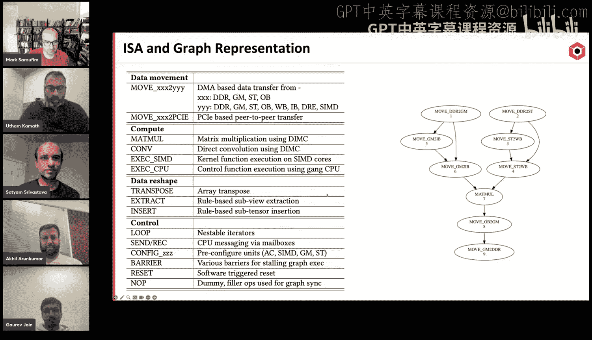

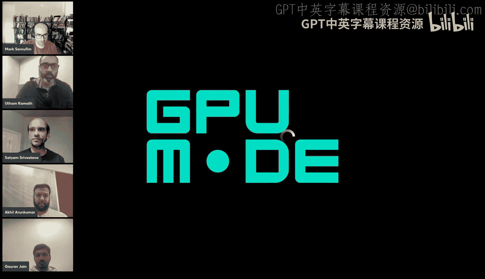

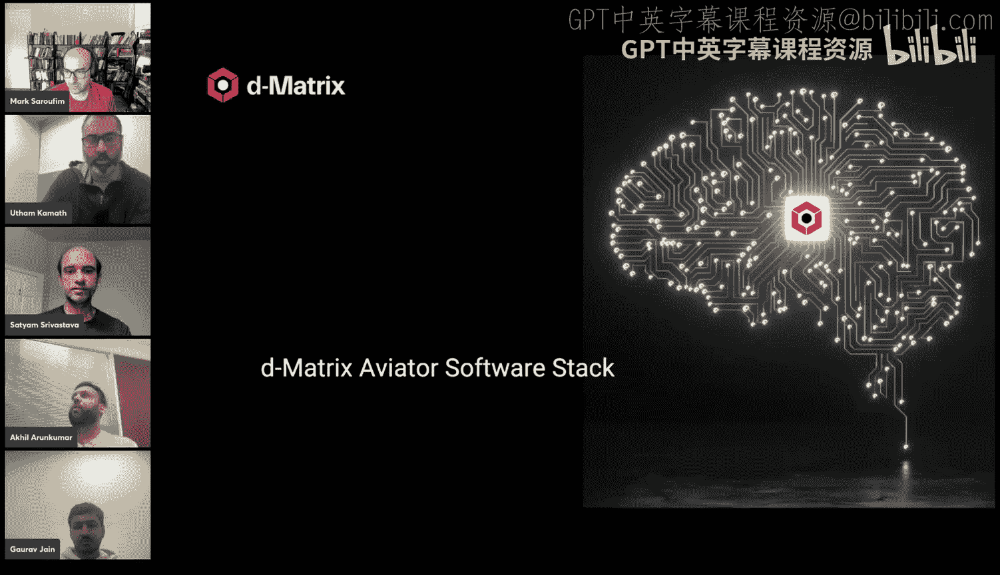

Corsair采用**Chiplet（小芯片）** 设计。一个PCIe卡上包含两个多芯片模块，每个模块又由四个Chiplet组成。这种设计提高了良率、降低了成本，并便于扩展。

**Chiplet的层级结构如下：**
1.  **Quad（四核组）**：基本的独立可编程单元，包含约50 TOPS的计算能力。
2.  **Slice（切片）**：每个Quad由多个Slice组成。
3.  **Apollo Core（阿波罗核心）**：Slice中的核心计算单元，即**存内计算阵列**。它像数字化的Tensor Core，将权重静态存储在内存中，流式输入激活值进行计算，避免了模拟电路的不稳定性。

**关键公式：算术强度**
`算术强度 = 计算操作数（FLOPs）/ 内存访问量（Bytes）`
LLM解码的算术强度极低，因此是**内存瓶颈型**任务。Corsair通过存内计算，从根本上减少了数据移动需求。

**工作负载编排**
Corsair使用**分层队列**这一创新的硬件数据结构来管理任务。它在硬件中镜像了软件定义的依赖关系图，支持高度并发操作，并能**在硬件层面原生支持自回归**，动态处理不断增长的上下文长度，无需重新编译计算图。

---

## 章节 4：系统级扩展与互连 🔗

单个芯片的能力有限，AI推理需要规模扩展。Corsair在系统层面也进行了精心设计。

**扩展层级：**
1.  **芯片内**：Chiplet内部通过高速互连实现全连接。
2.  **卡内**：通过Die-to-Die链路和PCIe连接多个Chiplet，形成统一的**张量并行单元**。
3.  **卡间**：使用专用的DMX桥接器（类似NVLink）连接多张卡。
4.  **机架/集群级**：通过定制的、支持TCP流式传输的网络接口卡，利用标准以太网进行扩展，可连接成千上万的Corsair卡。

**通信优化**
架构优先支持**聚集（Gather）** 操作而非规约（Reduce）操作，并内置**多播**支持，这减少了通信开销和精度要求，特别适合LLM中常见的张量并行模式。

---

## 章节 5：软件栈与内核编程 💻

强大的硬件需要灵活的软件来驱动。Corsair的软件栈主要包括**降低层**和**执行层**。

**降低层**负责将高级模型（如PyTorch模型）转换为能在Corsair上运行的低级指令。主要有两种方式：
1.  **基于编译器的路径**：使用MLIR编译器进行自动化图优化和代码生成。
2.  **模型构建器路径**：通过手工编写或组合**内核**来构建计算图。

**什么是内核？**
内核是一段（通常用Python编写的）代码，它将一个操作（如矩阵乘法）转换为一个由机器指令构成的有向无环图。

**内核编程示例**
以下是一个简化的内核调用示例，展示了如何分配张量并调用矩阵乘法内核：

```python
# 模型构建器代码（用户编写）
# 1. 分配张量（指定逻辑形状和物理内存布局）
input_tensor = allocate_tensor(shape=(M, K), layout=...)
weight_tensor = allocate_tensor(shape=(K, N), layout=...)
output_tensor = allocate_tensor(shape=(M, N), layout=...)

# 2. 实例化内核并调用
mm_kernel = MatrixMultiplyKernel(resources=my_quad)
graph1 = mm_kernel.multiply(input_tensor, weight_tensor, output_tensor)
# 可以连接多个内核
graph2 = mm_kernel.multiply(graph1.output, another_weight, final_output)

# 3. 代码生成
isa_graph = codegen([graph1, graph2])
```

内核开发者需要精细管理数据在SRAM缓冲区（输入、权重、输出缓冲区）中的移动，以实现计算与通信的重叠，从而最大化硬件利用率。

**动态形状支持**
对于KV缓存等动态增长的数据，Corsair的ISA指令支持在运行时重写参数。内核会插入特殊的占位符，由运行时传入具体的迭代步数等信息，从而动态调整内存访问模式。

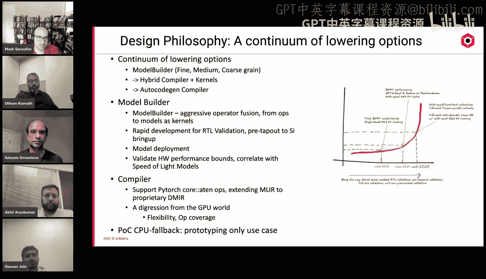

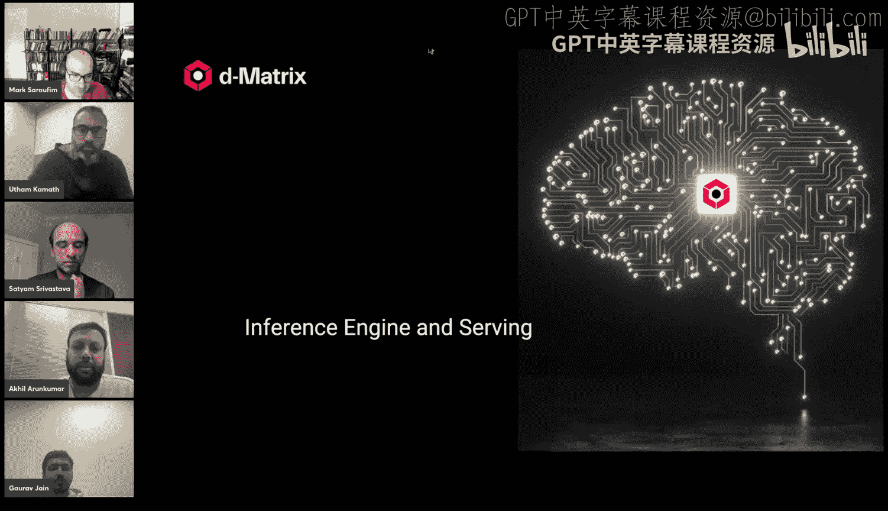

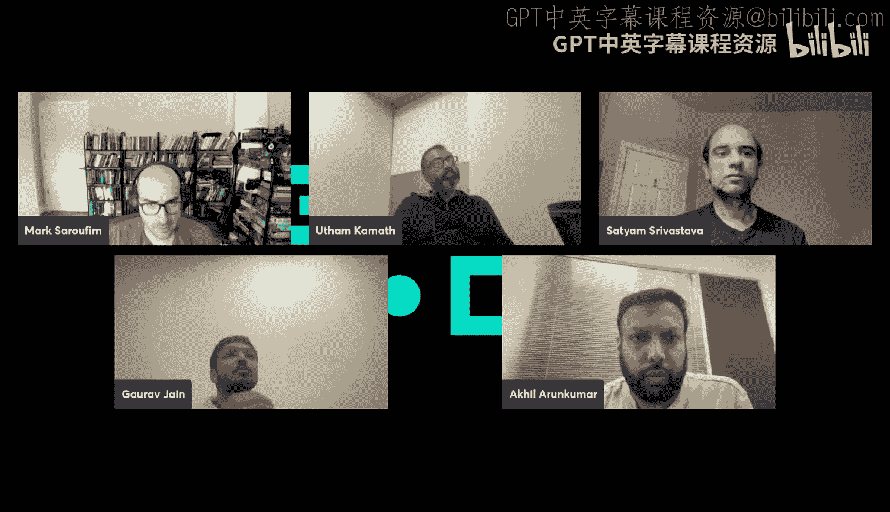

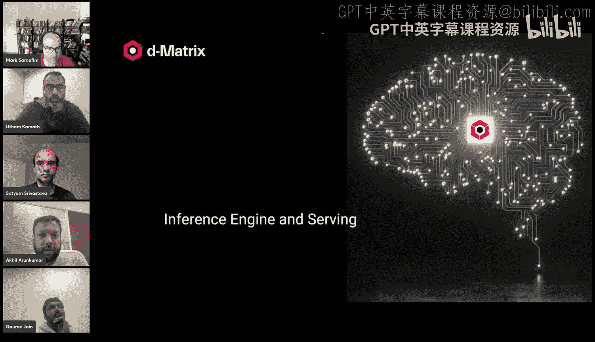

---

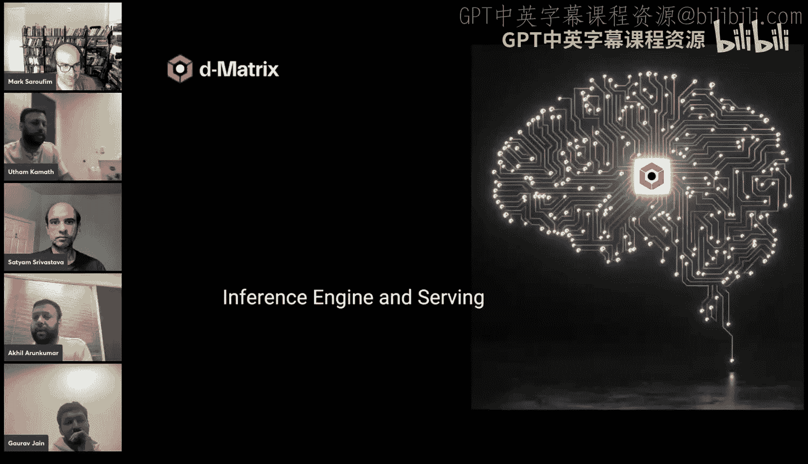

## 章节 6：运行时与推理服务引擎 ⚙️

最后，我们来看执行层，它负责在主机上管理和服务推理请求。

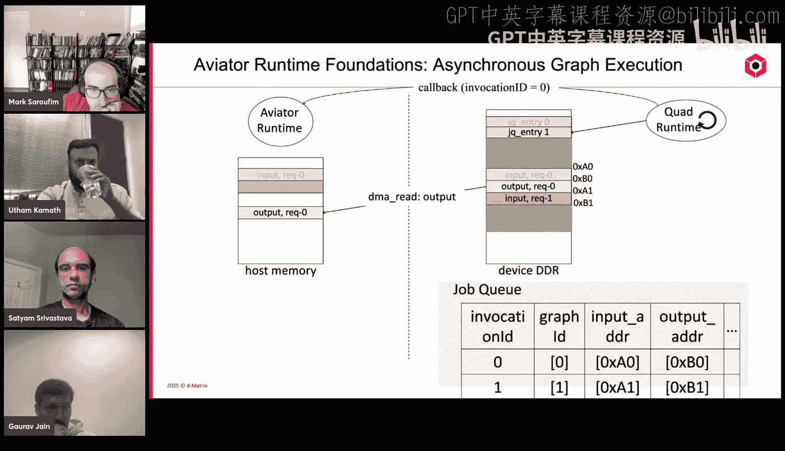

**Aviator运行时**
这是一个模型无关的图执行层。它的目标是接收计算图及其输入张量，在加速器上异步执行，并将结果返回给用户。

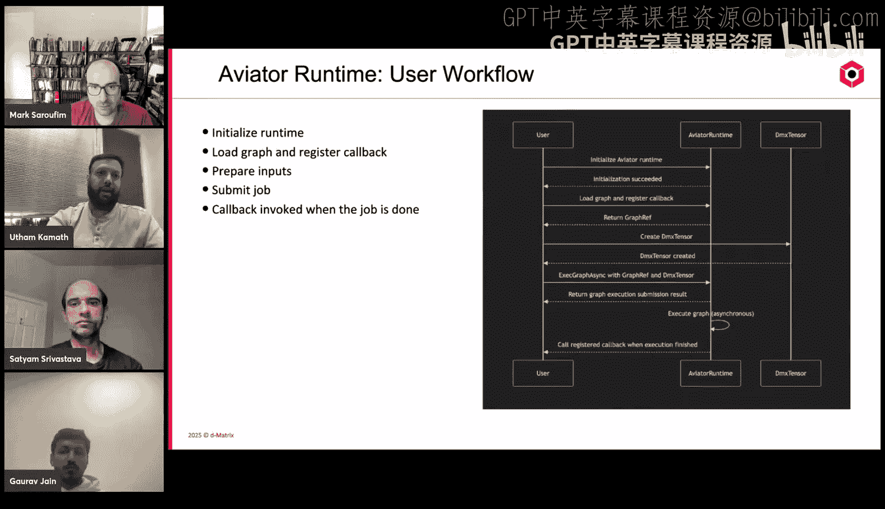

**核心机制：**
*   **DMX Tensor**：抽象了设备上的张量，管理设备内存、数据类型，并可自动处理主机-设备间的数据搬运和类型转换。
*   **异步图执行**：主机将任务写入设备的“任务队列”，设备运行时从中获取并执行。任务完成后，通过回调机制通知主机，从而实现高效流水线。

**Aviator推理引擎**
这是模型感知的智能服务层，支持多模型和分布式推理。

**架构特点：**
*   **极简主机开销**：精心设计进程间通信，确保其不在关键路径上。Worker之间无直接通信，所有集合通信都嵌入计算图中由硬件执行。
*   **分布式管理**：采用“一个Worker对应一个加速卡”的模式。多个Worker组成**张量并行单元**，多组Worker形成**流水线并行阶段**。引擎是大脑，负责调度、管理KV缓存、执行LLM状态机（如前缀、解码阶段）。
*   **阶段化执行**：引擎通过“阶段运行器”来执行不同阶段（如前缀、解码），阶段运行器再调用底层的运行时来执行具体计算图。

这种设计使得Corsair系统能够以极低的每Token主机开销，服务于低延迟、高吞吐的LLM推理请求。

---

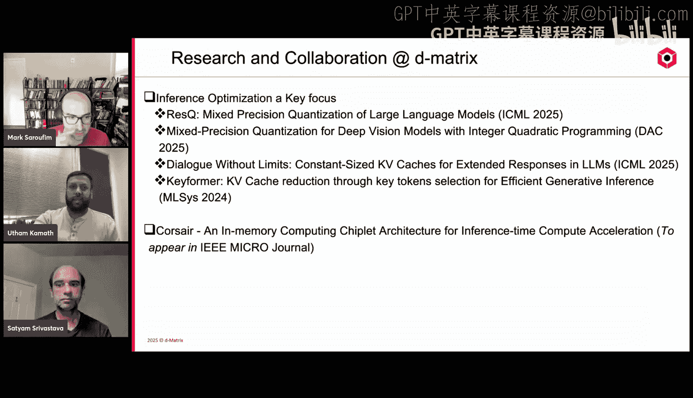

## 总结 🎓


本节课我们一起深入学习了D-Matrix Corsair架构。我们从生成式AI推理的挑战和“内存墙”问题出发，探讨了Corsair如何通过**存内计算**这一范式转变来应对这些挑战。我们剖析了其从Chiplet、Quad到Apollo Core的层级化硬件架构，以及支持大规模扩展的互连方案。在软件层面，我们了解了其兼具灵活性和性能的**内核编程模型**，以及高效管理任务和服务的**运行时与推理引擎**。Corsair代表了一种为特定AI工作负载（尤其是LLM推理）进行全栈协同设计的先进思路。