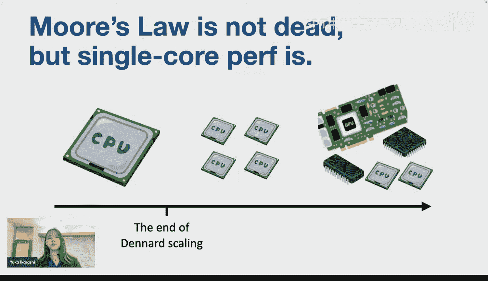
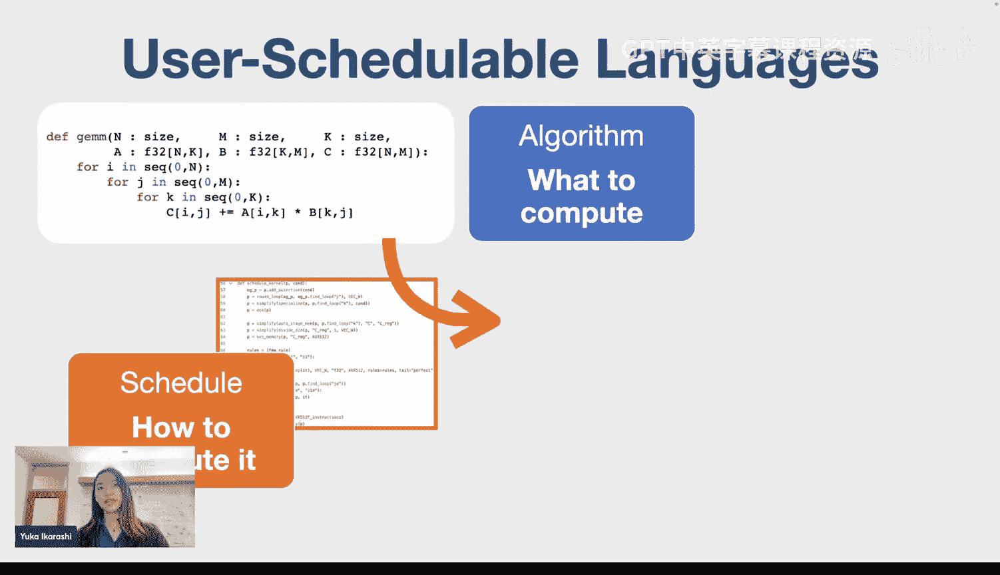
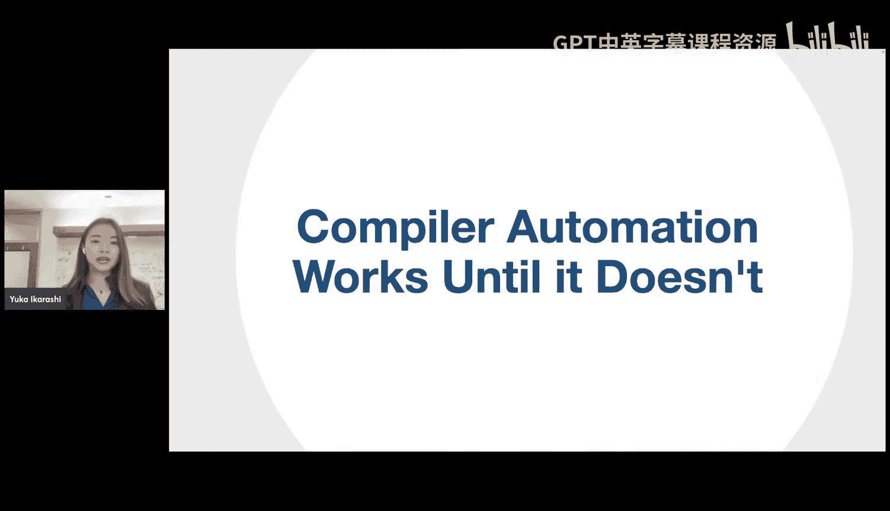
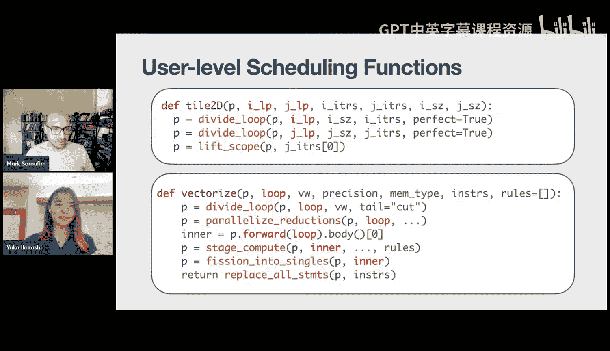

# 9：Exo 2 - 发展一种调度语言

在本节课中，我们将学习一种名为Exo的编程语言，它用于编写高性能计算内核。我们将探讨其核心设计理念，即如何通过用户可扩展的调度操作和库来赋予性能工程师最大控制权，同时保持编译器的安全保障，从而高效地优化大量内核。

## 概述：硬件潜力与软件挑战

随着摩尔定律的终结，行业转向多架构和专用加速器（如GPU）来驱动性能提升。现代硬件（如Apple M4）拥有许多专用加速器。然而，没有合适的软件来发挥其潜力，这些尖端硬件就毫无用处。

硬件没有合适的软件来利用其潜力，就只是一块砖头。我们需要能够最大限度利用现代硬件能力的软件。问题在于如何做到这一点。

考虑一个简单的矩阵乘法。计算本身很简单。但如果你直接用Python实现，性能甚至达不到单核CPU峰值的0.1%。即使使用C语言和最高优化设置，性能也不会超过CPU潜力的1%。这是因为简单代码与优化代码之间的差距巨大。

行业领先的GEMM实现（如OpenBLAS）必须绘制复杂的分块策略图，最终形成大量看起来像这样的C和汇编代码。优化一个内核已经足够复杂和耗时，但性能工程师在地球上需要优化的内核不止一个。

例如，基础线性代数子程序（BLAS）是一个线性代数库规范。这个BLAS规范有许多内核，指定了不同的向量、矩阵运算，每个都有不同的内核规范和维度。仅BLAS Level 2的11个内核规范就产生了50个内核变体，这甚至不包括不同的硬件目标。

因此，性能工程师需要高效地优化许多内核，而不仅仅是一个内核。好消息是，已经存在许多编程语言来帮助性能工程师提高效率。这些语言有不同的抽象和方法，但都必须平衡一个权衡：性能工程师希望对优化进行控制以达到峰值性能，而编译器则自动化其他方面以提高效率。

在自动化决策和留给性能工程师的决策之间存在着不可避免的张力。所有编程语言都试图为其抽象和应用定义一个良好的边界。例如，一个边界决策是功能等价性。编译器可以确保原始代码和优化代码的功能等价，这样性能工程师就可以花时间进行实际优化，而不是调试索引错误。

这些语言被称为用户可调度语言（USL）。在USL中，用户首先定义要计算什么作为算法规范。在Exo语言中，算法规范看起来像是一个普通的Python循环，可以简单地映射到C语言。除了算法规范，性能工程师还提供描述程序优化（即如何计算原始算法）的调度。

优化可以使用诸如`reorder`和`split`之类的原语来描述。这些原语描述了算法的代码转换。例如，`reorder`就是重新排序内外循环，`split`将一个循环分成外循环和内循环。这些通常被称为循环级优化，USL通常支持这些优化。

非常重要的一点是，编译器会检查这些原语转换的等价性。因此，当编译器根据算法和调度生成低级复杂的目标代码时，我们知道输入算法和优化代码在功能上是等价的。这不仅是为了美观，更是为了提高效率。具有保证等价性的调度让性能工程师能够专注于创造性和实际优化程序，而不是修复复杂的索引数学问题，尤其是在为加速器获取正确的索引数学通常非常困难的情况下。

这是USL的高级概述。这很棒，我们获得了功能等价性。但USL像其他编程语言范式一样，存在一个大问题：编译器自动化在失效之前一直有效，而当编译器自动化失效时，性能工程师别无选择，只能用C或汇编编写低级代码。

以一个实际的USL为例，一个流行的USL叫Halide。Halide让性能工程师能够控制数据局部性、并行性和冗余计算，并自动化其他方面（如边界推断和指令选择）。这很好，Halide在许多用例中被证明非常高效，但它并不总是有效。例如，即使作为一个成熟的系统，Halide的指令选择近年来也不得不通过名为`Braid`和`Pareo`的论文进行改进。这是因为从根本上说，当Halide性能工程师想出比Halide自动化更好的指令选择时，他们别无选择，只能修复编译器本身，或者放弃并直接编写C代码。这给Halide开发人员带来了持续改进指令选择的巨大压力。

此外，直到今天，Halide仍然不支持像Tensor Core或Gemini这样的张量加速器。因为一般来说，加速器倾向于向软件暴露更多控制，这使得控制与自动化的边界划分变得非常不平凡。例如，张量加速器和现代GPU向软件暴露了非常复杂的内存管理，无论我们喜欢与否，处理它们对于实现峰值性能至关重要。但这是一个悬而未决的问题：USL应该自动生成这些显式内存管理指令，还是应该向性能工程师暴露这些内存管理指令？如果是后者，应该如何暴露？我现在不打算回答这个问题，只是为了让你了解为加速器指令定义这个边界有多么不平凡。

当我们转向这个边界的另一边时，预取和存储折叠在Halide最初设计时是自动化的，但几年后不得不跨越这个边界，因为使用Halide的性能工程师希望自己控制这些决策，因为他们可以做得更好。

实际上，我的观点是，即使在成熟的系统中，这种控制与自动化的边界也不完美，而且常常是模糊的。这是因为当出现问题时，比如现有的自动化不起作用，性能工程师想要更多控制，除了修改编译器本身之外别无他法。

现有USL设计的另一个缺点是，它们并非真正为代码重用而设计。这些是Halide中Harris角点检测器和Anisotropic扩散的调度代码。你可以看到不仅在两个内核之间存在代码重复，甚至在一个内核内部也存在。这种存储-计算-向量的模式并非随机模式，而是称为滑动窗口优化，是图像处理中非常常见的优化模式。但是，如果没有重用这些优化模式的方法，你就必须一遍又一遍地编写许多相似但略有不同的调度逻辑。

你可以想象，这就像支持BLAS一样成为噩梦，因为你有很多维度的笛卡尔积，编写大量相似但略有不同的调度将非常痛苦。

因此，现有USL的设计目标是：首先，它们支持一组固定的调度操作符，这些操作符在人体工程学层面经过精心设计，针对特定的应用或一类优化。这种控制与自动化的边界被设计为固定的。其次，USL传统上没有良好的设施来支持调度代码的重用。由于具有这组固定的操作符，添加新的硬件目标需要非平凡的编译器更改。另一种看待这个问题的方式是，现有的USL在编写单个且相对较小的内核时最有用，有点像脚本DSL（如awk）非常适合编写快速或小型的一次性任务，但难以扩展到大型程序。

这是对现有USL的概述。但Exo的设计目标不同。在Exo中，我们优先考虑给予性能工程师最大控制权以实现最佳性能，因此我们将这个边界一直向右移动。我们认为编译器自动化应该最小化，专注于安全性分析，同时允许性能工程师做出关键决策，包括指令选择（这通常在其他USL中是自动化的）。这种默认给予最大控制权的设计的关键原因是，性能工程师无法获得比朴素编译器构建所能提供的更多控制。一个类比是，如果你想获得比C语言更多的控制，当你编写C代码时，你需要转而编写内联汇编，这当然是另一种语言。

当然，这种方法是以减少性能工程师的自动化为代价的，因为他们现在需要控制更多事情。我们不是将自动化内置于编译器本身，而是建议将自动化构建到用户代码作为库。这让我们可以为诸如具体化、边界推断甚至定义新硬件目标等事情提供自动化，而这些在现有编译器中通常是内置并固化在编译器中的。

因此，我们的设计目标有点像“USL界的C语言”。我们认为编译器默认应该提供最大控制权，并通过一系列库提供抽象。我们称这种设计为Exo编译，并实现了Exo语言来体现我们的设计。高层次上，我们不是拥有一组固定的调度操作符，而是希望使调度操作符可由用户扩展，这意味着自动化的生产力应该通过用户定义的库来实现，而不是通过编译器内置。因此，我们的原语被设计得尽可能低级，因为库可以提供更多自动化，但不能更少。这使得Exo能够轻松支持新的硬件加速器，并扩展到支持像完整BLAS这样的大型程序。

## 用户可扩展调度：从向量化案例看起

上一节我们介绍了Exo的设计理念是赋予用户最大控制权。本节中，我们来看看如何通过库来实现用户自定义的调度操作，以向量化为例。

为了让我们更好地理解，让我们看看Exo中具体的向量化过程。这是一个Exo中的SAXPY代码，其中`C`代表顺序循环，缓冲区`x`和`y`在DRAM中。我们想要尝试向量化这个标量SAXPY代码，目标是AVX2指令和单精度向量宽度为8。首先，我们像这样将循环分成两个`io`和`ii`循环。

但这仍然不完全像一个向量化循环，因为`x`和`y`仍然在DRAM中并且只是标量。要使用向量寄存器，我们需要将计算暂存到AVX2寄存器中。然后我们可以将这个寄存器维度扩展到8，并进行循环裂变，使得每个`ii`循环看起来像向量指令。第一个`ii`循环是从`y`加载到`var1`（AVX2寄存器），第二个循环是将`alpha`广播到`var3`（另一个AVX2寄存器）。

最后，我们可以用对实际向量指令的调用来替换那些看起来像向量指令的循环。最终，我们在Exo中得到了这个向量化代码。我们可以轻松地将此代码降低到C语言，并在AVX2机器上运行，这将比原始的标量SAXPY快得多。

回顾一下我们刚才所做的：我们从这个非常简单的标量SAXPY代码开始，对这个代码进行了四次转换。所有中间代码当然都在Exo中，并且转换的每一步都保持了功能等价性。再次强调，这种功能等价性非常重要，因为我们希望这个向量化代码仍然计算相同的SAXPY，而不是其他任何东西。我在这里描述的过程实际上是Exo调度过程，它通过应用诸如`split`、`stage_compute`等调度操作符，将这个简单的起始代码转换为其优化版本。

实际的调度代码看起来像这样：以标量SAXPY作为输入`proc`，通过`split`划分循环，暂存计算，并用向量指令替换循环。这是一个用户调度过程，我们认为这是优化代码的一种比手动编写最终向量化代码更高效的方式。

在这里，我们成功向量化了一个内核SAXPY。但SAXPY实际上只是BLAS的一小部分。回想一下之前的幻灯片，BLAS有许多内核和许多维度，SAXPY只是Level 1内核中的一个。作为性能工程师，你必须高效地优化所有这些维度，而不仅仅是一个SAXPY。让我们看看另一个名为`SCAL`的BLAS内核。`SCAL`是将向量乘以标量并写入同一个向量`X`，而SAXPY是累加到不同的向量`Y`。

SAXPY和`SCAL`是不同的内核，但实际上，我们可以应用完全相同的调度序列，并为两者都获得向量化代码。这很好，但不是很简洁，因为我们不希望代码库中到处都是重复的代码。软件工程师自然要做的事情是将这些常见的调度模式封装在一个函数中。也许我们可以将这个函数命名为`simple_vectorize`，并从那些SAXPY和`SCAL`中调用它。

高层次上，Exo允许用户在用户代码中完全定义一个新的调度操作符，比如这个`simple_vectorize`。这看起来可能微不足道，但在现有的USL（如Halide）中这是不可能做到的。我们想称之为用户可扩展调度语言。

我们确定了用户可扩展调度语言的三个关键设计特性。首先，调度需要一种转换或修改目标代码的方式，我们称之为“动作”。编译器需要提供一些内置或原始动作，以提供这种安全的低级转换。我们称之为“原始动作”，我们支持超过60个这样的动作。我们使用基于Z3的多面体依赖分析来检查这些转换的正确性，我将在本讲的下一部分更多地讨论这个分析。

这很棒，我们检查了这些原始重写的安全性，但你可能想知道用户定义操作的安全性检查是如何工作的。这在事后看来是一个显而易见的想法：因为每个原始动作都保证保持功能等价性，所以像`simple_vectorize`这样的用户定义函数（是这些动作的组合）也仅仅通过组合就保证了保持功能等价性。这非常强大，因为我们可以从更简单的操作构建更复杂的操作，并且基本上免费获得安全检查。实际上，那些调度操作符`stage_compute`、`fission`、`replace_all`也是用户定义的运算符，而不是编译器原语。这只是试图展示我们如何通过组合这些较小的函数来构建这个操作符库，以定义像`simple_vectorize`这样相当复杂的操作。

我们讨论了动作。在执行动作时，我们有时需要询问关于代码的问题，比如这个缓冲区是`F32`还是`F64`？我们需要一种询问代码问题的方式，我们称之为“检查”。最后，这听起来可能非常基础，但我们需要能够指向或引用对象的部分。

## 稳定引用：光标（Cursors）的作用

上一节我们讨论了如何通过组合动作来构建复杂的调度操作。本节中，我们来探讨一个关键机制——稳定引用，这是实现可组合调度的基础。

现在让我们谈谈引用。暂时，我们将忘记Exo和USL。编程语言中有许多种引用，比如指向值、字符串、数组或函数指针或其他数据结构的指针。但编译器的特殊之处在于，编译器中的引用指向另一段代码。编译器当然需要引用它们正在操作的代码，以便可以修改它。

Clang称之为AST匹配器，LLVM称之为模式匹配，它们在编译器中有各种用途。指向代码是编译器（如LLVM）非常基本的机制。假设我们有一个初始的LLVM IR，其中这个外三角形和这个外圆角矩形说明了整个LLVM IR，内矩形和这个高亮三角形表示IR中的这个子树。

LLVM使用这种模式匹配来指向一个子树，如果可以的话，它会简化这个指令。这对LLVM有效，但有一些限制。因为模式匹配是一次性引用，这意味着如果你想应用进一步的优化，你必须用新模式（如`A`）重新查询整个IR。这里的问题是你必须始终确切地知道在此过程的每个点上代码结构是什么样子。因此，当你用`A`显式重新查询IR时，你的模式匹配只针对具体的IR `A`，而不是其他任何东西。有了这个，就不可能通过定义来参数化这个一次性引用，因为你必须始终确切地知道在此调度过程的每个点上目标代码的结构。

对我们来说，对于USL，一次性引用是不够的，我们需要一个稳定的引用。假设我们有这个初始目标代码`proc`，`proc`指向这整棵树，一个引用`c`指向一个像这样的子树。

每个Exo调度操作接受一个过程`proc`和一个像这样的引用`c`。`reorder_loops`重新排序我们在上一张幻灯片中看到的循环，因此在应用此操作后，代码看起来像这样。更新后的`proc`将指向一个新的目标代码。我们希望`c`在转换后继续指向同一个子树，因为这显然对调度很方便，因为你可以继续使用相同的引用，而无需知道转换后IR的确切结构。

在Exo中，我们提出了称为“光标”的东西来支持这种稳定引用。光标由路径表示，该路径记录AST的导航，这相当简单。例如，这个底部显示了一个指向此目标代码`y`的光标的路径表示，`body 1`表示主体中的第二个语句，所以它指向这个循环。`body 0`表示主体中的第一个语句，所以指向这个赋值，`rhs`是这个赋值的右侧，`lhs`是这个二元操作`add`的左侧，所以`y`由这个光标路径表示表示。

好的，这并不难，但是在代码被调度修改后会发生什么？如果你展开这个`j`循环，`y`的这个路径表示基本上就变得无效了。所以路径表示本身并不十分稳定，我们需要除了这个之外的其他东西。

光标提供这种稳定引用的下一个特性称为“转发”，它定义了在应用某个动作后路径应如何更新。我们可以将这两个语句替换为单个语句。当我们这样做时，我们希望指向这些语句的光标在转换后继续指向这个替换后的语句。

这个转发规则可能看起来像这样：我们保留到子树其他部分的现有路径，到旧树的路径应保持有效。我们为所有60个编译器内置原语定义了这个转发规则。这就是我们如何通过光标实现稳定引用。

但我们想看看光标如何在实际的调度过程中使用。假设我们在左侧有一个调度库函数`foo`，函数参数`proc`指向对象过程，看起来像这样。光标`c`指向这个`i`循环，另一个光标`d`指向这个`if`语句，所以整棵树可能看起来像这样，采用向下遍历的光标路径表示。

第一个动作`reorder_loops`将重新排序光标`c`指向的循环，所以它将重新排序循环`i`和`j`，因此在重写后它将看起来像这样。之后，`c`的主体将指向这里，因为`c`指向`i`循环。`fission`将在光标之后进行裂变，所以在裂变后它将看起来像这样。`reorder_before`接受一个指向这个`if`语句的光标`d`。`reorder_before`将此语句重新排序到循环之前，所以它将看起来像这样。最后，将光标`c`指向的这个`i`循环替换为`load`，所以它变成这样。

因此，在此完整调度过程之后，这里的对象代码可能看起来像这样。光标`c`指向这个`load`，这可能是此对象代码的光标路径表示。但重要的是，回想一下，在函数`foo`开始时，`c`指向这个`i`循环，而同一个光标`c`设法在整个调度过程中稳定地指向同一个子树。这是通过我们定义的光标转发实现的。

我们想看看一个更现实的用户级调度函数。这个`tile_2d`代码非常简单，由三个原始调用组成：两个`divide_loop`和一个`lift_scope`。`vectorize`是`simple_vectorize`的更通用版本，它更复杂，因为`vectorize`本身调用了其他用户定义的函数，如`parallel_reduce`。

但这里的要点是，我们可以在库代码中构建相当复杂的操作符，如`tile_2d`和`vectorize`。重要的是，所有那些用户级函数（如`vectorize`）也保证保持功能等价性，正如我所解释的，仅仅通过组合。这是可能的，因为那些以红色高亮显示的光标在整个调度过程中提供了稳定的引用，并且它允许这些调度函数的参数化。

这些单独的用户定义函数的集合最终成为一个库。

## 在库中定义硬件目标

上一节我们看到了如何通过库函数构建复杂的调度操作。本节中，我们来看看Exo的另一个核心特性：如何在用户库中定义硬件目标，而不是将其硬编码在编译器内部。

现有的编译器在编译器本身内部实现新的硬件目标，因此当新硬件目标出现时，需要编译器编写者来支持它，因为硬件目标代码实际上嵌入在编译器内部。在Exo中，我们认为这个责任应该外部化并转移给用户或库实现者。我们认为这种外部化在处理专有硬件接口和开发新硬件时是有益的，因为ISA非常不稳定。

通过外部化硬件定义，你不必重复修改编译器，不必每晚获取完整更新并试图跟上主编译器开发的步伐。我认为拥有这样一个模块化的编译器系统是非常必要的，尤其是在我们现在拥有如此多商业加速器，并且它们每12个月就会大幅更新的情况下。