# 10：基于搜索的深度学习编译器 🚀

在本节课中，我们将学习Luminal项目，这是一个采用“搜索优先”方法的机器学习编译器。我们将探讨它如何通过极简的算子集和基于搜索的编译技术，来简化并加速深度学习模型的执行。

## 概述

传统的机器学习框架（如PyTorch）依赖大量手工优化的内核，导致代码库庞大且复杂。Luminal采取了不同的路径：它从一个极简的、由11个基础算子组成的集合出发，将复杂的神经网络操作表示为这些基础算子的组合。然后，它使用基于搜索的编译器技术，自动探索大量逻辑上等效但性能不同的计算内核，并通过性能分析找到最优实现。这种方法旨在将复杂性从手工编码转移到自动化搜索中，从而简化核心库并实现高性能。

## 核心概念：极简算子集

上一节我们概述了Luminal的目标，本节中我们来看看其核心设计理念：一个极简的算子集。

Luminal认为，大多数现代神经网络（如LLM、MoE、扩散模型）本质上都是线性代数运算。因此，它仅使用11个基础算子来构建所有复杂操作：
*   **一元算子**（对单个张量进行逐元素操作）: `exp2`, `log2`, `sin`, `cos`, `sqrt`
*   **二元算子**（对两个张量输入进行操作）: `add`, `multiply`, `mod`, `less_than`
*   **归约算子**: `sum_reduce`, `max_reduce`


通过组合这些简单算子，可以构建出减法、除法、矩阵乘法（MatMul）甚至卷积等复杂操作。例如：
*   **减法**: `a - b` 等价于 `a + (-1 * b)`
*   **矩阵乘法**: 可以通过广播乘法（`multiply`）后沿K维度进行求和归约（`sum_reduce`）来实现。

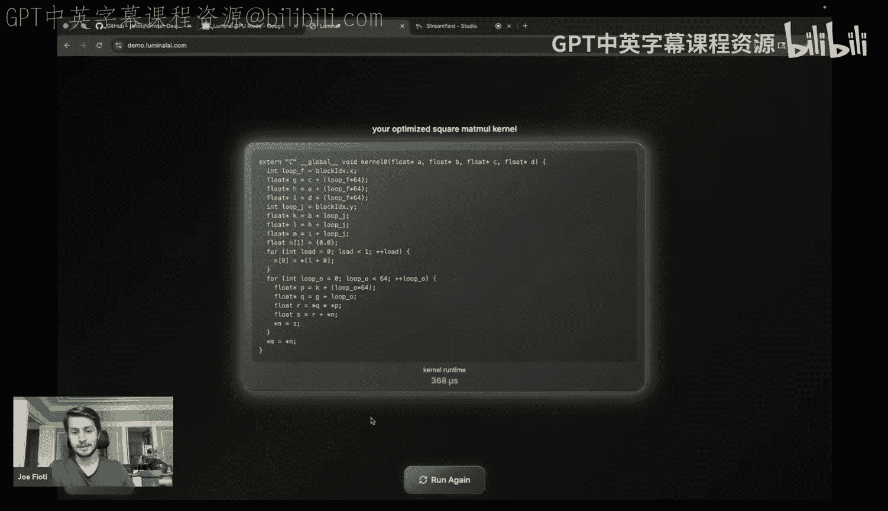

这种设计使得Luminal的核心库非常精简（约5000行代码），但直接执行这些基础算子组合成的计算图会很慢。这正是编译器的用武之地。

## 从计算图到编译器

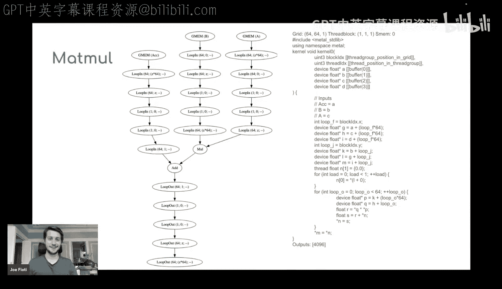

上一节我们介绍了极简算子集，本节中我们来看看Luminal如何利用计算图和编译器来恢复性能。

Luminal将神经网络模型表示为**静态的计算图**（有向无环图）。与PyTorch等框架的动态图相比，静态图虽然灵活性较低，但为编译优化提供了坚实基础。模型一旦定义，其计算图结构（不包括权重和激活值数据）就是固定的。

这种极简且静态的表示，为编写编译器创造了有利条件。Luminal的核心工作就是一个**机器学习编译器**，它将这些由基础算子构成的、执行缓慢的高级计算图，转换并优化为高效的、针对特定硬件（如CUDA）的低级内核代码。

## 搜索：编译器的核心

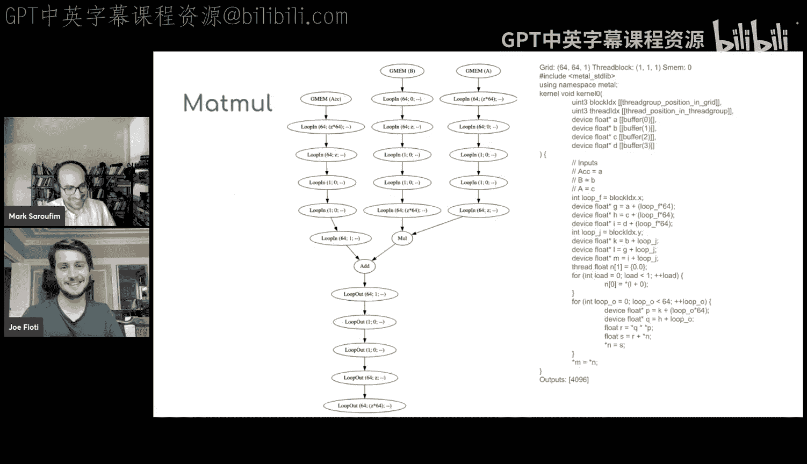

上一节我们了解了编译器的角色，本节中我们深入探讨Luminal编译器的核心机制：基于搜索的优化。

传统编译器依赖预定义的启发式规则和优化顺序，这在面对复杂且追求极致性能的ML工作负载时显得力不从心。Luminal借鉴了AlphaGo等解决复杂问题的思路，将**内核编译问题转化为一个搜索问题**。

其核心思想是：与其依赖复杂的、可能出错的启发式规则来决定如何优化（例如，循环是否展开、分块大小是多少），不如系统地**搜索所有可能的、逻辑上等效的内核实现空间**，并通过实际性能分析（Profiling）找出最快的那个。

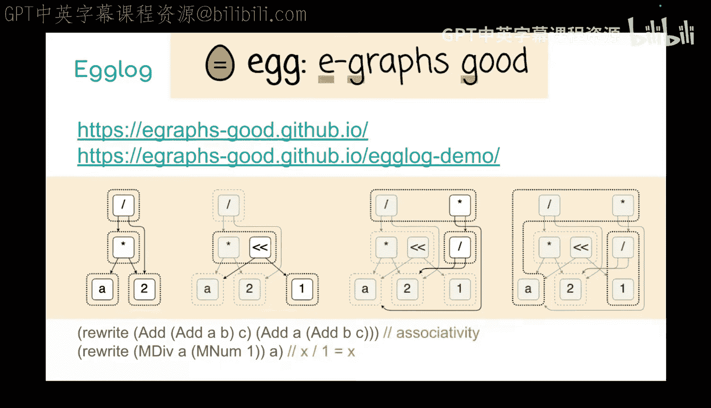

以下是搜索过程的关键步骤：
1.  **构建搜索空间**：使用`egglog`（一种基于e-graph的等价逻辑编程语言）和一系列重写规则，将初始计算图扩展成一个包含数百万个可能内核实现的巨大搜索空间。
2.  **探索与评估**：采用各种搜索策略（如蒙特卡洛树搜索MCTS、束搜索Beam Search）来探索这个空间。对于搜索到的候选内核，会生成实际的CUDA代码并进行性能分析。
3.  **选择最优**：最终选择在目标硬件上运行最快的那个内核实现。

这种方法让编译器“不知道”最佳优化是什么，而是通过搜索“发现”它。

## 技术细节：中间表示与代码生成

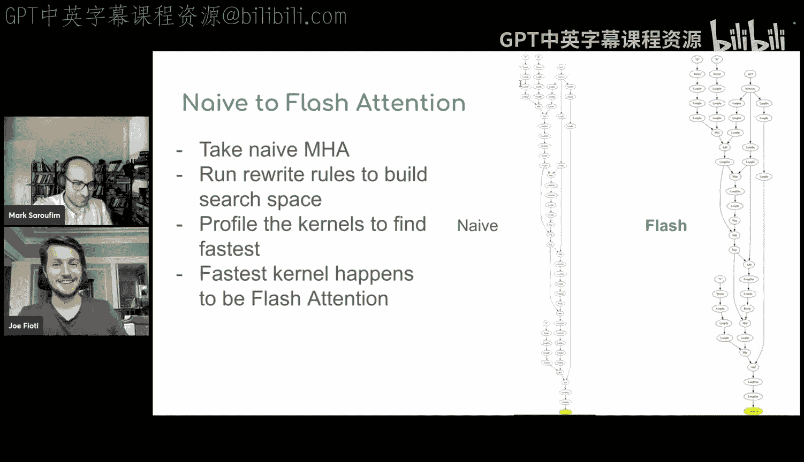

上一节我们介绍了基于搜索的编译理念，本节中我们来看看其背后的具体技术表示。

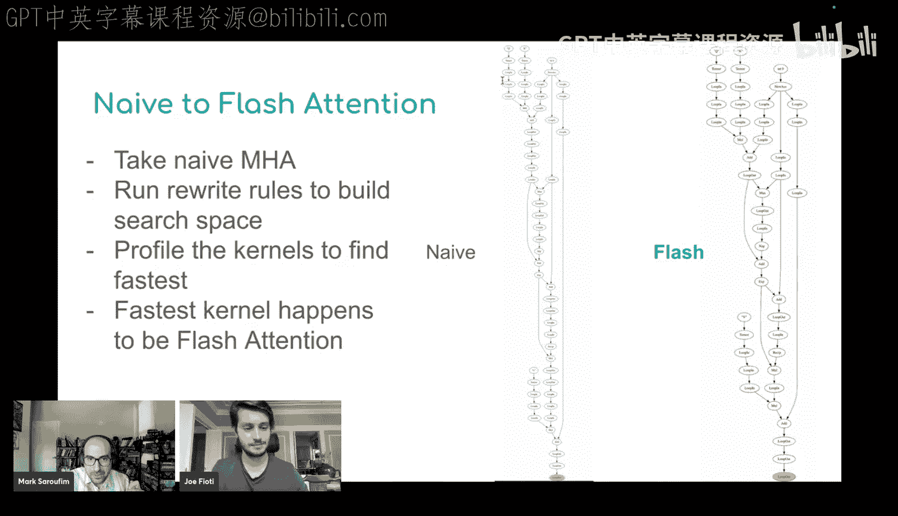

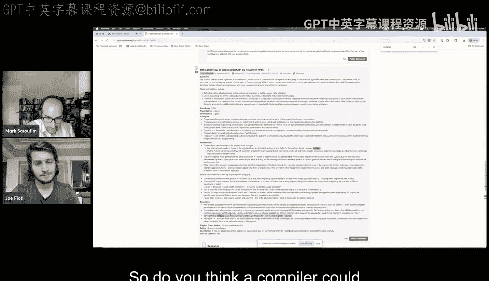

Luminal使用一种自定义的**中间表示**来刻画计算。这种IR非常接近硬件执行模式。以下是一个对10个元素先取指数再取正弦的简单操作示例：


```lisp
; IR示例：计算 sin(exp2(input))
(loop_in 10 stride_z) ; 循环读取10个元素，步长为z（此处为1，表示连续访问）
  (exp2)              ; 对读取的元素进行指数运算
  (sin)               ; 对上一步结果进行正弦运算
(loop_out stride_z)   ; 将结果写回内存，步长同样为z
```

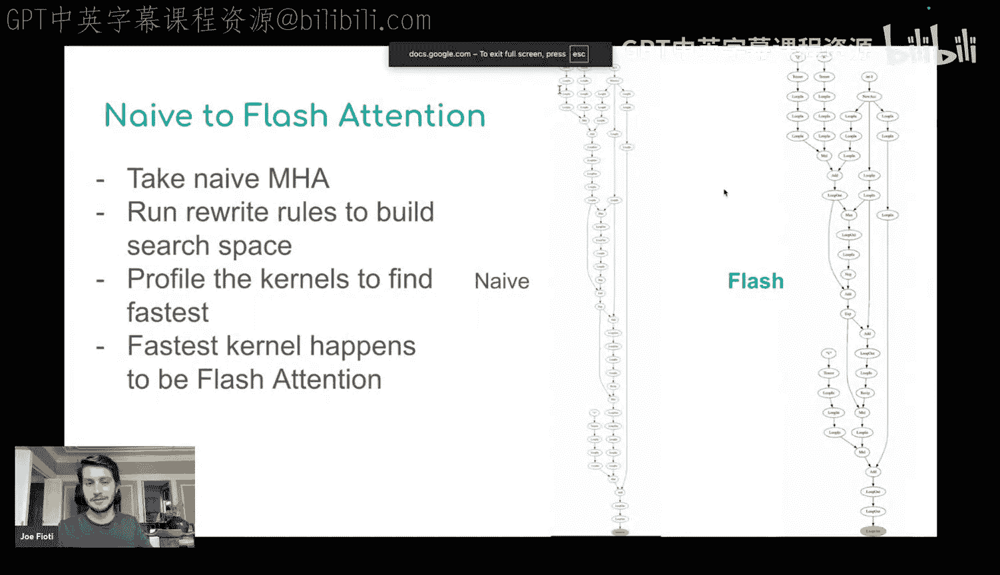

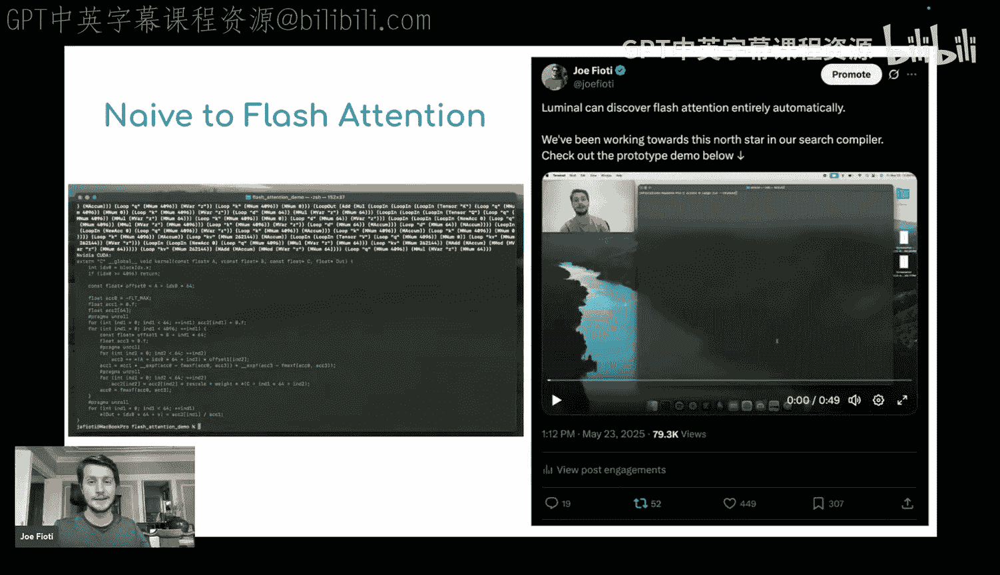

这个IR可以确定性地生成对应的CUDA内核代码。编译器搜索过程会应用重写规则来变换IR。例如，一个重要的优化是**循环融合**，它将多个逐元素操作合并到同一个循环中，避免中间结果写回全局内存的开销，从而显著提升性能。

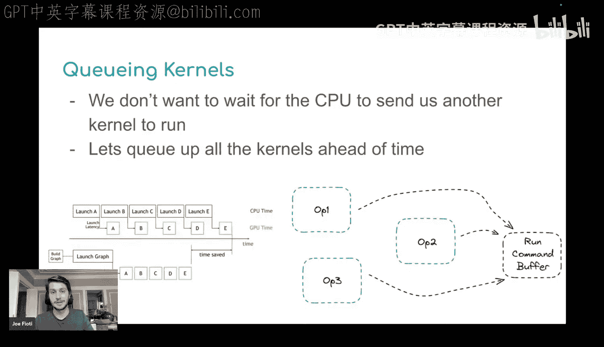

## 实际案例：自动发现Flash Attention

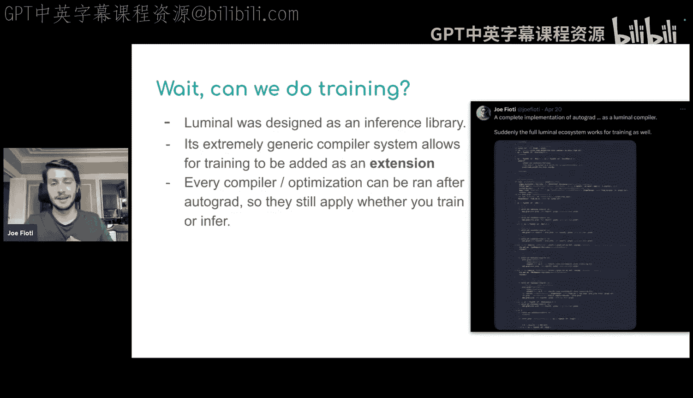

上一节我们看了基础优化，本节中我们来看一个更激动人心的案例：自动发现Flash Attention。

通过设置通用的代数重写规则（约20-30条）并进行搜索，Luminal编译器能够从朴素的注意力计算实现出发，**自动推导出Flash Attention算法**。这大约需要应用12到14个连续的重写步骤，包括循环融合、在线Softmax重写、循环交换和循环分块等。


这个过程证明了，通过系统性的搜索，编译器可以自动完成那些通常需要人类专家深度介入的、复杂的算法级优化，而不仅仅是局部代码变换。

## 扩展能力：训练与未来方向

上一节我们看到了搜索在推理优化上的威力，本节中我们看看Luminal的扩展能力。

尽管最初为推理设计，但由于其核心表示极其简单，Luminal可以轻松地通过自动微分（AutoGrad）来支持训练。其**自动微分引擎仅需约150行代码**，可以作为外部插件添加到核心库中。它通过链式法则从正向计算图派生出反向计算图，然后将正反向图融合后进行统一的编译优化。

关于未来，Luminal计划：
*   **支持更多硬件后端**：在现有CUDA、Metal、CPU支持基础上，增加对AMD、TensorRT、TPU等的支持。
*   **分布式计算**：将搜索空间扩展到包含设备间数据通信，以自动优化张量并行、流水线并行等拓扑结构。
*   **云端服务**：提供云编译和服务器端推理服务，利用其编译技术实现快速冷启动和高效执行。


## 总结


本节课中我们一起学习了Luminal，一个基于搜索的深度学习编译器。它的核心思想是通过一个极简的算子集来简化机器学习框架的复杂性，并将性能优化的重任交给一个能够自动探索巨大优化空间的搜索编译器。这种方法不仅使核心库保持小巧和可维护，还能自动发现人类专家级别的优化（如Flash Attention），为应对未来日益复杂的硬件和模型提供了有前景的解决方案。