# 11：多GPU编程入门教程

## 概述

在本节课中，我们将学习多GPU编程的基础知识。我们将从一个单GPU的示例应用出发，逐步了解如何将其扩展到多个GPU上运行。课程将介绍三种常见的编程模型或库：MPI、NCCL和NVSHMEM，并解释它们各自的适用场景、工作原理以及如何通过性能剖析来验证优化效果。我们的目标是理解应用程序的关键路径，以及不同编程模型中的延迟如何影响最终性能。

## 为什么使用多GPU？

在深入技术细节之前，我们首先需要明确使用多GPU的两个主要原因。

1.  **强扩展**：你有一个固定大小的问题，但需要更快地解决它。例如，天气预报如果在预报时间之后才得出结果就失去了意义。使用更多资源来解决同一个问题，以获得更快的速度。
2.  **弱扩展**：你的问题规模在增长，但你希望解决这个更大规模的问题时，所用时间保持不变，或者你只是需要更多的内存等资源。

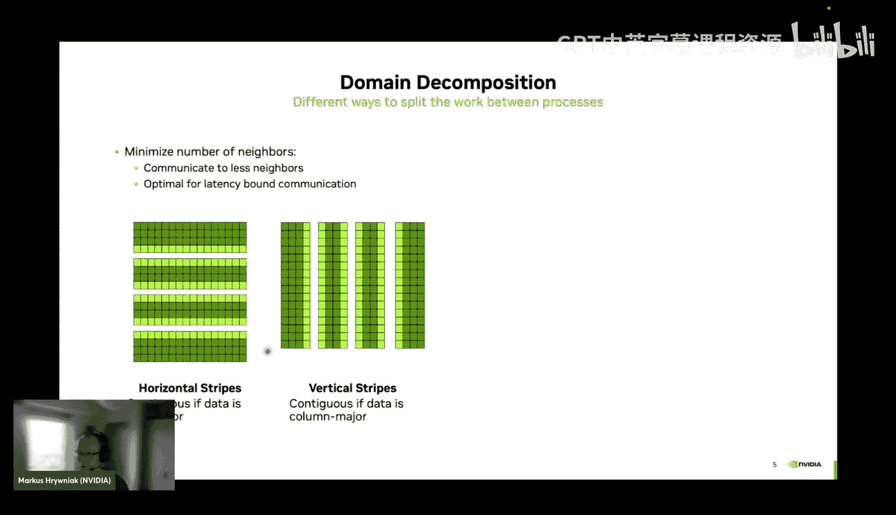

此外，一个更实际的原因是，当今的系统规模庞大且日益增长，通常配备多个GPU。为了高效利用这些并行系统，你的代码必须具备并行能力。

## 示例应用：Jacobi求解器

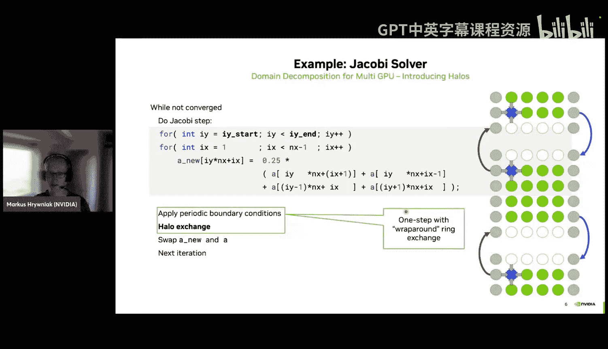

为了理解这些编程模型，我们需要一个具体的例子。我们将使用一个求解二维拉普拉斯方程的Jacobi求解器。

**公式**：
`∇²u = 0` （在特定域上，并带有边界条件）

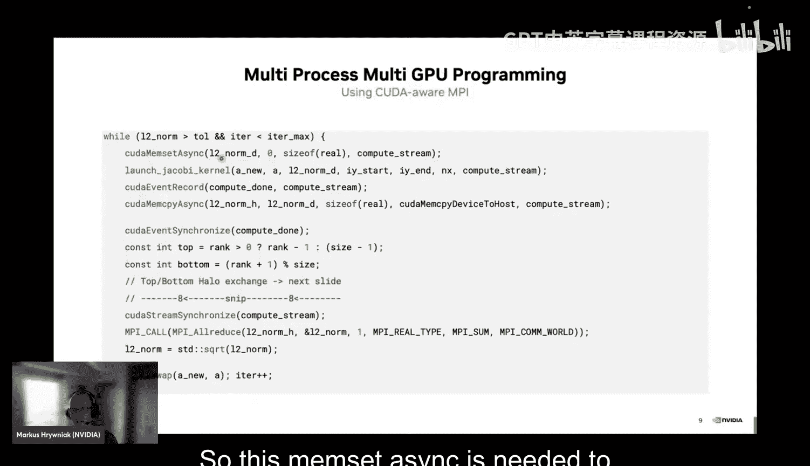

我们有一个二维计算域，其左右边界采用狄利克雷边界条件（固定值），上下边界采用周期性边界条件（可以想象成圆柱体的表面）。核心求解算法是一个迭代过程，每次迭代中，网格中每个点的新值由其上下左右四个邻居点的平均值更新。

**核心计算代码（单GPU）**：
```c
for (int iy = iy_start; iy < iy_end; iy++) {
    for (int ix = ix_start; ix < ix_end; ix++) {
        u_next[iy * NX + ix] = 0.25f * (u_curr[iy * NX + (ix+1)] +
                                         u_curr[iy * NX + (ix-1)] +
                                         u_curr[(iy+1) * NX + ix] +
                                         u_curr[(iy-1) * NX + ix]);
    }
}
```
代码循环遍历整个计算域，根据四个邻居更新每个点的值，然后交换新旧缓冲区，检查收敛性，并进入下一次迭代。

## 扩展到多GPU：域分解

要将计算扩展到多个GPU，我们需要进行**域分解**。这意味着将整个模拟域分割成多个块，让每个GPU只计算其中的一块。

我们可以选择水平分割、垂直分割或棋盘状分割。本教程中，我们选择水平分割为条带，因为这样处理起来最简单：每行数据在内存中是连续的，便于与邻居交换数据，且需要交换的数据总量不大。

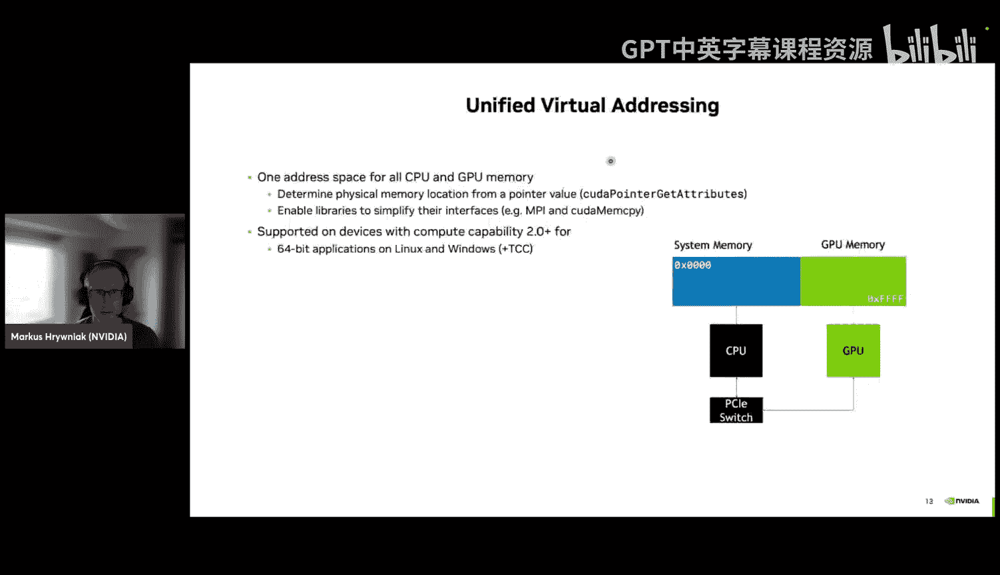

进行域分解后，每个GPU只拥有本地的一部分数据。但是，在更新边界上的点时，它需要邻居GPU上的数据。例如，一个GPU顶部边界点的更新需要其上方邻居GPU底部边界点的值。因此，我们需要在GPU之间交换这些边界数据，这个过程称为**Halo交换**。

## 编程模型一：MPI

MPI（Message Passing Interface）是一个成熟且广泛使用的标准库，用于在不同进程间交换数据。

### MPI基础

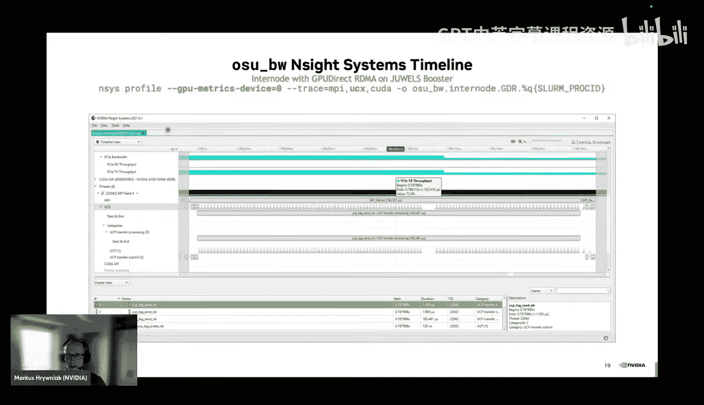

一个典型的MPI程序骨架包括初始化、获取进程标识（rank）和总数（size）、执行通信、以及最终化。

**代码示例**：
```c
#include <mpi.h>
int main(int argc, char** argv) {
    MPI_Init(&argc, &argv);
    int rank, size;
    MPI_Comm_rank(MPI_COMM_WORLD, &rank);
    MPI_Comm_size(MPI_COMM_WORLD, &size);
    // ... 你的计算和通信代码 ...
    MPI_Finalize();
    return 0;
}
```

### 在Jacobi求解器中实现Halo交换

在Jacobi求解器中，我们需要与上方和下方的邻居GPU交换一行边界数据。MPI提供了`MPI_Sendrecv`函数，它可以组合发送和接收操作，有助于避免死锁。

**Halo交换代码示例**：
```c
// 发送顶部行给上方邻居，同时从下方邻居接收数据到本地底部Halo区
MPI_Sendrecv(&u[1*NX], NX, MPI_FLOAT, top_rank, 0,
             &u[(local_ny+1)*NX], NX, MPI_FLOAT, bottom_rank, 0,
             MPI_COMM_WORLD, MPI_STATUS_IGNORE);
// 发送底部行给下方邻居，同时从上方邻居接收数据到本地顶部Halo区
MPI_Sendrecv(&u[local_ny*NX], NX, MPI_FLOAT, bottom_rank, 1,
             &u[0], NX, MPI_FLOAT, top_rank, 1,
             MPI_COMM_WORLD, MPI_STATUS_IGNORE);
```
这段代码从当前进程的角度，完成了与两个邻居的双向数据交换。

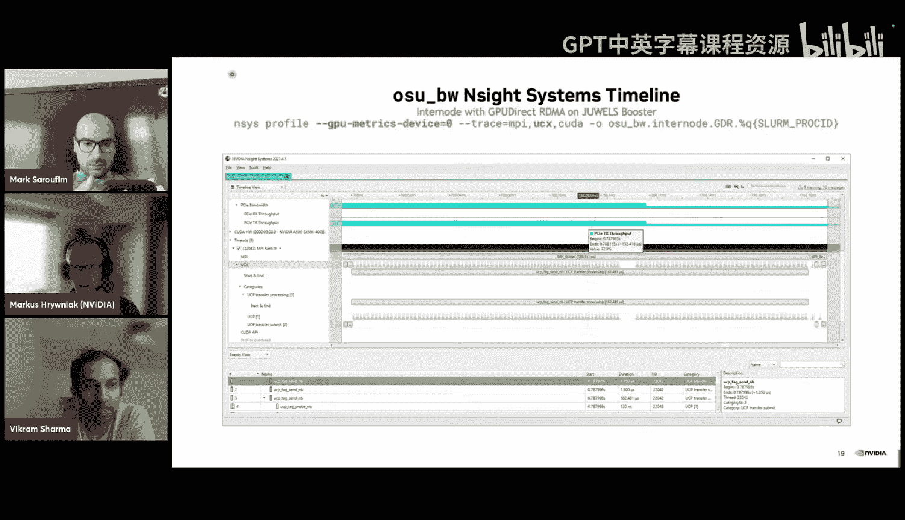

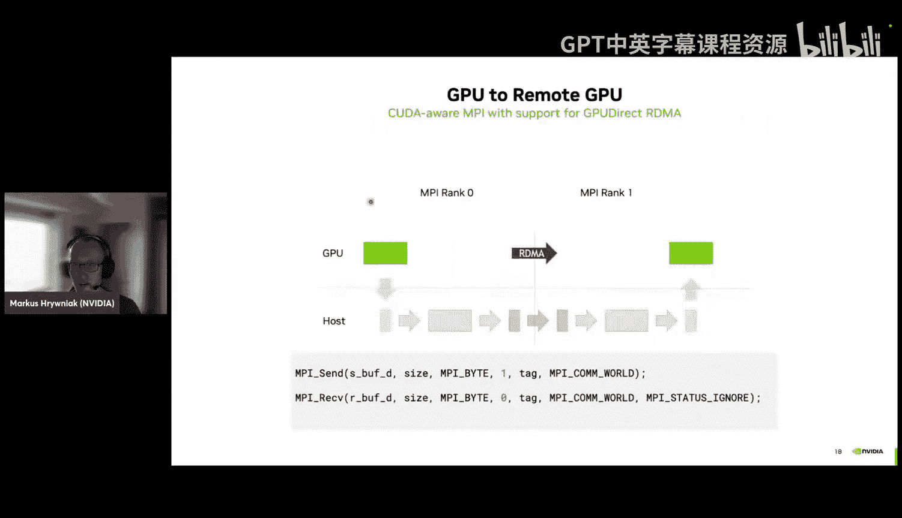

### GPU Direct 技术

现代MPI实现（如CUDA-aware MPI）支持**GPU Direct**技术。这意味着当MPI函数接收到一个GPU内存指针时，它能识别出来，并可能启用以下优化：
*   **GPU Direct Peer-to-Peer (P2P)**：在同一节点内的多个GPU之间，通过NVLink直接传输数据，无需经过CPU内存。
*   **GPU Direct RDMA**：在网络节点之间，网络卡（如InfiniBand）可以直接读写GPU内存，实现远程直接内存访问。

这些技术能显著降低通信延迟，提高带宽利用率。在性能剖析工具中，你可以看到数据通过PCIe或NVLink直接传输，而没有额外的内存拷贝内核。

### 进程启动配置

通常，我们采用**一个MPI进程对应一个GPU**的配置。这样管理起来最简单，也能最好地配合GPU Direct技术。使用`mpirun`或集群作业调度系统（如Slurm）可以方便地启动相应数量的进程。

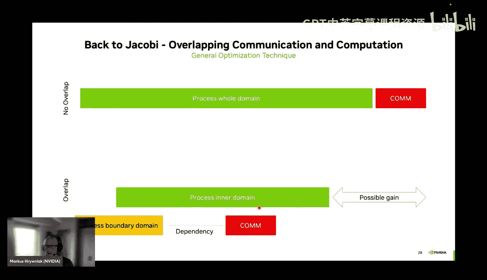

## 优化技术：计算与通信重叠

在基础的MPI实现中，通信操作（Halo交换）发生在计算内核完成之后，这会导致GPU在通信期间空闲，降低了并行效率。

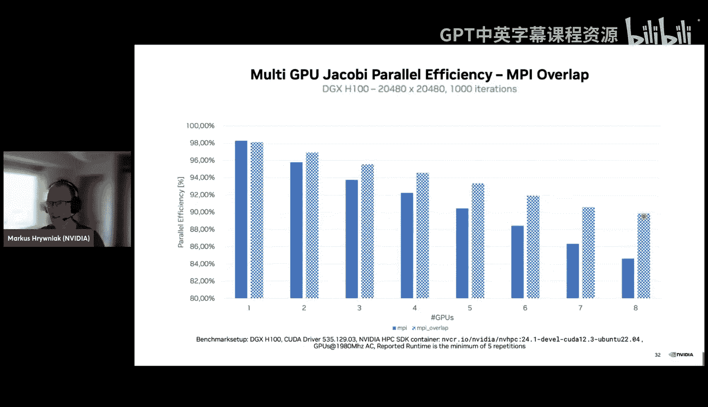

我们可以通过**计算与通信重叠**来优化。思路是：由于内部点的计算不需要边界数据，我们可以将一次内核启动拆分为三次：
1.  计算顶部边界行。
2.  计算底部边界行。
3.  计算内部区域。

我们为边界计算和内部计算使用不同的CUDA流（Stream）。在边界计算完成后，即可开始Halo交换，而此时内部区域的计算仍在另一个流上继续。这样就隐藏了部分通信时间。

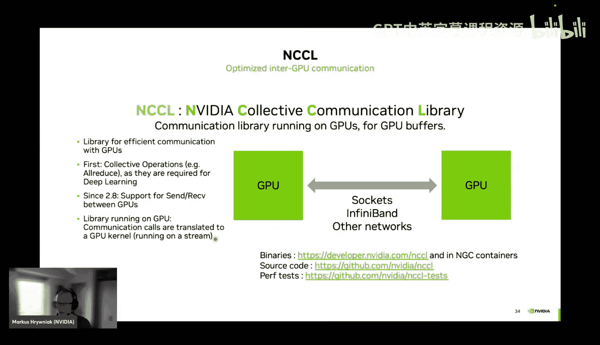

**性能提升**：随着使用的GPU数量增加，每个GPU的本地计算量减少，通信开销占比增大。重叠技术能有效提升强扩展效率，在GPU数量较多时优势更明显。

## 编程模型二：NCCL

NCCL（NVIDIA Collective Communication Library）是NVIDIA优化的通信库，专为GPU缓冲区设计。

### NCCL 特点

*   **GPU内核通信**：NCCL使用GPU内核来执行通信操作。
*   **流感知**：NCCL调用可以指定CUDA流，从而能与计算内核在流中自动排序，减少显式的流同步。
*   **拓扑感知**：NCCL了解系统拓扑（GPU如何连接），并选择最佳的数据传输路径。
*   **操作分组**：可以将多个通信操作组合在一起，减少内核启动开销，并允许库进行更深度的优化。

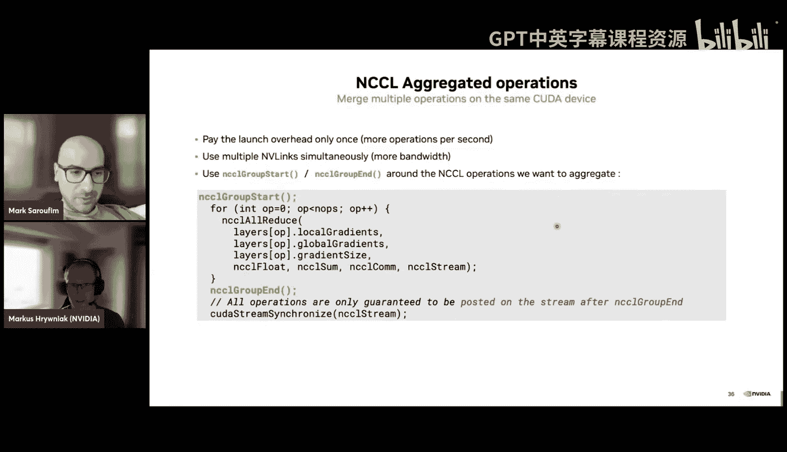

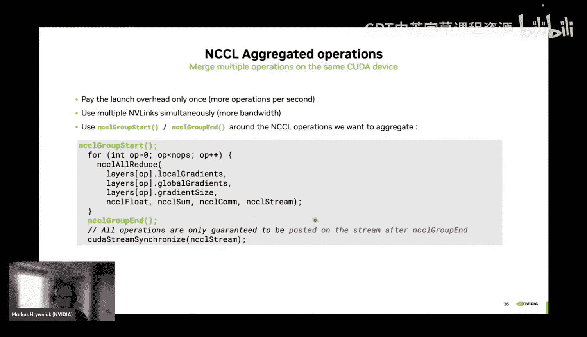

### 在Jacobi求解器中使用NCCL

我们可以用NCCL的点对点发送（`ncclSend`）和接收（`ncclRecv`）操作替换MPI的`Sendrecv`。由于NCCL操作在流上排队，我们可以移除之前需要的流同步点。

**NCCL通信示例**：
```c
ncclGroupStart();
ncclSend(&u[1*NX], NX, ncclFloat, top_rank, comm, stream);
ncclRecv(&u[(local_ny+1)*NX], NX, ncclFloat, bottom_rank, comm, stream);
ncclSend(&u[local_ny*NX], NX, ncclFloat, bottom_rank, comm, stream);
ncclRecv(&u[0], NX, ncclFloat, top_rank, comm, stream);
ncclGroupEnd();
// 不再需要显式的 streamSynchronize
```

### 进一步重叠优化

为了确保边界计算在内核计算之前完成，以便通信能尽早开始，我们可以使用**流优先级**。为负责边界计算和通信的流设置高优先级，为内部计算流设置低优先级。这样GPU调度器会优先执行高优先级流上的任务。

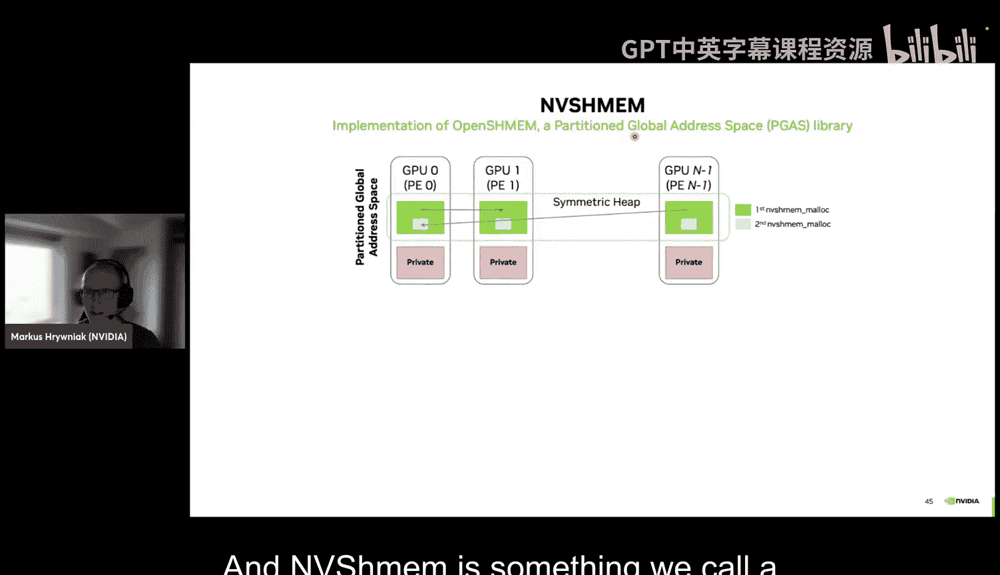

结合NCCL的流排序和流优先级，我们可以实现比MPI重叠版本更好的计算与通信重叠效果。

## 编程模型三：NVSHMEM

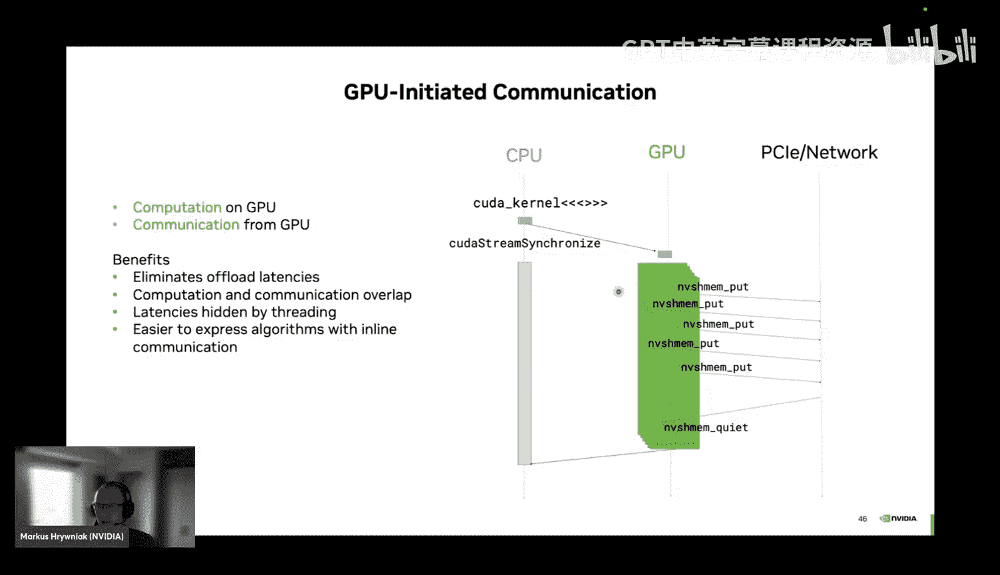

NVSHMEM是一个基于**分区全局地址空间（PGAS）**模型的库。它实现了OpenSHMEM标准。

### NVSHMEM 核心概念

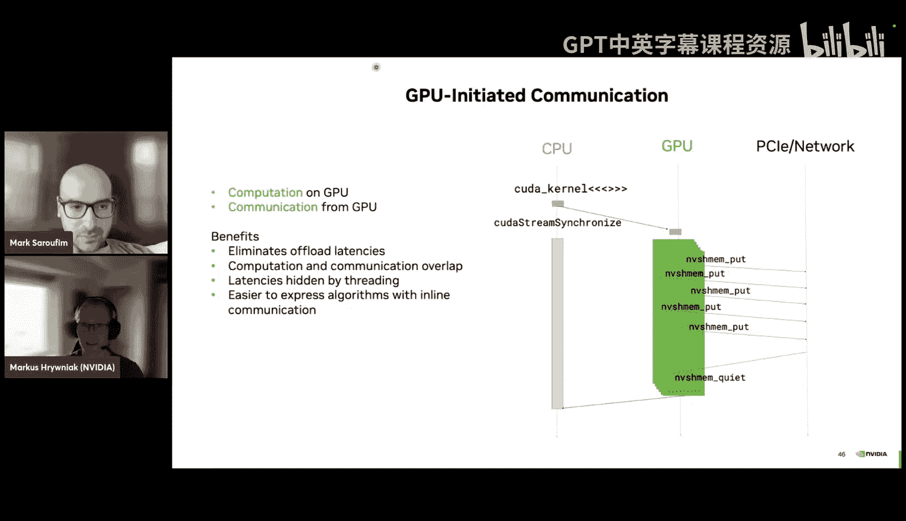

*   **对称堆**：所有处理元素（PE，相当于一个GPU进程）共享一个虚拟的、分区的全局地址空间。使用`nvshmem_malloc`分配的内存位于对称堆中，所有PE都可以直接访问。
*   **单边通信**：通信操作（如`nvshmem_float_p`）由发起方PE主动执行，目标PE无需发布匹配的接收操作。这简化了编程模型。
*   **设备端通信**：最重要的特性是，可以直接从CUDA内核内部调用NVSHMEM函数进行通信。

### 在Jacobi求解器中使用NVSHMEM

在CUDA内核中，每个处理边界点的线程可以直接使用`nvshmem_float_p`将单个浮点数`put`到邻居PE的对应内存位置。这实现了极细粒度的、与计算交织的通信。

**设备端通信代码示例**：
```c
// 在内核中，位于顶部边界的线程
if (iy == 1) { // 假设第1行是顶部边界
    nvshmem_float_p(&u_remote_top[ix], u_local[iy*NX + ix], top_pe);
}
// 位于底部边界的线程
if (iy == local_ny) { // 假设最后一行是底部边界
    nvshmem_float_p(&u_remote_bottom[ix], u_local[iy*NX + ix], bottom_pe);
}
```

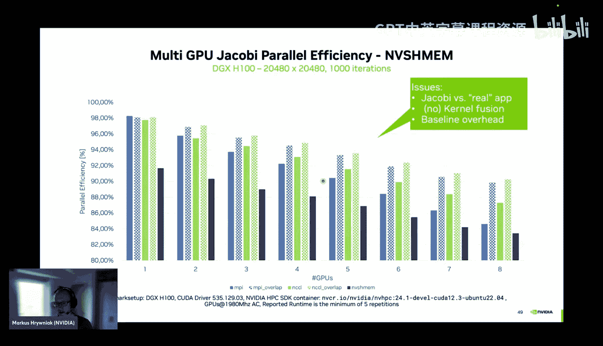

### 通信模式与内核融合

NVSHMEM支持多种粒度的设备端通信：
*   **单元素Put**：每个线程传输一个数据元素。适合NVLink等低延迟互连。
*   **块级Put**：线程块协作传输一批数据。适合InfiniBand等需要较大消息以获得高带宽的网络。
*   **完全融合的内核**：将整个求解循环（包括计算、通信和迭代控制）全部放入一个巨大的内核中。这需要在内核内实现PE间的同步（例如，使用`nvshmem_int_atomic_add`操作计数器）。这种方式完全消除了多次内核启动的开销，对于需要强扩展至非常多GPU的应用潜力巨大。

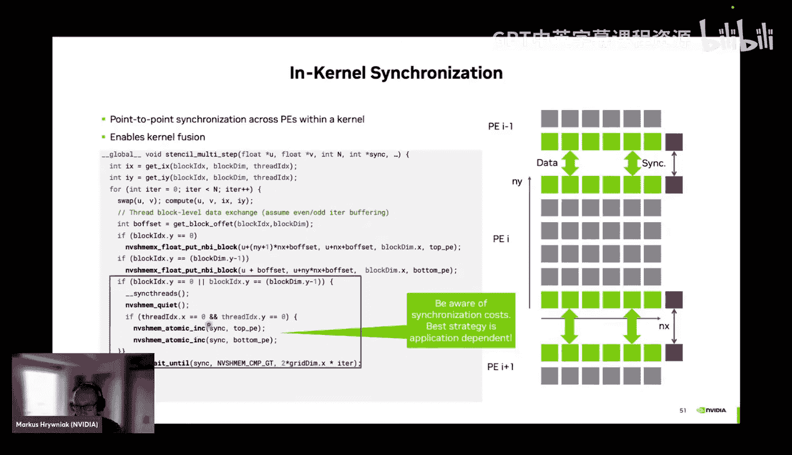

**应用案例**：量子色动力学代码QUDA通过使用NVSHMEM将多个内核融合为一个，在512个GPU上相比MPI实现获得了约1.6倍的性能提升。

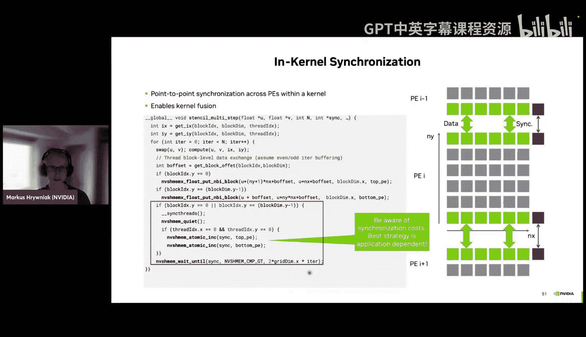

## 编程模型对比与选择

以下是三种编程模型的简要对比：

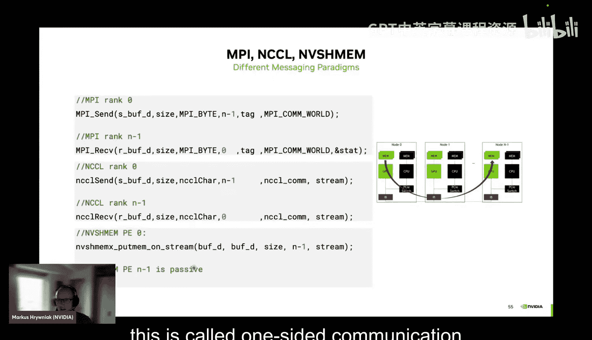

| 特性 | MPI | NCCL | NVSHMEM |
| :--- | :--- | :--- | :--- |
| **通信模型** | 双边（发送/接收需匹配） | 双边 | **单边**（Put/Get） |
| **缓冲区支持** | 主机和设备（CUDA-aware） | **仅设备** | 对称堆（设备） |
| **流/排序** | 无直接流参数 | **有流参数**，可排序 | 设备端调用与内核代码交织 |
| **关键优势** | 标准、通用、支持CPU/GPU | 高性能集合操作、流感知、拓扑优化 | **设备端通信**、简化算法、支持内核融合 |
| **典型使用场景** | 已有CPU MPI代码迁移；通用跨节点通信 | 需要流排序和重叠；高性能集合操作（如All-Reduce） | 需要极细粒度或与计算紧密交织的通信；希望减少内核启动开销 |

**如何选择**：
*   **从MPI开始**：如果你的代码已有CPU上的MPI实现，迁移到CUDA-aware MPI是最直接的路径。
*   **需要流排序和重叠**：选择NCCL，它可以简化同步，并获得更好的计算通信重叠。
*   **需要设备端通信或单边模型**：考虑NVSHMEM，特别是当你的算法能从内核内部的细粒度通信或内核融合中受益时。

重要的是，这些库可以**互操作**。例如，你可以用MPI进行进程启动和粗粒度通信，同时用NCCL进行GPU间的集合操作，或者在关键内核中使用NVSHMEM。选择取决于你的具体应用需求和性能瓶颈。

## 总结

本节课我们一起学习了多GPU编程的基础。我们从单GPU的Jacobi求解器出发，探讨了通过域分解将其扩展到多GPU时面临的挑战，即Halo交换。

我们深入介绍了三种主流的编程模型：
1.  **MPI**：成熟的标准，支持GPU Direct技术（如P2P和RDMA）以实现高效通信。优化时需注意计算与通信的重叠。
2.  **NCCL**：NVIDIA优化的GPU通信库，支持流感知和操作分组，能更好地与CUDA计算集成，简化重叠优化。
3.  **NVSHMEM**：基于PGAS模型的单边通信库，支持直接从CUDA内核发起通信，为实现内核融合和极细粒度通信提供了可能。

每种模型都有其适用场景，并且可以结合使用。理解应用程序的通信模式、关键路径以及对延迟和带宽的需求，是选择合适工具并进行有效优化的关键。

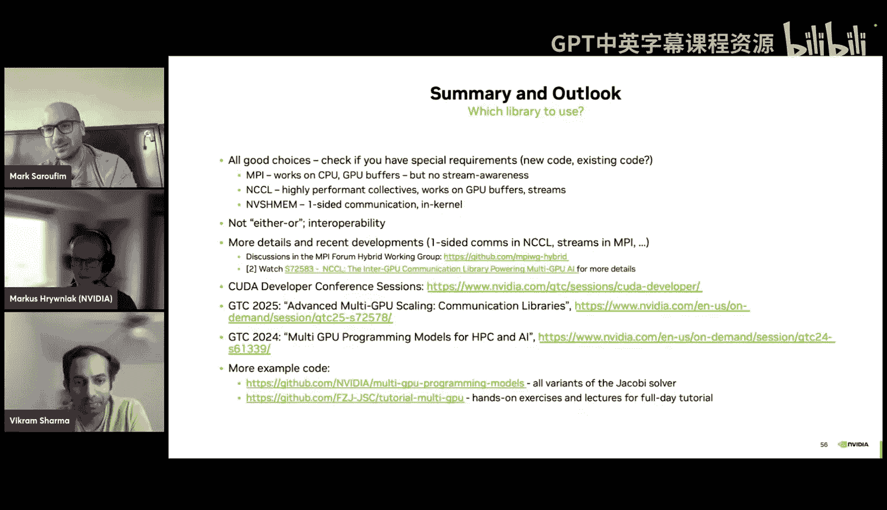

为了进一步实践，你可以访问 [多GPU编程模型GitHub仓库](https://github.com/NVIDIA/multi-gpu-programming-models)，其中包含了使用不同模型实现的完整Jacobi求解器代码，供你学习和实验。