# 12：邻域注意力机制 🧠

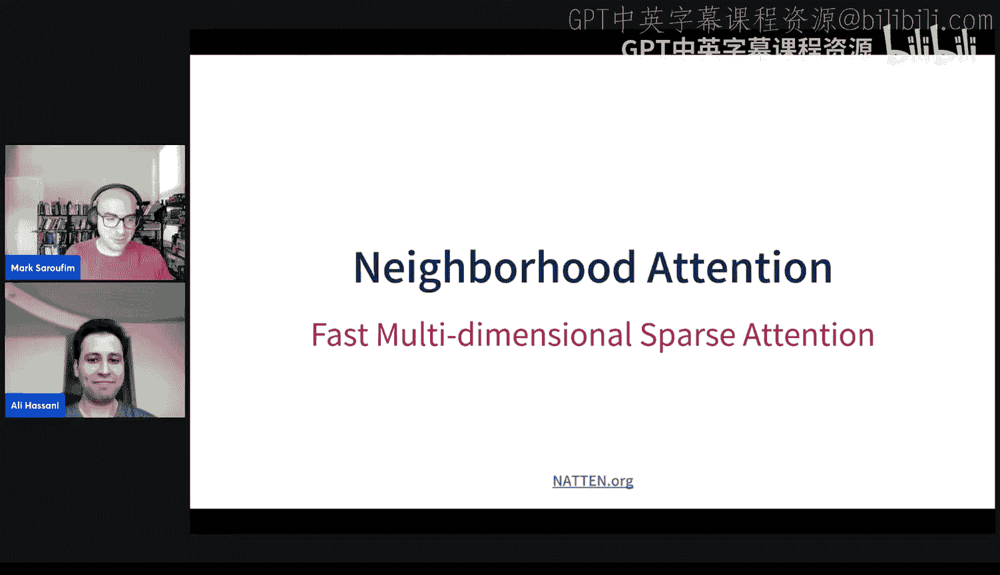

## 概述

在本节课中，我们将要学习一种称为“邻域注意力”的稀疏注意力机制。注意力机制是现代基础模型的核心，但其二次复杂度在处理大量令牌（如高分辨率图像或长视频）时可能成为性能瓶颈。邻域注意力通过将每个查询的注意力窗口局部化到其周围邻域，旨在降低计算复杂度，同时保持模型性能。我们将从概念、实现挑战、优化策略以及实际应用等多个角度来探讨这一主题。

---

## 什么是注意力？

注意力是一种在两个令牌集合（查询集和上下文集）上进行的操作。在自注意力中，查询集和上下文集是相同的，我们只是将它们投影到不同的空间（Q, K, V）。无论查询令牌位于何处，它都会关注整个上下文。在二维视觉任务中，这可以看作是一个18x18的网格，每个查询都关注整个网格。

**核心公式**：
`Attention(Q, K, V) = softmax(QK^T / sqrt(d_k)) V`

---

## 从自注意力到邻域注意力

上一节我们介绍了标准的全局自注意力。本节中我们来看看如何通过引入空间局部性来降低其计算复杂度。

如果我们希望将注意力局部化，可以利用空间位置信息。我们可以将自注意力视为一种局部注意力，但其窗口大小是整个输入。通过逐渐减小这个窗口，我们便得到了**邻域注意力**。

在邻域注意力中，对于每个查询令牌，我们将其上下文窗口限制在其周围的一个局部邻域内。窗口大小由用户定义，越小则计算量越少。极端情况下，当窗口大小为1x1时，注意力退化为线性投影，因为单个元素的softmax结果总是1。

**核心概念**：
- **窗口大小**：定义了每个查询可以“看到”的邻域范围。
- **局部化**：将计算从 `O(N^2)` 降低到 `O(N * window_size)`。

---

## 为什么需要稀疏注意力？

注意力操作是大多数基础模型的核心。由于其二次复杂度，在处理大量令牌时（例如图像/视频生成模型的预填充阶段或去噪扩散模型），注意力可能占据超过50%的端到端推理时间。因此，优化注意力计算对于提升大模型效率至关重要。

稀疏注意力通过跳过计算某些注意力权重来减少计算量。邻域注意力是实现稀疏性的一种方式，它利用了数据在空间上的局部性。

---

## 实现挑战：从密集到稀疏

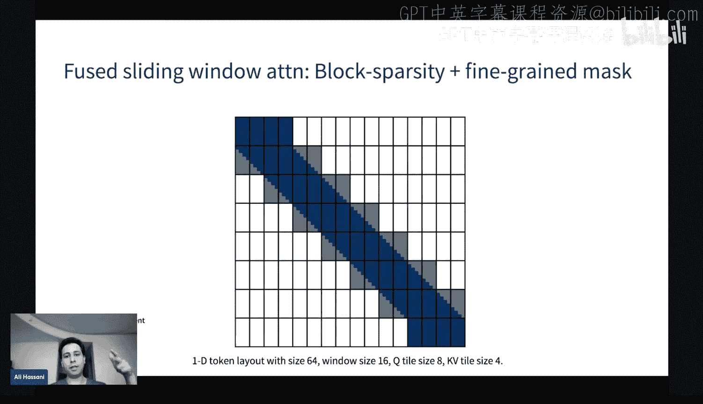

上一节我们了解了邻域注意力的动机。本节中我们来看看将其高效实现所面临的挑战。

标准的注意力实现依赖于密集的矩阵乘法，这能很好地利用现代AI加速器的专用硬件。然而，邻域注意力不再是纯粹的矩阵乘法问题，而更接近于向量-矩阵乘法，这可能导致硬件利用率下降。

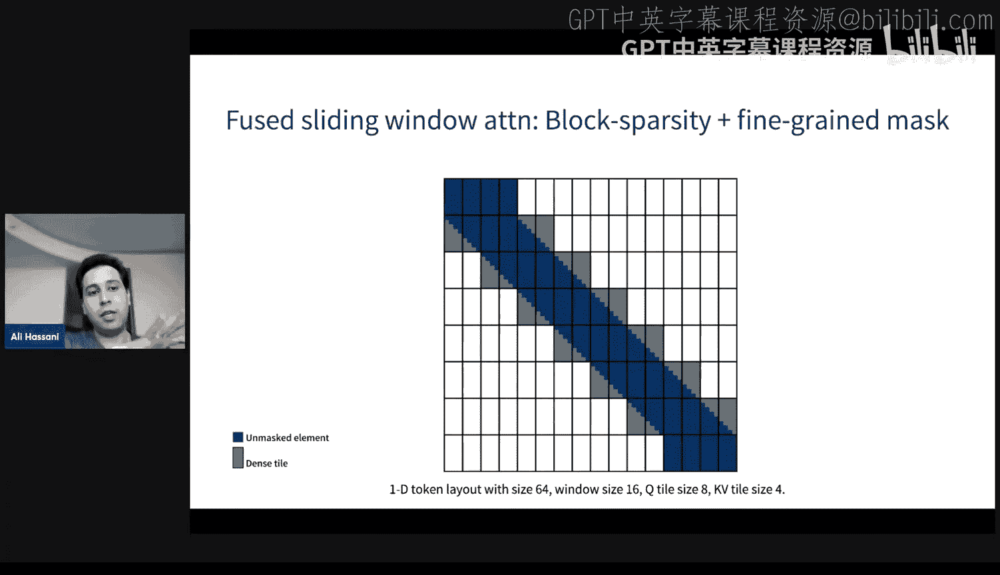

最初的实现尝试需要从头编写CUDA内核。虽然可以使用注意力掩码来实现稀疏性，但如果不进行内核融合，就无法真正节省内存和计算。

一个更大的问题是，邻域注意力失去了全局上下文信息。为了解决这个问题，我们引入了**膨胀**机制。

---

## 引入膨胀以获取全局上下文

膨胀机制借鉴了卷积神经网络的思想。在邻域注意力中引入膨胀，允许查询在跨越更大步长的位置收集信息，从而在不增加窗口大小（即不增加计算成本）的情况下，获得更广阔的“视野”。

与卷积不同，膨胀的邻域注意力不需要进行与膨胀因子成比例的填充，这得益于注意力操作与卷积的本质区别。

**实现技巧**：膨胀的邻域注意力可以通过对输入进行预分区来实现，将额外的维度移到批处理维度，从而转化为一个批处理更大但问题规模更小的标准邻域注意力问题，这通常能带来更好的并行性和速度。

---

## 现有方法：分块注意力

在邻域注意力之前，一种流行的局部注意力实现是**分块注意力**。它将输入分割成连续的块，然后在每个块内独立进行自注意力。

以下是分块注意力的主要特点：
- **易于实现**：只需在PyTorch中进行张量分区和重塑，无需修改底层注意力内核。
- **保持密集计算**：每个块内仍是密集的矩阵乘法。
- **潜在缺点**：可能破坏平移等变性，导致在某些任务上性能低于滑动窗口（邻域）注意力。

---

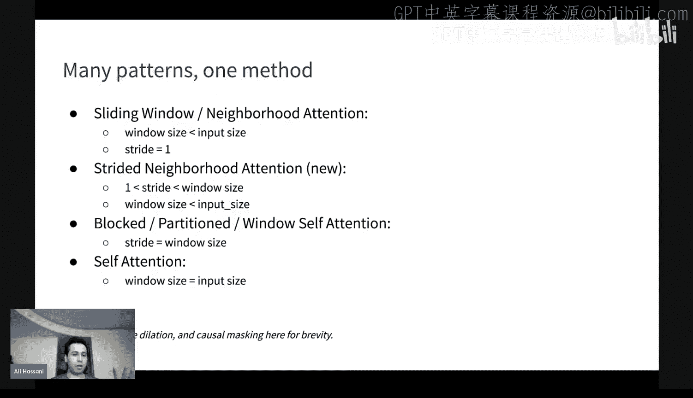

## 内核级实现：融合稀疏注意力

为了真正获得性能提升，我们需要在内核级别支持稀疏性。这通常通过**块稀疏性**技术实现。

在融合注意力内核（如FlashAttention）中，计算是分块进行的。如果能够提前预测哪些块完全被注意力掩码覆盖（即不包含任何有效的点积），就可以跳过加载这些块的K和V值，从而节省计算和内存访问。

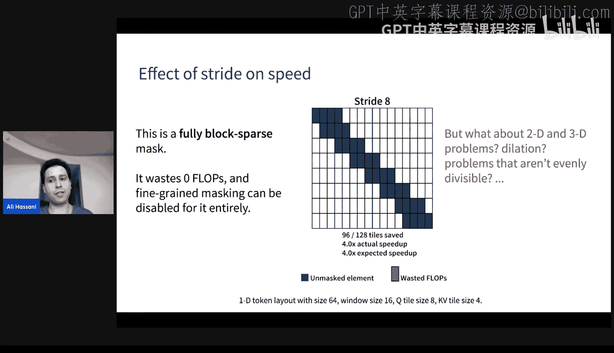

**块稀疏性的工作原理**：
1.  外层循环遍历查询块。
2.  内层循环遍历键值块。
3.  如果根据掩码判断某个键值块完全不需要，则跳过该次迭代。

对于分块注意力，其块稀疏掩码仅在对角线上有值，因此甚至可以不需要修改内核，只需通过张量变换将问题转化为并行的小规模自注意力即可。然而，对于像邻域注意力这样的滑动窗口模式，其掩码模式更复杂，必须修改内核以支持非对角的块访问。

---

## 多维度的挑战与FNA方法

上一节我们讨论了在1D序列上实现稀疏注意力的通用方法。本节中我们来看看当问题扩展到2D或3D时（如图像、视频）带来的独特挑战。

在1D中，平铺（Tiling）是线性的。但在2D或3D中，如果仍然使用1D的平铺策略，可能会加载大量在空间上相距很远但在内存中相邻的令牌，导致计算浪费。这被称为“多维度的诅咒”。

**FNA的解决方案**：
我们的“快速邻域注意力”方法对内核进行了几项关键修改：

1.  **多维平铺**：将内核的平铺尺寸重新解释为多维形状（例如，将64解释为8x8），使得加载的Q和KV块在空间上保持局部性。
2.  **动态KV平铺**：不是平铺整个上下文，而是根据每个查询块的位置，动态地裁剪出其感兴趣的KV区域再进行平铺，避免了加载无关的块。
3.  **细粒度掩码**：在内核的softmax/掩码阶段，根据邻域注意力的公式计算每个Q-K对是否需要被掩码。

然而，FNA内核基于较旧的xFormers FMHA内核构建，其性能上限可能不如最新的FlashAttention。此外，软件中的多维平铺和细粒度掩码会引入显著的指令开销。

---

## 广义邻域注意力与步长参数

为了在性能和模型质量（如平移等变性）之间取得更好的权衡，我们引入了**步长**参数，形成了**广义邻域注意力**。

步长的作用类似于卷积中的步长。它将空间上相邻的查询分组，组内的所有查询共享同一个注意力窗口。这相当于在滑动窗口中引入了“跳跃”。

**步长的影响**：
- **步长=1**：标准的邻域注意力，每个查询有自己的窗口。
- **步长增大**：查询被分组，计算更粗粒度，可能节省更多计算（实现更高的块稀疏度），但可能损失一些局部细节建模能力。
- **步长=窗口大小**：退化为非重叠的**分块注意力**。

因此，广义邻域注意力统一了从滑动窗口（邻域注意力）到非重叠窗口（分块注意力）的整个谱系，允许用户通过调整步长来精确控制效率与精度的权衡。

---

## 性能分析与NAttn模拟器

面对如此多的参数（窗口大小、步长、膨胀、输入尺寸等），手动评估每种配置的性能潜力是困难的。为此，我们开发了**NAttn模拟器**。

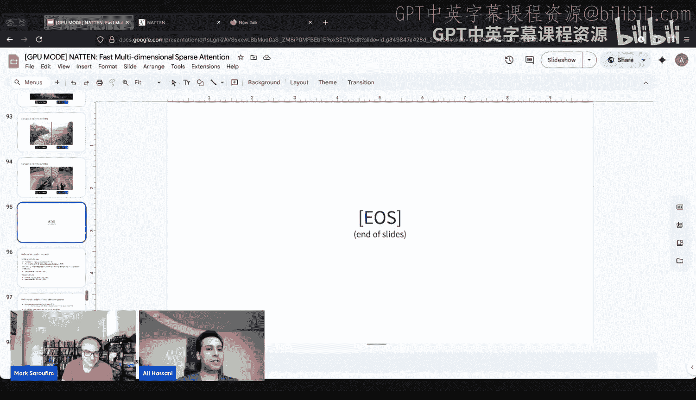

该模拟器是一个分析工具，它接受用户的使用场景参数（张量形状、注意力模式参数）和内核设计选择（平铺尺寸等）。它不实际运行内核，而是通过分析计算每个查询块需要访问的KV块数量。

**模拟器的用途**：
- **预测速度提升**：通过统计需要访问的块数，可以估算相对于全自注意力的理论速度提升（基于块稀疏度，而非FLOPs）。
- **指导参数选择**：例如，可以扫描所有可能的步长值，找出能达到完全块稀疏性（零计算浪费）的最小步长，从而在保持一定模型质量的前提下获得最佳性能。
- **降低开发成本**：在投入时间编写新内核之前，可以先评估其潜在收益。

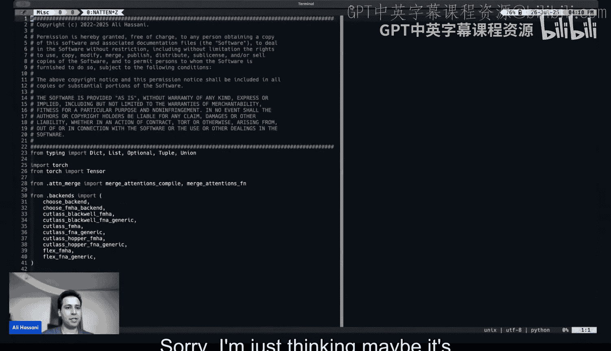

---

## 新一代内核：Hopper与Blackwell上的FNA

为了在最新的Hopper和Blackwell GPU架构上获得最佳性能，我们重新设计了FNA内核，采用了**令牌置换**策略。

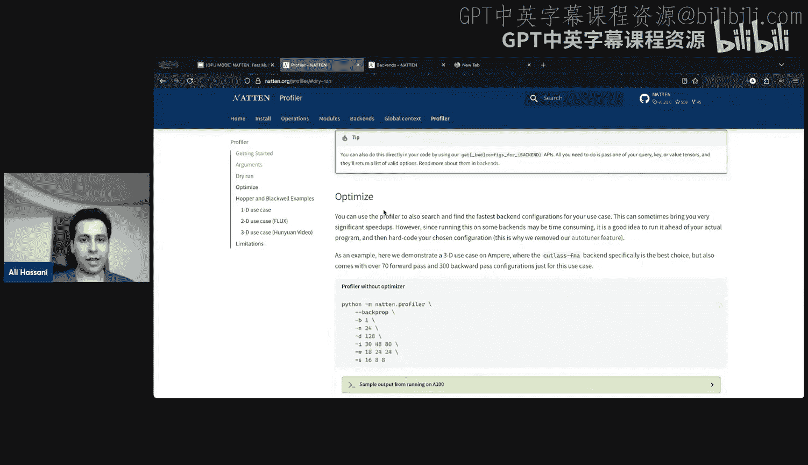

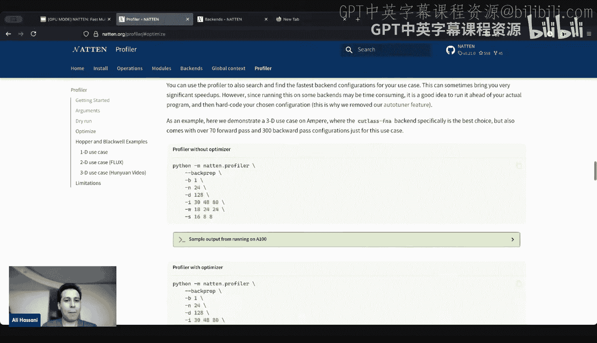

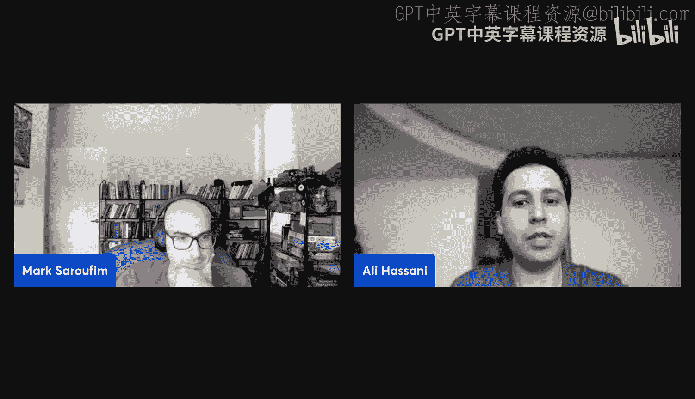

**核心思想**：在运行注意力内核之前，先通过一个内存拷贝操作，对输入令牌进行重新排列（置换），使得在内存中连续的令牌在空间上也连续。这样，注意力内核内部就无需处理复杂的多维平铺逻辑，可以像处理1D问题一样工作，大大简化了内核设计。

**优点**：
- **内核简化**：注意力内核只需支持块稀疏性和细粒度掩码，无需处理多维平铺的复杂性。
- **开销可控**：置换操作只是一个内存拷贝，在Blackwell等高性能GPU上，其耗时可能仅占整个注意力计算的很小一部分（例如1%）。
- **性能提升**：在许多情况下，可以接近理论上的块稀疏速度提升。

**注意事项**：置换/逆置换操作在某些模型架构中可能只需在开始和结束时各执行一次，从而进一步分摊开销。

---

## 实际应用与性能结果

我们将广义邻域注意力应用于视频生成模型（如Cosmos和Hounian）。通过结合局部和膨胀的注意力模式，并在训练中引入稀疏性，我们取得了显著的效果。

**以Cosmos模型为例**：
1.  **分析阶段**：在预训练的全自注意力模型上，测量不同稀疏注意力模式在各层引入的误差。
2.  **选择策略**：为每层选择误差低于阈值且稀疏度最高的模式。
3.  **微调训练**：以稀疏配置恢复训练，模型能快速恢复损失的精度。

**结果**：
- 在2B参数模型上，实现了**1.9倍至2.6倍**的端到端速度提升。
- 在14B参数模型上，实现了**1.7倍至2.1倍**的速度提升。
- 视觉质量在多数样本和基准测试中得以保持。

这表明，通过精心设计的稀疏模式和适当的训练，可以在保持模型质量的同时，获得显著的推理加速。

---

## NAttn工具库简介

我们提供了开源的`natten`库来支持邻域注意力的研究和应用。

**主要功能**：
- **多种算子**：提供1D、2D、3D的邻域注意力函数和PyTorch模块。
- **灵活配置**：支持设置核大小、步长、膨胀、因果掩码等参数。
- **多后端支持**：
    - `CUDA`：基于cuDNN、FlashAttention的高性能后端。
    - `FNA`：我们自研的融合邻域注意力内核（支持旧架构）。
    - `FMHA (Cutlass)`：针对Hopper/Blackwell优化的新内核。
    - `FlexAttention`：实验性后端（支持动态稀疏模式）。
- **性能分析工具**：内置分析器，可自动为给定问题选择最佳后端和配置。

**使用示例**（通过分析器）：
```bash
# 分析特定配置下的性能
python -m natten.profile --shape 30 48 80 --kernel-size 18 24 24 --stride 16 8 8 --backend fmha_blackwell
```

---

## 总结

本节课中我们一起学习了邻域注意力机制。我们从标准自注意力出发，探讨了其计算瓶颈，并引出了通过局部化来实现稀疏化的思想。我们详细介绍了邻域注意力的定义、其与膨胀结合以获取全局信息的方法，以及它与分块注意力的区别。

在实现层面，我们深入探讨了在内核中支持稀疏性的技术（块稀疏性、细粒度掩码），以及处理多维数据时面临的挑战和解决方案（多维平铺、动态平铺）。为了平衡效率与模型质量，我们引入了广义邻域注意力，通过步长参数统一了滑动窗口与分块模式。

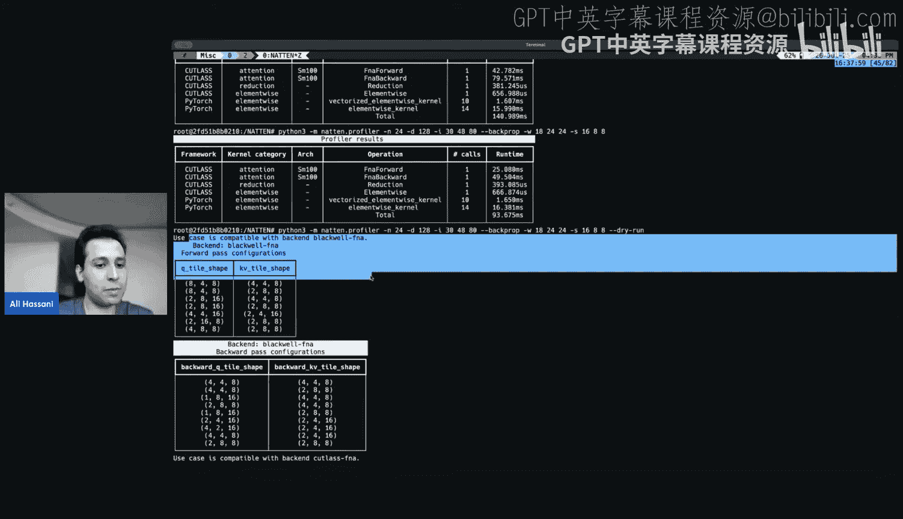

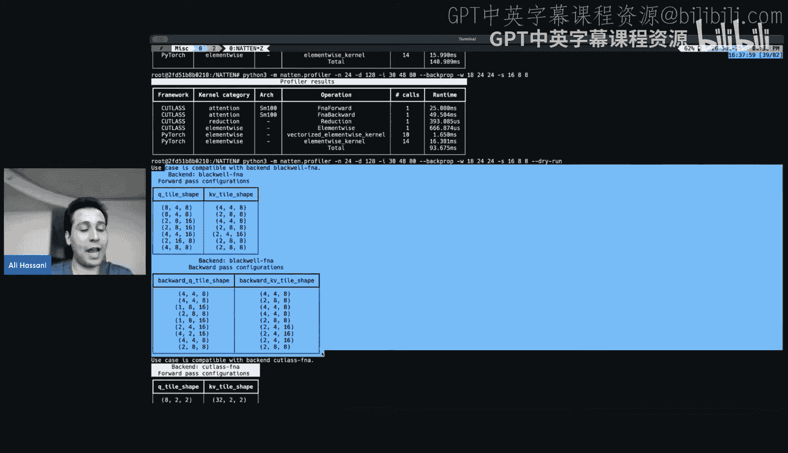

我们还介绍了用于性能预测的NAttn模拟器，以及为新一代GPU架构设计的高效内核（采用令牌置换策略）。最后，通过在实际视频生成模型上的应用案例，我们展示了邻域注意力能够带来显著的端到端加速，同时保持模型质量。

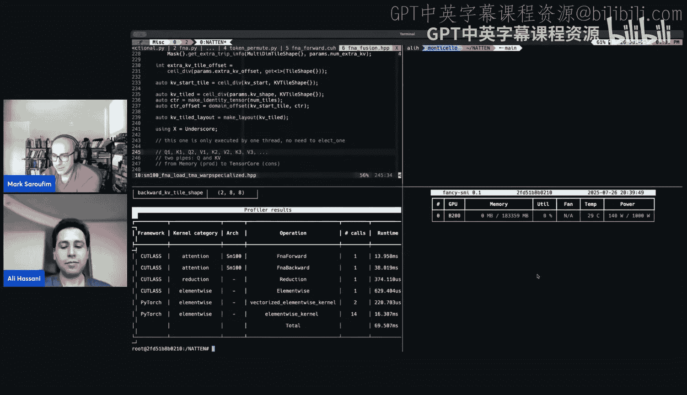

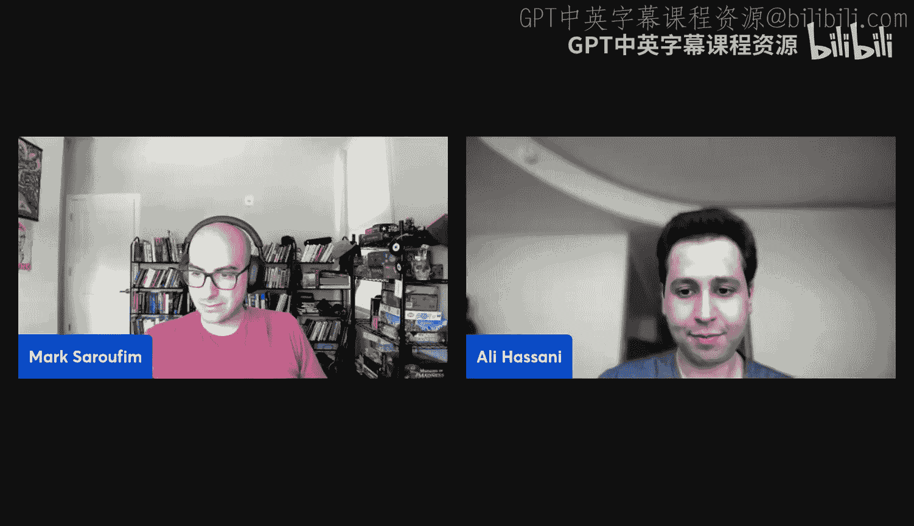

邻域注意力及其广义形式为高效Transformer模型的设计提供了强大的工具，特别是在视觉、视频等具有强空间局部性的领域。