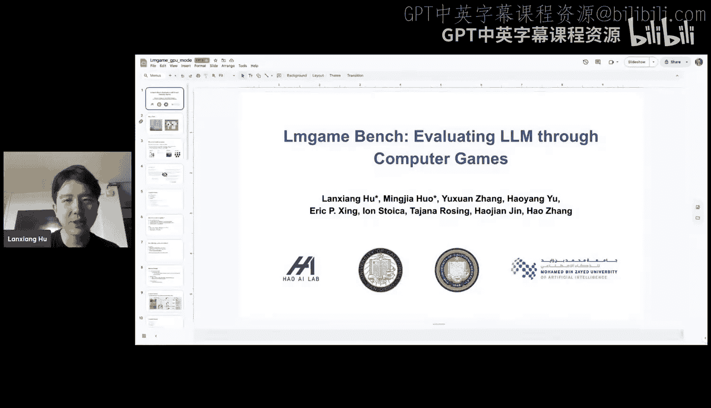
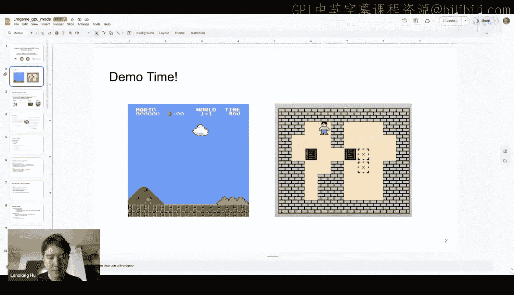
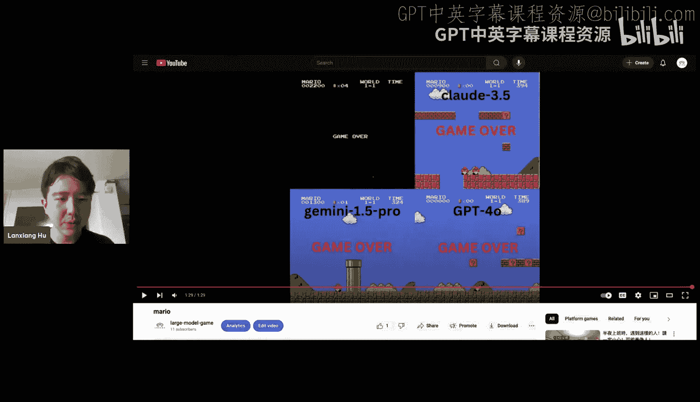
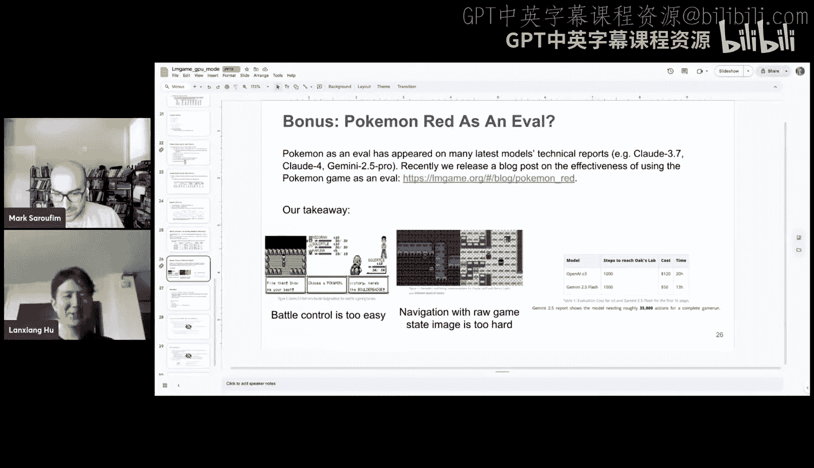

#  13：引言与概述

在本节课中，我们将要学习如何利用经典电子游戏环境来评估和训练大型语言模型。我们将探讨为什么游戏是一个有价值的评估平台，以及如何设计一个有效的“游戏测试框架”来克服模型在游戏中的固有弱点。

欢迎来到新一期的GPU MODE。今天，我们很高兴邀请到来自加州大学圣地亚哥分校Haal实验室的Ln Shanghu，他将与我们分享一个相当不同的项目——关于“Alum Game benchch”，即通过电脑游戏来评估AI模型。

虽然这不像典型的“让GPU更快”的演讲，但如果你从事机器学习系统工作，这些话题具有普遍的相关性。我们迫不及待地想听听他的分享。谢谢Ella Chang的介绍。

谢谢Mark的亲切介绍。大家好，我是Ln Xianghu，来自加州大学圣地亚哥分校的二年级博士生。我的研究方向是大规模机器学习工作流的效率问题，以及为AI模型评估带来新的视角。今天，我将分享我们最近关于如何通过游戏评估和训练LLM的工作，以及为什么我们认为游戏环境很重要。

---

#  课程名称：GPU编程与AI评估新视角：章节编号：2：章节名称：游戏作为评估平台的动机

上一节我们介绍了课程主题，本节中我们来看看为什么选择游戏作为AI模型的评估环境。

在过去的几个月里，我们一直在“回收利用”许多传统的经典游戏环境，并将其用于AI评估，并得到了一些有趣的结果。我们或许可以先看几个演示，了解为何使用游戏环境进行评估，以及在此过程中学到的一些经验。

**演示：马里奥游戏中的模型对比**
这是一个使用马里奥游戏进行不同模型对比的例子。如图所示，Claude 3.7赢得了游戏。这项评估是在三月份进行的，反映了当时模型的水平。当时，人们普遍认为模型在数学和代码推理任务上表现很好，但使用智能体进行评估开始兴起。然而，当时还没有在游戏环境中评估模型的工作。

游戏对人类来说是非常直观且相对简单的任务，我们小时候都玩过游戏。但模型在游戏环境中的表现如何呢？实际上，结果令人惊讶。例如，GPT-4o在游戏中很快就失败了，Claude 3.4和3.7也没有坚持多久。虽然GPT-1.5表现稍好，但仍存在巨大差距。

这引出了一个更高层次的问题：我们为什么要研究游戏？在LLM时代之前，强化学习训练已经使用了大量环境，但并非针对LLM，而是针对传统的RL智能体，如深度Q学习。在过去，人们大量使用游戏环境，例如OpenAI Gymnasium和Stable Retro等代码库，它们“回收”了许多经典游戏。

以下是游戏环境作为评估平台的优势：
*   **定义清晰**：游戏具有定义明确的状态、动作和可验证的奖励，便于计算奖励和优势函数以训练模型。
*   **规模庞大**：存在大量流行且为人熟知的游戏，易于扩展评估规模。

基于此动机，我们开始思考：为什么不先使用这些环境进行基准测试，看看模型表现如何？在此过程中，我们发现直接将模型放入游戏环境效果不佳，无法提供有意义的评估。因此，我们需要所谓的“测试框架设计”，我们将在后面深入探讨。

---

#  课程名称：GPU编程与AI评估新视角：章节编号：3：章节名称：游戏选择与挑战

上一节我们了解了游戏作为评估平台的优势，本节中我们来看看如何选择合适的游戏以及面临的挑战。

选择合适的游戏比想象中更难，需要满足以下条件：
*   **难度适中**：游戏难度需在不同LLM间保持适中。例如，不能选择《英雄联盟》或《Dota 2》，因为它们对当前模型来说太难了，模型缺乏良好的物理感知能力。
*   **类型多样**：游戏类型需要足够多样化。
*   **广为人知**：应使用流行游戏，使结果不仅对AI研究人员，也对普通观众易于理解。

基于以上原则，我们选择了多种类型的游戏（论文发表于五月）：
*   **解谜/棋盘游戏**：如《推箱子》、《2048》、《糖果粉碎传奇》、《俄罗斯方块》。这些游戏广为人知。
    *   《推箱子》和《2048》需要长视野规划。
    *   《糖果粉碎传奇》和《俄罗斯方块》则需要大量空间推理能力。
*   **实时动作游戏**：如《超级马里奥兄弟》。
*   **视觉小说游戏**：这类游戏文本量重，类似于侦探解谜游戏，需要与多个角色互动。例如游戏《逆转裁判》。

然而，如果直接将LLM“开箱即用”地放入游戏环境，它们通常表现不佳，主要原因有三点：
1.  **视觉感知能力弱**：模型容易混淆图像元素。
2.  **延迟高**：许多推理模型响应延迟长。在实时游戏中，等模型响应后，游戏可能已经结束了。
3.  **重复性错误**：模型因缺乏记忆机制而反复犯同样的错误。

因此，为了有效区分模型能力，在游戏环境中评估模型需要一个智能体工作流程，这就是我们所说的“游戏测试框架”。

---

#  课程名称：GPU编程与AI评估新视角：章节编号：4：章节名称：游戏测试框架设计

上一节我们讨论了直接评估的挑战，本节中我们来看看为解决这些问题而设计的模块化游戏测试框架。

我们以模块化的方式设计了一个游戏测试框架，以便研究不同组件如何影响模型的游戏性能。该框架包含三个主要组件：

**1. 视觉感知模块**
此模块用于解决视觉感知弱的问题。它通过从游戏后端读取状态，或查询另一个视觉语言模型，将图像元素转换为文本描述。例如，在《推箱子》游戏中，模型可能将墙误认为箱子。提供真实游戏状态或使用VLM提取元素可以缓解此问题。

**2. 记忆模块**
此模块对智能体至关重要，尤其是在游戏中。以《推箱子》为例，如果没有记忆，人类通常会制定计划（例如先推箱子A，再处理箱子B）。但我们观察到LLM缺乏这种长视野规划能力，它们会在不同选项间犹豫不决。记录游戏历史可以帮助模型进行更一致的规划。

**3. 推理模块**
此模块整合来自视觉感知和记忆模块的所有信息，以生成动作。可以选择开启或关闭长链思维推理模式。

**框架工作流程概述**
我们首先将游戏环境设计为符合Gym API，包含观察空间、动作空间以及以文本（表格）或图像表示的游戏状态。游戏状态被输入模型，模型可以选择性地启用智能体组件（如记忆或感知模块），然后生成动作。该动作被输入游戏环境以驱动状态变化，产生下一个状态，如此循环。

---

#  课程名称：GPU编程与AI评估新视角：章节编号：5：章节名称：不同游戏类型的评估策略

上一节我们介绍了通用测试框架，本节中我们来看看针对不同游戏类型的具体评估策略和挑战。

**棋盘/解谜游戏（如《推箱子》）**
我们发现，LLM最大的瓶颈是游戏状态理解。如果只提供图像，效果不佳。因此，我们为其准备了文本格式的状态表示，例如2D ASCII表格或对象列表，明确告知模型每个元素的位置坐标。

**实时游戏（如《超级马里奥》）**
挑战有所不同，因为这类游戏对延迟敏感。我们需要指定一个动作对应多少帧。例如，我们规定模型生成 `jump 10` 这样的格式，表示按住跳跃键10帧。
我们还观察到一个有趣的现象：“知与行的差距”。模型在推理过程中能制定合理的计划（例如，“为了安全越过管道，应保持动量和高度”），但在执行时，却无法将计划映射为精确的按键操作。
此外，还存在帧率低的问题。模型只在动作完成后接收到新的状态。当马里奥在空中时，如果没有记忆机制，模型不知道其动量和运动轨迹。换句话说，游戏状态输入过于稀疏。

**侦探游戏/视觉小说（如《逆转裁判》）**
这类游戏的挑战是**数据污染**问题。由于游戏文本量重，在LLM预训练时，很多游戏信息（如游戏论坛内容）可能已被模型见过，导致严重的记忆问题。
我们进行了一个小实验来测试数据污染：询问模型关于游戏第一轮的剧情，发现Claude 3模型的输出与维基百科文本几乎完全相同，存在严重的记忆现象。
那么，记忆问题是否会影响游戏性能？我们进行了相关性研究，发现记忆程度与游戏性能排名之间存在强相关性（记忆越强，排名越好，即数字越小）。为了缓解数据污染，我们采用了以下方法：
*   **实体替换**：将游戏中的具体名称替换为通用名称（如“律师”代替“成步堂龙一”）。
*   **提示词引导**：在提示中明确指示模型进行推理而非依赖记忆。
*   **文本重写**：在评估前，以不同的方式重写游戏背景文本。
应用这些缓解策略后，相关性减弱，表明记忆对游戏性能的影响减小了。

---

#  课程名称：GPU编程与AI评估新视角：章节编号：6：章节名称：测试框架的有效性与排行榜

上一节我们探讨了不同游戏的评估策略，本节中我们来看看测试框架是否有效，以及当前的模型表现如何。

在引入测试框架后，它是否有效？我们进行了“测试框架有效性评估”，即比较应用测试框架前后的模型游戏性能。结果显示，性能提升的百分比变化非常显著。通过统计假设检验，大多数游戏上的性能提升是显著的。
例外是《超级马里奥兄弟》，因为它是一个部分可观测的随机游戏，即使应用了测试框架，游戏性能的方差仍然很大，统计上不足以证明测试框架完全解决了问题。

在解决了数据污染问题并设计了测试框架后，我们建立了排行榜。排行榜分为两部分：
1.  **模型排行榜**：不应用任何测试框架，直接比较模型原始性能。
2.  **智能体排行榜**：应用所有测试框架组件后的性能。
目前，Claude 3模型表现最佳。Claude 3 Pro表现更好，但由于成本高昂，我们尚未能进行完整的多次评估。GPT-2.5 Pro紧随其后。

---

#  课程名称：GPU编程与AI评估新视角：章节编号：7：章节名称：游戏性能的含义与分析

上一节我们看到了排行榜，本节中我们深入探讨一个核心问题：良好的游戏性能意味着什么？

我们主要从两个角度研究这个问题。

**角度一：游戏性能与其他基准的相关性**
我们研究了游戏性能与现有其他基准（如数学、代码）之间的关系。我们收集了约20个基准上的模型排名，通过计算斯皮尔曼相关系数来比较。
以下是主要发现：
*   《推箱子》、《俄罗斯方块》、《2048》与解谜类基准有强相关性，这符合预期。
*   《推箱子》与一些数学和编码基准也有较强的相关性。
*   《逆转裁判》则与语言基准强相关。
这表明，游戏性能实际上是多种现有能力的综合体现，包括编码、数学、空间推理和解谜能力。

**角度二：能力分解与线性模型预测**
我们将能力分解为几个类别：物理、数学、编码、空间推理、语言。一个有趣的问题是：能否基于现有基准的排名，学习一个线性模型来预测游戏性能？如果可以，我们就能得到一组权重，揭示不同能力对各类游戏的贡献。
分析发现：
*   《推箱子》、《俄罗斯方块》、《2048》与数学和编码能力高度相关。
*   《逆转裁判》当然与语言能力相关。
*   《超级马里奥》和《糖果粉碎传奇》则与空间推理和物理基准相关。这对于《超级马里奥》来说很有趣，因为它需要良好的物理感知来控制角色执行动作。

---

#  课程名称：GPU编程与AI评估新视角：章节编号：8：章节名称：基于游戏的模型训练与泛化

上一节我们分析了游戏性能的构成，本节中我们来看看通过在游戏环境中训练模型，能带来哪些泛化能力。

我们使用强化学习在游戏环境中训练模型。由于游戏奖励是稀疏的（离散的分数），我们使用策略梯度方法。我们将每个回合的状态、响应和奖励连接成一个超长序列，计算每个回合的总奖励。正向奖励意味着游戏进展或成功，而长时间无进展则会累积小的惩罚。
我们训练使用的模型是Qwen2-57亿参数指令微调版。**重要提示**：我们目前只训练LLM，而非VLM。游戏状态仅以文本表格形式提供。

**训练结果与泛化**
在《推箱子》和《俄罗斯方块》上训练后，我们观察模型的泛化能力：
*   **域内泛化**：在训练环境（6x6网格《推箱子》）上，成功率从约11%显著提升至24%。
*   **更难环境的泛化**：在更大的8x8网格《推箱子》上，性能也提升了约3%。
*   **跨游戏泛化**：仅在《推箱子》上训练的模型，在《俄罗斯方块》（尤其是较简单变体）上的性能也有所提升。
*   **规划任务泛化**：在“积木世界”规划任务上，性能也有提升。
*   **智能体任务泛化**：在“WebShop”多交互任务上，成功率从7%提升至约20%。
然而，在数学和编码任务上，我们没有看到明显的性能提升，甚至有轻微下降。

**扩展环境类型与数据混合**
另一个问题是：如果同时训练多种游戏甚至混合其他数据（如数学），模型能否更好地泛化？我们发现，在混合数据上训练，模型在各项任务上均有提升，但上限不如在单一游戏上专门训练的效果好。如何找到能带来广泛泛化的数据配方，仍是一个挑战。

**关于“思维链”格式的发现**
一个有趣的观察是关于“思维链”格式。我们使用的Qwen2基础模型本身不具备推理格式。在训练中，模型同时学习性能和输出格式。我们发现，如果训练时包含思维链令牌，初始性能实际上更差，因为格式对模型来说是分布外的。性能提升可能部分源于模型学会了这种格式，而非掌握了新能力。我们下一步计划先对模型进行思维链格式的微调，再进行RL训练。

---

#  课程名称：GPU编程与AI评估新视角：章节编号：9：章节名称：对现有评估的反思与未来方向

上一节我们探讨了训练与泛化，本节中我们以对当前热门评估的反思作为结尾，并展望未来方向。

**对《宝可梦红》评估的反思**
在最新的模型技术报告中，常看到对《宝可梦红》的评估。但我们认为，它目前并非一个好的评估基准，主要原因如下：
1.  **战斗控制**：仅涉及移动光标和使用技能，过于简单。
2.  **导航**：空间推理对当前模型来说太难。现有评估通常在地图上覆盖显式网格，告知模型每个格子的属性和坐标，这引入了大量人为框架。
3.  **长视野规划**：成本极高。例如，到达第一个检查点就需要上千步，花费高达50-120美元，且耗时很长。

一个更有趣的方向是：不让模型执行低级动作，而是让其调用工具（如A*搜索算法）。模型只需做出高级决策（如“去房子A”），然后调用工具寻路。这将大大减少步数，并将评估重点转向模型的工具使用能力。

**结论与总结**
本节课中我们一起学习了利用游戏环境评估和训练AI模型的全过程。
*   **游戏环境的价值**：游戏环境提供了丰富的任务空间，适用于评估和训练AI智能体。
*   **测试框架的必要性**：通过游戏测试框架和缓解策略，我们揭示了当前模型行为的局限性。
*   **性能分析**：我们通过免训练和训练导向的方法，研究了游戏性能的含义。
*   **未来工作**：我们正在寻找能在游戏环境中训练并实现良好泛化的新训练方法。

游戏环境为评估和训练AI智能体（特别是基于LLM的智能体）提供了丰富的资源。通过游戏测试框架和缓解策略，我们深入了解了LLM的优势和局限。我们使用免训练和训练导向的方法来探究游戏性能的本质。目前，我们也在致力于寻找能在游戏环境中实现良好泛化的训练方案。

---

**问答环节要点**
*   **高层规划与低级执行**：未来方向是让模型进行高层规划并调用工具（如路径搜索），而不是执行每一个低级动作。
*   **添加自定义游戏**：建议从已有良好支持的游戏开始，添加自定义游戏需要更多工程工作。
*   **测试框架的“作弊”边界**：测试框架只是一个临时解决方案，用于在当前阶段区分模型能力。最终，足够强大的AI不应需要它。我们尽可能使用最少的框架，并确保其能有效区分模型。
*   **具有商业价值的游戏**：经济模拟、战略类游戏可能具有现实世界用例，是未来的探索方向。目前正在进行多智能体评估的研究。