# 14：NCCL与NVSHMEM 🚀

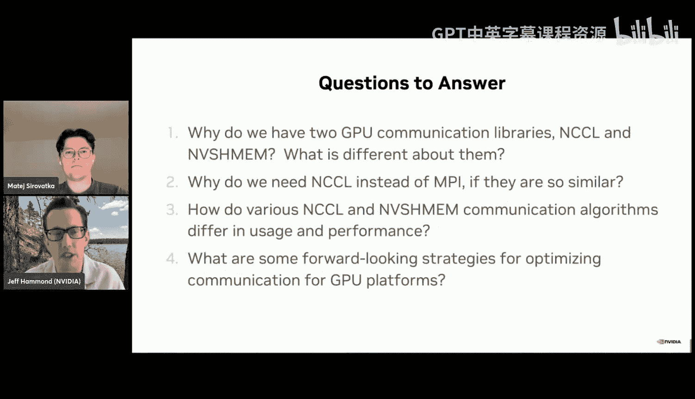

## 概述
在本节课中，我们将学习NVIDIA的两个核心通信库：NCCL和NVSHMEM。我们将探讨它们的设计理念、历史背景、核心差异以及各自的适用场景。通过具体的代码示例和性能基准测试，我们将理解如何根据不同的应用需求选择合适的通信模型，并了解它们在AI训练（特别是MoE模型）和高性能计算中的关键作用。

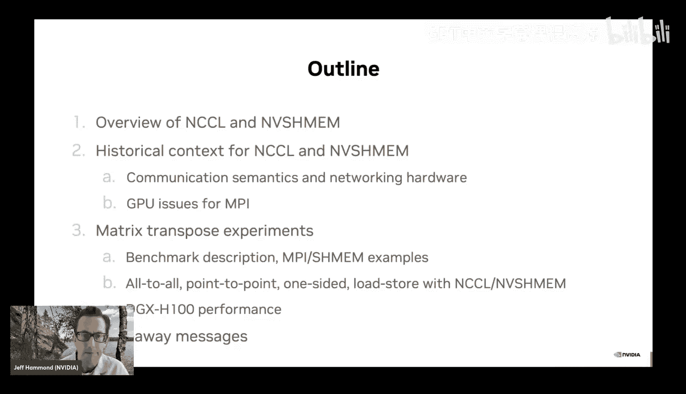

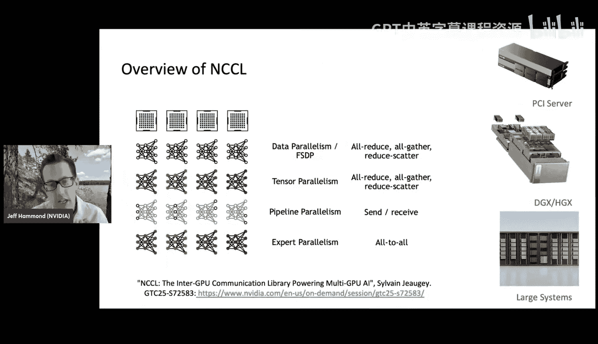

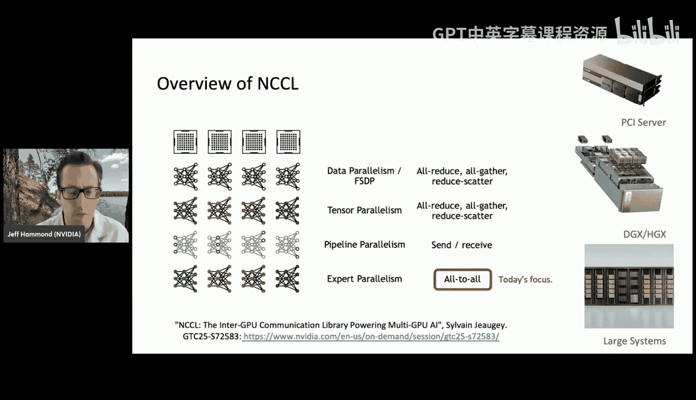

---

## 历史背景与核心概念

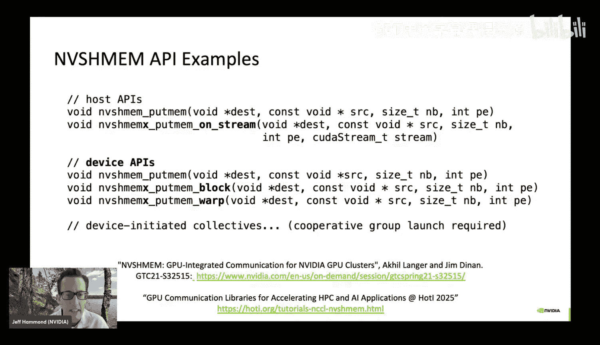

上一节我们概述了本课程的目标。本节中，我们将深入了解NCCL和NVSHMEM诞生的历史背景及其核心设计哲学，这有助于我们理解它们为何以当前的形式存在。

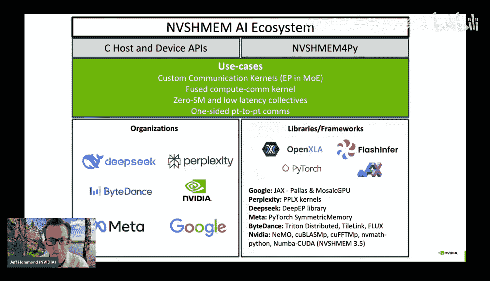

### MPI：可移植性与双边通信
MPI（消息传递接口）是高性能计算领域的基石。它的核心优势在于**极致的可移植性**和基于**双边通信**（发送/接收）的模型。
*   **设计哲学**：MPI诞生于CPU相对网络速度较快的时代，其设计优先考虑通用性和跨平台兼容性。它可以通过标准的TCP/IP套接字在任何系统上运行。
*   **双边通信**：发送操作和接收操作必须匹配，这**结合了数据移动和同步**。发送方和接收方需要协调（握手），数据才能传输。
*   **公式/代码描述**：
    ```c
    // MPI_Send 和 MPI_Recv 必须成对出现
    MPI_Send(sendbuf, count, datatype, dest, tag, comm);
    MPI_Recv(recvbuf, count, datatype, source, tag, comm, &status);
    ```
*   **局限性**：对于GPU通信，MPI的一些通用性设计（如复杂数据类型、通配符匹配）可能带来不必要的开销，且其主机端发起的模型与CUDA流式执行模型的集成不够流畅。

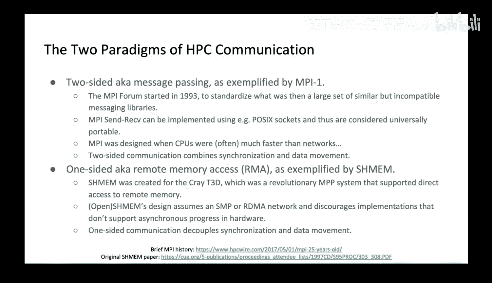

### SHMEM：分区全局地址空间与单边通信
与MPI不同，SHMEM代表了一种**分区全局地址空间**模型。
*   **核心思想**：所有处理单元（PE）的内存在一个逻辑上统一的地址空间中可见，但物理上分区。通过特殊的分配函数（如`shmem_malloc`）创建**对称内存**，所有PE都可以直接读写这部分内存。
*   **单边通信**：通信操作（如`put`、`get`）**解耦了数据移动和同步**。发起方可以直接向远程内存写入（`put`）或从远程内存读取（`get`），无需远程PE的显式参与。
*   **公式/代码描述**：
    ```c
    // PE i 可以直接写入 PE j 的对称内存
    shmem_putmem(dest, source, size, j); // 单边 Put 操作
    // 同步需要显式调用，如 shmem_barrier_all()
    ```
*   **优势**：这种模型减少了通信中的握手开销，尤其适合不规则、数据驱动型的通信模式。

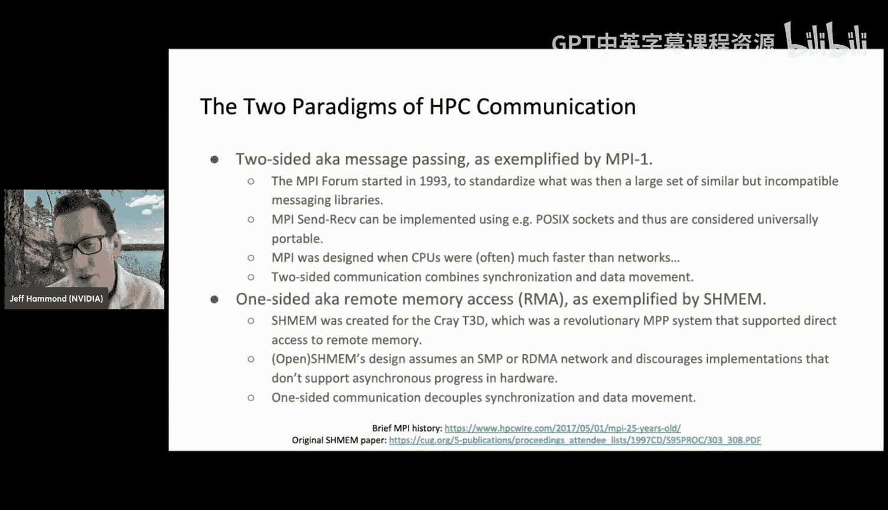

---

## NCCL vs. NVSHMEM：为何两者并存？

上一节我们回顾了两种经典的通信范式。本节中，我们来看看NVIDIA如何将这些思想具体化到GPU领域，并解答为何需要NCCL和NVSHMEM两个库。

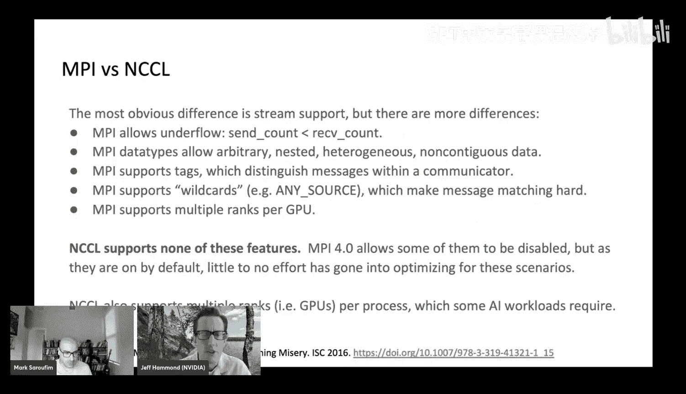

### NCCL：为AI规模化训练而生
NCCL专为多GPU、多节点AI训练设计，优化了集体通信操作。
*   **核心目标**：高效执行**All-Reduce**、**All-Gather**、**All-to-All**等集体操作，以支持数据并行、张量并行、流水线并行和专家并行。
*   **设计特点**：
    1.  **类MPI接口**：提供类似MPI的集体通信原语，易于理解和使用。
    2.  **CUDA流集成**：操作直接在CUDA流上排队，与GPU计算无缝重叠。
    3.  **自动化调优**：根据消息大小、GPU拓扑（NVLink, PCIe）和网络类型自动选择最优算法和协议。用户应“信任NCCL”做出最佳选择。
    4.  **广泛的生态系统**：集成在PyTorch、TensorFlow等所有主流AI框架中。
*   **适用场景**：大规模、结构化的集体通信模式，是分布式AI训练的默认选择。

### NVSHMEM：GPU上的PGAS与设备端发起通信
NVSHMEM将SHMEM的PGAS模型引入GPU世界，并增加了关键创新：**设备端发起通信**。
*   **核心创新**：
    1.  **对称内存**：在GPU之间创建全局可访问的内存区域。
    2.  **设备端API**：CUDA内核中的线程、线程束或线程块可以直接调用`nvshmem_put`、`nvshmem_get`进行通信，**无需返回到主机CPU**。
    3.  **设备端集体操作**：通过协作组启动，可以在CUDA内核内部执行All-Reduce、Barrier等操作。
*   **公式/代码描述**：
    ```cuda
    // 在CUDA内核中，线程可以直接发起单边Put操作
    __global__ void my_kernel(...) {
        nvshmemx_float_put_nbi_block(dest, source, nelems, pe);
    }
    ```
*   **独特优势**：
    *   **超低延迟通信**：避免了内核启动开销（>1微秒），支持计算与通信的细粒度交错。
    *   **NVLink负载/存储语义**：在NVLink域内，远程内存访问可像本地加载/存储一样使用指针直接操作，完全消除显式通信调用。
    *   **不规则通信模式**：非常适合数据驱动、目标不确定的通信，如MoE模型中的专家路由。

---

## 实验：矩阵转置的性能对比

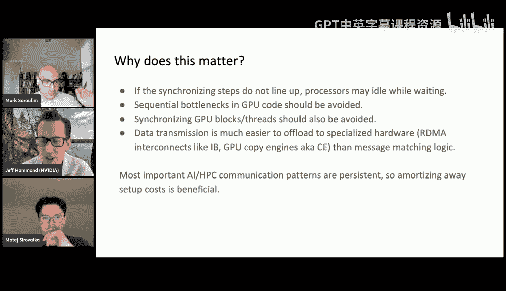

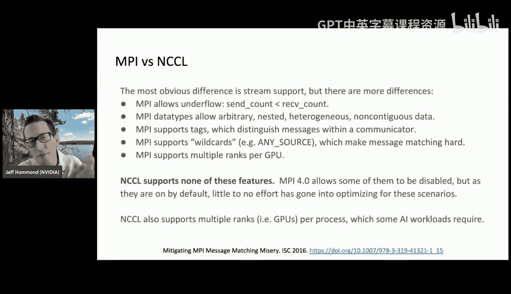

上一节我们从理论上比较了两者。本节中，我们通过一个具体的分布式矩阵转置基准测试，来直观感受不同通信模型的性能差异。

### 实验设置
*   **硬件**：DGX H100（8个H100 GPU，通过NVLink交换机互联）。
*   **目标**：实现一个分布式矩阵转置，产生All-to-All通信模式。
*   **性能上限**：
    *   本地HBM内存带宽：~24 TB/s。
    *   NVLink交换机双向带宽：~3 TB/s。

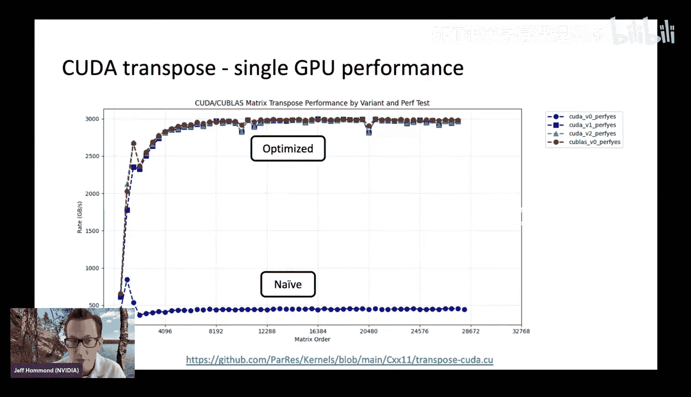

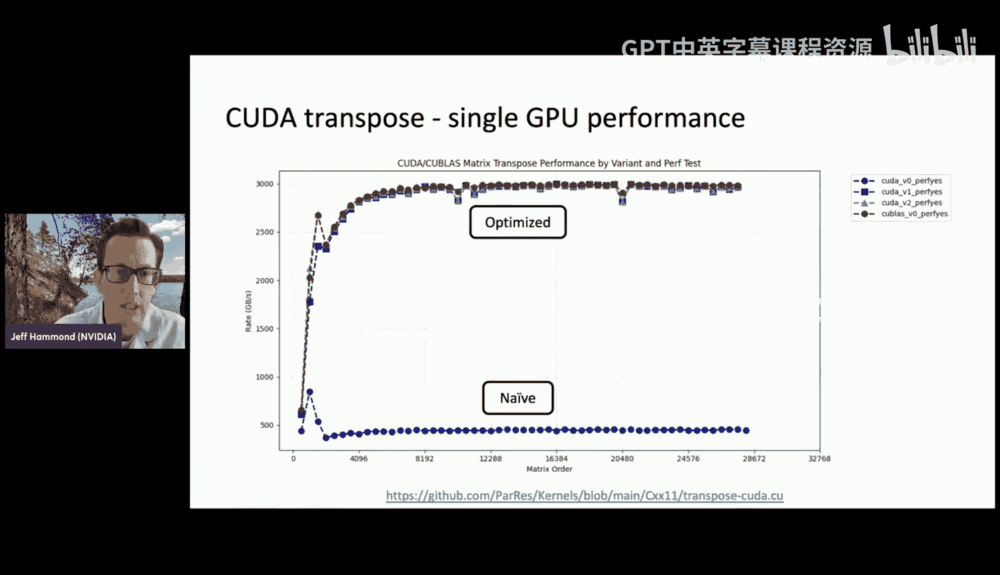

### 测试的不同实现版本
以下是测试的不同通信策略实现：

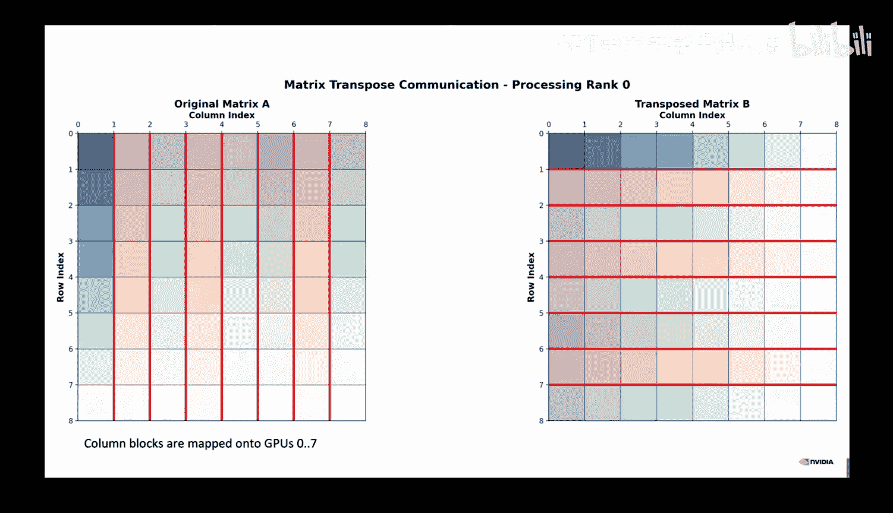

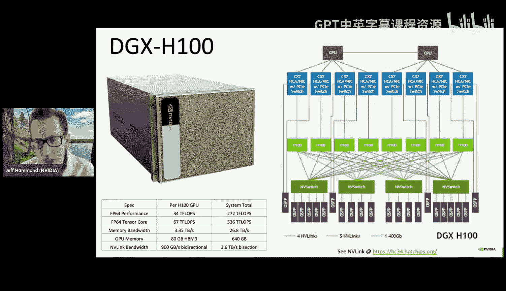

1.  **NCCL All-to-All**：使用NCCL的send/recv原语手动构建All-to-All。这是基准版本。
2.  **NCCL 点对点（Send/Recv）**：尝试手动配对通信以交错计算。**结果发现性能更差**，因为NCCL内部会对单个流上的多个send/recv进行流量控制，以防止网络拥塞。
3.  **NVSHMEM All-to-All**：使用`nvshmem_alltoall`。性能与NCCL All-to-All相近。
4.  **NVSHMEM Get（设备端）**：在CUDA内核中使用`nvshmem_get`从远程GPU获取数据块，然后进行本地转置。
5.  **NVSHMEM 指针访问**：利用NVSHMEM获取远程内存的**直接指针**。在CUDA内核中，像访问本地内存一样通过指针加载远程数据。**这是最优雅且高性能的方式**。

### 性能结果与分析
*   **NCCL All-to-All** 和 **NVSHMEM All-to-All** 达到了约2.7 TB/s的网络带宽，接近硬件上限。整体应用带宽约为7.5 TB/s。
*   **NCCL 点对点** 版本由于内部流量控制，性能显著下降。
*   **NVSHMEM 指针访问** 版本实现了**约9.5 TB/s的整体带宽**，比基准提升了近30%。其秘诀在于：
    *   **通信融合**：将显式的数据移动（`get`）转化为内存控制器级别的NVLink加载/存储操作。
    *   **代码简化**：通信逻辑消失，代码看起来像是在处理一个更大的统一内存空间。

**关键启示**：在NVLink域内，利用NVSHMEM的指针访问能力，可以消除显式通信，将通信开销完美地隐藏在计算中，从而获得显著性能提升。

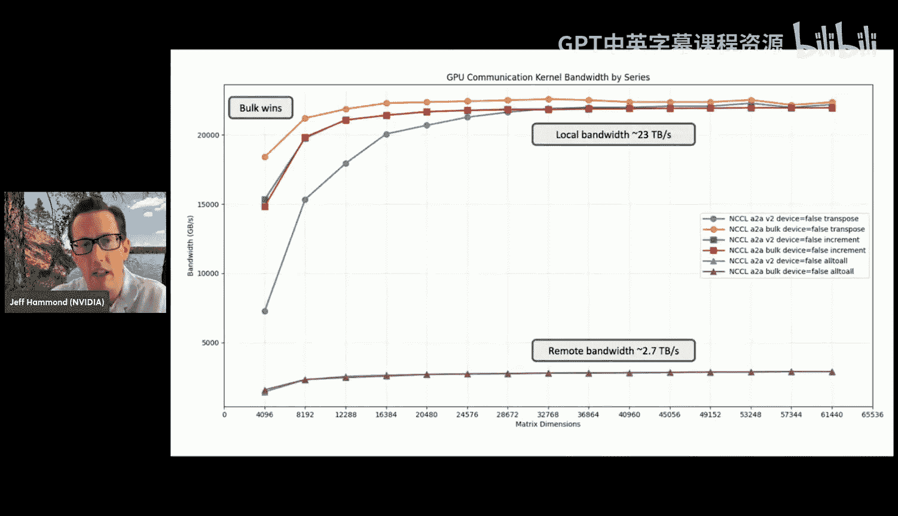

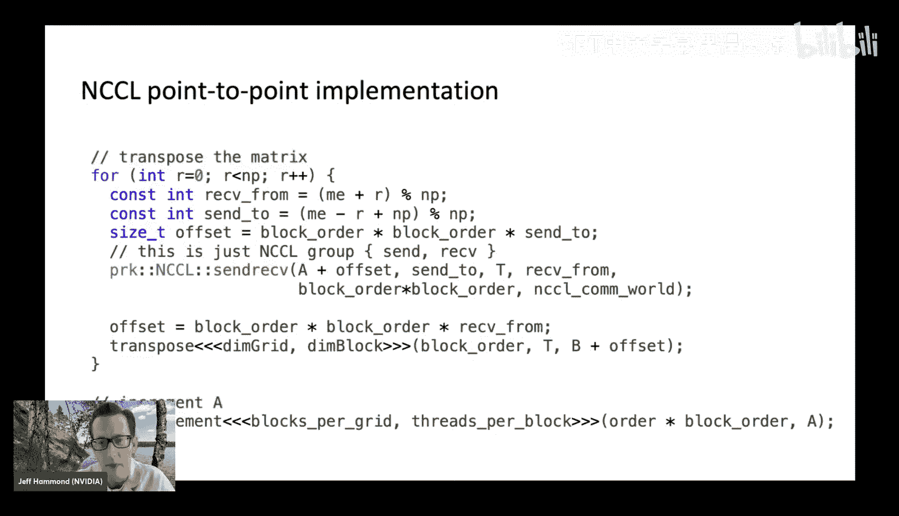

---

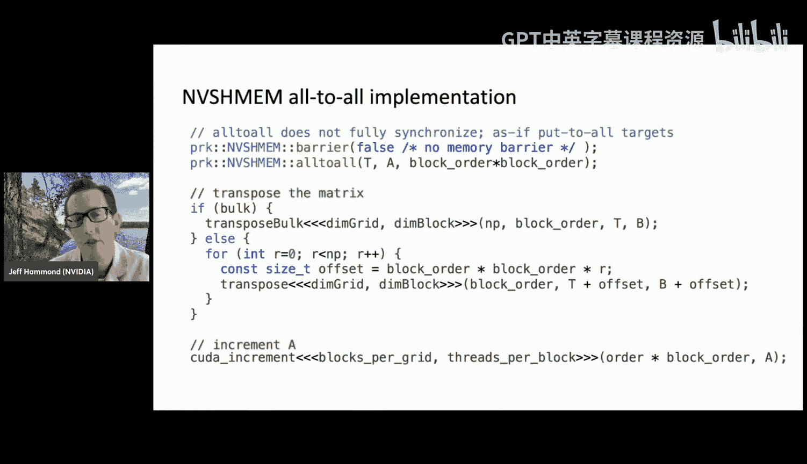

## 前沿应用：MoE模型中的NVSHMEM

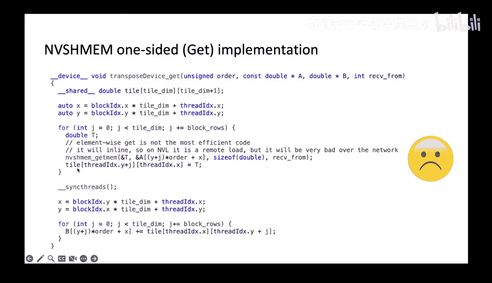

上一节的实验展示了NVSHMEM在规则模式下的潜力。本节中，我们来看看它在当前最热门的AI模型——混合专家模型中的革命性应用。

### MoE模型的通信挑战
在MoE模型中，一个门控网络（路由器）将每个输入令牌动态路由到少数几个“专家”子网络进行处理。这导致：
*   **不规则All-to-All**：每个GPU需要将不同数量的令牌发送给其他GPU，且接收方在数据到达前不知道来源和数量。
*   **细粒度通信**：通信粒度是令牌级别的，需要极低的延迟。

### NVSHMEM的解决方案
DeepSeek和Perplexity等公司公开了其使用NVSHMEM优化MoE的方案：
1.  **设备端路由与PUT**：路由器在CUDA内核中直接决定令牌目的地，并使用`nvshmem_put`将令牌写入远程GPU的对称内存缓冲区。
2.  **异步通知**：使用`nvshmem_put_with_signal`等操作，在写入数据的同时更新一个远程计数器，通知专家数据已就绪。
3.  **专家处理**：专家GPU轮询其缓冲区，发现有新令牌到达即开始计算。
4.  **结果收集**：处理完成后，同样使用`nvshmem_put`将结果写回。

### 性能收益
根据Perplexity发布的基准测试，与基于NCCL All-to-All的原始实现相比，使用NVSHMEM的细粒度、设备端通信实现了**超过10倍的延迟降低和吞吐量提升**。这对于要求实时响应的AI应用（如搜索）至关重要。

---

## 未来展望与总结

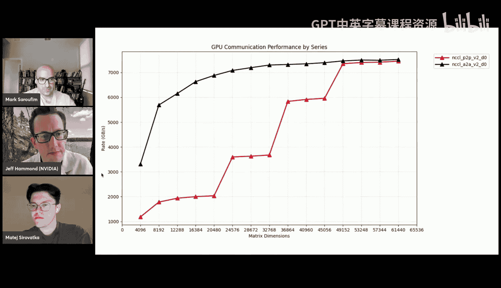

上一节我们看到了NVSHMEM在尖端AI模型中的成功。最后，我们来展望这两个库的未来发展并总结全课。

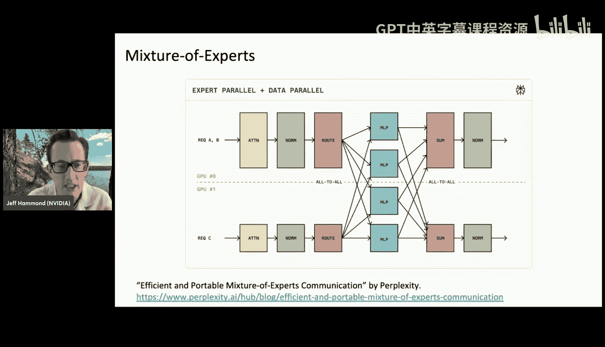

### NCCL的未来路线图
NCCL正在积极吸收NVSHMEM的优点，以提供更统一的编程模型：
1.  **对称内存支持**：已发布预览版，允许在NCCL通信器中创建共享地址空间。
2.  **设备端API**：计划中，将允许从CUDA内核内部发起NCCL通信。
3.  **单边通信原语**：未来版本将增加`put`/`get`等操作。
这意味着，未来用户可以在享受NCCL强大生态系统和集体通信优化的同时，也能使用设备端发起和单边通信等高级特性。

### 如何选择？
以下是当前的选择指南：

*   **选择 NCCL，如果你**：
    *   主要进行**大规模、结构化的集体通信**（如All-Reduce梯度同步）。
    *   使用**主流AI框架**（PyTorch/TensorFlow），且不想深入底层通信。
    *   需要**极致的可扩展性**和跨平台支持（云、IB、以太网）。
    *   遵循“信任库”的原则，希望自动化调优。

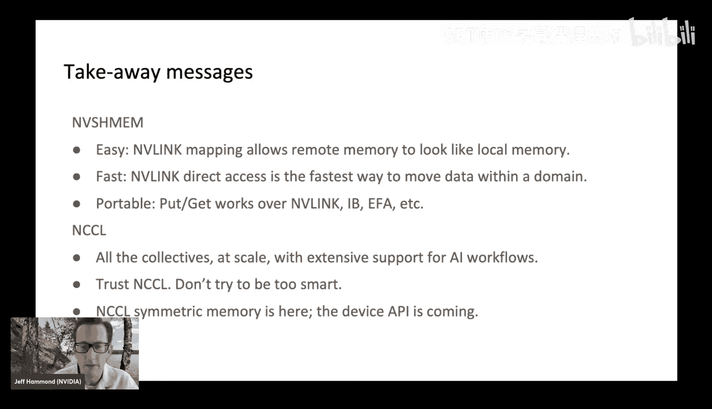

*   **选择 NVSHMEM，如果你**：
    *   需要**设备端发起通信**以实现计算通信最大重叠。
    *   处理**高度不规则、数据驱动的通信模式**（如MoE、图计算、不规则网格）。
    *   希望在**NVLink域内获得极致性能**，使用指针访问消除显式通信。
    *   正在构建**定制化的高性能计算内核**（如3D-FFT）。

### 总结
本节课中我们一起学习了：
1.  **NCCL** 和 **NVSHMEM** 的历史根源，分别源于MPI的双边通信范式和SHMEM的单边PGAS范式。
2.  **NCCL** 是AI规模化训练的支柱，通过高度优化的集体通信和广泛的集成，提供了“开箱即用”的高性能。
3.  **NVSHMEM** 通过引入**设备端发起通信**和**对称内存**，为GPU通信打开了新的维度，特别适合低延迟、不规则通信和利用NVLink负载/存储语义。
4.  通过**矩阵转置基准测试**，我们验证了不同通信模型的性能特征，并展示了NVSHMEM指针访问在NVLink域内的巨大优势。
5.  在**MoE模型**中，NVSHMEM的设备端、细粒度、单边通信特性使其成为实现超低延迟推理的关键技术。
6.  展望未来，**NCCL正在演进**以包含更多NVSHMEM的特性，为用户提供更统一且功能丰富的通信工具箱。

最终，选择取决于你的具体应用模式、性能需求和对编程模型的控制需求。理解两者的核心思想和优势，将帮助你在构建下一代高性能GPU应用时做出明智的决策。