# 15：GPU中心化通信全景图

在本节课中，我们将学习GPU中心化通信的发展历程、核心概念以及当前主流的通信库。我们将从为什么通信成为瓶颈开始，逐步深入到节点内与节点间的通信类型，并介绍MPI、NCCL、NVSHMEM等关键库的特点与差异。

## 概述：为什么通信至关重要

自21世纪初以来，计算进入了多核时代。2007年CUDA发布后，GPU编程逐渐普及。2010年，首批基于GPU的超级计算机登顶Top500榜单。如今，前十的超级计算机大多基于GPU，数据中心和AI领域也广泛采用GPU。计算能力的发展速度远超内存和网络带宽的提升速度，这意味着数据移动（即通信）的优化变得越来越重要。

例如，训练一个大型模型可能需要数千块GPU，成本高达数百万美元。优化通信不仅能节省时间，更能显著降低成本。因此，减少CPU在关键通信路径中的参与，赋予GPU更多自主权，即实现“GPU中心化通信”，是提升整体系统效率的关键。

## 通信技术发展时间线

以下是英伟达相关通信技术发展的简要时间线：
*   **内存管理技术**：如统一虚拟地址（UVA）。
*   **GPU Direct技术**：允许GPU间直接通信。
*   **NVLink与NVSwitch**：提供高带宽、低延迟的GPU互连。
*   **用户级通信库**：如NCCL和NVSHMEM。

## 节点内通信类型

我们根据通信过程中操作的执行者来定义四种节点内通信类型。关键在于区分**API调用**发生在主机（CPU）端还是设备（GPU）端，以及**数据路径**是否经过CPU。

### 类型一：主机原生通信

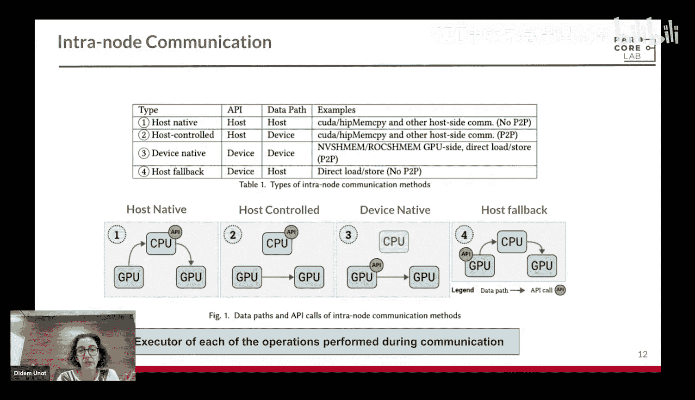

在早期，GPU之间没有点对点（P2P）访问能力。数据必须先从源GPU复制到CPU内存，再由CPU复制到目标GPU。API调用和数据路径都完全在CPU端。

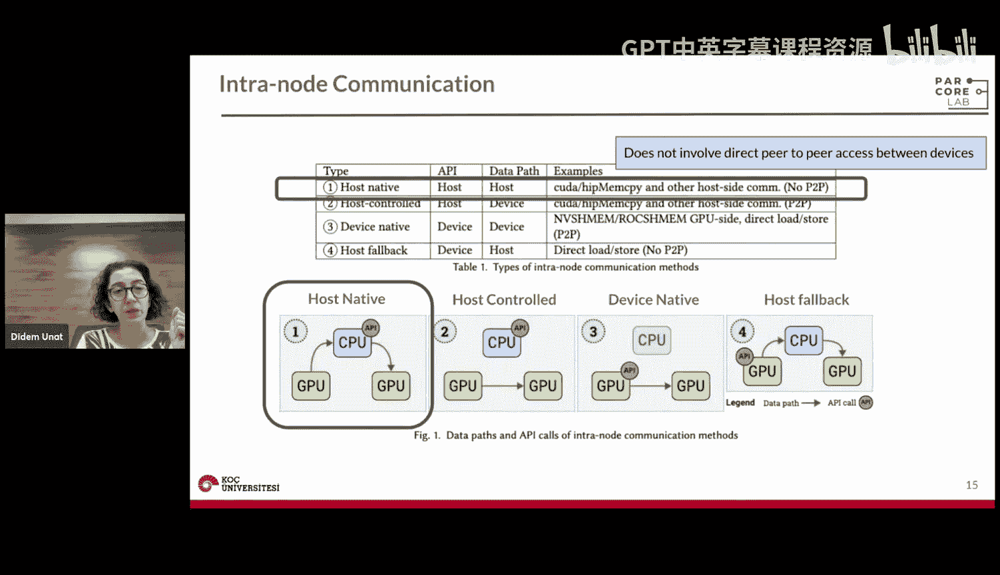

### 类型二：主机控制通信

随着GPU Direct 2.0引入，GPU可以通过PCIe总线直接访问彼此的内存，无需经过主机内存复制。数据路径直接在GPU间通过PCIe或NVLink进行，但API调用仍在主机端。MPI、NCCL的`cudaMemcpy`操作通常属于此类。

### 类型三：设备原生通信

在具备直接P2P内存访问的基础上，将API调用也移至设备端。例如，NVSHMEM提供了设备端API，允许在GPU内核中直接发起通信操作。NCCL未来也计划支持设备端API。

### 类型四：主机回退通信

当P2P访问被禁用时，即使API在设备端发起，通信也会回退到经过主机的路径。这确保了代码的兼容性，但性能会下降。

## 节点间通信类型

节点间通信引入了网络接口卡（NIC）。除了API和数据路径，我们还需关注**消息注册**和**触发**这两个操作由谁执行。

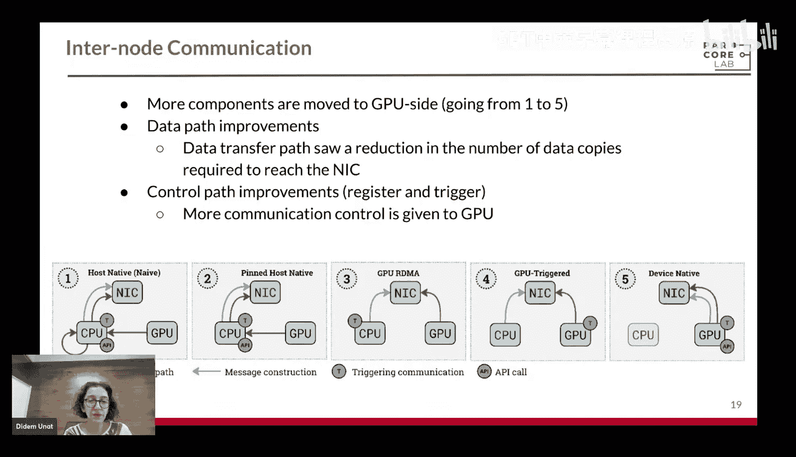

### 类型一：主机原生通信

所有操作（API调用、数据移动、消息注册、触发）都通过主机完成。数据从GPU到NIC需要经过主机内存中转。

### 类型二：固定内存的主机原生通信

GPU Direct 1.0引入了GPU与NIC之间的共享固定内存区域。GPU可以将数据放入此区域，NIC直接读取，消除了主机端的一次数据拷贝，降低了延迟。

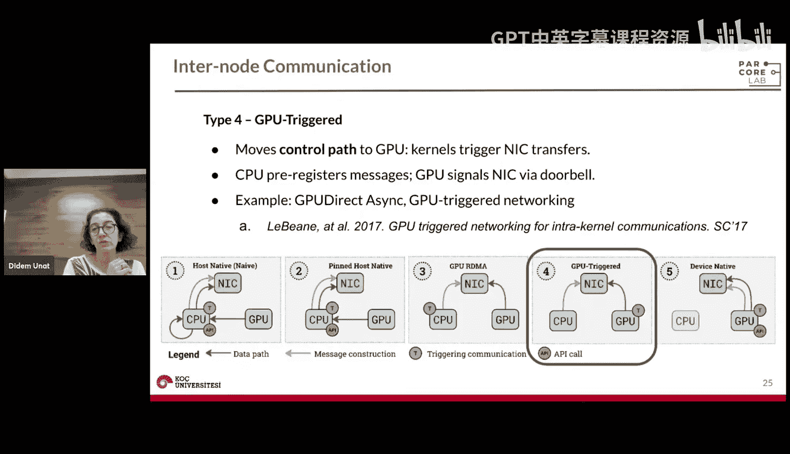

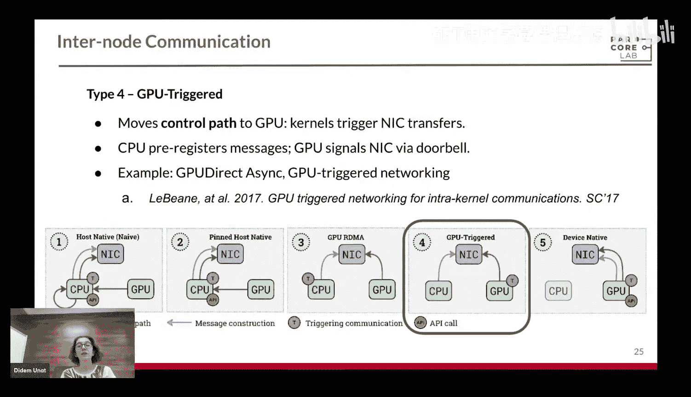

### 类型三：GPU Direct RDMA通信

这是节点间通信的一个重要里程碑。NIC可以通过PCIe直接读写GPU内存，完全绕开了主机内存。这进一步优化了数据路径，是MPI、NCCL、NVSHMEM等进行节点间GPU通信的常用机制。

### 类型四：GPU触发通信

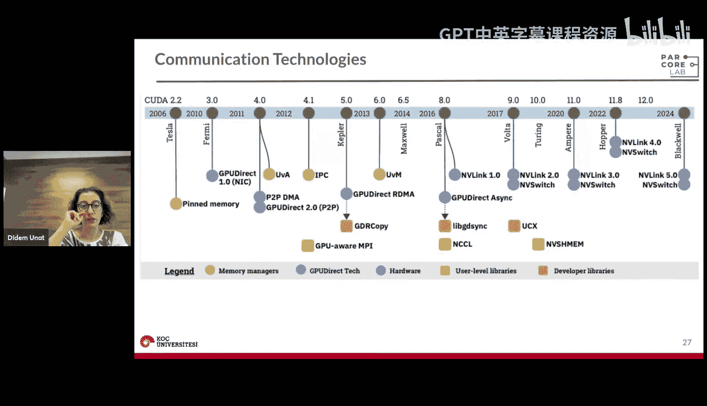

此类通信优化了控制路径。CPU预先向NIC注册消息，然后由GPU触发（“按门铃”）通知NIC开始传输。这减少了CPU的参与，但仍需要一个运行在主机上的代理线程。

### 类型五：设备原生通信

这是真正的“CPU无关”通信，消除了代理线程。API调用、触发、消息注册等所有操作都移至GPU端。CPU仅用于初始的内核启动。NVSHMEM和配置了GPU Direct Async IB的InfiniBand支持此模式，但在多数超算中并未默认启用。

## 高速互连：NVLink与NVSwitch

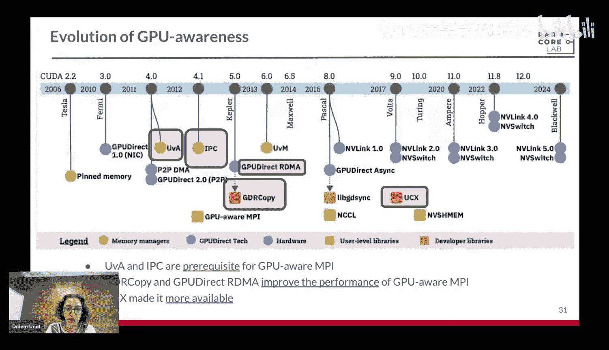

PCIe带宽有限，NVLink提供了更高的带宽和更低的延迟，可实现高效的GPU间P2P通信。然而，当GPU数量较多时，无法实现全互联。NVSwitch的引入解决了这个问题，它提供了全互联路由能力。AMD的Infinity Fabric链路与NVLink类似，但目前没有类似NVSwitch的交换设备。

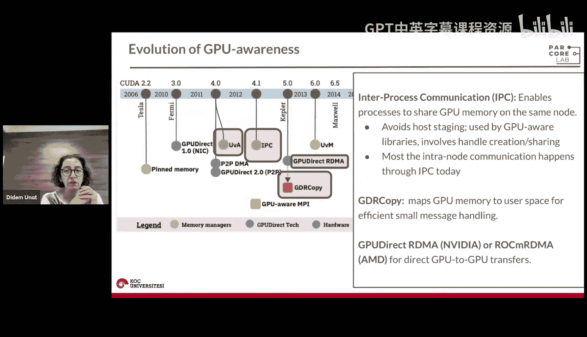

## 用户级通信库

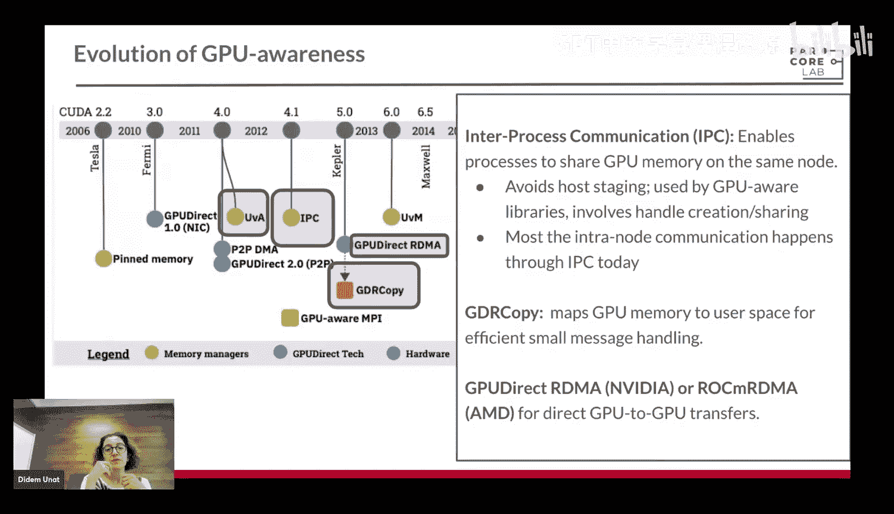

上一节我们介绍了底层的硬件通信机制，本节中我们来看看构建在其之上的用户级通信库。

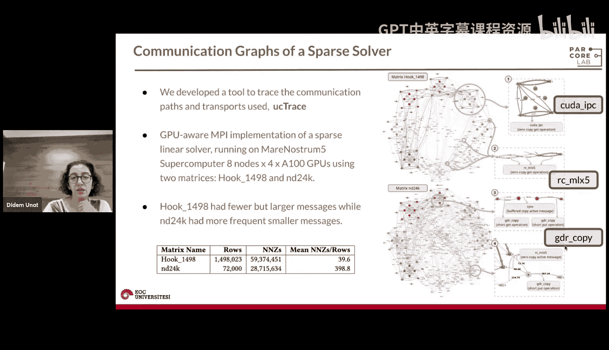

### GPU感知MPI

MPI是高性能计算领域标准的并行编程库，具有极好的可扩展性和可移植性。GPU感知MPI指的是MPI实现能够自动区分主机和设备缓冲区。当进行发送/接收操作时，MPI会检查缓冲区位置，并自动选择最优路径（如使用GPU Direct RDMA），从而避免不必要的主机中转拷贝。其API始终在主机端调用。

以下是实现GPU感知的关键技术：
*   **统一虚拟地址（UVA）**：提供统一的地址空间，允许通过地址值推断内存所属设备，简化了编程。
*   **进程间通信（IPC）**：允许进程间共享GPU内存，通过传递内存句柄实现直接访问，避免了主机中转。这是目前节点内通信最常用的方式。
*   **GDRcopy**：通过内存映射处理小消息，通常用于小数据量传输。
*   **GPU Direct**：支持GPU间的直接数据传输。

### UCX通信框架

UCX是一个统一的通信框架，旨在抽象底层多种传输技术（如InfiniBand、RDMA、TCP、GPU Direct IPC等）。上层库（如MPI、NVSHMEM）通过UCX的API选择最适合当前硬件和配置的传输方式。我们团队开发的`UCtrace`工具可以可视化基于UCX的MPI通信。

### NCCL与RCCL

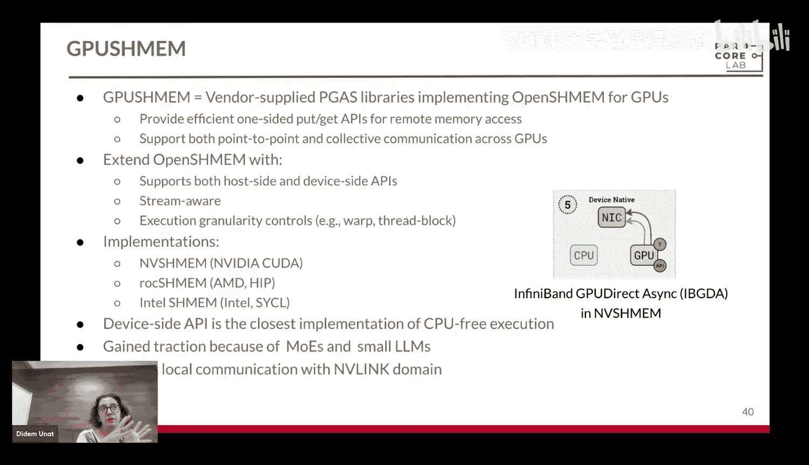

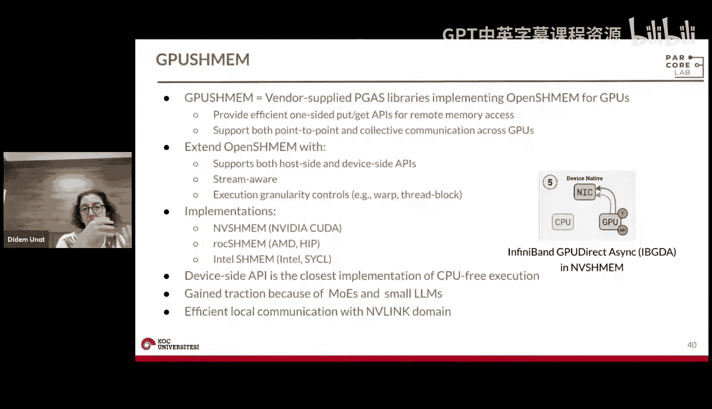

NCCL（英伟达）和RCCL（AMD）是厂商提供的集合通信库，针对NVLink、PCIe、InfiniBand等进行了深度优化。与MPI的主要区别在于它们原生支持**CUDA流**，允许将通信操作放入流中并按序执行，便于实现通信与计算的重叠。MPI目前尚无原生的流支持。

以下是一个简单的代码示例，对比MPI与NCCL的接口：

```c
// MPI 示例
MPI_Isend(sendbuf, count, datatype, dest, tag, comm, &request);
MPI_Irecv(recvbuf, count, datatype, source, tag, comm, &request);
// 需要显式同步流以确保操作顺序
cudaStreamSynchronize(stream);

// NCCL 示例
ncclSend(sendbuf, count, datatype, dest, comm, stream); // 指定流
ncclRecv(recvbuf, count, datatype, source, comm, stream); // 指定流
// 操作在流中自动按序执行
```

### NVSHMEM

NVSHMEM是一个基于分区全局地址空间（PGAS）模型的库。它提供**单边**的`put`和`get`操作，允许GPU像访问本地内存一样远程访问其他GPU的内存。它支持设备端API，最接近“CPU无关”的执行模式。

NVSHMEM的编程模型更灵活，可以实现细粒度的通信重叠，但同时也引入了复杂性，因为直接远程内存访问容易导致竞态条件，需要程序员仔细使用信号量等机制进行同步。调试和性能分析也更具挑战性。

以下是一个NVSHMEM设备端API的示例：

```c
// 在GPU内核中直接进行远程写入
nvshmem_float_p(signal, value, pe_target);
// 需要显式同步以确保内存操作顺序
nvshmem_quiet();
```

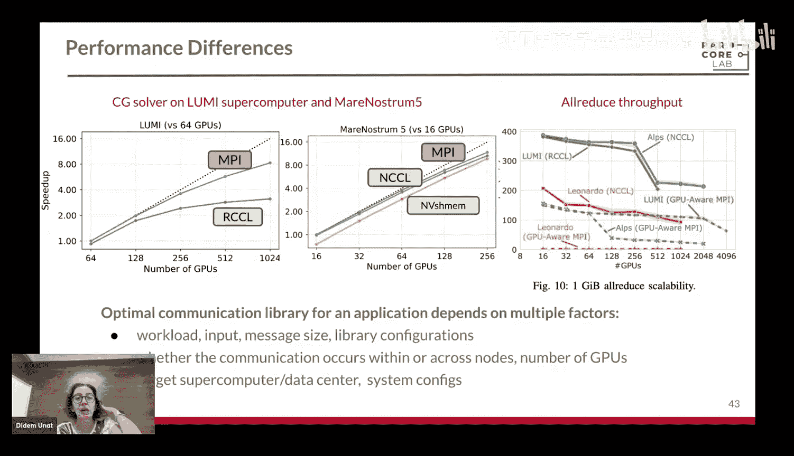

## 通信库对比与性能考量

在高层次上对比这三种选项：
*   **MPI与NCCL**：主要使用双边（发送/接收）通信。MPI缺乏原生流支持，NCCL有流支持并提供通信操作分组以进行拥塞控制。
*   **NVSHMEM**：使用单边（存放/获取）通信，支持细粒度重叠，但编程和调试更复杂。

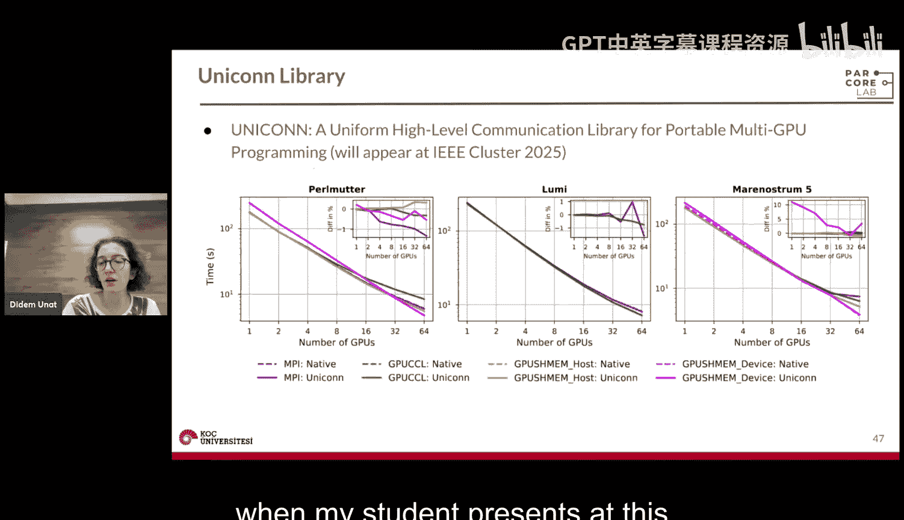

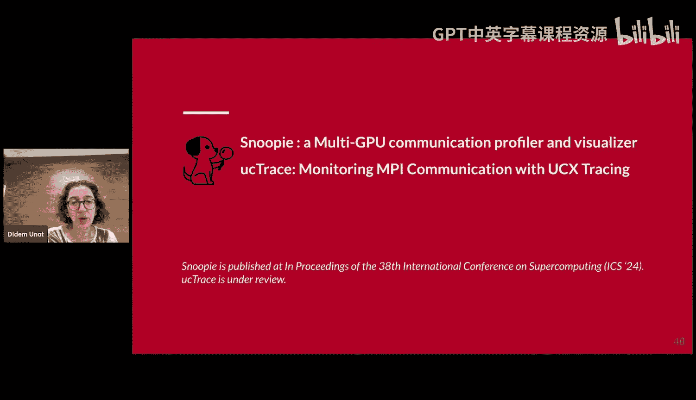

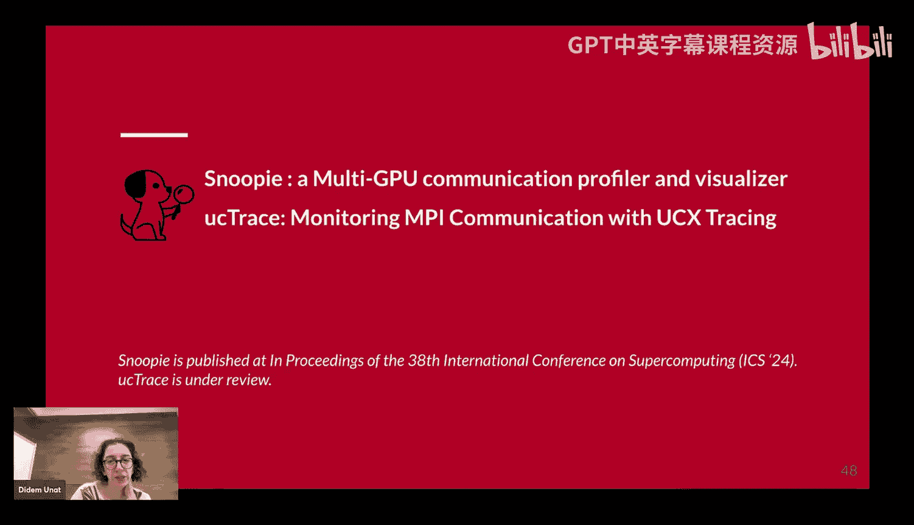

关于性能，最优选择取决于众多因素：工作负载特性、通信频率、消息大小、库配置、驱动版本、是在节点内还是跨节点通信、是否使用NVLink等。因此，很难给出普适的性能结论。建议根据具体应用场景进行测试和评估。

## 研究项目介绍：统一接口与可视化工具

面对众多通信库的复杂性，我们团队进行了一些探索性工作。

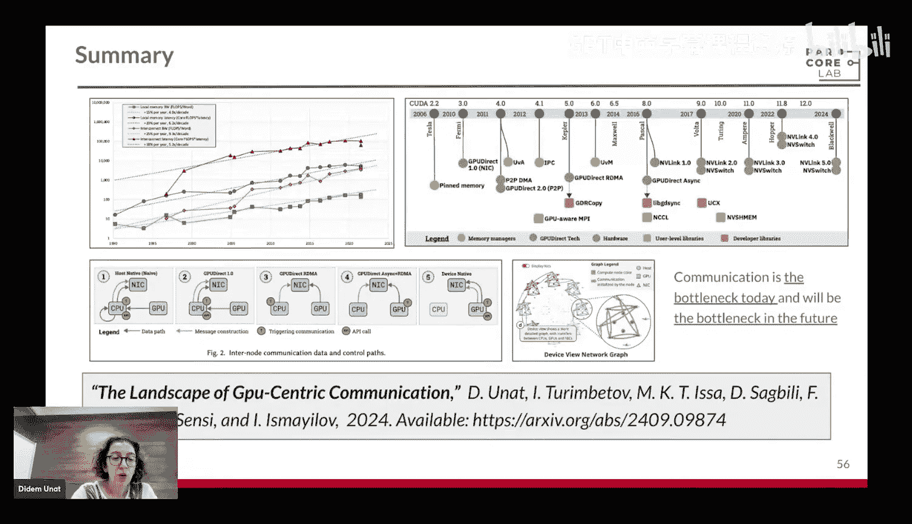

**Unicorn项目**：我们尝试创建一个统一的API，能够以最小开销支持上述多种通信库，同时兼容主机端和设备端API。初步结果表明，我们的封装层引入的开销可以忽略不计。

**可视化工具**：为了深入理解通信行为，我们开发了两种工具。
1.  **Snoopy**：用于可视化NVSHMEM等基于P2P内存访问的通信，可以生成通信图和代码热力图，帮助定位引发通信的代码行。
2.  **UCtrace**：专用于基于UCX的MPI应用，可展示使用了哪种传输层协议、数据量大小以及通信拓扑，有助于性能调试和系统配置验证。

## 总结

本节课中，我们一起学习了GPU中心化通信的全景图。我们首先了解了通信成为系统瓶颈的原因。接着，我们系统性地学习了节点内和节点间的通信类型分类。然后，我们深入探讨了MPI、NCCL、NVSHMEM等主流用户级通信库的特点、接口差异和适用场景。最后，我们介绍了一些旨在简化编程和提升可观测性的前沿研究工具。

理解这些通信技术的演变和权衡，对于在GPU集群上开发高性能应用至关重要。