# 16：Quartet 4-bit 训练教程

## 概述
在本节课中，我们将要学习 Quartet 方法，这是一种用于大型语言模型（LLM）的 4-bit 浮点数（FP4）训练技术。我们将探讨为何 FP4 训练在某些情况下可以是最优选择，理解其背后的核心理论，并了解实现高效 FP4 训练所需的关键技术，包括缩放定律、成本归一化比较以及高性能 CUDA 内核的实现。

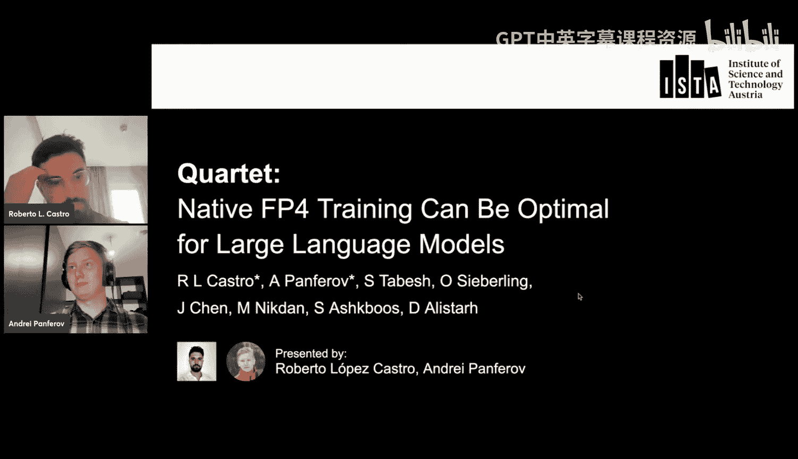

---

## 模型训练与数据表示基础

上一节我们介绍了课程概述，本节中我们来看看机器学习模型训练的基本原理。

当我们谈论机器学习模型时，通常指的是某种参数化函数，这些函数通过优化某个目标来进行训练。优化过程通常使用基于梯度的方法，例如梯度下降、随机梯度下降或 Adam 优化器。这些方法的核心需求是能够计算损失函数相对于这些函数参数的梯度。

因此，这些参数自然被用作实数，因为实数参数函数是可微分的，并且可以轻松地对其应用梯度步进。然而，在现实中，计算机无法表示无限的实数集合，因此必须使用某种近似方法。人们通常使用浮点数来近似表示实数。

浮点数近似由两部分组成：尾数和指数（以及符号位）。它可以编码非常广泛的实数范围（例如从 10^38 到 10^-38），并具有高达 10 位小数的精度。这使得它成为实数的良好近似，因为它既有极宽的范围，又有足够高的精度。

然而，从大型语言模型分析的一些理论结果中，我们知道它们实际能存储在其参数中的知识容量，通常接近每个参数 1 到 2 比特。这意味着模型能编码到其参数中的真实知识量，远低于用于优化这些参数的高精度浮点数数据类型所能表示的量。这在我们使用的优化过程（使用非常昂贵的高比特宽、高精度浮点数）与最终结果（编码的信息量远未达到数据类型的上限）之间造成了某种差异。

因此，人们一直在广泛试验替代的数据类型，这些类型是对实数更粗糙、更基本的近似，具有更低的比特宽，但可能仍然允许高效的信息编码，更重要的是，允许在其上执行高效的优化过程。

---

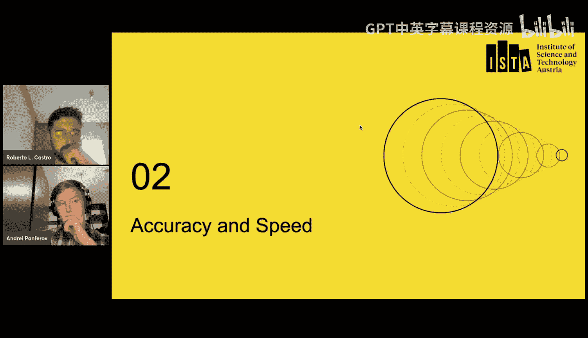

## 低精度数据类型与硬件支持

上一节我们讨论了高精度浮点数与模型实际容量之间的差距，本节中我们来看看业界使用的低精度数据类型。

最简单的低精度表示是实数的固定子集，它比高精度浮点数覆盖的整个范围和精度要小得多，但可能仍然允许高效的训练和信息编码。

以下是不同公司和加速器最近使用的一些低精度数据类型示例：
*   **Apple**：在其最新的 iPhone 和 iPad 芯片中，不仅包含高精度 FP32 数字，现在还包含标准的半精度 Bf16 数字和 8 位整数。这里的“包含”不仅指可以在内存中存储它们，更重要的是提供了对这些数字的内核支持，允许在机器学习模型中进行高效的矩阵运算和编解码。
*   **Qualcomm**：采用了略有不同的方法，使用 FP16 代替 Bf16，并使用 8 位整数。近年来，支持的数据类型链变得有些复杂，尤其是在 NVIDIA 方面，它们不仅包括 FP32、16、8 甚至 4，还包括 Bfloat 数字和一些整数，并且经常添加或放弃对某些数据类型的支持。

因此，需要一个更健壮的框架来比较用于这些低精度数据类型的机器学习训练方案，以便更准确地判断哪种精度效果最好，以及这些精度在低精度机器学习训练中带来的权衡。

这些精度不仅仅是设备上存储数据的方式，更重要的是硬件对机器学习常用操作的支持。具体来说，对这些定制程序数据类型的多数支持来自矩阵乘法运算，因为这些运算通常构成神经网络内的大部分计算。因此，有效支持矩阵乘法运算几乎允许你以低精度运行整个模型。

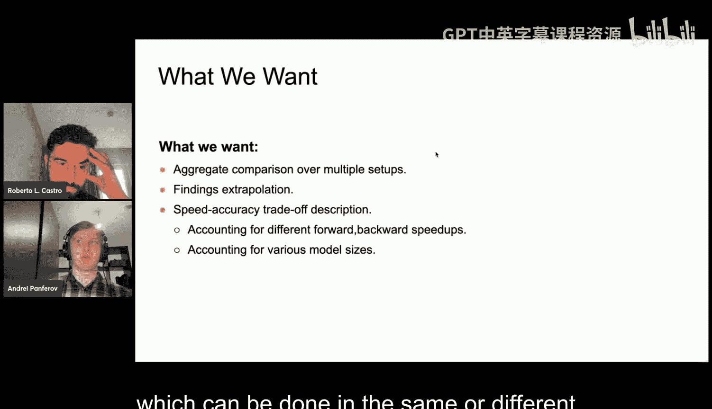

在这项工作中，我们将专注于量化大型语言模型内部的矩阵乘法运算（即线性层），试图展示较低的精度可以带来更好的精度与速度权衡。理论上，FP4 的速度提升可以高达 FP16 的 4 倍或 FP8 的 2 倍。

但是，这些速度提升是以降低精度为代价的。具体来说，随着降低模型训练精度，在某个点上会开始损失精度。这就在我们因降低精度而损失的精度与从硬件支持的低精度数据类型中获得的速度提升之间产生了权衡。在实践中，这更多地取决于运行模型的具体设置。

---

## 精度与速度的权衡比较模型

上一节我们介绍了低精度训练带来的速度与精度权衡，本节中我们来看看如何系统地比较不同的训练方案。

设计低精度训练方法时，最简单的目标是证明它在提供速度提升的同时不损失精度。实际上，许多最近提出新的低精度训练方法的论文都展示了这一点，它们旨在表明几乎不损失任何精度，或者损失不显著，同时展示可以获得一些速度提升。

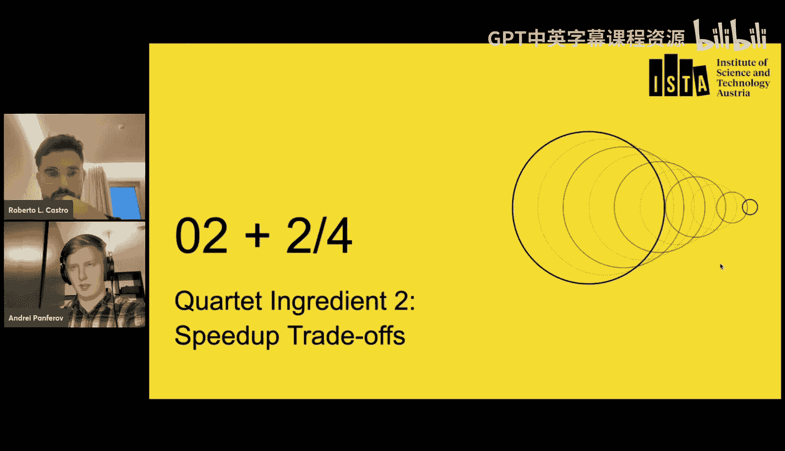

然而，这种比较存在一个问题：首先，它基于一个非常具体的设置。在这些论文中，作者通常训练一个特定模型，为其测量一系列任务，显示在所有任务中的微小性能下降，并声称几乎没有损失任何东西。他们为此特定模型提供速度提升，并说在使用低精度训练时，速度提升基本上是免费的。

但在实践中，这并没有回答任何关于如果（例如）将模型大小增加一倍会发生什么的问题。你的精度下降会如何变化？你的速度提升会如何变化？为了提供这些更具体的比较，需要以某种方式聚合关于不同速度提升下的性能和速度的信息，并进行同时考虑精度和速度的比较。因此，需要建立一个新的模型来进行这些比较。

我们希望我们的比较模型能够：
1.  首先，能够使用来自许多不同训练轮次的信息进行比较，以便更稳健地估计实际获得的收益。
2.  能够使用这个比较模型来外推我们尚未测试的设置，例如，如果我们将模型规模扩大 10 倍，我们的假设是否仍然成立。这非常有用，因为如果你的模型是稳健的，你可以使用它来在实际训练模型之前预测哪种程序会更好，从而在训练你能负担的最大模型之前更有效地分配计算资源。
3.  希望这个比较模型能够非常准确地描述不同设置、不同模型大小以及提供不同类型速度提升的略有不同的方法的精度-速度权衡。

---

## 构建基于缩放定律的比较模型

上一节我们提出了对健壮比较模型的需求，本节中我们开始构建这个模型，首先学习如何以更稳健的方式比较精度。

为此，我们采用了缩放定律。当我们说缩放定律时，意味着如果你的训练设置（广义上，例如一个模型家族）在超参数（如模型大小和训练数据量）方面具有一致的性能，那么你可以尝试将这种可预测的损失拟合为模型参数的参数化函数。

一个非常著名的 LLM 缩放定律例子是 Hoffman 等人提出的缩放定律，他们预测了验证损失作为模型参数数量和训练令牌数量的函数。这个缩放定律在文献中已被多次验证，并用于不同的目的。

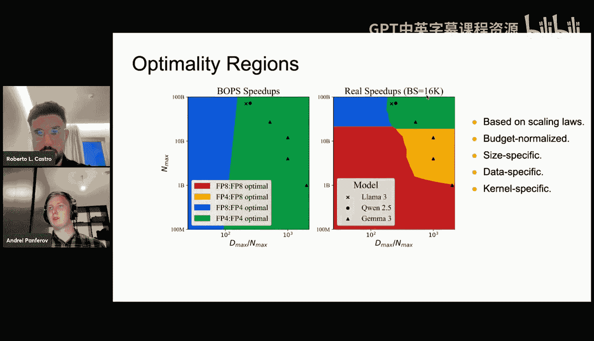

我们可以将这个想法外推，将精度纳入方程。这是我们最终用于描述量化训练性能作为参数数量、训练令牌数、前向精度和反向精度函数的缩放定律。

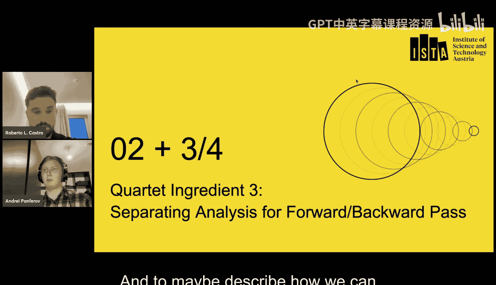

这个缩放定律在形式上与之前的定律相似，参数数量和数据系数在某种程度上仍然是解耦的，仅通过一个额外的常数伽马相互作用。更详细地看，前向精度在这里仅影响参数数量，作为参数数量的一种乘法因子。自然地，由于量化训练无法超过基线全精度训练的性能，这个有效乘数介于 0 和 1 之间。

缩放定律中包含反向传递信息的另一部分是令牌数量的有效乘数。我们选择将其与参数数量解耦，基于一个简单的想法：如果你的模型训练不足，那么从优化理论中我们知道，反向传递量化不一定会在你的优化方法中引入任何一致的偏差，而只是使你的梯度估计过程更加嘈杂。从这个提出的缩放定律中，你可以看到令牌数量的有效乘数并不会改变具有量化/非量化反向部分的模型会收敛到的损失，而只会改变收敛速度。

因此，从比较单个设置，我们现在可以比较在不同训练时长下训练的整个模型家族。从这个缩放定律的形式中，我们可以看到，我们可以通过简单地比较有效因子来比较不同的方法。也就是说，如果一个方法具有更好的前向有效因子和反向有效因子（即参数数量乘数和数据量乘数都更高），那么该方法在各种设置下会产生更低的损失，我们可以说它在质量上更好。

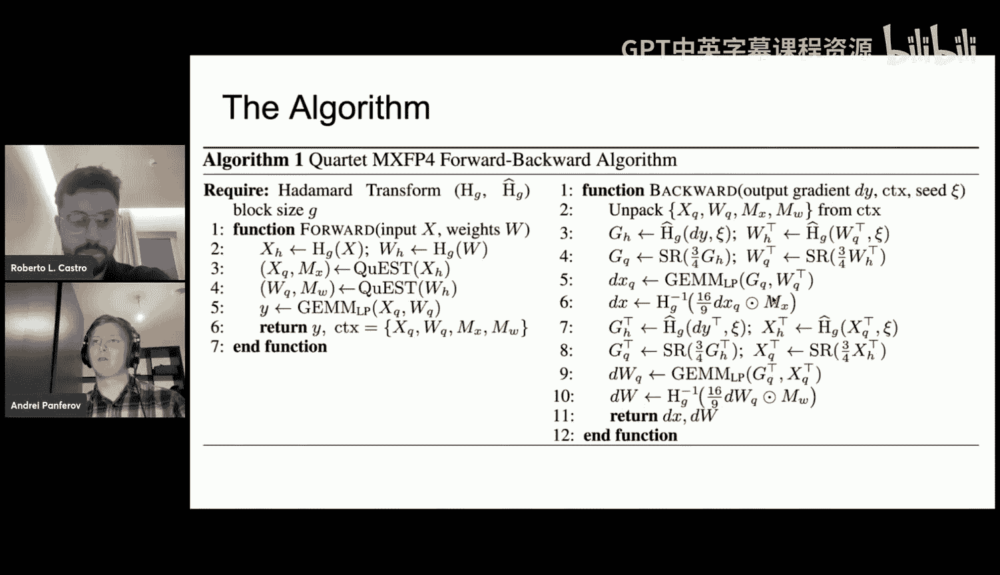

---

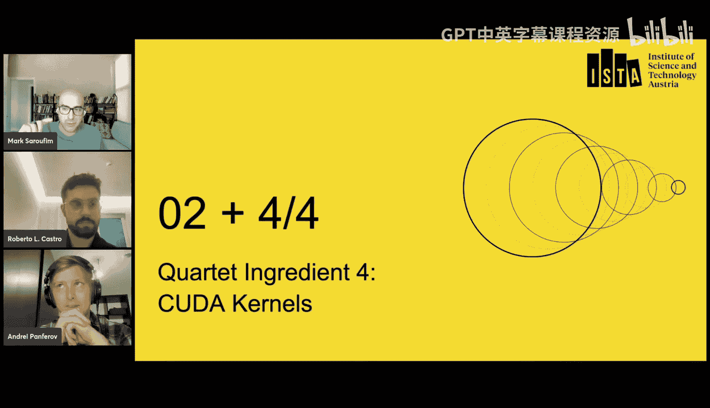

## 将速度提升纳入成本考量

上一节我们通过缩放定律量化了精度，本节中我们来看看如何将速度提升也纳入比较框架。

我们需要考虑的是，前向传递和反向传递的速度提升并不等同。前向传递主要影响量化模型的推理，因为在训练期间，前向传递的量化会影响每个线性层的三个 GEMM 操作中的一个，但对于推理，所有 GEMM 操作都针对量化的前向传递进行量化。相反，反向传递主要影响训练，意味着如果我们在训练期间量化反向传递中的三个 GEMM 操作中的两个，我们将获得更快的训练，但在模型训练完成后对推理没有任何影响。

考虑到这一点，我们可以得出这样的观点：模型有一个单独的推理成本概念和一个训练成本概念，而量化方案可以以不同的方式影响这些成本。

让我们尝试阐述这个关于成本的想法。我们选择某个基线精度。对于固定精度下的基线，表征推理成本的一种方式是模型的参数数量，因为前向传递（即推理）的计算和内存移动与参数数量成正比。为了考虑不同精度可能具有某种推理速度提升（此处表示为 S_forward）的事实，要对不同精度的模型进行推理成本归一化，你可以选择与速度提升成正比的参数数量。

我们可以将同样的想法应用于训练成本，它与模型训练的令牌数量和参数数量都成正比。这里的归一化稍微复杂一些，因为由于参数数量的变化，你必须同时通过训练和推理速度提升进行归一化。

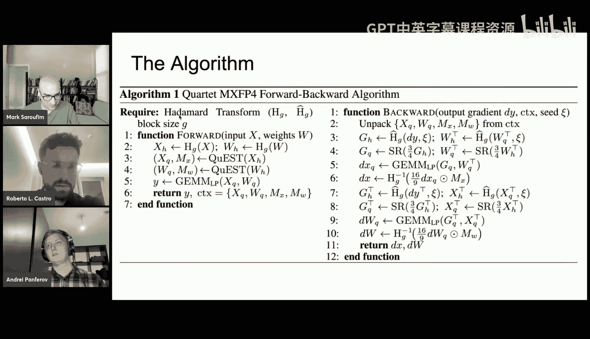

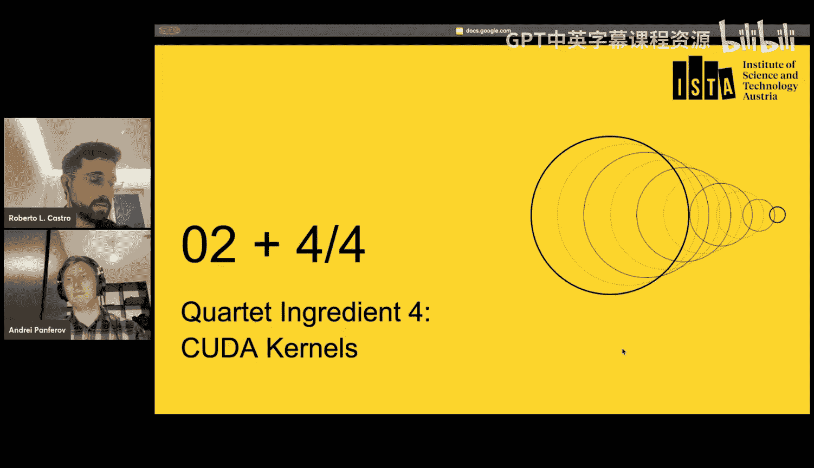

有了这些，你可以进行成本比较，即比较不同的精度，使得它们的推理成本和训练成本都相同。然后，你可以通过将这些精度（将产生缩放定律中的某些有效参数数量乘数）代入来考虑精度的损失。因此，这个公式化是对不同精度的推理和训练计算归一化比较。

我们使用它的方式如下：我们有一堆要比较的精度，我们为所有精度拟合缩放定律，然后我们选择一个基线精度，并基准测试每个其他量化方法相对于这个基线方法的速度提升。然后，对于任何训练和推理成本（例如，通过基线模型的参数数量和基线模型的数据饱和比率来参数化），我们可以使用缩放定律预测损失，并选择最低的一个来说明哪种精度、哪种确切的训练方案对于给定的推理和训练计算是最佳的。

我们可以像这样绘制它：在图中，Y 轴上是基线模型的参数数量（从 1 亿到 1000 亿个 Transformer 模型参数），X 轴上是数据饱和程度（从接近 Chinchilla 最优到远超 Chinchilla 最优训练时长）。我们比较了四种不同的训练方案：基线 FP8 训练、仅前向 FP4 训练（仅量化前向为 FP4，反向仍为 FP8）、前向 FP8 反向 FP4 训练以及完全 FP4 训练。在右侧的图中，你可以看到这些区域根据我们生成的内核的真实测量速度提升绘制而成。

这些区域显示了在真实世界的推理速度下，哪种计算成本归一化的方法在特定计算约束下会产生更好的精度。你可以看到，我们在图上绘制了一些最近发布的模型，如 Llama 3、Qwen 2.5 或 Gemini 3。我们可以看到，它们中的许多都落在要么是仅前向量化 FP4，要么是完全 FP4 量化的区域内。这就是为什么我们声称 FP4 对于 LLM 预训练可以是最优的，因为一些在实践中合理且人们已经训练过的模型落在了如果它们完全用 FP4 训练会产生更好损失的区域内，或者至少这是我们根据获得的缩放定律和速度提升所预测的。

这个比较方案表明，我们可以使用它来比较 LLM 预训练的真实内核，并使用在 LLM 预训练上拟合的缩放定律。我们可以将真实的预训练模型映射到获得的区域，以证明某些精度在特定训练机制中的可用性。

总的来说，这个比较方案允许我们对非常具体的计算设置进行基于缩放定律的预算归一化比较。

---

## 设计最优的 FP4 训练方法

上一节我们建立了一个可以比较不同方案的框架，本节中我们来看看如何利用这个框架设计出最优的 FP4 训练方法。

我们可以进一步应用这个方案，因为我们有“更好的有效因子导致在固定计算预算下更好的方法”这个概念。在固定精度下运行的方法通常具有相同或非常相似的计算预算，因为它们使用相同的数据类型和非常相似的内核。这意味着，如果我们想设计一个对固定精度最好的方法，我们可以直接使用这些有效因子来比较方法。

这就是我们在论文中所做的。我们方法的第三个组成部分是，我们使用这种有效系数直接选择最优的反向传递和前向传递方案。为了避免涉及太多细节，我们比较了许多方案，例如用于反向传递梯度估计的随机舍入（无偏）、EMA 舍入方案以及我们最近论文中基于标准差的标准差舍入方案。

我们可以看到，随机舍入为反向传递产生了最佳性能，而 QueST 为前向传递产生了最佳性能。QueST 是我们之前论文中的一种方法，它使用基于标准差的缩放和哈达玛变换进行归一化，以及梯度估计的无偏期望。我们使用的另一种无偏方法是 Albert 等人最初提出的方法，它也使用哈达玛变换和梯度估计产生的舍入。

整个算法看起来像这样：在前向传递中，我们进行 QueST 舍入以及一些值的裁剪。在反向传递中，我们进行额外的哈达玛变换以进行梯度归一化。我们以低精度执行矩阵乘法，但随后我们必须执行一些额外的操作，如掩码和哈达玛变换，以更新无偏且准确的梯度估计。

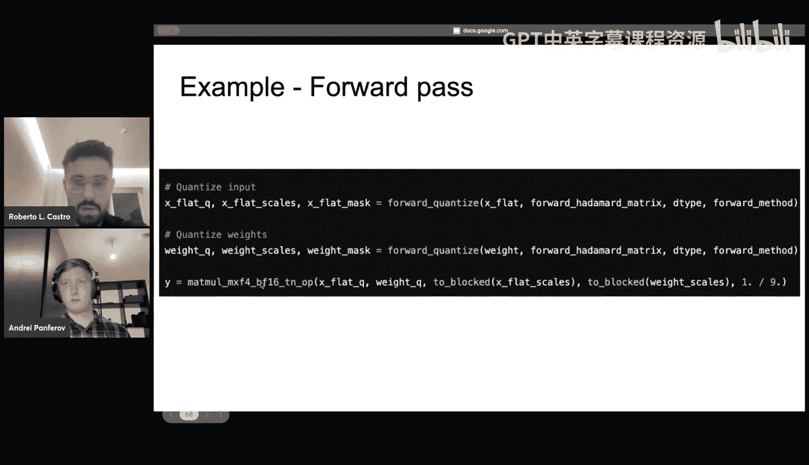

通过这个，你已经可以看到这个方法有多复杂。由于我之前展示的最优区域不仅取决于方法的精度，还取决于速度提升，因此我们论文的第四个也是 arguably 最重要的部分是我们提供的、真正使这个方法成为可能的内核。

---

## 实现高性能的 CUDA 内核

上一节我们介绍了 Quartet 算法的复杂性，本节中我们来看看实现其高效运行的关键——高性能 CUDA 内核。

正如 Andre 提到的，我们方法的最优区域不仅取决于精度，还取决于速度提升。因此，我们投入了大量时间并继续投入大量时间来优化 CUDA 内核，因为内核的真实速度提升将决定我们方法的最优区域大小。速度提升越好，这个最优区域就越大，落在该区域内的模型就越多。

在深入内核细节之前，我先简要概述一些信息。当我们提到 MxFP4 时，指的是我们在 Quartet 论文中使用的 FP4 类型。这意味着我们的值由这种 E2M1 格式表示：1 位用于符号，2 位用于指数，1 位用于尾数。对于矩阵中的每一列，每 32 个元素组将被分配一个缩放因子。对于 MxFP4 格式，这个缩放因子由一个 E8M0 的 FP8 值表示，即所有 8 位都用于表示指数值。

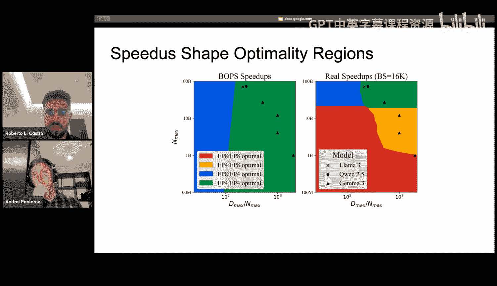

在新的 Blackwell 架构中，我们有硬件支持来执行这种操作，其中要相乘的 A 矩阵和 B 矩阵将由元数据信息（即这些缩放因子）额外表示。这个缩放因子应用于矩阵乘法的内部维度。

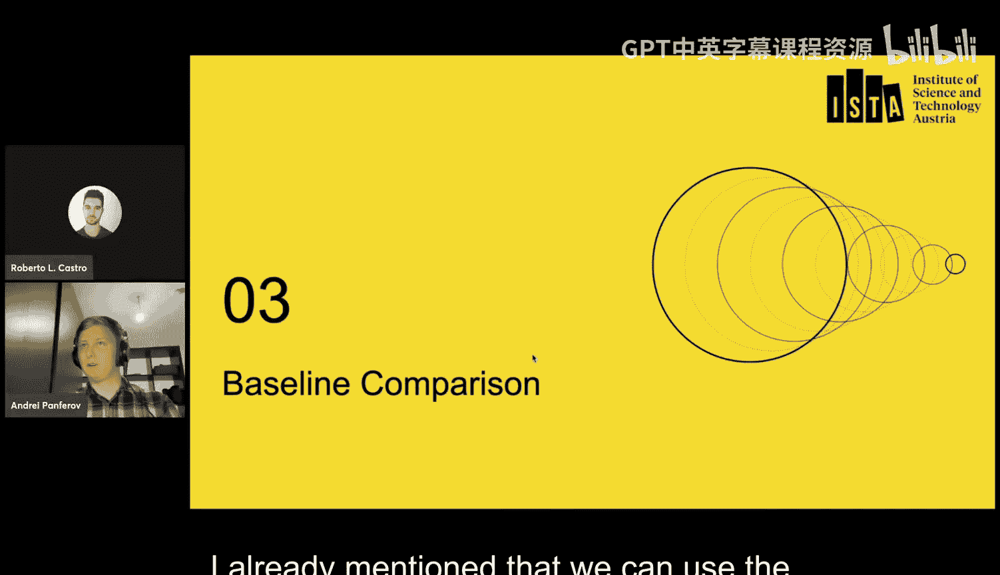

在硬件方面，这意味着我们将有两个矩阵，在 Tensor Core 中，我们可以用一个新指令执行这些矩阵乘法，该指令不仅接收输入矩阵，还接收此元数据信息以产生输出矩阵。

Andre 已经强调过矩阵乘法在大型语言模型中的影响。这些模型的大部分运行时间由线性层中的矩阵乘法表示，这意味着它们是必须尽可能优化的关键操作。这需要仔细调整，但也意味着我们必须避免额外操作（如我们刚刚讨论的哈达玛操作）的开销。

哈达玛变换作为一种归一化，其大小至关重要。当哈达玛大小小于 256 时，要解决的问题是内存瓶颈；当它大于或等于 256 时（这在很大程度上取决于所使用的架构），问题就变成计算瓶颈。因此，应用哈达玛变换所需的时间将由加载矩阵所需的时间决定，因为它是内存瓶颈问题。这意味着，如果我们非常高效地移动数据，我们的方法将会快得多。这也意味着哈达玛变换在某种程度上可以被矩阵加载隐藏，因为我们无论如何都必须加载这些矩阵以量化它们。

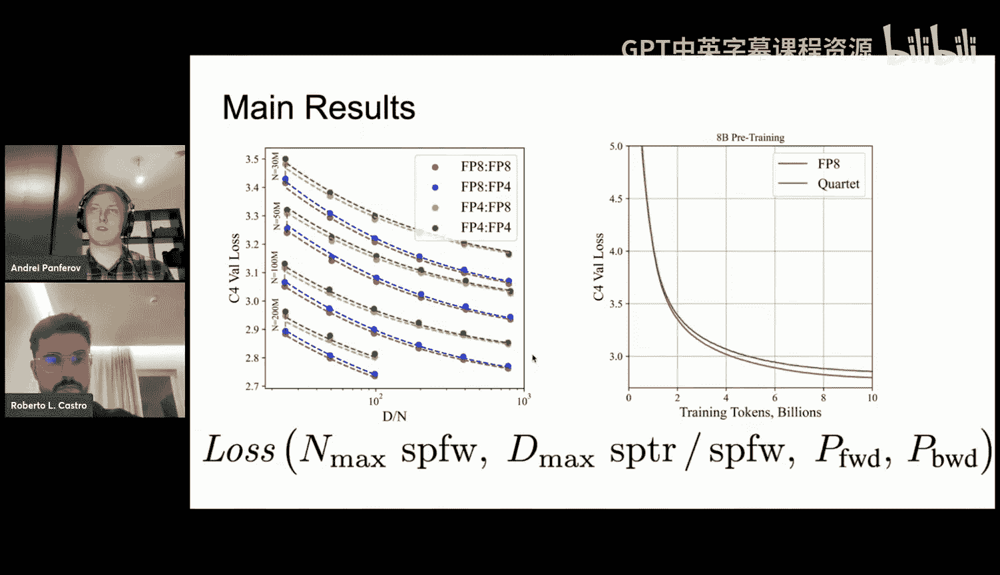

由于这是一个内存瓶颈问题，这意味着我们不一定必须应用哈达玛变换，如果我们愿意，实际上可以在这里应用任何类型的变换。我们使用一个融合的 CUDA 内核解决了哈达玛大小为 32 的这个 alpha 投影问题，我们发现它们确实有效，所以我们真的不需要使用更大的哈达玛大小来使我们的方法工作。

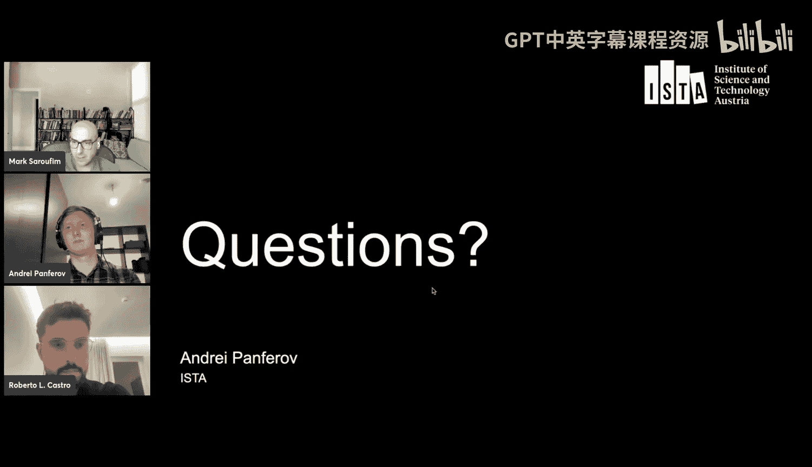

当我们提到这个密集哈达玛变换器时，实际上我们有一个针对特定组大小的这种块对角矩阵。如果对角线上的所有这些块基本相同，我们可以将之前的问题转换为这个。由于我们专注于 MxFP4，我们可以证明哈达玛大小为 32 是合理的。这意味着，我们可以将这个问题转换为一个普通的 GEMM 操作。

利用这种解决哈达玛变换的替代方法，我们定义了一个自定义的 CUTLASS GEMM 模板来以下列方式执行：内部维度固定为 32，所有剩余的元素将代表左侧输入矩阵的外部维度。然后，我们可以以下列方式定义这些 tile 形状：M 维度为 128，K 维度为 32（因为它永远不会大于 32）。以下配置仅取决于我们使用的特定硬件架构。

我们所做的是：我们有两个 Bf16 输入矩阵，一个是要量化的矩阵，另一个是哈达玛矩阵。然后，我们使用这个自定义的 CUTLASS GEMM 模板应用密集哈达玛变换，并且这些分离的累加将发生在 FP32 上。输出将存储在共享内存中。然后，我们定义了一个自定义的 epilogue 来产生以下三个结果：第一个是量化为 E2M1 格式的 FP4 值；第二个参数是我在第二张幻灯片中提到的具有 E8M0 格式的缩放因子；第三个参数是将在反向传播中使用的裁剪掩码（这是一个二进制掩码）。

这里一个非常重要的信息是，这个自定义的 epilogue 几乎是免费的，因为它发生在本地。我们不需要同步，因为每个线程将包含所有需要的信息。我们只需要在哈达玛变换后获取信息，计算几个元素，然后写回全局内存，不需要额外的同步。

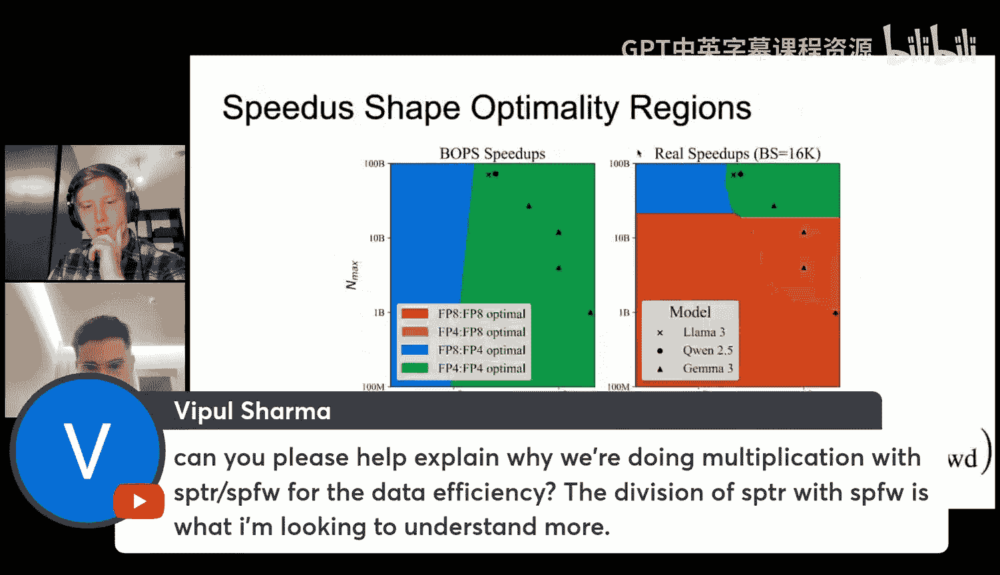

这个先前的幻灯片描述了我们实现的融合量化内核。在这个矩阵乘法之前，我们必须添加一个额外的方法，即缩放因子重排。这与量化或我们的实现无关，这只是因为新的 Blackwell Tensor Core 要求元数据信息以特定方式存储，即我左侧显示的布局。这将应用于我们在上一步中计算的 E8M0 缩放因子。

总的来说，这里我展示了一个如何执行这三种方法的示例。这个示例代表了我们方法的前向路径。我们将接收输入和权重，并即时量化它们。这个前向量化方法应用哈达玛变换，然后计算三个输出：FP4 值、FP8 缩放因子和二进制掩码。然后，使用这些缩放因子，我们调用这个双块函数，它将信息重新排列为这个新的 Blackwell Tensor Core 所需的特定格式。然后，我们就可以调用这个 FP4 MxFP4 GEMM 内核了。

---

## 性能分析与未来工作

上一节我们详细介绍了内核实现，本节中我们来看看其性能表现以及未来的优化方向。

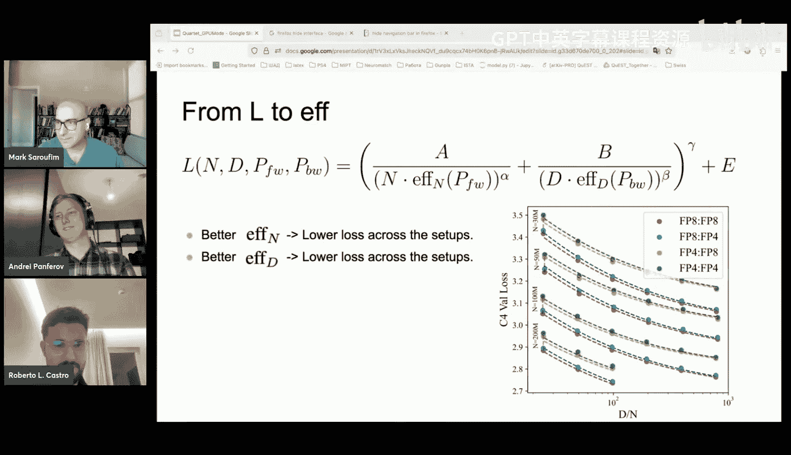

这里我有 Llama 70B 模型某些层的性能细分。Y 轴显示了这三种方法各自所占运行时间的百分比。实际上，我们可以看到，对于较大的矩阵，矩阵乘法占据了运行时间的重要部分，但对于较小的矩阵，量化相关操作的开销更大。这与我们的实现无关，只是随着我们增加算术强度，矩阵乘法将花费更长时间，我们可以轻松地隐藏这些