# 17：PCCL 容错集合通信库教程

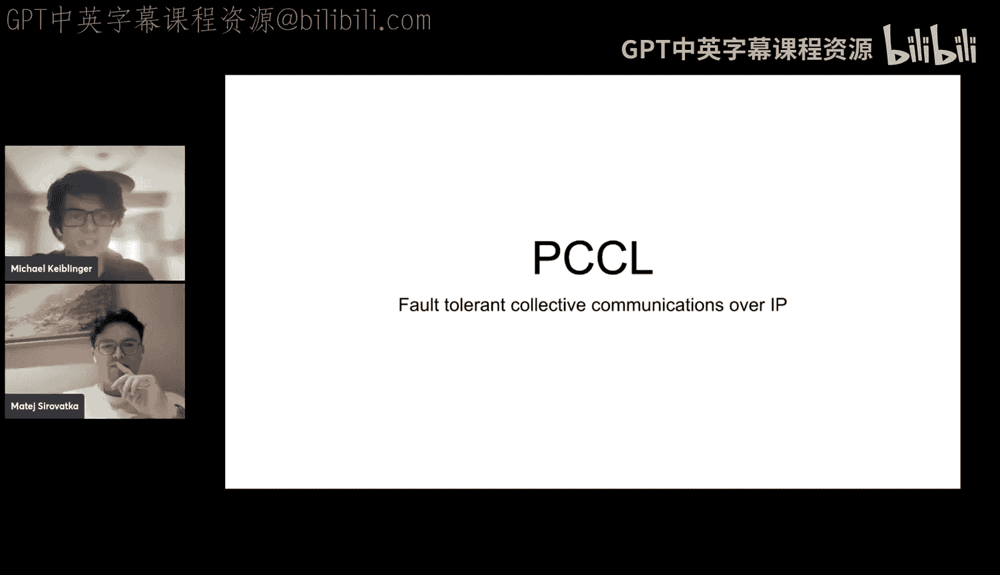

在本节课中，我们将学习PCCL（Prime Collective Communications Library），这是一个支持在IP网络上进行容错、确定性集合通信的库。我们将了解其设计动机、核心概念、编程范式以及实现容错所面临的挑战。

## 概述：为什么需要PCCL？

PCCL的动机是在互联网上执行All-Reduce操作，并容忍所有可能的I/O故障。它提供了实现多种分布式优化方案的基元，从朴素的数据并行到Dilico流式或延迟应用的Eager Dilico。PCCL的一个主要优势是能保证所有节点上集合通信操作的**比特级相同结果**，这有助于促进共享状态（包括模型和优化器状态）的独立推进，达到完全相同的最终状态，从而消除节点间状态漂移的问题。

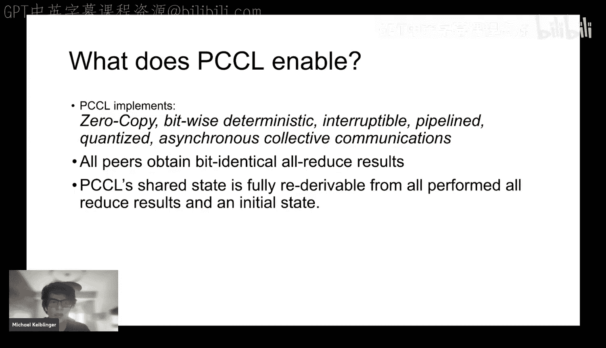

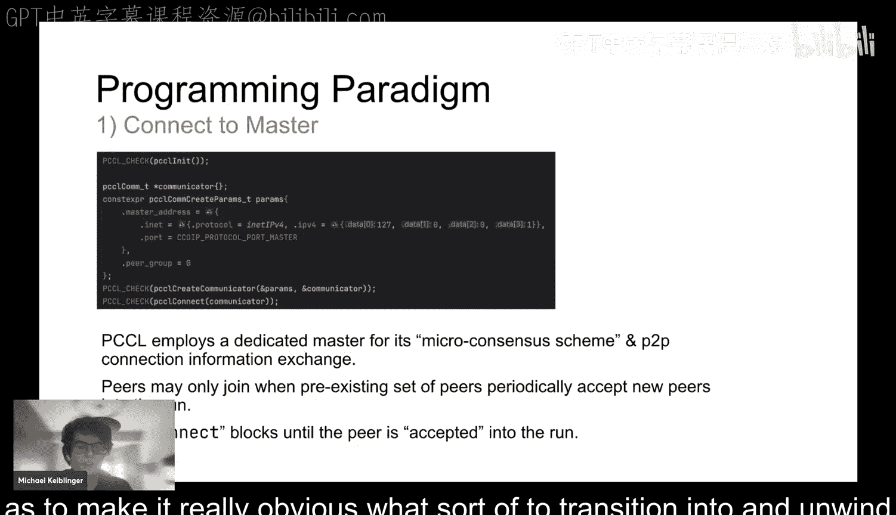

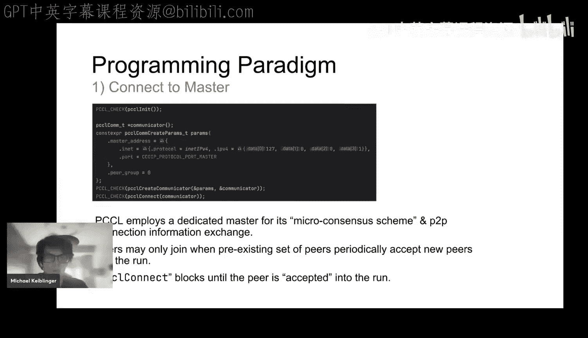

## 核心概念与编程范式

上一节我们介绍了PCCL的目标，本节中我们来看看它的核心特性和基本编程模型。

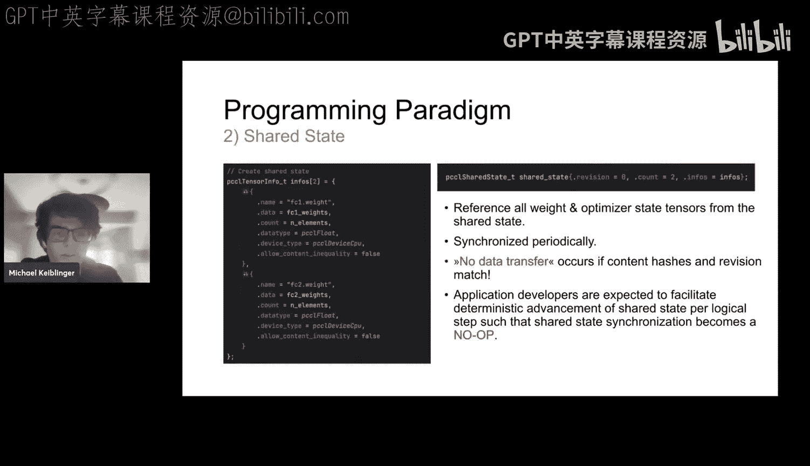

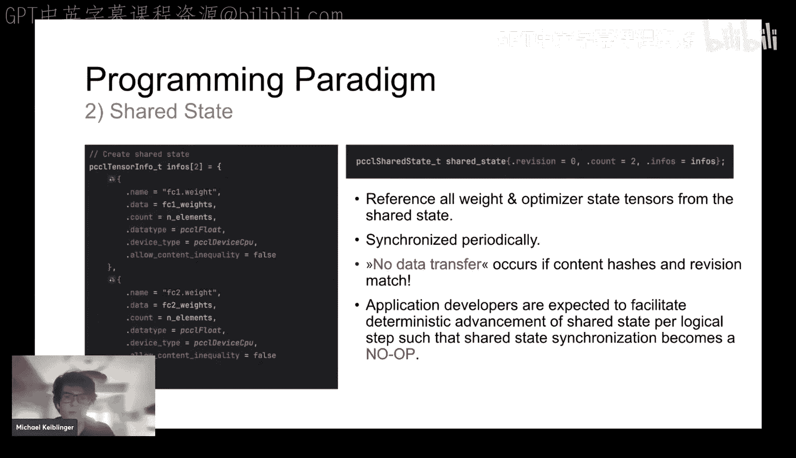

PCCL支持以下特性：
*   **零拷贝**：在发送调用前不复制数据。
*   **比特级确定性**：给定相同输入，保证相同的输出结果。
*   **可中断**：发生I/O故障时可中断操作并妥善回滚。
*   **流水线化**：实现教科书式的MPI流水线All-Reduce。
*   **量化**：支持以低于源数组的精度发送数据，内部以更高精度累加。
*   **异步**：可启动多个操作并在选择的时间等待它们。

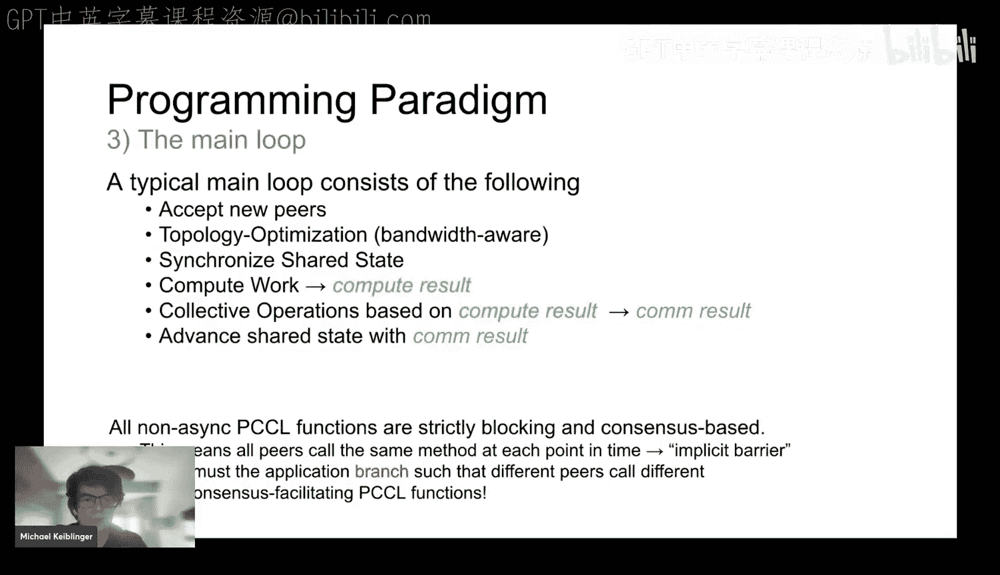

这些特性使得共享状态可以从所有已执行的归约结果和初始状态完全重新推导出来。

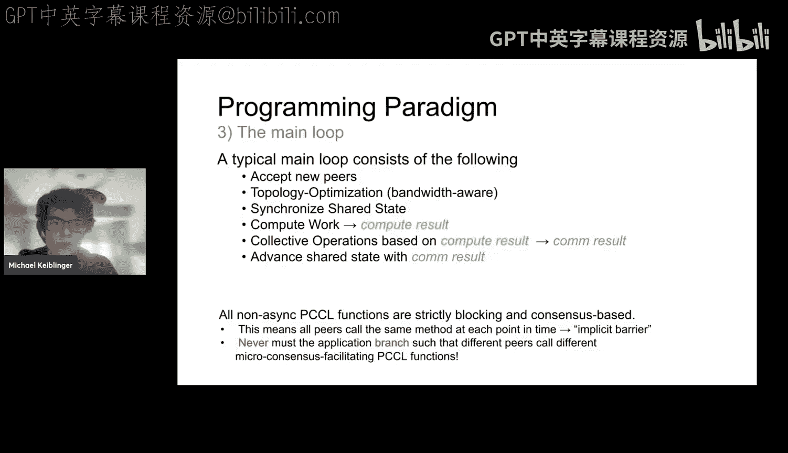

### 初始化与通信器

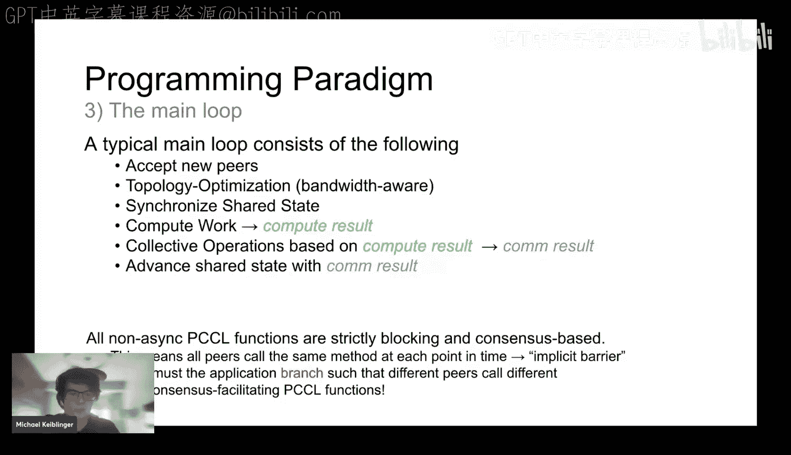

每个PCCL应用程序首先需要初始化PCCL，然后创建一个指向专用主节点的通信器。这个轻量级主节点主要作为事实来源，存储连接信息并促进协议的状态转换，使得故障发生时的回滚更加明确和实用。

### 微共识方案与节点管理

PCCL内部采用一种**微共识方案**。许多阻塞的PCCL API调用会形成一个屏障，并协商下一步操作，例如接受新节点。

节点只能在现有节点集**明确接受**新节点时加入。这通常在每个训练步骤中周期性发生，通过调用 `pcc_update_topology` 实现。此时，世界大小可以增加。而在代码的其他部分，世界大小只会因非正常故障而减少，不会增加。

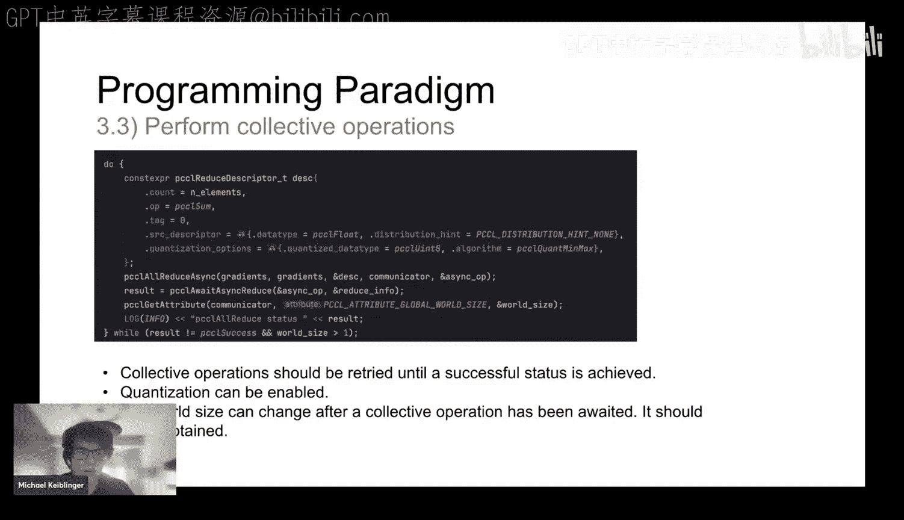

`pcc_connect` 会从连接方的角度阻塞，直到进入被接受的状态。

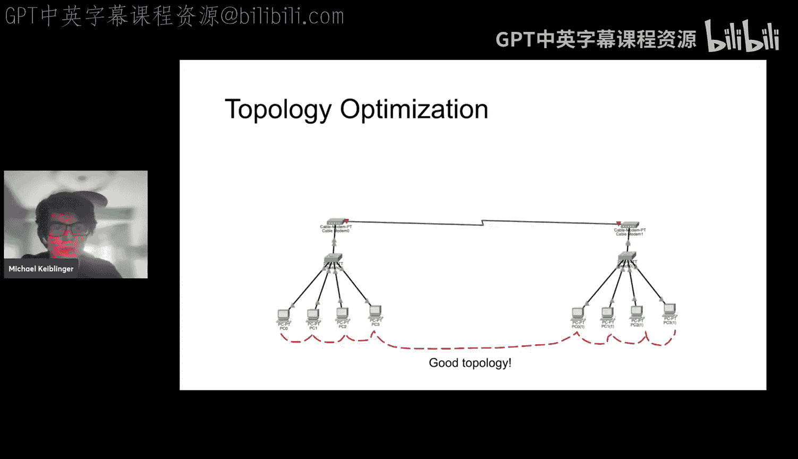

### 共享状态同步

共享状态引用所有权重和优化器状态，并定期同步。PCCL使用一个简单的、非加密的、为GPU优化的哈希函数（称为`simple_hash`）对所有共享状态内容进行哈希。

如果哈希一致，则同步是无操作；如果不一致，则会与拥有流行共享状态的随机节点配对以重新获取状态。理想情况下，应用程序应促进每个逻辑步骤共享状态的确定性推进，使得同步始终是无操作。这之所以合理，是因为所有节点都获得相同的归约结果，并且从相同的初始状态开始应用更新。

以下是共享状态同步后的一个最佳实践断言示例：
```python
# 初始同步后，断言不应再接收任何共享状态字节
assert rx_bytes == 0, "No further shared state should be received after initial sync."
```

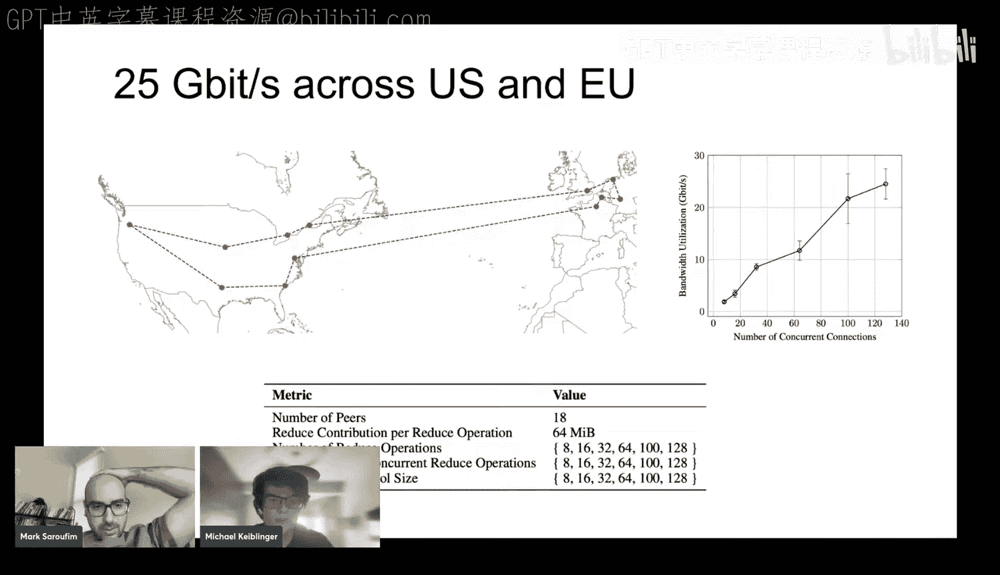

## 主循环与容错集合通信

上一节我们了解了状态管理，现在进入应用程序的主循环和具体的集合通信操作。

一个典型的PCCL应用程序主循环包含以下阶段：
1.  **接受新节点**：所有现有节点同意新节点加入。
2.  **优化拓扑**：进行速度测试，构建带宽和可达性矩阵，并形成最优的通信环。
3.  **同步共享状态**：理想情况下是无操作，主要作为防护机制并使新节点对齐状态。
4.  **执行计算工作**：例如模型的前向和反向传播。
5.  **执行集合通信操作**：基于计算结果进行归约等操作。
6.  **推进共享状态**：使用通信结果更新状态。

所有非异步的PCCL函数都是严格**阻塞且基于共识的**。所有节点必须在同一时间调用相同的方法，这形成了一个隐式屏障。**一个重要规则是：应用程序绝不能分支，导致不同节点调用不同的PCCL函数**，否则会导致死锁。

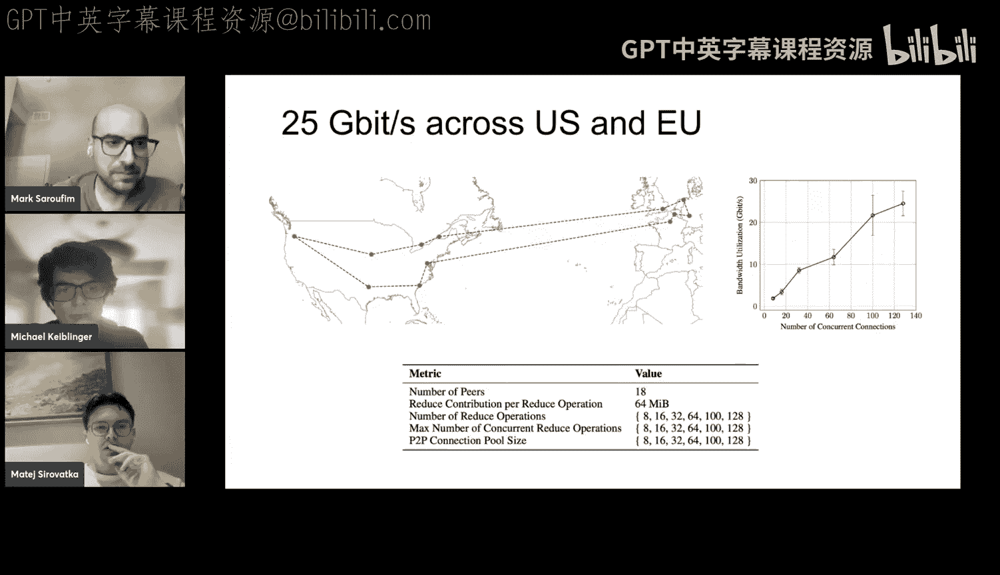

### 执行集合通信

由于需要容错，我们希望重试集合通信操作直到成功。操作可能因节点掉线等原因失败，此时PCCL会正确地回滚到用户的调用点并返回错误状态，用户可以决定重试或中止。

可以启用量化以节省带宽，例如使用 `in8` 模式。在等待一个集合通信操作后，世界大小可能已改变，因此应重新获取世界大小，避免脏的应用程序状态。

## 拓扑优化与容错含义

我们刚刚讨论了主循环，其中关键一步是拓扑优化。那么，为什么要进行拓扑优化呢？

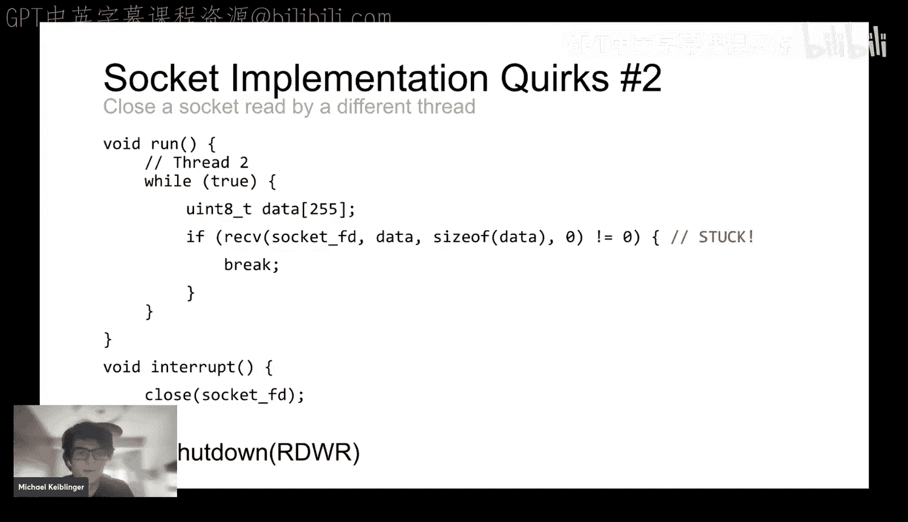

拓扑优化的目标是基于节点间的实际网络速度（通过速度测试获得）构建一个高效的通信环，以最大化带宽利用率，避免数据包频繁通过慢速链路。一个糟糕的拓扑（例如，仅按节点加入顺序连接）会导致性能严重下降。

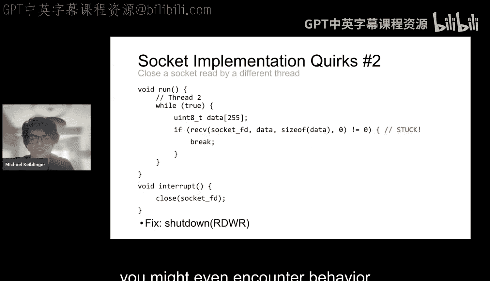

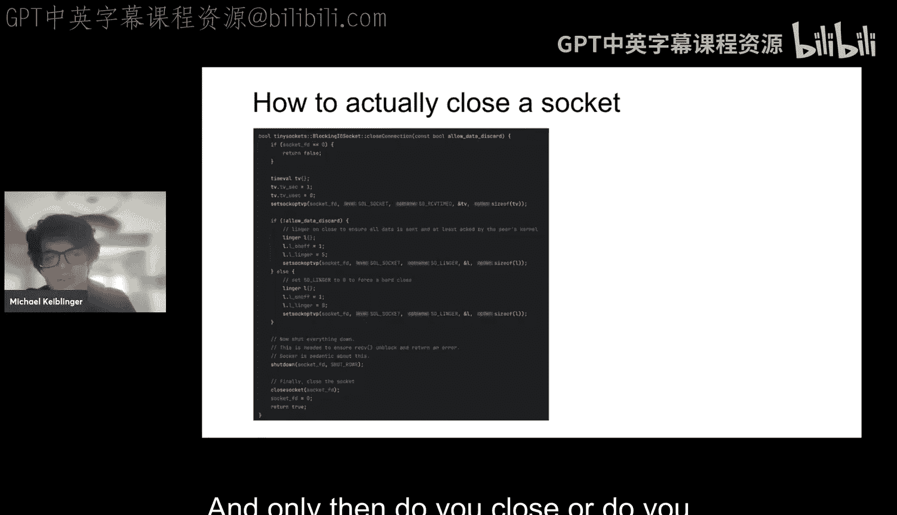

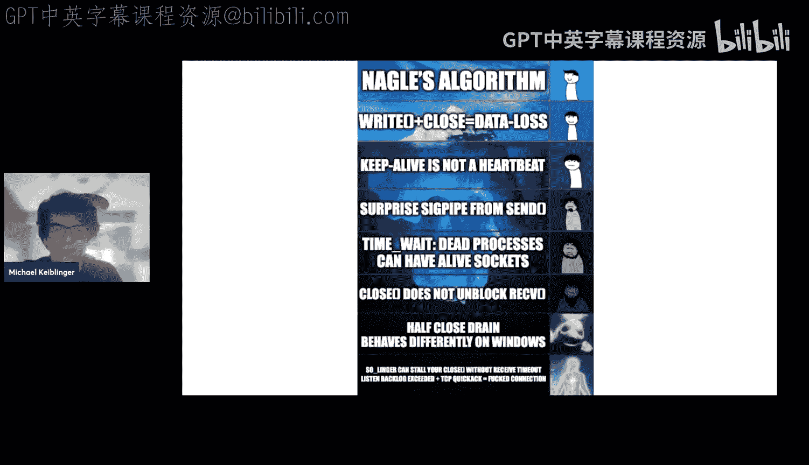

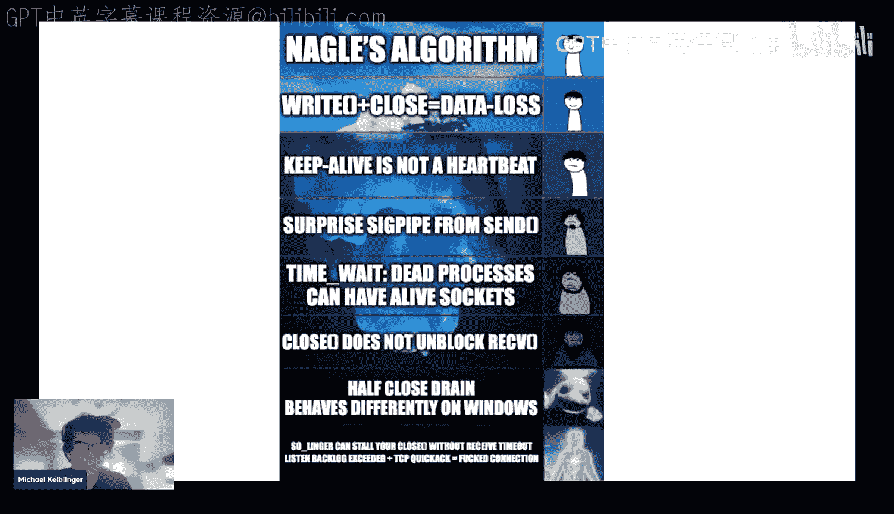

PCCL还会考虑部分节点对不可达的情况。如果节点A无法ping通节点B，则通信环将绕开此不可达路径（如果可能）。如果无法实现，则导致此情况的节点将被踢出。

### 实现高吞吐与真正容错

PCCL的一个标题是“在公共互联网上实现45 Gb/s的All-Reduce”。这通过**每流公平队列**技术实现。通过建立大量连接并在内部将数据分片分发到这些连接上，PCCL可以规避单个TCP流因长延迟或公平队列策略导致的低吞吐问题，从而实现高聚合带宽。

**容错**意味着能够容忍任何I/O故障，并且所有错误路径都必须被正确且优雅地处理。这包括在发现故障时，可能需要通过数据包通知主节点，由主节点重新配置拓扑并指导节点重建对等连接。设计协议时必须仔细处理跨连接数据包处理链的顺序问题，因为数据包到达顺序没有保证，这需要通过主节点协调的状态机来建立共识。

创建真正容错的系统在实践中非常困难。API设计必须谨慎，避免做出无法实现的承诺。例如，早期PCCL允许节点在任何时间加入，但这导致在集合操作进行中加入的节点无法获得有效的更新贡献，使得API无法实现。

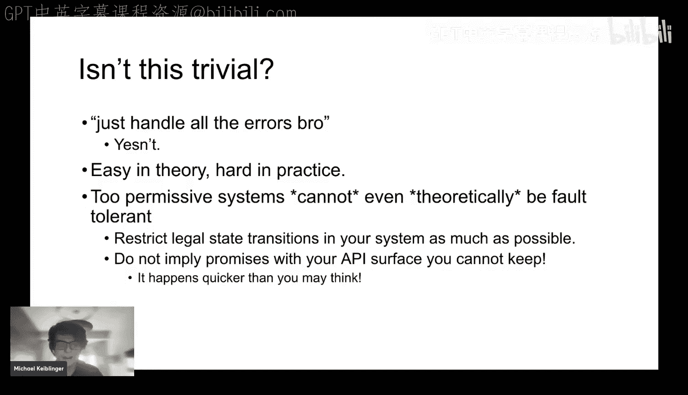

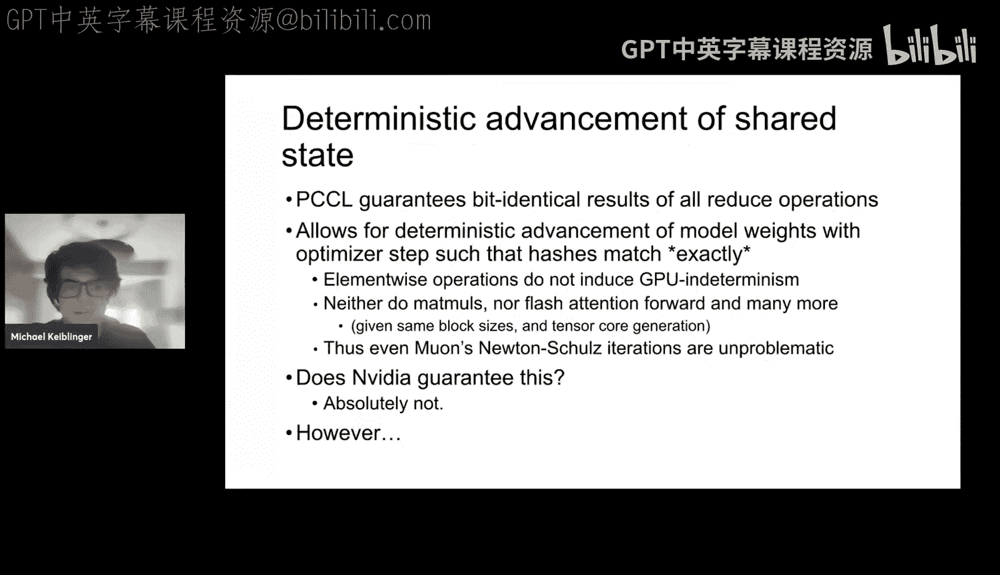

## 确定性训练与GPU

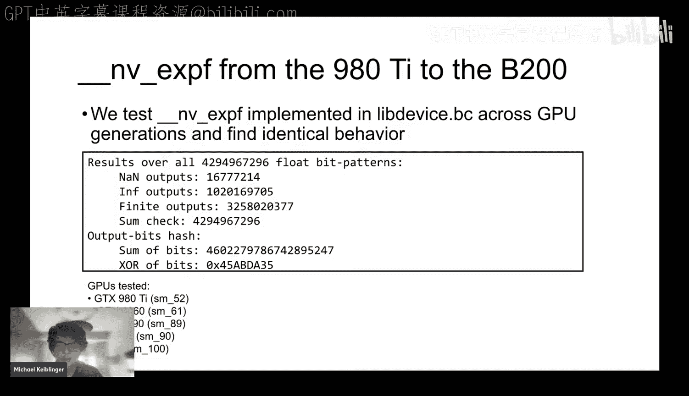

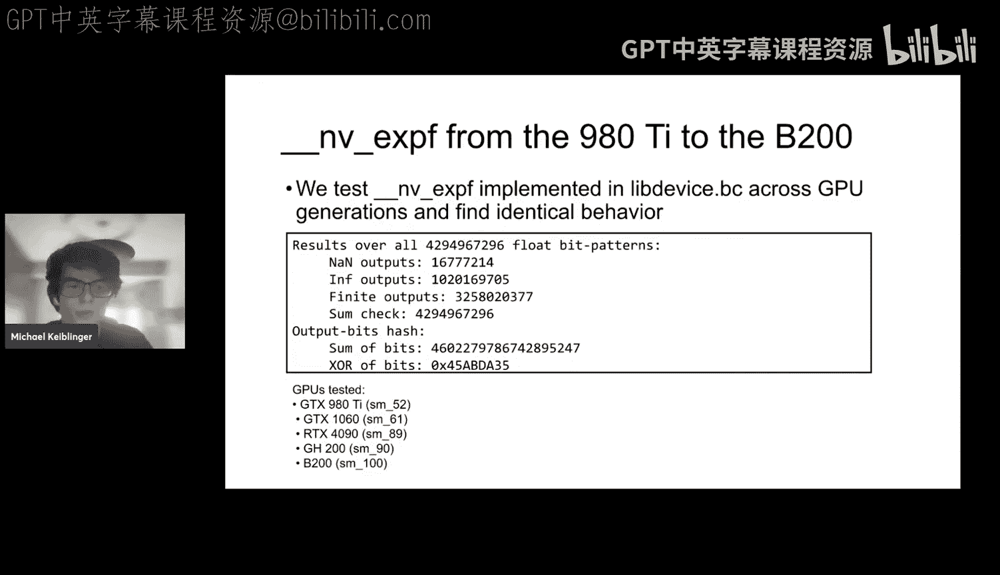

之前我们提到PCCL保证比特级相同结果，这为实现**共享状态的确定性推进**奠定了基础。这对于许多仅由逐元素操作组成的优化器（如Adam）来说是微不足道的，因为这些操作不会引入GPU非确定性。

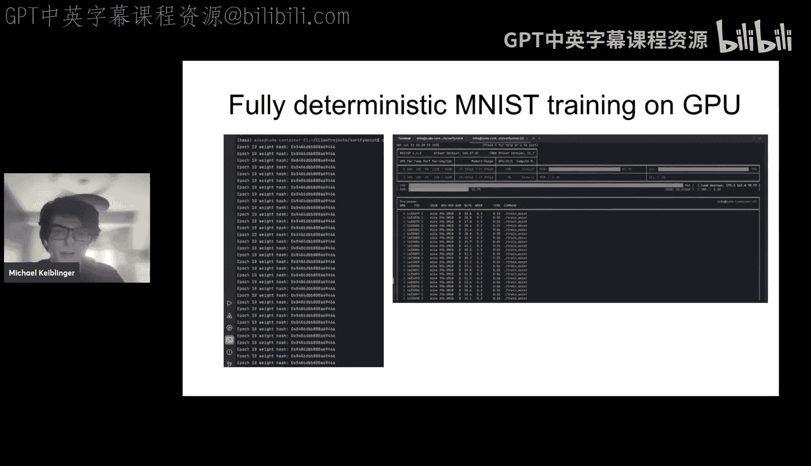

即使涉及矩阵乘法等操作，在许多情况下，通过使用确定的块大小、内核启动参数以及确定的算法（如确定性的Flash Attention前向/后向），也可以实现GPU上的确定性训练。虽然NVIDIA不正式保证这一点，但实际观察发现，从GTX到B200的多代GPU上，许多核心操作的数值行为是一致的。

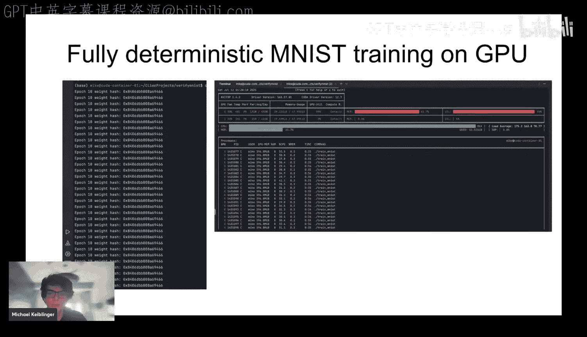

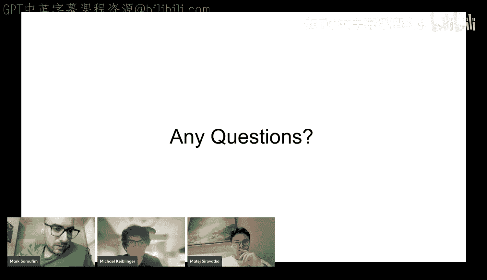

理论上，这可以扩展到训练Transformer语言模型。PCCL只要求优化器步骤是确定的，数据加载中的非确定性则不影响其核心机制。

## 实现容错的挑战：套接字API的“痛苦”

构建真正容错的系统需要深入理解底层套接字API，而这些API在不同操作系统上存在微妙差异和陷阱。

套接字行为与文件描述符不同。例如，直接关闭套接字可能导致附近发送的数据永远无法送达，因为会触发连接重置。需要使用 `SO_LINGER` 选项进行更优雅的关闭，并可能设置超时。

中断阻塞在 `recv` 上的线程并非简单地关闭套接字文件描述符即可，在某些系统上可能还需要调用 `shutdown` 来解除阻塞。

在实践中，正确关闭套接字的步骤可能非常复杂，需要设置接收超时、优雅关闭连接的两端，然后才关闭套接字。

这只是套接字实现 quirks 的冰山一角，其他还包括：
*   **Nagle算法**可能导致小数据包延迟发送。
*   **Keep-alive 不是心跳**，不配置可能导致数小时才检测到对端死亡。
*   **`send` 可能产生 `SIGPIPE` 信号**，如果不处理会杀死进程。
*   **`close` 不一定会解除 `recv` 的阻塞**。
*   **半关闭和排空行为在Windows上不同**。
*   **`SO_LINGER` 没有超时可能导致关闭挂起**。
*   **监听积压队列与TCP快速打开结合**可能导致半建立连接。

测试这些边缘情况非常困难，通常需要结合原理推理、大量测试以及在不同操作系统和环境下的实际部署调试。

## 总结

在本节课中，我们一起学习了PCCL容错集合通信库。我们从其设计动机和保证比特级确定性的核心目标开始，探讨了其编程范式，包括初始化、微共识、节点动态管理和共享状态同步。我们剖析了一个典型PCCL应用的主循环步骤，并深入了解了拓扑优化对于在复杂网络环境下实现高性能的重要性。

我们重点讨论了实现真正容错通信的挑战，特别是底层套接字API在不同平台上的微妙差异和陷阱，这些是构建健壮分布式系统时必须克服的困难。最后，我们看到了PCCL的确定性保证如何与GPU计算结合，为完全确定性的分布式训练打开了可能性。

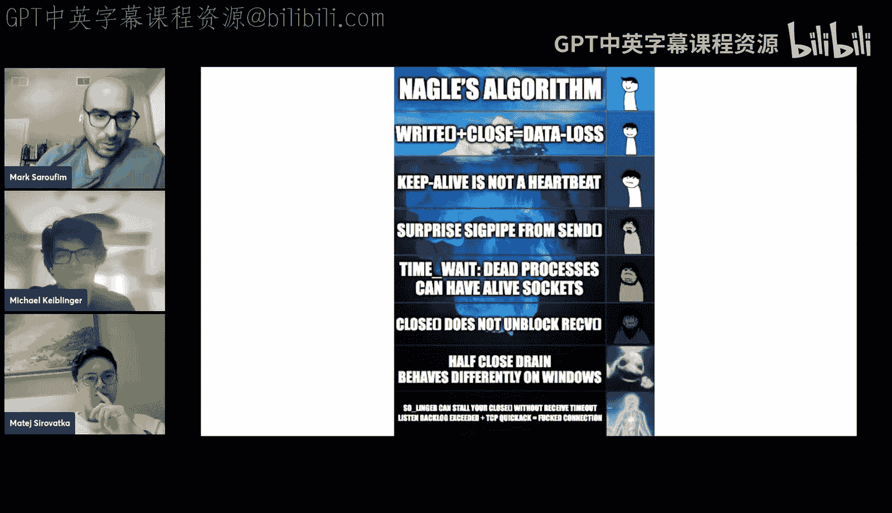

PCCL代表了一种对可靠性和确定性有更高要求的系统设计思路，旨在为机器学习基础设施提供更坚固的基础。