# 18：ScaleML系列 - FlexOlmo：面向灵活性的开放语言模型

## 概述

在本节课中，我们将学习混合专家模型的基本原理及其在分布式数据训练场景下的创新应用。课程首先由组织者介绍混合专家模型的核心概念和GPT OSS中的实现细节，然后由主讲人Se Wun深入讲解其团队提出的FlexOlmo框架，该框架旨在解决不同数据所有者在不共享原始数据的情况下协作训练单一模型的问题。

---

## 混合专家模型基础

上一节我们概述了课程内容，本节中我们来看看混合专家模型的核心思想。

我们知道，更多的模型参数通常能带来更好的性能，但同时也意味着更高的计算成本。基础模型是真正的多任务学习者。对于一个特定的输入，我们真的需要激活所有参数吗？混合专家模型采取了一种不同的视角：我们可以为每个输入只使用模型参数的一个子集。

直观上，你可以将其理解为让不同的专家拥有不同的专长。在实践中，这些专家可能没有清晰的语义划分，但这种设计允许你在不显著增加计算量的情况下扩大模型规模。例如，在GPT OSS模型中，较大的版本约有1200亿参数，但每次推理只激活50亿参数。

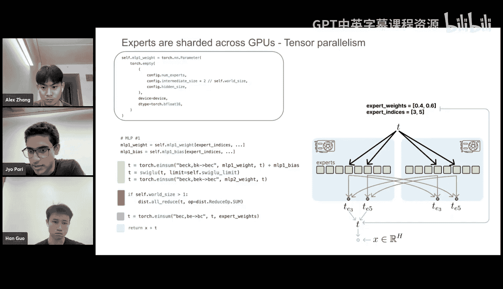

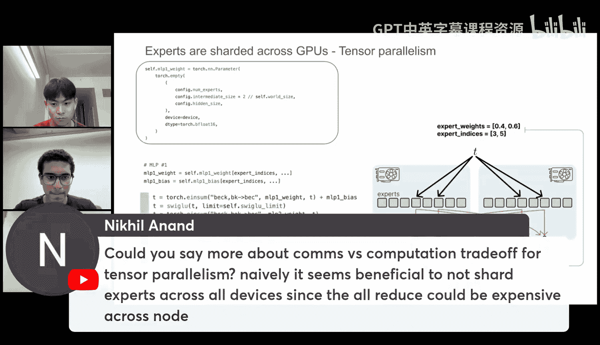

### 混合专家模型的工作原理

以下是混合专家模型在GPT OSS中的关键实现步骤，我们将通过代码片段来理解其前向传播过程。

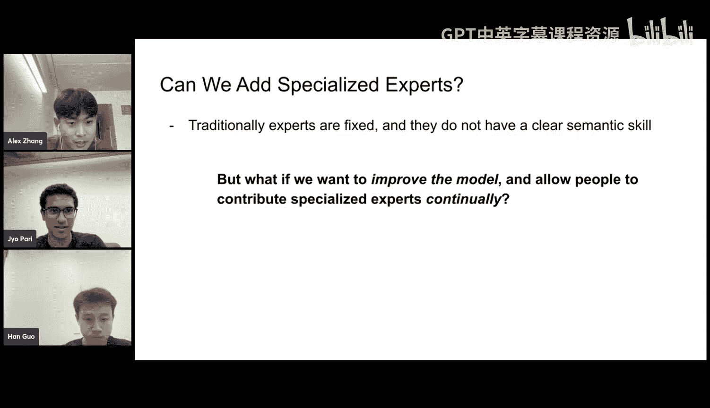

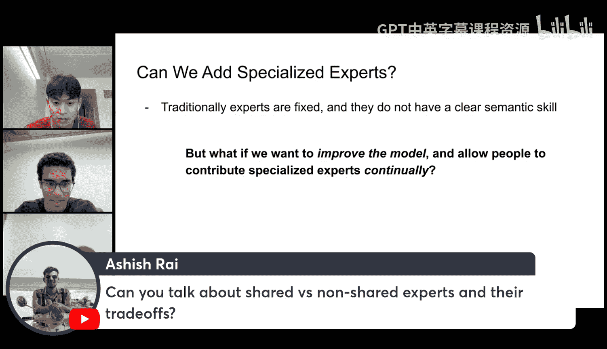

```python
# 假设输入是一个token，其隐藏维度为H
x = token_input  # 形状: [H]

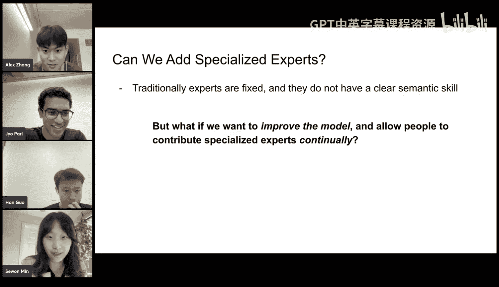


# 1. 层归一化
x_norm = rms_norm(x)

# 2. 路由计算：将token投影到专家数量的空间，得到路由分数
router_logits = x_norm @ W_gate  # W_gate形状: [H, num_experts]
# 应用softmax得到每个专家的权重
router_probs = softmax(router_logits, dim=-1)

# 3. 选择Top-K专家
top_k_weights, top_k_indices = topk(router_probs, k=K)  # 例如K=2或4

# 4. 归一化所选专家的权重
top_k_weights = top_k_weights / top_k_weights.sum(dim=-1, keepdim=True)
```

接下来，我们需要将token发送给选定的专家进行处理。专家本质上是替换了原始Transformer中的MLP层。在GPT OSS中，每个专家是一个独立的MLP。

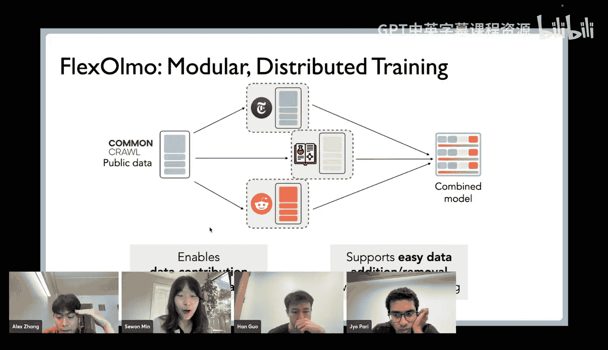

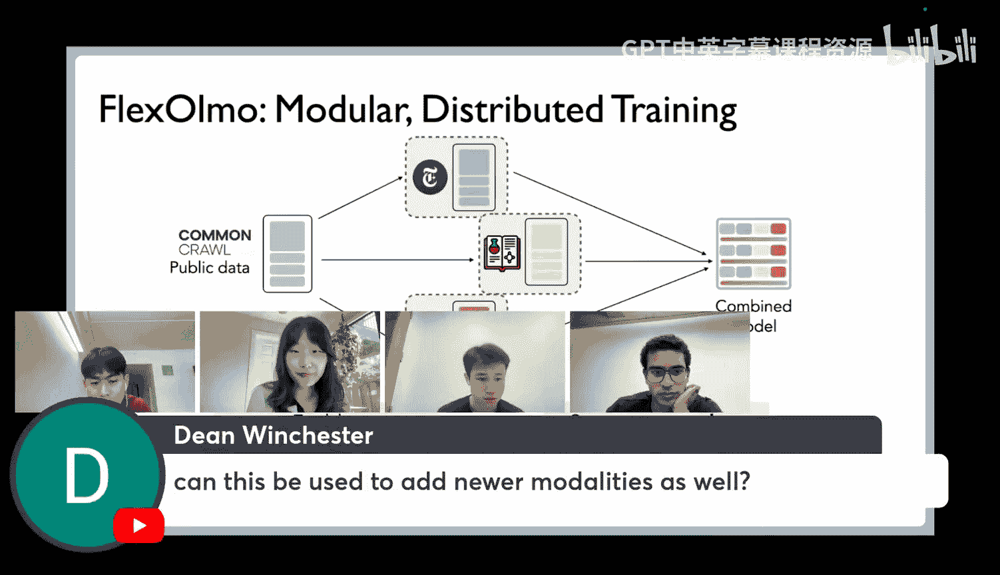

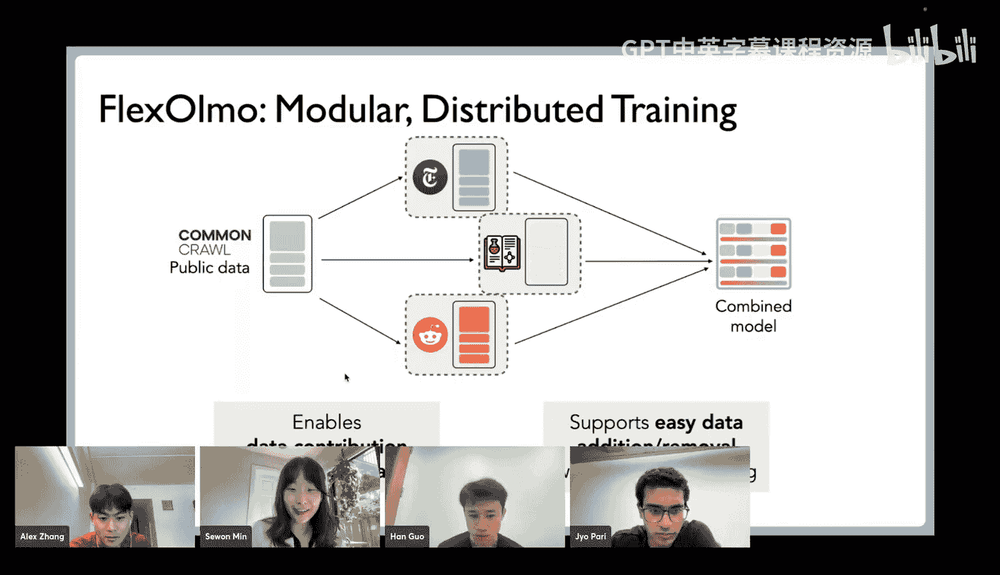

```python
# 5. 初始化最终输出
final_output = torch.zeros_like(x)

# 6. 对每个选定的专家进行处理
for i, (expert_idx, weight) in enumerate(zip(top_k_indices, top_k_weights)):
    # 获取对应的专家MLP
    expert_mlp = experts[expert_idx]
    # token通过专家MLP
    expert_output = expert_mlp(x_norm)
    # 加权累加到最终输出
    final_output += weight * expert_output

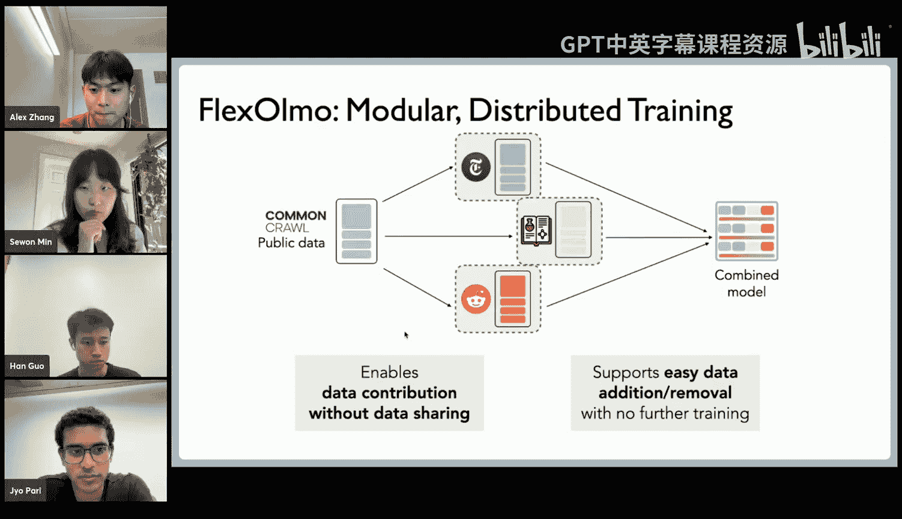

# 7. 添加残差连接
output = x + final_output
```

### 张量并行与通信开销

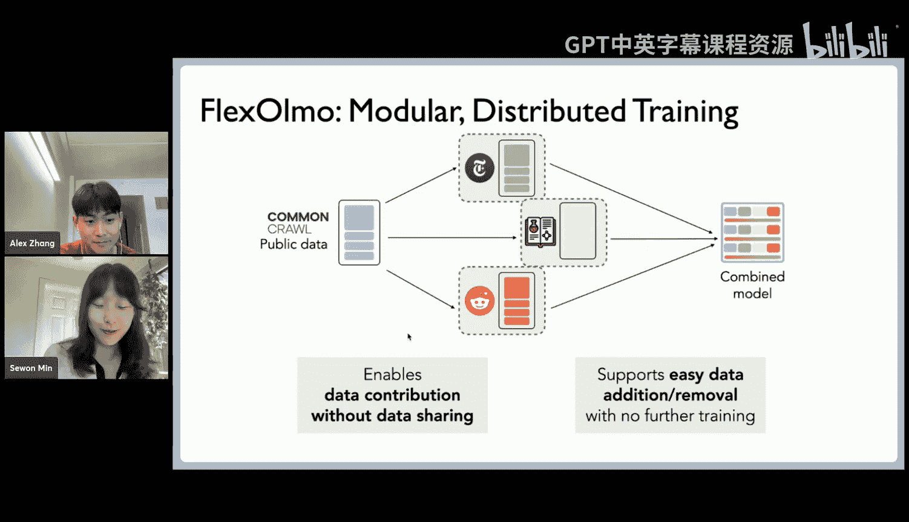

在大型模型中，专家MLP的参数通常使用张量并行进行切分。这意味着每个GPU只持有每个专家MLP参数矩阵的一部分。

*   **计算过程**：每个GPU使用其持有的参数分片与输入token进行计算，得到一个部分结果。
*   **通信过程**：所有GPU通过`all-reduce`操作通信并求和这些部分结果，最终每个GPU都得到完整的专家输出。

张量并行旨在降低单次推理的延迟，但其代价是增加了设备间的通信开销。在网络带宽受限的情况下，张量并行可能不是最优选择。

### 训练稳定性与负载均衡

训练混合专家模型的一个主要挑战是**路由器坍缩**，即路由器可能倾向于将所有token都路由到少数几个专家，这违背了利用专家多样性的初衷。

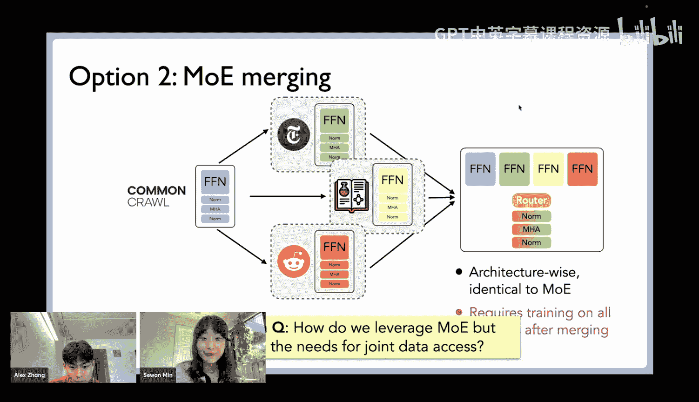

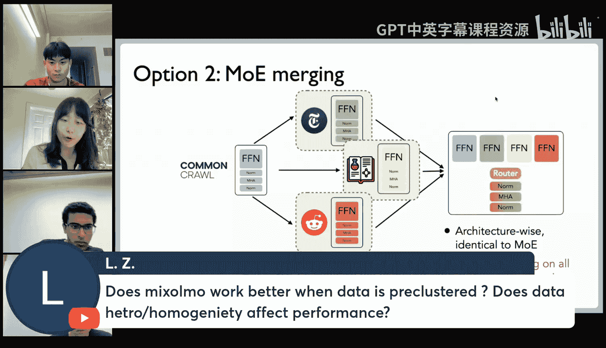

为了解决这个问题，训练过程中会引入**辅助损失函数**（如负载均衡损失）。该损失函数鼓励token更均匀地分布在不同专家之间，确保所有专家都能得到训练。

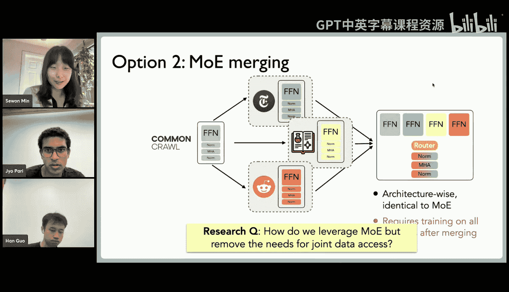

---

## FlexOlmo：面向分布式数据的混合专家模型

上一节我们介绍了标准的混合专家模型，本节中我们来看看如何利用其模块化特性解决分布式数据训练的难题。

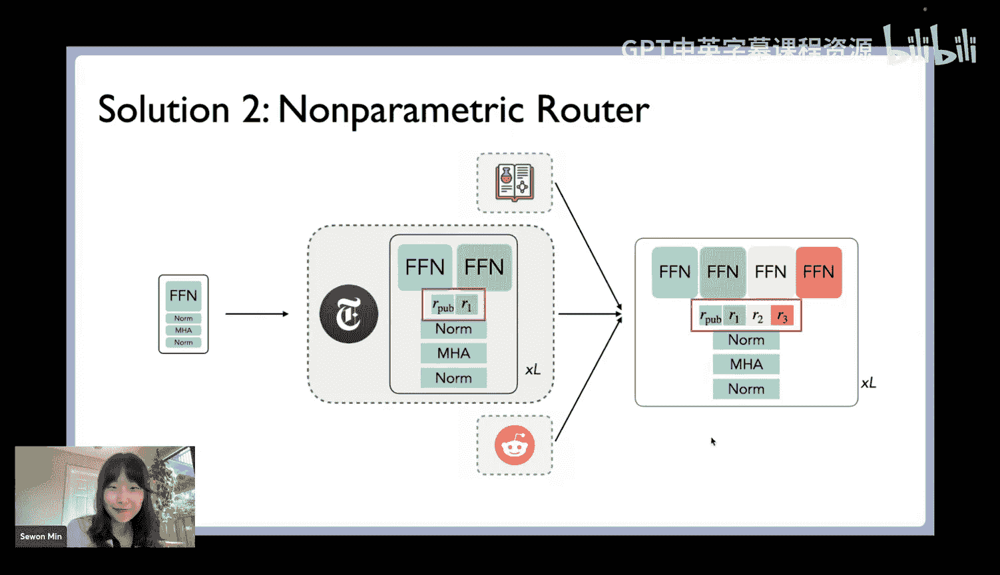

### 问题定义

标准的语言模型训练假设开发者能集中访问所有训练数据。然而在现实中，数据访问权限往往是一个谱系：
*   数据可能因隐私、商业价值或法规限制而无法集中。
*   数据可能在不同时间点可用。
*   我们希望在无需从头重新训练整个模型的情况下，能够灵活地添加或移除数据源。

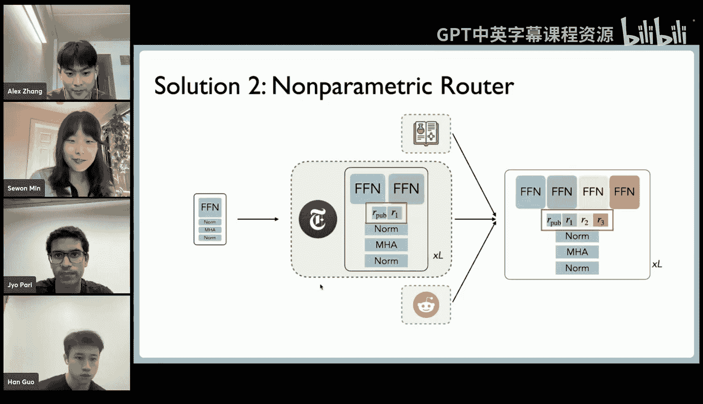

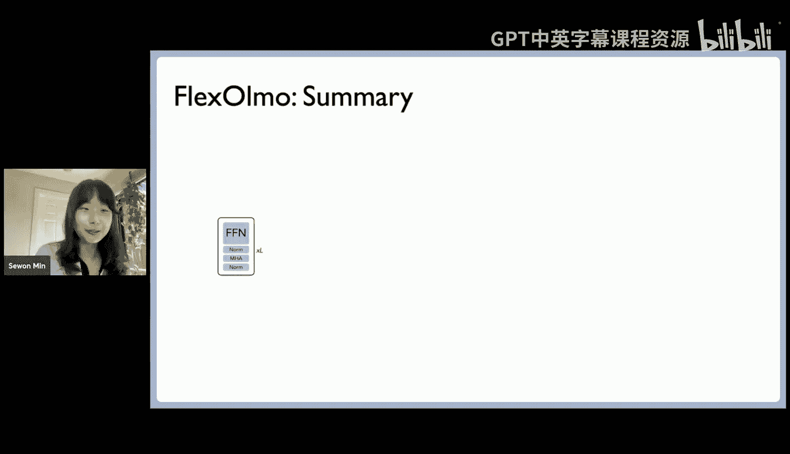

FlexOlmo旨在支持**模块化的分布式训练**，其设置如下：
1.  一个在公共数据上训练的**共享基础模型**。
2.  多个数据所有者，各自在本地、独立地使用自己的私有数据继续训练这个基础模型。
3.  最后，将这些独立训练的模型合并成一个统一的混合专家模型。

这种方法有两个关键优势：
*   **数据贡献无需共享**：数据所有者保留对数据的完全控制权。
*   **支持灵活的数据增删**：可以轻松添加新数据源或移除现有数据源，而无需重新训练整个模型。

### 现有方法的局限性

在引入FlexOlmo的解决方案前，我们先看看两种可能的替代方案及其局限。

**1. 模型融合**
*   **思路**：每个数据所有者独立训练自己的模型，然后通过权重平均或集成的方法合并。
*   **局限**：当各模型在不同分布的数据上训练后，其参数空间可能差异巨大，直接合并会导致性能显著下降。

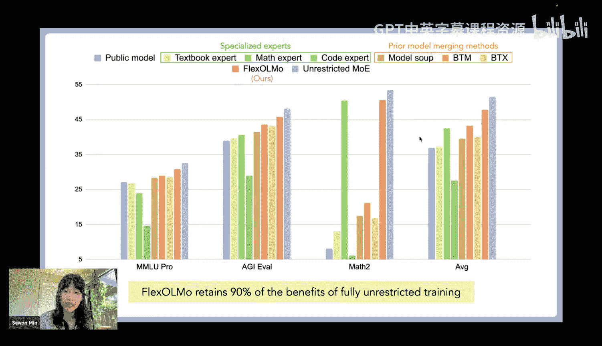

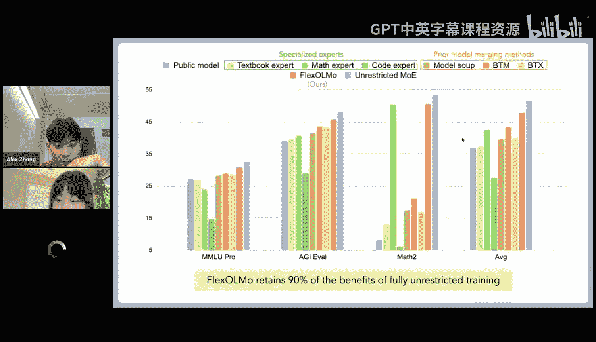

**2. 混合专家模型融合**
*   **思路**：将每个数据所有者训练得到的FFN作为独立的专家，合并成一个MoE模型。
*   **局限**：合并后，**路由器需要重新训练**以学会如何选择专家，而这通常需要访问所有数据的并集进行联合训练，违反了数据隐私的前提。

### FlexOlmo的核心方法

FlexOlmo的核心目标是保留混合专家架构的模块化优点，同时消除对数据联合访问的需求。它通过两个关键设计来实现：

**1. 混合专家感知训练**
每个数据所有者拿到共享基础模型后，不进行普通的继续预训练，而是先将其转换为一个**仅有两个专家**的微型MoE模型。
*   专家一：冻结的、来自公共数据的原始FFN。
*   专家二：新初始化的、可训练的FFN。
数据所有者只训练第二个专家以及对应的路由器部分。这样，新专家在训练时就知道需要与公共专家进行“协作”。

**2. 非参数化路由器**
标准MoE的路由器是一个 `[隐藏维度 H] x [专家数 N]` 的矩阵。FlexOlmo将其分解为N个H维的**路由器嵌入向量**，每个向量对应一个专家。
*   公共数据对应的路由器嵌入向量被冻结。
*   每个数据所有者只训练自己新增专家对应的路由器嵌入向量。
*   最终合并时，只需将所有路由器嵌入向量拼接起来，就形成了完整的路由器矩阵。

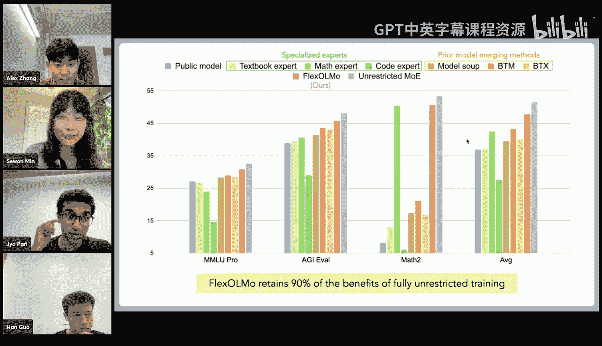

**工作流程总结**
1.  在公共数据上训练一个密集模型作为基础。
2.  每个数据所有者以此为基础，进行“两专家MoE”模式的本地训练（冻结公共部分，训练新增的专家和路由器嵌入）。
3.  所有训练完成后，将各数据所有者新增的专家FFN和路由器嵌入合并，与冻结的公共部分一起，构成最终的、包含多个专家的MoE模型。

### 实验结果与优势

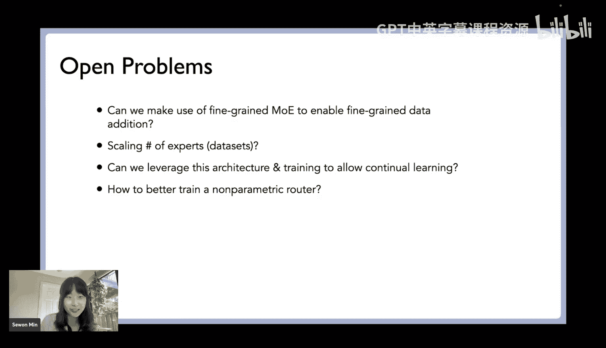

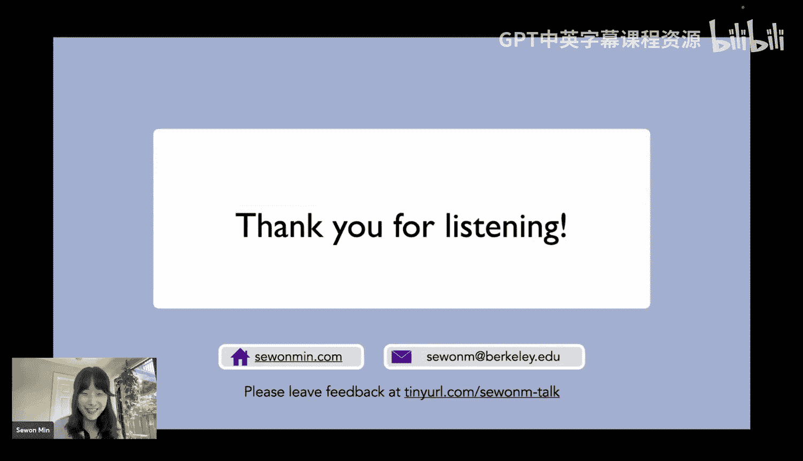

在7B参数规模的实验表明，FlexOlmo相比仅在公共数据上训练的模型有显著提升（在MMLU Pro和HELM基准上平均提升41%）。
*   它显著优于传统的模型融合方法。
*   在专业领域任务上，它能达到接近甚至超过在该领域数据上专门训练的“专家模型”的性能。
*   更重要的是，FlexOlmo的性能达到了**无限制联合训练MoE模型**（数据可集中访问的理想上限）的90%，同时保留了数据隐私和灵活增删的巨大优势。

**数据剔除分析**
实验验证了“ opting-out”的有效性。当从模型中移除某个数据源对应的专家后：
*   与该数据源相关的任务性能会下降。
*   其他不相关的下游任务性能受影响极小，甚至可能因路由器选择范围变小而略有提升。

### 局限与未来方向

1.  **专家粒度**：当前每个数据源对应一个完整的FFN专家，模型参数量增长快。未来可探索更细粒度的MoE，让更多小数据持有者参与。
2.  **路由器优化**：当前路由器仅在“二选一”场景下训练，泛化到“多选一”时可能不是最优。如何训练出泛化能力更强的路由器是一个技术挑战。
3.  **持续学习**：如何利用此架构实现模型的持续渐进式改进。
4.  **实际部署问题**：包括如何评估不同数据贡献的价值、如何设计激励机制，以及如何防止恶意数据源污染模型等。

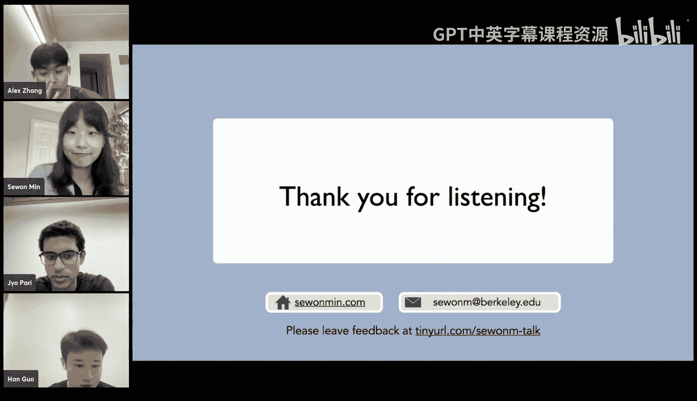

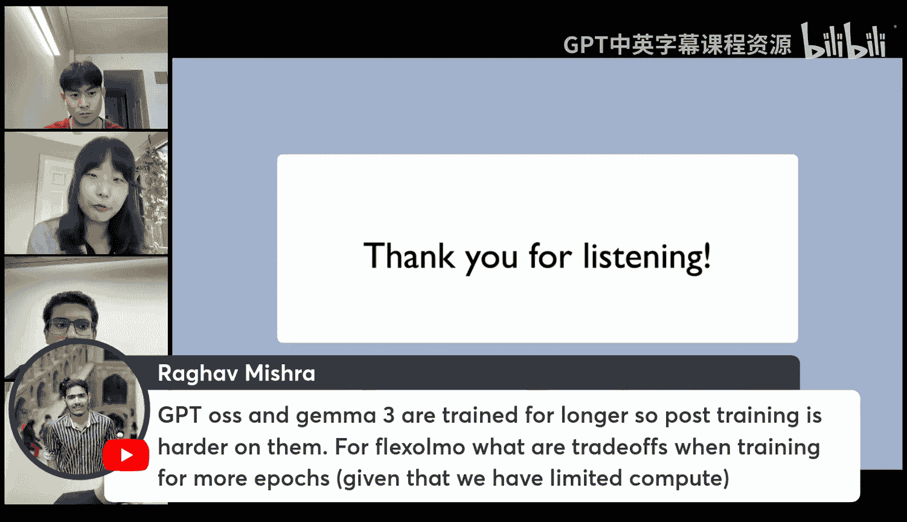


---

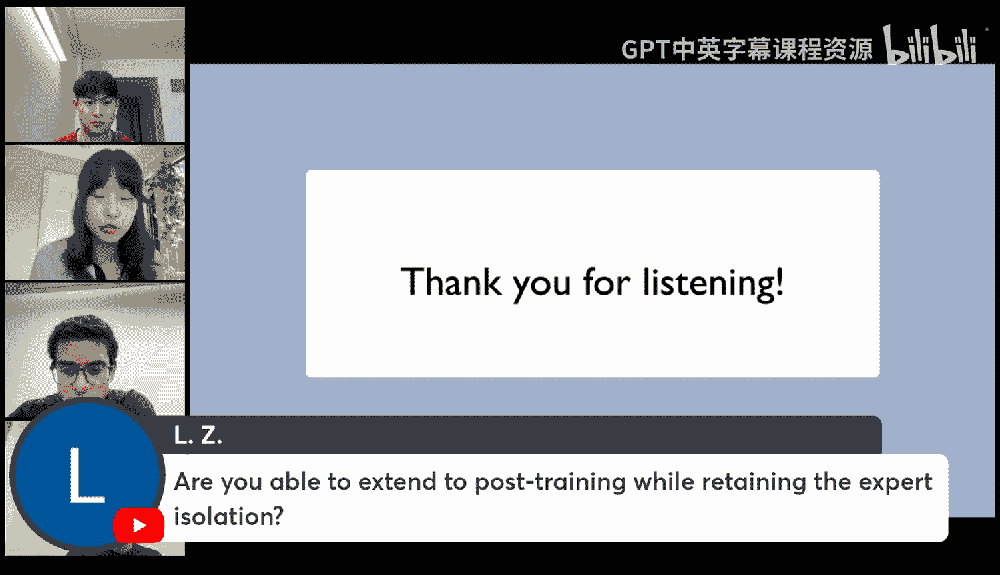

## 总结

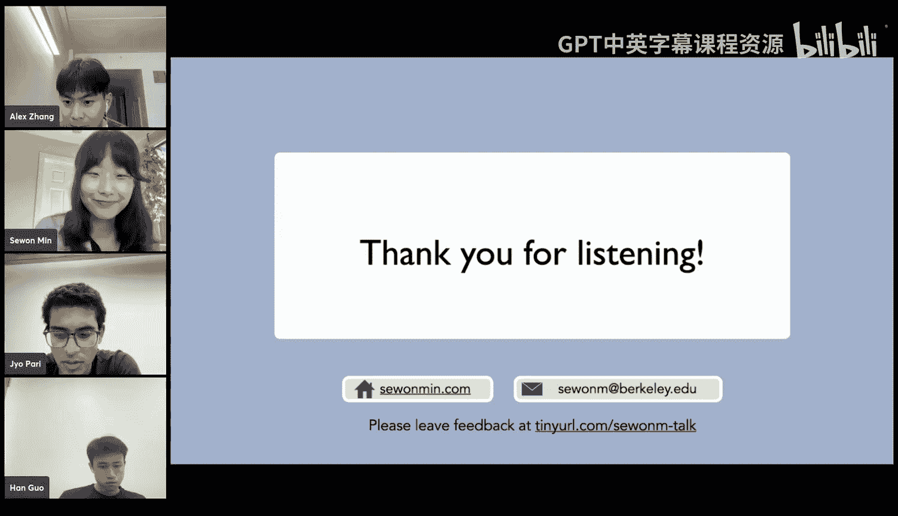

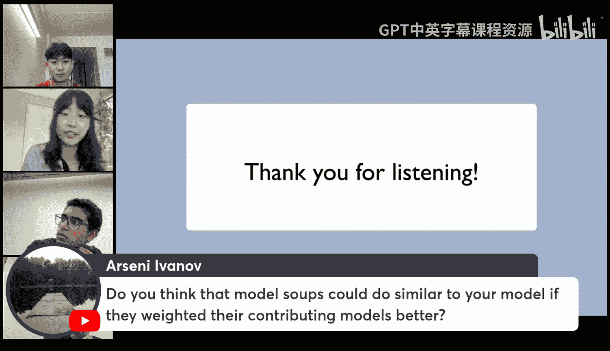

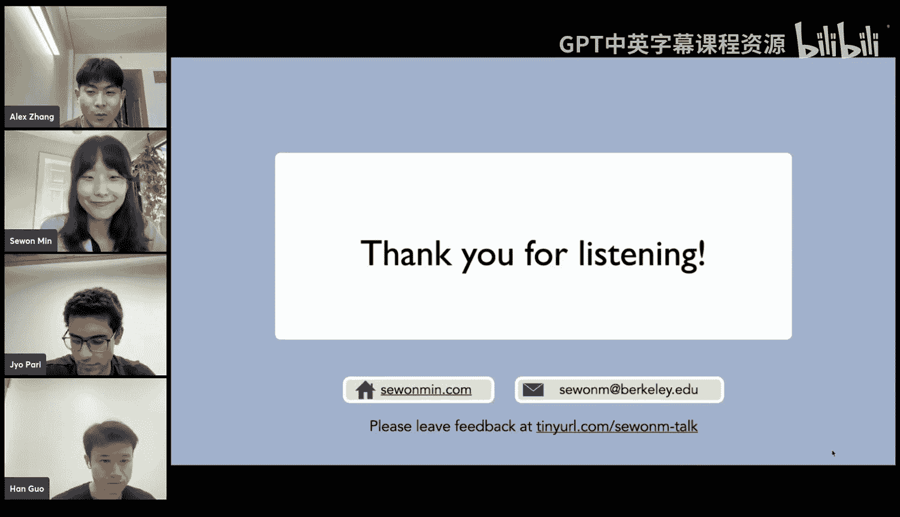

本节课我们一起学习了混合专家模型从基础到前沿应用的完整脉络。我们首先剖析了MoE通过激活参数子集来提升效率的核心机制及其在GPT OSS中的实现。接着，我们深入探讨了Se Wun团队提出的FlexOlmo框架，它巧妙利用了MoE的模块化特性，使得在分布式、隐私敏感的数据上进行协作式模型训练成为可能，同时保持了模型性能并支持灵活的数据管理。这项工作为大规模、合规的AI模型开发开辟了新的可行路径。