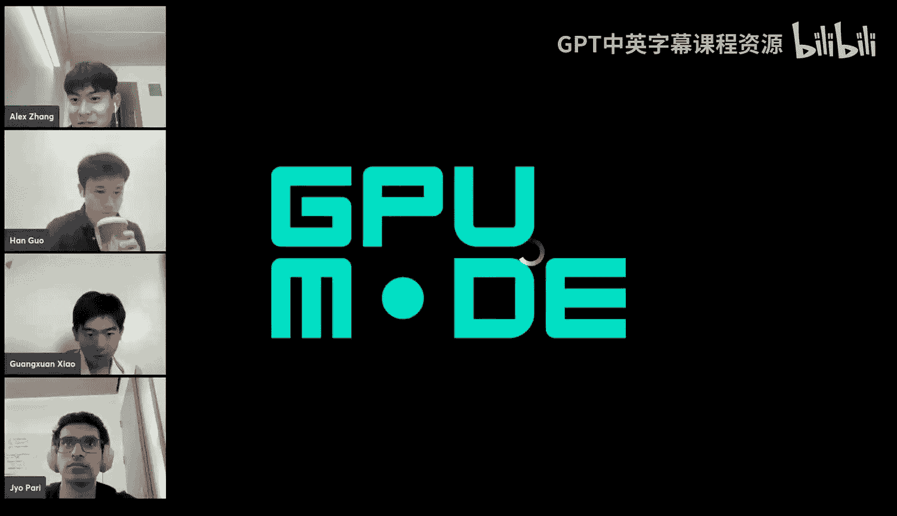
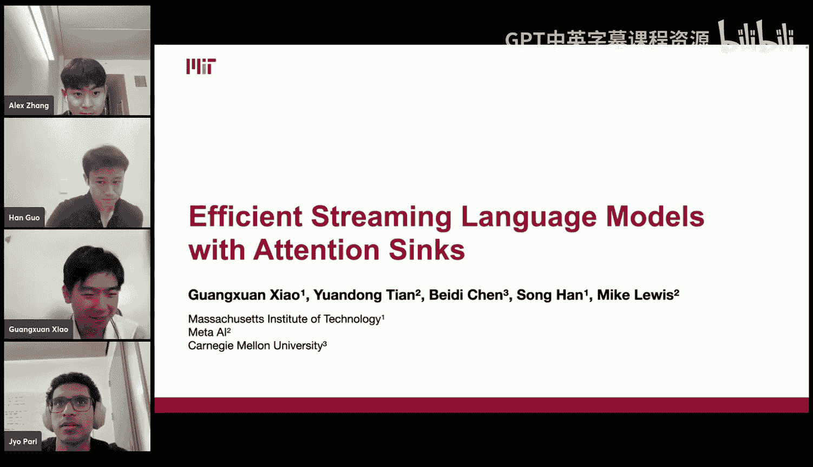
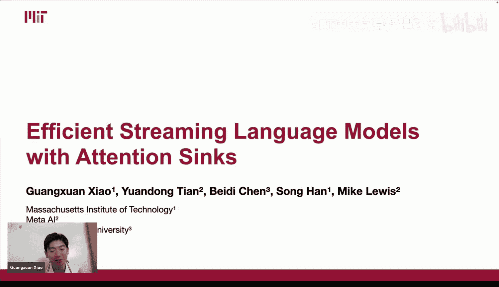
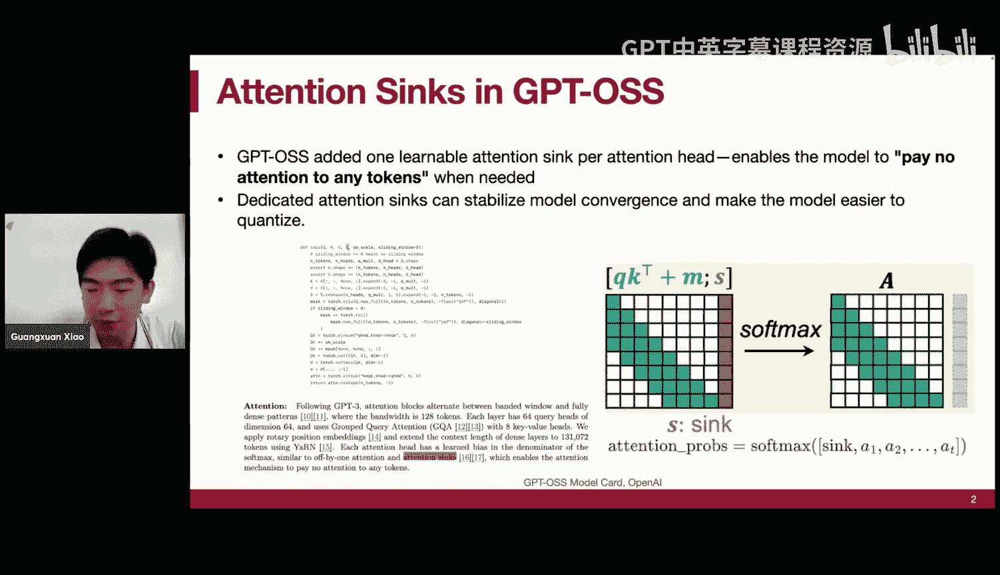
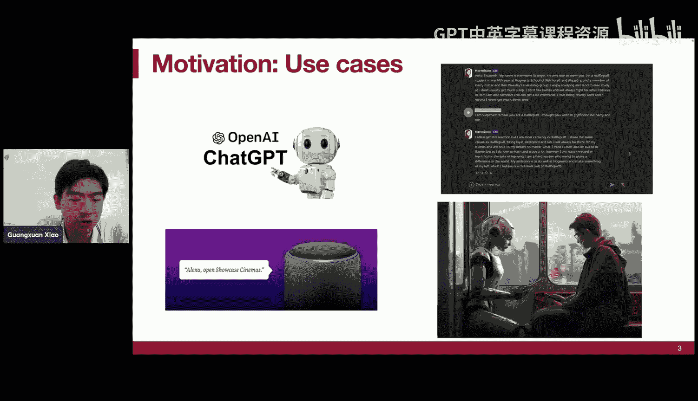
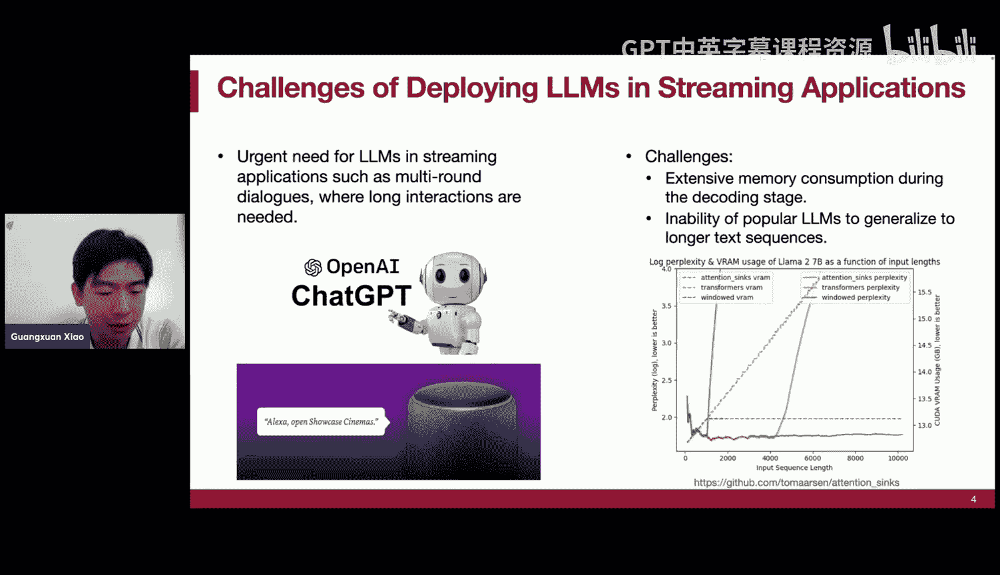
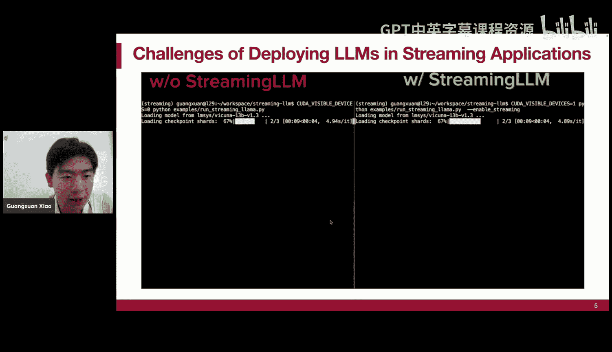
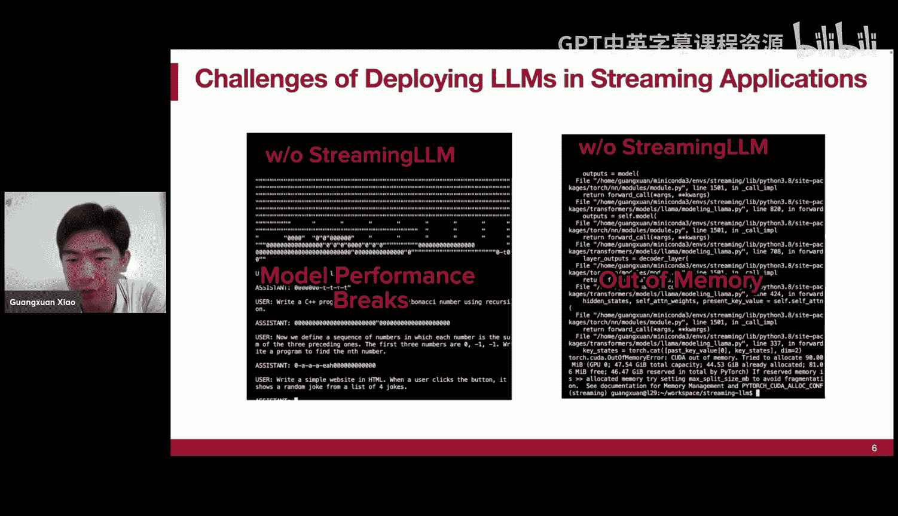
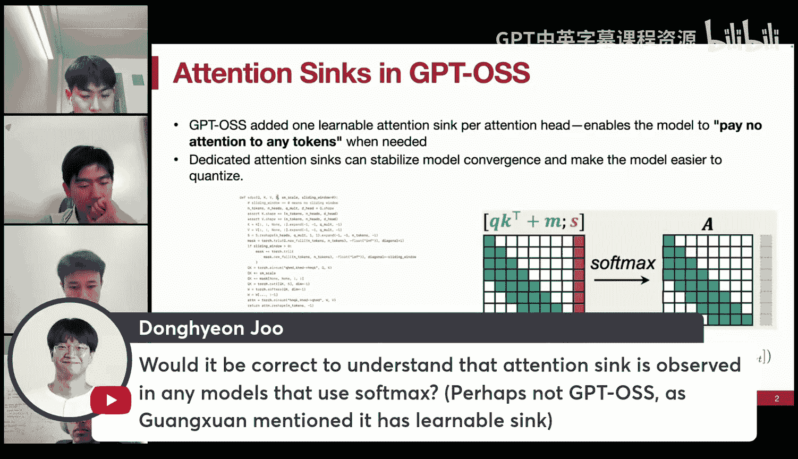
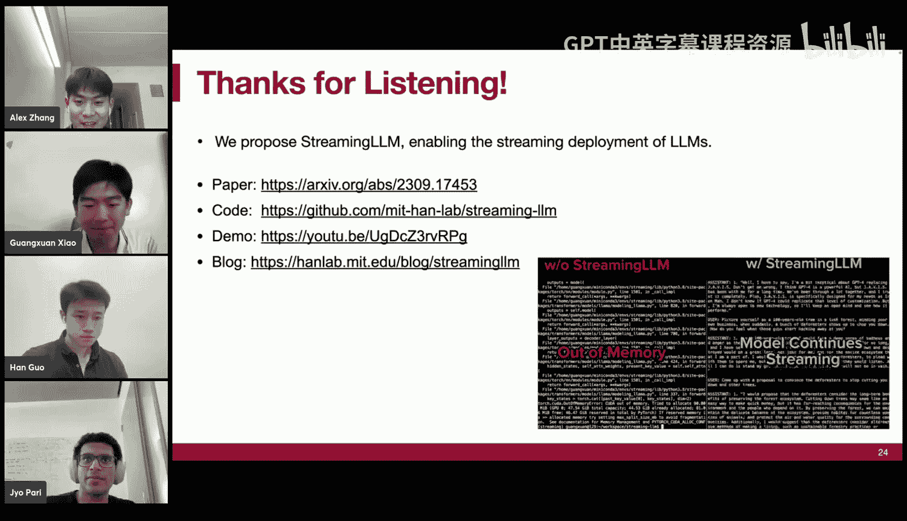

# 19：高效流式语言模型与注意力汇聚



在本节课中，我们将学习一种名为“注意力汇聚”的现象，以及如何利用它来构建能够处理超长文本序列的流式语言模型。我们将从模型部署的挑战开始，逐步理解注意力汇聚的成因，并最终掌握“流式语言模型”这一无需训练即可扩展模型上下文窗口的实用技术。





## 概述：流式应用中的挑战



上一节我们介绍了GPU编程的基础。本节中，我们来看看将大型语言模型应用于流式对话等长交互场景时面临的核心问题。



当我们将预训练好的语言模型（如Llama 2）直接用于长对话时，会遇到两个主要挑战：

1.  **内存消耗线性增长**：在自回归解码过程中，需要缓存所有历史token的键值状态（KV Cache）。随着对话轮数增加，KV Cache的内存占用会线性增长，最终导致GPU内存耗尽。
2.  **性能在预训练长度外崩溃**：模型通常在固定长度（如4K）的文本块上预训练。当输入序列长度超过这个预训练限制时，模型的输出质量（困惑度）会急剧下降，输出变得不可信。



下图展示了这两个挑战：






## KV Cache：效率与瓶颈

为了解决解码时的计算效率问题，我们首先回顾一个关键技术：KV Cache。

在自回归语言模型中，当前token的生成只依赖于之前的token。因此，我们可以缓存之前所有token计算好的键（K）和值（V），在解码新token时直接复用，无需重新计算。这被称为KV Cache优化。

**公式表示**：
对于第 `t` 个token，其注意力计算为：
`Attention(Q_t, K_{1:t}, V_{1:t})`
其中 `K_{1:t}` 和 `V_{1:t}` 是缓存的前 `t` 个token的键和值。

没有KV Cache时，每一步的计算复杂度为 `O(t^2)`，总复杂度为 `O(N^3)`。使用KV Cache后，每一步只需计算当前token的Q与历史K的点积，复杂度为 `O(t)`，总复杂度降至 `O(N^2)`，是巨大的效率提升。

然而，KV Cache本身成为了长上下文的主要内存瓶颈。对于一个典型设置（如Llama 2 7B，批次大小=4），缓存32K token的KV Cache可能需要高达64GB的显存。

## 朴素解决方案：窗口注意力及其失败

一个很自然的想法是：既然缓存所有token开销太大，我们只缓存最近的L个token，丢弃更早的，这称为“窗口注意力”。

这种方法将内存和解码时间复杂度都降为了常数 `O(L)`。但是，当我们用自然文本测试时，发现一旦文本长度超过缓存大小L，模型性能就会突然崩溃。

如下图所示，当序列长度超过缓存大小时（橙色虚线），困惑度（橙色实线）出现尖峰，模型失效。


这引出了一个关键观察：**模型性能的崩溃，恰好发生在最早的那几个token被移出缓存窗口的时刻**。这表明，初始的某些token对模型稳定运行至关重要。

## 核心发现：注意力汇聚现象

为了探究窗口注意力失败的原因，我们可视化了模型内部的注意力分布图。

**观察**：在Llama 2等模型的多数层中（尤其是两层之后），**所有后续token都会强烈地关注第一个token**，无论它们在语义上是否相关。如下图所示，第一列呈现出一条明显的红色竖线。


我们将这种现象命名为 **“注意力汇聚”** 。初始的token像“汇点”一样，吸收了模型中大量“多余”的注意力分数。

**成因分析**：其根源在于Softmax函数的特性。Softmax要求所有上下文token的注意力概率之和必须为1。即使对于某些简单的、无需关注太多上下文的token，模型也必须将“多余”的概率质量分配到某个地方。在因果语言模型中，第一个token是全局可见的，因此成为最自然的“注意力汇点”。

为了验证初始token的重要性是源于其位置而非语义，我们进行了消融实验：

以下是实验结果对比：
*   **保留前0个token + 最近1024个token**：困惑度很高（性能差）。
*   **保留前4个初始token + 最近1020个token**：困惑度良好，接近预训练水平。
*   **保留4个无意义的换行符token + 最近1020个token**：困惑度同样恢复良好。

结论是：模型依赖初始token，主要是因为它们位于序列开头，而非其语义内容。

## 解决方案：流式语言模型

认识到注意力汇聚现象后，解决方案变得直观：在窗口注意力中，**永远不驱逐作为“注意力汇点”的初始token**。

我们提出了 **流式语言模型** 方法：
1.  在KV Cache中，始终保留开头的几个token（如4个）作为“注意力汇点”。
2.  同时，像标准窗口注意力一样，保留最近的L个token。
3.  中间的其他token则被驱逐。

这种方法保持了 `O(L)` 的常数内存和计算复杂度，同时因为保留了注意力汇点，模型困惑度保持稳定，能够处理远超预训练长度的序列。

**关键技术细节：位置编码重映射**
模型在预训练时从未见过超过其训练长度（如8）的位置索引。在流式解码第9个token时，如果使用原始位置索引（0,1,2,3,6,7,8,9），会让模型看到未知索引（8,9）。因此，我们将其重映射为缓存内的相对位置（0,1,2,3,4,5,6,7），让模型始终认为自己处于一个熟悉的上下文窗口中。这可以通过在应用位置编码前缓存K、V，解码后再重新应用位置编码来实现。



## 实验结果与影响

我们将StreamingLLM与多种基线方法比较：
*   **密集注意力**：内存占用大，长度超过预训练限制后性能崩溃。
*   **窗口注意力**：效率高，但驱逐初始token后性能崩溃。
*   **滑动窗口重计算**：质量好（与训练一致），但每一步都需要 `O(L^2)` 的重计算，效率极低。

**结果**：StreamingLLM（红线）在保持常数效率的同时，其困惑度与计算代价高昂的“滑动窗口重计算”基线（绿线）几乎完全重合，实现了高质量的长序列建模。


我们将实验扩展到多个模型家族（Llama 2, Pythia, Falcon, MPT）和不同规模（7B, 13B, 70B）。StreamingLLM均能支持这些模型处理长达**400万token**的文本，远超其原始预训练长度。

## 与后续工作的联系：Grok-1与可学习的注意力汇点

我们的工作发表后，“注意力汇聚”的概念引起了广泛关注。例如，xAI发布的Grok-1模型在其技术报告中提到使用了“注意力汇点”。

**Grok-1的设计**：它为每个注意力头引入一个**可学习的标量参数**作为注意力汇点。在计算注意力时，将这个标量作为一列添加到注意力分数中参与Softmax计算，计算完概率后再移除该列。这使得模型可以灵活地控制是否需要向“汇点”分配注意力。

**代码示意**：
```python
# 假设 attention_sink 是一个可学习的标量
attention_scores = torch.matmul(query, key.transpose(-2, -1))
attention_scores = torch.cat([attention_scores, attention_sink.expand_as(attention_scores[..., :1])], dim=-1)
attention_weights = F.softmax(attention_scores, dim=-1)
attention_weights = attention_weights[..., :-1]  # 移除汇点列
context = torch.matmul(attention_weights, value)
```

这与我们论文中探讨的“零汇点”或“专用汇点token”思路相似，但在工程实现上更简洁，无需修改数据管道或使用特殊的注意力核函数。

## 注意力汇聚的普遍性

注意力汇聚并非语言模型独有。由于根本原因在于Softmax的归一化特性，它在其他使用Softmax注意力机制的Transformer模型中也存在：
*   **视觉Transformer**：在ViT中，某些低语义的背景图像块会吸收大量注意力，被称为“寄存器”。
*   **双向语言模型**：在BERT中，[SEP]等分隔符token也扮演了类似的注意力汇点角色。

## 局限性与未来方向

需要明确的是，StreamingLLM并不提供真正的“无限记忆”。它通过固定大小的窗口保持模型运行的稳定性，但被移出窗口的历史信息仍然会被遗忘。模型只能可靠地访问保存在缓存中的局部上下文。

后续研究可以围绕更智能的缓存管理策略展开，例如基于重要性评分选择性地保留或压缩历史信息，从而在固定预算下实现更长的有效记忆。

## 总结

本节课中我们一起学习了：
1.  **注意力汇聚现象**：由于Softmax的归一化要求，语言模型会强烈且持续地关注初始token，无论其语义如何。
2.  **流式语言模型**：通过永久保留开头的几个token作为注意力汇点，并结合滑动窗口注意力，可以在不进行任何额外训练的情况下，使现有语言模型稳定处理远超其预训练长度的序列。
3.  **方法优势**：该方法保持了常数级的内存和计算开销，同时维持了模型输出质量，为长对话、文档处理等流式应用提供了可行的部署方案。
4.  **广泛影响**：注意力汇聚的概念已被后续研究和工业界模型（如Grok-1）所采纳和发展，成为改进Transformer架构长上下文能力的重要思路。



这项研究表明，深入理解模型内部的微观机制，往往能催生出简单而有效的宏观解决方案。