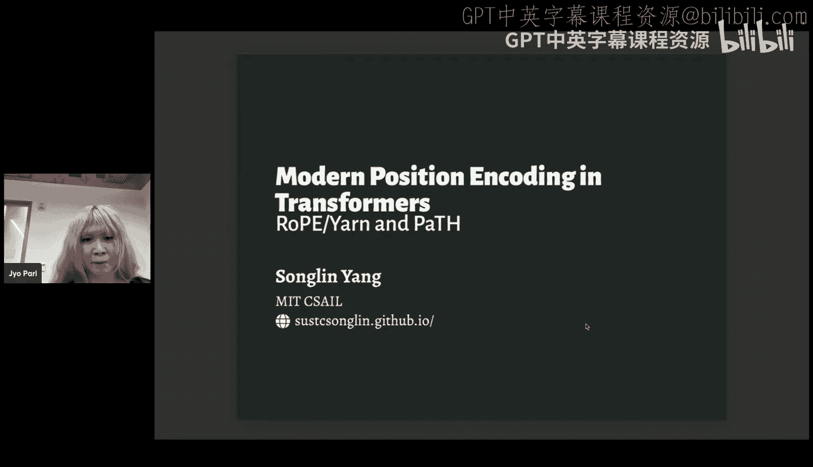
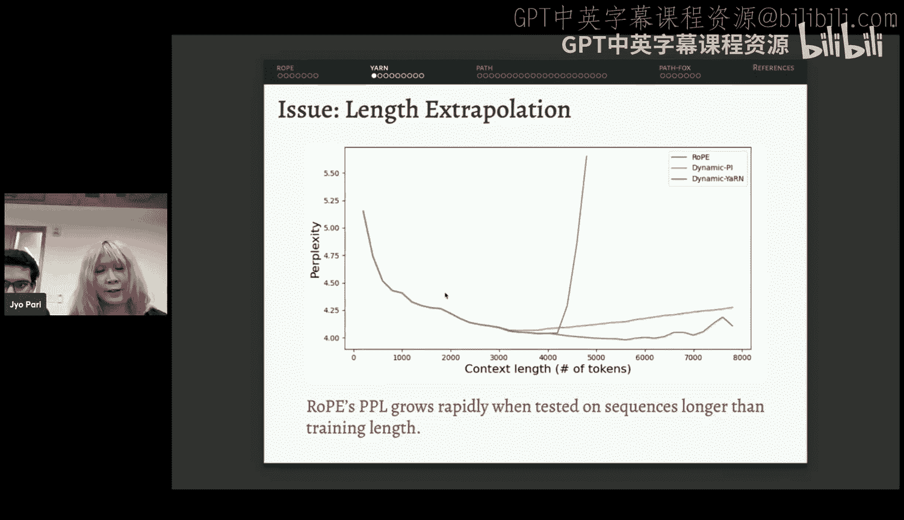
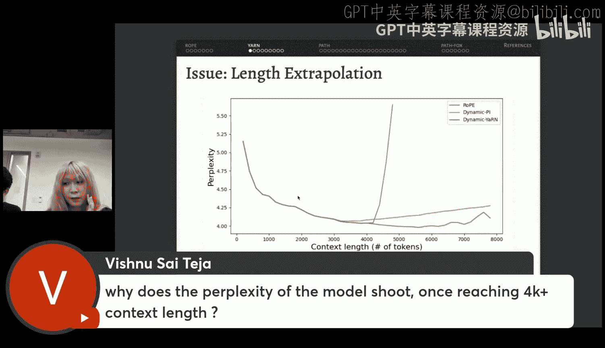
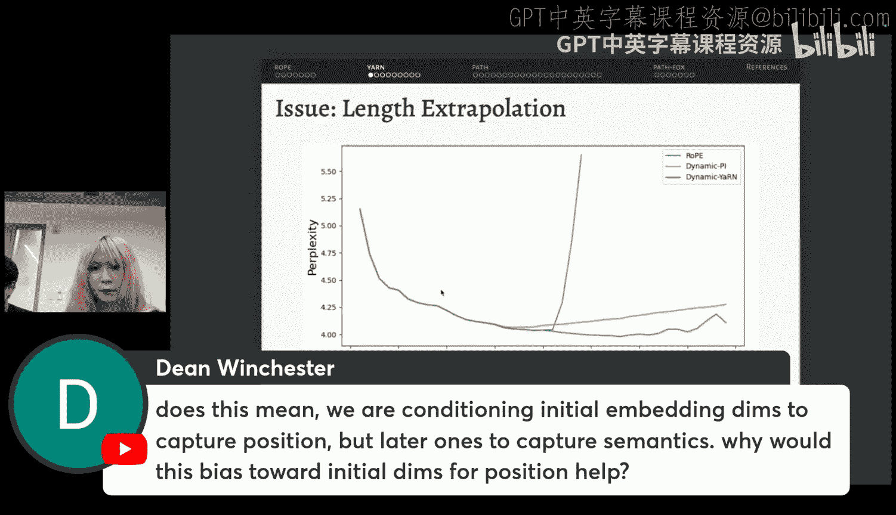
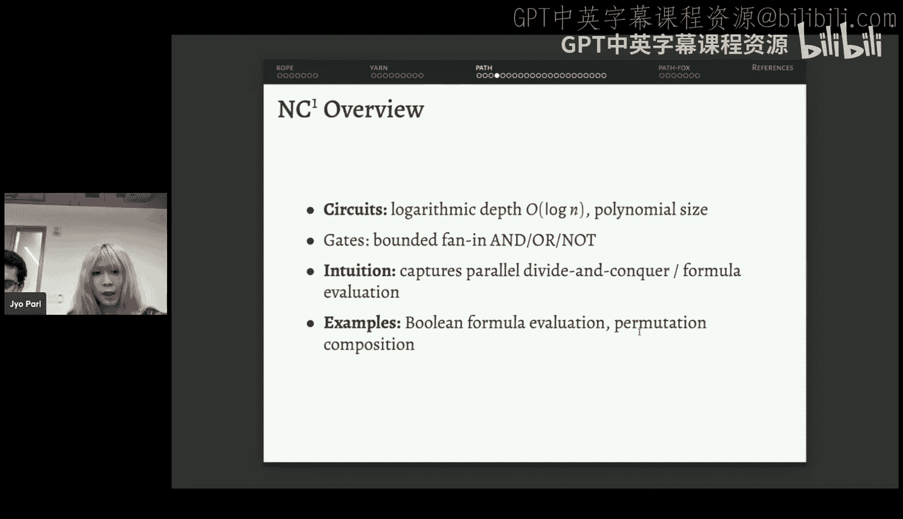
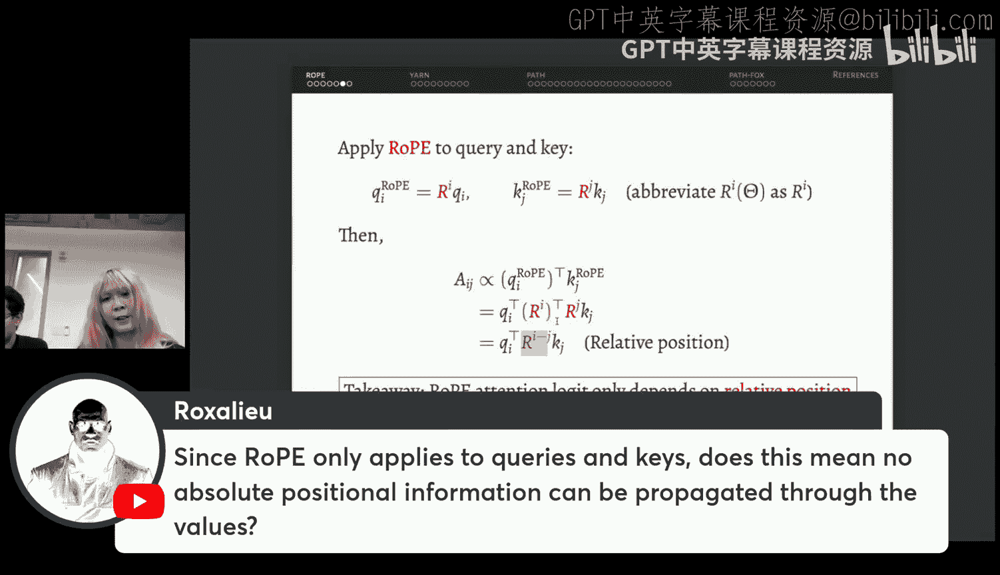
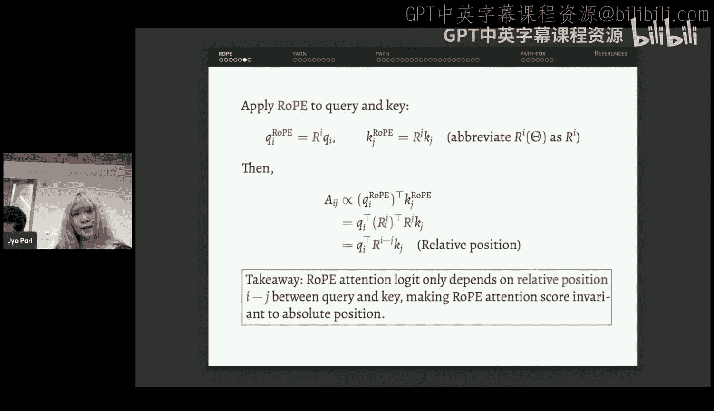
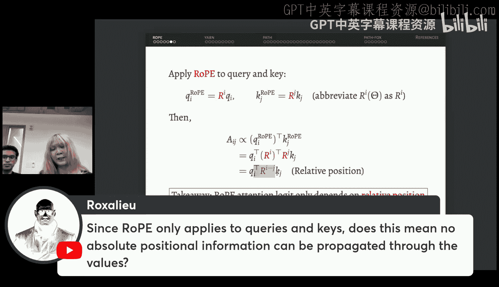
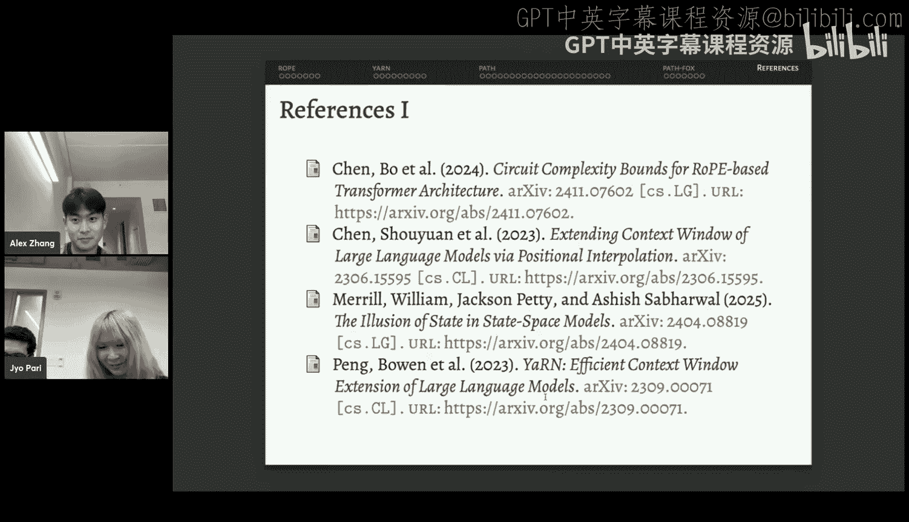

# 21：Transformer中的位置编码与PaTH注意力

在本节课中，我们将要学习Transformer模型中的位置编码机制，特别是旋转位置编码（RoPE）及其改进方案，并深入探讨一种名为PaTH的新型注意力机制，它旨在提升模型在状态跟踪等复杂任务上的表达能力。

## 位置编码的动机

上一节我们介绍了课程背景，本节中我们来看看位置编码的必要性。Transformer模型最初被设计用于双向建模，其自注意力机制在没有因果掩码的情况下，会将输入序列视为一个无序的词袋。如果没有位置嵌入，模型将无法感知词语的顺序。

以下是一个直观的例子：
*   “猫坐在垫子上。”
*   “垫子坐在猫上。”

如果没有位置编码，模型无法区分这两个句子。在原始的Transformer论文中，作者使用了一个简单的绝对位置编码，即正弦和余弦函数的组合。然而，这种绝对位置编码存在局限性，例如，内容与绝对位置高度耦合，且无法直接建模词与词之间的相对位置关系。因此，后续研究主要聚焦于相对位置编码。

## 旋转位置编码（RoPE）概述

上一节我们提到了相对位置编码的重要性，本节中我们来看看目前最流行的方案——旋转位置编码。

RoPE的工作机制如下：
1.  对于输入嵌入向量，RoPE将其通道分成多个二维通道对。
2.  对于每个通道对，设定一个旋转频率角 `θ`。
3.  根据词的绝对位置索引 `m` 和频率角 `θ`，对该通道对进行旋转操作。
4.  旋转后的查询向量和键向量被用于计算注意力分数。

不同通道对独立进行旋转，互不干扰。尽管这里使用了绝对位置索引，但最终计算出的注意力分数仅依赖于查询和键之间的相对位置差，因此RoPE本质上是一种相对位置编码。

### 旋转矩阵的性质

在深入理解RoPE之前，我们先简要回顾旋转矩阵的性质。一个二维旋转矩阵 `R(θ)` 可以将一个向量旋转角度 `θ`。

旋转矩阵具有以下良好性质：
*   **幂等性**：`R(θ)^m = R(mθ)`。累积旋转可以通过直接计算总角度来实现。
*   **正交性**：旋转矩阵是正交矩阵，其逆矩阵等于其转置矩阵，即 `R(θ)^{-1} = R(θ)^T = R(-θ)`。
*   **可组合性**：多个旋转的组合等价于角度相加后的单个旋转，即 `R(θ1) * R(θ2) = R(θ1 + θ2)`。

RoPE利用这些性质，通过块对角矩阵的形式，将旋转操作扩展到高维空间。

### RoPE中不同通道的作用

RoPE为不同的通道对设置了不同的旋转频率。根据频率大小，可以将通道分为两类：
*   **高频通道**：旋转角 `θ` 较大，旋转迅速。这些通道主要用于编码位置模式，例如识别最近的词。
*   **低频通道**：旋转角 `θ` 较小，旋转缓慢。这些通道主要用于编码语义信息，因为缓慢的旋转对点积结果影响较小。

这种分工使得RoPE能够有效地平衡位置信息和语义信息。

## RoPE的局限性与改进方案

尽管RoPE非常有效，但它也存在局限性，最突出的问题是长度外推能力不足。例如，一个在4K序列长度上训练的模型，在评估超过4K的序列时，其困惑度可能会急剧上升。

### 位置插值与NTK感知RoPE

为了解决外推问题，研究者提出了多种方案。最初的**位置插值**方法简单地对所有通道的旋转角进行均匀缩放，但这忽略了不同频率通道的敏感性。

随后提出的**NTK感知RoPE**方法则更加精细。它基于神经正切核理论，该理论指出神经网络难以学习低维输入中的高频信息。在位置编码中，位置ID是单一维度的，因此高频通道的信息更难学习，也更为脆弱。

NTK感知RoPE的核心思想是：
*   对于高频通道，尽量保持其旋转角不变，以保留已学习到的精细位置模式。
*   对于低频通道，可以进行插值，使其适应更长的序列长度。

该方法使用一个平滑函数来计算每个通道的缩放因子。

### YaRN：结合NTK与温度缩放

**YaRN** 是另一个重要的改进方案，它结合了NTK-aware插值和温度缩放。温度参数 `T` 根据新序列长度与训练序列长度的比例进行计算。YaRN的直觉可以通过注意力分数熵的变化来理解，它旨在更稳定地扩展上下文窗口。目前许多开源模型（如DeepSeek、Llama等）都采用了YaRN。

## 引入PaTH：提升Transformer的表达能力

上一节我们讨论了RoPE的改进，本节中我们来看看一个旨在突破Transformer表达能力限制的新工作——PaTH。

研究表明，像Transformer这样的模型，其计算复杂度属于 **TC0** 类。这意味着它们可以处理加法、比较等基本算术运算，但难以处理更复杂的任务，如状态跟踪、排列组合等，这些任务属于 **NC1** 复杂度类。这也是为什么当前大模型需要依赖长链思维（CoT）来进行复杂推理的原因。

### 一个NC1完全问题：排列组合

为了提升表达能力，PaTH关注一个简单的NC1完全问题：**五元素排列组合**。问题描述如下：给定五个元素（A, B, C, D, E）的初始排列，以及一系列交换操作（例如“交换位置1和2”），需要计算出经过所有交换操作后的最终排列。这个问题要求模型在内部状态中跟踪所有元素的位置，是典型的状态跟踪任务。

### 为什么RoPE难以处理此任务？

RoPE难以处理此类任务的原因有两个：
1.  **数据无关性**：RoPE的旋转操作仅依赖于绝对位置，与输入元素的内容无关。
2.  **可交换性**：二维旋转操作是可交换的，即 `R(θ1)R(θ2) = R(θ2)R(θ1)`。然而，交换操作的顺序是不可交换的，改变操作顺序会得到不同的结果。

### PaTH的核心：Householder变换

PaTH使用 **Householder变换** 来编码交换操作。Householder矩阵是一种初等反射矩阵，可以将一个向量关于某个超平面进行反射。通过精心选择反射平面，可以用一个Householder变换交换两个向量的位置，同时保持其他正交向量不变。

更一般地，PaTH使用 **广义Householder变换**，其公式为：
`H = I - β * w * w^T`
其中 `β` 是一个可学习的标量参数：
*   当 `β = 0` 时，`H` 是单位矩阵，表示不进行任何操作。
*   当 `β = 1` 时，`H` 是投影矩阵。
*   当 `β = 2` 时，`H` 是标准的反射矩阵。

通过累积多个Householder变换的乘积，PaTH可以建模一系列交换操作的组合效果。PaTH将这种累积乘积作为位置编码的一部分，集成到注意力分数的计算中，形成了一个双线性权重矩阵。理论证明，这使得PaTH具备了NC1完全的表达能力。

### PaTH的实验结果

在合成的五元素交换任务上，RoPE模型无法学会跟踪状态，而PaTH模型可以轻松解决。在其他状态跟踪任务（如Flip Flop语言建模）上，PaTH也显著优于其他位置编码方案，并且在处理长序列时，PaTH所需的网络层数仅以对数规模增长，效率更高。

### 实践中的PaTH：蒸馏与持续预训练

为了将PaTH应用于现有模型，研究者提出了**蒸馏流程**：
1.  **阶段一（层对齐）**：使用教师模型（如RoPE）的中间层输出作为目标，让学生模型（PaTH）的每一层去匹配，最小化均方误差损失。
2.  **阶段二（知识蒸馏）**：使用教师模型的最终输出分布作为目标，让学生模型去匹配，最小化KL散度损失。

初步实验表明，使用少量数据对Cornell-2 7B模型进行蒸馏，可以恢复其大部分性能，甚至在数学和代码任务上有所提升。

在**持续预训练**实验中，从一个预训练好的检查点开始，使用高质量数据继续训练，并将RoPE替换为PaTH。结果显示，在相同的训练数据和步数下，PaTH在GSM8K、HumanEval等数学和代码基准上明显优于RoPE，这表明其更强的状态跟踪能力有益于这些任务。

### PaTH的高效实现

PaTH的设计考虑了硬件效率。其核心计算可以分解为块操作，并利用矩阵乘法和求逆（在小的块内进行）等GPU友好操作。研究者借鉴了Flash Attention的算法思想，设计了块状的PaTH注意力前向传播算法，使其能够高效地在现代GPU上运行。

对于推理阶段，PaTH引入了一种动态更新键值缓存（KV Cache）的机制。每个新的时间步都会产生一个Householder变换，这个变换被应用于所有历史的键缓存，相当于对历史信息进行了一次“精炼”。这可以通过秩1更新高效实现，最终可以调用优化过的注意力解码内核（如Flash Decoding）来完成计算。

## PaTH与遗忘机制的结合：PaTH-FoX

上一节我们介绍了PaTH，本节中我们来看看其与遗忘机制的融合。**遗忘Transformer** 可以看作是一种数据依赖的偏置位置编码（类似于ALiBi），它通过一个累积的遗忘门来控制历史信息的保留程度。

PaTH-FoX将乘性的PaTH位置编码与加性的遗忘门偏置结合起来，公式如下：
`注意力分数 = Q * (累积Householder变换) * K^T + (累积遗忘门偏置)`

这种结合带来了互补的优势：PaTH提供了强大的状态跟踪和表达能
力，而遗忘机制有助于模型进行长度外推和选择性记忆。

实验表明，PaTH和PaTH-FoX在常识推理、语言建模等标准基准上表现良好，并且在长上下文和状态跟踪专项任务上具有显著优势。

## 总结

本节课中我们一起深入探讨了Transformer中的位置编码。我们从RoPE的基本原理出发，分析了其通过旋转编码相对位置的巧妙设计，以及不同频率通道的分工。接着，我们探讨了RoPE在长度外推上的局限性，并介绍了位置插值、NTK感知RoPE和YaRN等改进方案。

然后，我们引入了一个旨在突破Transformer表达能力瓶颈的新工作——PaTH。PaTH利用Householder变换的累积乘积来编码复杂的交换操作，赋予了模型NC1完全的表达能力，使其能够更好地处理状态跟踪等复杂任务。我们还讨论了PaTH的实践部署策略和高效实现方案，以及其与遗忘机制结合的PaTH-FoX变体。

这些研究展示了在保持注意力机制核心优势的同时，通过改进位置编码来显著提升模型理论表达能力和实际任务性能的潜力。