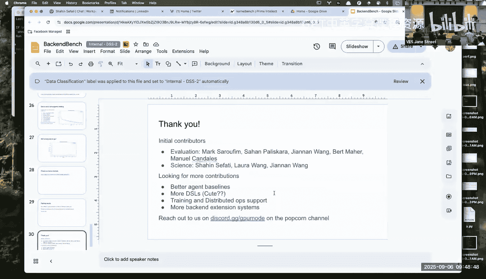
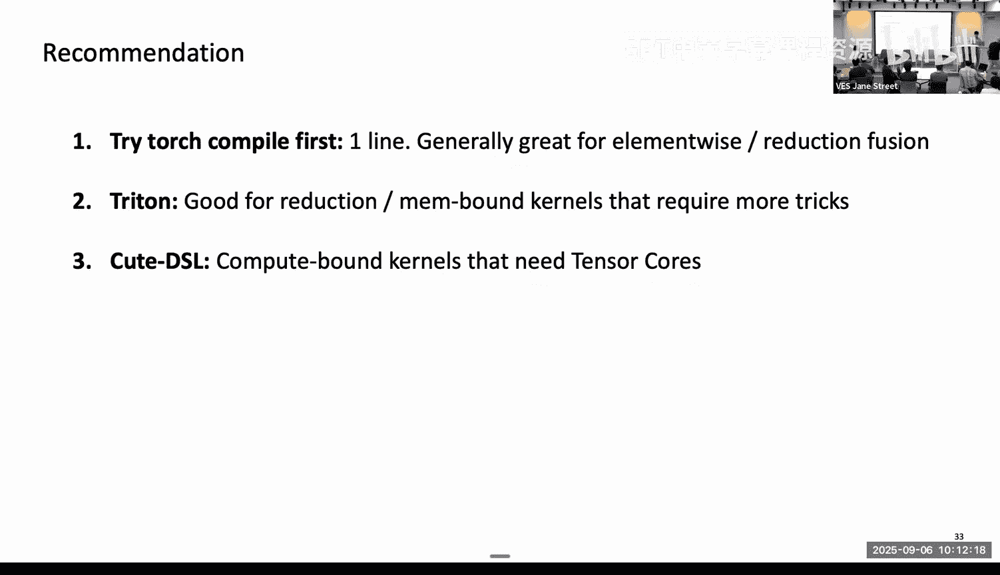

# 24：GPU核函数的领域特定语言 🚀




在本节课中，我们将探讨用于编写GPU核函数的领域特定语言。我们将了解这些语言如何在研究人员的生产力和硬件效率之间取得平衡，并通过具体的例子（如Softmax和矩阵乘法）来比较不同语言（如PyTorch、Triton和Cute DSL）的抽象层级和性能表现。

---

## 动机：最大化智能/美元 💡

过去五年的扩展定律表明，更多的计算、更好的算法和更多的数据通常能产生更好的模型。为了持续这一趋势，我们需要最大化“智能/美元”，这可以分解为“智能/浮点运算”和“浮点运算/美元”。

*   **智能/浮点运算**：这关乎算法或数据效率。
*   **浮点运算/美元**：这关乎硬件效率。

为了同时优化这两者，我们不能仅仅使用像PTX这样的底层语言硬编码一切，因为这会严重降低研究人员的生产力。我们需要领域特定语言来在生产力与效率之间取得平衡。

---

## GPU硬件层级与DSL抽象 🏗️

不同的DSL主要区别在于它们暴露了多少硬件层级。以NVIDIA GPU为例，其硬件层级包括：
*   **线程** 和寄存器
*   **线程块** 和共享内存
*   **线程块簇**（集群）
*   **网格**

像Triton这样的DSL只暴露了线程块和网格层级，简化了许多操作，提高了生产力，但牺牲了一些控制权。而像Cute DSL这样的语言则暴露了更多底层硬件细节。

---

## DSL实例对比：以Softmax为例 ⚖️

以下是使用不同DSL实现Softmax操作的对比。

### 使用 PyTorch Compile

PyTorch Compile提供了最简单的用户体验。你只需要添加一行装饰器。

```python
import torch

@torch.compile
def softmax_torch(x):
    return torch.softmax(x, dim=-1)
```

**一句话介绍**：这是最快捷的方法，PyTorch团队在用户体验上做了出色的工作。

### 使用 Triton

Triton提供了更多的控制权，代码依然简洁。以下是核心计算部分（约6-15行）：

```python
# 伪代码示意 Triton 风格的 Softmax 核心逻辑
max_val = tl.max(input, axis=1)
input = input - max_val[:, None]
exp_input = tl.exp(input)
sum_exp = tl.sum(exp_input, axis=1)
output = exp_input / sum_exp[:, None]
```

**一句话介绍**：Triton在保持代码简洁的同时，允许你控制更多硬件细节。

### 使用 Cute DSL

Cute DSL暴露了完整的硬件层级，代码量显著增加（约50行），但能实现更精细的控制。其还原操作涉及四个层级：
1.  **线程内还原**：`reduce.thread`
2.  **线程束内还原**：使用 `warp_shuffle`
3.  **线程块内还原**：通过共享内存和同步
4.  **集群内还原**：通过分布式共享内存（DSM）

**一句话介绍**：Cute DSL让你能够控制从线程到集群的每一级硬件，以实现极致性能。

---

## 性能对比 📊

上一节我们介绍了不同DSL的代码抽象程度，本节我们来看看它们的实际性能表现。

在H100 GPU上对Softmax进行性能测试（批大小32，变化最后一个维度的大小）：
*   **小尺寸输入**：Cute DSL版本（使用线程束还原）比Triton版本快约20-30%。
*   **大尺寸输入**：Cute DSL版本（使用集群还原）比Triton版本快约15%。

这体现了生产力与性能之间的经典权衡：投入更多时间理解底层硬件并使用更底层的语言，可以获得更好的性能。

---

## Cute DSL vs. CuBLAS：计算密集型内核 🔥

有些同学可能用过CUDA C++编程，可能会担心使用嵌入Python的DSL会损失多少性能。我们以矩阵乘法（GEMM）为例进行对比。

在H100上进行A x B（形状为8000 x K x 8000）的测试：
*   Cute DSL和CuBLAS C++版本都能达到约800 TFLOPs的峰值性能（理论峰值约1000 TFLOPs）。
*   对于较小的K值，Cute DSL版本因实现了“乒乓”架构（重叠计算核心和收尾工作）而略有优势。

在Blackwell GPU上，两者性能基本持平。这表明，对于现代硬件上的GEMM，使用像Cute DSL这样的高级DSL几乎不会损失性能。

---

## 超越GEMM：GEMM + X 与注意力机制 🧠

如今，编写高效的GEMM内核已经相对容易，更有挑战性的是“GEMM + X”操作，例如后接激活函数或注意力机制。

**GEMM + SwiGLU**：这是Transformer中FFN层最常用的操作之一。
*   **对比**：Cute DSL（单内核） vs. CuBLAS + Triton（两个内核，通过`torch.compile`调用）。
*   **结果**：通过单内核融合和“乒乓”等技术，Cute DSL版本比CuBLAS+Triton方案快约7-15%。

**注意力机制**：在Blackwell GPU上的初步工作显示，使用Cute DSL编写的FlashAttention内核，相比闭源的cuDNN实现，有约15-20%的速度提升（其中也包含算法改进）。

---

## 如何选择DSL？ 🗺️

不同的DSL存在于一个从生产力到性能的光谱上。以下是我的建议：

**一句话介绍**：根据你的任务类型和经验水平，可以参考以下路径选择DSL。

1.  **首选 PyTorch Compile**：只需一行代码。对于元素级操作或还原操作的融合通常效果很好。
2.  **进阶使用 Triton**：适用于需要更多技巧的内存受限内核，或使用张量核心的计算受限内核。
3.  **深入使用 Cute DSL**：当你需要极致性能，并愿意投入时间进行内核融合和底层优化时。

下表概括了不同DSL的大致权衡情况：

| 内核类型       | PyTorch Compile | Triton        | Cute DSL      | 上手时间         |
| :------------- | :-------------- | :------------ | :------------ | :--------------- |
| **内存受限**   | ~90% 峰值       | ~90% 峰值     | ~100% 峰值    | 数小时至数天     |
| **计算受限**   | 70-80% 峰值     | 80-90% 峰值   | ~100% 峰值    | 数天至数周       |
| **综合评估**   | 极高生产力      | 高生产力      | 高控制力/性能 | 数周至数月（精通）|

---

## 总结 🎯

本节课中，我们一起学习了用于GPU核函数编程的多种领域特定语言。
*   我们理解了在**研究生产力**和**硬件效率**之间取得平衡的重要性。
*   我们通过**Softmax**的例子，直观对比了PyTorch、Triton和Cute DSL在**抽象层级**和**代码复杂度**上的差异。
*   我们查看了**性能基准测试**，了解到对于不同任务，选择合适的DSL可以带来显著的性能提升。
*   最后，我们讨论了如何根据任务需求和个人经验，在DSL的**光谱**上做出选择。



领域特定语言是释放现代GPU强大能力的关键，它们让研究人员和工程师能够更高效地探索算法前沿，同时确保最终代码在硬件上高效运行。