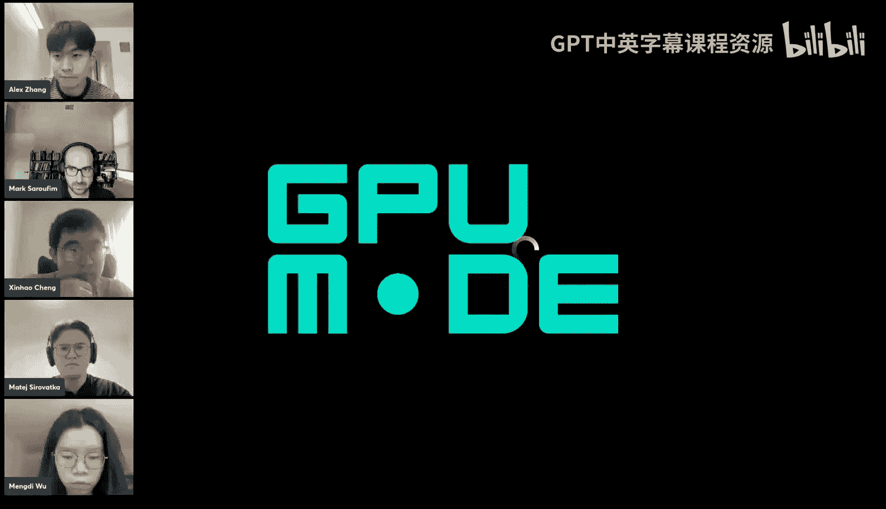
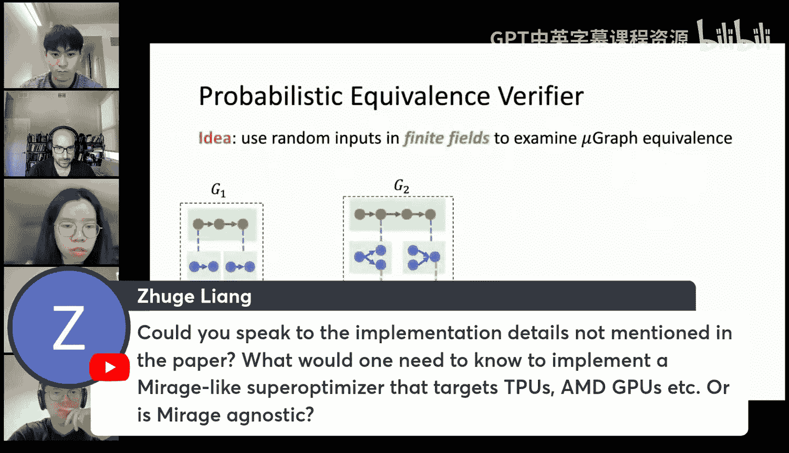
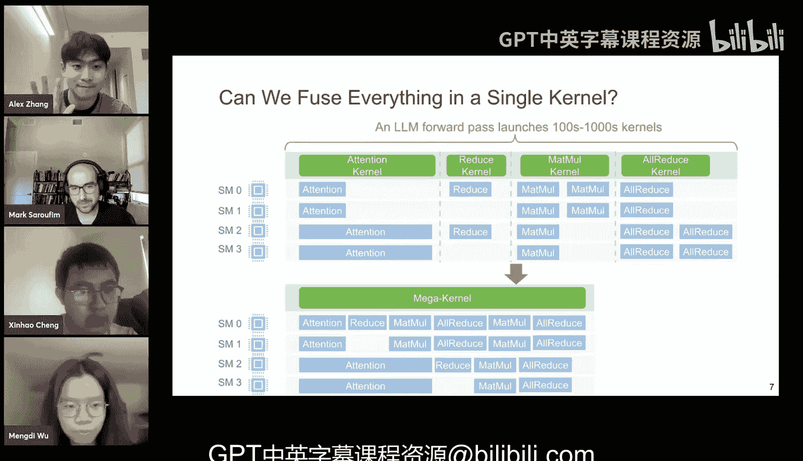

# 26：将大语言模型编译为巨型内核

在本节课中，我们将学习卡内基梅隆大学（CMU）的“巨型编译器”项目。该项目包含两个核心工作：**Mirage**（一个用于张量程序的多层级超级优化器）和**MPK**（一个将整个大语言模型编译为单个“巨型内核”的系统）。我们将首先介绍Mirage如何通过超级优化方法生成高效的CUDA内核，然后探讨MPK如何将整个模型的计算融合进一个巨型内核，以实现更好的性能。

## Mirage：张量程序的多层级超级优化器

上一节我们概述了课程内容，本节中我们来看看Mirage系统。GPU是执行机器学习应用最流行的专用硬件，但其结构复杂，包含多级计算和内存层次。单个GPU上有数十到数百个计算核心（称为流式多处理器，SM），每个SM又包含数百个CUDA核心。这些计算单元可以并行运行，形成了复杂的并行化策略设计空间。此外，不同层级的内存具有不同的带宽、大小和可访问性。通常，层级越低的内存聚合带宽越高、容量越小，且只能被更少的计算核心访问。为了编写高性能的GPU内核，程序员需要仔细匹配不同内存层级的张量，这非常困难。

为了执行神经网络，现有系统通常为每个算子启动独立的内核。例如，为了执行一个计算图，PyTorch等现有框架会为每个算子（如RMSNorm、Softmax、矩阵乘法）启动由供应商库提供的独立内核。但这可能导致性能不佳，因为它错过了内核融合、代数变换和本地内存使用等优化机会。为了获得高性能，人们需要为特定计算模式手动实现优化内核。例如，流行的注意力计算中的最后三个算子（矩阵乘法、Softmax、矩阵乘法）需要手动实现优化的注意力内核，这需要数百行CUDA C++或Triton Python代码，工作量巨大。而剩余的RMSNorm算子仍需由独立内核计算。

为了弥合高性能与低人力投入之间的差距，我们引入了Mirage，一个多层级超级优化器。Mirage并非首个超级优化器或自动化优化框架。现有的超级优化器（如TASO和PET）在算子级别应用代数变换以寻找优化算法。另一类工作（如TIM和Ansor）则执行调度变换以提高单个内核内的效率。然而，所有这些工作都依赖用户定义内核的计算，无法生成计算非标准的定制内核。

Mirage采用整体方法，在GPU层次结构的多个级别执行优化，支持代数变换、调度变换和定制内核生成。Mirage的输入是一个张量程序，输出是一组优化后的GPU内核，用于高效执行输入程序。Mirage减少了工程工作量：无需编写数千行CUDA代码或数百行Triton代码，用户只需在Mirage中编写几行Python代码。同时，它实现了更好的性能：在我们的基准测试中，Mirage的性能最高可超越现有系统3.3倍。此外，Mirage易于适应新架构和新模型，因为它不依赖任何手动实现。

为了实现整体优化，我们首先介绍中间表示：**MiGraph**，一种多层级图表示。MiGraph通过多种类型的图来捕获硬件内存层次结构，表示每个级别的计算。具体来说，每个MiGraph中有一个**内核图**，其顶点表示在单个GPU的SM上运行的内核计算，边表示存储在设备内存中的中间张量。顶点可以是标准张量算子（如矩阵乘法、归约），也支持供应商库。此外，我们还有一种特殊类型的算子，称为**图定义算子**。这些特殊图定义算子的计算由一个更低层级的图表示，称为**线程块图**。与内核图不同，线程块图中的顶点表示单个线程块的计算，张量存储在共享内存中。与内核图类似，我们也可以有供应商库支持的标准算子和图定义算子，其计算由更低的**线程图**定义。线程图中的算子由单个线程计算，中间结果存储在寄存器文件中，这与内核图和线程块图类似。通过这种图表示，Mirage能够表示多个级别的优化。

挑战在于如何探索极其庞大的搜索空间。常见方法是定义一组变换规则，将匹配特定模式的子图映射为等价子图。例如，在第一条规则中，我们根据除法和乘法的交换律，重新排序除法和矩阵乘法。第二条规则沿着矩阵乘法的归约维度应用循环展开，这是一种调度变换。这种基于变换的方法适用于单层级的优化，因为在这种情况下，变换可以总结为有限的规则。然而，如果我们考虑这种多层级优化，问题就变得困难了。在多层级优化中，最重要的是定制内核生成。在输入侧，我们可以将任意算子融合到单个内核中，这意味着有无限多种可能的输入模式。在输出侧，我们没有生成优化内核的通用规则，因为优化后的计算可能非常复杂。因此，用于定制内核的变换是密集且不规则的，很难设计。

因此，Mirage转而使用**穷举搜索**。它以一个张量程序作为输入，通过穷举搜索生成所有可能达到一定大小的MiGraph。这些生成的MiGraph候选并不保证正确。接下来，Mirage使用**等价性验证器**，通过随机测试来检查生成的MiGraph候选是否正确，我们在理论上保证了这种验证的正确性。所有经过验证的MiGraph都会被发送到**MiGraph优化器**，在那里我们执行不影响MiGraph正确性的优化，例如张量布局、内存规划和算子调度。最后，Mirage选择最快的内核作为输出。

让我们深入了解MiGraph生成器。在MiGraph生成器中，我们首先维护一个包含内核、线程块和线程级别所有算子的库，作为基本原语。Mirage将使用可用的算子，穷举搜索所有可能达到特定大小的MiGraph。例如，从输入有三个输入张量开始，我们从一个包含三个输入张量的图开始，尝试生成第一个算子，它可以是矩阵乘法、指数运算，也可以是图定义算子。然后Mirage会尝试生成第二个算子，它可以是另一个矩阵乘法。如果我们遇到一个图定义算子，我们将尝试通过类似的方法生成其底层计算定义，即生成更低层级的图。通过这种方式，我们不会错过任何优化计算的机会。然而，搜索空间将极其庞大。我们的想法是使用**表达式引导的剪枝**。从输入张量程序中，我们可以推导出想要计算的期望表达式。例如，输入程序是RMSNorm后接矩阵乘法，期望的表达式类似于对每个Z，K等于某个归一化项乘以W K I的和。在搜索过程中，我们可以使用这个期望表达式信息来引导剪枝。例如，在第一个分支中，我们计算了E的X I次方，这意味着所有后续的MiGraph都必须将其作为子表达式包含。我们假设在最优图中不会有任何冗余计算，这意味着这个E的X I次方项在后续搜索中不能被抵消。然而，在期望表达式中，我们看到它不包含任何指数运算，因此我们知道这个分支是无用的，可以将其剪除。在第二个分支中，当前表达式并不直接是期望表达式的子表达式，但它实际上是期望表达式在某种基本抽象属性下的一个表达式。实际上，可能存在一个等价于期望表达式且包含Y K作为子表达式的表达式。在这种情况下，我们保留这个分支并继续探索。

表达式为剪枝提供了良好的基础，然而，完整表达式信息仍然过于复杂，难以推理。为了在剪枝质量和剪枝开销之间取得良好平衡，我们引入了**抽象表达式**。我们不是保留完整表达式中的所有详细信息，而是抽象掉索引细节。例如，矩阵乘法的计算是C[I, J] = Σ_K A[I, K] * B[K, J]。在这里，我们抽象掉索引细节，这个表达式就变成了对64个元素的求和，每个元素是输入张量A的一个条目乘以输入张量B的一个条目。我们可以递归地计算MiGraph的抽象表达式：只需为输入张量选取随机且不同的变量，然后根据生成该张量的算子的语义计算其抽象表达式。通过这种抽象表达式，我们可以捕获大部分的语义信息，并且这些抽象表达式也易于推理。

我们建立一组以一阶逻辑表示的**公理**，来推理抽象表达式关系。这里有两组公理：等价公理和子表达式公理。等价公理捕获了操作之间的抽象代数属性。注意，这里我们只需要推理这些简单算子（如加法、乘法、除法、求和）之间的代数属性，它们都是标量粒度的，这意味着这些等价公理与涉及张量计算的代数属性相比非常简单。子表达式公理基本上就是自反性和传递性。

这是抽象表达式引导搜索的完整流程。我们以输入张量程序作为输入，Mirage自动从输入程序中推导出期望的抽象表达式。然后我们进行穷举搜索。在搜索的每一步，我们计算当前部分图的抽象表达式，并使用一个自动定理证明器，该证明器接收这些公理和抽象表达式及子表达式公理，来证明当前部分MiGraph的抽象表达式是否是期望表达式的子表达式。如果答案是肯定的，我们就继续搜索；否则，我们将剪除这个分支。实验结果表明，这种抽象表达式能显著提高搜索的可扩展性。蓝线显示了没有抽象表达式的Mirage搜索时间，橙线显示了带有抽象表达式的Mirage搜索时间。可以看到，在超过6个算子后，如果不使用抽象表达式，我们无法在可接受的时间内得到答案。而在我们的示例基准测试中，MiGraph需要3到11个算子。

Mirage的下一个组件是**概率等价性验证器**。图生成器会生成一组MiGraph候选，但其正确性无法保证。记住，在我们的剪枝过程中，我们抽象掉了一些信息，这可能导致输出的MiGraph候选存在错误。因此，我们需要一个验证器来检查每个生成的MiGraph是否在功能上等价于输入张量程序。我们的想法是使用随机测试。为了避免数值问题，我们在浮点精度下运行所有这些随机测试。基本上，我们为生成的MiGraph和输入张量程序随机生成输入张量，在相同输入下评估两个图，并检查输出是否相同。我们有定理证明：如果G1等价于G2，则O1总是等于O2；如果G1不等价于G2，则以一定概率，O1不等于O2。这给出了假阳性的概率。

接下来是**MiGraph优化器**。在MiGraph生成器中，我们只考虑不改变输出的优化，包括对象变换、内核实例化和计算组织。这些优化都可以由MiGraph捕获。对于其他不影响MiGraph正确性的优化（或者可以说未被MiGraph表示捕获的优化），我们会在验证MiGraph之后进行。这些优化包括张量布局优化、内存规划和算子调度。通过这种方式，我们减少了生成器的搜索空间，并解决了其余的问题。由于它们彼此之间更正交，我们以最优方式解决了剩余的优化问题。

以下是实验结果。我们在流行的机器学习应用中选择子图进行评估，例如归一化变换、QK归一化（指对Q和K进行归一化的注意力）、RMSNorm后接矩阵乘法、分组查询注意力、LoRA和GeMM。我们的基线包括所有供应商提供的库、专家手写的CUDA内核和编译器生成的内核。可以看到，在大多数情况下，Mirage的性能优于现有方法。

最后，我们通过一个案例研究来展示Mirage发现如何定制MiGraph的能力。对于分组查询注意力，Mirage可以生成类似于专家手写实现（如Flash-Decoding）的内核。这里我们需要两个内核，因为第一个内核计算部分和，我们需要第二个内核来累加这些部分和，因为我们无法在单个内核中直接在线程块之间通信。而在Hopper架构中，由于新架构允许我们在线程块簇之间通信，因此我们利用GPC级别的归约来加速注意力计算。Mirage会自动利用此功能生成高效内核，实际上，它比现有最佳内核快2.2倍。

总结一下，Mirage是一个多层级超级优化器，可以同时执行代数变换、调度变换和新内核生成。它只需要最少的工程投入，同时也能实现高性能。Mirage是一个开源项目，我们的论文已提交给今年的OSDI，如果您感兴趣，可以为我们的仓库做出贡献。

## MPK：Mirage持久化内核

上一节我们介绍了Mirage优化器，本节中我们来看看基于Mirage的后续项目MPK。在这个项目中，我们尝试将整个大语言模型编译成一个**巨型内核**。

对于LLM服务，大多数现有系统采用逐层内核的方法。计算图中的每一层都由一个CUDA内核实现。例如，模型层可能包含矩阵乘法、多头注意力或归约，所有这些计算都作为Meta的注意力或归约内核实现。我们已经有很多技术来实现和优化这些内核，例如CUTLASS、FlashAttention、Flash-Decoding、NVIDIA的TensorRT-LLM等。在这种逐层内核的方法中，每个内核包含多个线程块，这些线程块将被分发到GPU上不同的流式多处理器（SM）进行计算。

以静态方式实现工作负载平衡非常困难。例如，注意力内核的计算量取决于KV缓存长度。在这种情况下，每个SM可能为不同的请求执行计算，有些请求可能比其他请求长得多。因此，某些SM上的注意力计算可能比其他SM长得多。在这种情况下，当最后一个线程块未完成时，其他SM会长时间空闲。以静态方式，我们无法进行优化，因为工作负载取决于真实数据。我们需要等待真实请求到来，并为工作负载执行平衡。

当前逐层内核方法有几个限制。首先，**没有层间流水线**。在这种传统方法中，内核充当屏障。例如，我们有一个注意力内核后接一个归约内核。我们依赖内核来保证计算顺序正确，因为我们在同一个流上启动归约内核和注意力内核，这意味着归约计算不能在注意力内核完成之前开始。这种内核屏障阻止了我们跨不同内核实现软件流水线。例如，我们无法在当前内核完成之前开始为下一个内核加载数据。

第二个限制是**难以重叠计算和通信**。CUDA以非常粗糙的方式捕获数据依赖性。例如，我们有一个矩阵乘法内核后接一个归约内核。如果我们查看数据依赖性，每个归约内核的线程块只依赖于矩阵乘法内核的一个线程块。但如果我们将它们作为独立内核启动，所有归约计算必须等待所有矩阵乘法计算完成后才能开始。因此，这种内核方法阻止了我们重叠计算和通信。

最后，对于CUDA编程，使用CUDA图来减少内核启动开销非常重要。但CUDA图是静态图，难以支持动态工作负载。在今天的LLM服务中，我们为推理启动数百到数千个内核，这导致了显著的开销。

**内核融合**是解决此问题的一个好方法。我们可以将多个内核融合到单个内核中。例如，我们有一个RMSNorm后接一个矩阵乘法内核。在这种情况下，我们可以应用一些代数变换（如Mendi的演讲中介绍的），我们不需要计算中间张量Y I，可以直接使用三个输入张量通过重组计算方式来计算最终输出Z。通过这种方式，我们只需要启动一个内核，并且获得了更好的软件流水线。同时，我们减少了设备内存访问，因为我们不需要将中间结果Y I读写到片外内存。

那么问题来了：内核融合非常理想，我们能否将融合推向极致？能否将所有内容融合到一个内核中？这个想法是：与其启动数百到数千个内核来计算LLM的层，我们可以启动一个**巨型内核**来编译和计算所有内容。在这种情况下，不再有内核屏障，我们也可以重新排序算子。正如我们之前讨论的，每个归约只依赖于矩阵乘法的一部分，因此重新组织归约和矩阵乘法是安全的，我们仍然能得到正确结果。这种重组使我们能够实现计算和通信的重叠：当一些SM在使用张量核心时，其他SM可以进行归约并利用NVLink带宽。这种方法还让我们获得更好的负载平衡。例如，对于注意力计算，一些SM可能提前完成，我们可以为这些SM分配更多工作以减少总体延迟。

总结一下，与当前的逐层内核方法相比，这种巨型内核方法提供了三个关键优势：第一，**更好的层间流水线**，我们有更好的机会在不同算子之间构建软件流水线。第二，**可以重叠计算和通信**，因为现在我们捕获了细粒度的数据依赖性，我们知道每个归约片段只依赖于一个矩阵乘法片段，我们可以重新排序它们，在保持正确结果的同时，在不同GPU资源之间获得重叠。第三，**更好地支持动态工作负载**，因为我们不再需要CUDA图。当所有内容融合到一个内核中时，内核启动开销最小化，我们可以构建一个运行时系统来处理这种动态工作负载。

巨型内核非常理想，因为它将所有内容融合到一个内核中，但这也很具挑战性。第一个挑战是**需要管理数据依赖性**。原本我们依赖CUDA屏障来处理这种依赖性。现在，没有它，我们需要一种新机制来确保依赖性仍然得到保持。第二个挑战是**处理动态性**。对于LLM服务，存在许多维度的动态性。例如，使用连续批处理非常普遍，这意味着我们将不同用户的请求批处理在一起，在单次迭代中服务。我们可能有不同数量的请求和每个请求的不同令牌数。有时，我们可能需要混合预填充和解码阶段。使用分页注意力也很常见，有时我们使用推测解码来减少延迟。所有这些方法都引入了不同程度的动态性。最后一个挑战是**优化性能**。由于大多数现有编译器优化单个内核，但当我们把所有内容融合到一个内核中时，我们关心的是整个内核的端到端性能。

我们使用三种技术来解决这些挑战。首先，我们使用**任务图**来管理依赖性。其次，我们**构建内部运行时系统**来处理动态性。最后，我们使用**超级优化器**来生成高度优化的内核。我们的系统称为**MPK**，意为Mirage持久化内核。你可以认为我们有一个编译器，输入是LLM架构，输出是高度优化的巨型内核。我们的编译器可以减少工程工作量：用户无需编写数千行CUDA或Triton代码，只需提供模型的Python代码，编译器就能为你生成巨型内核。MPK也提供高性能：我们的内核性能比现有服务系统高1.2到6.7倍。我们还支持新模型：你无需为新模型添加新的CUDA代码。

MPK有两个主要组件：一个编译器和一个运行时系统。编译器以LLM作为输入，以及一些服务配置（如如何进行批处理、分页和推测解码）。编译器将生成一个任务图。一旦我们有了这个任务图，它就可以被MPK运行时用来服务请求。

以下是任务定义。这个任务图交错排列任务和事件。在我们的图中，每个蓝色框是一个**任务**。一个任务是在单个流式处理器上运行的工作单元。它可以是一个计算任务，例如一个矩阵乘法的分块、注意力的一个头；它也可以是一个通信任务，例如将一块数据传输到另一个SM或另一个GPU。除了任务，每个绿色圆圈称为**事件**。事件处理任务之间的同步。在图中，从任务到事件的边意味着当任务完成时，我们需要通知该事件。我们还有从事件到任务的边，这意味着当事件被完全触发时（即事件所依赖的所有任务都已完成），我们可以启动所有依赖于该事件的任务。

任务图类似于CUDA图定义，但在CUDA图中，每个节点是在整个GPU上运行的内核。在我们的任务图中，每个节点是在一个SM上运行的任务。任务图是比CUDA图更低层级的表示，它捕获了子内核级别的依赖性，而不是整个内核的依赖性。任务图也是静态且不可变的，我们构建一次，并在服务过程中重复使用。

首先，我们谈谈编译器。MPK包含一个编译器，将原始