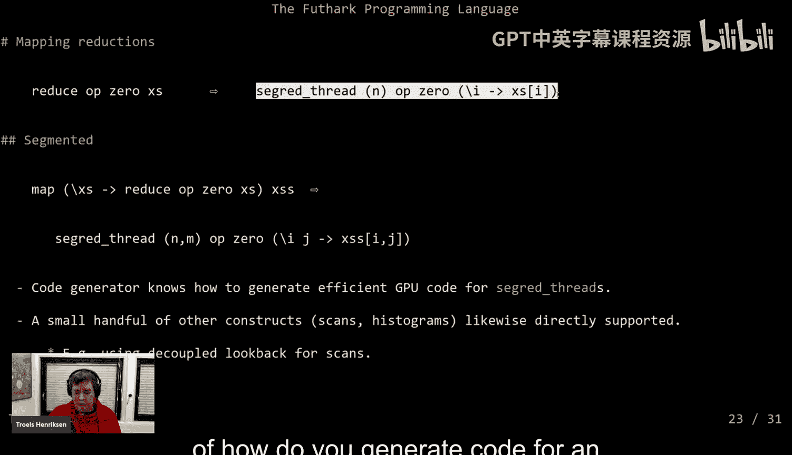
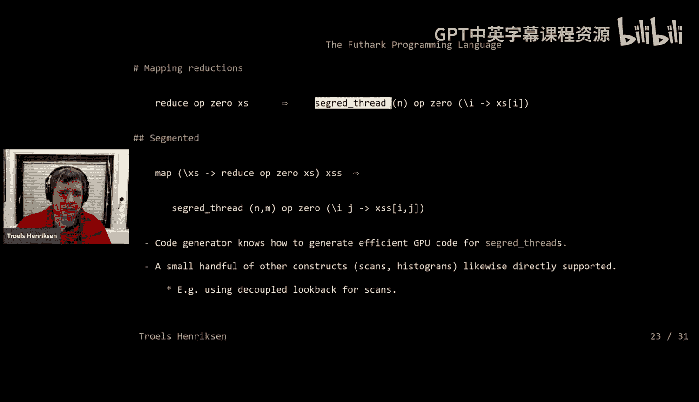
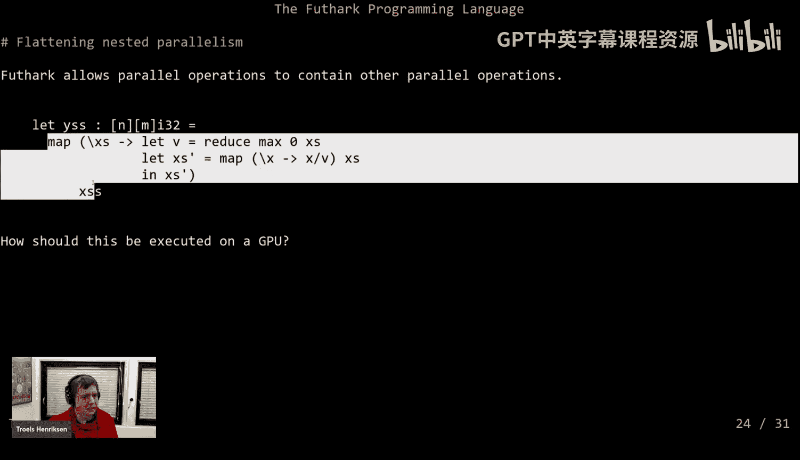
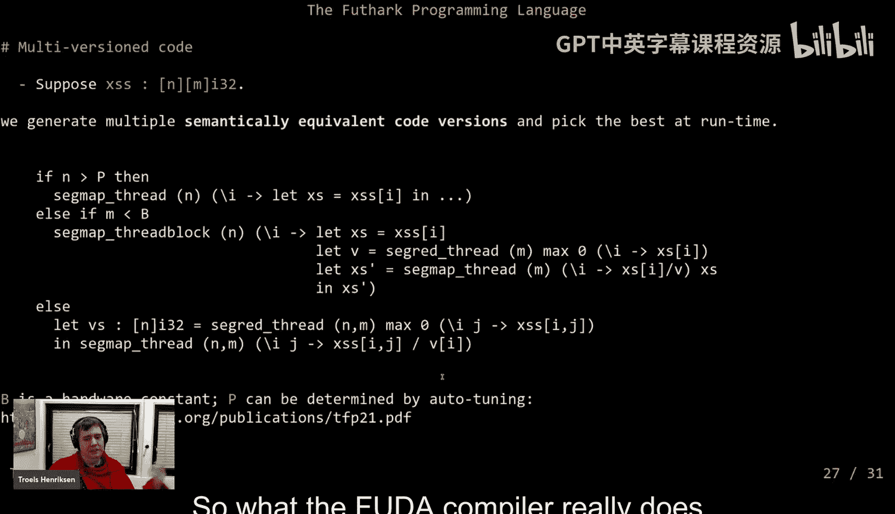
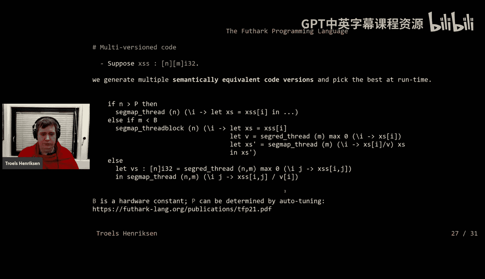
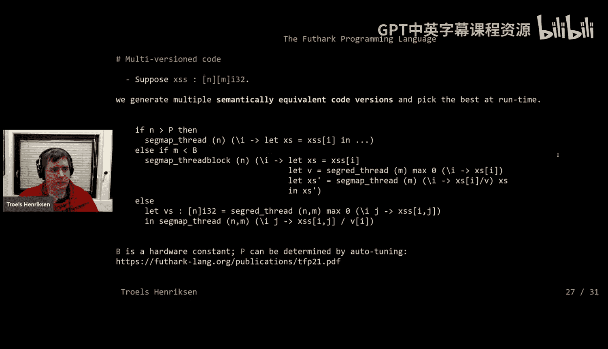
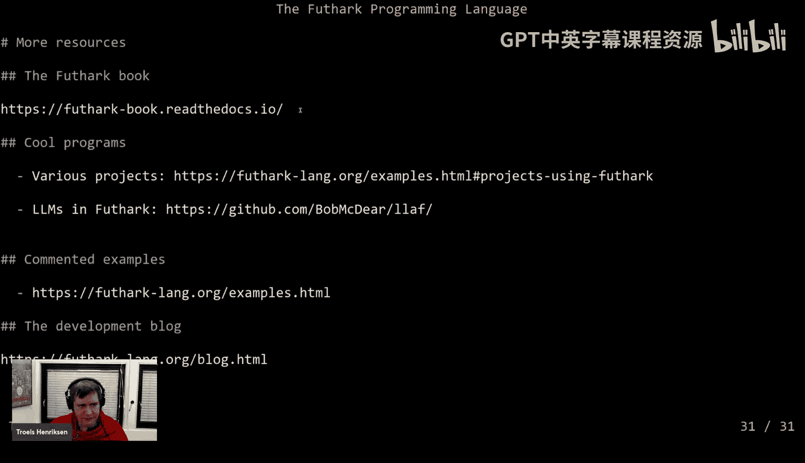
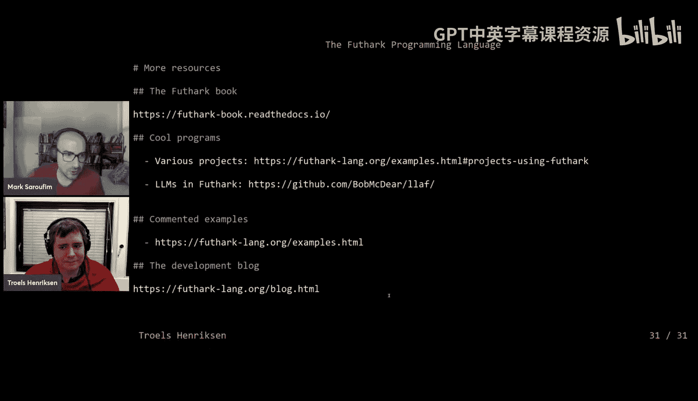
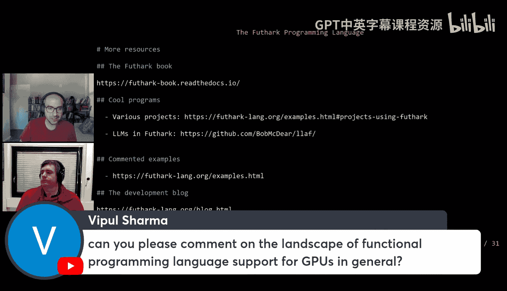
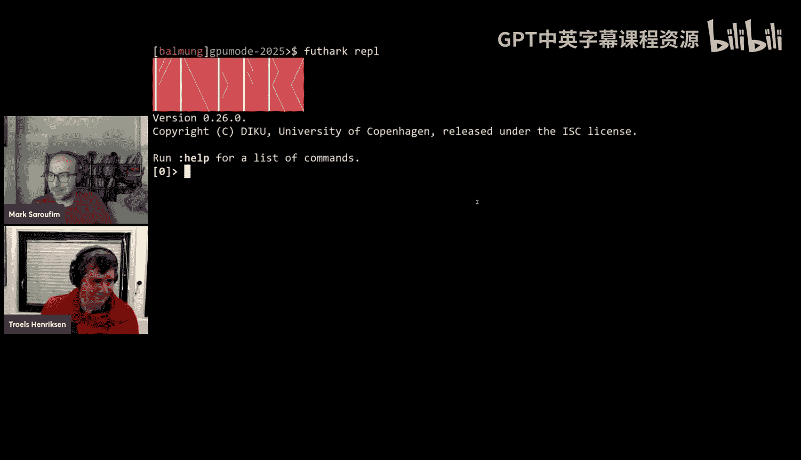

# 28：高性能纯函数式数据并行数组编程

## 概述

在本节课中，我们将学习Futhark——一种旨在实现高性能数据并行计算的纯函数式编程语言。我们将探讨其设计理念、核心特性，以及编译器如何将高级别的函数式代码转换为高效的GPU内核。课程内容将涵盖Futhark的基本语法、关键限制、编译优化策略，并分析其在现代GPU编程中的定位与挑战。

## Futhark语言简介

Futhark是一种纯函数式、数据并行的数组编程语言，属于ML语言家族。它由哥本哈根大学的研究团队开发，最初旨在为金融领域专家提供编写高性能计算模型的能力。Futhark的设计目标是让并行编程变得简单，即使对于初学者也是如此，同时保持硬件无关性，并依赖其编译器为特定硬件（尤其是GPU）生成高效代码。

## 核心语言特性

上一节我们介绍了Futhark的基本定位，本节中我们来看看其核心的语言特性。Futhark提供了标准函数式语言的特性，但为了性能目标，也施加了一些关键限制。

### 并行组合子

Futhark内置了一组编译器能够识别和优化的“并行组合子”。这些看起来像高阶函数，但对编译器有特殊的并行语义。

*   **`map`**: 将一个函数应用于数组的每个元素。其类型签名为 `(a -> b) -> [n]a -> [n]b`。
*   **`reduce`**: 使用一个结合性的操作符对数组进行归约。其类型签名为 `(a -> a -> a) -> a -> [n]a -> a`。
*   **`scan`**: 执行前缀扫描操作。
*   **其他**: 还包括 `scatter`, `histogram` 等少量原语。

用户程序最终由这些原语组合而成，编译器则基于它们进行并行化推理和代码生成。

### 关键限制

为了实现高性能并简化编译器设计，Futhark引入了几项在传统函数式语言中不常见的限制。

*   **无递归**: 禁止通用递归，以防止生成无法预测性能的代码。迭代通过特殊的尾递归语法糖（`loop` 结构）实现。
*   **受限的高阶函数**: 函数不是完全一等公民。具体规则包括：
    *   条件表达式（`if`）不能返回函数。
    *   不能创建函数数组。
    *   这些规则确保编译器总能静态确定被调用的是哪个具体函数。
*   **规则数组**: 多维数组必须是“矩形”的，即所有子数组在给定维度上大小相同。这保证了内存布局的可预测性。

### 值与数组表示

Futhark采用按值传递，并积极拆解元组等复合结构，将各部分作为独立值处理，便于存入寄存器。

对于数组，编译器会自动应用 **结构体数组到数组结构体（AoS到SoA）的转换**。例如，一个类型为 `[n](i32, i8)` 的数组，在内部会被表示为两个独立的数组：`[n]i32` 和 `[n]i8`。这确保了内存紧凑和对齐，是高性能计算中的标准优化。

### 反函数化

为了高效实现高阶函数，Futhark编译器使用 **反函数化** 技术。它将每个闭包（lambda表达式）转换成一个包含其自由变量的记录，并将函数调用点替换为对特定“提升函数”的直接调用。结合上述的类型限制，这最终能消除所有动态函数派发，生成直来直去的代码。

## 从高级代码到GPU内核

了解了语言特性后，我们来看看Futhark编译器如何将这些高级概念映射到GPU硬件上。

### 基础映射模式

编译器将核心并行组合子直接映射到抽象的GPU内核模式。

*   **`map` -> `segmap_thread`**: 一个对 `[n]a` 的 `map` 可以转化为一个启动 `n` 个线程的内核，每个线程处理一个元素。
*   **嵌套 `map` -> 多维 `segmap_thread`**: 完美嵌套的 `map` 可以转化为多维线程网格。
*   **`reduce` -> `segred_thread`**: 归约操作被转化为一个实现了高效并行归约算法的内核。
*   **分段操作**: 对于 `map` 内部包含 `reduce` 的情况（如批处理归约），编译器能识别并生成相应的 `segred_thread` 内核。

### 扁平化与多版本代码生成

实际问题中的 `map` 体可能很复杂，不直接符合上述简单模式。例如，一个对矩阵每行先求最大值再归一化的操作。

```
map (\row ->
  let max_val = reduce max (-f32.inf) row
  in map (/ max_val) row
) matrix
```

编译器采用 **扁平化/裂变** 变换，将复杂嵌套操作切割成多个简单的内核。对于上述例子，它可能生成多个实现版本：

1.  **完全顺序化**: 仅并行化外层，内层串行执行。
2.  **完全并行化**: 将内层操作也并行化，生成两个独立内核（一个归约，一个映射），中间结果写回全局内存。
3.  **利用共享内存**: 以一个线程块处理一行，在共享内存中协作完成该行的归约和映射。





编译器会根据运行时数组大小（通过启发式规则和自动调优确定的阈值）动态选择最佳版本。这虽然可能增加代码体积，但能适应不同规模的数据。

### 内存布局优化



编译器会尝试优化数组的内存布局以提高访问效率。例如，如果一个内核按列顺序访问一个默认行优先存储的二维数组，导致非合并访问，编译器可能会自动插入一个转置操作，使后续访问变为合并访问。这种布局优化是保证模块化编程性能的关键。

## Futhark的定位、应用与挑战





### 定位与比较

Futhark并非通用编程语言，而是用于编写计算库的领域特定语言。它通过外部函数接口（如C、Python）与主程序交互。



它也不是专用的GPU语言，而是一种具有良好GPU编译器的硬件无关语言。与Triton等底层内核语言相比，Futhark的目标不是达到极致的性能，而是在保持高级别、声明式编程风格的同时，获得显著优于手写CPU代码且可媲美非专家手写GPU代码的性能。其核心优势在于 **优化组合**：用户可以编写小型、模块化的组件，编译器会融合它们并消除中间存储开销。

### 应用案例

尽管是学术语言，Futhark已被用于一些实际项目，特别是在需要表达复杂并行算法且对性能有要求的领域，如：
*   计算流体动力学。
*   粒子模拟中的特殊神经网络。
*   其内置的自动微分功能对于机器学习原型开发尤其有吸引力。

### 当前局限与未来挑战



Futhark对现代GPU特性的利用尚有不足：
*   **缺乏异步操作**: 不支持内核间计算与通信的重叠。
*   **未利用特殊硬件指令**: 如Tensor Cores，因为编译器缺乏领域知识（如“这是一个矩阵乘法”）来触发它们。
*   **有限的Warp级编程**: 仅在硬编码的原语（如归约）中使用，未泛化到用户代码。
*   **无透明分布式支持**: 随机的数组访问模式使得透明的数据分布和通信变得困难。





这些是未来研究的主要方向。

## 总结

本节课中我们一起学习了Futhark编程语言。我们了解了它作为纯函数式数据并行语言的设计哲学，包括其核心的并行组合子、为确保性能而引入的关键限制（无递归、受限高阶函数），以及反函数化等实现技术。我们深入探讨了编译器如何通过基础映射、扁平化、多版本代码生成和内存布局优化，将高级别代码转换为高效的GPU内核。最后，我们讨论了Futhark在实践中的定位、应用场景以及面临的挑战。Futhark代表了一种让并行编程更接近普通函数式编程体验的探索，尽管存在限制，但它为编写高性能、可组合的计算内核提供了一个独特而强大的工具。

## 延伸资源



*   **《Futhark书》**: 学习Futhark编程和并行算法的入门指南。
*   **GitHub仓库与博客**: 包含大量示例、项目以及语言发展历程的详细记录。
*   **示例项目**: 如用Futhark实现的GPT-2模型，展示了其尺寸类型系统的应用。