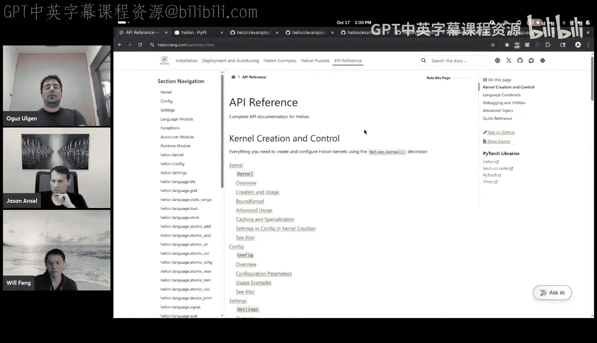
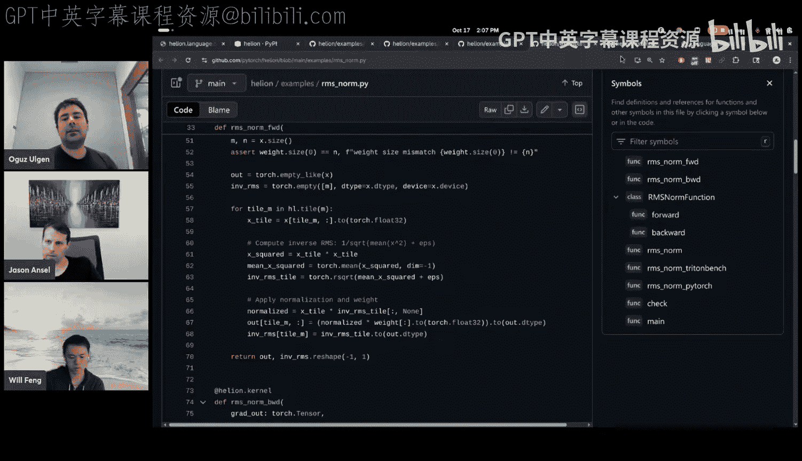
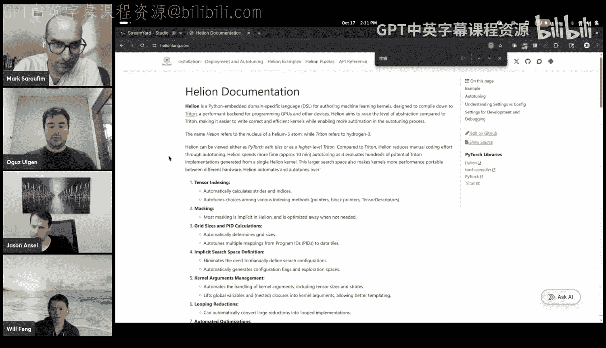
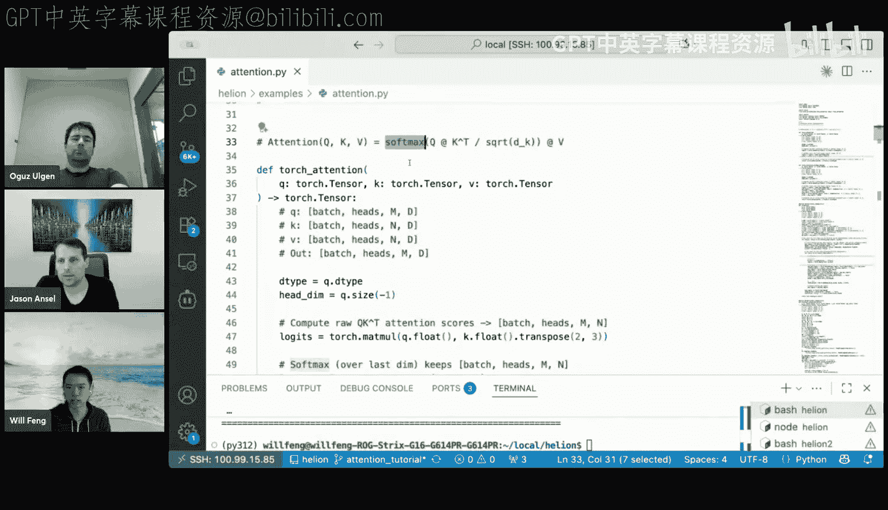

# 29：Helion：一种用于机器学习内核的高级领域特定语言

## 概述
在本节课中，我们将学习 Helion，这是一种用于编写高性能 GPU 内核的新领域特定语言。Helion 旨在提供比 Triton 等现有 DSL 更高的抽象级别，同时比 PyTorch 更低，从而让开发者能够更精细地控制生成的内核，而无需处理底层硬件细节。我们将探讨其设计动机、核心语言特性、自动调优机制，并通过实际示例展示如何编写 Helion 内核。

---

## 1：设计动机与核心理念

上一节我们概述了 Helion 的目标，本节中我们来看看为什么需要这样一个新的 DSL。

Helion 的诞生源于用户对 `torch.compile` 提出更多控制需求。用户希望精确控制生成的内核，这需要一个 DSL。Helion 的定位是提供一个抽象级别更接近 PyTorch 的 DSL，让开发者能够利用熟悉的 PyTorch 概念，而无需担心特定内核的底层细节。

Helion 实现高性能的关键在于集成了**自动调优器**。其核心思想是：一个 Helion 内核定义了一个巨大的搜索空间，自动调优器可以从中搜索数千个不同的 Triton 内核实现。这带来了两大优势：
1.  **节省人力**：无需人工尝试数百种内核实现方式，可以让自动调优器代劳，用机器算力换取人力。
2.  **硬件可移植性**：用低级语言编写的内核通常在新硬件发布时需要重写。而高级语言结合自动调优器，只需为新硬件重新调优即可获得更好的性能，从而提升跨硬件平台的移植性。

---

## 2：Helion 语言基础：以矩阵乘法为例

上一节我们介绍了 Helion 的设计理念，本节中我们通过一个矩阵乘法的例子来看看 Helion 代码的基本结构。

一个 Helion 内核主要包含两部分：
*   **主机端代码**：位于 `@hl.kernel` 装饰器定义的函数中，但在 `hl.tile` 循环之外。这部分是常规的 PyTorch 代码，用于分配输出张量等，将在即时执行环境中运行，不会被编译。
*   **设备端代码**：位于 `hl.tile` 循环内部。这部分代码将被编译成**单个** Triton 内核。

以下是一个矩阵乘法的 Helion 示例：

```python
import torch
import helion as hl

@hl.kernel
def matmul(A: hl.Tensor, B: hl.Tensor) -> hl.Tensor:
    # 主机端代码：分配输出张量
    M, K = A.shape
    K, N = B.shape
    C = torch.empty((M, N), device=A.device, dtype=A.dtype)

    # 设备端代码：使用 hl.tile 定义并行化网格
    for i, j in hl.tile((M, N), (BM, BN)):
        # 在 tile 内使用标准的 PyTorch 风格操作
        tile_C = torch.zeros((BM, BN))
        for k in range(K):
            tile_A = A[i, k]
            tile_B = B[k, j]
            tile_C += tile_A @ tile_B
        C[i, j] = tile_C
    return C
```

**核心概念 `hl.tile`**：
`hl.tile` 循环将给定大小的迭代空间划分为多个块。其具体划分方式（如块大小、迭代顺序）由自动调优器决定。你可以将其视为“带块的 PyTorch”。在 `hl.tile` 循环内部，可以使用标准的 PyTorch 操作，Helion 也支持控制流等其他结构。

---

## 3：自动调优的配置空间

上一节我们看到了 `hl.tile` 的基本用法，本节中我们深入探讨自动调优器可以优化的配置空间，这也能帮助我们更好地理解 Helion 语言的特性。

自动调优器在多个维度上进行搜索，以下是一些关键的配置选项：

**索引模式**
在 Triton 中，索引有指针运算、块指针、张量描述符等多种方式。在 Helion 中，你只需编写常规的 PyTorch 风格索引，自动调优器会自动在所有这些方式中选择最佳的一种。

**块大小**
当编写 `hl.tile` 循环时，你隐式地定义了一些块大小。对应的 Triton 代码需要大量样板代码来计算网格大小等，而 Helion 移除了这些样板代码。通过高级方式表达分块，Helion 还能实现更复杂的优化，例如将 2D 迭代空间扁平化为 1D 迭代空间。

**归约循环**
如果你在 Helion 中编写一个归约操作，可以以直观的方式表达。自动调优器会自动在“一次性加载整行”和“使用累加器迭代”这两种实现方式之间进行转换和选择，以优化寄存器使用和性能。

**程序 ID 与启动网格**
Helion 可以自动调优不同的启动网格策略，包括一维/二维启动网格，以及持久化启动网格（每个流多处理器运行一个 CUDA 程序，通过虚拟程序 ID 迭代，支持跨 CUDA 程序的流水线）。

**循环优化**
自动调优器可以优化循环分组和重排序，例如交换循环顺序或对迭代空间进行子划分以提升缓存复用。

**配置标志直通**
Helion 将许多 Triton 的配置标志（如 `num_stages`, `warp_specialization`, `num_warps` 等）暴露出来，并自动为其调优。

**自动掩码处理**
掩码处理可能很棘手，Helion 为你自动化了许多掩码处理逻辑，并且在静态形状情况下会将其优化掉。

---

## 4：自动调优器的工作原理

上一节我们了解了丰富的配置选项，本节中我们来看看自动调优器是如何工作的。

目前的自动调优算法相对直接，但效果显著：
1.  **初始种群**：随机选择 100 个配置。
2.  **选择**：从中选出前 5 个最快的配置。
3.  **爬山法**：对每个最快配置进行局部搜索，寻找局部最优解。
4.  **确定最终配置**：选择所有局部最优解中最快的一个。

经验表明，对于大多数内核，这个搜索空间相当规则，因此该算法能取得良好效果。一次完整的调优大约需要 20 分钟来搜索数千个候选内核。未来我们计划探索更复杂的算法，如大语言模型引导搜索、强化学习或共享性能数据库。

**配置部署方式**
*   **单一配置**：将自动调优器输出的最快配置复制到代码中，后续运行将直接使用此配置。
*   **多配置**：针对不同形状（如小形状和大形状）分别调优，得到多个配置。内核在首次遇到新形状时会尝试所有配置并缓存最快的结果。
*   **手动路由**：可以提前将不同配置编译成不同的运行器，然后编写简单的路由函数来根据条件（如张量大小）选择使用哪个运行器。

---

## 5：性能表现与内部原理

上一节我们介绍了调优过程，本节中我们看看 Helion 的实际性能表现，并简要了解其内部编译器原理。

**性能对比**
*   **与 Quack 比较**：在 RMSNorm 等操作上，Helion 和其等效的 Triton 实现在所有形状大小上都表现良好，获得了更好的性能可移植性。
*   **B200 上的加速**：与 eager 模式的 PyTorch 相比，Helion 平均可获得 3.2 倍的几何平均加速。与手工编写的 Triton 内核相比，Helion 几乎快一倍，这主要得益于自动调优器能更好地优化 Triton 代码。
*   **AMD 上的表现**：与 B200 上的情况类似，Helion 在大多数情况下都是最快的。

**编译器内部原理**
Helion 作为 Python 元 DSL，其编译流程如下：
1.  **Python AST**：从 Python 抽象语法树开始。
2.  **类型注解**：用类型和元数据注解 AST。
3.  **FX 图转换**：将其转换为多个 FX 图（每个基本块一个图）。每个 FX 图节点都附有 Inductor IR。
4.  **编译器传递**：在这些 IR 上运行编译器传递。
5.  **代码生成**：仅在代码生成阶段融入自动调优器确定的配置。这意味着配置点左侧的所有步骤只需运行一次，右侧步骤在每次调优时重新运行。
6.  **输出**：最终生成 Triton 代码。对于调用内核的包装代码，Helion 使用 AST 重写将 `for` 循环转换为内核启动。



---

## 6：快速入门与基础示例

上一节我们从宏观了解了 Helion，本节中我们开始动手，学习如何安装 Helion 并编写一些简单内核。

**安装与文档**
*   **安装**：`pip install helion`。同时需要安装 PyTorch 2.9 和 Triton 3.5。
*   **文档**：访问 `helion.com` 获取详细文档和 API 参考。

**示例1：逐元素加法内核**
这是最简单的内核之一，展示了主机端与设备端代码的划分：

```python
@hl.kernel
def add(A: hl.Tensor, B: hl.Tensor) -> hl.Tensor:
    # 主机端代码
    output = torch.empty_like(A)
    # 设备端代码：tile 循环
    for i in hl.tile(A.shape):
        output[i] = A[i] + B[i]
    return output
```
**重要抽象**：一个 Helion 内核保证会被转换为单个 Triton 内核，设备端的所有内容将被融合到一个内核中。

**示例2：矩阵乘法与 Epilogue**
这个例子展示了如何向内核传递一个 lambda 函数作为 epilogue（后处理）：



```python
@hl.kernel
def matmul_with_activation(A: hl.Tensor, B: hl.Tensor, activation) -> hl.Tensor:
    M, K = A.shape
    K, N = B.shape
    C = torch.empty((M, N), device=A.device, dtype=A.dtype)
    for i, j in hl.tile((M, N)):
        accumulator = ... # 矩阵乘计算
        # 应用 epilogue 激活函数
        C[i, j] = activation(accumulator)
    return C
```
调用时，可以传入 `torch.relu` 等函数，生成的 Triton 内核将包含对应的激活操作。

**示例3：带掩码的张量连接**
当操作不需要覆盖整个张量时，可以使用掩码：

```python
@hl.kernel
def concat_2d(A: hl.Tensor, B: hl.Tensor, dim: int) -> hl.Tensor:
    out_shape = ...
    output = torch.empty(out_shape, device=A.device)
    for idx in hl.tile(output.shape):
        # 加载时使用掩码防止越界访问
        tile_A = A[idx] if idx[dim] < A.shape[dim] else 0
        tile_B = B[idx] if idx[dim] >= A.shape[dim] else 0
        # 合并数据
        output[idx] = torch.where(condition, tile_A, tile_B)
    return output
```

---

## 7：高级技巧：以 RMSNorm 为例



上一节我们看了几个基础内核，本节中我们以 RMSNorm 为例，探讨一些更高级的 Helion 编程技巧。

RMSNorm 的简单实现可能直接使用 `torch.mean` 和 `torch.rsqrt`。虽然方便，但在某些情况下可能效率不高，因为它需要加载整行数据。

**高级实现技巧**
1.  **注册块大小**：当内核中有多个内部归约，且需要确保它们使用相同的块大小时，可以使用 `hl.register_block_size` 预先注册一个块大小。这会告知自动调优器，在使用此块大小时，必须保证所有 tile 使用相同的块大小。
    ```python
    block_size = hl.register_block_size("reduce_dim")
    ```
2.  **驱逐策略**：对于会被重用的数据，可以指定更保守的驱逐策略（如 `evict_policy=hl.EvictPolicy.KEEP`），而对于只使用一次的数据，可以指定立即驱逐（`evict_policy=hl.EvictPolicy.EVICT`）。这类似于 Triton 中的做法，允许你更精细地控制缓存行为。

**关键点**：对于简单的 RMSNorm，自动调优器会自动做出这些优化决策。但在你需要更明确控制内核生成方式的情况下，可以手动使用这些高级功能。

---

## 8：调试与开发体验

上一节我们编写了更复杂的内核，本节中我们学习如何调试和优化开发体验。

Helion 提供了多种环境变量来辅助调试：

**输出生成的 Triton 代码**
设置 `HL_PRINT_OUTPUT_CODE=1`。这会在 Helion 生成 Triton 代码后将其打印出来，同时还会输出一个易于复现问题的脚本。

**关闭或减少调优开销**
*   `HL_AUTOTUNE_EFFORT=none`：完全关闭自动调优，使用默认配置，适用于快速测试正确性。
*   `HL_AUTOTUNE_EFFORT=fast`：进行快速调优，寻找“足够好”而非最优的结果。

**解释执行模式**
设置 `HL_INTERPRET=1`。这不会通过 Triton 后端运行内核，而是将设备端代码转换为 FX 图可追踪的代码，并使用 PyTorch eager 模式在主机上执行整个区域。适用于调试数值问题。

**启用详细日志**
使用 `HL_LOG=all` 或 `HL_LOG+=all` 来启用调试级别的日志，输出内部诊断信息以帮助识别问题。

**编程体验说明**
*   **主机端代码**：理论上可以执行任何操作，因为它运行在 eager 环境。但涉及张量的元操作会以 eager 方式执行并产生警告。
*   **设备端代码**：支持大部分操作。`print` 语句会被自动转换为 Triton 的 `tl.print`。断点支持可能有限。
*   **问题反馈**：如果遇到问题，欢迎在 GitHub 仓库提交 issue。

---



## 9：实战：编写注意力机制内核

上一节我们关注于调试，本节中我们通过一个复杂的实战案例——注意力机制内核，来综合运用所学知识。

注意力机制的计算步骤包括：QK^T 矩阵乘、缩放、softmax、与 V 的矩阵乘。

**核心设计决策**
编写 Helion 内核时，最关键的是决定**哪些维度可以并行化，哪些维度必须顺序执行**。
*   对于注意力内核，只有 softmax 操作所需的归约维度（序列长度 `n`）需要顺序执行。
*   其他维度（如批大小 `batch`、头数 `num_heads`、查询长度 `m`）都可以并行化。

**内核结构**
1.  **外层并行化**：最外层的 `hl.tile` 在 `batch * num_heads` 和 `m` 维度上进行并行化，这对应了 Triton 内核的启动网格。
2.  **内层顺序执行**：在内层，使用另一个 `hl.tile` 循环顺序遍历 `n` 维度。
3.  **计算步骤**：在内层循环的每个 tile 中，执行 QK 乘、softmax 计算、与 V 乘，并更新 softmax 所需的运行最大值逻辑。
4.  **写入结果**：循环结束后，完成 softmax 并写入输出张量。

**优势**
Helion 帮你处理了计算偏移、形状对齐等繁琐的细节，让你可以专注于更高层次的并行化策略设计。

**查看输出代码**
使用 `HL_PRINT_OUTPUT_CODE=1` 可以查看生成的 Triton 内核，其中包含了所有必要的启动网格计算和索引样板代码，方便调试和验证。

**硬件特定优化**
如果需要使用最新的硬件特性（如 Blackwell 的特定指令），Helion 支持在设备端代码中直接内联 PTX 汇编字符串。

---

## 10：组合性、与 PyTorch 生态的集成及未来展望

上一节我们完成了注意力内核的实战，本节中我们探讨 Helion 如何与现有生态集成以及未来的发展方向。

**与 Triton 和 PyTorch 的组合性**
Helion 遵循“一个 Helion 内核即一个 CUDA 内核”的不变量，这与 Triton 相同。因此，你可以在一个 PyTorch 程序中混合使用 Helion 内核、Triton 内核和普通的 PyTorch 操作，它们通过输入输出进行交互，互不干扰。

**与 Torch Compile 的集成**
Helion 内核已经可以与 `torch.compile` 组合使用。目前，Helion 内核被编译为 Triton 内核，然后像自定义 Triton 内核一样被送入编译流程。未来，我们计划实现 Helion 内核与 `torch.compile` 更深入的融合，例如 prologue/epilogue 融合。

**底层实现共享**
Helion 复用了 Torch Inductor（`torch.compile` 的后端）的许多基础设施来生成 Triton 代码。因此，你可以在 Helion 设备端代码中直接使用大多数 PyTorch 逐点和归约操作，它们会通过相同的 Inductor lowering 流程被处理。这避免了 Helion 需要维护庞大的操作库。

**未来方向：MegaKernel 支持**
目前，Helion 支持在单个内核中有多个顶级的 `hl.tile` 循环（foreach 风格）。未来，通过引入同步操作（如 barrier），可以更轻松地构建将整个模型计算放在单个内核中的 MegaKernel。这对于计算量很小的模型尤其有益，可以减少内核启动开销。

---

## 总结
在本节课中，我们一起学习了 Helion 这一用于机器学习内核编写的高级 DSL。我们从其设计动机和核心理念出发，了解了它如何通过高层抽象和强大的自动调优来平衡开发效率与性能。我们学习了 Helion 的基本语法结构，包括主机端与设备端代码的划分，以及核心的 `hl.tile` 构造。我们深入探讨了自动调优器的工作原理和丰富的配置空间。通过从简单的加法到复杂的注意力机制等多个示例，我们实践了如何编写和调试 Helion 内核。最后，我们还了解了 Helion 与 PyTorch 生态系统的集成以及未来的发展潜力。希望本教程能帮助你开始使用 Helion 来编写高性能、可移植的 GPU 内核。