# 30：形式化内核推导 🧠

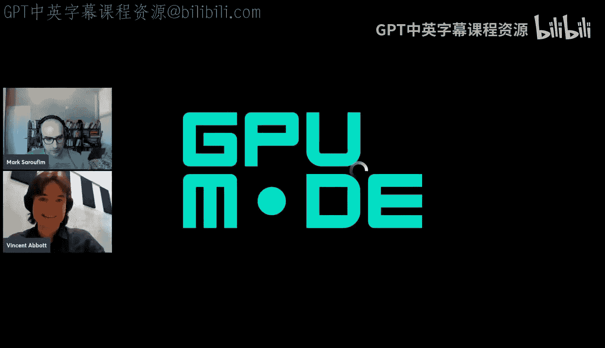

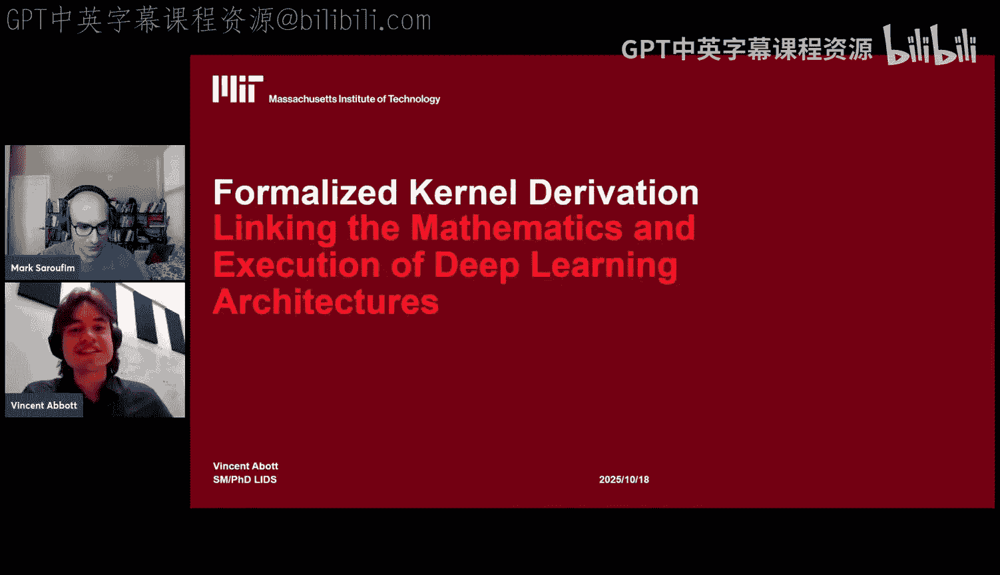

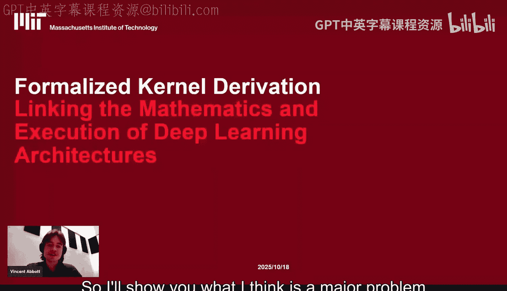

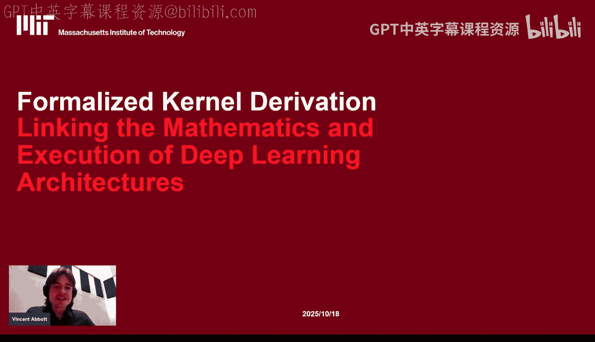

## 概述

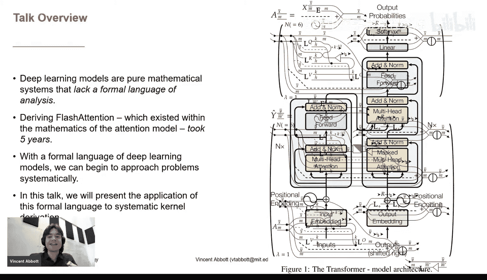

在本节课中，我们将探讨深度学习研究中的一个核心问题：尽管深度学习模型是纯粹的数学系统，我们却缺乏分析它们的正式语言。这导致从数学描述到高效底层实现（如Flash Attention）的推导过程漫长且困难。我们将介绍一种基于范畴论的正式数学系统，用于描述深度学习模型，并展示如何将其应用于系统化的内核推导和性能建模。

---

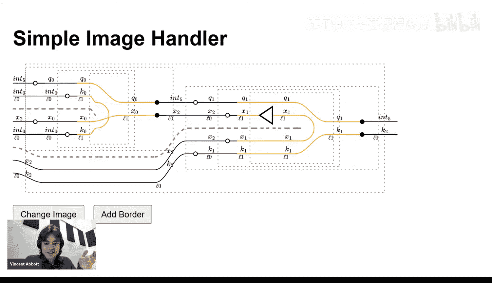

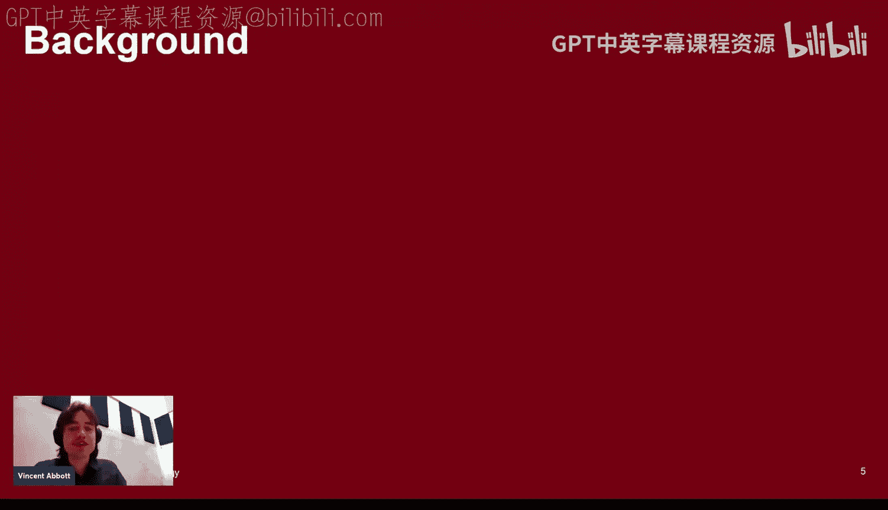

## 研究背景与动机

上一节我们概述了课程目标，本节中我们来看看当前深度学习领域面临的挑战。

深度学习模型是数学函数。每一层的输出是前一层输入的函数。然而，我们无法直接使用一个“神谕”来实现这些函数，原因在于我们必须面对的计算限制。

深度学习模型的设计与其实现任务密不可分。如果这一点不成立，那么“神谕”就足够了。AlexNet是第一个真正利用GPU并行计算的网络。Transformer紧随其后，它能够以更易于计算处理的方式，通过多个注意力头并行处理所有数据，完成与RNN类似的过程。专家混合模型则是一种利用多GPU系统优势来编码前馈层的方法。

因此，深度学习架构的基本设计挑战并不一定是拥有纯粹的数学表示，而是拥有一个与执行密切相关的数学运算。然而，推导这些底层优化（甚至包括决定如何在GPU间分配计算的高层策略）是困难的。

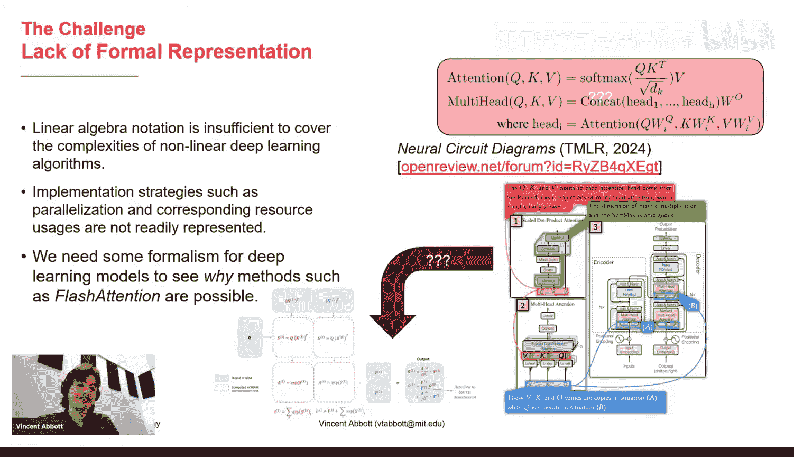

Flash Attention花了五年时间才被推导出来，又花了两年时间才适配Hopper架构。DeepC在2024年发布，它实现了一个相对标准的Transformer模型，但通过更好地协同设计软件与硬件，实现了惊人的性能水平。

一个关键事实是，这些算法的性能优势本就存在于当时的硬件中，存在于现有算法附近的设计空间里，但我们却花了这么长时间才推导出它们。

那么，为什么这个问题如此困难？因为深度学习模型本质上是数学函数。这意味着存在一个数学关键点，一个这些事物存在的“原因”，它存在于现有的数学之中。

当我们处理深度学习算法时，我们从数学描述走向算法，最终走向底层实现。但在那个数学描述中，必然存在某种原因，使得那个底层实现成为可能。我们如何才能发现这种关系？如何轻松地从数学函数走向底层实现？

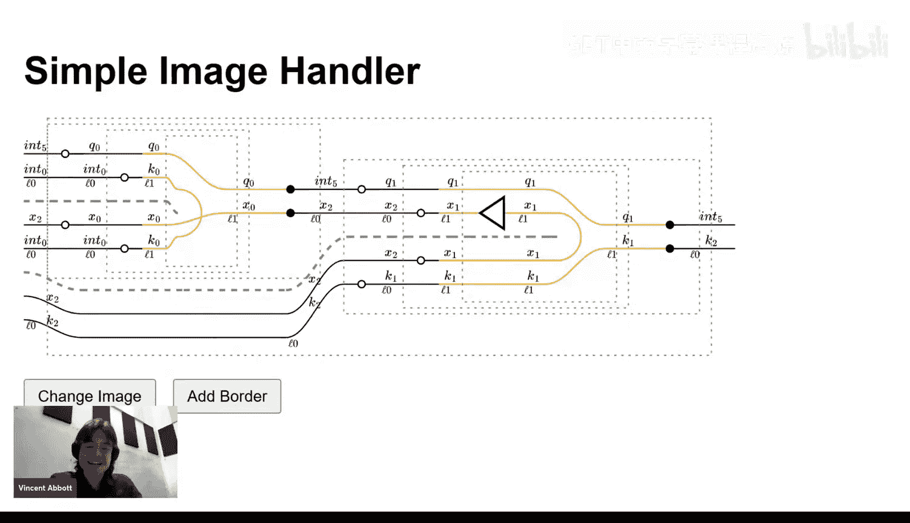

挑战很大程度上在于我们缺乏正式的表示方法。目前，我们经常使用线性代数表达式。但它们不足以覆盖深度学习中的非线性操作。例如，在注意力算法的表达式中，softmax发生在哪里？连接操作发生在哪里？这些变量的维度是多少？一个操作如何与另一个操作的广播相关联？

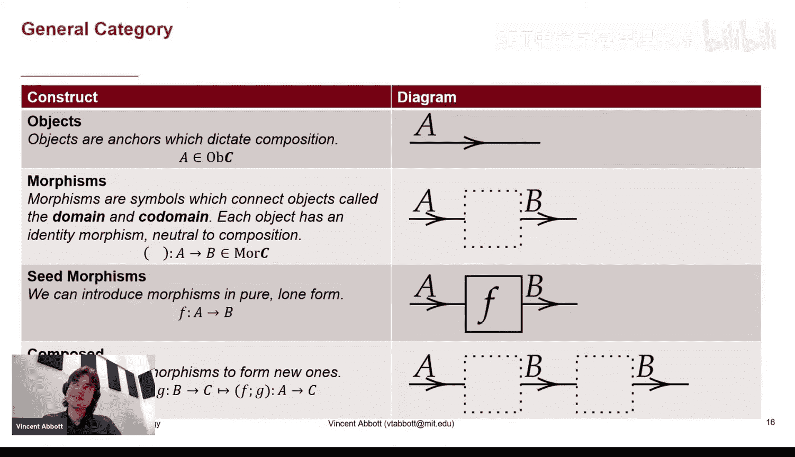

鉴于这些标准的、临时性的线性代数或临时性的图表表示，很难看出它们如何转化为我们追求的底层实现。这就是推导这些算法如此耗时的主要原因。

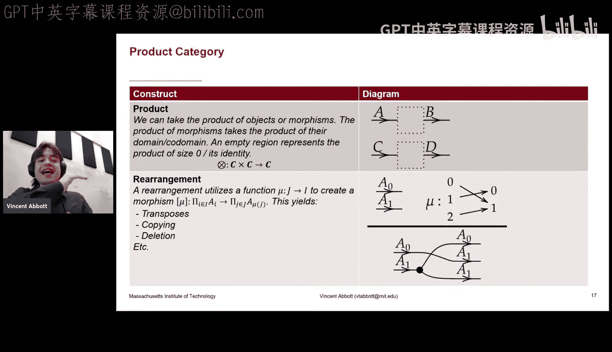

因此，答案是：我们需要一种用于深度学习模型的正式形式体系，它可以解释为什么像Flash Attention这样的方法是可能的。这样的形式体系对于其他形式的分析也有好处，但在本次讲座中，我将专注于底层内核推导，因为这是一个图表能提供巨大优势的领域，并且许多数学问题已经得到解决。

---

## 解决方案：范畴论

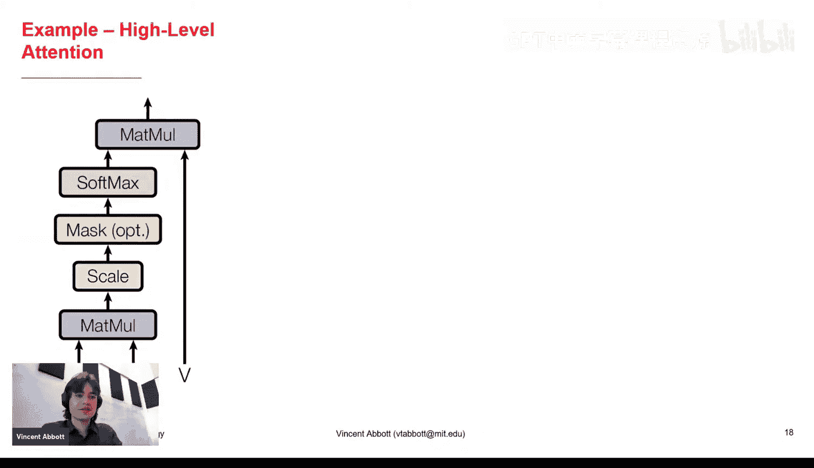

上一节我们探讨了问题的核心，本节中我们来看看提出的解决方案：范畴论。

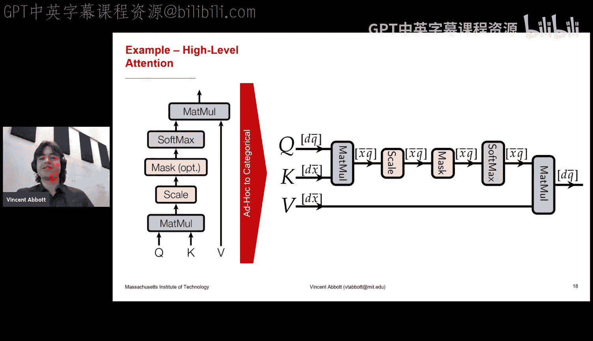

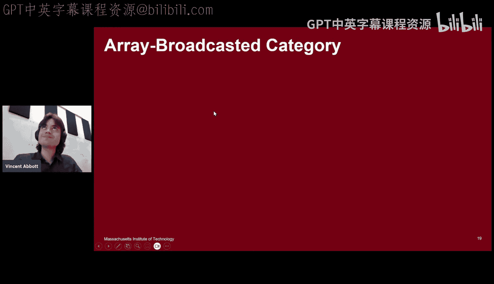

范畴论是抽象和组合的数学。它研究由对象和态射通用构建的组合系统。对象是锚点，态射是链接。因此，它可以描述图、相互作用的函数族、形式化的图表，甚至算法。

范畴论的一个著名结果是Yoneda引理。范畴论的语言可以描述系统，然后提供关于某些性质的证明。范畴论允许构建这些图表，并在其中编码代数规则，从而推导出复杂的关系。

对于许多听说过范畴论的人来说，可能会担心它有时以无尽的抽象而闻名。那么，我们为什么要尝试应用范畴论呢？

我喜欢这样思考：像群论这样的东西，就其本身而言，可能极其抽象，专注于现实世界中不一定存在的事物。它是一堆定理的大杂烩，或者像黎曼几何那样。但考虑到像粒子物理学这样的领域，其问题的本质是所有这些相互作用的对称性，群论就成为了处理它的恰当且正确的语言。这使得群论这个抽象的数学领域能够作为系统的表示，并提供与之相关的定理。然后，我们发展出的粒子物理学数学、它对量子物理学的理解，使得在现实世界中的各种实现成为可能。

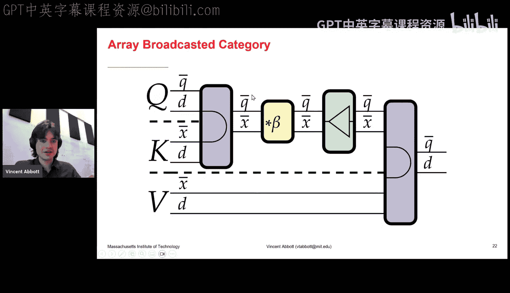

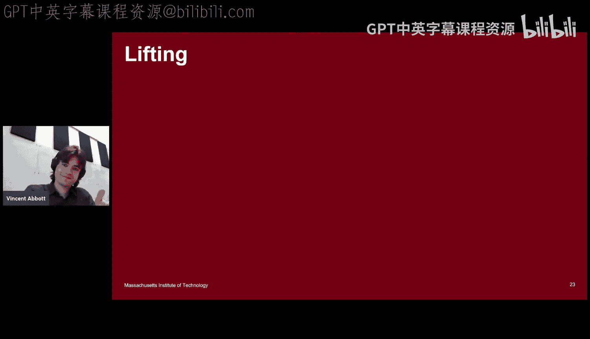

因此，我们看到，一个抽象的数学系统，在遇到具有该系统所描述特征的问题时，可以从高度抽象转变为高度应用。对于范畴论也是如此。

深度学习模型本质上是高度组合的系统。我们关心多个层次的分析：功能层次、实现层次、概率流层次，所有这些相互作用的层次。因此，范畴论作为组合系统及其之间关系的研究，变得相关，并成为描述这些事物的相关工具。

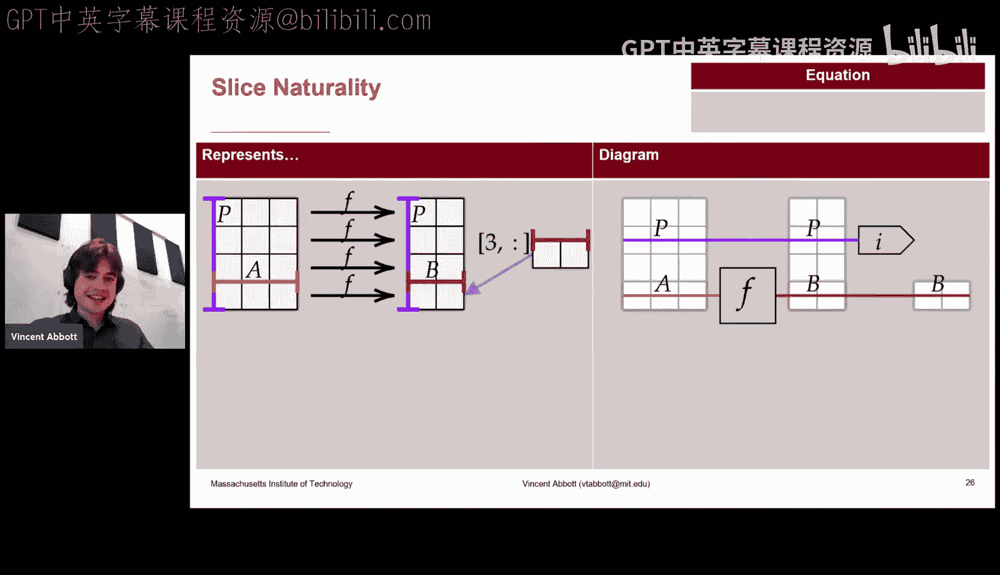

因此，我们可以从数学走向一种表示形式。范畴论提供了我们谈论这些系统所需的语言，以及进一步描述它们的工具和定理。我们看到，这种表示然后也可以走向实现。

---

## 范畴论基础：积范畴

上一节我们介绍了范畴论作为解决方案，本节中我们来看看其基础概念：积范畴。

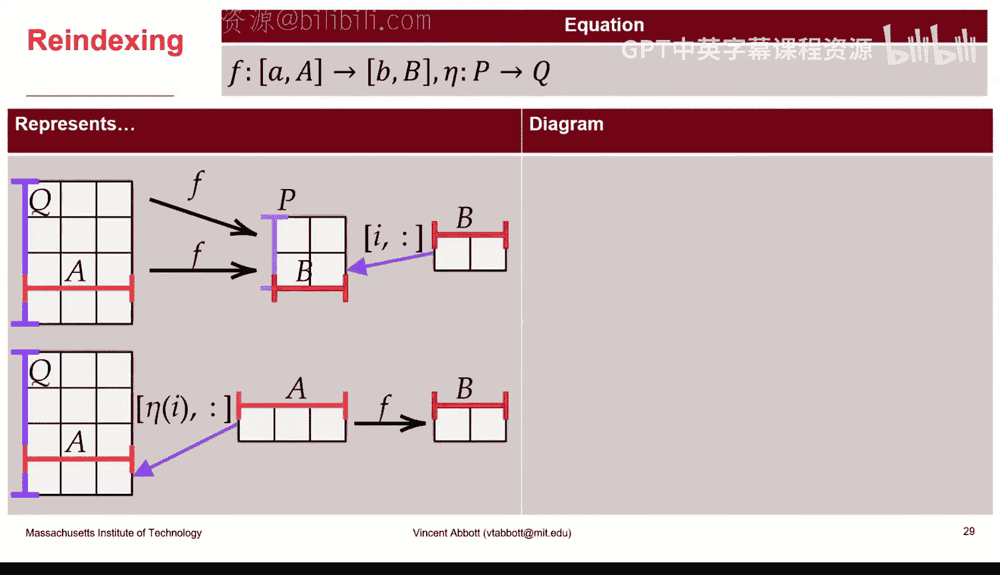

一个范畴，具体来说是一个积范畴，我们如何构建它？

*   **对象**：对象是锚点，它们决定组合。对于函数可以是集合，对于图可以是节点。我们将以特定方式绘制对象：画一条带箭头的线并标记它。
*   **态射**：态射连接对象。我们用边连接节点，用函数连接集合。态射是任何具有这种形状的东西：从A到B，或者从A到A。
*   **生成元**：为了描述一个范畴，我们会有一些生成态射。从这些生成态射出发，构建其他一切。这在技术上并非必需，但对于表示范畴、实现它等非常有帮助。
*   **组合**：我们可以组合态射。当我们组合态射时，我们连接它们，并且中间对象必须相同，这就形成了一个新的态射。你会注意到这个形状模仿了那个形状，因此我们形成了一个态射。

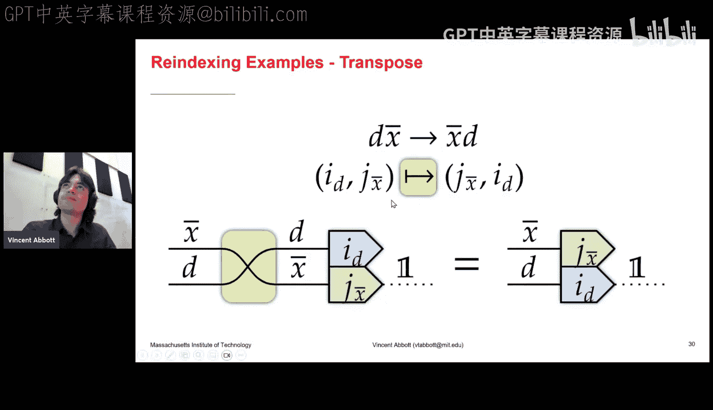

在积范畴中，我们还可以堆叠事物。

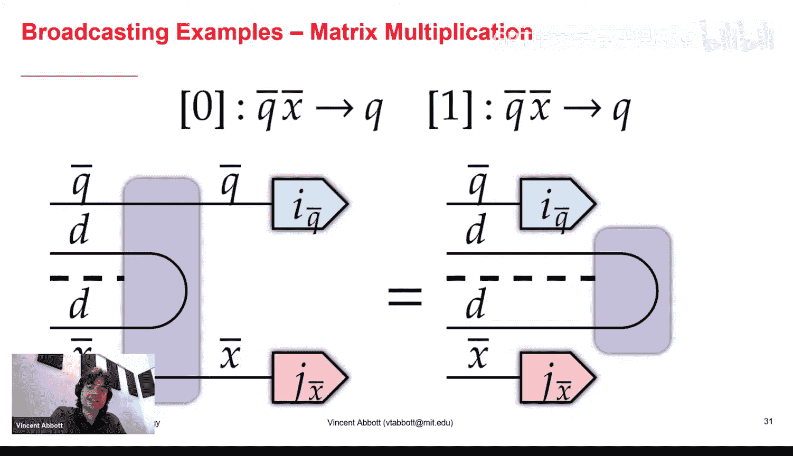

*   **积**：积可以将对象组合成新对象，将态射组合成新态射。组合对象，例如，是将数据类型组装成数据类型的二元组。在这种情况下，取函数的积就是并行运行这些函数。因此，当我们堆叠函数时，我们也堆叠它们的对象。并行执行的函数分别在两个输入上独立执行。使用这样的图表，我们可以表示这一点以及更复杂系统是如何构建的。

接下来，我们有重排。

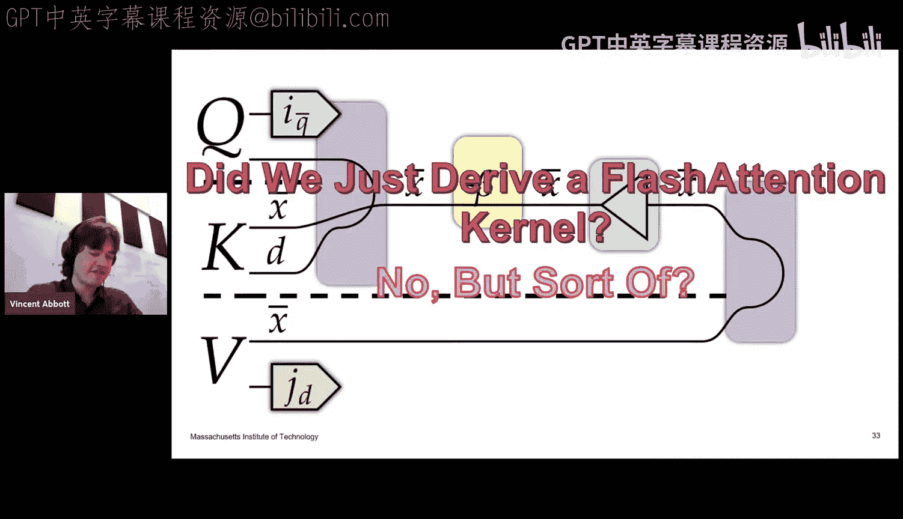

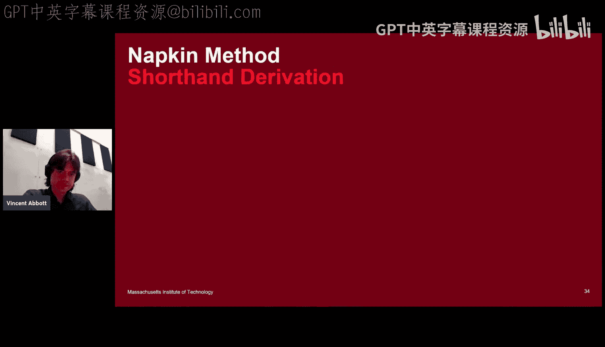

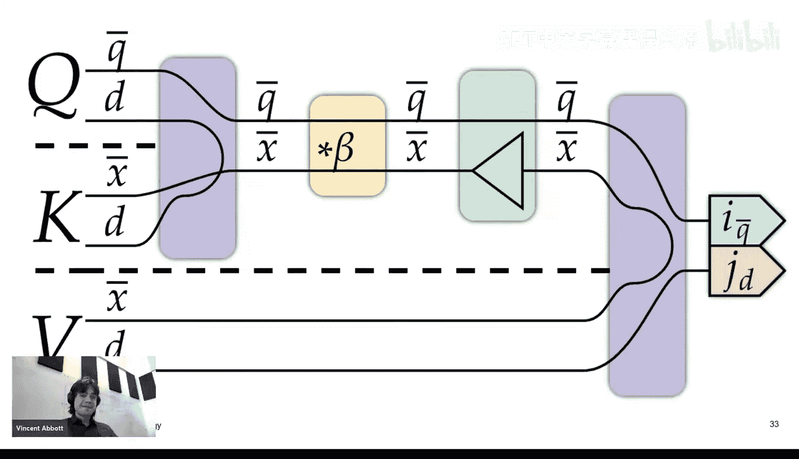

*   **重排**：重排有一个非常好的图表表示，但起初可能不直观。它表示像转置、复制和删除这样的操作。当我们转置、复制或删除数据时，我们并没有操纵数据的内容，我们只是在重新排列它。当我们删除数据时，我们进行的是遗忘性重排。当我们转置数据时，重排只是将0映射到1，1映射到0。当我们复制数据时，我们重新排列它使得两个东西相同。实际上，我们可以以统一的方式表达重排。

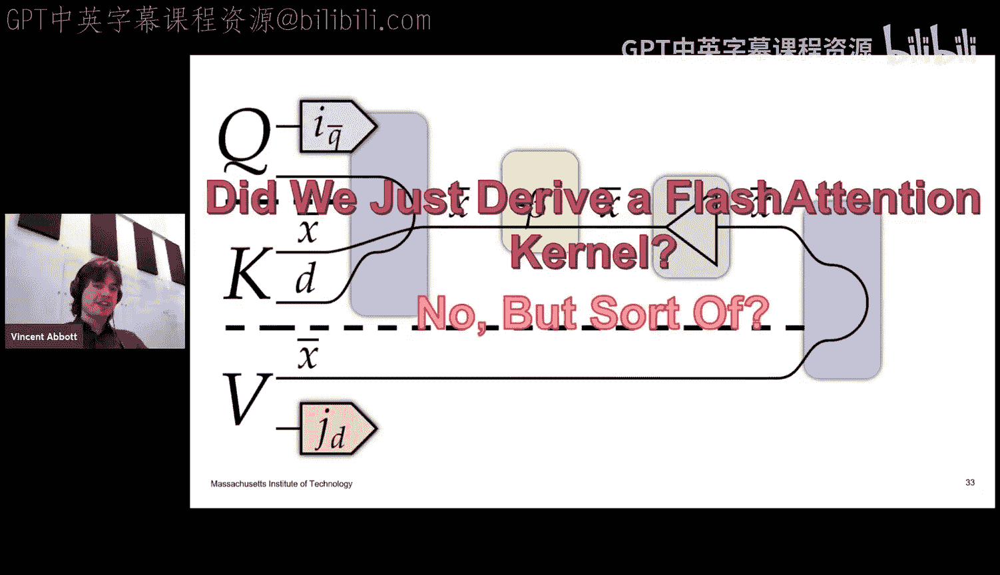

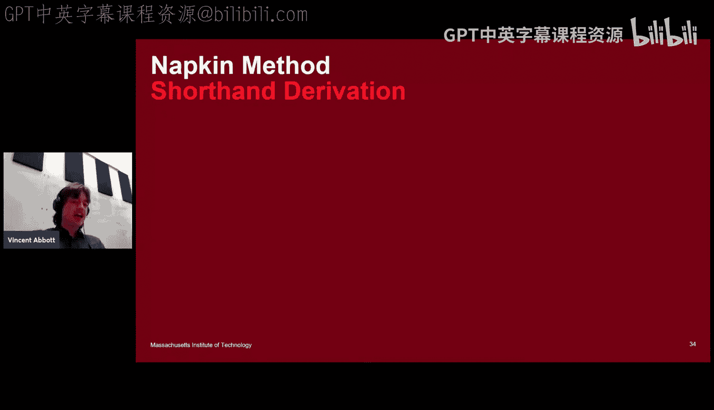

我们有一个从输出（可以认为是之后我们将拥有的变量名）到输入（之前我们拥有的变量名）的某种函数。然后，如果我们有一些变量，我们现在可以构建这个重排。你会注意到这个重排的顺序：输出的名称在前，输入的名称在后。而在另一种表示中，顺序是相反的。你会发现这是正确的做法，没有其他方式，这种模式将非常常见、非常重要且极其有用。

因此，我们有了对象、态射、组合，我们可以取积或进行重排。

---

## 应用：重新表达注意力机制

有了这个框架，我们可以开始重新表达像注意力机制这样的东西。

我们可以从这个临时性的图表走向更形式化的东西。我们有Q和K，我们标记对象（集合），标记态射（函数），然后逐步推导。你可能注意到这与我们直观上会做的非常接近，它匹配数据的流动。范畴论是一种形式化我们经常已经在观察的事物的方式。

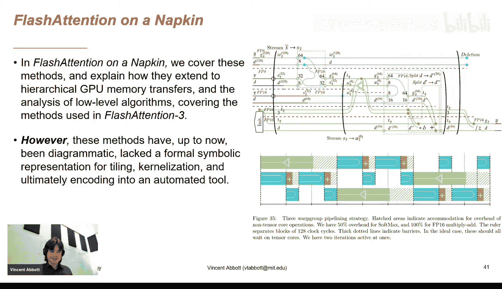

但由于其严谨的结构，它允许发展扩展。那么，对于这个类别，我们需要什么扩展呢？右边的图表帮助不大。我们已经讨论过为什么其中存在结构是这个图表没有显示的。

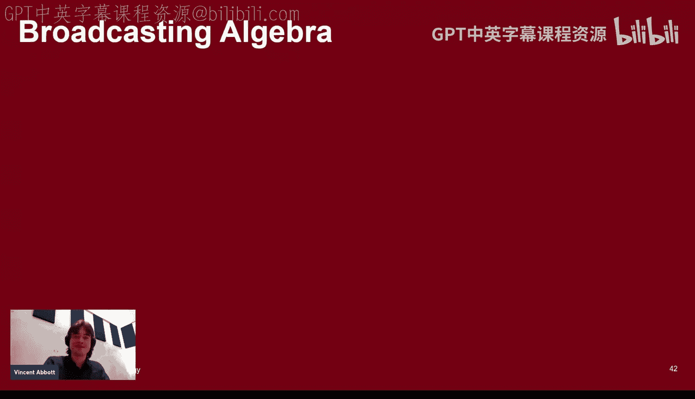

因此，我们希望开发一种显示该结构的方法。为此，我们将开发一个特定的范畴。

---

## 数组广播范畴

上一节我们展示了如何用范畴初步表示注意力，本节中我们构建一个更强大的工具：数组广播范畴。

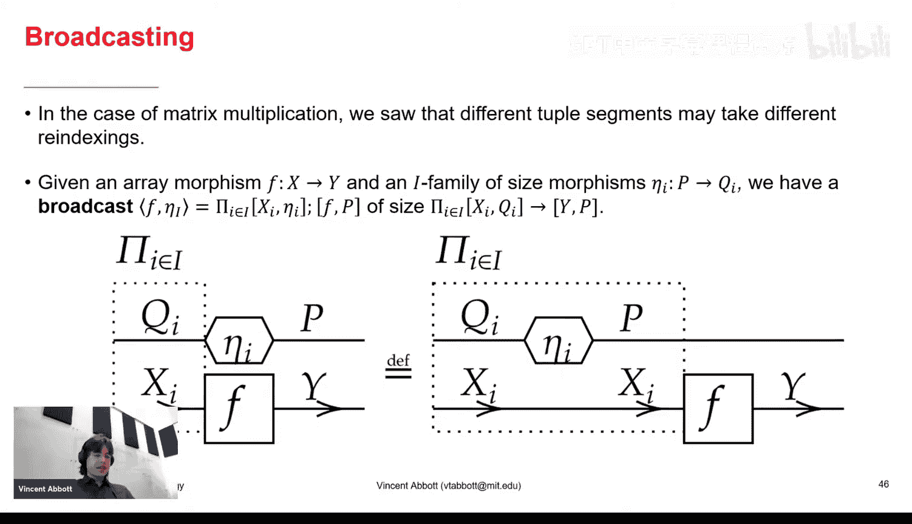

这个范畴的对象将是数组（或数组的数组）。其态射将是数组之间的函数。我们将开发特定的基础设施，以清晰地表达广播。

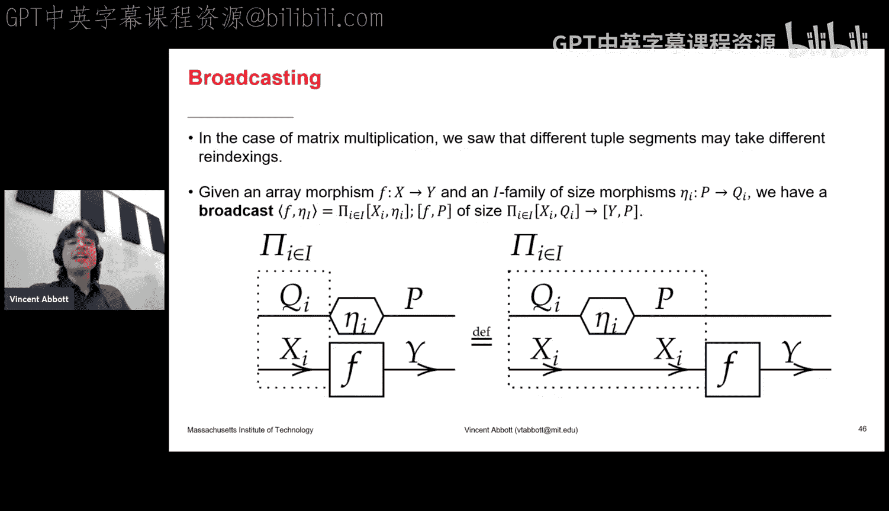

*   **尺寸范畴**：我们从尺寸范畴开始。尺寸范畴表示数组可能采用的坐标。它对应于数组的尺寸。因此，对象就是尺寸。那么积是什么？积是将单个尺寸组装成多维尺寸。因此，我们有了尺寸的基础设施。我们很快会展示这个范畴中的态射是什么。

那么，数组呢？我们可以使用这些尺寸来定义数组。一个数组是某个基础数据类型（如实数、浮点数等）和一个尺寸。因此，我们基本上是说，对于尺寸中存在的每个坐标，我都有基础数据类型的一个实例。在右边，我们有我们可以称之为标准表示的东西，其中有这些网格，它们代表数组中的值。但我们可以开发图表。

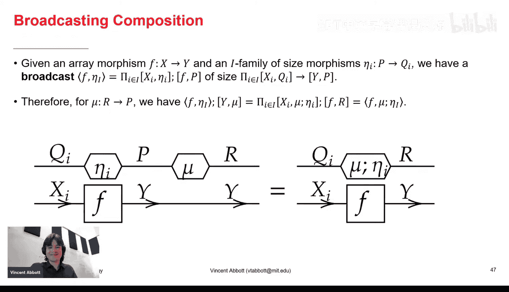

我们如何做到这一点？我们画一个带有基础数据类型的箭头（底层数据类型），然后在上面画出尺寸。这里，A是尺寸范畴中的一个对象，并且尺寸范畴的对象可以分解为其他对象的积。因此，我们可以通过这个表达式或那个表达式来表示这个数据类型，它们是相同的，因为这两个是相同的。注意，我们保留基础数据类型的箭头，但移除顶部的箭头，这样做的原因只是为了不将它们彼此混淆。

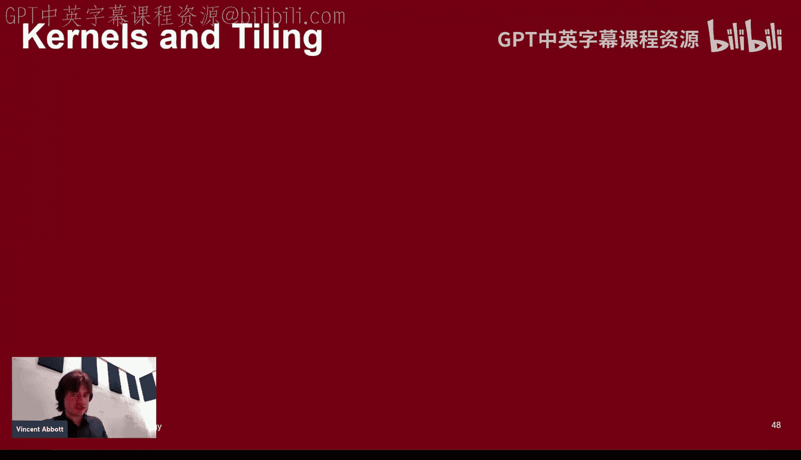

*   **态射**：对象到对象，很简单。任何在中间的东西构成一个态射。因此，这个x可能是那个，y可能是别的，或者我们可以使用系统来表达这个范畴。
*   **积**：积是笛卡尔积，事物并行进行。因为我们使用没有任何分隔的堆叠来表示一个事物，我们开发了这个虚线系统来区分不同的积。这可以描述数组的元组以及完全独立并行运行的函数。因此，如果我们有这个函数和那个函数堆叠在一起，它将是一个接受元组并产生元组的函数。

这就是数组广播范畴。这意味着我们可以将这个重新表达为那个。这更有用一些。我们看到这是流经系统的所有事物的尺寸，我们可以更好地跟踪事物，但这里仍然缺少很多结构。那个结构就是内核推导的黄金所在。

目前，我们可以做一个美学调整：使用象形图和名称来表示关键操作。我们使用杯状符号表示矩阵乘法（类似于物理学中的彭罗斯图）。Softmax将是一个三角形，它是一个非常重要的操作，所以象形图是有意义的。

现在，我们如何引入其余的结构？如何显示这个Q和那个Q之间的关系等等？

---

## 提升与重索引基础设施

上一节我们构建了数组广播范畴，本节中我们来看看其核心操作：提升与重索引。

左边图片的问题在于我们没有这个提升信息。这个提升信息对于像Flash Attention这样的东西至关重要，因为最终Flash Attention正是发生在这个Q轴上。

我们可以开发图表来清晰地显示它。例如这个图表，它显示了这个Q与那个Q之间的关系，等等，从操作结束一直到开始。

那么，我们做的这件事，这个“提升”，到底是什么？让我们从这里开始。

我们从一个从左边的数组到右边的数组的操作开始。使用我们的图表工具，你可以这样表示它：输入、输出用尺寸标记。

当我们提升某个东西时，我们让F在一个更大数组的行上作用。所以，我们有F作用在第一、第二、第三、第四行等。这会是什么样子？这将看起来像一个函数作用在P·A上并产生E。我们可以进行这个巧妙的转换：为了表示F在P上广播，我们只需将P轴画在F的顶部。这以正确的方式修改了输入输出形状，并清晰地显示了两者之间的关系。这就是提升。

我们如何提供一个更正式的定义？因为我们想要使用它，我们不希望提升只是一个存在的东西。我们想要展示提升如何与像Flash Attention或我们想要对深度学习系统采取的其他分析方法相关联。

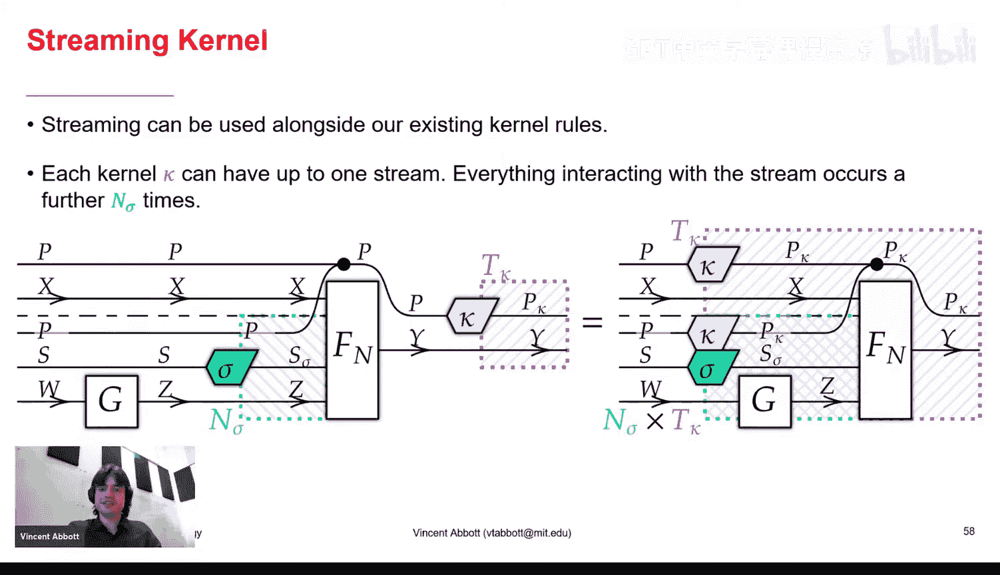

我们定义提升如下：我们使用索引，或者更准确地说，切片。切片就像在PyTorch中提取特定的列或行。在左边这种情况下，我们提取表达式的第四行。我们知道这第四行是由F作用在输入的第四行上生成的。类似地，我们可以这样绘制切片：在i轴上的切片（就像在PyTorch中一样）会减少那个轴，然后留下剩余的轴，所以这将是B。

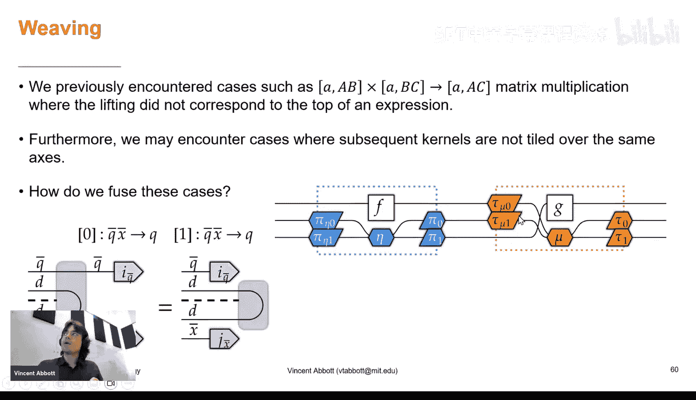

因此，左边可以这样表示：我们有F提升到P上，然后之后应用那个切片。这等于什么？它等于F作用在输入的第四切片上。类似地，我们可以用i这样表示它，这个切片移动到表达式的前面。毫无疑问，这个第四切片对应于那个。因此，这里的对应关系具有这个图表表示。

这开始显示图表具有一些力量：不仅这个P轴正确地指示了输入和输出类型，它还允许我们开始执行代数运算。这就是我们如何定义一个提升的表达式。

这里，我们有F^P，假设我们不知道它是什么，但我们可以说，给定一个在i上的切片，F^P将等于该切片应用到输入上，然后函数F作用在其后。因此，我们可以使用F和切片的知识来定义F^P做什么。

我们有了这个切片自然性属性：表达式后的切片可以移动到表达式前，两者在数学上是等价的。

在我们的注意力模型中，我们有Softmax在Q上广播，这意味着什么？意味着表达式后的切片变成表达式前的切片。对于逐元素表达式，我们有轴从两边穿过。这意味着，如果我询问输出的第i,j坐标是什么，它等于函数应用到输入的第i,j坐标上。

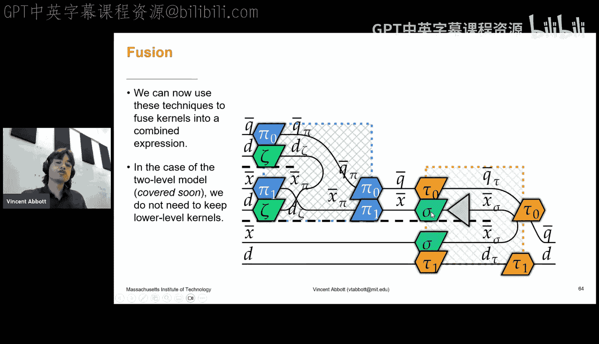

注意：这是尺寸0的积。当我们将基础数据类型提升到尺寸0的积上时，我们得到一个项，它是一个单独的值。另外，你可能注意到我们在这里没有太多地写出基础数据类型。我们可以保持它隐含，对于本次分析的大部分内容，它不直接相关。

现在我们有了切片自然性。让我们回到尺寸范畴：态射是什么？我们可能想应用到轴尺寸上的可能态射是什么？仿射变换。这个定义相当多。我们真正需要知道的是，我们将自己限制在坐标的仿射变换上。这将变得非常重要，因为它允许推导出一些非常好的启发式方法。

---

## 重索引

在提升之后，我们有重索引。重索引是指我们进行了提升，但输出切片并不对应于完全相同的输入切片。例如，第i个输出切片可能对应于第a(i)个输入切片。我们有这种模式。

那么，这看起来像什么？这一行产生这一行，这一行产生那一行。我们如何清晰地定义这个？我们说，第i个输出对应于第a(i)个输入。例如，a将0映射到0，将1映射到2。这可能是卷积网络中的膨胀操作。

我们如何用图表表示？我们这样绘制它。我们知道这里的输入是Q·I，所以我们可以把Q·I画下来。输出是P·V，所以我们可以把P·V画在下面。然后我们有一个作用在其上的切片，所以这个切片是i。然后我们知道这应该等于那个。所以这里我们有第a(i)个切片，然后它产生A，F可以作用其上。那么，我们在这里放什么？我们可以放η。所以，如果我们有一个表达式上面有A，它从P映射到Q。这里我们有P到Q。我们在这里放η，所以顺序是向上的。这意味着i有效地向左，然后与a(i)交互以创建这个切片，该切片可以移动到表达式后面。所以我们有了这个，我们知道F是什么，我们知道这个是什么，它只是一个切片。我们说这等于那个。这就定义了一个重索引。

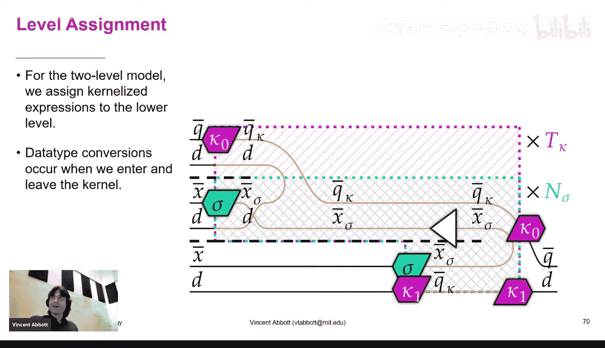

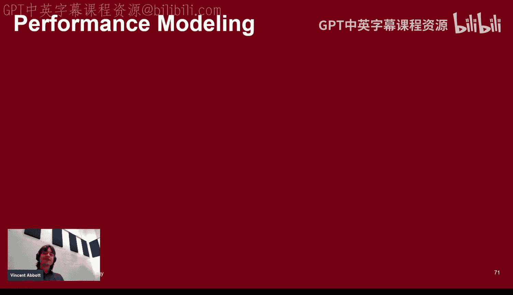

那么，我们能对重索引做什么？为什么我们要费这么大劲来定义它们？

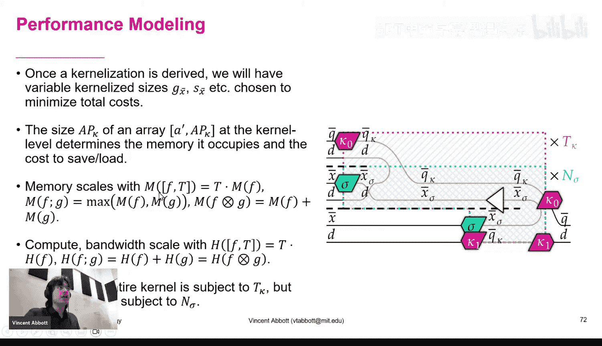

---

## 应用重索引：转置与矩阵乘法

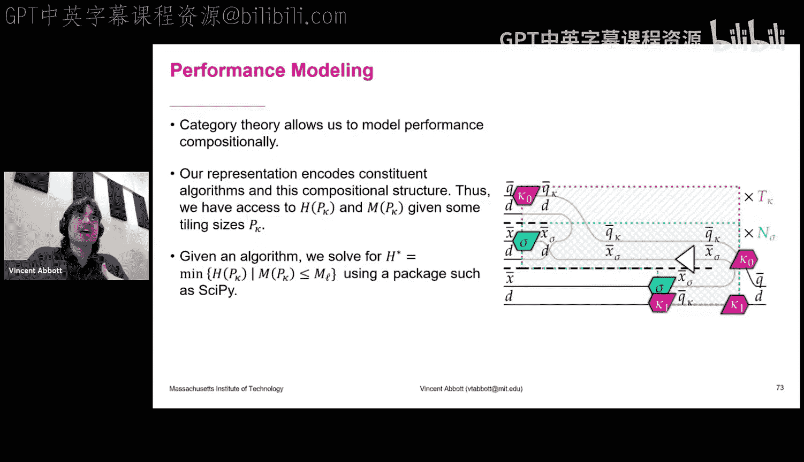

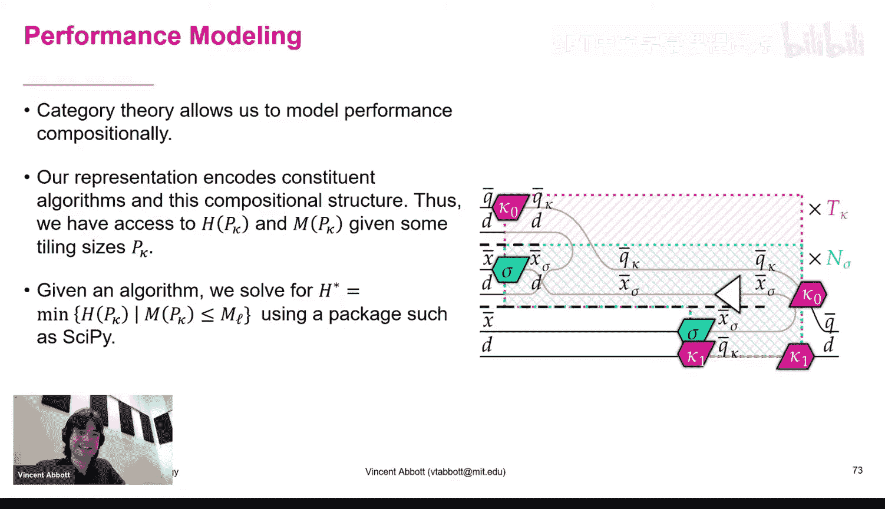

上一节我们定义了重索引，本节中我们来看看它的具体应用。

以转置为例。转置是什么？转置意味着输出的第i,j坐标等于输入的第j,i坐标。这两个交换了位置。之前，我们将重排定义为这些积范畴的基本组成部分，这里我们使用它们。我们重新排列索引以进行交换。然后我们将其与重索引提升一起使用来定义转置是什么。这是一个例子，我们可以使用这个重索引术语和这个重排术语一起来表示转置，以表明转置只是这个东西的一个特定实例。

此外，像矩阵乘法这样的东西更复杂，但根本上，输出的第i,j坐标等于第一个输入段的第i切片和第二个输入段的第j切片。这个从i,j到i的操作是什么？是删除？投影到第一维。因此，这也可以表示为重排，第二个也是如此。所以我们可以使用重排和重索引一起来定义这些操作。

但我们也可以以稍微不同的方式来做。对于矩阵乘法，我们可以说输出的第i,j坐标等于这个切片重排。用图表，这可以清晰地显示：我们展示j如何关联到X，i如何关联到Q。这里，投影到这些段中的每一个的重排是隐含的，我们基本上可以信任图表来向我们展示事物是如何流动的。

---

## 重新表达注意力机制

现在我们已经构建了这个基础设施，我们能用它做什么？我们可以将注意力机制重新表达为一系列提升和重索引，得到这个表达式。

在这里，我们可以看到我们有Q和D，这个轴一直穿过。这意味着什么？让我们看看。我们从表达式开始，展示广播，然后取一些索引看看它们做什么。穿过，穿过，再穿过。

我们刚刚做了什么？我们展示了这个表达式。我们的某个输出如何关联到特定的输入。此外，这些输出彼此独立。这意味着什么？这意味着表达式的输出等于一系列独立计算的结果。

这是否意味着我们就这样推导出了Flash Attention，作为一种将注意力分解为一系列独立操作的方式？不完全是，但有点接近。我们首先需要更多的基础设施。

---

## 推导内核：便签纸方法

上一节我们接近了目标，本节中我们通过一种更直观的方法来推导内核：便签纸方法。

便签纸方法是一种简写推导，没有太多形式化。首先介绍它，是开始使用图表作为一个有用工具的好方法，并能理解推导这些数学为何如此重要。

便签纸方法是指，给定这个图表，我们可以在高层推导出Flash Attention，因为我们可以看到正在发生的独立操作。

我们如何做到？我们从一个高层图表开始，比如你看到的这个。首先，我们知道某些操作具有可流式处理的属性。当一个操作在一个轴上可流式处理时，意味着该轴的输入可以分块送入，并在较低层次累积。Softmax后接矩阵乘法就是这样一个实例。因此，我们可以让X轴被流式处理，分块发送下去。然后，因为这个轴一直穿过整个表达式，我们将进行流式处理。

现在，这个S_x数字代表较低层次的尺寸，它代表块大小。接下来我们做什么？之前我们展示了索引如何从这里一直流到开头。因此，我们可以分块执行键值，而不是一次性执行所有。我们将其标记为G_Q。

现在，我们在右边有什么？我们有一个子算法。这个子算法的图表说明了一些东西：它说明我们正在将Q分布到块中，每个块大小为G_Q，进行独立操作。对于每个块，我们以大小为S的块流式处理X轴。

然后，我们可以用这个来显示芯片上的内存量、每个子算法发生的传输次数，以及我们拥有的子算法数量。子算法的数量就是Q的总尺寸除以单个块大小。但有一个限制：G_Q必须低于某个水平，以免违反较低层次的内存限制。考虑到我们的流大小可以很小，小到可以忽略，我们可以得到这个表达式。这给出了P尺寸的上限。

很好，所以我们有了这个图表，它代表一个底层算法，并且它允许我们得到芯片上的最大内存。但对于Flash Attention，重要的洞见是能够减少发生的总传输次数。为了计算这个，我们将查看每个瓦片的传输次数，通过查看表达式输入和输出的尺寸来得到。所以我们有加载次数和保存次数。由此，我们可以计算总传输次数。我们将子算法数量乘以