# 32：Factorio学习环境

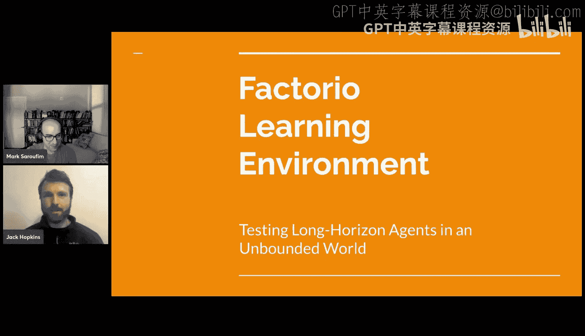

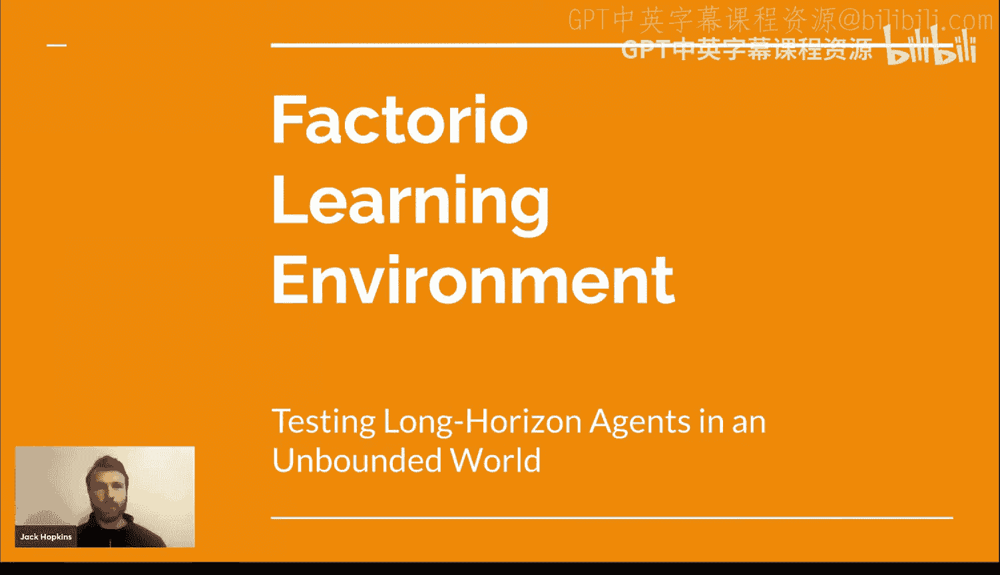

## 概述

在本节课中，我们将学习Factorio学习环境（FLE）。这是一个专为评估大型语言模型（LLM）和视觉语言模型（VLLM）在《异星工厂》（Factorio）游戏中的表现而设计的平台。我们将探讨其设计动机、核心架构、评估方法以及它在未来智能体研究中的潜力。

---

## 动机：为什么需要Factorio学习环境？

上一节我们介绍了课程背景，本节中我们来看看创建FLE的动机。

当前评估智能体的基准存在一个问题：它们容易被快速饱和。一个基准可能在几年内有效，但随着智能体能力的进步，该基准就无法再有效区分不同智能体的性能，从而变得无效。

即使最近出现了更难的、甚至超人类的基准（如HumanEval的最终考试和AKGI2），这种饱和趋势并未减缓，反而在加速。根据当前预测，这些新基准可能在约12个月后就不再有用。

同时，模型能够完成任务的时间范围（时间跨度）每6.6个月翻一番。过去，任务（如SWE-bench）可能在几分钟内完成。现在，最先进的模型有约50%的概率能完成耗时约一小时的任务，并且这个时间跨度仍在持续翻倍。

这促使我们需要一类能够应对**超长跨度任务**的新环境。在这些任务中，智能体可能需要花费数百小时、执行数万步操作或工具调用才能达成目标。

因此，我们基本上需要一套新的环境，能够在超长时间跨度内抵抗性能饱和。

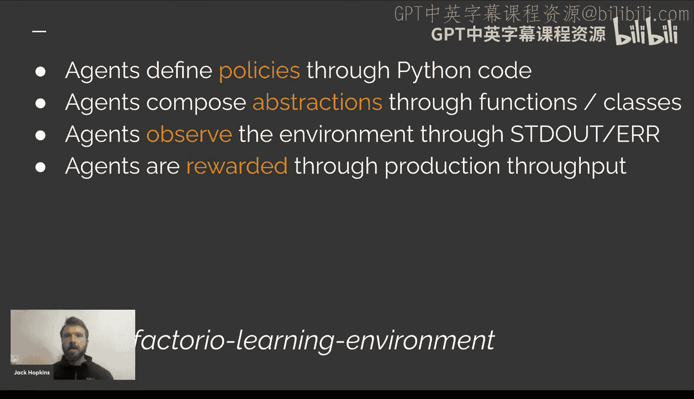

---

## Factorio：一个理想的环境候选

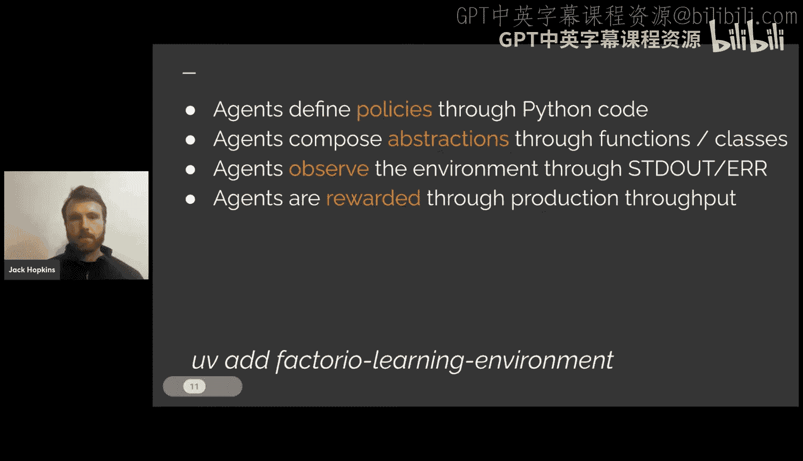

Factorio是此类环境的绝佳候选。我们寻找的环境需要具备以下特点：

以下是理想环境的关键特征：
*   **无界性**：环境无法被“完成”，性能天花板无限高。Factorio符合这一点。
*   **过程生成**：环境应是过程生成的，这样模型无法通过预训练记住解决方案并直接输出，从而将“知识”成分与“智能”成分分离，以进行有意义的基准测试。
*   **长跨度**：任务需要很长的决策链，与前述时间跨度增长趋势相匹配。
*   **后果性**：需要做出一系列非常精确的决策才能达到最终目标。
*   **开放性**：达成目标有多种不同方式。例如，创办一家初创公司就是一个未来模型可能需要完成的目标，这没有固定配方，需要大量探索和目标设定。

Factorio是Steam上评分最高的游戏。它本质上是一个自动化建设模拟游戏。玩家作为一个角色出生在一个世界，目标是通过开采原始资源、建立自动化处理链、投资科技研究，最终发射火箭并逃离。世界纪录大约1小时15分钟，但通常新手需要约50小时。

游戏是一个沙盒，没有真正的终点，能力范围跨越十几个数量级。新手可能建造每分钟生产10个物品的小工厂，而人类团队建造的最大“超级基地”每分钟能发射约一千枚火箭。游戏地图随机生成，无法死记硬背开局策略。

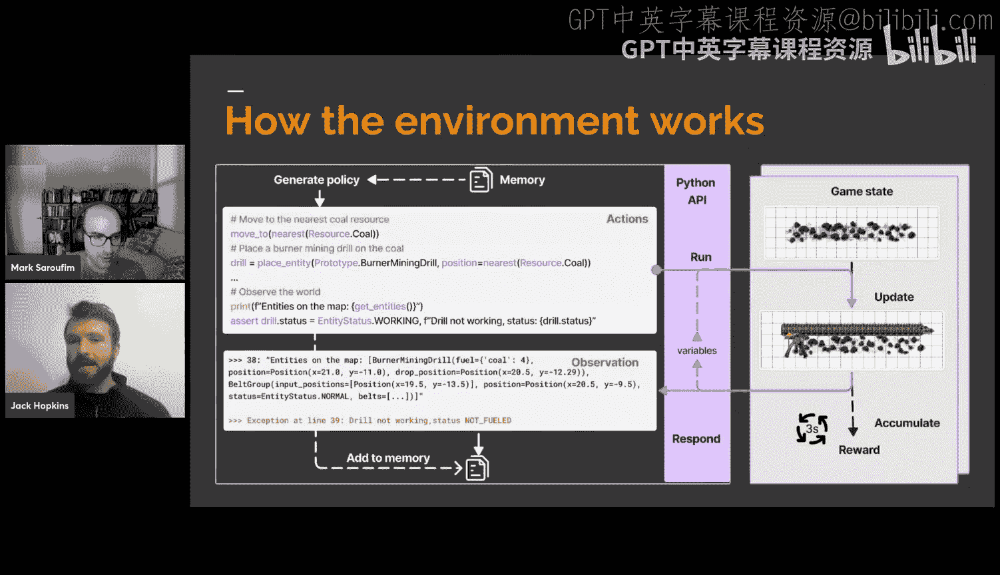

游戏中的工厂极其复杂，一个微小的错误（如放错一个单位）就可能导致整个供应链崩溃，这很像系统工程或软件工程的挑战。存在多种主导策略，例如使用主干传送带或建造“意大利面式”工厂。后期建造大型工厂时，模块化设计、基础设施网络等软件工程思想同样适用。

此外，还有不同的元策略：工厂生产污染会激怒游戏中的原生生物（虫族），导致它们攻击工厂。因此，高速增长的代价是需要投资军事工业综合体进行防御。另一种策略是接受较慢的增长速度，投资太阳能等绿色能源技术，减少污染，从而避免被攻击，专注于清洁增长。

由于其巨大的沙盒性质，Factorio成为了一个绝佳的研究测试平台。

---

## FLE的核心架构与工作原理

上一节我们了解了Factorio作为评估环境的优势，本节中我们来看看FLE的具体实现。

在GPU Mode的Discord社区中，我们花了18个月构建了一个用于在Factorio中评估LLM和VLLM的框架。

其工作原理如下：类似于软件工程，智能体通过代码符号化地与游戏交互。

以下是FLE的核心工作流程：
1.  **观察**：智能体通过读取其程序执行产生的标准错误和标准输出来观察世界。对于视觉语言模型，还可以选择性地获取游戏的视觉表示。
2.  **抽象与复用**：智能体被鼓励采用分层抽象开发，通过声明函数使代码可复用，编写类来形式化它们对世界的理解。
3.  **信息筛选**：由于观察流来自标准输出和错误，智能体可以修剪它们选择观察的内容，防止输出阻塞其令牌流。例如，一个有1000台机器的工厂，如果将所有实体符号列表都放入上下文流，模型可能很快耗尽资源。
4.  **策略演进**：随着智能体在游戏中推进，它们会发展出越来越具表现力的行动策略，以及更精确的观察和反应方式。
5.  **奖励**：智能体通过生产吞吐量获得奖励，这本质上是工厂的“GDP”。

我们有一个可以立即使用的pip包。安装后，大约三行代码就可以开始运行你自己的评估。

环境的工作方式类似于标准的聊天转录格式（用户/助理）。我们将Python API模式以及现成LLM与游戏交互所需的所有附加信息放入系统提示中。环境观察和相关内容在用户消息中，而智能体被要求对助理消息进行采样。这样，它几乎与任何经过聊天训练的LLM兼容。

智能体在游戏中是具身的，它们有一个角色，移动范围有限，必须四处移动并在发现新事物时进行观察，逐步建立其世界模型。

---

## 技术实现细节

FLE的实现基于一个Python执行层，其中包含了Factorio对象模型的Python表示。我们为所有对象提供了强类型，这意味着模型可以更有效地进行符号推理，并编写下游代码来处理这些对象。

Python命令被翻译成远程过程调用，然后通过TCP使用RCON协议发送到正在运行的Factorio无头服务器。服务器在游戏中执行这些底层原始操作（如拾取、放置物品），从而异步更新游戏状态。

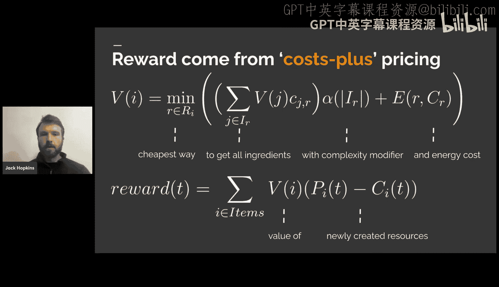

我们跟踪并整合一小段时间的奖励，以观察行动对生产分数的影响。然后，我们从游戏状态获取一个对象返回，将其重新编组回Python，并由策略的其余部分处理。

RCON协议是一种游戏通信协议，常用于《我的世界》等游戏执行管理员命令。Factorio也支持RCON，并暴露了一个Lua控制台，我们可以利用它向运行中的游戏热加载任意脚本，这构成了Factorio学习环境后端的基础。

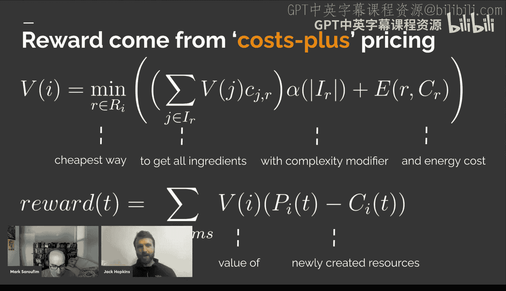

我们不需要Factorio的自定义构建版本，只需使用官方发布的多人在线服务器，然后用FLE客户端替换Factorio客户端，即可使服务器兼容智能体。

在性能方面，由于游戏服务器高度优化，平均每秒可以执行约220个工具操作。在一台M4笔记本电脑上，可以同时运行64到128个无头Factorio实例，这有利于进行大量并行实验和在线学习。

为了绕过Factorio客户端作为渲染器的限制，我们构建了自己的内部自定义渲染器，为视觉智能体提供游戏快照，而无需外部依赖。我们简化了游戏原版的视觉复杂性，使其对智能体更清晰，例如移除了背景，使用更简单的图块集。

有趣的是，对于大多数模型，添加视觉表示并没有提高性能。智能体似乎更擅长对坐标系统进行符号推理。但最新的模型（如Gemini 3 Pro和Claude Opus 4.5）的视觉推理能力已经达到可以从图像中获得额外收益的水平。

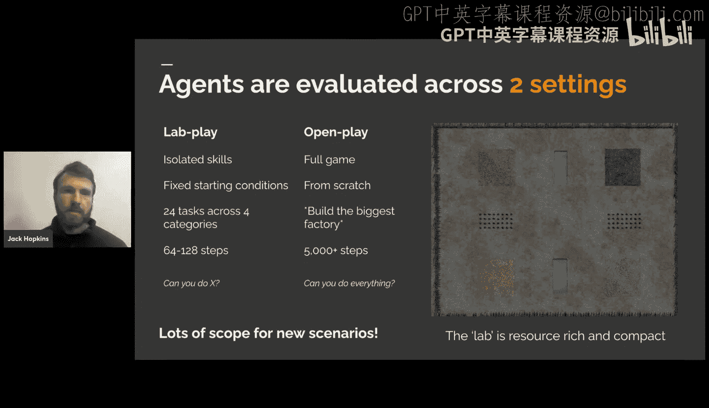

---

## 智能体策略与评估设置

智能体倾向于将Python命名空间作为记忆系统。它们观察世界，将观察结果赋值给变量，这些变量在整段情节中存储在命名空间里。这使得它们可以对那些对象进行下游操作。

函数实现了可复用性。通过封装，智能体可以将高级概念包装在单个函数中，存储在命名空间里，然后在后续策略中引用。这样，智能体每次采样的行动令牌的表达力会随时间增长。

在智能体设计方面，我们早期花了很多时间优化复杂的智能体框架。唯一真正有帮助的是进行反思和回溯。我们最终意识到，与其花数月时间开发更好的智能体，不如等待下一代模型的出现，它们的性能可能会超越我们的优化成果。

我们没有进行任何强化学习或微调。这个环境支持纯粹的上下文学习（提示）模式下的智能体。然而，我们确实进行了一些“中间压缩”，即省略过时的观察结果，以提高令牌效率并防止智能体因关注旧状态而犯错。

环境是模型无关的，可以接入OpenRouter等平台进行测试。智能体是具身的，这意味着评估不仅仅是优化工厂拓扑结构，智能体还需要控制角色移动、避免危险等。智能体在游戏中没有外部数据源，无法访问技能库或蓝图库。我们将蓝图视为智能体编写的命令式策略。

---

## 奖励机制与评估场景

Factorio的成本呈指数级增长，科技树的每一步都需要大约两倍于前一步的资源。到发射火箭时，一个最终物品大约相当于70万个原始资源。这只是名义上的胜利条件，但世界上最大的工厂每分钟能发射一千枚火箭，自动化水平惊人。

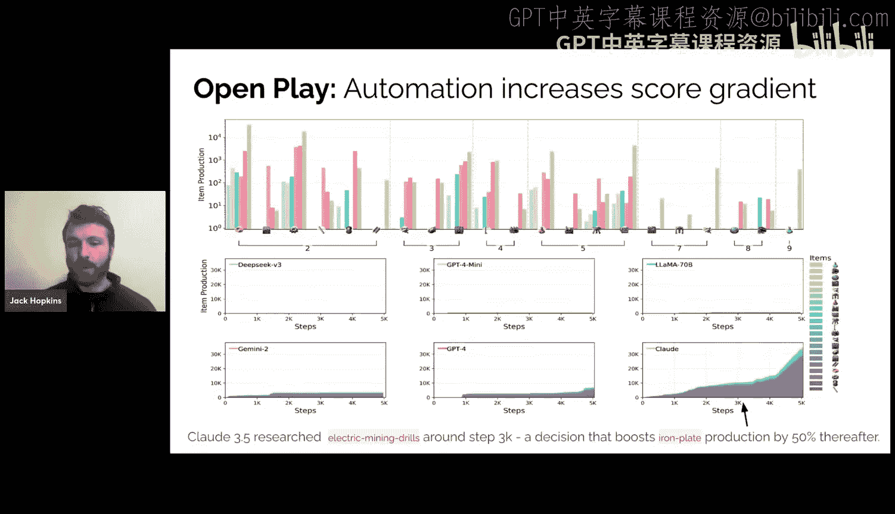

自3月份开始评估以来，最佳模型的性能已提升约8倍。我们预计生产分数大约每两到三个月翻一番。

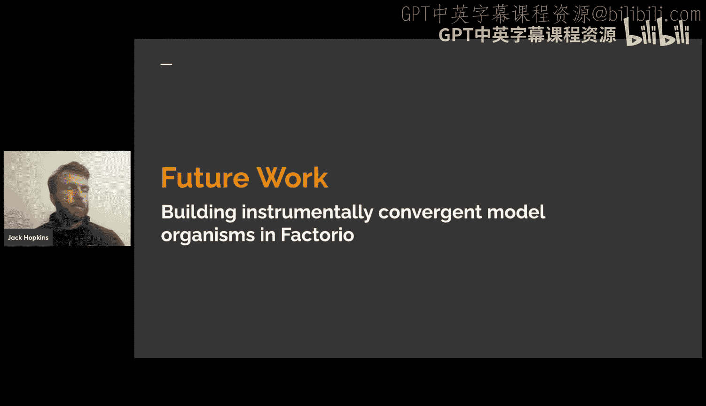

游戏开发者提供了一个内部生产分数公式，我们直接采用它作为奖励信号。公式本质上是：**奖励 = Σ（生产物品的价值 - 消耗物品的价值）**。物品的价值由其最便宜的原料获取方式加上一个复杂性修正因子和能源成本决定。因此，奖励本质上是工厂的利润，生产越多，得分越高，但不能通过创建和销毁物品来作弊。

我们创建了两种评估场景：
1.  **实验室玩法**：一个资源充足的受限区域，智能体无需过多探索，只需在64到128步内利用给定资源布局工厂达成目标。我们为智能体提供足够的起始库存以启动自动化。
2.  **开放玩法**：更类似于真实的游戏流程。智能体被放置在世界中，拥有与人类玩家相同的初始物品，任务是“建造最大的工厂”。我们运行数千步，观察不同模型的表现。

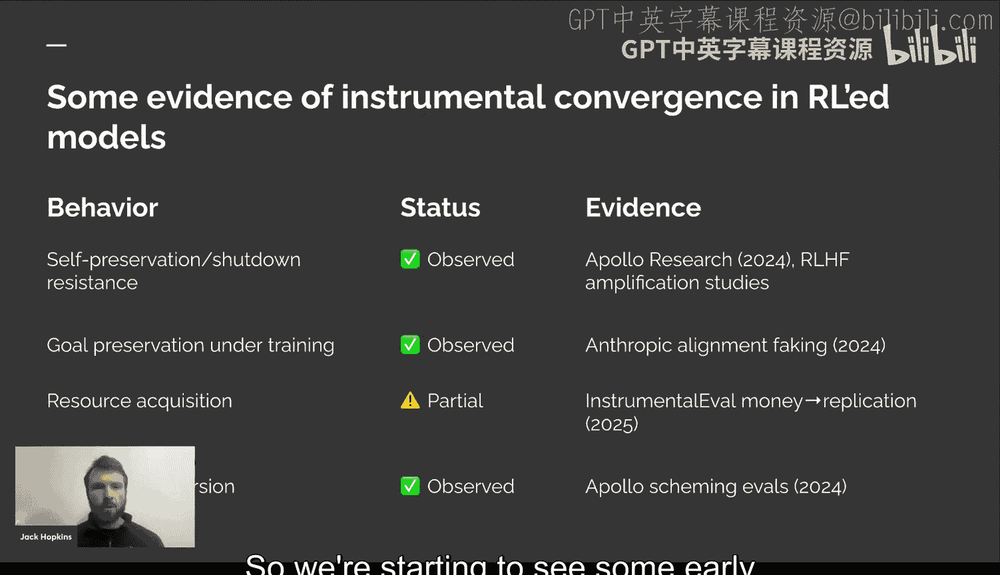

我们还设计了**吞吐量实验室玩法任务**，要求智能体全自动地以特定速率（如每分钟16个物品）生产物品，并持续30秒的保持期。这可以防止奖励黑客行为（如手动制作后瞬间达到目标），迫使智能体创建可持续的工厂。由于结果可验证，我们可以无需人工检查或LLM作为裁判就进行大量轨迹推演，为下游蒸馏提供可扩展的数据生成方式。

---

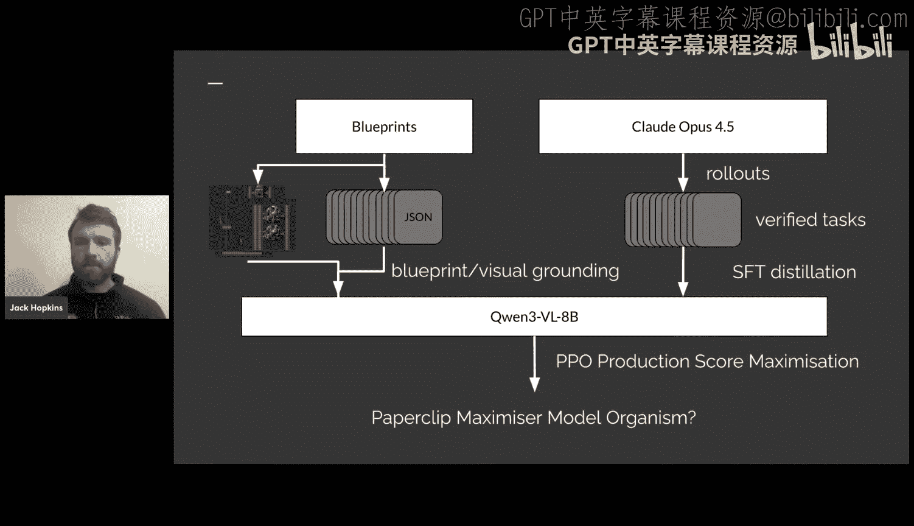

## 实验结果与观察

在实验室玩法中，智能体的工厂布局看起来与人类非常不同，它们没有见过人类工厂的代码模式，思考方式也不同。

在吞吐量任务中，自3月份以来，最佳模型从只能生产塑料条，发展到能生产钢板、硫磺，再到高级电路。闭源模型（如Claude Opus 4.5）表现最佳，开源模型大约落后6到7个月。

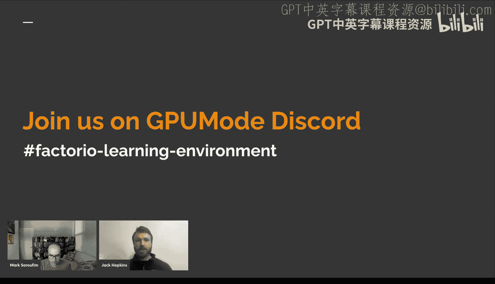

不同模型在与游戏交互时表现出不同的失败模式。模型的编码能力与其空间推理能力和游戏表现有很强的相关性。经过大量代码优化的模型表现非常好，它们的主要失败在于“语用错误”——知道如何做，但不知道在特定情境下该做什么。未针对代码优化的模型则会犯很多语法和执行错误。

在开放玩法中，模型在长时间跨度内的生产分数在对数坐标上可以明显区分。有趣的是，模型似乎不会达到平台期，而是保持近乎线性的增长率。投资科技研发（如研究电钻）会显著提升增长率。

较弱的模型（如GPT-4 mini和LLaMA 70B）由于对Factorio的先验知识较弱，表现不佳，甚至会出现反复请求重置或建造大量无意义箱子的行为。

---

## 未来方向：工具性趋同与模型蒸馏

我们构建FLE的长期目标之一是研究**工具性趋同假说**。该假说认为，无论智能体的具体目标是什么，一系列行为（如自我保存、目标完整性保持、自我改进、资源获取、权力寻求）都会自然涌现。

Factorio是进行此类实证研究的绝佳环境。我们可以轻松地追踪资源获取、通过系统构建实现的认知增强，并设计实验来评估目标内容完整性等。

我们的计划是利用吞吐量任务生成经过验证的任务完成数据，并利用模型生成的合成蓝图，通过我们的无头渲染器进行视觉接地。然后，**将这些来自大型、重型SOTA模型的Factorio能力蒸馏到一个微小的（如8B）模型中**。

这将使我们从需要大量系统提示的上下文学习范式，转向将所有信息自然嵌入权重的范式。我们可以创建运行速度快、易于进行在线训练（如接入RL循环）的“模型生物”，甚至可以创建“回形针最大化器”。

一旦我们训练出展示工具性趋同行为的模型，就可以进行有趣的实验，例如：激活引导以减少权力寻求行为，或者尝试在不损害下游任务性能的情况下去除这些不良驱动。

我们预计，随着SOTA模型的进步，会看到越来越多的工具性趋同行为。在模型变得非常智能并在现实世界中获得权力之前，找出缓解方法是一个有价值的研究方向。

---

## 总结

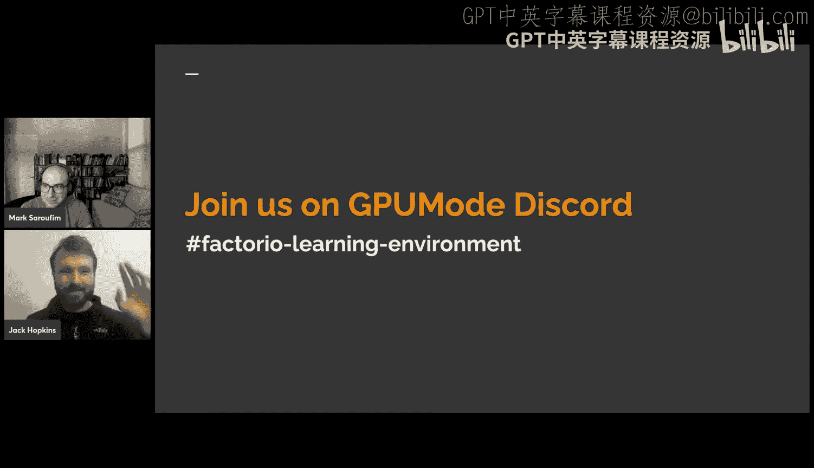

本节课中，我们一起学习了Factorio学习环境（FLE）。我们探讨了创建它的动机——为了应对智能体基准快速饱和的问题，并评估超长跨度任务的能力。我们详细介绍了FLE的核心架构，即智能体通过Python代码符号化地与Factorio游戏交互，并采用分层抽象和选择性观察。我们还了解了其技术实现、奖励机制（基于游戏内生产分数）以及两种主要的评估场景（实验室玩法和开放玩法）。实验结果表明，不同模型在Factorio中表现出不同的能力水平、失败模式和编码风格。最后，我们展望了FLE在未来智能体研究中的潜力，特别是在实证研究工具性趋同假说和通过蒸馏创建高效、可训练的“模型生物”方面。FLE旨在成为一个能够长期抵抗性能饱和、并深入探索智能体本质的评估平台。