# 33：第 86 讲：CuTe DSL 入门指南 🚀

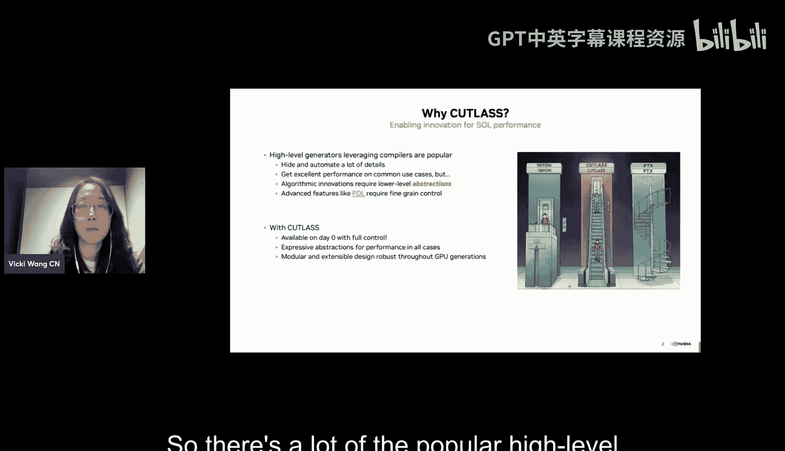

## 概述
在本节课中，我们将学习 NVIDIA 的 CuTe DSL（领域特定语言）。CuTe DSL 旨在为开发者提供一种在保持对硬件完全控制的同时，比 PTX 更简单的抽象层来编写 GPU 内核代码的方法。我们将通过一系列示例，了解其核心概念、编程模型和实用功能。

---

## 背景与设计理念
上一节我们介绍了课程主题，本节中我们来看看 CuTe DSL 的设计背景。

当前，高级代码生成器和编译器允许用户在无需了解过多硬件细节的情况下编写内核。这使得快速迭代新算法变得容易。然而，它们也隐藏了许多细节，使得用户难以完全控制硬件特性，从而在追求极致性能时遇到困难。

另一方面，PTX 提供了对硬件特性的完全控制，但其抽象层次过低，包含过多细节，编程效率不高。

CuTe DSL 的设计目标是在这两者之间取得平衡。它为开发者提供了在 NVIDIA GPU 上编程的表达性抽象，试图提供比 PTX 更简单、同时又能给予用户完全控制的编程体验。

CuTe 的设计架构包含多个抽象层：
*   **顶层**：高级接口，允许用户基于调优配置选择优化内核。
*   **底层**：包含 CuTe 抽象（黄色框）和原子操作抽象（灰色框）。CuTe 抽象提供一致的编程模型，原子操作抽象允许用户针对不同架构编程。
*   **CuTe DSL** 正是基于这两层构建的解决方案，旨在赋能 AI 研究人员和工程师进行快速开发和原型设计。

---

## 开始使用 CuTe DSL
了解了设计理念后，本节我们来看看如何开始使用 CuTe DSL。

开始使用 CuTe DSL 非常简单。以下是快速入门步骤：
1.  通过 pip 安装：`pip install nvidia-cute`
2.  编写 Python 代码。
3.  直接运行程序，代码将在 NVIDIA GPU 上执行。

在接下来的内容中，我们将聚焦于为 GPU MODE 竞赛提供的模板程序，并以这些程序为例，帮助大家理解如何使用 CuTe DSL 的功能来编写代码。

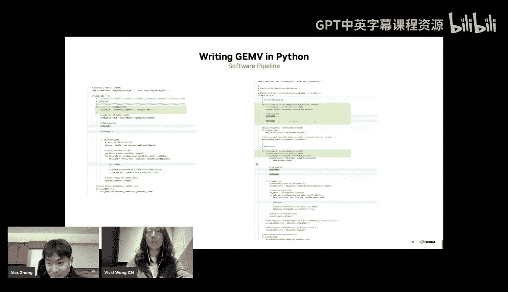

---

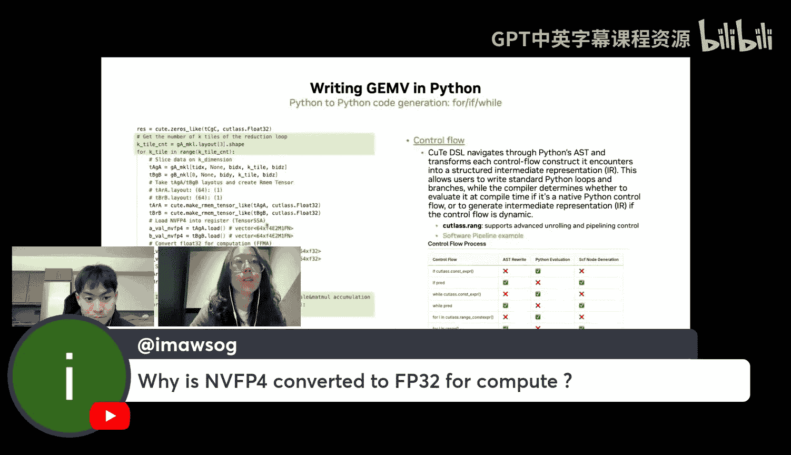

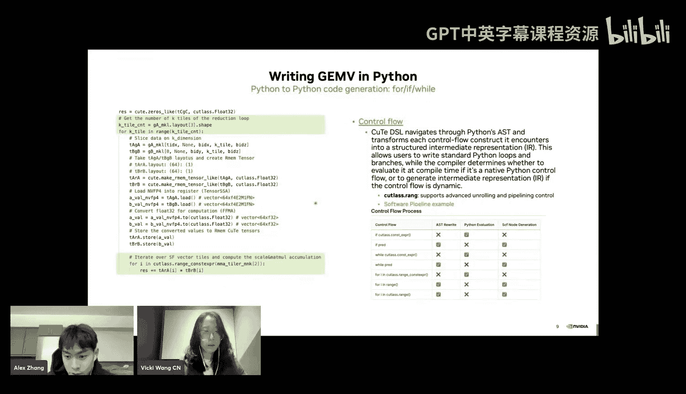

## 示例一：简单矩阵乘法（GEMM）
我们将从第一个示例开始，这是一个简单的矩阵乘法（GEMM）计算。

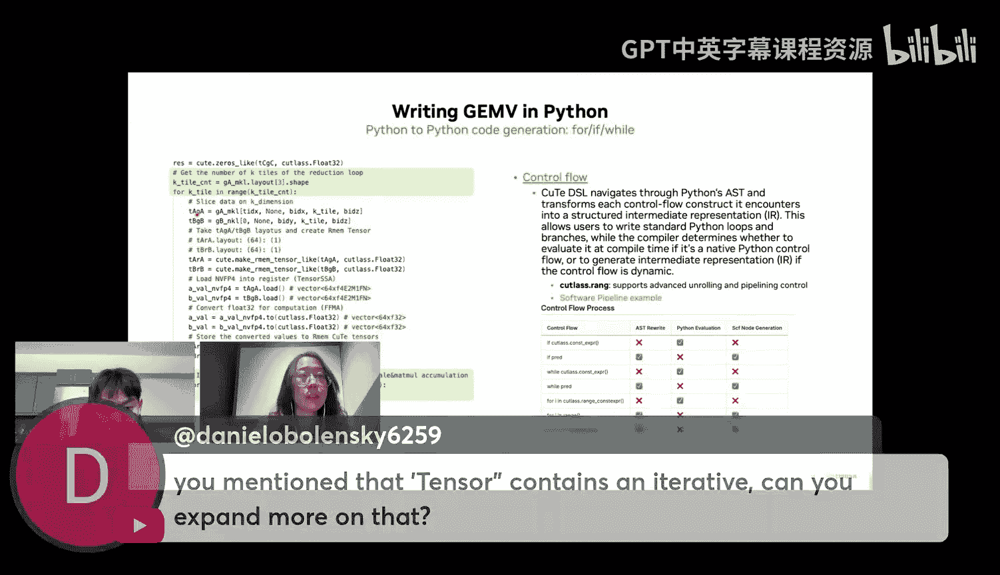

### 核心装饰器：`@cute.jit` 与 `@cute.kernel`
在 CuTe DSL 中，有两个关键的装饰器。

以下是 CuTe 装饰器的组合与要求：

| 装饰器 | 作用 | 调用限制 |
| :--- | :--- | :--- |
| `@cute.jit` | 主机端入口点，用于为内核准备参数（如网格大小、块大小、簇配置）。它也可以作为内联函数被 `@cute.kernel` 调用。 | 可被 `@cute.jit` 或 `@cute.kernel` 调用。 |
| `@cute.kernel` | GPU 内核的全局入口点。 | 只能被另一个 `@cute.kernel` 装饰器调用。 |

### CuTe 布局代数
第二个需要熟悉的概念是 CuTe 布局代数。

CuTe 布局主要包含一系列**划分**（`partition`）和**切片**（`slice`）操作。例如，在 GEMM 中，我们使用 `tile` 操作根据给定的 `BLOCK_M` 和 `BLOCK_K` 配置来划分全局输入矩阵 A。

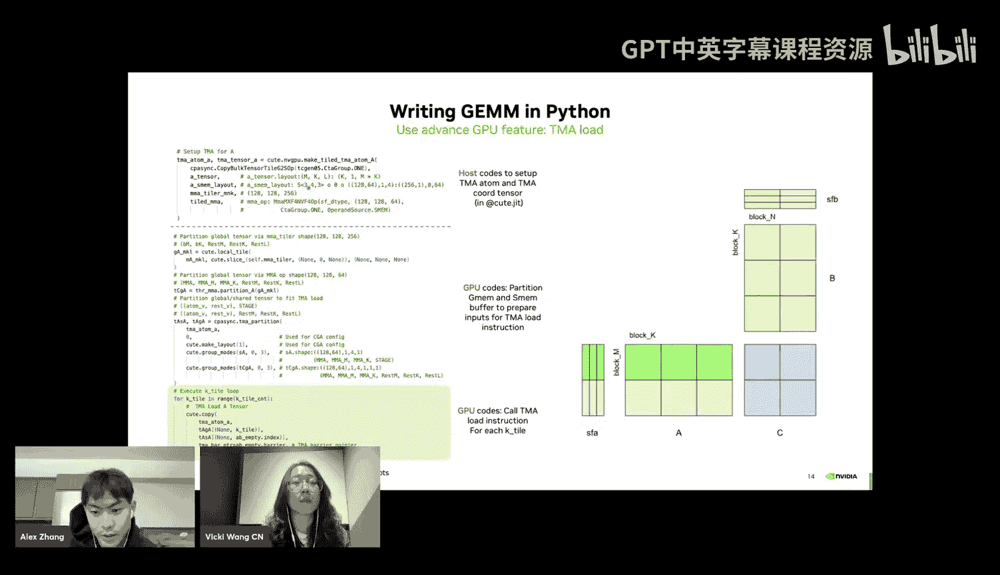

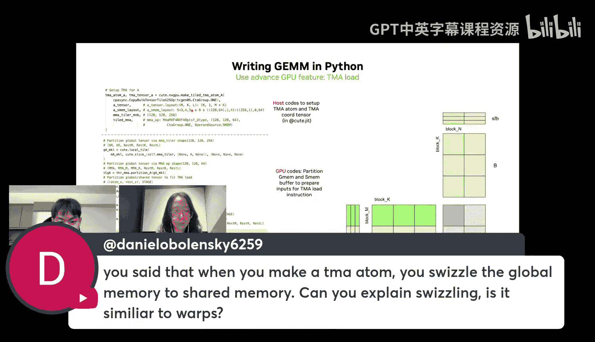

```python
# 示例：使用 tile 操作划分全局张量
gA = cute.global_tensor(A, (M, K))
tiled_gA = cute.tile(gA, (BLOCK_M, BLOCK_K))
```

划分后，我们得到了一个具有层次化坐标信息的矩阵。然后，我们可以使用 `slice` 操作，根据线程索引，从划分后的张量中获取每个线程需要处理的数据块。

### 张量与张量 SSA
第三个有用的概念是 CuTe DSL 中的**张量**（`Tensor`）和**张量 SSA**（`Tensor SSA`）。

*   **张量**：是内存的迭代器和布局的组合。它支持全局内存、共享内存和寄存器内存。
*   **张量 SSA**：是 CuTe 张量的本地数据建模，采用值语义且不可变。

当我们进行全局逐元素操作时，可以先将全局张量加载到一个张量 SSA 表示中（底层是向量操作），然后使用大量向量内联操作进行类型转换和逐元素计算，最后将结果存回寄存器内存。

### 控制流
CuTe DSL 支持 `for`、`while` 和 `if` 控制流，允许用户编写符合直觉的控制逻辑。编译器会根据控制流条件进行 AST 处理，决定是直接求值代码还是生成条件分支的 IR 代码。

`for` 循环有一个特殊的 `cute.arange`，它几乎等同于 `range`，但支持一些高级的循环展开和流水线控制。例如，在简单的 GEMM 示例中，我们可以使用 `@cute.prefetch` 注解，将简单的循环转换为手动软件流水线，提前加载数据，使计算与数据预取并行执行。

---

## 示例二：通用矩阵乘法（GEMM）优化
在熟悉了基础功能后，本节我们来看一个更复杂的通用矩阵乘法（GEMM）优化示例。

为了在 GPU 上达到接近理论极限的计算性能，我们需要利用 Blackwell 架构的许多高级特性。这个示例旨在帮助参与者熟悉 CuTe 的编程模型。

该模板展示了如何：
1.  使用 **TMA** 将张量 A、张量 B 以及缩放因子张量从全局内存加载到共享内存。
2.  使用 **S2T** 拷贝将缩放因子从共享内存加载到张量内存（Tensor Memory）。
3.  使用 **张量核心** 进行计算。
4.  使用 **张量内存到寄存器** 的拷贝将计算结果移出，并进行简单的全局存储。

### CuTe 编程模型
该示例揭示了 CuTe 的一个典型编程模型，这个模型在所有竞赛模板示例中都很常见。

对于拷贝操作（尤其是全局张量）：
1.  使用 `local_tile` 对全局张量进行分块。
2.  对源张量和目标张量进行 `partition`（或使用 `tma_partition` 简化 TMA 逻辑）。
3.  调用 `cute.copy` 在划分后的张量上进行迭代。

对于核心计算：
1.  在本地内存中准备操作数片段，使其符合指令要求的数据类型。
2.  调用 `cute.gemm` 等计算函数。

序列和逻辑非常相似。优化的关键在于如何选择原子操作、分块模式，以确保最大的内存带宽利用率和最佳的张量核心效率。

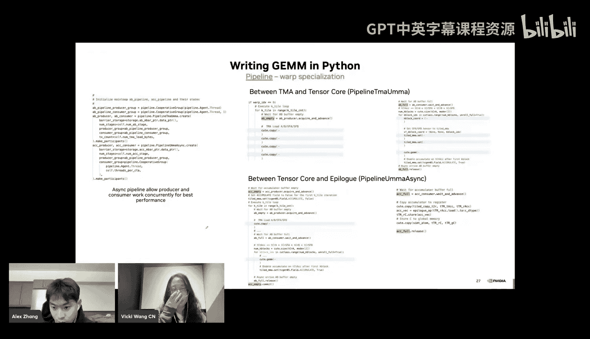

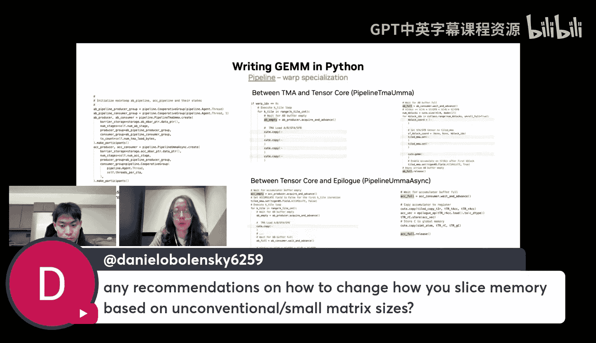

### 优化思路
对于竞赛参与者，可以从以下几个方面探索优化：
*   **原子操作尺寸**：根据问题大小选择，避免浪费计算或内存资源。
*   **软件流水线**：将数据拷贝操作与计算操作重叠。理想情况下，计算时数据应已预取到本地内存。
*   **工作组专业化**：利用 TMA 和张量核心指令的异步特性，让不同的工作组负责不同的拷贝和计算任务，提高并发性。
*   **细粒度分块**：在输出阶段（Epilogue）对数据进行子分块，在寄存器中进行逐元素操作，并与共享内存传输并发执行，以优化寄存器使用和共享内存压力。

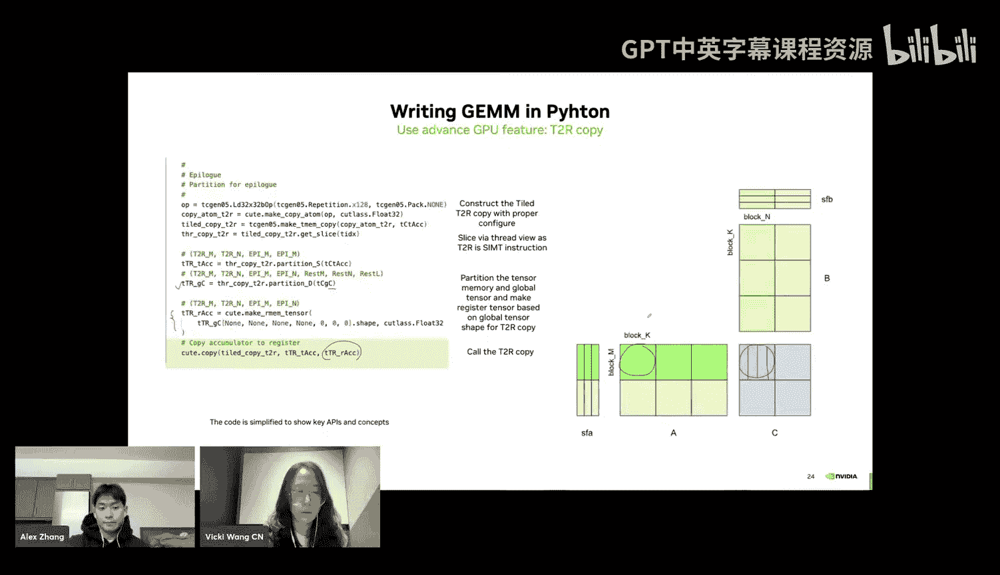

---

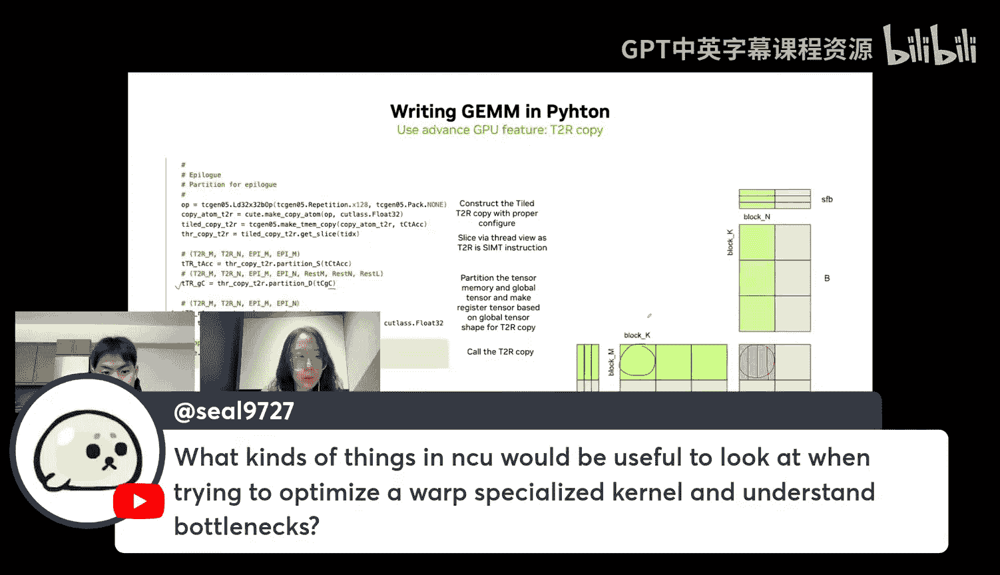

## 示例三：双矩阵乘法（Dual GEMM）
接下来，我们看看双矩阵乘法（Dual GEMM）示例。

双 GEMM 涉及两个 B 矩阵（与 A 矩阵的 K 维度相同），计算得到两个累加结果。在将结果写入全局内存之前，我们对其中一个结果进行激活函数（如 GELU）处理，然后进行逐元素操作。

### Lambda 表达式与张量 SSA
这个示例的关键特性是使用了 **Lambda 表达式**。

内核函数的签名可以包含编译时常量参数和动态参数。动态参数是内核特征，而静态参数是一些可以应用于内核以提高效率的内联函数。这里，我们使用 lambda 函数来说明如何执行激活操作。

同时，**张量 SSA** 的强大功能再次体现：我们可以将寄存器张量加载到向量化操作中，直接应用 GELU 操作，然后进行两个张量 SSA 之间的逐元素乘法。这一切都简化了实现，无需逐个元素管理。

---

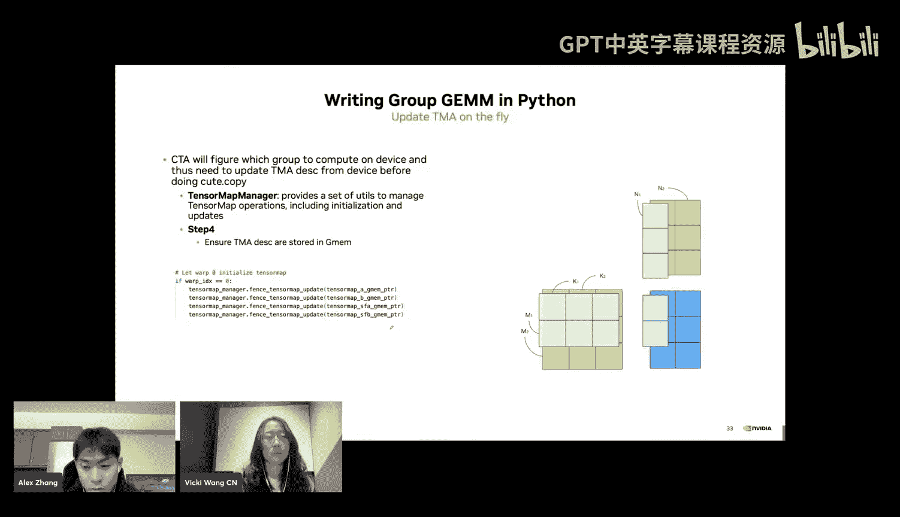

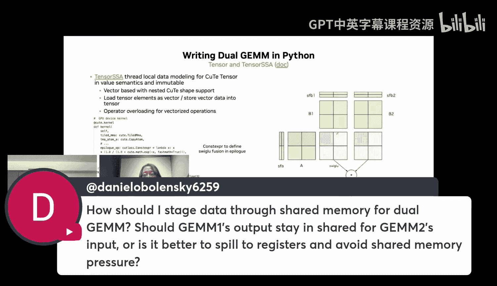

## 示例四：分组矩阵乘法（Grouped GEMM）
本节我们来看最复杂的分组矩阵乘法（Grouped GEMM）示例。

分组 GEMM 包含多组矩阵乘法，每组中的 M 和 K 大小可能不同。代码需要动态计算每个线程块（CTA）要处理的数据。

### 动态 TMA 描述符更新
与之前示例不同，此代码的核心难点在于需要**在线更新 TMA 描述符**。

在代码开始时，每个 CTA 需要根据坐标和问题大小，计算出它属于哪个组以及要计算的数据块。然后，它需要在核函数内部更新 TMA 描述符。

模板中使用了 **TMA 映射管理器** 工具来执行这种动态的张量映射更新。基本流程是：
1.  每个 CTA 确定其所属的组。
2.  使用主机端创建的 TMA 描述符作为模板，在共享内存中构造新的描述符。
3.  用实际的张量信息（在线计算得到）更新该描述符。
4.  将更新后的描述符存回全局内存。
5.  同步确保所有 TMA 映射更新完成。
6.  后续的 TMA 加载、缩放因子加载和张量核心计算步骤与普通 GEMM 类似。

一旦掌握了张量描述符的动态管理，从单个 CTA 的角度看，其余部分与优化后的 GEMM 和 Dual GEMM 非常相似。

---

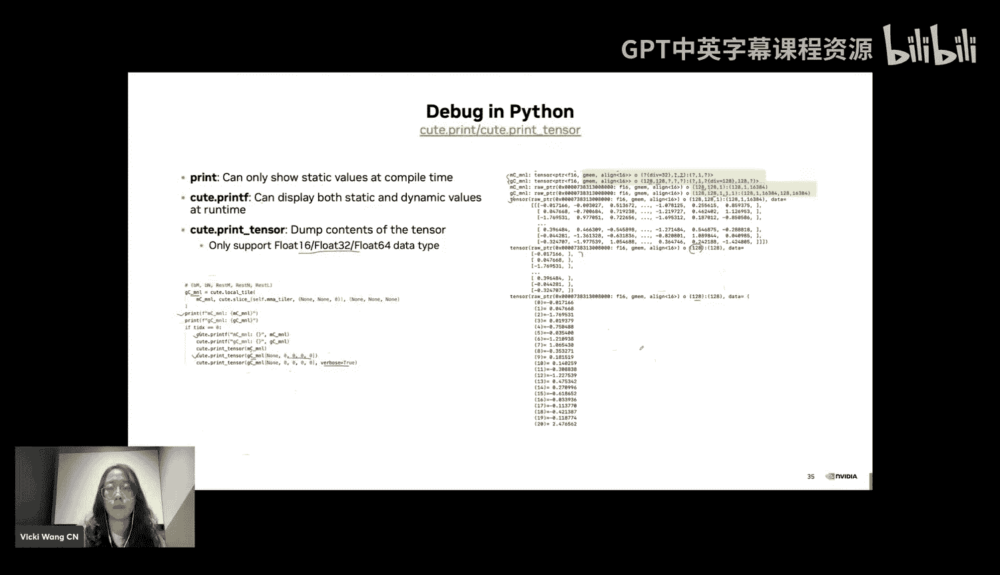

## 其他实用功能
除了核心编程模型，CuTe DSL 还提供了一些其他实用功能来辅助开发和调试。

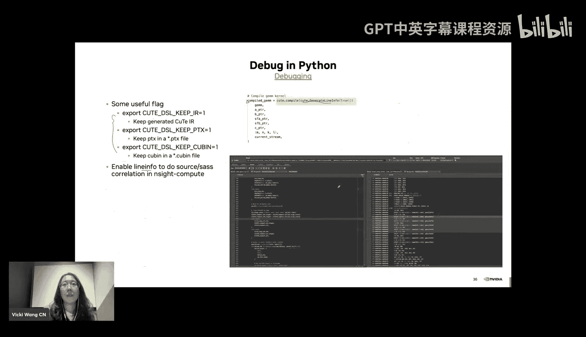

### 编译与缓存
CuTe DSL 支持自定义**缓存键**。由于 DSL 编译时间可能较长，在基准测试时，我们不希望每次都重新编译内核。用户可以自定义一个键来索引缓存。如果内核已在全局缓存中，则无需重新编译。

### 调试打印
调试时，打印功能非常有用。
*   `cute.print_`：打印所有静态信息，运行时变量显示为问号。
*   `cute.print`：在主机端和设备端均可使用，打印运行时参数的值。
*   `cute.print_tensor`：打印张量的内容（支持的数据类型有限）。对于低精度数据，可以先转换为 `float32` 再打印。

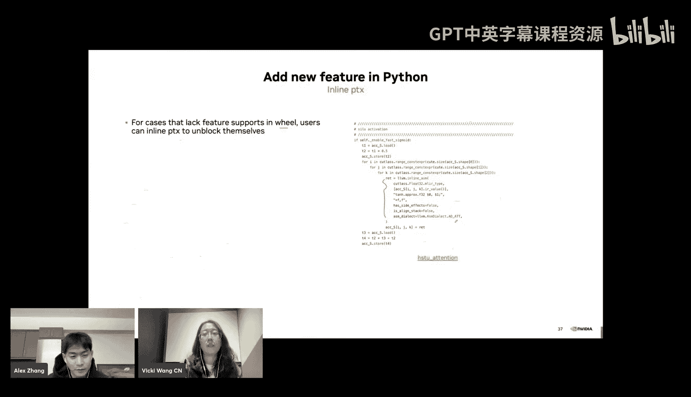

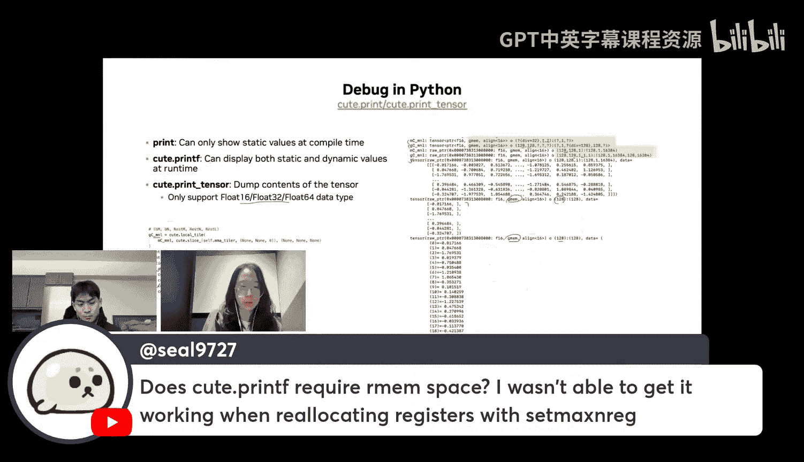

### 内部调试与 PTX 内联
CuTe DSL 还支持生成内部表示以辅助调试。
*   `keep_ir`：可以转储 IR 来检查问题。
*   `lineinfo`：在生成代码中包含源文件信息，便于在性能分析工具中关联源码与汇编指令。
*   **内联 PTX**：如果遇到某些底层优化在 DSL 中尚未支持，熟悉 PTX 语法的用户可以使用内联 PTX 功能来绕过限制。

---

## 总结与资源
本节课我们一起学习了 NVIDIA CuTe DSL 的核心概念和编程方法。

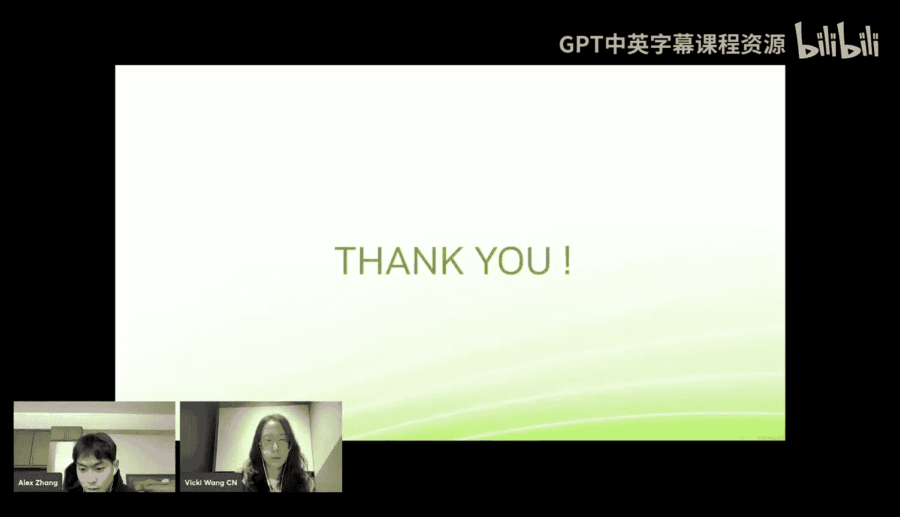


我们回顾了：
1.  CuTe DSL 的设计目标与架构。
2.  通过简单 GEMM 示例，学习了核心装饰器、布局代数、张量 SSA 和控制流。
3.  通过通用 GEMM 优化示例，深入了解了 CuTe 的编程模型和性能优化思路。
4.  了解了 Dual GEMM 和 Grouped GEMM 的特殊处理方式。
5.  掌握了编译缓存、调试打印和内联 PTX 等实用功能。

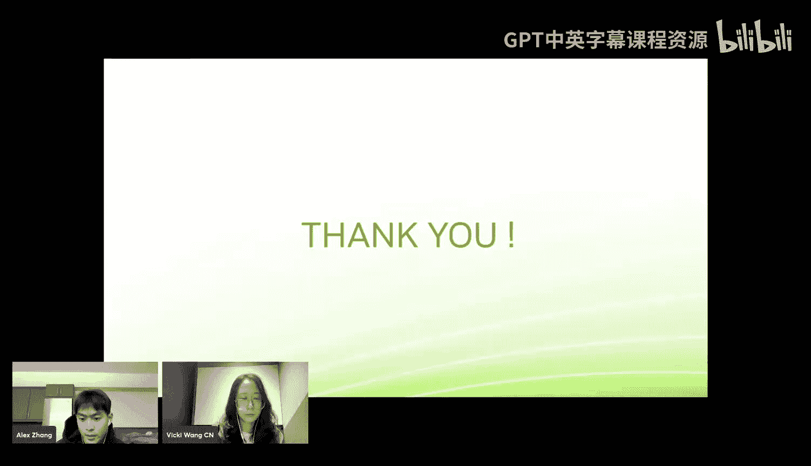

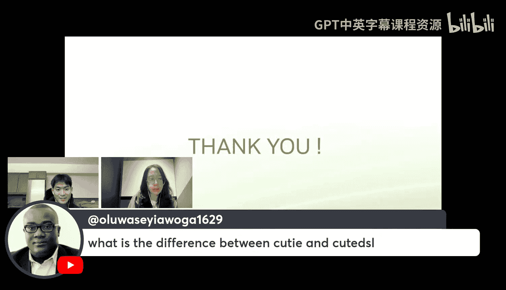

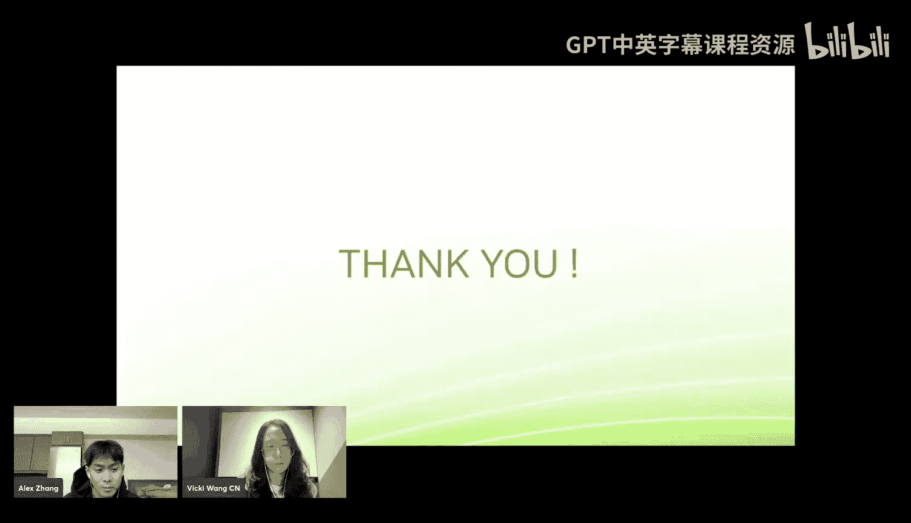

**有用的资源**：
*   CuTe 创始人 Chris 在 GPU MODE 竞赛中的介绍，包含了代数和布局变换的详细细节。
*   CuTe DSL 官方文档，涵盖了本课程提到的大部分功能。
*   GitHub 上的 DSL 示例库，其中许多展示了如何达到接近理论极限的性能。

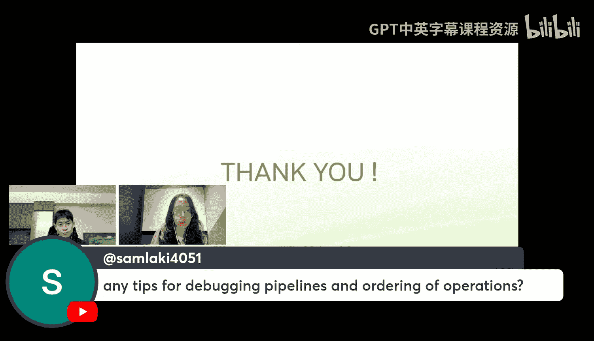


希望本指南能帮助大家在 GPU MODE 竞赛中取得好成绩，并享受使用 CuTe DSL 进行高性能 GPU 编程的旅程。祝大家好运！