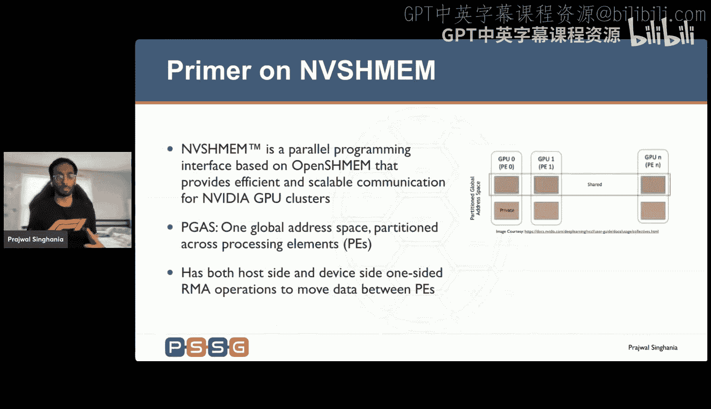
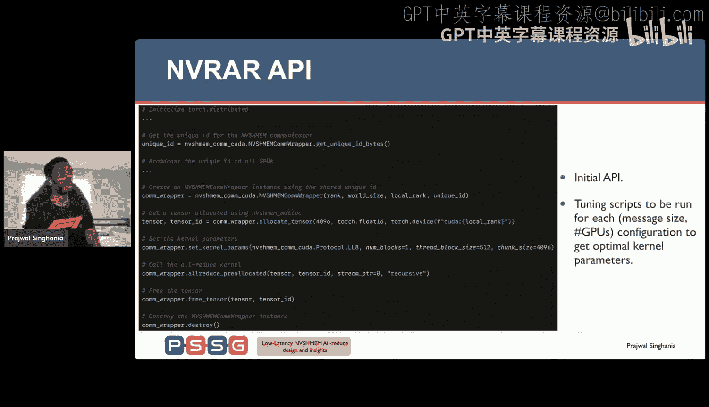
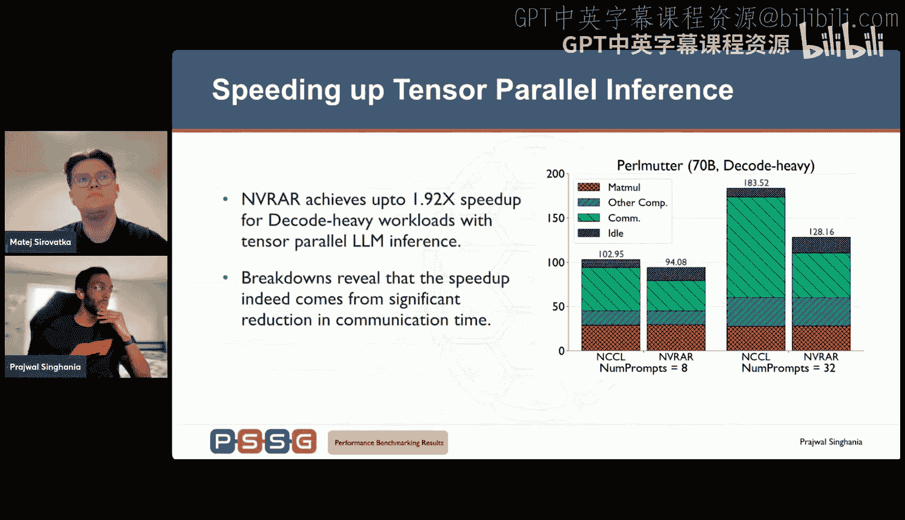
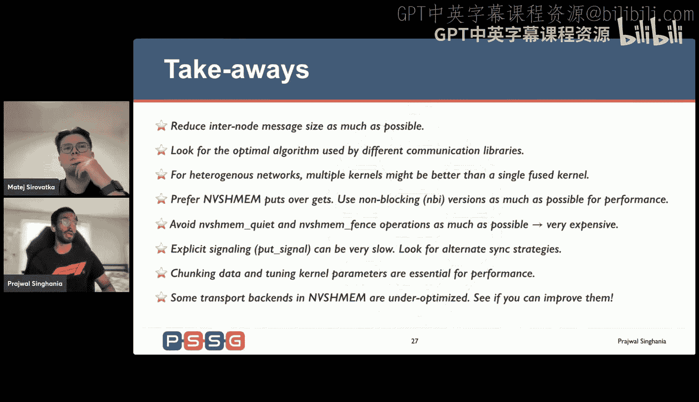
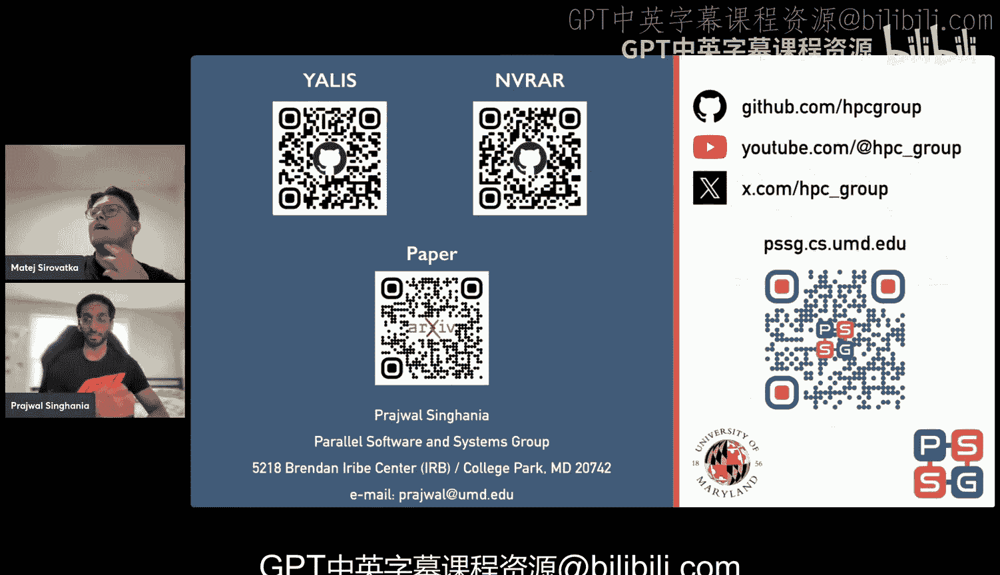

# 34：使用NVSHMEM的低延迟通信内核

在本节课中，我们将学习如何为多节点大语言模型推理设计低延迟的通信内核，特别是针对`all_reduce`操作。我们将探讨现有通信库的性能瓶颈，并介绍一种名为NVR的自定义内核设计，它利用NVSHMEM实现了显著的性能提升。

## 概述

随着大语言模型规模的不断增长，单GPU已无法容纳整个模型，因此必须将模型的计算和参数分布到多个GPU上。这引入了跨节点的通信开销，尤其是在使用张量并行策略时，每层之后都需要进行`all_reduce`操作。本课程将分析这些通信瓶颈，并展示如何通过精心设计的NVSHMEM内核来缓解它们。

## 背景：大语言模型推理与并行策略

大语言模型推理是一个自回归过程，模型逐个生成令牌。传统上，它分为两个阶段：
*   **前缀阶段**：模型并行处理所有提示令牌以生成第一个输出令牌。此阶段计算密集，因为涉及大量矩阵乘法。
*   **解码阶段**：将生成的令牌反馈给模型以生成下一个令牌。此阶段内存密集，因为输入是单个或少量令牌，矩阵乘法变得“瘦高”。

为了在多个GPU上运行大模型，主要有三种并行策略：
1.  **流水线并行**：将模型的层序列分配到不同GPU上。数据在GPU间以点对点方式传递。通常将令牌批次划分为微批次以填充流水线。
2.  **张量并行**：将单个层内的矩阵乘法拆分到多个GPU上。每个GPU计算部分结果，然后在每层之后通过`all_reduce`操作跨GPU聚合结果，这会产生很高的通信量。
3.  **专家并行**：主要用于混合专家模型，本课程主要关注前两种策略。

## 多节点推理的性能瓶颈研究

为什么需要研究多节点推理？并非所有人都拥有配备高速NVLink互联的DGX服务器。在传统的HPC集群中，节点间通常通过速度较慢的网络（如Slingshot或InfiniBand）连接。标准的扩展方式是：在节点内（NVLink域）使用张量并行，在节点间使用流水线并行，这称为混合并行。

然而，我们的性能研究发现，在强扩展（固定工作负载，增加GPU数量）场景下，时间并未按预期减少，反而经常保持不变或增加。特别是在解码密集型工作负载中，混合并行的性能显著劣于跨节点的纯张量并行。

通过深入分析性能跟踪数据，我们发现了两个关键点：
1.  **解码阶段的计算特性**：在解码阶段，矩阵乘法的输入维度`M`（令牌数）很小。在流水线并行中，通过微批次进一步减小`M`，但这对计算时间几乎没有改善，可能是因为矩阵维度低于硬件优化的平铺大小。而在张量并行中，通过分割内部维度`K`（参数维度），计算时间得到了预期的减少。
2.  **显著的通信开销**：在跨节点的张量并行中，`all_reduce`通信时间急剧增加，成为主要瓶颈。

聚焦于解码阶段的通信瓶颈，我们发现`all_reduce`的消息大小通常在几十到几百KB。基准测试显示，在此消息大小范围内，NCCL的性能有时甚至不如未充分优化的MPI实现。我们假设这是因为NCCL仅使用环或树算法，而MPI可能使用了更适合该消息大小范围的递归倍增算法。

## NVR：自定义低延迟All-Reduce内核设计

为了解决上述瓶颈，我们设计了NVR，这是一个基于NVSHMEM的三阶段`all_reduce`内核。

### NVSHMEM简介

NVSHMEM是基于OpenSHMEM模型的并行编程接口，它提供了一个逻辑上共享的全局地址空间。每个处理单元可以直接访问远程PE的内存，通过`put`和`get`等API进行数据移动。NVSHMEM提供了主机端和设备端API。



### NVR的三阶段设计

NVR的设计旨在最小化跨节点通信量，并使用优化的算法。以下是其三个阶段的伪代码概述：



```cpp
// 伪代码：NVR All-Reduce 驱动函数
void nvr_allreduce(void* message, size_t msg_size, int gpus_per_node, int num_nodes) {
    // 阶段 1: 节点内Reduce-Scatter
    // 在单个NVLink域内，将数据规约并分散到节点内的各个GPU上。
    // 这减少了需要跨节点通信的数据量（减少为原来的 1/gpus_per_node）。
    intra_node_reduce_scatter(message, msg_size);

    // 阶段 2: 节点间递归倍增All-Reduce（自定义NVSHMEM设备内核）
    // 跨节点的对应GPU之间，使用递归倍增算法进行规约。
    // 这是性能关键路径，我们为此编写了自定义内核。
    launch_rd_inter_node_kernel(partial_message, msg_size / gpus_per_node);

    // 阶段 3: 节点内All-Gather
    // 将跨节点规约后的部分结果在节点内收集起来，使每个GPU都拥有完整的全局规约结果。
    intra_node_all_gather(final_message, msg_size);
}
```

**设计选择与洞察**：
*   **为何不融合内核？** 在异构网络（节点内NVLink，节点间其他网络）中，为不同域优化的内核启动参数（如线程块大小）可能不同。虽然可以编写一个复杂的融合内核，但分离的内核更易于优化和维护，并且我们仍能获得出色的性能。
*   **为何使用Reduce-Scatter + All-Gather？** 这种设计将跨节点通信量减少了`gpus_per_node`倍，对于延迟敏感的操作至关重要。

### 关键优化技术

除了三阶段设计，我们还实施了多项关键优化以实现高性能。

#### 1. 细粒度同步替代全局同步

在连续的`all_reduce`调用之间，需要确保缓冲区可安全重用。标准的`nvshmem_quiet()`操作成本高昂，因为它会与通信器中的所有PE进行同步。

**我们的优化**：我们为每次`all_reduce`操作分配一个唯一的序列号。每个PE只与其通信对端进行细粒度同步，通过检查远程对端的序列号原子变量来实现。这避免了昂贵的全局`quiet`操作。

#### 2. 高效使用NVSHMEM RMA操作

*   **优先使用`put`而非`get`**：NVSHMEM推荐使用`put`进行数据转移。
*   **使用非阻塞API**：我们使用`nvshmem_put_nbi`等非阻塞操作，允许计算和通信重叠。
*   **选择适当的API变体**：对于基于代理的传输，使用`nvshmemx_putmem_block`（块级API）在节点内场景能获得最佳性能。

#### 3. 数据分块与参数调优

我们引入了两个超参数：
*   **线程块数量**：多个线程块并行处理独立的数据块，允许一个线程块发出`put`请求时，另一个线程块正在对接收到的数据进行规约，实现了计算与通信的重叠。
*   **分块大小**：每个线程块将其负责的数据进一步分块，每块通过一次非阻塞`put`发送。这有助于控制网络注入大小，对性能有巨大影响。我们需要为不同的消息大小和节点配置寻找最优的分块大小和线程块数量。

#### 4. 无信号同步（L风格协议）

使用`put_signal` API进行显式同步在Slingshot等网络上非常慢。

**我们的优化**：我们采用了类似NCCL的L风格协议。我们将需要规约的数据和一个表示数据有效性的标志打包在同一个8字节的有效载荷中发送。由于8字节操作在大多数网络和CPU/GPU架构上是原子的，因此可以保证数据和标志作为一个整体被接收。接收方通过检查标志值（与当前步骤的序列号比较）来判断数据是否有效，然后进行规约。这完全避免了显式的信号API调用。

## 性能评估与总结

我们将NVR集成到我们自研的推理引擎YaLLS中，并进行了性能评估。

**独立微基准测试**：在Pearl Motor（Slingshot网络）和Vista（InfiniBand网络）系统上，NVR在关心的消息大小范围内（约256KB-2MB）显著优于NCCL，速度提升可达1.5倍至3倍。

**端到端推理加速**：在LlaMA 70B和405B模型的多节点推理中，使用NVR替换NCCL的`all_reduce`操作，带来了显著的端到端加速。例如，在32个GPU上运行70B模型，获得了最高1.8倍的加速。性能分析表明，加速主要来自于通信时间的减少，最高可减少50%。




**理论模型**：我们的递归倍增算法具有`O(log N_nodes) * α_inter`的延迟项，而NCCL的树算法为`O(log N_nodes) * 2 * α_inter`。在中等消息大小下，这个因子2的差异会体现为明显的性能差距。

## 主要经验总结

以下是设计高效NVSHMEM通信内核的关键经验：
1.  **最小化跨节点消息量**：通过类似Reduce-Scatter的操作减少需要跨网络传输的数据。
2.  **为消息区间选择最优算法**：研究不同通信库（如MPI）的算法，选择最适合目标消息大小的算法（如对小消息使用递归倍增）。
3.  **考虑异构网络的分核设计**：为不同网络域（节点内/节点间）使用独立优化的内核可能比单一融合内核更简单且高效。
4.  **优先使用Put和非阻塞操作**：遵循NVSHMEM最佳实践，利用计算通信重叠。
5.  **避免昂贵的全局同步**：尽可能用细粒度的同步机制（如基于原子操作的序列号检查）替代`nvshmem_quiet`或`fence`。
6.  **避免显式信号**：探索像L风格协议这样的替代同步策略。
7.  **数据分块与参数调优至关重要**：分块大小和线程块数量对性能有极大影响，需要针对具体配置进行调优。
8.  **注意传输后端优化**：某些NVSHMEM传输后端（如libfabric）可能尚未充分利用硬件特性，性能有待优化。





本节课中，我们一起学习了多节点LLM推理中的通信瓶颈，深入探讨了如何利用NVSHMEM设计和优化自定义的`all_reduce`通信内核（NVR）。通过三阶段设计、细粒度同步、数据分块以及无信号L风格协议等关键技术，NVR在多种HPC集群上实现了比NCCL更低的延迟和更高的端到端推理性能。这些设计原则和优化技巧也为希望使用NVSHMEM编写高性能通信内核的开发者提供了宝贵的参考。