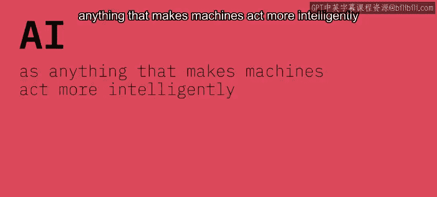
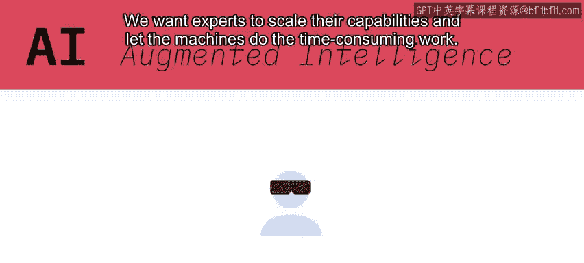
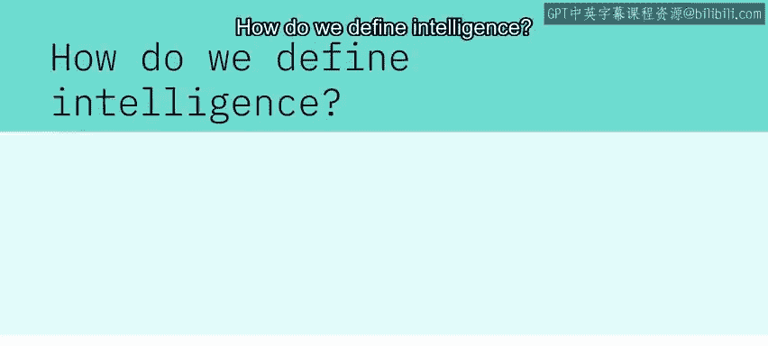
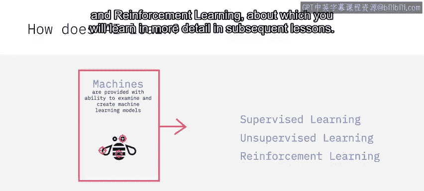
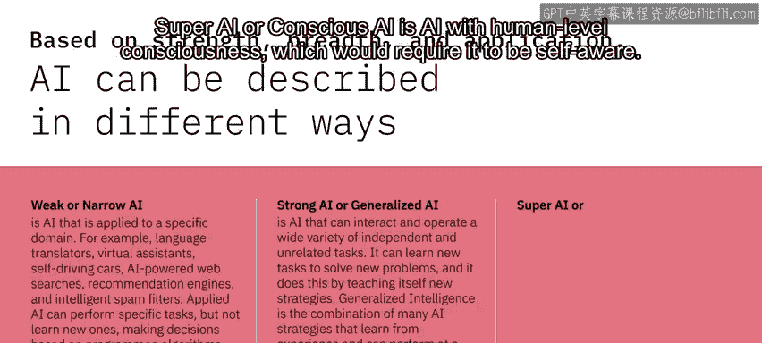
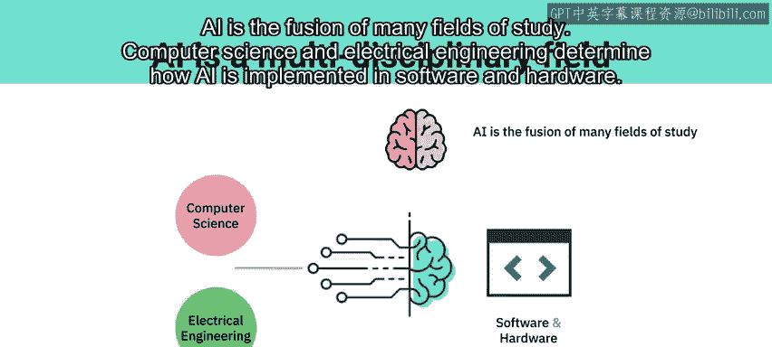
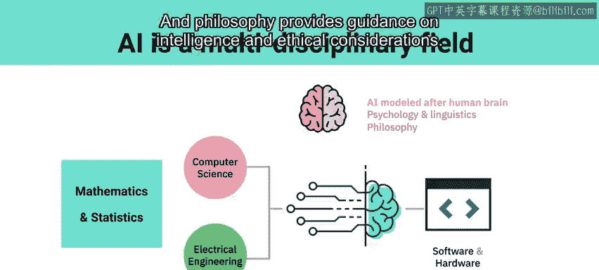
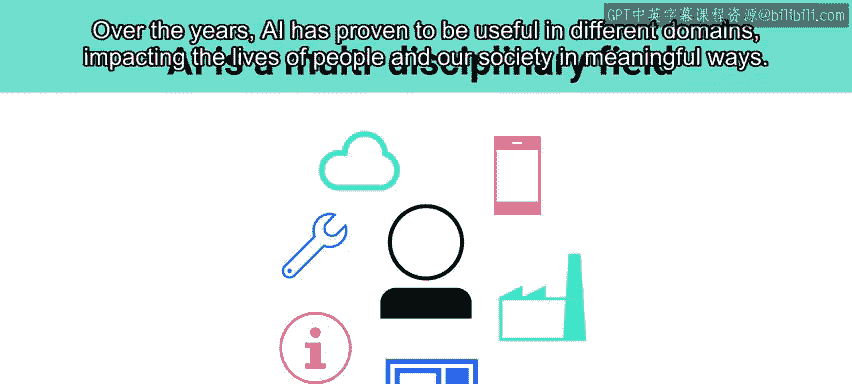

# 001：人工智能简介 🧠

在本节课中，我们将要学习人工智能的基本定义、其学习方式、不同类型的划分以及它背后的多学科融合背景。

---

## 什么是人工智能？🤖

在IBM，我们将人工智能定义为任何能让机器行为更智能的技术。我们倾向于将AI视为**增强智能**。我们认为，人工智能不应试图取代人类专家，而应扩展人类的能力，并完成那些单靠人类或机器都无法独立完成的任务。

互联网让我们能更快地获取更多信息。分布式计算和物联网产生了海量数据，而社交网络促使其中大部分数据以非结构化形式存在。借助增强智能，我们将领域专家所需的信息置于他们指尖，并用证据支持，以便他们做出明智的决策。我们希望专家能扩展他们的能力，并让机器去处理耗时的工作。

---

## 如何定义智能？💡

人类拥有与生俱来的智能，这种智能支配着我们身体的每一项活动。正是这种智能，使得一颗小橡子能长成参天橡树，一个单细胞生物能发育成一头大象。

那么，人工智能如何学习呢？

---

## 人工智能如何学习？📚

机器唯一的“先天智能”是我们赋予它们的。我们赋予机器能力，使其能够检查示例，并根据输入和期望的输出创建**机器学习模型**。

我们通过不同的方式实现这一点，例如：
*   **监督学习**
*   **无监督学习**
*   **强化学习**

你将在后续课程中更详细地了解这些学习方式。

---

## 人工智能的类型 🗂️

根据其能力强度、广度及应用，人工智能可以以不同方式进行描述。

**弱人工智能或狭义人工智能**是指应用于特定领域的人工智能。例如：
*   语言翻译器
*   虚拟助手
*   自动驾驶汽车
*   人工智能驱动的网络搜索
*   推荐引擎
*   智能垃圾邮件过滤器

应用型人工智能可以执行特定任务，但无法学习新任务。它根据编程算法和训练数据做出决策。

**强人工智能或通用人工智能**是指能够交互并执行各种独立且不相关任务的人工智能。它可以学习新任务以解决新问题，并通过自我教授新策略来实现这一点。通用智能是多种AI策略的结合，这些策略能从经验中学习，并能达到人类水平的智能。

**超级人工智能或意识人工智能**是指具有人类意识水平的人工智能。这将要求它具有自我意识。由于我们尚无法充分定义意识是什么，在可预见的未来，我们不太可能创造出有意识的人工智能。

---

## 人工智能的多学科融合 🔗

人工智能是许多研究领域的融合。

*   **计算机科学和电气工程**决定了人工智能如何在软件和硬件中实现。
*   **数学和统计学**决定了可行的模型并衡量性能。
*   由于人工智能是基于我们对大脑工作方式的理解而建模的，**心理学和语言学**在理解人工智能如何工作方面发挥着重要作用。
*   **哲学**则为智能和伦理考量提供了指导。

虽然科幻版本的人工智能可能还很遥远，但我们已经看到越来越多的人工智能参与到我们日常的决策中。多年来，人工智能已被证明在不同领域都很有用，以有意义的方式影响着人们的生活和我们的社会。

---

## 总结 📝

本节课中，我们一起学习了人工智能的核心概念。我们了解到，IBM将AI视为增强人类能力的工具。我们探讨了智能的定义、AI通过机器学习模型进行学习的方式，并区分了弱AI、强AI和超级AI等不同类型。最后，我们认识到人工智能的实现离不开计算机科学、数学、心理学等多学科的交叉融合。人工智能已深入日常生活，并持续对社会产生积极影响。