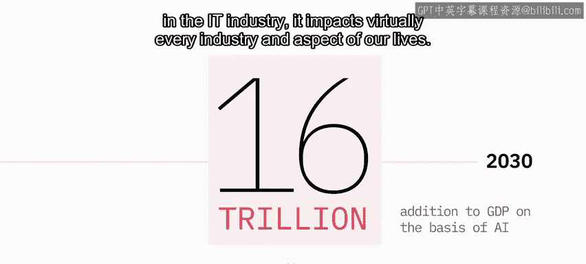
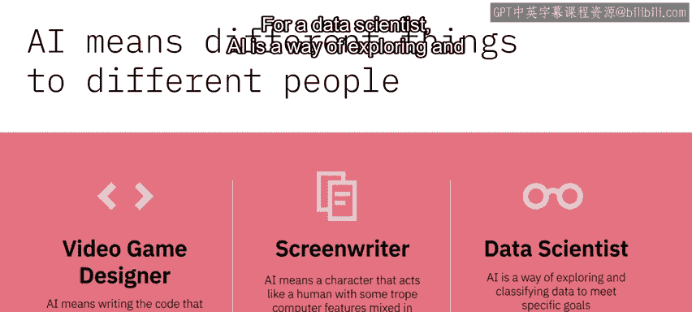
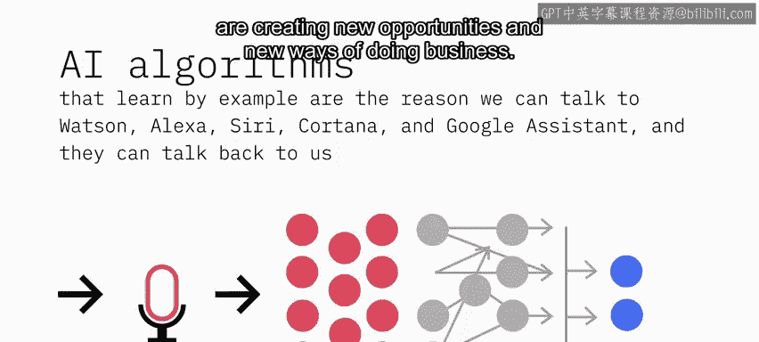
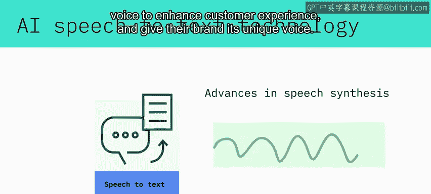
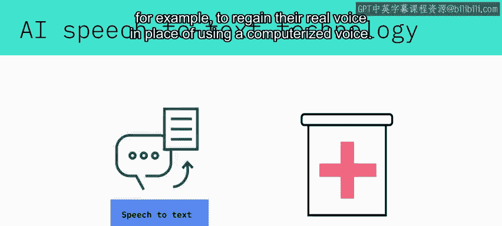
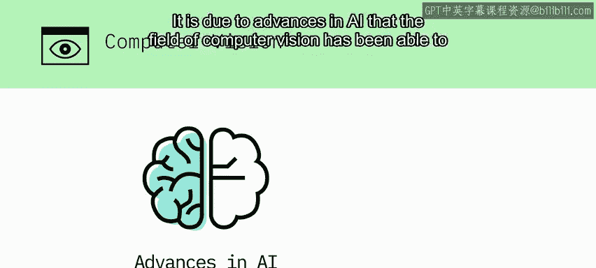
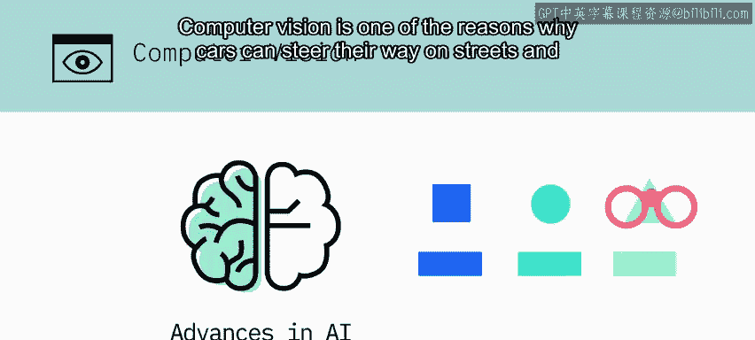
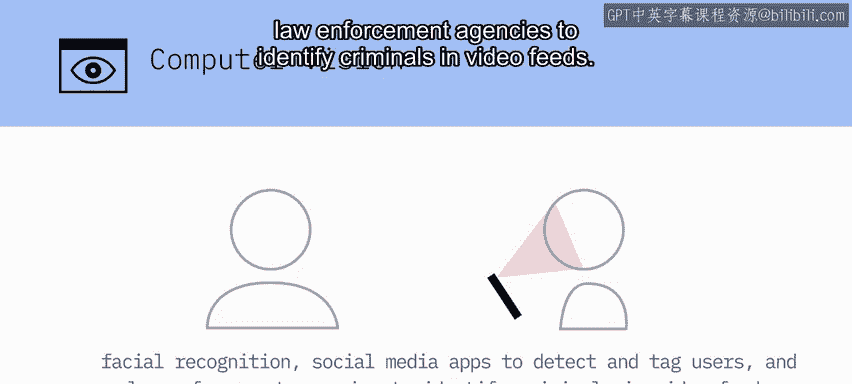
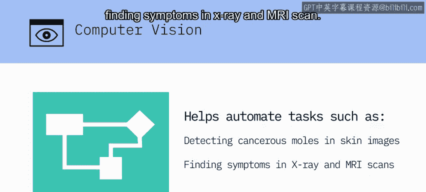
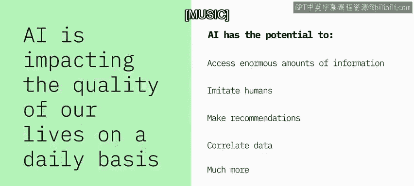

# 005：AI的影响与示例 🤖

在本节课中，我们将探讨人工智能（AI）对全球经济、各行各业以及我们日常生活的深远影响，并通过具体示例了解AI在不同领域的应用。

---

人工智能将持续存在，并有望改变世界的运作方式。普华永道的一项研究预测，从现在到2030年，基于AI的技术将为全球GDP增加**16万亿美元**。这是前所未有的经济影响规模，且影响范围不仅限于IT行业，几乎触及了每个行业和我们生活的方方面面。

不同的人对AI有不同的理解。对视频游戏设计师而言，AI意味着编写影响游戏机器人行为以及环境如何对玩家做出反应的代码。对编剧而言，AI意味着塑造一个行为像人类、又混合了计算机特征的角色。对数据科学家而言，AI是一种探索和分类数据以实现特定目标的方法。

上一节我们了解了AI的广泛定义，本节中我们来看看AI如何通过具体技术改变人机交互。

## 自然语言处理的应用 🎤

通过示例学习的AI算法，是我们能够与Watson、Alexa、Siri、Cortana和Google Assistant等智能助手对话，并让它们回应我们的原因。AI的自然语言处理（NLP）和自然语言生成（NLG）能力，不仅使机器和人类能够相互理解和互动，还创造了新的商业机会和运营方式。

以下是基于自然语言处理的聊天机器人在几个关键领域的应用示例：

*   **医疗保健**：用于询问患者病情并进行类似真实医生的基本诊断。
*   **教育**：为学生提供易于学习的对话界面和按需在线辅导。
*   **客户服务**：通过现场解决查询来改善客户体验，并释放客服人员的时间来处理更有价值的对话。

## 语音技术的进步 🗣️

AI驱动的语音转文本技术进步使得实时转录成为现实。语音合成技术的进步，则让公司能够使用AI语音来增强客户体验，并赋予其品牌独特的声音。

在医学领域，这项技术正在帮助患者，例如肌萎缩侧索硬化症患者，重新获得他们真实的声音，而不是使用计算机合成的声音。

## 计算机视觉的突破 👁️

正是由于AI的进步，计算机视觉领域才能够在与检测和标记物体相关的任务上超越人类。计算机视觉是汽车能够在街道和高速公路上行驶并避开障碍物的原因之一。

计算机视觉算法能够检测图像中的面部特征，并将其与面部特征数据库进行比较。这使得消费类设备能够通过面部识别来验证机主身份，社交媒体应用能够检测并标记用户，执法机构能够在视频流中识别罪犯。

计算机视觉算法正在帮助自动化诸如在皮肤图像中检测癌性痣、或在X光和MRI扫描中发现症状等任务。

## AI的日常与深远影响 💡

AI正日益影响我们的生活质量。我们的Netflix推荐、导航应用、邮箱垃圾邮件过滤以及重要事件提醒中都有AI的身影。

AI在幕后监控我们的投资、检测欺诈交易、识别信用卡欺诈并预防金融犯罪。

AI正以显著的方式影响医疗保健，帮助医生做出更准确的初步诊断、解读医学影像、为患者寻找合适的临床试验。它不仅影响着患者的治疗结果，也使运营流程成本更低。

AI有潜力访问海量信息、模仿人类甚至特定个体、提出关于健康和财务的变革性建议、关联可能侵犯隐私的数据，以及实现更多功能。

---

本节课中，我们一起学习了人工智能带来的巨大经济影响，并深入探讨了其在自然语言处理、语音技术和计算机视觉等核心领域的具体应用。我们看到，AI已渗透到娱乐、医疗、金融、安防等众多行业，并持续改变着我们的日常生活与工作方式。理解这些影响和示例，是认识AI价值与潜力的重要一步。