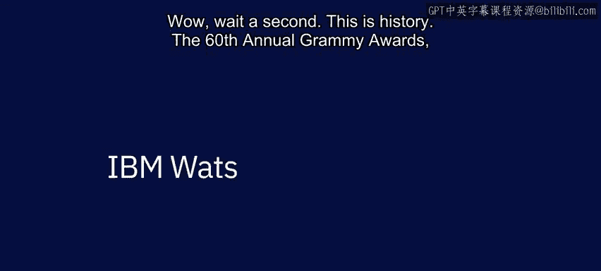
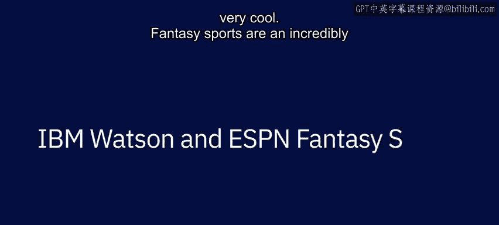

# 009：IBM的著名AI应用案例 🏆

在本节课中，我们将了解IBM Watson人工智能系统在几个真实世界中的著名应用。这些案例展示了AI如何分析复杂数据、理解人类语言与情感，并辅助专业决策。

---

## Watson在《危险边缘》游戏中的胜利 🎮

上一节我们介绍了AI的基础概念，本节中我们来看看IBM Watson早期的一个里程碑式成就——在智力竞赛节目《危险边缘》中战胜人类冠军。

我记得那天早上去实验室时在想，这就是最后一场《危险边缘》比赛了。当音乐响起，约翰尼·吉尔伯特宣布“来自纽约约克敦高地的IBM研究院，这里是《危险边缘》”时，这一切对我而言变得无比真实。这一天是所有工作的 culmination。说实话，我当时很激动。

**核心交互示例：**
```
主持人提问: "这个1920年代的流行舞蹈以‘踢’动作为特征。"
Watson回答: "What is the Charleston?"
主持人: "正确。"
```

比赛过程并非一帆风顺。Watson一度取得领先，但也答错了一些问题。例如，它将“leg”和“1920s”作为答案，但都被判定为错误。然而，它最终成功答对了关键问题，例如“什么是禅宗？”，从而与人类选手布拉德战平，并最终赢得了比赛。

他们完全有理由为自己所做的事感到自豪。我曾以为这样的技术还需要多年才能实现，但它现在已经到来了。我认为我们今天看到了重要的一步。哇，等等，这是历史性的时刻。



---

## AI赋能格莱美奖：时尚与情感分析 🎵

在见证了Watson的语言理解能力后，我们来看看它如何被应用于充满创意与情感的娱乐产业。

第60届格莱美奖由IBM Watson提供技术支持。在格莱美周日，我们需要处理海量的非结构化数据。我们与录音学院的合作，重点在于帮助他们优化数字内容生产的工作流程。

我的内容团队不仅负责接收所有原始素材，还要对其进行策展和发布。这包括长达五小时的红毯报道，涉及5,000名艺术家和超过100,000张照片。

以下是Watson在格莱美奖中的两项核心分析工作：

1.  **时尚趋势分析**：Watson利用AI分析每一套经过红毯的服装的颜色、图案和轮廓。我们得以洞察所有主导风格，并将其与往届格莱美秀场进行对比。
2.  **歌词情感分析**：Watson还分析了过去60年来格莱美提名歌曲的歌词情感。它能够识别音乐中的情感主题，并将其分类为喜悦、悲伤等不同类别。这非常酷。



---

## ESPN梦幻足球：数据驱动的决策助手 🏈

从娱乐产业转向体育领域，AI同样能提供强大的决策支持。本节我们将探讨Watson如何帮助数百万体育迷进行更明智的抉择。

梦幻体育是我们服务体育迷的一种极其重要且有趣的方式。我们的梦幻游戏极大地促进了ESPN数字平台的流量，并拉动了赛事和演播室节目的收视率。

但我们的用户有很多方式可以消磨时间，因此我们必须持续改进游戏，以吸引他们选择与我们共度时光。今年，ESPN与IBM合作，为其梦幻足球平台增加了一项强大的新功能。

梦幻足球产生了海量的内容，包括文章、博客、视频、播客，我们称之为非结构化数据，即那些无法整齐放入电子表格或数据库的数据。而Watson正是为分析这类信息并将其转化为可用见解而构建的。

我们使用数百万篇梦幻足球故事、博客文章和视频来训练Watson。我们教会它：

*   为数千名球员开发一个得分范围，评估他们的上升空间和下行风险。
*   估算球员表现超过其上升空间或低于其下行风险的概率。
*   甚至评估球员的媒体热度及其上场可能性。

**核心价值公式：**
`玩家决策收益 = Watson数据洞察 + 专家分析意见 - 不确定性风险`

这对于我们的梦幻足球玩家来说是一个巨大的胜利。它是帮助玩家决定每周让哪位跑卫或四分卫首发的又一个工具，并且是对球迷所信赖的获奖分析师们的绝佳补充。

与任何机器学习系统一样，该系统会变得越来越智能。这意味着洞察会更准确，用户能做出更好的决策，每周都有更好的机会赢得比赛。我们的梦幻玩家越成功，他们花在我们平台上的时间就越多。

ESPN与IBM的合作是一个绝佳的载体，向数百万人展示了企业级AI的强大能力。不难想象，同样的技术如何应用于现实生活。在商业场景中，有成千上万的场合需要评估价值和权衡取舍。这就是未来决策的模样：人与机器协同工作，评估风险与回报，共同处理艰难的决定。IBM正是运用同样的技术来帮助医生挖掘数百万页的医学研究，以及帮助投资银行发现影响市场的洞察。

---

## 总结

本节课中我们一起学习了IBM Watson人工智能系统的三个著名应用案例。我们看到，从在《危险边缘》中展示的深度语言理解，到格莱美奖中的视觉与情感分析，再到ESPN梦幻足球里的数据挖掘与预测，AI技术已经能够处理复杂的非结构化数据，将其转化为 actionable insights，并最终辅助人类在娱乐、体育乃至医疗、金融等专业领域做出更优的决策。这些案例清晰地揭示了“人机协同”的未来工作模式。