# 011：感知、学习与推理 🤖

在本节课中，我们将要学习**认知计算**的核心概念。我们将了解它与传统计算的根本区别，以及它如何通过模仿人类的认知过程——感知、学习和推理——来处理海量、复杂的信息，从而创造新的价值。

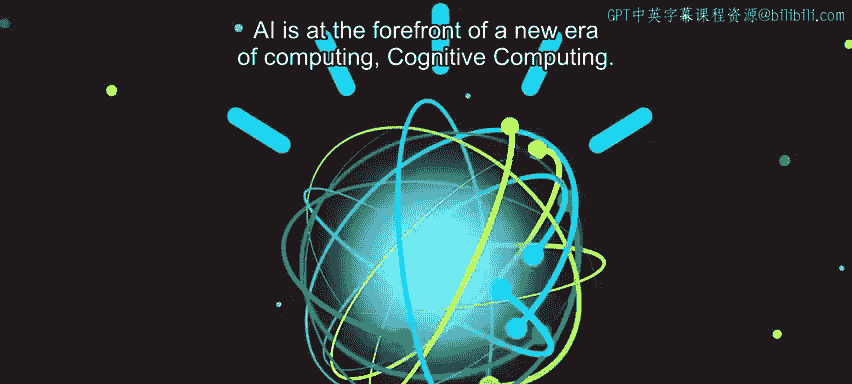

---

## 概述：什么是认知计算？

人工智能正处于一个新时代——认知计算时代的前沿。


这是一种全新的计算模式，它与之前的可编程系统截然不同，其差异之大，就如同那些可编程系统与一个世纪前的制表机之间的区别。

上一节我们提到了人工智能的广阔前景，本节中我们来看看实现这一前景的一种关键技术：认知计算。

---

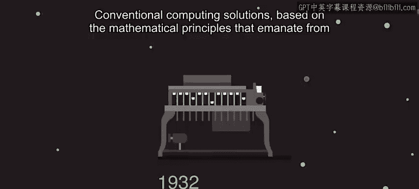

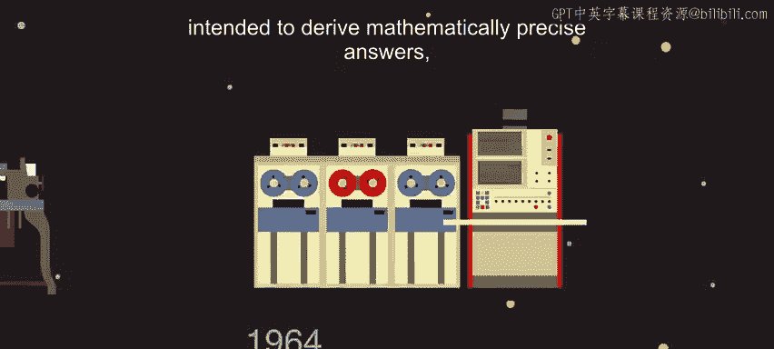

## 传统计算 vs. 认知计算

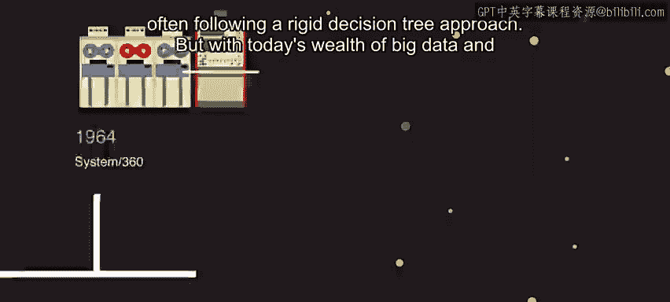

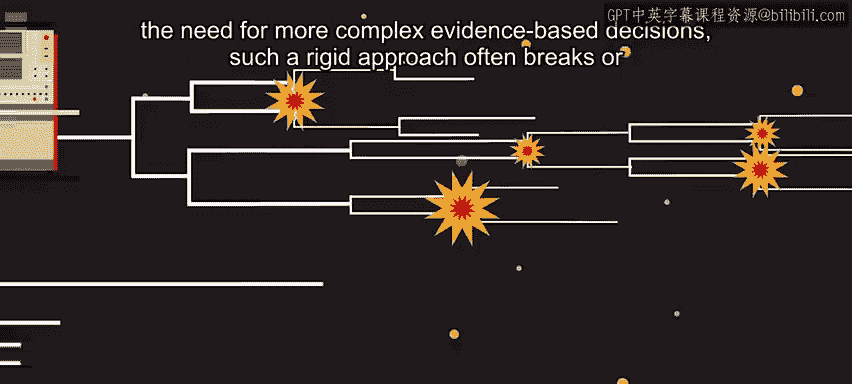

传统的计算解决方案基于20世纪40年代衍生的数学原理。它们依据规则和逻辑进行编程，旨在得出数学上精确的答案，通常遵循**刚性决策树**方法。

**传统计算的核心**可以概括为：
```
if (条件A) {
    执行操作X;
} else if (条件B) {
    执行操作Y;
}
```

然而，面对当今海量的**大数据**以及对更复杂的、基于证据的决策的需求，这种僵化的方法常常会失效，或者无法跟上可用信息的步伐。


认知计算则使人们能够创造一种深刻的新型价值，从海量数据中找出隐藏的答案和洞察。

---

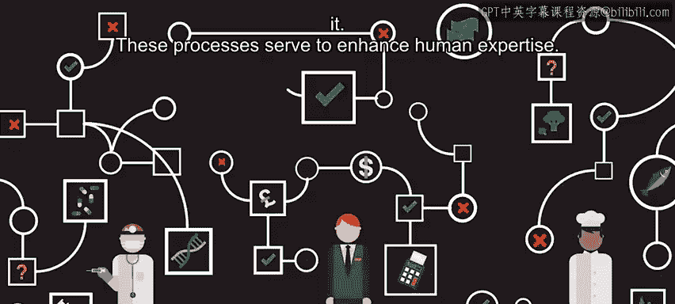

## 认知计算的应用场景

无论是医生诊断病人、理财经理为客户提供退休投资组合建议，还是厨师创造新食谱，他们都需要新的方法来处理日常接触的大量信息，并将其置于具体情境中，从而从中获得价值。


这些过程旨在增强人类的专业知识。

---

## 模仿人类认知过程 🧠

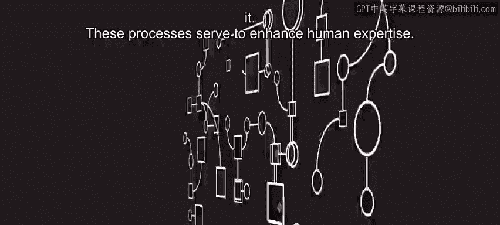

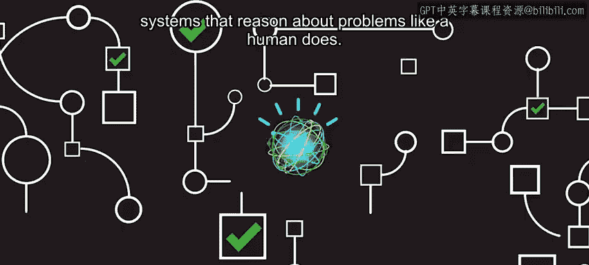

认知计算模仿了人类专业知识的一些关键认知要素。这些系统能像人类一样对问题进行推理。

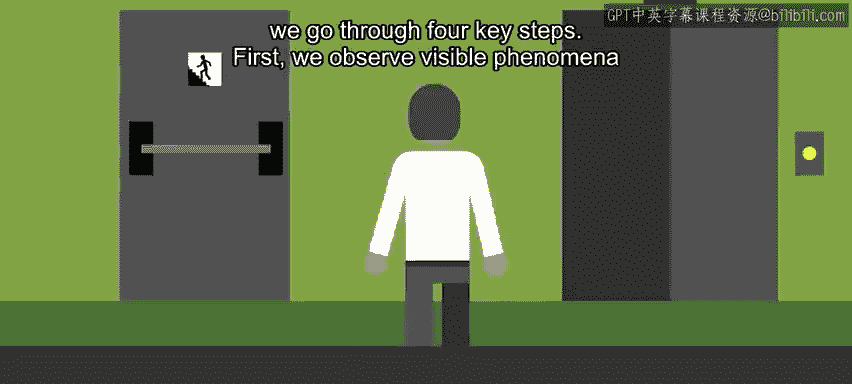


当我们人类试图理解某事并做出决定时，会经历四个关键步骤。以下是这些步骤的详细说明：

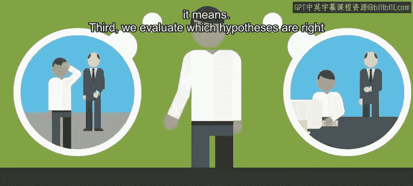

1.  **观察**：我们观察可见的现象和证据体。
2.  **解读**：我们运用已知知识来解读所见，生成关于其含义的假设。
3.  **评估**：我们评估哪些假设是正确的或错误的。
4.  **决策**：我们选择看似最佳的选项并采取相应行动。


正如人类通过观察、评估和决策的过程成为专家一样，认知系统使用类似的过程来推理它们所读取的信息，并且能够以极快的速度和巨大的规模做到这一点。

---

## 处理非结构化数据

与传统计算解决方案不同，认知计算解决方案能够理解**非结构化数据**。

*   **传统计算**：通常只能处理整齐组织的**结构化数据**（例如数据库中存储的数据）。
*   **认知计算**：可以理解**非结构化数据**，这类数据占当今数据的80%，主要是人类为其他人类消费而产生的所有信息。

这包括从文学文章、研究报告到博客文章和推文的一切内容。


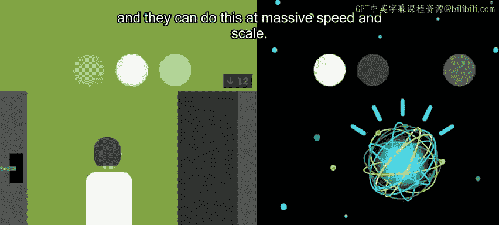
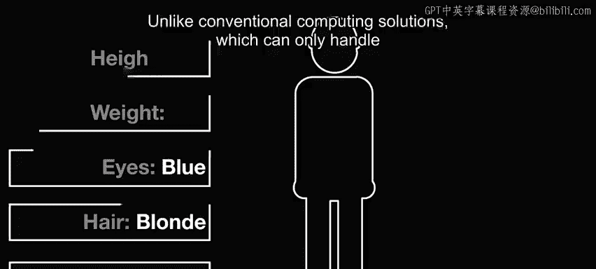
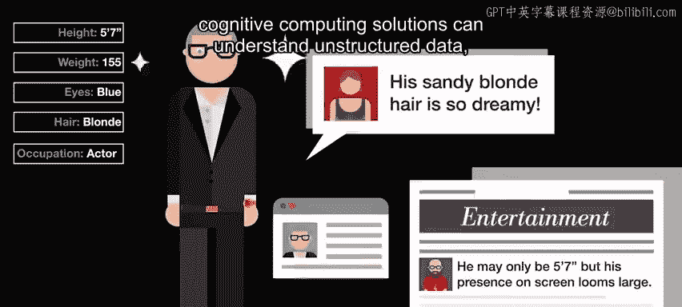
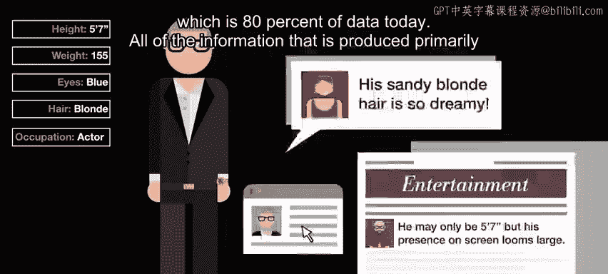
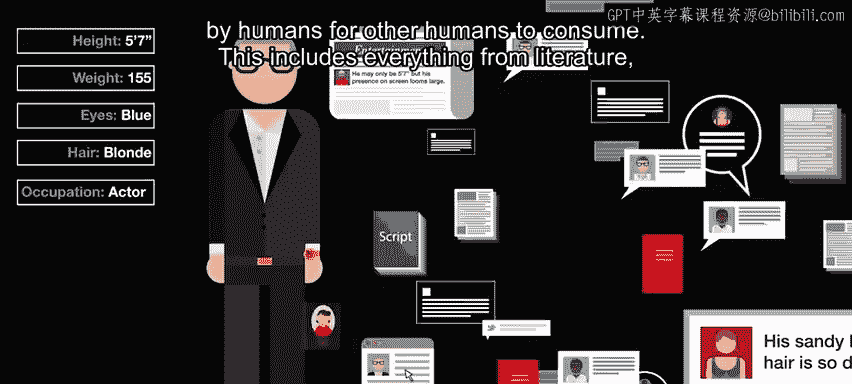
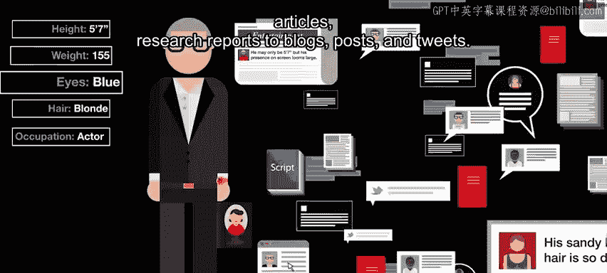


结构化数据由定义明确的字段（包含规范信息）管理，而认知系统依赖于**自然语言**，它受语法、上下文和文化规则的约束。


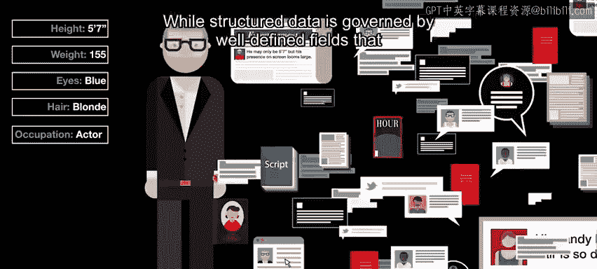


自然语言是隐含的、模糊的、复杂的，处理起来具有挑战性。


虽然所有人类语言都难以解析，但某些习语在英语中尤其具有挑战性。例如，我们可能会因为“下着倾盆大雨”而感到“忧郁”，同时还在填写别人要求我们填写的表格。


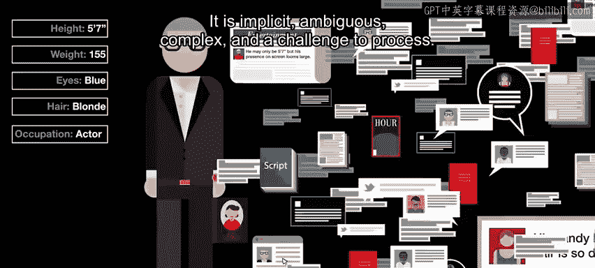


---


## 认知系统的三大核心能力

了解了认知系统处理的数据类型后，我们来看看它的三个核心运作方式。

### 1. 像人一样阅读与解释

认知系统像人一样阅读和解释文本。它们通过从语法、关系和结构上分解句子，从书面材料的语义中辨别含义来实现这一点。


### 2. 理解上下文


这与简单的语音识别非常不同。语音识别是计算机将人类语音转换为一组词语的过程。

而认知系统试图理解用户语言的真实意图，并利用这种理解，通过一系列广泛的语言模型和算法进行推理。

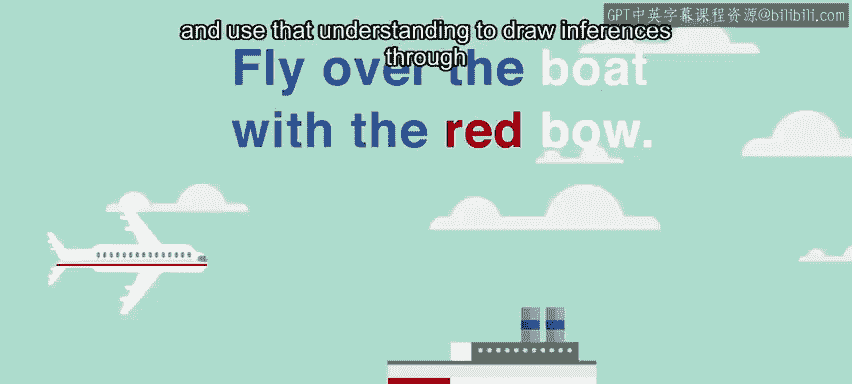

### 3. 持续学习与适应

认知系统会学习、适应并变得越来越智能。它们通过从与我们的互动中，以及从自身的成功和失败中学习来做到这一点，就像人类一样。

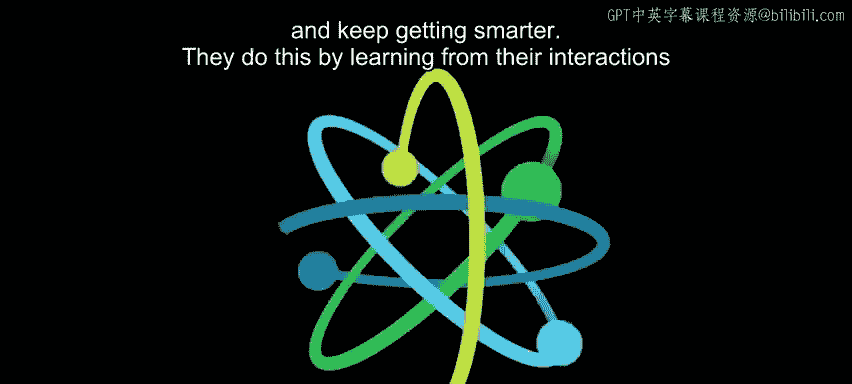
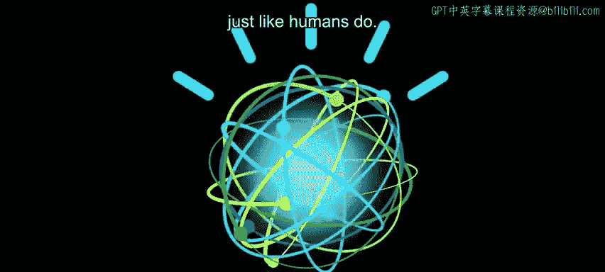

---


## 总结

本节课中，我们一起学习了**认知计算**的核心要义。我们了解到：


*   认知计算是一种全新的计算范式，旨在处理大数据时代的复杂、非结构化信息。
*   它通过模仿人类的**观察、解读、评估、决策**认知过程来进行推理。
*   与传统计算相比，它能理解占数据总量80%的**非结构化数据**（如文本、图像）。
*   认知系统具备三大关键能力：**像人一样阅读解释**、**理解上下文**以及**持续学习与适应**。


认知计算的目标不是取代人类，而是增强人类专家能力，帮助我们从海量信息中发现隐藏的价值和洞察。