# 012：人工智能核心术语与概念解析 🤖

在本节课中，我们将学习人工智能领域中几个紧密相关但含义不同的核心术语：**人工智能**、**机器学习**、**深度学习**、**神经网络**以及**数据科学**。明确这些概念的区别，是深入理解AI工作原理及其应用的基础。

在深入探讨人工智能的工作原理、各种应用场景之前，我们首先需要区分几个紧密相关的术语和概念：人工智能、机器学习、深度学习和神经网络。这些术语有时会被混用，但它们所指的并非同一事物。

## 什么是人工智能？🧠

**人工智能**是计算机科学的一个分支，致力于模拟智能行为。AI系统通常会展现出与人类智能相关的行为，例如：
*   **规划**
*   **学习**
*   **推理**
*   **解决问题**
*   **知识表示**
*   **感知**
*   **运动与操控**
*   以及程度稍弱的**社交智能**和**创造力**


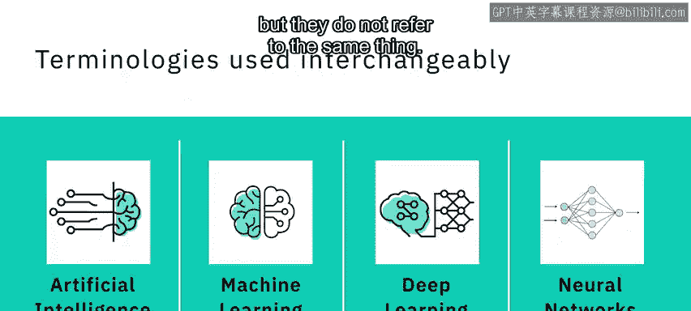

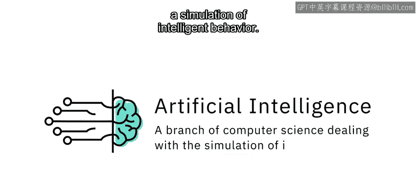


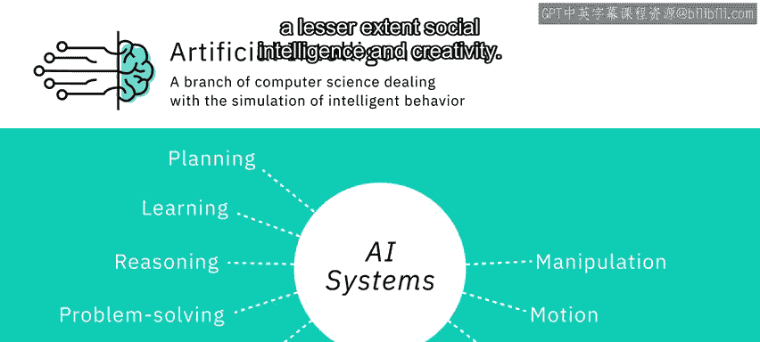


## 什么是机器学习？📈

上一节我们介绍了人工智能的宽泛定义，本节中我们来看看它的一个重要子集。

**机器学习**是人工智能的一个子集，它使用计算机算法分析数据，并根据所学内容做出智能决策，而无需进行显式编程。机器学习算法使用大量数据集进行训练，它们从示例中学习，不遵循基于规则的算法。机器学习使机器能够自主解决问题，并利用提供的数据做出准确预测。

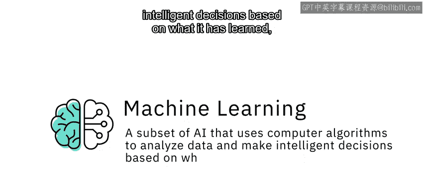

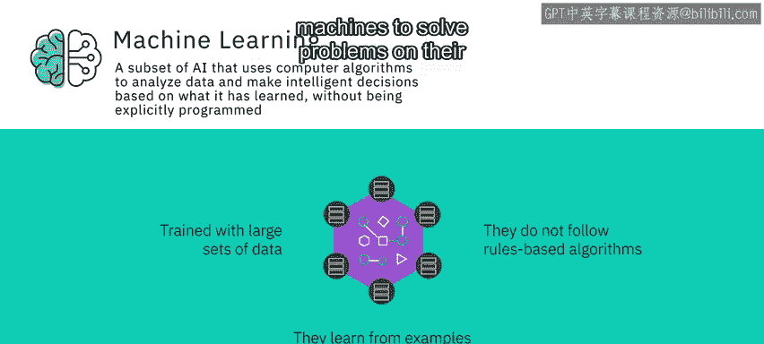

其核心思想可以概括为：让计算机从数据中学习规律，而非直接编写规则。公式可表示为：
**模型 = 算法(数据)**


## 什么是深度学习与神经网络？🔗

理解了机器学习后，我们进一步聚焦于其中一种强大的方法。

**深度学习**是机器学习的一个专门子集，它使用分层的神经网络来模拟人类决策。深度学习算法能够标记和分类信息，并识别模式。它使得AI系统能够在工作中持续学习，并通过判断决策是否正确来提高结果的质量和准确性。

**人工神经网络**（通常简称为神经网络）的灵感来源于生物神经网络，尽管其工作方式有很大不同。AI中的神经网络是由许多称为“神经元”的小计算单元组成的集合，这些神经元接收输入数据，并随着时间的推移学习做出决策。

神经网络通常是多层的、深度的，这也正是“深度学习”名称的由来。与数据量增加时可能达到性能瓶颈的其他机器学习算法不同，深度学习算法会随着数据集体积的增长而变得更高效。

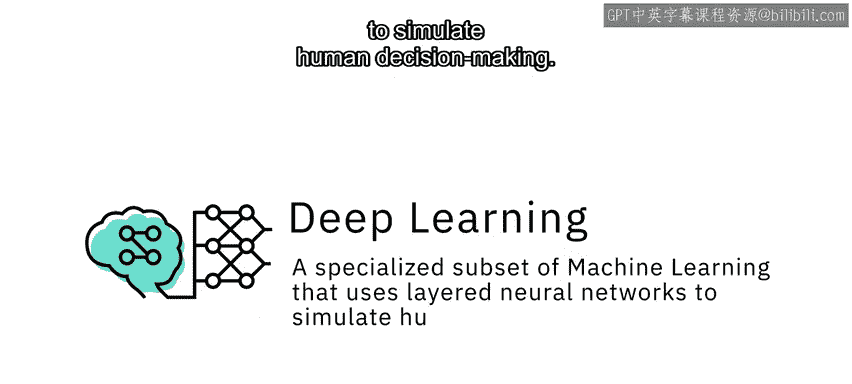

以下是神经网络的一个简化结构示意：
```python
# 伪代码示例：一个简单的神经网络层计算
输出 = 激活函数(权重 · 输入 + 偏置)
```

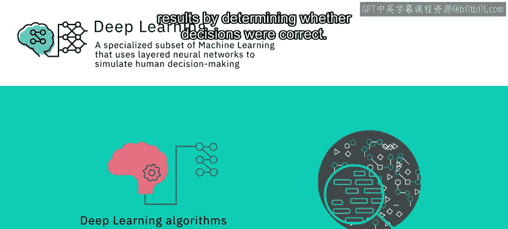

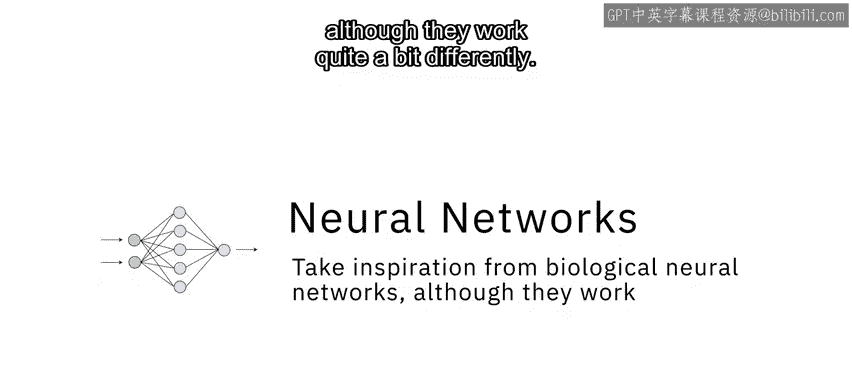

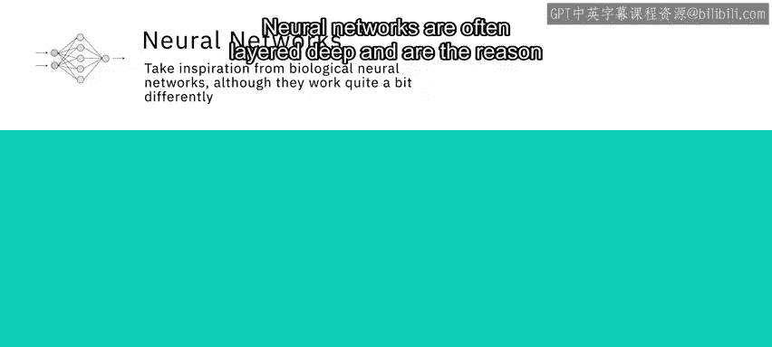


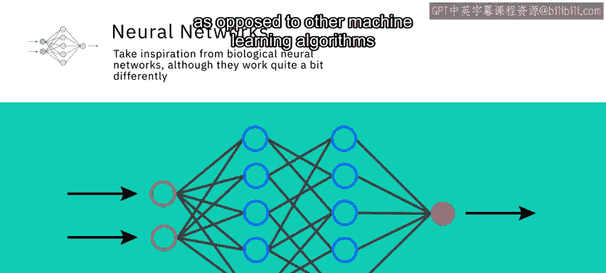


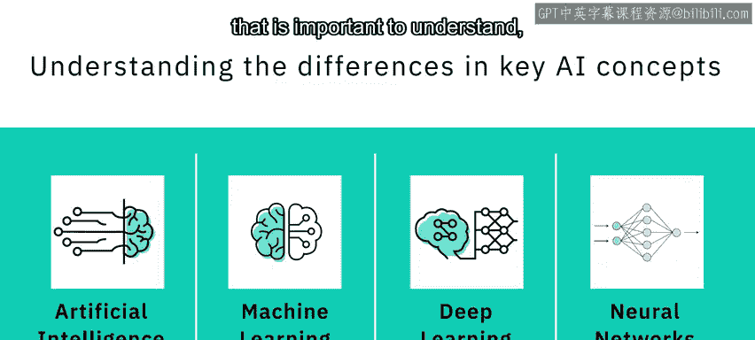

## 人工智能 vs. 数据科学 📊

现在你已经对几个关键AI概念的区别有了大致了解。还有一个重要的区分需要理解，那就是**人工智能**和**数据科学**之间的关系。


**数据科学**是从大量异构数据中提取知识和洞察的过程与方法。它是一个跨学科领域，涉及数学、统计分析、数据可视化、机器学习等。数据科学使我们能够处理信息、发现模式、从海量数据中找到意义，并利用它做出推动业务的决策。

数据科学可以使用许多AI技术从数据中获取洞察。例如，它可以使用机器学习算法甚至深度学习模型从数据中提取意义并得出推论。人工智能和数据科学之间存在一些交叉，但两者并非子集关系。更准确地说，数据科学是一个广义术语，涵盖了整个数据处理方法论；而人工智能则包含了让计算机学习如何解决问题并做出智能决策的一切技术。两者都可能涉及使用**大数据**，即体量巨大的数据集。

在接下来的课程中，术语“机器学习”、“深度学习”和“神经网络”将被更详细地讨论。

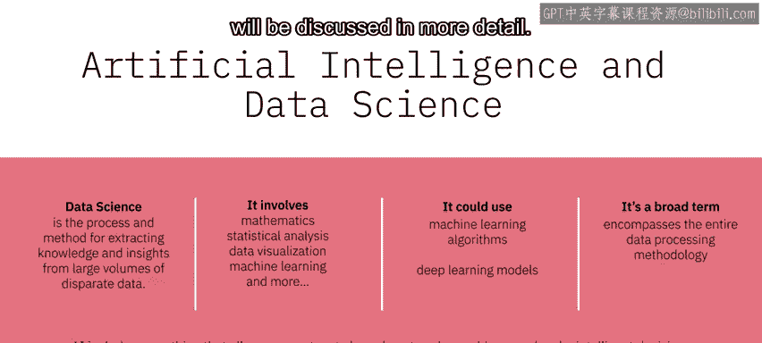

---


本节课中我们一起学习了人工智能领域的核心术语。我们明确了**人工智能**是模拟智能行为的广阔领域；**机器学习**是其子集，让计算机从数据中学习；**深度学习**是机器学习的一种，依靠深层**神经网络**实现复杂模式识别；而**数据科学**是一个更广泛的数据处理方法论，与AI既有交叉又各自独立。理解这些概念的区别与联系，是进一步探索AI世界的重要基石。